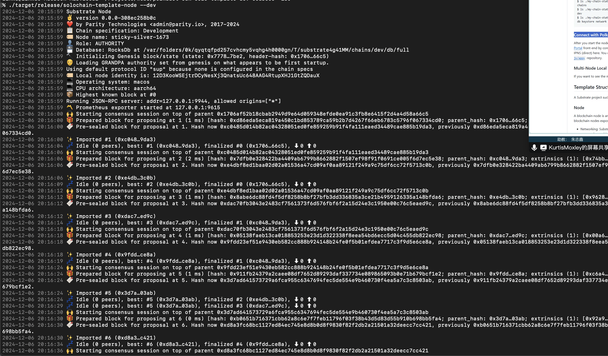
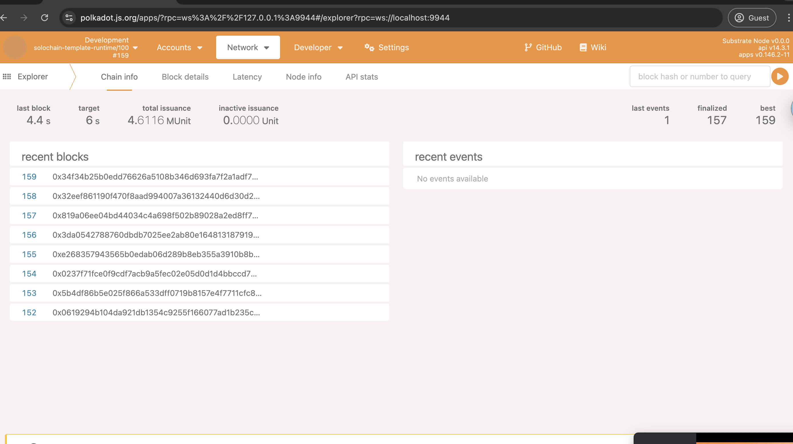
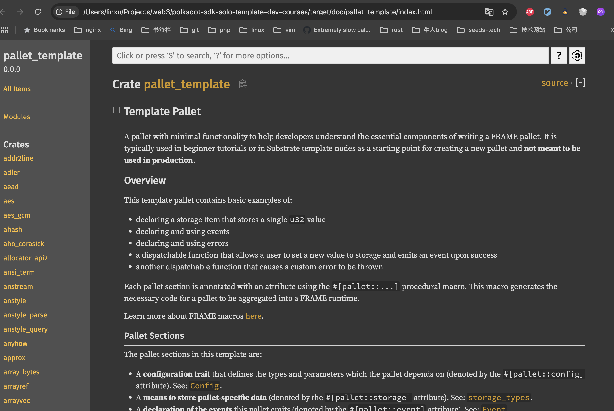

# 阅读比特币白皮书笔记
比特币白皮书由中本聪于2008年发布，提出了一种去中心化的数字货币系统，采用了区块链技术以解决传统电子货币中的双重支付问题。技术上，比特币的核心创新之一就是采用了**UTXO（Unspent Transaction Output 未花费交易输出）模型**，这也是比特币与传统账户模型的一个显著不同之处。通过对UTXO模型的理解，可以更深入地认识比特币如何确保去中心化、可扩展性与交易的安全性。

### **UTXO模型的基本概念**

在传统的账户模型中，每个账户都有一个余额，用户的交易就是余额的转移。而在比特币中，**UTXO模型通过追踪每个“未花费的交易输出”来表示资产的所有权**。每一笔交易都由输入和输出组成：

- **输入（Input）**：表示将某个UTXO的所有权转移给接收方。
通常 input 是由父交易的 output 提供的。首先，并不是所有的交易都有父交易。比如每个区块里面都有一个矿工自己构建的特殊交易，也就是所谓的 coinbase 交易，它就是一个没有父交易的交易，而 coinbase 交易的输入就是 coinbase 。除了这个特例之外，其他的交易都是由父交易的输出来作为输入的。父交易的输出必须是“未消费过”的，也就是从来没有被用于作为其他交易的 input 过。
- **输出（Output）**：表示生成一个新的UTXO，它可以被接收方在未来的交易中使用。
output 是个术语，翻译过来也就是“输出”。在Alice给Bob转账一个比特币的交易中，交易的 output 就是指向Bob的地址的这一个比特币。

UTXO本质上是指一个比特币交易中“未被花费”的部分，代表了一定数量的比特币。每个UTXO都有一个唯一标识符，它可以被消耗，并且其转移需要满足数字签名的验证，确保只有合法的持有者才能使用该UTXO。

我觉得区块链相关的技术，是值得学习和实践的。比特币也只是相关技术的一个应用而已。web3.0必定大放异彩。

# 相关截图

- 节点启动

- web页面截图
注意，如果页面一直pending，考虑用无痕模式或guest模式打开网页

- doc页面
