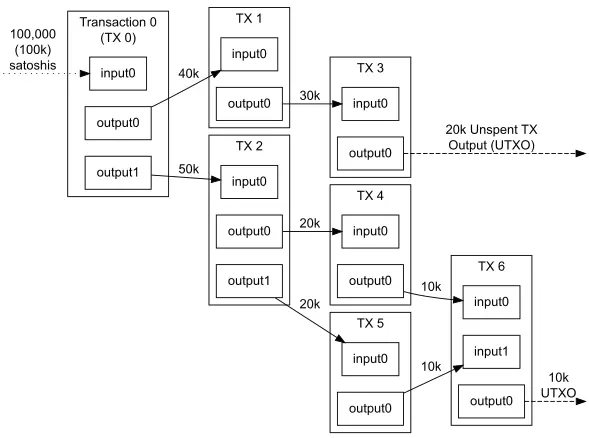

# UTXO模型概述
UTXO模型本质上是一种经济学数学模型。
按它的算法规则，将数字货币的交易记录以UTXO的形式表示，UTXO是比特币交易的最小单位，每笔交易会有多个UTXO及其地址对应而成。UTXO系统将比特币发放记录拆分为许多独立的输出（output），而输入（input）是拆分的UTXO的集合，每一输出包括一个地址和一个数量，当输出与输入地址匹配时，UTXO就会被“花费”，换句话说，UTXO模型就像是一批停止被花费的小币组成，只能重新打包再次被花费。
在UTXO模型中，账本状态其实是由一系列
"有效的输出"组成的，每一个输出都由为对应的私钥所有且自己的"面值"。
所谓有效输出，有三个属性：
1.每个被引用的输入必须有效，且未被使用过。
2.交易的签名必须与每笔输入的所有者签名匹配。
3.输入的总值等于或大于输出的总值。

从图中，可以看出
1 ）每次的输入都是由上次的输入分割而来，所以都是新的，且不存在UTXO为0这种情况。
2）在每次交易之前，都需要拿私钥去签名，如果匹配这笔交易才会发生，但是一般私钥都是保存在钱包里，交易签名都是由钱包自动完成。
3）输入的总值一般是大于输出总值的，会产生交易费。
比特币遵循"找零机制"

如1，我的某个地址上有4个比特币，我想转给小芳3个，那么系统会冻结我这个地址中全部的三个比特币，拿出3个转到小芳提供的地址上，剩下的一个放到去掉手续费之后在返回给我的地址。

例如2, 我想转账给小芳4个比特币，可时我钱包里两个地址上一个只有3个比特币，一个只有2个比特币，都不够，不用担心，钱包会自动冻结这两个钱包里的两个比特币，合并给小芳，并将扣除交易费后的余额返还的一个属于我的地址上。

# UTXO模型特征

1.UTXO模型依赖于账户余额模型，每个地址都可以拥有多个UTXO，每个UTXO对应一个余额；在一段时间内用户地址的余额是由所有针对这个地址的UTXO决定的，UTXO集合由地址拥有者可以通过挑选某些UTXO进行支付，实现货币的运用。
2.UTXO模型有利于比特币的稳定持续发展，UTXO系统以极小的单位（比特币最小的单位是1比特币）表示，这样可以更好省当前的货币余额，对于小额支付也能使用。
3.UTXO模型确保了用户的安全，比如比特币每笔交易的input（输入的UTXO）的数量必须大于等于输出（支付）数量，且绝不会诞生新的发行，使用中保证了比特币金额不会发生溢出和产生新发行，这样可以有效防止金融犯罪，逃避税收等乱象。
# UTXO特点
UTXO的优点：
安全性更高
在UTXO模式中，每次交易都可以生成一个新的地址，即将找零放入到一个新的地址上，这无疑是提高了安全性。
除了第一此次交易之外，所有的input始终都连在某个UTXO的后面，交易无法被重放，且每次交易的先后顺序和连接关系都容易被验证。
对于多签名的交易来说，具有更好的隐私性，因为每没此交易都会产生新的INPUT，可以采用COINJIN这样的技术来增加安全性，
因为UTXO是没有状态的，所以可以并发处理。
缺点：
1）交易若涉及到多个UTXO，需要对他们分别签名，查询时，也要遍历所有相关的UTXO，效率比较低。
2）无法实现一些比较复杂的逻辑，可编程性差。（这也是以太坊没有选择UTXO模式的主要原因。）
# 比特币架构分层
比特币白皮书论述的章节内容分别对应了以下架构层次
1）数据存储层(回收磁盘空间)
2）网络通信层 （网络）
3)共识激励层（工作量证明，激励，时间戳）
4）交易执行层 （交易）
## 数据存储层
数据存储层的数据主要包含用户数据、交易数据、区块数据。
1）用户数据指用来确定比特币所有权的数据，主要用于接受转账的钱包地址和用于对发起转账签名所需的私钥，前者通常是私钥对应的公钥或公钥的哈希值，后者用于确定对钱包地址中比特币的所有权或所有权的转移，可以通过私钥生成密码学签名并用公开钱包地址对应的公钥得到验证。
2）交易数据：用户渐渐完成数字货币所有权转移发送的交易信息，包括交易输入、交易输出和交易单、对交易的签名以及未花费交易输出(unspend transaction output UTXO)
3)区块数据包括区块头、区块提和区块之间的链式结构信息
## 网络通信层
比特币网络中交易的生命周期描述：
1）所有新的交易都会被广播到所有网络节点
2）每个节点收集新的交易保存至区块中
3）每个节点为它的区块寻找工作量证明。
4) 当一个节点找到了工作量证明，就向所有节点广播这个区块。
5) 节点只有在区块内所有交易都是有效的且之前没有被支付的情况下接收这个区块。
6) 节点通过使用这个区块的哈希值作为上一个哈希值，在链中创建下一个区块的方式 表示对这个区块的接受。
## 共识激励层
比特币的共识核心包括工作量证明机制和最长链规则。
### 最长链规则
最长链规则是指：一个诚实的节点总是在其所知的最长工作量证明链基础上尝试完成新的工作量证明，据此挖掘一个新的区块，扩展所知的最长量；最终，当一个区块之后附加了足够多的新区块，那么这个区块就被确认。
### 工作量证明
**中本聪共识工作量证明困难问题**
区块头哈希值小于目标值。BlockHash=SHA256(BlockHeader)<=target
一般来说，区块头中版本号、前一个区块的哈希值、目标值是相对固定的参数。用户通过改变随机数解、交易Merkle数根哈希值、时间戳来寻找工作量证明问题的解。
具体步骤如下：
1）收集网络中验证为正确的未确认交易，添加包括所有交易的交易费和Coinbase交易，形成区块的交易集合。Coinbase交易的输入为空，输出为求解工作量证明困难问题的用户，是对找到困难那问题的用户的奖励，奖励的金额平均每4年减半，首次奖励为50个比特币。
2) 组装交易集合形成交易Merkle树，将Merkle树根写入区块头，填写区块其他元数据，包括运行比特币客户端软件的版本号、前一个区块的哈希值、目标值和时间戳，将随机数初次置为0，计算区块头的哈希值。
   3）比较区块头哈希值和目标值大小，如果不大于目标值，则成功完成工作量证明并向全网广播区块；否则，随机数每次增加1，重新计算区块头的哈希值与目标值比较。
   4）重复执行步骤3），知道找到工作量证明困难的解。（随机数解长为4个字节，共4294967296种可能）
   5）如果经过一段时间的琼剧所有可能的随机树解后仍未找到工作量证明机制的解，则更新时间戳和更新交易集合形成新的Merkle树根，再次穷举随机数解，重复步骤3）直到找到工作量证明困难问题的解。
   **工作量证明难度计算方法**
   工作量证明难度等于目标难度除以当前目标值。![Image [1].png](Image%20%5B1%5D.png)
   其中初始难度的目标值difficulty可以是任意值，比特币设置创世区块难度的目标值为0x1b00ffff,当前目标值(![Image [2].png](Image%20%5B2%5D.png)) 通过上述公式计算。
   工作量证明难度是动态调整旨在保证产生区块的时间大致稳定在10分钟，工作量证明难度每2016个区块满整一次，即约2周调整一次，根据上一轮产生2016个区块的平均时间动态调整难度大小。如果产生区块平均时间小于10分钟，则增加工作量证明难度；如果产生区块链平均时间大于10分钟，则降低工作量证明难度。工作量证明目标调整机制在比特币代码种，新目标值计算方法如下，
   新目标值=旧目标值x过去各区块产生时间(分钟)/(2016块x10f分钟/块)

### 激励
中本聪在比特币系统中设置发行比特币的总数约2100万个，全部由Coinbase交易产生，作为对消耗资源成功出块的工作量证明完成者的奖励。设计的奖励机制为每21万个区块(约4年时间)后激励减半，初始共识激励为50个比特币，依次减半为25个比特币，12.5个比特币、6.25个比特币等。由于工作量证明难度与出块奖励的关系和传统采矿难度与回报的关系类似，通常将比特币的出块或完成其工作量的过程为挖矿，将竞争出块的节点为矿工。

## 比特币交易执行层
比特币节点在网络服务中收到交易信息后，将对交易进行验证。包括交易数据的有效性验证和交易脚本的合法性验证两个方面。
**交易有效性验证**：
1）拒绝数据格式不正确的交易
2)拒绝输入或输出列表为空的交易
3）拒绝尺寸超过块大小限制的交易
4）拒绝交易中输出金额或总金额不在给定范围(如金额为负)的交易。
5）拒绝输入哈希值即先前哈希值(previous output hash)等于0或输入索引即先前输出索引(previouse output hash)为-1的交易。输入哈希值等于0且输入索引为-1的交易为coinbase交易。只在区块中出现，不会在网络中单独出现。
6）拒绝锁定时间(Lock time)大于31字节，或消息小于100字节，或交易签名验证操作大于2次的交易
7）拒绝交易脚本操作不合规的交易
8）拒绝任何交易中的输入与已在交易池中的其他交易输入相同(双重花费)
9)拒绝任何交易中的输入与已在交易池中的其他交易输入相同。
10）在区块链上和交易池中寻找每个交易输入对应的交易输出，如果没有则保存在鼓励交易中(UTXO模型)
11）拒绝少于100个确认的Coinbase交易为输入的交易
12）拒绝交易输入不存在的交易
13）拒绝交易输入值小于输出值的交易
14）拒绝交易费过低的交易。
**交易脚本的合法性验证**：
验证交易发起方是否拥有使用交易输入的权利。
比特币交易类型分为标准类型和非标准类型。
比特币标准交易种类：
1）付款至公钥(pay to pubkey,P2PK)
2)付款值公钥哈希(pay to pubkey Hash, P2PKH)
3)付款至脚本哈希值(pay to script Hash,P2SH)
4)付款至多签(pay to multisig ,MS)
5)付款至空数据（pay to null data, OP_RETURE）
6)付款至见证脚本哈希值（pay to withness script Hash,P2WSH）
7）付款至见证公钥哈希值(pay to withness key hash,P2WPKH)
8)付款至1版见证主根（pay to withness v1 TapRoot）
9)付款至未知见证（pay to witness unkown,P2WUK）

阅读比特币白皮书后，通过查阅其他资料做出了比较详细的总结。

