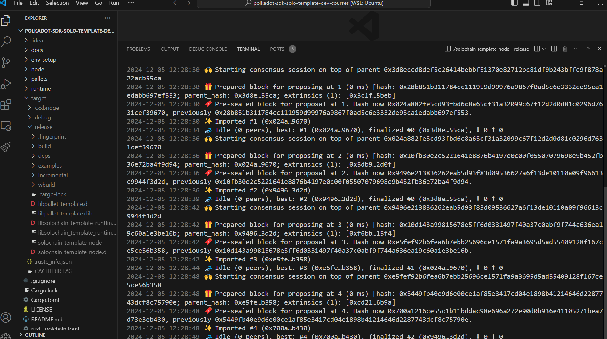
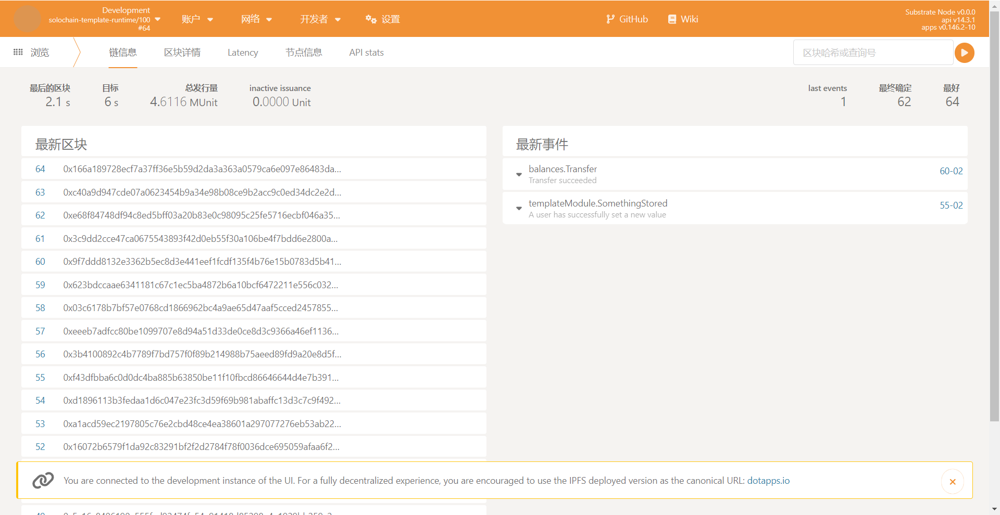

[TOC]

# Homwork-1

## [Task1] 比特币白皮书观后感

《比特币白皮书》深入阐述了比特币的工作原理，重点介绍了去中心化的数字货币系统如何通过区块链技术解决传统货币系统中的信任问题。从技术视角来看，有几个关键要素值得关注：

1. **UTXO交易模型**：比特币采用了未花费交易输出（UTXO）模型，这种模型使得每个比特币交易都是一个独立的、可追溯的账务单位。与账户模型不同，UTXO模型不记录账户余额，而是通过一个个未花费的交易输出（即UTXO）来表示用户持有的比特币。当用户进行交易时，需要将现有的UTXO作为输入，并通过指定新的UTXO作为输出。这个设计使得比特币交易更具透明性和可追溯性，并有效避免了账户重放攻击等潜在问题。

2. **工作量证明（PoW）**：比特币通过工作量证明机制来确保网络的安全性和去中心化。矿工通过不断尝试计算哈希值，找到满足条件的工作量证明，从而获得新增比特币的奖励，并验证新的交易。PoW机制的一个重要特点是它要求矿工投入大量计算资源，使得攻击网络变得非常昂贵。这种机制确保了比特币系统的安全性，因为要改变区块链上的历史记录，攻击者需要重新计算大量的工作量，这几乎是不可能实现的。

3. **交易验证**：比特币交易的验证依赖于全节点的共识机制。当一个交易被提交到网络时，矿工会首先验证交易的有效性，确保发送方拥有足够的比特币（通过UTXO模型）并且交易签名正确。然后，交易被广播到网络，并经过共识机制的确认。工作量证明机制的加入，使得网络对于交易的确认更为稳固，防止了“双花”问题。

从这些核心技术可以看出，比特币不仅是一个数字货币，更是一个分布式系统，通过去中心化的方式构建了一个无需信任第三方的全球支付网络。尽管存在效率和扩展性上的挑战，但它无疑为数字货币和区块链技术的应用奠定了基础，也为后来的技术创新提供了重要参考。

## [Task2] 运行solochain-template-node节点

`./solochain-template-node --dev`

访问 <https://polkadot.js.org/apps/?rpc=ws%3A%2F%2F127.0.0.1%3A9944#/explorer>，发起交易和转账结果

