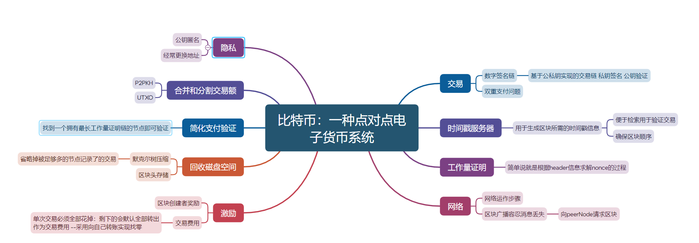
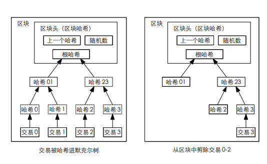
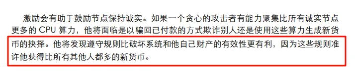

## Merkel Tree

叶子节点为签名后的交易体，签名+公钥验证使得验证容易篡改困难。

利用哈希层层计算得到根节点  能够轻易验证区块是否被篡改

验证交易是否存在只需要根据时间戳找到对应区块 将它的一路下来的所需的哈希/兄弟节点传递过来

重新计算一次哈希即可验证！

## UTXO Unspent Transaction Outputs

包含address value

交易以 UTXO形式表示  有交易才会占用空间（非账户式）

以向自己转UTXO的方式实现找零

交易前需要找到该UTXO的来源 通过P2PKH方式验证资金来源是否正常 --防止double spending

## 乱扯：

1. 去中心化 它真的去中心化吗？

算力决定难道不是另一种中心化吗？从传统的金融霸权转变到算力霸权，曾经不久有一个矿场算力到达了51%吗？

达到算力要求后真的会像所说的遵循规矩会获得更多奖励吗？ 我直接从中本聪账户转钱制造新分支难道不比这快哈哈哈哈哈？

2. 匿名性

这些匿名的确实现了线上难以追查，但还是能够结合线下实现人肉，而且账本还是公开的，反倒成了另一个问题。

当然我们普通人不太会关心这个  我们也不做什么坏事。  所以我更关心如何监管，去中心化的监管方式，让产业不那么灰色哈哈哈哈哈

3. 哈希

出现最多的哈希，但又无法避免有哈希碰撞 这个是不是不那么可靠？

4. 未来会如何结合生产？
5. 金融衍生产品思考？

未产生任何生产力的产品 会不会随着算力/计算机技术发展 失去任何意义？  轻易破解现有密码 快速获得reward。

