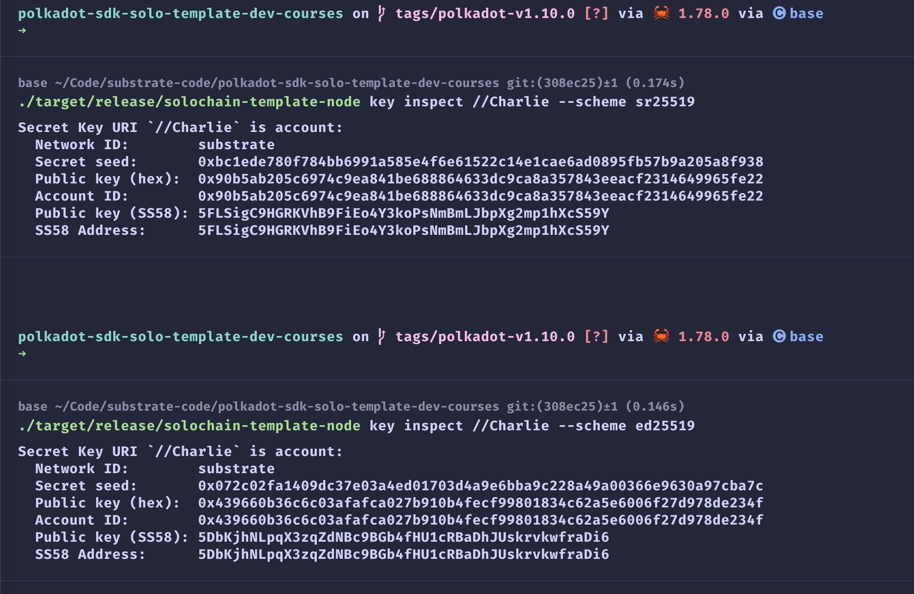

# Homework

## 实操

```shell
git clone https://github.com/papermoonio/polkadot-sdk-solo-template-dev-courses.git


polkadot-sdk-solo-template-dev-courses on  main via 🦀 1.78.0 via 🅒 base 
➜ 
git checkout polkadot-v1.10.0
注意：正在切换到 'polkadot-v1.10.0'。

您正处于分离头指针状态。您可以查看、做试验性的修改及提交，并且您可以在切换
回一个分支时，丢弃在此状态下所做的提交而不对分支造成影响。

如果您想要通过创建分支来保留在此状态下所做的提交，您可以通过在 switch 命令
中添加参数 -c 来实现（现在或稍后）。例如：

  git switch -c <新分支名>

或者撤销此操作：

  git switch -

通过将配置变量 advice.detachedHead 设置为 false 来关闭此建议

HEAD 目前位于 308ec25 Merge pull request #1 from sekisamu/project-init

polkadot-sdk-solo-template-dev-courses on  tags/polkadot-v1.10.0 via 🦀 1.78.0 via 🅒 base 
➜ 
git status 
头指针分离于 polkadot-v1.10.0
无文件要提交，干净的工作区

polkadot-sdk-solo-template-dev-courses on  tags/polkadot-v1.10.0 via 🦀 1.78.0 via 🅒 base 
➜ 
cargo build --release
warning: profile package spec `reed-solomon-novelpoly` in profile `dev` did not match any packages
warning: profile package spec `wasmi` in profile `dev` did not match any packages

 Did you mean `wasi`?
   Compiling solochain-template-node v0.0.0 (/Users/qiaopengjun/Code/substrate-code/polkadot-sdk-solo-template-dev-courses/node)
    Finished `release` profile [optimized] target(s) in 34.85s

polkadot-sdk-solo-template-dev-courses on  tags/polkadot-v1.10.0 via 🦀 1.78.0 via 🅒 base took 35.1s 
➜ 
ls ./target/release/
build                              incremental                        libsolochain_template_runtime.d    solochain-template-node.d
deps                               libpallet_template.d               libsolochain_template_runtime.rlib wbuild
examples                           libpallet_template.rlib            solochain-template-node

polkadot-sdk-solo-template-dev-courses on  tags/polkadot-v1.10.0 via 🦀 1.78.0 via 🅒 base 
➜ 
./target/release/solochain-template-node --dev --tmp
2024-12-06 15:44:04 Substrate Node    
2024-12-06 15:44:04 ✌️  version 0.0.0-308ec258b0c    
2024-12-06 15:44:04 ❤️  by Parity Technologies <admin@parity.io>, 2017-2024    
2024-12-06 15:44:04 📋 Chain specification: Development    
2024-12-06 15:44:04 🏷  Node name: voiceless-spiders-0791    
2024-12-06 15:44:04 👤 Role: AUTHORITY    
2024-12-06 15:44:04 💾 Database: RocksDb at /var/folders/6y/p7tl9yfj1p3cq9hv5z1fpfqh0000gn/T/substrateHfBVeO/chains/dev/db/full    
2024-12-06 15:44:04 🔨 Initializing Genesis block/state (state: 0xd8c2…2a72, header-hash: 0x144b…1bfa)    
2024-12-06 15:44:04 👴 Loading GRANDPA authority set from genesis on what appears to be first startup.    
2024-12-06 15:44:04 Using default protocol ID "sup" because none is configured in the chain specs    
2024-12-06 15:44:04 🏷  Local node identity is: 12D3KooWAJppqRo8M543rjLxc7GnqdsQHL48oZBFB5TAo8Vg4yv8    
2024-12-06 15:44:04 💻 Operating system: macos    
2024-12-06 15:44:04 💻 CPU architecture: aarch64    
2024-12-06 15:44:04 📦 Highest known block at #0    
2024-12-06 15:44:04 〽️ Prometheus exporter started at 127.0.0.1:9615    
2024-12-06 15:44:04 Running JSON-RPC server: addr=127.0.0.1:9944, allowed origins=["*"]    
2024-12-06 15:44:06 🙌 Starting consensus session on top of parent 0x144b17781a1c4e49395f4998ef52afbbd8cdb9901b2c9cc8cdce7ec5dd9a1bfa    
2024-12-06 15:44:06 🎁 Prepared block for proposing at 1 (2 ms) [hash: 0x4d62eb53af9935a97e0e02c8ff802c45c5505f19084c04e879ff0e7137f84f4f; parent_hash: 0x144b…1bfa; extrinsics (1): [0x9ccc…313b]    
2024-12-06 15:44:06 🔖 Pre-sealed block for proposal at 1. Hash now 0xa5fd94cc3e59f7317d1a9403d6ab73d2895c8a1bd70c3c2c1fbadfae2a90eab3, previously 0x4d62eb53af9935a97e0e02c8ff802c45c5505f19084c04e879ff0e7137f84f4f.    
2024-12-06 15:44:06 ✨ Imported #1 (0xa5fd…eab3)   


./target/release/solochain-template-node --dev -d /tmp/alice

./target/release/solochain-template-node purge-chain --dev

./target/release/solochain-template-node purge-chain --dev -d /tmp/alice
Are you sure to remove "/tmp/alice/chains/dev/db"? [y/N]: y
"/tmp/alice/chains/dev/db" removed.

./target/release/solochain-template-node --chain=local --alice --tmp

./target/release/solochain-template-node --chain=local --bob --tmp --bootnodes /ip4/127.0.0.1/tcp/30333/p2p/12D3KooWGpe6UcrkisK3JMqvH2NhyMgm1WiFJq83Dubic3FSjDyr 

./target/release/solochain-template-node build-spec --chain=local --disable-default-bootnode > localSpec.json
2024-12-06 17:08:20 Building chain spec    

./target/release/solochain-template-node key generate
Secret phrase:       story scissors inside bunker coconut rebuild lazy waste tray lecture lock manual
  Network ID:        substrate
  Secret seed:       0x92c2e1fc4dc6cc6380b17481d4d969c2e20563de89812dddf0efb06cb00554b3
  Public key (hex):  0x5450f8b889579afc843b963ee86470956da8c5d96f2b7e8c532ce1a01abff649
  Account ID:        0x5450f8b889579afc843b963ee86470956da8c5d96f2b7e8c532ce1a01abff649
  Public key (SS58): 5DyFw53rmekGYctSYMeJqVpRW5ZSKyU74MTGzkwSyZdZf48M
  SS58 Address:      5DyFw53rmekGYctSYMeJqVpRW5ZSKyU74MTGzkwSyZdZf48M


./target/release/solochain-template-node build-spec --chain=localSpec.json --disable-default-bootnode --raw > rawLocalSpec.json
```



## 参考

- <https://github.com/papermoonio/polkadot-sdk-solo-template-dev-courses>
- <https://www.youtube.com/watch?v=qaAhUAztSEA&list=PLKgwQU2jh_H8Wq32Bb9N1mcFs4PaW2B7X&index=10>
- <https://docs.substrate.io/install/>
- <https://polkadot.js.org/apps/?rpc=ws%3A%2F%2F127.0.0.1%3A9944#/explorer>
