# 操作步骤

## 克隆仓库

```bash
git clone https://github.com/papermoonio/polkadot-sdk-solo-template-dev-courses.git
```

## 切换分支

```bash
cd polkadot-sdk-solo-template-dev-courses
git checkout polkadot-v1.10.0
```

## 编译

```bash
cargo build --release
```

## 运行

```bash
./target/release/solochain-template-node --dev --tmp
```

> --dev 这个标志将区块链设置为使用开发链配置。开发链通常是为测试和开发目的而设计的，与生产链相比，它通常具有更快的区块时间和简化的共识机制
> --tmp 这个标志将区块链设置为使用临时数据库。这通常用于测试和开发，而不是生产环境。
> 终止命令时候，自动执行purge-chain 删除历史数据

## 运行截图

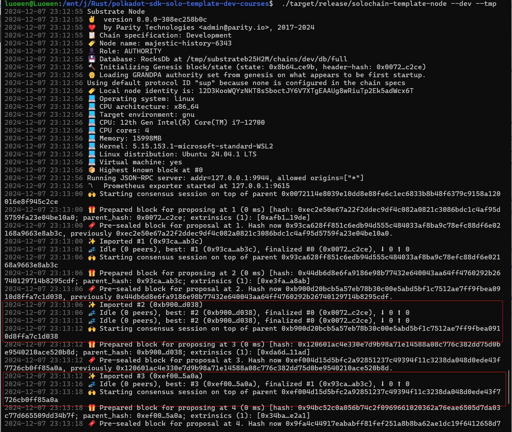

## 生成的节点截图

> 在浏览器中打开 `https://polkadot.js.org/apps/#/explorer?rpc=ws://localhost:9944`

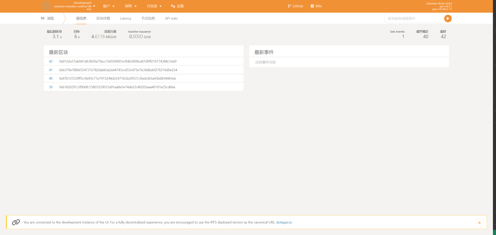

## 调用方法交易

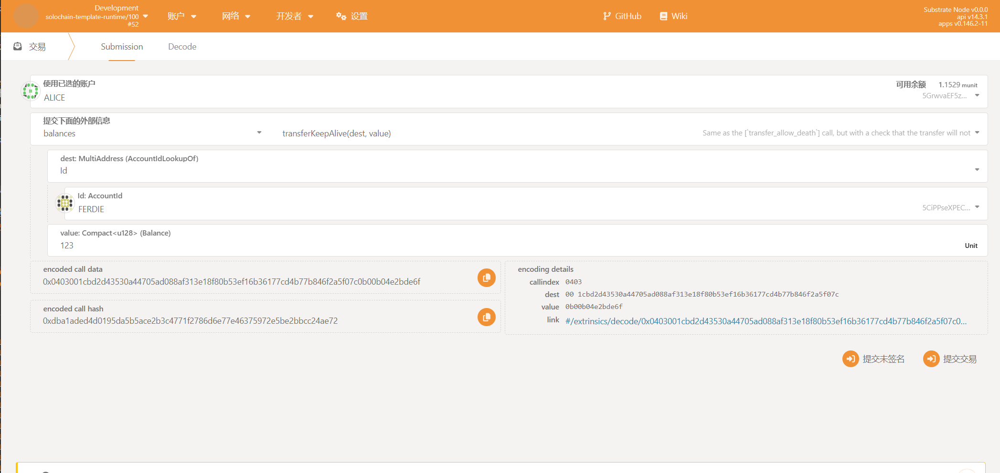

## 其他启动方式

### 指定数据库

```bash
./target/release/solochain-template-node  --dev -d /tmp/alice
```

交易不会丢失，可以将节点的数据库设置为临时数据库，这样可以在运行时切换到另一个数据库，这样可以更好地测试和开发

删除数据库

```bash
./target/release/solochain-template-node purge-chain --dev -d /tmp/alice
```

### 本地模式启动

这个模式下，区块不会自动增长，需要手动增加节点，可以使用
 `./target/release/solochain-template-node --chain=local --alice --tmp`
 从窗口中获取alice的id
 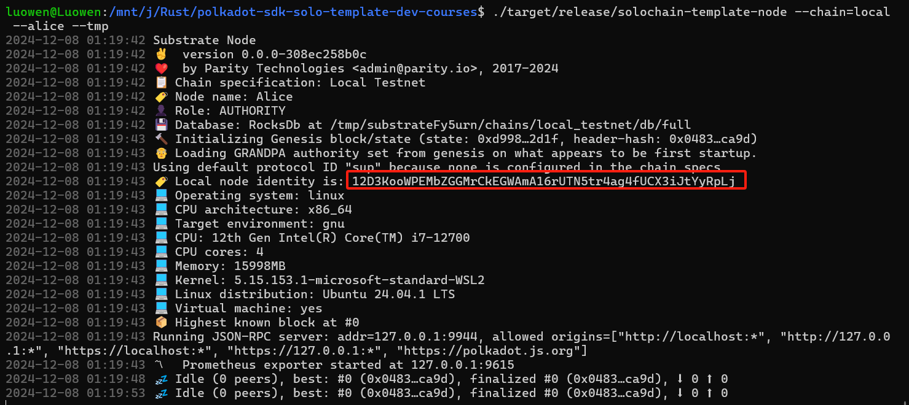
另外一个窗口启动节点:
 `./target/release/solochain-template-node --chain=local --bob --tmp --bootnodes /ip4/127.0.0.1/tcp/30333/p2p/12D3KooWPEMbZGGMrCkEGWAmA16rUTN5tr4ag4fUCX3iJtYyRpLj`
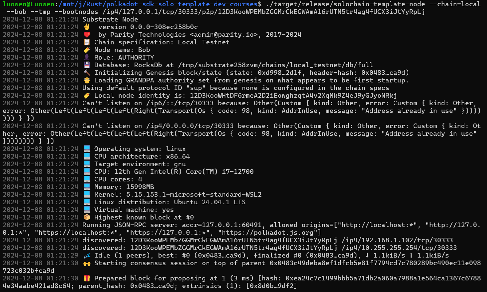

这样两个节点就组成了local模式的网络，这样就可以出块

### 创建自己的链

Substrate区块链的初始启动信息在chainspec的json文件中维护着，首先生成一个local测试网络的chainspec
`./target/release/solochain-template-node build-spec --chain=local --disable-default-bootnode > localSpec.json`
disable-default-bootnode ：不需要默认的bootnode

首先，创建一个新的信任出块节点Charlie
用加密算法sr25519生成Charlie的公钥加入到aura中

```bash
./target/release/solochain-template-node key inspect //Charlie --scheme sr25519
```

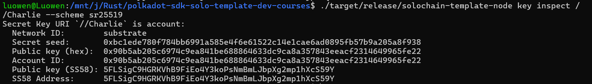
地址加到aura中
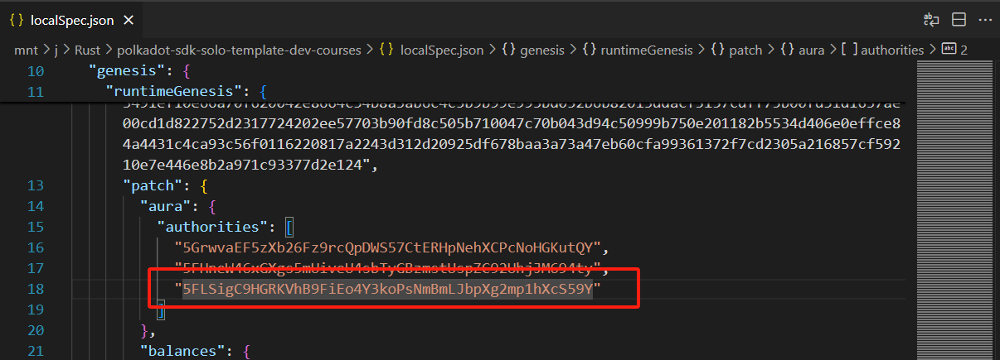
用加密算法ed25519生成Charlie的公钥加入到grandpa中

```bash
./target/release/solochain-template-node key inspect //Charlie --scheme ed25519
```
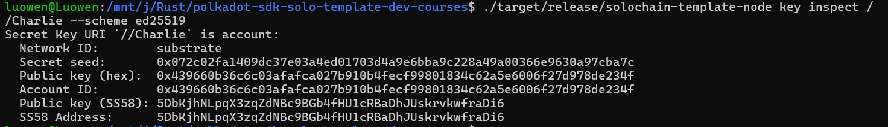


再build成raw格式启动节点

```bash
./target/release/solochain-template-node build-spec --chain=localSpec.json --disable-default-bootnode --raw > rawLocalSpec.json
```
使用新链启动,指定刚刚保存的配置文件

```bash
./target/release/solochain-template-node --chain=rawLocalSpec.json --alice --tmp
```
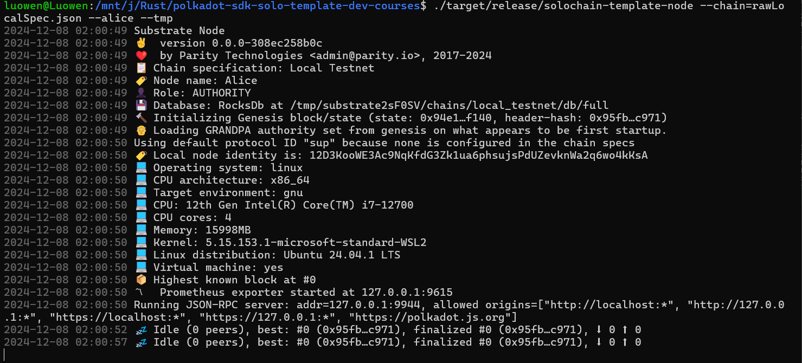
启动bob节点跟前面命令一样

```bash
./target/release/solochain-template-node --chain=rawLocalSpec.json --bob --tmp --bootnodes /ip4/127.0.0.1/tcp/30333/p2p/12D3KooWE3Ac9NqKfdG3Zk1ua6phsujsPdUZevknWa2q6wo4kKsA
```

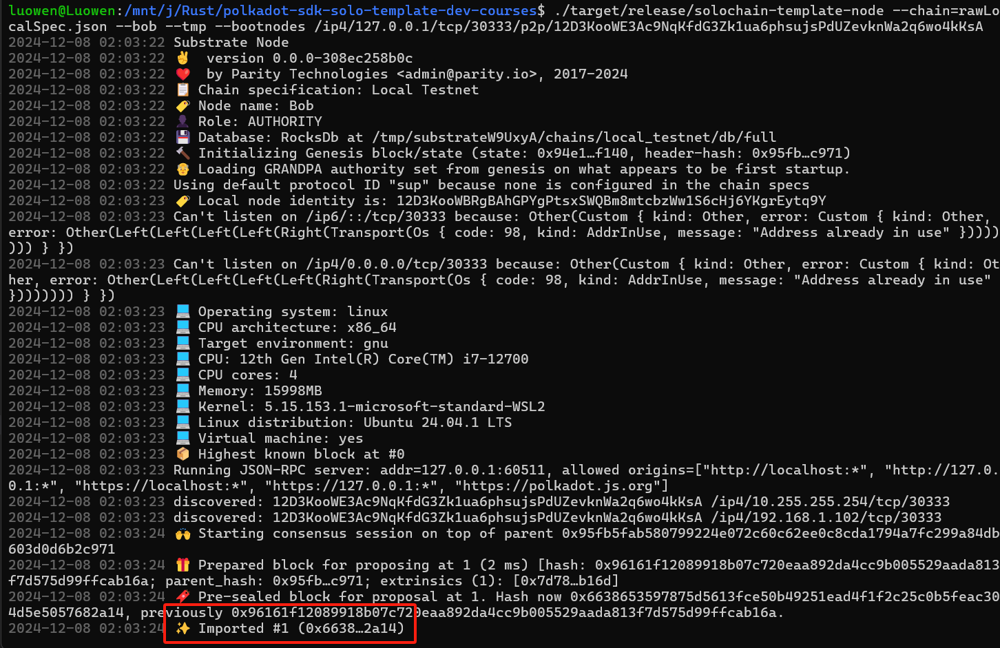

可以看到已经成功出块，但是因为拜占庭共识需要三分二的同意，块才是可认同的，有回滚风险。所以需要启动第三个节点Charlie

```bash
./target/release/solochain-template-node --chain=rawLocalSpec.json --charlie --tmp --bootnodes /ip4/127.0.0.1/tcp/30333/p2p/12D3KooWE3Ac9NqKfdG3Zk1ua6phsujsPdUZevknWa2q6wo4kKsA
```

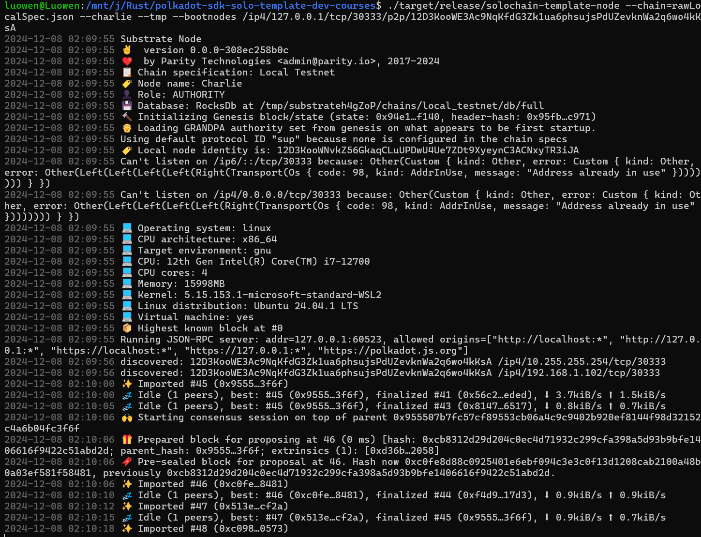

现在就组成最基本的区块链了，查看前端页面可看到正常出块
