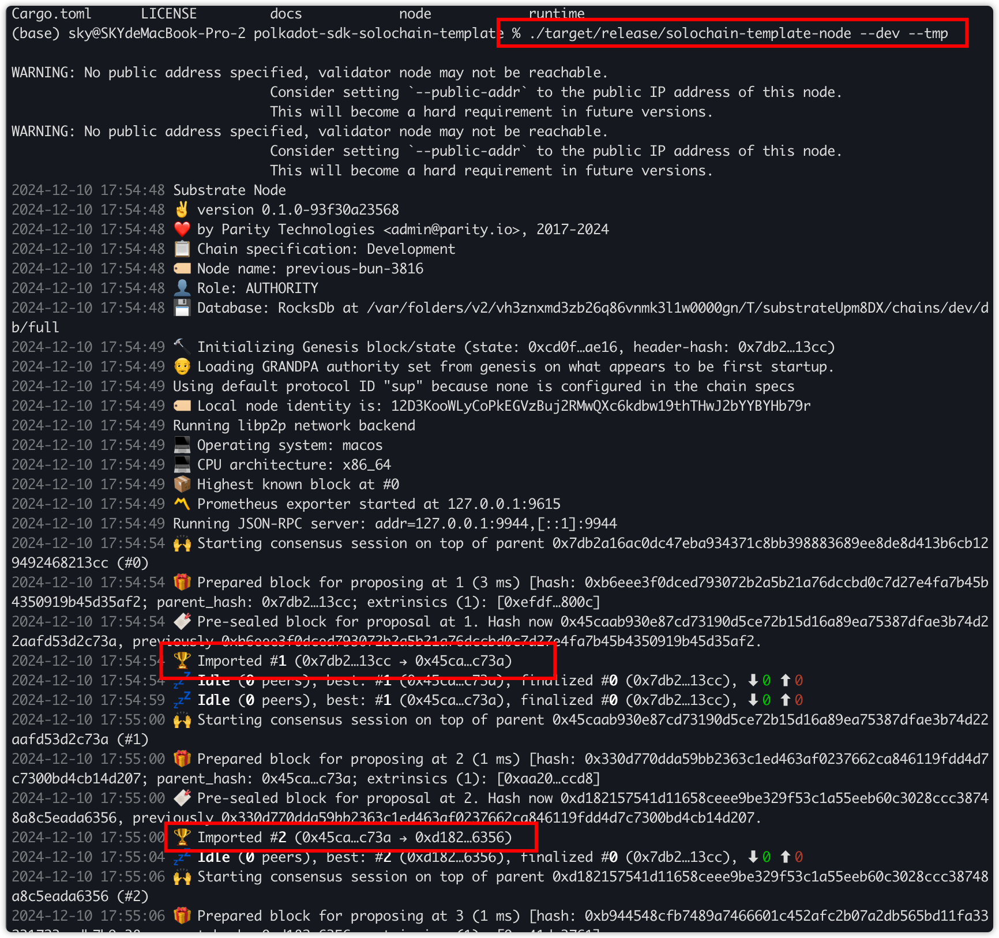
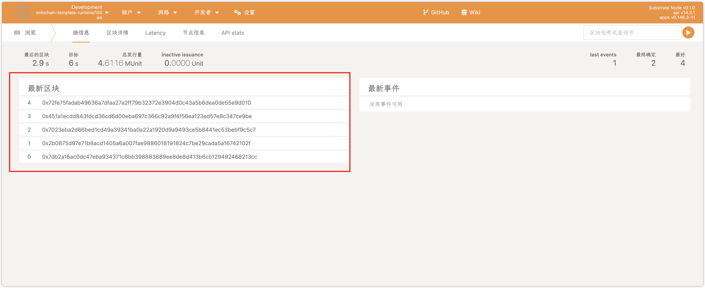
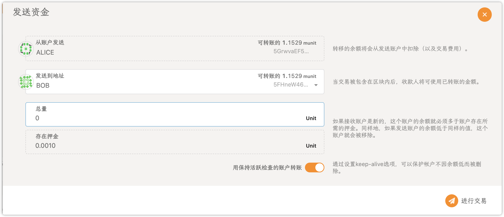
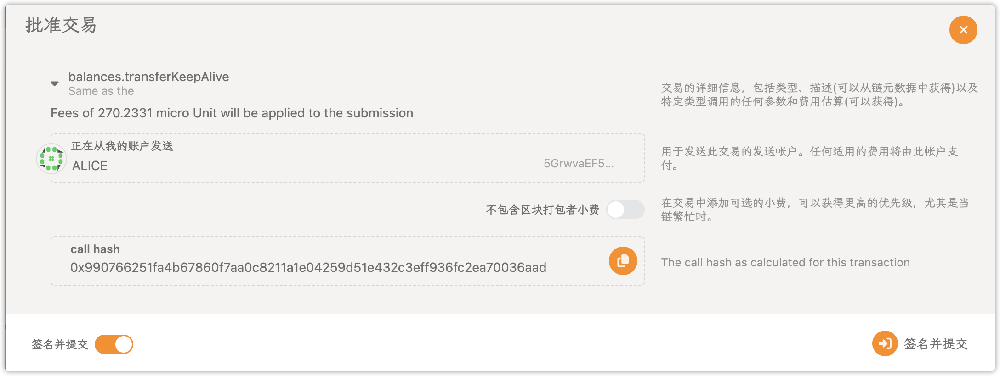
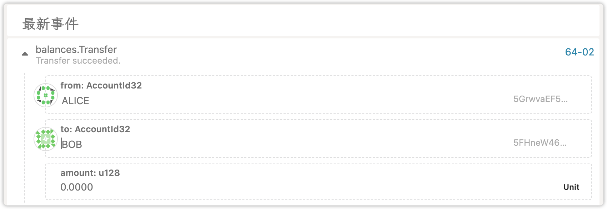

# 操作日志

## 运行

```bash
./target/release/solochain-template-node --dev --tmp
```

> 开代理克隆项目会失败，运行``git config --global http.ssLVerify "false"``关闭服务器 SSL 证书验证

## 运行截图



## polkadot.js 查看



## 提交交易



## 查看交易结果
