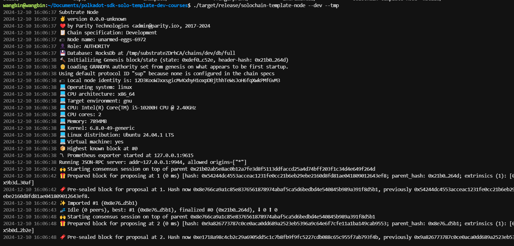
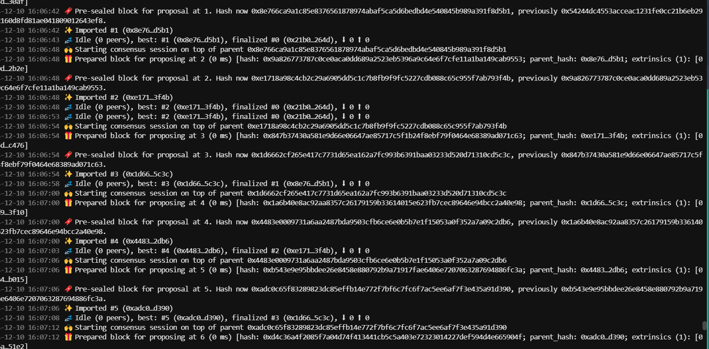
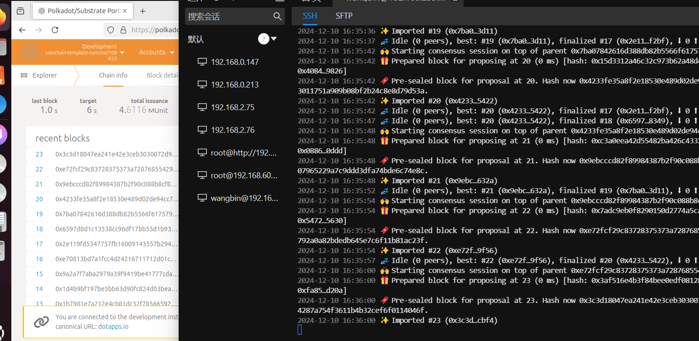

## Homework

### 实操
1.下载
git clone https://github.com/papermoonio/polkadot-sdk-solo-template-dev-courses.git
2.切换分支
git checkout polkadot-v1.10.0
3.查看git状态
git status
4.编译
cargo build --release
5.单节点运行

