## Homework

### 实操
#### 1.下载
```bash
git clone https://github.com/papermoonio/polkadot-sdk-solo-template-dev-courses.git
```
#### 2.切换分支
```bash
git checkout polkadot-v1.10.0
```
#### 3.查看git状态
```bash
git status
```
#### 4.编译
```bash
cargo build --release
```
#### 5.单节点运行
> --dev 这个标志将区块链设置为使用开发链配置。开发链通常是为测试和开发目的而设计的，与生产链相比，它通常具有更快的区块时间和简化的共识机制
> --tmp 这个标志将区块链设置为使用临时数据库。。
> 终止命令时候，自动执行purge-chain 删除历史数据
```bash

```
浏览器出块和转账如图


#### 6.指定Alice节点启动
./target/release/solochain-template-node  --dev -d /tmp/alice   //转账数据会存储起来本地数据库中
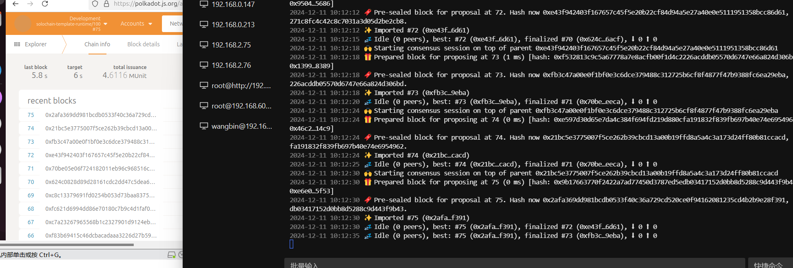
转账记录：
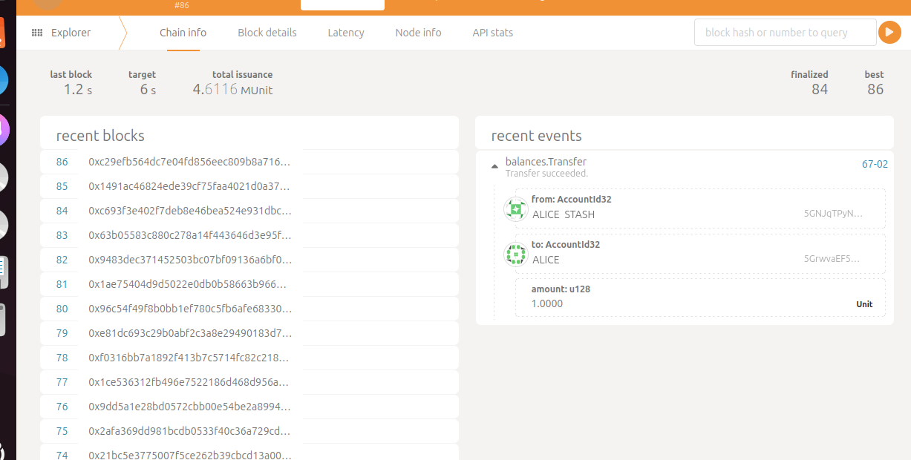
##### 删除本地数据
./target/release/solochain-template-node purge-chain --dev -d /tmp/alice   //删除本地数据
刷新后，转账记录消失
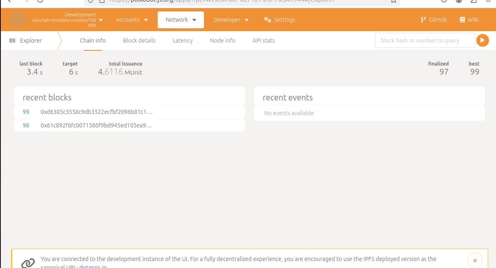
#### 7.双节点共同出块
##### 7.1 启动第一个区块链节点 alice,以本地模式打开
>这个模式下，区块不会自动增长，需要手动增加节点，可以使用
```bash
./target/release/solochain-template-node --chain local  --alice --tmp
```
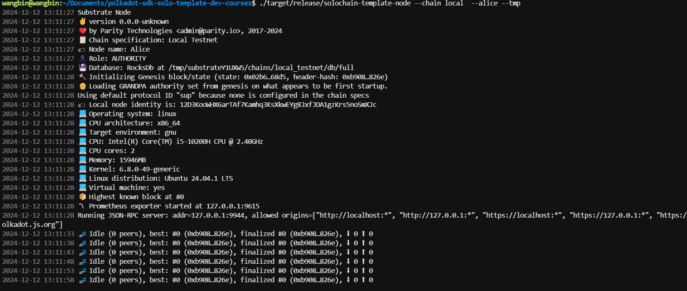
本地节点标识为: 12D3KooWHX6arTAf7Kamhq3KsXkwEYg8JxfJDA1gzKrs5noSmXJc
##### 7.2 启动第二个区块链节点 bob,
```bash
./target/release/solochain-template-node --chain=local --bob --tmp --bootnodes /ip4/127.0.0.1/tcp/30333/p2p/12D3KooWHX6arTAf7Kamhq3KsXkwEYg8JxfJDA1gzKrs5noSmXJc
```
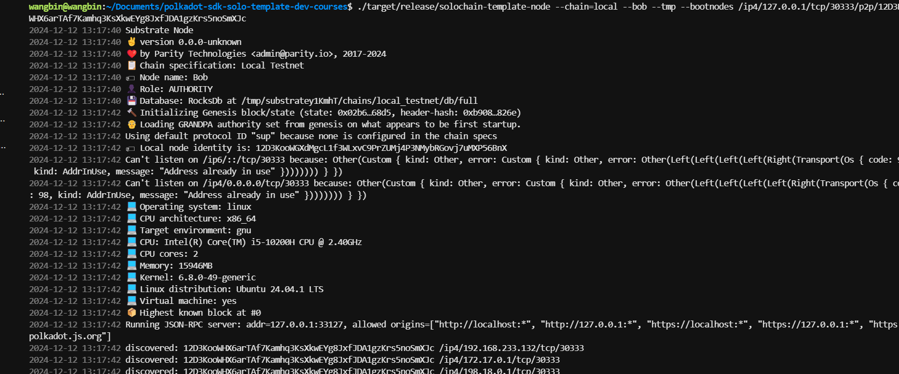
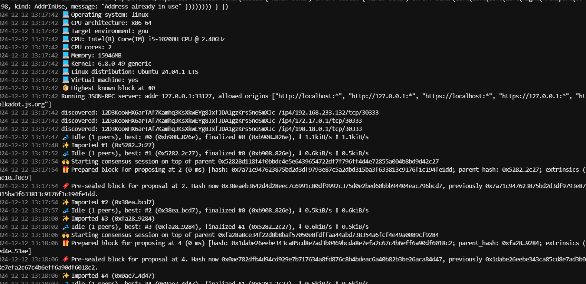
这样两个节点就组成了local模式的网络，这样就可以出块
#### 8 创建自己链
Substrate区块链的初始启动信息 --disable-default-bootnode 不显示默认启动节点
```bash
./target/release/solochain-template-node build-spec --chain=local --disable-default-bootnode > localSpec.json
```
打开localSpec.json文件
```bash
{
  "name": "Local Testnet",
  "id": "local_testnet",
  "chainType": "Local",
  "bootNodes": [],
  "telemetryEndpoints": null,
  "protocolId": null,
  "properties": null,
  "codeSubstitutes": {},
  "genesis": {
    "runtimeGenesis": {
      "code": "0x52bc537646db8e0528b52ffd0058149a05ce2c87f4154f1078589374784ef273f20d23e73de75a21db467c984e9d17997147137f77ed58bf16aa7eae9cb04e718f9538e321e4242a6e43d1edd0f4b074608fffec25985b7b54afff93d608218410b2f7de72cb1317af143e15d8e4c9fa5d73db59ee03db7b928d79605372d678f76ace38cae39aa20268cc65d514d2d4a4e1d15eceeadc2917dd80b9af11077f6d09fc5bbe625a7d5e4cbb5b8f61d2f577990bc368c56e1da326f6f78d49d4df316cbac6a8b9d99d8684a6218fac63733b9b3eafa9638ed7bd90bb9647356bf7914c109aad1dadf2cf3939b7ad592dc0bd9a3eb15d0c8f58d22a45cbefac55d556bed4acdf9747353c7aa77e1e51348773de4e38ab6b1ed7a54b972e5d4fbd97d3e7553ce2d522cd6298b4fd7e26eddf6b98e4fe3e62d2360d93deef41b6c8ebf7d3e522175811db5e8647ee311bb635f50e8835639d09b60d42411c7db53bf61c06b3dd220ea8a9d8dc73187b1a0f04026a3e16570d1e06da2cd418d51b96962b5b0784dbf246efd95d0e0808945d5ba4c805bfaf15a43d9ccdfbfb3a2098aefba1565dabde2d92838238ac90edba40e4a0a08efd619b6975afb425583b5a7f3a0a37077a5cbbfb88f9b1cd64341590285087ba4155e2681e51bbbfefb045160efddec301b1fdb86b8f7ea734236ecae64e5118d48eec1bed8e2de59c73d5730eb273721472ff7127c71411b0652c7e6baaabe2804d27de87ae717b83488045f3dfb138b79d5cd99f160c77dfa5924eb14248499eca8e12164c8a69f81f1a155bdde9f89bae315df70b0fd8d21479f71c8ed361c12378245b7558347cdd2f34bc69bf3d1b35743104190c218c2c40402579774cce2db909047590450d4440832394a65821a4e44e6547693fc50a2e51a7a28092bb9c54145032817184bbc9886703efb0e43c1b7884bca326496ff6d9d4aaeb0605b9d7c5b26bb8028d2b65c0420eba3085373ca9208d23c4200665b8f1833494b6b4af370dbfda1107022a392c98e443bb2abd3cfcf08919c6004bb2b9bbde67c3038b399aa637080b2b74919e9b1326e2bff7f71e7f1ade452dfd68fc698a3e915467873eb97c85b49afac5290f97ac1a555ad22bd5e3e13138abd4d9592d2d1f9fac1a553abe7243499fac968e4f123025a823bd22e5e7873694f0431b4aa0558a7e7773bf5a056aa8e1e3bc22e567b594ac2fcfebd2a5af000131810db6b0c23d58e9c11940108ad5d257807e68430940320153822aa055a3ca2582d552b228d06a29ed6bd6f0bb40ecfe5037a80459b48feb2b403db6e0032ac40004545a2ae5a7a2407b48ebbba3158a7e47bc74610b3788c31420a0d2be881dcdcfe11f3e45965f605b536ffab97d38d4ebd69ccd54c0bafc11d5a9ea911e6159747b368f8df41c215f51d33e9b774921b0a5ead9bce7f093af5bbf2d517f67cd08cbf47bd43481710475494d60c453f4cfe67d9f0d2c5197afef77f596e4dc129c75d46f866f3ee6d631e6969fc337bd3cfcc0d3e30706b63575b334ccdc1671bd77d335c6999bdbd5c3b1bec7b017638cd8d38e44a0aa1e8198b92dc20fb86201a5ead6731883c7e2745f8db2e6f66ce0ab593d1bf838afaae1999a49b07ebf2618ef995c35c150b22911356b45889acf9a92ad5fd48c30a5aacc6d91d76b040adf3a76c518a335ff6ce0af29f36ca04cc3579a113e5bd96a3132d39924f52483e6cb4b5a4f3868a63d6ff953af96e46aa6d5889634ce7ac2aecc9a52c088ffa96e29b9fa612f5bed4804ae5b548af5eb12d89245c188871a04ae5840e9a2a367037ff36ce0316dc97ba4d588ac8e6d4bd5af5840c9baf53a6af84b33c2cf79d6dc124fa729b9b4242fbd354f30a476c42dbb17aa12e811d4d175831a3e0926d5208660525d372ec0a4abe189601c5782cf61d2068d604ac30bc124d7f018676e8b6cef9dc643d79f7e4130e91d7e6b20d5d92cbd3cfcbc13e42a09d836d93688ca181d7b83ae70a3f7650c0721ad68cd632705768447459647226c85d8566bc0a92174c7dc3ca2b9e9fae41c0f4660009331be78efd8ee667bd68838b5ce529e9fde57bedb2de88a317a83aee0a2aba8e105d01b64451c0dbf4c921193f3398d88532f8f2a6cbe9cefd4ecfe43a3823dcd48e41f5a15f11322711593668eb89697b46af7385d6f0d740156c4e9b07353abc2b93d82ad109bfc23e2d47c7e87519ecfa49923fcf7276bbcce93af98c4328773f8e49c3b035b21364c74c5199088133c3c2622b2bdf3797e1aae06b0656c7ba148a3b2c1e7045b26ed77623bdab2868d89b662d2fb3ec3d268377b5cf33197b9c9aef939fc46632ee3e936c80a3282ae38a397497c77f78a49aedd5933e2b25eed08a48f56a7e75c19586f50156cac180d2f31116492fc9e8ade63bb4542c7b053f6d0dc1592d18a9d875b1ea3951bbb7b36eb4f67ae4315ca4f63bf0ebf5bc47a68858468c5feaedd9abb42345ab3bf6d3779a82e5dbac4a1af67b39e8eb8be9ec398ce45a3b8964fc22dcf9a1278a6f5d4fc6d37ab6b77a096cf9060df15e29ef372189b3cae4b57cfe68c8684ba45ab6bebd7acaeaf637256d7f2da9fb6045e3e87b17527d836a80a331a5e1e5b8cb3d59068c768858d3d8e5275e821eab424b0e5316cb510ada70e3d9b51aace8ecdea1afb6e918cd6ec3b457a570876ec390f9bd87c5f2d44795e3bcd88bc36abfcfb6a4ae0e59a012482c644cb24ec7bc8a40b89ebd219dd155231cae3ba34f6f8d586d8c6e86e102be75d73db9aeed201ad90786a56be937cb25c3c03f6875385e8ff52afa2c7e585f0abf0f1d007f05ec508dc65fec3f7e154e1839a60fe7ebc8a1d8e7d5f3d9c2a6eaac8e13ebe97793855f4a0a61e1789eee3e5a2f91e37f5a0a6979afbb8a9c7b38b5ec5a3a6aafa464ddba977d3a3a68a8ec0dd545d87bf5cfb7e7b38555cd4749df9980f6aa2a778b80f67ea3e6ee2fba0a618bf51d3f5ed261fc75e05fc0f6a8a89390c35bd5bd4647d6237cd63d4f4de4dd867be63db9e51538cbfa8e95113905fdfdeb79bb26fd41477dc146ff31e6edade0335c5c49c0735f138455d076a8ad1e13c281eefe126ea3d50930ed6d3e126ab868e60b4839a769c078fcfece0c1839e87ebba0e40ae0bbbacc9c3478f97b7516c5d3d5e85f188a21933ae7cbc88b89ad4f6b68be281c5ac878f1ed514bdc4cbb21eb6513c5eb2ad8795f978a1b8e24b34238f1779f878950f01d830164dec0278e9e1f2c1871d3eb067d9d8dcc4b7b1b17af4a01f6dd54759000270d3f50004605294e8f436d9759b381add343ff2615489786ca70f808f9707e002b8a9c70560637313769b1e6c2e809bace8830fd83cfd28f2f8887df0c18700dc443d00d4e4830f2fef02e8a10720376507629dde468703e1a187006e73938fdb8c4600780fd4343a0f3ddce6a6eb3cdcb4d19aefd8c13e4eef031020e741071d3e73203c1cc84d2f0752dd8707b949f420ee86e602b8497401b89af3208007b9a9c779b8a9bacd8886869ec6e63437cdd3b89bb0d3bc879999f3a0033501a12620e7e1333a7ce6a6ec33eea6f81e3eba69fbc801c0879ba8fb404d00f0e1949a00701d74f8e8a6777a93f520d4148000bc869a66a869e63b769c869a7efcf80c35d17cc78ecfdcc4e333d4f463e63f6eca68cedab8d75c003c643007424d3fa8e9c7813ccb4e6fba4ea9098687d39b300ac5dab8c35c00375d548ab57117003505808ec0d960ef819aaeeb31d41473ac8763375934098c9a2eec34d4743db39edd34a9116be34e73130f3ac4dab88fa8c9071e070035516aa2ef61be869a78f82935ed18a6b4218d2e3048430aa894e61a576c21053798c10555ac51aa623ec707add6c67d52d3e97bd05d1bf71de83e9bbd0e407c9c869a6664fe839a4e46000219b0b871831ca86184928fd30b4480051428e10a6d704306251f37bd5099b571f7414d32749fcd0fb48e7a6f12d16d6ddc73a0d5b3d9f7b8e9d126d6c6bd0735f1a02370a52a5e1e434da2efa023b82955f10e434d2fa18ba8e964832b70b862033ae628c3194a6fb3c005083540c10be850421b4a55bc8b6eda2891b57117515388eeb31900ad447a6fa2e8cddab86b54e6d9ec4d4c9bac8d7b464d181dc1a85485fc454d410c810c397a300715b8e8a064d111bc54c50e65ac210849c082156e2043a90a3e755345476be34e5193a4fb6c84d07ad37b53a45f1b7748b767b3df9fde8f0d0be932e50c6c996c1b34658cde1e31a98e9acf0fc2a4abf9348ce34a4cc518cd8f6112af718515b29dc31993f6fcad61aa73e368c0ef3133f3dde16598f4a66b3ecd7bd01dde1d521fd78f2e8f9656d77c046c9904e3abfc1e8b932f67d51864926bc824f83de6342390319745f978f8a71981fc389747cf356bfcd524ad563302571bc2887b0ecb093bce6d385d9f9e7358445b53dfef9049fcfd32c97dcf33e3d1dbee34234b331e553c7acf61016c35a6dfdddf659804ff8ec530099e8649f130f28cb243433955ed5eb5a3334af8ee7c477d5c470aa7ebd592b833ad7cf74775ee92806d06b60da2624a6f4cdaa029e8e87d0ce36c6983448045ef3326b9de6fcd529df7f270722e086c816c7bf7b568b029b2f47e356c1b7b77af3af7eede751c75ef81af59f331385dbfc91dc459c5a4eafabb45826c481ead30cee07cfd26ec8c4bf3501d052684bd0c4eee375f6b5ba4c70135cf023a8accb6488fcbd251b276e7afb60402392dc906d4eed96a491c50bb3fc76b60db1593ea0f8dcac677afef90477beccd006cfcf7fd6a4bf83a8f563cda2f8ff6397c724e086c6beab63caa55f36bd5fb659c651bfe1edbd1f6ee1a5b9b0d5b87c5b6415360e90d0262a3aba8f906e80d02b2d2ac19296273df20202acd5f26bdf32193a8f32b266df331d68c5074dd8b9135c6e0d1f6fb0f236bb8b142b63197bdb94d4dd798d3deb1377d1c8f11c823f8245bbf3b6d88edf7d58c643c7291d653c7ea51b3c2aef03eafe55733129fc318b61a12492b6cf9ead4ac6fea6fd65aeb6b028a2a45535f1e51cf79d5e431f53b352b4dc3632e9373fbcdedd596c07ecfe11c8e93e7f53b9ccb23f7d58c3c0a79e49ec339bc354c75b65e1e4e947b59601b5f321ec9f0c83df6060101750c8fdcd70786edbe1859230c1e6d431eed5733b23cdae7f0d260cbd80ad9dcf76b656520c00c82ae6c0d591c991832326463c8b69069217b23bb42e64676848c8dcc0a5915b22d591b19123234b22c6470644ec8c8c8a660a9206342d6850c0b99195715561dd61b2c37586db854706d7169714d7101595dac385870b85270a1e0aa729de0cae232c185c555828b04d7082e2ad715161d161bac35586ab0d2609dc1428325876586ab059617ac2d58592c2d16172c285855b0ac6045c17a8225056b0d0b8be586d5046b09161b9619d61b96122c2a5853b0dab0d2b0c2b0beb0ae5836a8e05069a1e202f4811524dda8de20b750b151ad5161a1aa4225054682db92b5c195818a8183832a43722104d511282b545f5455641628345426a85250a1a0c2a22a41a545b545950567a13ac110551d0c05c64245056a0eaa0d5418a82fb838505b2c1e50607070a0b4903da0b04065816a8372c39a425d21ce5175c17521534356218a017ea19a02bca2a2525dc14f906ca8aca8aa9074c837a417a4166416d905c903090753b15a209390cd21cb90449063482c5055a04a40b14151415e418661cd80eaa20203a545e6801a4345864a0bd505e94595858243d280f2423c4364426c423483620154830442ac23be218e216e8965a0ce10cfe013c823c038403864586290b40224836c03820186814a0314031c03dc527d419e804281cc42a2c002820443064121c02c201538024802ea0db802a802b8457443b684d806a80585859a42544394a382238621728968a8c4608911d79069815caa2dd618221b2c315055621a2a2f646764658066806ba89840ad11bd10bbc064442db82e5c45150774832a03d40257a9ca5035c13a23f30295826806d8869c42a4c351019611df8870544e884a7053c89ac04aa8c60081907d012e216681daa20a032587d5032b097109f00c5009161af007d5166219cc85cfc0666036780a2c075b81db602a3019980b1c075781afc04de028701aec049602636982d54882d190f223010e021b8185c062f01158053c02a682832c30780a97e1e8706c706b706a7062705f70599c161c17322ab82d383270129c155c1bae0a0e8b5b235383abc2593101c702272a70010f6080080b50e0099dda00a705034a9d43801b05242008201680001cd2018618c0e403007ab80e353cd01d5e0e30d7ebe40e2c7e4ea028a101265028e1a409264c30f79878e28409934b88903806133b4e44a181993884e580131b78f2c4124c7c76a25062034e9860e2c44709273d4b4071028a93274e90d44421dcc420ecec28b1c4ce8e120c10a3091f0e3c71b2038475e264034c9ef061e2d304079c70e2019bf88385b2e384123e4e9860e2c4c9067c883ed82736f0c409261fe87112050f1327a0689f274e3af001258c780c639d2cf1e489274c9460e20414ed6489274f38c0e749144f2cb14403893dd80d3cf1440f144ca070a209283d4e9e78e009261f70a2e343e4c132e1e409079c80f2240a264b3c11c58928789c30f1e979020a273d4c7c9ce88006a280422482b14c38c1c4c709949e2896f01177c001289878a2440f121da20e98786209274cec1073b0503ee044870914281f70a2e4c9134e4081e2240233e260a13871c2c7899e279af08942891df18b7df284133e4af444c104139f2776a03071028a56a2278ae611afac07983cc1c40928bac7894ecf131378e284124d2cb1810d2c99f106ebc44709269cd851220a1327513889e2014730e184031c50e20801441b2c149d259c34b184170bc5e789931e274d3c71e2b1064f9cd8c04ca4c12ee10494274ef4f848e184c90776a0804209263d4e98d871228a92ce124fec9468e20c16ca8f68659560421365b01d60a2848f124c28e1e3a4889718031038b1a384133e4e3c71824784c1ea2cf1c48e069838f189620927523881895d6ccf130cc8d639d9d180123e4fa2d800139f259cf438c1c413279830f1412d2d282e4c58434bef09db2020a076a7e7433e1d3c1d38281c0563dcb6d863dbb61e3df63d7e2f42de27e58b0fbe47f1a3320825753d884188c1ea72ebe05bf908007721bce4ee66f2c96b77e1e3ddb7f0f1de40081f7c3ba0bcaeebda95525bb9d42e74947c14848f2184bc7017baf79e0f291df664c45cf618eebbb0f7a48410c2955242e82094721f7cefbd1fdedb7d32cbb22c0bad734ec66b001006060646c22863f6e4ee0a8172e17350ca90946fdf7bd972285bf9681ec482bc0757eebef724dcd580386d3516c0aedc673da6f6b95d28a5842f83a127e5be5df976dfdbdde7deee42072594523e171f840e72944f3ef81e7c5c45199d935256314abedeae84f0e5dae57d1a84f0f1f58004806619beb712c607592e67fbe43243f81eaf5b27f7bd7d6fdf7b5b49b9d7ee2e84f0bdc7ef3d07217cd985ef39c80be17b10427e2b6d2e96f07a7077a574eec7755d524a3992f25d2c67665ea08c3124e3ca287d00c0cb05217cbb524a29a3fcd14394315413255c1e24854c41c7ec203364ce183ae62737d3de63483d1957caf8e4eecbca9099e1c12c7fa0e7890e38e980ec80133e4fa2e8a1311bf08902488c144e9a60e2f3c4891e28982c01c5890ef428e103c5871d507cf8f8a1b384121ad8d979a227005309273d3f7838d161e2238593273af0580238e1800f11141f284e48e184865a023c79c2099f259480f244891e1f263e4e74a0034f8cbe0590c2890d38e98182c6f428e1646789991d4b80274ea0804209264e38a044cf133e506876f079e2891e264c38e971c244cf134c4807288013277a7c0250809e1eac2d00134ea04071d20345079e5882498f93284f2ce1a4878912509858c2091302e8900e5000289670020547e6031b70a2c749141e72f051a2c7c913271c608200021ce0000560c20993277ca0f840cf123d543b4ea238d9612285121dd841070e3cb1c384034f9ce000079ed8f1e13aa0c33a71d2b301263d4ff828b1c4133b3b4ad00c210191e2090ff8e8403a4001444b00264f9e70024a8f93284c881480004c0ae04447891d0d30e1c013279a80a244134c7ca470f2284f9c3c1dac2a787f4e549393fbf9f9395d4df6e75435d99334b1f54ca793e9246a72723f3fa79f9fd7e4c7fdfc3037d99f9f9f9fd34936d9d30f9b4e559393fb71a79fd36b72723fa79f136cf2e35c93fdf9e1267bfa39514df6e7e7e7e7149b9cdc8f6b7272fbf373924d4eee149bfc6c935d6e7272a7d7644f276eb2a7d3e9049b9cdcc935d9936b52005e83db5dd701284a6cf15a21ee3abcf6d59468bf9ec3da91ead9ddcc7e4dedac29b1ee9c362b53b742dcb9dd15a56a9e1707a0de57b3fab8e63bd727ca711cdcdf083678033a5afe5559124da01758e0458d48e27179948ee0eb4dc71bc1a45a336ac2a4ba35111ff70c229874757c108c134b1b6483303a7e08936200ba2e1b365df70d2db4ebc6d1f141e2474c72cc6796bc2cbf7c1fd9354ce2715dda3df6ec7da41226ed2e77b2a3bb41f888cba863d4ac2168799314293fd50ff3df5ab4a2f57d5fe5117925923e2ae56712bf638e97b8b392a7c449aac49d2fc324eaf134f0722fe7ba537383bcf8a2e58cbd3169e5e39d4604ad0e0e2de3b041f6ab75d9207b09b44192f014edce6fb9585d60eba6d8362e1a7a41a5e1ad1338146c1b54832d2d8fb9d1f05a0de86828baf67d8c0ccd6b464c928787964565198fa9336c1b13613a334aaac757555504565da1ead431ebfab675d123d4ad5bd9a9e95a5677e9c45bd765694be02faa135fe1a1684be0adec3af2f015adf219b52ee73675ea38b55ff3d4d8a933d194b3627f998e76685d34a74c993245742b7609e0b8e55dc98a5d02d4d792ba52cedb1236b7eba9a1116d049bf6f7b424d825adda313a83bd7a3c6b49343a83512594fcf58aaa74a8221e455516add8acd967acef8c458fc463c7686718764be77acd9660d47a18adf2d7b389396bbaed7d385bca1c103c45ef435be46608912098b4fde34e17636ac024702af1a5bc57f1e8150b28f199feb0db810fb00480703a60d381f7a12b0db4b43bc753922bc6477aa55a2f74a457aaefac1e27123fb4514697d21ec62b527e568d2aa58a02ad1a55aaa9a3d5ef390f4e1f1a73ab4695920f3d05ac7a55f9cbb4c2e6c78e56fef298da55ce1d13b9f3d04cd1a5a3509473b4fa70f3b83a5a1e1eab66ad1e65eb1d083445573e0f55c7145d3a4a55a78e7494675699a79a228229ba278a6ceb51a886726a8b2e8fe0b9f2505c3a9e7d98e7b5a433495c50bfb3f59c57bd19851b1e63761b842f794c0d6fd5e766b528d8d6dd7cccb45a5fcb2ac2d415d571143db2e7cb071b529df74775f64cf7ee959362c0def9d883aed7f88116696c69031bca28551a04a46ca10a2c55aa70c216b494f6d9f0f7415ac45647a35ab9d1c6971984d1b02a628b878e36ff86497c224c7a6a647959d7517310d9c69748b3dea01978d1909ea2633360fb70a812a6b871250b3030430da5e5f20629a0510439b880a14a69bfd30a1bfd7ec9a08e971957f6a72d79bfc4e877ad01148d62eb0a8180dae7ba3257bdbad671bfaa8ba56684c72d7977546a46788cb863c7a8ccc9634ebb75ed8c253a2b5a1cab18b972966559e70c9baeefe39a3663658e7ebf3e73cd8a967e7f5a963dd34219f6e308064487271101d141e4c2d0b44c7b0ecf842a6de6d66766ac1d40980d20333333333313c82681bcc781ec8049401e8fc5ec30f3e898d921d376e8fcf8f59bdea11df9a1e4fd82f9a919c82920da73b8764c9b333b60d2cce329cd48966534cf6120d9ec4992e9f04cf44c079a89320d9b9939cdccb325dcf259c79799c319ed32d7dc94d3c7acae7f7cb52536adfdc7f4e143268719b9e0517c8ff9e6e0118fb981edbdcc6a6a98594ddbaca6d0aca676910b26b94747c7bb3707b3d1f1a23349de75e4dddf571b027e074cd21e8f699a76d6fe1c76337437d31ba40514663065065b58f1c2ca1656a660d946e5a567ff756a7a96b91d30693b5ed39ec396f5d0ad872ec96052e8f15828140a61d79589b2ecdb357b925c17f6ead77561999b178f023af4ed2b249a3cae43216d894d87e88c12edee1a753be051fc3fa5f8e927a540ff9cd5ddacdcf509867ce55cd48c6c500be8689b765492c123ab2f5a3dd0d7b16505001dc37eaa14edfe69c54b527ee67fa0f70619b6002a9d4eb1e2a5bfa2157e6e495ebec62eaa8c5667fd9aefd8ac52b4f5d58a18b595e4bae6bb24a3c62e3ade9a8c8547b1661d5d181d37b09db1b830a213a3634cc76fff76bcdbc115f047a81d31ff3fed88df447f3a2f836678d4036cdd09b45c561afef8be72405067a3df7fccca3df3d08fe7f0cc6fbaba9bbee9d5660840805eedc773988a4dfea69db6e4c72bb7e61801bd2ba43af111394fede6cc43b3fe383ff41d76d86187b7c30ec75eb6c30ecfe16dd341071d8eb96c9b3ae870d68ce8100a655996c5c00c9abb0c88e8476f90165b34f623f3511d49454fed66e8725677eda117472623160d45a2ec22cd48b6cd6d6c26739a3b8de680a839205e0e112faaeab8689ec3699e030d0d0dcd4573204068689ec3a7a1a1a968e88c921d9e7d872cc34422e7c58f595dcf9cd2e1d975a06cc66e917ad334af33e763da91f719d734af442f0e519665593681446d894d0e07f21c0ea43210b92313c52a222040322040804cd105e44f5b62d340e88c12998b2e73d1319ad9039be622189349313291482412cd504b4b74119d51e2e3212c34b3d3ccaa9d15266587c798071028a7a6dc80d7a6eb50d6d93690c9e33abb9629712d4f33b725c5b2cfcc1fcf793fe6b68f49b1c123789929c3e0117c0e336241b9514d57aca264d4199d51d2e3a1f7a0151d3c820f411e7303dbeb4ab9d1f0151d941b3173031b37c506939c1463c7dcc0e65a86c1a4508d551a1e7b5b98f4f2725daf7cc691515f5b98741d32f319d75933729dcd60929bd5f5b66ddb57cbe10d7bd579d1db9f66647b5962d31b65337804efac6096e5ac436bde4db9ee04580cc488c11419eca0717a836230870ce668526f900cc89803066e340cce80c1170d032eba784363301896ad56d16aeaea6ed6addde7a4f2d2cc2a2a2f51d3fccf555a3e40551dc3b2095f392ccbac78f919f7ed534b3aa3a4ba3c92eac5211dada6763fb57bd387dbbdd296d8600f1d7b88462c7804b1c363957664d4989377da5d7597d4873b94852e92d7664f12edd593c05cfb32a9a2b52749f59727d95e5da3f5307479a45d5b26bdd0cae35a7b45eb16aa7c8636b745934701a16dec93c73576cc6518766d894d637446c975eb177d5b78046ffdea8249d661adea68786b3a2b3c82c77ef86cf7f1f1d91ca5be3f36b0e954dfae2f0e3ee3c7063677585147497a85ca4b2616c34a14660054fa815bca7081124a523e603a956a7ec54dc98a9b1218ee110b26bd3898e4ba8bdeae8f4bf3190dcf69f0f0b6f0c067b00278a8ce8b86775f5036833a2f5801f48e8bde864c9a91bf42e5a5f99d91f4886d9edb2960cab81fdce3fcb141dca356c411f4f34f3be2f3ac3d604b3cd0edd9b83bed015ba2b47a366ed27d36ee971520fc031ba23df68303db4c6fd00bb0e8fd867a835cc0462f1035c606c12ffe83031bf706b9c04af36ccdd4795648e5252aa3286aa2fe43516fd498e3513f8ce76a46a2a9e1795693ca4b55565179092aa0a2a6ea3fd4970fc0b08e86fb6ac96b3ea43cef0075835a80a57db89d1526ed5b62d38f290fd58e0b07750fbd412de0a2add588b86ed11b3780ea391c65bb6e39156c179d49c24040fdfe0304d43aefdbd61025f116ad3c3a0aec1deb33436c5bd763fb740e63cfc8fb83fbd82d730ba830c3f8a81560d59749d825ad292de5ad659294523e87adc98db9164cc1998c43bf96c76056dd9a9047d57936eaf2ef37ee87ea4178547dc4a3ead5b1d1c319c236d5ab215d8da2180de151b5c516abd7215d1d73fbd8c1d04c92d7d65f5bf4e79aaee1d0330d3835f62854f338a0c6be1a5fb96201a56c83b8a8a3afd916dd22d6ab570f27f4eadbc371a5ea320f677bf53b20ae57c7b6e94ad7ac1e88425f8fa385f406714146efe065d7acd767b07b208df60014da9a505c5f117d9b33d85d894ba13983d10754a15be14aa11f08c888ed58ccac09db69468cd88ec9cc9aaf5783c006812d69dba462bbd0915d34a970a5109db9288fa84b5fa132a4949d0a511c4a56b852f62915109046a9a0ba94b26330b39470d93c82bbd38ad88a784dd554f1045952c105174de7d0d23bf406b1c08c6681183d7b8358a0456322d875d4f13534775087ff5eb7cbf399b28efc421c745c1d2e821f175f748da9344c75def9f51de33319475d4b1ac5d63e5bbf3b20b8e3592be2b5bcd38ab8e95d21fbc0c0dc43f26875bb411ec6d9733853ae4f01e31db3e60631639cbdcc9a9b05286a44406dc9db126371b95f034e27e86ac9cd7271404e577f9a1216edae8ba1fa538587c8e9eaac2179d23c3f9dd51d9aca586bc049065d1d7b19d48e9cac344f93ae8eb1db50a8fe5869f9dd201895498daab2abb2b26b6e494bc297b4bafad35b74d1f2d7dcac7920202020a05212f847dff2485ed2fa585b02ff5ae751340a99f69169f9ee9e8ebb3b9c334af81f68fef66a462447356c31e5c178e7a818e5dfa918239c349a8b430e1b913122290d8f225d0899d370d5167995a6dfddabfee49ffc3b914abebf27ffde25bb41ca3bf91978d7dc33b00df25152c8a3ad56c8369c8c06b6411d0fb788fc3e6e11d74378143f47dff0287eb54ad3f1af66f5864935a3619cebf1416c91af90eaf14198144f8449d6a34df51ac6a9629854673a3e7ec81c1d9f314e0cdb548f9fd922aea335697854fdf506697186a656567f775a65868ea93e43cd507483b418436f901665e8181e5516a5e15145cdb842e474bd3591ea6c50e4e705b6f2c5fdc8d5eecb6f1f9fd82dc1b09eeb188da7a6268f61d6a48e3d872d1dead83151d61ba405183aae10d9ab21997c6d52139b7b6deeafb95dbd6277b3bab668ad8e21595a8f7186cdab2decedaf17917d69ad5a8a29229802a87b308cf24039b5f6ea8137c0a14b43592c5f6c4182d62846ebde7acec3168bd94ec664b648aaf3d39464b44ad1d7f78fda91ab778554ecd64e1deb88f5a53ca6aeafadaf96a4ea8bea54afd51d7f9fc32d67b5f38439e864e33f26b63bb74f007b9e3cae6978e46e7227c744b067a5a1f547352a9bb3d250897782eb58cc4257e467174bf9aafa7555a3beaae97ecdec7252f2d835a39ccba3eb5815b523daafbf593d9bd8735e85693334abf3e166f7cac87537ab6b2e8f5cbf53da11f9b6b1c5367353bb65fd59c7dea4dc5b32ea476b3c76657b0ebf198fad96d16aeaec6d93ca4bdb9715b051d38fe8cb07b86e5a3ec0fbf677a82d19f5ddc49e4dfe36b7249a6064c7dcd4e8acae696947e4756c56cf7957b5cdb3fab0d396d8748cd459d1a8d89c955e67256349825353f7815f5a9344eafe6635754f94ea92fac0cbb3b664d4f5e7cd2a457c3579765812efde9b00e90dd282075d4fadc5941e753c1633ead5875b890f1d9fc35033f268948aeab86f4bba3caa3e4ccdf8a729f1a11f15ed9d152645782b3f342a361f6e7e92b7e3d9a1dda3f5d4f1725653fbd0f5c938aba9ebde87fb1dcea72919f5735678b471c905d42f0bc67fe7f980ad2e967edff76cb0ebfbfd659bbf5972b02aa8e1df7cc056ab301a7e0f65835d2ba0867fafc2a8823e8411300dc8031b4dfdf114155fb7aecfc0265fd78da64e8422d56a6bc2a44aa4a9530f8249b4a933c138af443d09266d50152e9afa0598f4cc20cdae9b46535f6d6998c4a78ef1a4b2b82d34758c339edc326f34756cd9ed0bf1b82ebd1b93dea9c730099ea296cb5b01b64b6cf06f834e9046d7aae3f7f1f15b1389609b818d5fab77e170e9046490b8afae41fa7d9dc036034caa32fdfe2e4353658cb325772168fafd9de6fced77215bc47dff70966dead6fb9a0705b6d61c5b96051dcdee7c1a0784eb053066c4061db0e9ecb7ab03eabae71260d18e0475b403ea37453f5a1d50e3bcc3490596e0df3c622bc1efdc2d3293e4eaf7ba6df47bcf4d3fca23ea2bf075bb74cedb67b320701acf79b67e94c601317317b0952f198f208f6230275ff6466c7b776c276c2d0a8c489baeb32db2bb21d69640a0fd9eab9dcbecc5f3a121ef0a91877793ba9c553be2bebfb60845abab66945077a728b642dcaf76115bbe9b90472ccf97fb6bcf87da126c85f0975e2b84a93ba096b356cddf15c23c45af0f0d690c8f9c6b46c296c6d6016d1b94851bed6edd7d6bea6947c6785a49783c9da5c4b6412900eaabad6348aa5fc766bdae931d3b66cd8acd99241008a8b5c37ebdda7972afe61a9319b62b44f4789ea18b66e5d7ed083f44ab6b3ec2df9ef3b639a324747e88f2ad39a3e46afed54c7fac90476d0f674bef3c6378f45af4d0dc1552add76dc9d5d67f6c91f7a82d995921ef16fd110a4d07d4ab217140575e9ec3dbc379a1906dde9f88d6aae575ac63afd697885312b05b1a12770cc39ec35865dd6947dcad1ca6b424d6319dd00a7917ad9007d470853c251b049aa2b557d8efd8959d351ada1522eaf1c93a74d135ebebeca2d993dd47f655b9b36bb3e7ba8fecd05753c2a4f9391c9a3c3b64c75ca6cd6be9f55bd57defbef285a21b8f24a51d6988a91160466cb037288b358cd8626f501669b4fb6abb4278a08eed84433b8debe898e99abbb4b642289e158fa83bea3b3bd0810d36455ddb2246f814f56c8b50df1a4a0bb6171d73bd415aaca17b83b46043c7406d27926d1ed7455b21a2672b44743777b6d0b567c7beb35db75e9dface2645173ddb227cd1b52db22d3acf1ad115b0780c8bf4ed931a026a8be9c96a699602c5d5d72d5a7fbafa6a477476aebee893aba215be56cc8790f9d47962d0553c8a873c8accc7a011251bd44c6b4ef3312bdbf802bf41bd415960d1fb2da339ca5923350229e411570ed6008b8f1b93aa24f0588c71c278080179ccf162305bcd887579d68ce43c39e3c46084305e3acefd415a7d1a5e3ece9a753ca6a5b1bfe6c62ea7eb9924ab4695c61e1bf66a49a82d8d51763fc4e770c5999c9047f1d83ade175af7437c70ee640de78c92a7d3cba40d32c194e64337b7ad79d3bfa66ba7c997c50981cd3d8647d7a46ecdea6eca3b8da76a9a15b2af964992425af1884990666f422d5812382b9c113ee630aca8e7309caeabcb5367cd483565b61a6714d77046711d633cc6ac038b807fd584b39a95ba9314f5785855d52b5aa99c47759c3c593335b7219fe735f30736bee337451bf32675cc6943e4507747f8d4574bc2a7a8e730e66055555f2d0914499a343cdd0d521d89af2ee575e0a963d5acb0e15f0fcf7201026a1f98eee15940bf1502dfe393ad10781fd93c0b685e21f00f0a5ed2a4abe770750d2bba1b046a47e221ad9ef3dc2949331e6de5c31e482be9e416b08d2ff02f3aedf1c89a51c292c8cb4b975ddfec5776ebd73563a6256714d76e46712de5315eb70c438e7e85c8b97d8b5022d7d86a4656be6c3cba7ed3d99d66c4d17a6a37ab6b1d79ebd4fc0ab9e93d36371e6dd59412798b424c743d3a6d49f58bcaf0689fd198e5d1ca3b8bd6535bcfa69b77cf79d9acd7ad8b56d8d7b1bbf9b8bace5e1b704a42ef06c968bd02af3a711508b7fa6a46acf98c50494c24dbeff2880bf0084b1abde733cec8098247fb35e3068681c509582acb596bc06692f8c05e7a011e6dad5ea9cb3beae81d9d4962ddddd13a93c4d11a5fdf4f6dd19924d7ad5bbfae4ad35e69d4081eed3b9b39f33cda5fd68c9144f088aaaa53151dc23506a1103c5a291f25bde11107e1d14248473cdae6e95a767c35dc27cdc134b0ad19d55017115bc4b4421c143c72dfa60fdbb8af116c032b88b37d1f448e10433029122182c8101b94e362d0c47591283477b40ff935bab20a9bae69aaeba21b8f1c6ff308b631c2ca56f78d7ebf40132676ae248eb02a2446f0680822b8681cadc0b6260bf2cdbd477d1fab86c156b3181a39ff6c9c13e370d24c191b6c3242ecc83c9a0c075bad5929f4fbcb98c6f0e8ddcd60ab1905b919c224a6484e24082609c1a419f71d8249fcc5f25c184da5f146ef8f601c22d886c2c9e1a0fd104418c1a488655ae8fb21940c4551493c1bea5bedf0886a8247d41c4d9d6d606db3bc45916c5b715e30e90b2649eaa6f06807dbb78947bd56fc70365a51f5ed94105f64206c32d820668aba73c18de8ce35e1d16482477cd16c8247fc909651bfe6ce0ba8d71a2651a7eeb86052f5a11a8bbb2a4cba28745b501455b26845ebdb85b1ec34fe72e9ba336a0a4629b763948f8af0d4e384975484918a125652348cef31c247f57b4cf7c18ae9796439c9028cca2e9ceeab2de5a19ae1938e5629da41ea27aec2a3130f159f84b3703fece5dd5c2cdc0f6e9dbb9c9c85fbc17d5b8adebbc95576277c9cae82310559ef4ed6ee09bbbb47c2e65ed1c840e1e15cafa30eed436ef4bb966de9776ceeb3b9261dfd68dd1975bc6ceaee5545b505e1a9abea87e2a2356805377a0a67f4d392c015b81fe4e3df9471c22ddc0fef4e332229acc2a3f756e07e788fd3b9432821e5a1aa8c47ee4caaa733e96fcac32a18f626e4021e72c1a3534b08bf5aa43c54c3ecb9bff3c8dd542cdd8055d78e09db9e7bdc97ce2459d875690fec1d220dbf73ea539f1ae3d890276f9c353c5a20200b880a6aa623d9183f18e5acb09da31b1dbb01ef32764d88a2ae313a316087587b19c4e2252d2a8b79efdb9b318fc66434ae8a9155637272d7acb9a1943486491076c624f89a40486792bcc3435a613fea8cb0b99f7e7d01c247757defbd3792ddc30a89f071c33f088390e0e17b3cdac7dcf55117a80163a7a6e1a5c3aaacc9c7880d4f6946e04d90ad42352b640fc536041f18a94a511405e5632c07ef4929e5db753ed836c6076e0c124aca708b4b82f06f79f4baee21dd4782f0f1ebd205087e5dee3debf4b8de2e5d7a778bf0ebeeee2ea0f7f4dcb32267852c4308218c30c6b85dc0f56073dfa9e9186356ed19420821844310e1c10e918e4146436e78541304111eed2ba020ee069b830fbe375a2127321a9a118435a3217c101281086429643bdab4c3ae5b048a15e26018a70a89b40de2ec90b1a2ce8099ae2fc0242186783837491039e3a239d5c361826d1e46dd1799f542248399db5696d19d9ac6ce9a129a31cee0859d97c9048fdcafd9c47623049382dc3c1c991c22234c24d3cf751026c55ce6e1bc8fdea6cd6d6cc76c826ddee1648247efeeca56dd947eaf6e1c8e8ac3020a1f296edad2d881986012f697fd69ef694a60bc4023058d3d091eb91f6151238620e2024d66cddb58d2c1d9f7a7be1f6d91eb1b8353c336f037cf06fa60db714c081ee570185bdd341a9e6d10b3cdf23114c9361fde348549925ee08e0a9366985ee9f1cd81af2aee41976d7604f53bb4b4338d3b6278840ecf63321036d1e163e60e8f761cb264c98761c97fe16f3b2a98f932eba8e5b7596f5ad21e289ab50acdfad6b057779a918cfac0c660af86d1f3885fb342f8d69499343ce2539381b0f1e15d0be0a560123cbc0f93eaced271f82698240fbf03059316c7c157f0b702c3120b58dd430821ac1e65c310bd7fb312e977c783cdfded10e9dd2ac2f71eddb2f7de5b6629c8ddb88f7b9db84feeee9e69403df9fade7b928ad9e0aba15e9f7bf149494fc3231767a5e99519b242f6268874d204d8d6405a6ddc8ddf3b9d853c823eafe361cc2b84b4891b6373873eb123848ff1303af87807af139d73af5545c3a39589ee8df17ca0f0a11a9ea350adc37f6260d8be2698e09173ced59b6e62e708239c73ceb9239270d4083a1a9e8ff0d3619af1e87561460fa037a80a5b342672d5f2e3ac4d748cd19d9a392f4ef870344ba3b5ea68d1ba753c466b851367aeeb58af7e59af6ed18ad2da44c74bba4674ddefc834ff5919a33191cbc1e6be688c33ac62e38cee51a19c6ad5dab51ceee3d92193783cd379390cf63243b7e6e6fec20617fd721e6c50a1021dbdcdb15388a39fcc564b12fa166587c6be5d6a4b60fe22d39665eda00d3835f6b27d79b47dfbcbad978766157ddf801cbee365be7c3507b8cee139fc724b6a4584de44bf5c6a4558af9588ce34e0d4a26f3bbe1d06caa977d0287668119dc1aeb3e3a2633b2efa8e1d1789be3cda416b13231185f9cb73decbaca2cb97476d08d7391c66569887a8466583a14b72f80bd5c9e13ba80e0fd1dc91e9976fb3c2d01d99ce815a74ff3425ee2f672d090f0a79a4d1c7bfd0ea03f228db8ad868752df398af5684cc632e33eb4fc7bc4c1773a7155161fed2a445975a11efb5d38aa8db61fe425fcbd02aa5631e2fb523dc31b78ad80e4345b4c6fbbc8e79853cb2ac1eb49e3a86f6783c778f5bb3c7cb0b7db94665f3792fbfa68f6bebe52e07dbcc11ecd577dcf54675b0bf6c77df68bd1abba683bdba7a475585296cb8d198d38ac05e55b362df716cc70cb95754d8d2d5b16330db31791c5b6d07ada7de71d1ac322d3accac4d34cc9749a1d798debe4ccae1322f2fdf6468dd7a7bcc7398cba3185ab77e7968be7c19e7c7636268adfa85d61e8779e83fe6b24d88d6aa375ab38b7e9829df63d61d99e6f1ec3b6614d73c0eb524dc3cbe43894bc2e315add8799cc70cf1e0b1c3690d38ede0c16372b3766407adae773c74d18cf93661fe32ab4cbffc89aeb31de6a2ed30df5e2e7a0c7d79cedb31b95f66cd4e75e83b26f70ccc755ebe1d866a23d86692bc7cfb0bd5be51edcb23eda210d5c19ed11d99c668f57dcebbe6d675486da2f74f33121dd08e4c4771edcea373e0501a82288aa2a81321829d9a18ad44b2c509bdca6038daf74e34b3a94d6c32108630093b9f48f57042749f0d45d5ed5599e7a8d751d78abac36890cbd5bc13c63005d85237d8d834f68ca62aed880ef5ead484c7285a774b530fc1bc66bd31bd329586c7eb7bbcd6b4f63aea8d790dd27b237a1d523dadc7cdc319dd34f58b48df60af5b679381b0591f820826f1d05eab9679369cf19831338747d4774c2178441d661ec123ea2f33091e51dfe60578445d349bac10ead5c319826da83396a61ea29826d34cd5adaf3da3f93bab2315cd200f27bfc096d6ad377b8faff290475509367779be8ea49510367ecdfad16d095cf47b83d4a0a3d9b22ccb8297f09a46055569d8d88e360e6ad818cc2ac6d971ec14451d3a3132492b34e2683d51946684ca795033e2980a6721ab585b8549d46150537209c654780493604d6d4c7217c163c1d2a32fa8b40fbd4158b2f41a62acc145632f8b5e402baf0be6c2b5a4bc058fa83315265197672c2857e11195bd72958e9715b67ccd24f5b7e392d6d0635eb5affccb32cecbe57760973eafabf337d163e6b2cd567d5e6397df87034345b4fac0ae1ea9a951d942d40736657d6a54368dfabca6ac3345a2e30e9ba23a14f4819d55b1f9bc76df579fd7d9975617466c78cec20151519dec54928ceab8c7a62246ebe9694b623b4a3dd2ca555a7216ee07295f25d3f2d44d134c347471a8354964ba36219fc834a43ad4c6a477ec4e3372fd69da08b6f82b2f10a0f2d2cb63feb42330a75eabae6ca8bfcc651beaae864992be6331ab1ece0b122b9b57601ee71598ef981bdbc46333e3518c531e66eeac78245fc3248a569996d661e6cbafe94e4d3945bf8d47efd60cc2a377395f66f56c5ef51e45aba9a9c349e331c8553a0bf7033c3c1523cfeb1843fc7203e75c0d76643a4900aa90032bb43bcf1d9996ee1042e7a28031e91d730c650667855d51765f8da163c739c0b0f328661bd58c82d498112353613b7e306a46208f92b0d565a35d103c724422455114843ca22415cf41f0c8e5f0c83907e9a826d6409af328eeb19dd8695b99213c8a27c2a3f81c5e7ab3b3581a6e3c725c6c32c2c78e0a55297a660829808080aee8bda8ab14404040547a8b7092eee201e682322651af3b11077b95a263a415de3a664de7c576c323661ef191ab1ac2237e130f67dfdb2d6fb738476406f15e90ae447aabaa6d73af325ddf90f996653d631cec96758e6e0adbf065baa2334a60c7c30e40157250858e7426fed49156d70fda2a24149d0c84adee96917b130f27e7d9f07269fe3e9948ab4c96ba5b88f088ff661049f0884fc6e65c158b651a5788fc94210b42c0b26d41011625b60ecf02ba74e90243cf324dd3b48b621886611836eb4d431e69158fb42c34a3c4d68987dfe770c5381be482808080a694dc1b3b86d5bfaf6f979a895eb7ed550687a2eebad86a96653b443a74ed7c9ad0c4aecde5d126d3d845137b9cd8f208a3f5ba2a4917d24c63e883c8d07db1d59ae61a77ebfc18199a338982ce45576d3795e32a15f5acddf60a3791cce443342dafc96722493d34eb56653aa33d90dac9baa25162ebc85b1739a6421669c5caddd43e0debcd11f8ebae1269f8ec7066d79771883c1b7e556d9b4c5722edee96b061e757220db3f36f1e8ef6aada3699e66bf3e6d9c08c06e111b41eeb101dff30ae69d31867f0c21716918ed49d308659b254d40e364cce784c4e28170b96aeae4a9bb159559aef8098c4383e6c237f6d1d2db9b484140a1ec937293705ca17290b4b57340ad5d69da6c4040620b400a82daa230f5f3cc79d551614603bdadc6163a2eafb8afa6a4620ad441afe30dff15ab503c286fdda3119085bf6eb3033e3d1cb39ab62349a86df6a1abebe35d190860fb10dbc76a71979a1cb23587d9b55a6b58b661db5f6d0ac37add11e98cd5a61b3be6bd5558cb0e37c42a461dce3c175e8b0347f61e574b02d1defbd3a9c15a4665d335aa3b2ad194ddd01618baf1b95e6fb30a96ae2d93c1c2e0d8fad9686af5b4b01040404d415658247909ad6b159abbe685d3aa011eb8a73e391db59337e4e708512e858ab3abfe2776a564f968e8e54075288e5698161948647323c82411a8e78e428ba65f2399c69198f833c92b4eed43475ec1af1083ed2ea13bbbaa4a8f5386ba27cf5d3b172417804e90d8f2043e836866a5608fcc623087904790469dd2152692ed6007b10f2e8413e804c6f901a6f748c03361d085d6f1b6f46994960c5e9f89e9b8e9447d40f421e6946de4fd0452460f04b466b45eca0f94f8d349aff44f0ba75a811110f0fe1bce9f7cb5d2f5eeffacb9ebd63b49e1a73da91ebcf490d89ea522a2aa5c264f6342555e63424aa0a58e14ad5a558e14a525e8a3cf51c4ea2ba942a89ea1474af0bac8b7e37494d0d2cfafdc55f972f7fb99c54543f57297eb70875497fae9234828af518a72b59130c9e05b8156cd7ada00e0676a0ab140f2ffa7614b0f9e46aecd94c7235163ad48eb8c364af5367077b762d9b4fb06b8799f5d42fee22d1b7ecab11e1a848c73d3467302d0a66a4f14614c4e89adea02854890250ccb03913d234a951193667b0d09cc1b4a8519a12ed51c0d294a45454d4742a5dd40aeaae14b579850a9551ec391da949c653b724fd89f1f2a69fea925279499eca4b16fda9627c3c251f163f83c19fad326d52443a833dc63b4767b0484fef2e46bacfa6fa915cc1c12466128bfe9344694342fb4f0cc33cbb14ed305fed089867d4e4e39afc6a4968879999abbe4fc224a5d4c3115cda60b64cda3e424a0ecf2e657b0e5fed881c9ed11cd692d89ec373988c7e7750d841d48ef0f19767537b684af1f1d0a356811fd72ee7113efe424da1c758c762f69a9b423fae51938f67df92cc9492fdc76ba6941ff7f19829c594ddc7ad594f5d47fbe80d824295c6e27c7225b93a3ee618e6b40a841e73d19412bae82fd314facbb7690a7dfb6a15f011334da2d73c9b189545535601d3cbb59b4497f96a47f8f80f6adaaebd4c293f2e855ecabce947ca0e8779cc4ddb5f2e9aa6dff483de443f2f33a5984cd9b59b78fc859a646eeaf11ddf52cd94623269df4c34d7e15c8ada11a1bf3c6a496cf7414da792e8394c932b89689c4784e25fa894ed2fc7a8ec694864ff41a5680f9dd2243dc2c7a564171d669ab487e88f941c5e934446a9f8f1ec22fa73955eaecd9fabb4ed1689b4def4152aa167f4e72a65977f99a26f537bced3a62b2171486cd4945da356840e86a43a3bf1e5398cd17ad3d62f5ad99a4fe2a5a3e2c75fa8c9957aa0524c333701b989e63abce6d5a49e4d2a7ebce6394c93cc7338264d60a5578d2ad204565a9ea1a5778d761ad83688066c347cc3d3c08c19fca09f10c713c8e827ec008d3ad298028534d248238d2dd088030d2c6804a161058d2a67ccd15896c53943512556cbbbbe9adad2ab85dad272b5b44cc09420080718402d4fb56c2c94c539134fcd994893b4bcd555af96e487369400946949123025a8a51a5542afa1265732f14035d14d94527969a33f1a8db969522a2f89e8cf0ecf7efab38315541650aae254125df498e7b09b5868771d2695975e0e64d2cc1fed319fa13fdb63b68dfe6834fb8f693a957cf02ca075eaba1fea061dc18d6e579299545e3255a69ba8bcf4137ae9e5394c530ffa130a3de6261ef407e63194ca4bda77502a2fbdd01f184ae5a5d0334a8548a3fb6cea061d014b3bea03778d76b4039b1a5de395307a67b1f44f56dad220905dfbf670344a457b885aa1512a16500aedc3397ca54140fbcba984be512b42140c79edf09446c4a965a43a123895445c0a1dfe6c95c901016d526c109d890fdd8a974297af50b4a433911eb1b9d726fb70342a457b76f8ca01e1e8a55681036947640f5153e85948cbe08f53c59b17306cb3d3fbb1412938021655c888c365b165321d89dcd08eaf611c2ec5cb90f145c7d304d1f15b8c0b0a01b619d8dcf91567416474d1ec4ab0f12b005c00bd4146e0d21b0ab2e5354caa3fb4bbab6977f7119304d0ee328ce34a1b640433da7ddb1ad780100d8cc0821d746ca39f185df46c3e26e2711d1d655a8310d4fce68c92d846bb5728279eedd2a5cb18cd5178b4e3d1cba3ba416204f59b631bede6a3cc7426897b3cbfd21925ee31521facc520a37d388a9bfde66cf6c17a7f8a8eb58039116cdc83dea030ced02c83de201e4ca147bd413c1041121f2ab8743d9121bb46818226f45ee444b03d25f406e520a89d19bd415fd4d1417a83bef0c26948ae2864699e2617971834cf4fa8ab0f1c5b909141579f2f6480c1d1d5a70470c4ae50ae1084de2502280296ae50c6c0d25b014120a0edd2ef3dab00e3714d398a047b84e29abaa88efbb5415f4ce99ead9a67bbb4f638993521b1795624db728fcd2a1f4f00af7db1456bbf8e05efd51447f0a7863595a22005218410d6c499b59c315bbdd9b2b47bbd09427d5ec7be8932ce53df1c116f98148fb889718da0323ce2bb57192a614821a81f9798188a6eaf43fa05e957435333f75e26a383adc6740c8fd8bd503706d0c3e1ea1bad375d1d50e5802a99ae0e6883b4de74dd19d2105ea009134cbaced7b4508c9af61c0e69178f5ebca0ab3423effa9bbf9ec39bc4845c2ec88547eebabeda7535e111bf89bb6604bb144c4a625e8047fc6b32c1a39aaeeb4685493c9caadab675a3e5dd905190d7fc9071e47b748748c777d8efeed447e2c678388e0c2c5acea8e9eac6086283481ace8ce63361cb6a0d189b7bad36878181adcd169986866dbad82a2aa53b0e36b7058ff86e0bb785db82496e0b26c9295b382024349a91118f38088f38ab68adb6c89a270f5b2ad92e5d66e44f3de211bfc6d751c3ae1a93f3d423268d98242992ed0bf088b39144c29d8484a2a336820d5efac08d14f288bbd86a6545422174085f4d4dcb2b7465d775bdbeaf4b1ed218b6e1335d1e358742bfae69a12ccb68ccfcdc68b0b9d798e6776904c6f7fe6a80ed68131d363c6c4cf4fe9615c2984ad39056a951d944879a919088fabcd6ae2959ad431aad329923f2f1398fda66c8132ad9a14b972e4c438ecf80ed8e4cf31399d679875b65ac5787df629814c3a3a83de0a48329be60043a7cc0e58b2ca5eaab4160bbece0044f00c315c690a308258b569a914833e8dce025509fd85289942e5dba9c31821b9986d75de80ccffb62780431bab14c63cc62c0efd434acb6ec728e7aa67153e7328410ed787e7ab574466117ad7874d1ba53d35653b047666c19dc32f760900326452c27db22501c1ffb91a449536f8f388247d188761c291582472e670ac1a32156884b12a2341ed7e5bd4c7e0de6b4ed8cbece5bfa7d46095f1ee6af8c34dce877392b5f277419bf2b84a2669c95bfe3ac2d79af7c69643b4fed6e57488d877ff5a72d91e7476dc9f598ac26463b726a11cfd0a939b3fde5db16cc77cc2a0f0ff3eb307466fb8c929787fef2d0434c92f40a955d02c45cf46d1e39b588d6ccd0d4a64e4665ae5793088f2e1a044db6455cbb32d2a0a3df39db22505cbbc62cad01a7245c99d39018a1a8c77864cdb0348ca25e55c9fbc8ae7aaafbc8254d9a7a0e5bd42b1944d2ca87f09db315e2feb4d00ab911e29ec35c95e17a75d1905190d7c8d0c4f4e60881b3aefa456b92ead7af3b6d49f58bba4e5d725215ea50877f57fcbe9bd16863eaaf7ab56246e5eb8448aaeb5cb43a91eb7c331afd3232d7eb46dda215452b28470ed3e5d28268a5618471eda494f2f2700ed752fe461e6a48b2bf57db72402e4caa8cc868a5a2ab4d77229bcc76249bee0d1e6d1693511d29870382c75f0eaf3d6282f455d3174d5fd7755d3b7e5d17ad379d03f5e1de4175e4ab67af3de88eebbaaeebbab2573566c724d21bd472d60fb4945d4dc7869cee9a8e0b1ec553d375c1a3f826de68f4f3a92baaaa52fa5dce8b568824db9a7af22f029deaf8a1a3dff73a8c43fe8273f4a395a26067d4e3794dc139aa5738071dedfe9cab6885fbc6b2b16938f721cefd463aeadc78c1e6b8e8b7312976bc9cb131986df1ba9c75ebc7268aaaa3eb737c6acac1381c10ee159ca3eba3f872875cba3ed1295a21977e0f524313d355755855afa87ca1f2d9abd78d868eb92ccb1b6eb081258d33cce8ea5b83e82abe0ee94afe5597998886a4bccbde611cee0799bdd2a6fbcbbc6856996c6ef324f270aa6713ff5e2b22448810e928310be6ae09288776989188d6d143b45e26a35586e9a3919999996142af375a9a6985c9ac6bcf5e6167d9359857d830c760a63c362b2b3b97868d49b989425a16636fa19111c31a83b3b4fcc66eb4bc88b1b47ce88c96d7825a3eb36805813bf681b62e5f17a7d912c7dbe261f1a6d431c707aaac8987e3b87836f12fafa3edf5a25799d0eb065bee0ce9ec95c568f91fd9ab4ccc64201ec9436d49d6d91d170f87a7b08dfc0e5afe85d691172dbfd1fa2e5a5e44abcc162d1fa275632c5a5ea35c74cc680d414339dc0f5806e5a83795c8162473c67323376efa392a7786f465bd7add19d2ee15ad372d7f511debd4abd7ea8e5696f595c301b1461c97aea01cee0749d7ed703ec4b1a5b3863fa347bd65a061a5a9574c8a9bbd08ea92d624d4e5e59db684ba7c3c9487b465758e871a12f86094676a45aa51d99ecd7dd5b3892c9150d7a968754e5b9235757938f9874f163f24a051a56f7acb38830bcd45575d8613b04818cc3576d714455177713c0d497578b86d7d5d185b98649d622ea0118b2e4633ffa0a6414a3d872184104208ad43a824e4e07053a68c2784d107e82d030d3a3ed01536ddad49336b7824bf638e9e8d7cccbc7936f2da24a219a1a80c8f2486591656a568d5a909698548b453b766dddaaa2a3a4e73fc7081529a3a8ca32b5a2d6df2505dea68ababbfb66875ae1d1c0e08cab93b3198a4c5c124cc7a757170b1687563b473147d0bb66c7b590c93a2d45ecdbaf56393149645e7e8ea7e69495e535d1dbbcbe280a05eb9385eeb54d79668b472c3536e4b5717ba3bf6bafd654b3b4b442d5a5fa80fd78d5ad5e1ad3b3176c4dc7ae530f8b8aa4e41f71c7659dc0fd4574352ad0b8347140c8cbb83714e14a2d561ce29b90e7318d1291f3ea551d97c60bb9753c7aecd98b963eeb3a98ec14cead9b4ca40c38dc6da7d4b578d5119cca428481de3c6ae5b4e8ca68e519debd52d97c14cec5836f79a1bfb65cadea64ba345339ee10608387b99546fd36169d1949dcd4d634b96a67ecdfa81be3e80652f33f636dd192d9ab043b33a339aba362bea94b6246b77074708fad83199edc3e15baf1ecebbf5a8155141071f876a0892c4beeec260121c0e886dec956604db724dab2beae0703f5034884713d84af331c70d582fb88a9dab0e21ac28ece18eb243cb57f0d575941dacd61ab05ee8f73775e2ab633293afd74fcf34e0b5fceba8b340ec1b6174b54506d0355eab628bafef55f6e666e141d7085f1d10bf82adbe5fc7e0d38658dac30defaebf2f747548b424b12becade54bc7affc0c1256e9ba6bf642e9fa43820a035c354e107b3524a40964207b3524123025091484630755af86c40f6d9461f56a48bc37c8a0c5d5ab21d183951e38019b6309599042d6ab2101c40436d842061ad7604a1a9e908450af86448f2df8808a2da25e0d09e7851e8ce1062de8d265ebd590a0c204467cf3a5659c3d4ae08c7cfccc91d83caecb8c1154b8d2c5f300ecd77ba09cba3a04b6941dd1b1440fcdebda1461530b5d216b5ed19ef342c79c7644e70aa61dbb2e9ad8b5197a9cdae5e489973c4774ae88bebd13a5af60747bf5179adab1ab24fa45812e395d4ffc03b6a90446e92bd7b1d590a021a0aba4d1244214e82a6dc728d055c2b8e3544280ae57b4ef9cbae82b9776edd80c7d9ba26b486ca2631468b594425c2579b3bebe426501a5ab9bf00420ba0967ec0fdbefbaa6e97a15a7d2cbb19785a6143042478851c23023b2e7f012eacf002d48a374d11f22c0008416a4010620b4200aa5ebd4ab21d1b9727d7b27047d052896aef768eaa1d9649f4de89a464d21caaf377ded62d9b66f497bdd442f148cf8c3a16b941dbdb34fb881149abace3b7513184788be7da326282850966f493ba3e5eb72c14267086a497d94bc7e8f02d33b704b19fd5e1d50b3eb6af218913d3e34a5640f1d8b19d48c18414515a7921560c89f4ad7a1b664012d2f1d9767c3174d5765baa067833d14a2268705cb127461c9e2ac382b2e8c2aafce8aa98a53098c787ed6657b14ca0635cf76e9ba75b44e941dbdb34310aee083a62e6f02e308eda28ba889819e0dbf0a976f29f44557066ad6e8142e5ddf1246f7d9e83c5adf25d54172eaf72831bd13011a54d1ef5b461756ba7295e64767de3d9046570f40a1df73389b54b812f66b5ac1258ccebc639f523dce9e24dcef18f6c923ea2284025bba9ec3f00a9521a5ebd8bce811b63a551ca3e5c7dd6ac7b4fe3c2ff483dae154f2431b6574a9266e8e9056f79d930fb8f4a34fcea6e63b7a85fa4f05017ca676653001a87d5c4b0ac5aa51a5217df48a69ff23c2f20512804a14e5adc0f6b0bc080530509086084c50868d020f628002255401056d64a1b44e38135bf8c4030101f9449fc85a448951e2167208dbb8c729d8ea2643a5e42ecff005172014c00b37043d218b144cc18b92ccc2186290618a2e749086194d38c318950ca340661444d41bc4c50a971e741dc181cb16952f5fabe63f48e26752d2271f1bf62ea987953ccee0eb0a71b6b70b448f6b39b91d475841f87d328028c022dc227185ecdd6b5402fffeb424f1f13a916eb4e2d116d9d3734cc50c58349f5fc3a41aa4d204e16f8cc32596c34a3333018af87de3914e7cc5a397e5d1c2c32ad89055b0d16f3aedb1d38a788f10fe519d6f90ee8e6abc8c9a92a724041d93c0d6897fef91cb948e3f350633d692c0a68ec1a8258140403016e1ba34a434ee07bed4d8041b77a5e15b5b847a9c51b8299ed714bc8c7fdfde4d2c0393e005bdb7fbdedbc5d91965ff1e8470dfdc5d2b605b93c9329011c719656003d3c44cf8181ed1c45806392c486964aed8b66b4c95b18d7b4c19d8e8aa37a80c6974ad7e055b11c720861882aa86fda4a675e26b4d474804e36c4724c1a4eb7b216e783484087741f1102237374482decdc3a9aa154837da621c55f82692814ac718878860dbae37673c9bed8a7a3848d6b862c5045970e0c5194af1d5c37156b4c00c55a4d00613aca114cde848062c1d2319b4d03146ba653cc576934306a067b3fd5ef51ab6711f031a6330a3eb291c60fb7082bce18214c440075e10830d4af54be83aea3d5c9926c0610427c0828a1625f7c509d2e0051c40b07285184ace0a1844418d1ff42008539a50724a186d37eea6cde0530cacac008e154cd1821660384d21810e4a40022a5b2881194a5b460618088651b92faa2d2a78358872dff0062c35a80212dcb8420c25f9eae184a00b35529003354e0006384a520c64c0185ac7d51bb4a5045008aadeba282931ec60cb18541e4b3a640a742712c47b1dd24378e482d8320525f2866d9b1a12063234d51b14062d5d4790046e70833ccf70453dc3b17e5dcadf300e7679228c93e168971f827136b6d9cb6b339bd85cb6e15f73631b1b7e45c130b0d1315370b6249f81614bcb6f3592ea2c96c73c05b6cc2b0df085a096af246f80492765c67cf92ea5bcaca094f2321f3df91b2edb36cc811c723c39e438cd328104535041061670d1c11c2568052e50b1c20ddc50050a10f085157c410653c8174c60ad21bf40c5e585295cb05f17462fbb316c4cdd18b675f4d4d87bcf0a845c38572572a44c65091babc732ce217278f486eaa1c10ad19c8b8ccc2906714461096d80c30545b062a50d636c61843770a18a3788686943d3a225c4454688962584b4ac218970714068e87a238d80d57dad1c2f8f4929aff8883c9b35e266f4defb9379365ba115276fcf065e11ce573d1b23f6d93867c4b3d9eb44797de503d4ad5eed88231c1050893a62834a141de2d9b8e91a9221ea0d82c38c75a3ffa898f86a7a80850a2f9aa086172d68c214e460c11052a0842ccac0d1a283a785073c62626a464c6bd5052a1dd31b04c7161aeb0d82830a5d6b6e24f316b0ada91c46f31d18b65a358ff170acf35d903bc3622037984a962db9319e0d1f6bd20414ee0b1786a3b21a7ca9c9c3b9cedf64b06bba12358db87e5129d6293aaa6612740609ead52b2a053b456f4a5bc25c761931a2b2ae57d42ffa639d9a263090707204e1094025ecd44d3fd6af63f4c7fa459d622b0fa73a9fbf783814ef800fe0469667c346382c71f2173c7277408ecab36123a47836fc1924aa8f6690a06e9dba456f9e0d1bf167c3cfe1ea8b67c3e730224b1460d5167198e8874665e32fda9d278997574f421ee646ae685f6d35ea940ba24eb9315c1830d461a1838134eacea8a873834b962d4d34498247db4f250c5ea35258715f40281cd0361d178e4a951e9e1e245e4e1d0979ed48b6af54ef49c294fdfacb9330898e5d1e7bb3e77d7bdc1e7b787a909841c2ba6e7d4ba1f71811a2dbb371afc00c12a1c31c864a29994e2524ccc5b3717f996ce5d9b86f73862f7f2a616f42604b53421a12d7adbf24b087be5a12591222ca549e8d7b88cebc6bf45ce50df16cdcaf69c4b371b7e6cca3465454e6d9b8537424679c334c8d20f26cdc4fa59fd0e9b1ac035b3e0311223568801b5453a3254788219c7003208421086540030d332c15ceb842163320610b6bd801e90b70585f20830f2e524a01d262097210410b3118c2ba41062a08210563b8410ab61ce00b4bc8be20851d5c620f2e5d4753885e78efd19c47708498e6324fd21c7eef65b142bfac5f8d1972869823cb195d65624646c72174bd69c29021434a2db88208acd8a2066d9081011c3ce18c29827a7006240c59483978a7e5bd1723c32357c58a91d92a9af36c5cb48209c1a3215ef557d18d9f7caf0cd04f8b0bfa3d2d2de8e74aefd1ba432472715b10b6798f0d90258b95de7a83b254e93a9257c0768bc81d64f0c00b4158a84cd952524016582085324e000534da28ed65986480de1b91049197f38678385569bf16d002e40513bcabc64439bc6dc7465767daddc53b2f6c75dba9e92028111eb9212e0d594ad0758370362acb15509a416e411ca474b358d17c58f137217d9a1a26c2267b83b200751d411dc8bb87495a61f5e7a8ce7bf598f3a03b6cf7ec3d668b565a9da9e5b159e3291d7778e9c03b18b3a9b1c52d3017b83c0e9c2db116b4f463eb91562b3ea8f35e5d6a461e949436c4b674bd9a7c0e278997b4c6387532c6d99cf6be1abcc19ce4021129540e8808910ccbaaba538355337351d8e2b72b6c96b0213f63eaf0519ed4344575e05d4debbc673c624e01bf18c192a53326b9f762040b17ef65e3d10ce4cf407a841bf21478638605e41e83334584050b6268f7214ceaa1dd89306983b040463b92bb10f0316b49b88dac9185dd7288a97363fb027330874741bc17f8ba67f47ea68b8e37ed8ca44782c030a5e187609c17040404344569a7c022f4fe024d18678a088c0d7a030bbd6f622707bd8782495bef7d98b4416f70d17b299804c4385cdacb69648d37a61129689946a4b08547db419654dd097a0b4080ae447aefd8d8b837e88d2fba06d146d6c832e23f7a85a2e151c5367b8ac217235876f4065d210a5dabde9aa5f805e10a6718b155100796f6bb517771b7aade73d315e511b5abe84c1267a58de6f7dc34d328f03de7b957c72a1ec5276c48e42bf99a1d56b3526393afe475aa2f8ff83dd66548c6b5fe5ebbb37529dd7d64cbca3dd2928e9d73e7bb8555e5342392a22adf4722c18d14546e64017920436b5bc0b24e68f75ae530607186f0ee10286461ab43da9da6ee10d962649a20832ea430842bae6041976a022270b1042a98a00562f8a1089512608c4c1adbe6a6b0032cc0008d2c6820060a80f00223cc2102136021cb00be88606844d2d8b4d08434b0a4800459c0c14509be7a38a72eb6049120093ae00250159290be42174157a041c3d7308e2cc107611c588a4963dbae1b8e03da828c369b42d7d117b0ec2033b3383995e481a6464686e668584c73194ae6e15034e73d2460420cb141d4210e4565221d43d2c8c80cb9a9b4dea03674d0f5a65dd40267d7a6eee8bd5b9c6c6ddcf7a2c5b9b91144701c10114cda9a8323c1b64157c0a25f7a83dc70416361db6abaeed4f43b3cbce1911bc223d746091ac2435a8710b9226f1e8ea419dbb88d716009be0d2a0d1bfe5b641b6e50d836e3978d66cd1b63db1c7a83dad8a2616f501b55bad66c1064a8c57befbdaadf831c05f7826a5ac217855835bff73a098c176868d1ee103ae60769c63883969d9a765040030931c678848a8edd7d920818c6e65e6f7a0821a82ab6341d8d89628410420879add7ddddea03c5e830fa5178292faef22cca43f5fb69ab9adbd2da25f0fb627538dfdb7e01a7b0a8c469546a94a1204541c79099211a4d0208631400304020140c87a3f1b82ecc3e14000db1b84c541bcac32447620819638c2184c00000080800cc4c6002202de7701af54c79c14a28b5f0d20e9f2467050a9d1e752fe812a3ae56825666224126942c415fb11a0b58b144777144c92bfb8ad65842286a50c51c0acd70c6ab38a34f08d1aeda6333256dd71081682cc10c5c5429bb69fb85b5ae698baba08b49fddc323fc6ff0f019111855724585e6cc975240c181c9f67440b4226392034d41f15f3c9acc7ece32c2ca88436831ea1de57534c6028ec36fd33fe0e55598773e94df1d797bbb6f20280012e393a9b346b0e46f1f6ceba64f0d43d835cf115c0cb41787a095fb62d09ee0eaf779aec11c549a6445928104810c0dc079fa9d71d9301b7cf6db783d53344712a321cc37e6630b16799d7a98903c161a514e263697030baeb4f313dd84131614336cd60977e83c797d01c0e5f522a74e69b04007ea63e04b9eaa6ecc3c8ab68a70e48db21a1f88f6be9eaef6da374ab5042d84633100fa6bbb41e1596d3e1b853d43a8089e4fb86fd8a81b4dfc1216891566e930d2551903c5f246fb086808669684d2fc13429dda53be2991b086311d896bc5d88f24408d9f3b3f288d1003366271583cb83c438cff6d435145314ff2a6eed0c2bc54a78388bcbcfbe5b2a0c078e99f2fa0094bc207d55d48cc0e3d17767772fcaf894f6c2ce8d3da36772a967ada22be72255cbed7304e24642f030fa0542bd898d119c2b2592d6d5c2a1b29f1316e33c10acb629f5421d08364fbd85b75e0ac097599399b28f873b8f0446aa77953899343524f8733f9eae14b70aacfc03f7deeedfd57947cf5bedca7b5312473d190817e8917f1f1bef4c309d6e5e808d19e8d971238a23c1e682bd7db51b825bca7120a491eb861cec59c7e8004db2ec183d965d19b98616b46431462249d800c38bd7b4e0d9af9ca4a9f079b57e0444a458cbb90ea118988934c3038f403921817f95d50add0e8e61e9abc5ab784f08041b2c8aa241ed486c139fdbb7852ad113ca198ea19b0bb1d1625b9c4a5dd75c85ae8bd4a0aa88ee3581610276c90eaad058b90f9a4464bb3cc7a84e4bf527998a2167d150dae0b877756870494919a239ecb0871244201e90841a5dcd1c58845e0ee10c696265520b8b86b146430f82a60d4d0ce100cce9a8a95bccf4f01cb2ecc34f2ba00f1abd6e27fbaee71e6b3973466f3385eb11510223174645d09f12d728bc297060a12c388e0e5f65bb93fccf0bac6e181df1eb46fbebf009ffe7e9ac5bfd10c1df5e1d8bb8cb4ffbb92a37006975c72014b9929f65cb3306e19c4186853fae19642b0cda636ce5bbae05e5025f677904d0600dff739a1f948ef371d5c61617a29189614a22605bb6fe2bc8c15e46dc2009a10b8d7503ef5acc3e6f989559987720b1001d95e32fe50888b8847a15caddb0cd836eeb65de45928d18874e3537fe859cadc60c0ffa88d71c7064ada10c1e63934b48635b208a439456a8c0171b81beb79fe5b952828c61ef955d04e18b21cb09d5d61890f7cd366245d618ca751c71285e2c8a4c25afa8c33360166f78ae882dcd24e67b37a4271fccada1714622742aff23a0a3bf3f8c44c7db3654f266419561c2c6b64ad32536d90309fdb4565d7b24c24b058dd4d318b9590344eb76313dc691e937073feb84dd1116e399a0249312a01fb347751d840a56ac1cf95014fd4ae7839b1ef863e84f58a6a7a8cbb8419cadb7dbe71423eaf4717149b8fe9fc2ee2e0faa105fdb2d98593e672c9124735c05b41c256d8302940fcdd13b96d75bfa5fb4253da4f1686d643b9a7c8aa5c02c1b43f87051ecaa52fbe109f0610b1def4441d9ef934619eda88d0828f4f9df37e23a3dcaa3fb92debf2e46a79f2880e6c4182f0da8c054f8c9e8f349a976c50e4df37c880b6abf4d8ece25437608d6599dded89e00c44a2f35b66df02d681ac6b01429aa7039ae1300e56aeac4ab50201a24d85bb184904f00d810e52e53abe99150ae4753e12bbb95dac662f3f9120a7844821d88455b150bc7b83a0c20d023a74cfd2eb29873690b0782a437fada3a3f5881ad619fd672013911ce070ff24a5c7ea4577ac4537d3517d34b8db0032a835989a462077582a6e3f9949883aa685e851b982df253c9228ad5a128d14208350c3b7984670369a2430c830cc7f24d7e4bc1025015cfccb120e8362031ba736fb47645fc60275bddbc997d694efa066cdd92569393ee41cc2ea172daaaba8e94ec3a8a73e59bd98dcbbf6aeba2a4288643abbbf56531f07179526cc89c2902543f8476c328437cbabdfad0fc64d70a44e5d5f60a106e2ba2ea46ba365e638158ee38a8a6e52bd7f890c4e03dfc49b516eb2814ac8f0c16d1569a8e4dbd7052d729d8e4d313887e97c9a7a1b664cc8302e4297fa28613a8b24cecaba1ab13ef3e0e4aa7975b6c165a806e4133d33dc9ca5babe556e777145e1554208cd0a64990dd2270c79dac0056f06667184bd18eb087e943c13ea4a31611a6713bd9e765a8c62dfa13220216165456805ed7a4deabba12b0e483dab1bb44722cd724d45d1fafc59689980411796cbf56496246885f4f3c4df937057a33d3c5bbc898a612c850ffd24099bf8734585c997b3ad41bab899ca18a97264456a0d05884c974473d461096d191cac9e02bd6c208e841a1a85e45f0c2ba3311260169e8f34f794b4bba09d10e912293493652444e531790e3f31fa25c84f15a236abde574ff9d3797c1bdd8258e42f57f5c51da7c870623662c756b981043e1381dbdbe4d0f4aea3bbb5ea6f0eca116b7d27d778dff3bf907a35e48627d8a36d8ce5e69fe9102e700de2bb363c724aaab08d518bae9a3ed2469ed90b8d42125321b0b2c91fb6f112ab6ec3162a4439966a1584695361e7110c935b69d0d2880e51acfd7094ad0045ee4d0d7cc720abef66946e9794d414e31626ea94d79497539d552c19d4c97ad34a04b4d3e2a41df8d99c83c8ceaafe6b2ad6946b0e2e4972d16c82007d0a92440073950210a3ac4bc9d575bb2309ae7351dc74a2f1f0124dea75e62ea0915650911bd708b5652e9e04ed095df8904c6134f6fca0aef389bb20f54a6d5740839713969344ba6c655ef0ac439d5f6d3cbd4ba1d6e9c0b79778648eb1ab80e412d13c00dcc38d0d41fa562d827efbffab5c84851dcb1d12182604b3ed0a2b169be70707ec493aafbf3a22044766145dd7a28ecb5e344b690798aa7aab101835aecf39271406d1516894a72217a6258211b51674f294d9db979c178d539ce1877e5c7dc68653096523ac4db157a5545a88f92588a69265ffd75000381f81b94200701ffce8e0f492e13d5cdf1f3ec11c11958246b702154db1a79e6cd41d952ae7d43e026d0b016801e8024ac42a58420f94240b7211f50bfd5362ea0321840d89e9b085080c61ef7d19207086f76661cc8c437cbf167c3310ff5c8f70d8eddd57f063caa6e1266418553caa8e49a4699ef40b18cb8c1164647e2c731407305e3f9339c3796ac42586c225a712357b9d66861341670bd6629e714578a1a47375b9527f2e48d29e3c06a4d47950efcb7ab11e1ac07840157d4f017fb17da32744ca93ffa26fe208e6587dc18fca95768ac3b16050a7030046457ab5ce34a2d5e644351432ceda10e690414d1bd5999f49caea4cc58d738025091411dc3824dc346aad9f43e990f10833874c5ceb577332948ad125d97ae2a833ae9aa2383525d4f398303ec6b053c75bf18256df765b12f60bc70b11ef5be443977991314bf2370f96863507e6d4a17a260827d389891ea10327dbe5e6dd53d99007c404e69db321b9ba34a4705d78f1acf27bd92e9d650635185d87301d75f119b7d3353482542fa3a5b1bc986cb786bef52191235c62951b818f80e82e497012ffccfad1526ae007fa4c4ca0c450447006c3461a66eaf614c32842a2e0d1aed997ad9a1a45b77bf6468afcb350d3defb0f7563b88fc768d9c2d0bd05c4ebbcf43394b1c92fc94d287d2c540af9ab9ce72227e782e02d6bbd2f347bf270c89ccb6c116c5ba5d969015193c676c6cfbc9b7c23f816c1c064d0afbfc886c67b3b4733ed98242a034556e52d406a4ff327a77d2829e39ed30319ba2aa143de06250f11c38398f6c071e2ce1a706db07441957ae74ec87cd1ea61aaf1327dd8a94b9a21651878cb7e708e78c004c47eee77d244342435c564873a264f954d269aaaaa7700f499aef8491a1b0140d8580a1fa69400ee1c50b911e1774750a4b08f04fb9ca1dc83acb32c6fd0e12eb18f4017b17adbfefccc1deaa4bd81341030b1c400916d61500ca34d84731310ac0a321c4b4c86e597d6864e36d85f7353586e6967331e418e7e4de3f34cc44ce65080dceed5f9402eaa96dd1def19ba3e83f5da4522a37fd8fb71965f67f3eda7ac632105396f4d0b7e6e050640cc71455a8273f80e26df5a822d0c8818d3d920562de34a25fe35774d39446cac203e779b232d1ed4bb3d23a6ca7554328e68c8c0ef9224be45f4f70a7bd0816ef782c4fda199b474af03e6aa103828dfc486356972d859f5ac7a4aa61f2618cea9b9eb848a2cec53480c8104d39b3043abca064ed5f745f658e32d1bd49b442fdcd532753d23b5c862160d26955016ecf94d6c83cae934309cff87d1167ce259a58b4e9872ba032916d7220c7ce49cb5f62db27f1bbedde720c0e13272da90370d0dbbc8016f2c3dc4b142fd81c1759f8d89eb8fa38e440d9a44787d790ff3147f155a37efcf8207457ec4bb97fe014383eb0da9cb88ae4f07fc9caf6e133d2712d40d06367137206585e26278a005025f6c693b1945e867220d947d1cfe9f0795c32e416a68ba70aa8d14251358cc342480a9bc88d03850b98ca3a11640d127246066b5df7172c83143c30555bc8ad8eeb2af314a714f54e50c8cb3313f0b77c7f72fc63d8fdded72fbfa7983deb53e07a2ef09fedaf9e7b12dcd716485cfacf8e889dea4f2ff785605a282b0179ac550ab4a8e7e8968804fe42113c4da184e266d5a3dbd36603fe7ecac943d6d5989975cc42c6101e859a9e31c952a2d57d0f234470c69264c3f158e478d054b4ec915f4d704f14af4814e457bb49174a14fd176fcdfcffa1080214777848923c8885d553895b7c6129154e34f77d280529e82798445de6955a30d4659b6eb27056d59e38dc3d450debae1beb90d1d65a713166a274e0e2b35dcd16a2ad5ef7b2997f9130d1ad195900cb811a109cbd1f3ae3025390538408103f3823d1989d9121c2f15ace9bb90f1f799dd667fa9fc6f802253f201e516fd6dae88187e8e5b785d34294205950c2912d25bf22ba9a779abb96f62277d2467130ac2cb7c19880096a53f4c3401f1df1c7811f25c5b05a61ce9e611a9aed04f2b7dc105a516333c1293c1ba1e31dba6a0cc535194617c30310d20cbde795cab71465023cd8ee77cc875235959d7327719c533fb4e33004b803248eab6bf102bdc6301e03ec95f383d46b3fbc528005f064626d76fa5adb0e28195ddabba76e95b087085fbc61a9bbdc45dd0ce22436b08c73ea85fcc810fc9beb3f0deab39d6c40af93e349828bae3f731b0354ae8a0522f47c6a32fea98b6421b33eff9a39bba22efe57aeb3cd9fd1d5a69417ddfa68f30947e32bd9e515d84a6a7cddc7874dde253b3ef6455e8824a19102c1207f6e5b3538b8723c9dd7a6beda9eabfe1c69bc9f380531d71f0040bcf66a566c6a2f0be408f5503c78a7d64de9cbe1f889a6bf0a4eb2f3803a1ba400268c06ea1bc6eafa8d123999b56340f35ae7f149104b62f4880b0f96c419873241eb094d01df3bff7c4450b48840b13380692e17830ec741bb0019c3f49ef994694f8bdf2347a9efd7ef81cff5f892a2cad19702f02d20d7b04c7219577e1fe52e4917818951849cea01ca4ed279eee49f39a0e7b075f53a65ee40f351d61ad2f4bfd21d42026d3f446714905c2b4bf8bdb2ead952e7f90d4c289b9552a8407a36b3cd43fe1d7f7e484782f3a227f18da993d73ed1ff4b60c4fae86570a06c59b05e1e17df421a39c05fc3724b1718d508a2f5d2664e4589c0467f44078aa0502d5a9a677ced7c6bb8caabbf8f138b53b7c11ba9744ab95ad7862a6104699a407f53ab5dd886ecad9332d432b6d75a93e40c6577ceda5c060e36f098f43a1a568a0f81f4dcd44247c723a0a66443238727e5d4c290a36ac83f9ff28946ad877adc083400d40a2d40858956d498e7e8f908725d726113d56726b8ac8350e23984a1fa80cdb44749006c0e02978683a5b8136dff9e6a7b4d8ef43d21d94dfbdb6dd02b9a101fee70d16a2d17bb550817dc8e5f41122478fc834b1ca34a09d209ad4aeb67dfffbf11eee5bef63988973a7359afbf04573ab14c668726f3b8c6e56853b3b7e355e724564156217691cd3ea44ab9b6205aa797fa4af258d6e53cfd82c1d7497896058b76e5890ef7b344370ace34eefcfb47ea8dec8d15ed1efa7a465eeb56c29edc8f20b42520f9d9746c5ba79d6561977928b7e8c64b052b8cc2fda35d6cf37bceeece0c5893bf3042ecaa75fdb6ddc55976ead875f6106db7f3c4584de5db78661b8da5e251de7d8209905429c8f22e977aa9e80913b3423f5df667a6a3da51c4a693324d99571820b11b5b5b62110862425dcea4c4b64290c1e547c99350707fe4111d914a1eca31ff6b320b98dc60611a29d64bd77938d7f1a6915e67e53a54846dd60c28d3083fafab9343e616c1360f1b18d1c084fbe9575c1507a391787e40d26bb0b5bd7b6c0208c0036984d2ac1ca5dd716c287e285a7e31c689e58530ef744330f35d8b187297dab412db4eea1d784fe3c58e41012a9d0f0f5c135726f3bab51ec9accc7df90d0bc7d3ef3a977607d16014b6ba0411c6e9c715386b06facddfabc52881a1fa1fdfc6da8e98914964260846eba263e1c74179960899043d9a276a0f9804724c137c3301854f5f2b9abe2989c992f9a4ea4bc3c3e3e472b2c9a6ad77a364c4255df000c6b71b305fb2e572caf7b6b517e962c50de206319e3b6e163ba2d2b7d19e042b76aba3226838daaa33cbf8d13a9d2bc3bf9c89e228d972981dcd4f0857c2bdef49b8430521ee205e46232b9b55cd7bac020fd8fb5fa58130461d16175b157524378fde8d00e1e4c74063564750dea27819bd318416bca64d16d07d384aee9efc194a443f3a46f114337a7ad1e5fef2c5af8e1a20efb2da25d181e82c33aa6238c03191952eb15e4c2c393e0f712236a2dbac855cc5c2c77b8a77c6b5ef131f86e394bb5078b083b1d4c568936d33653a2b61cea45cc7db437c4c95e0393bfb158a2fbea52bcab5527fa331dece9c3cd7f5c84f31898d76386832631863466e67335a2da32b81c680a6d4872ea0570d7a9ab8c28d93982cc74fffc7eea9aaeb599a4a60d18937f58bb8c21a8a00b3520f147618dae9f34dd36dfbedda52de588cb8adea7d81a03aacdfb6217ae60088a13b6937fda9a340f852f11f6cf8b39812821b53b0c1f5e7399c6cb52e7b4c904f8b54c1a8d50bcea84f9d4eadf2e54107965e9236e65e184412420a6179a7cf136581859e6b1d615f6cc89eebac54a4d5f928207f60c362a002b4c2579f9ee4ebf52cf34cdbba2a7e479b0f84e272478adf3deb26e2c7a588f12da8d6a3d85d9eaf0e218b6168187e4b312a4a6c0828fdc02b39a4c2a9658fd38188811574b74085290a6dab2cd9cbd41532c9dc082be87a423bbca95a34af754dc62d8d7921b4d82c5aeef379a5271c2026708a90ed5fb7dbc2ba89a90d9c5eb08c6655c2067e379c4ecce36eac94a7f774b70673e9c68e7025ee07f250242123246e45cd4332a8d250f4c90c46a24468d90f7f4e8626e6fe4ae875454f60a1489df44ac4f37afdd1d722b51bd98868bf24f4f220c2d3ab14715ee90ff2d3be9f133aac4b3ada3d61f9afcb0a0aa827f1826d9f906c724679f222ffce181514f2d7b11a6f4972f0871087ebcf17c5a4a4012de222296b28a1eb98389b8998ce15fc128710591a41810043d9449de610fccb238f096cf5393b95fedc4ffcda1bc2c00d63384f8dc70133ce1d35bf2f658ffbaf331aa0a406fefd5d7631ad46f60680b45e8e31e57e51c5ca8b167c003d48ac529cc53bb511711091b6f5bf1adf2cf49e6dcd1a67b3dac1997947d13755cc42c7fde8e4564a9d08e7ce1b686ada10d22c6868bcb91263a436e87588f70c133979616e62558db2ac97b505db150cacde391f517b9334090e448500fd5377e37f9b440543befabe5715491deccf8c4cc1f0b03000b84d222371e5844f9f40299d097580d78d1cc47aedf6c2d250aeac0361c7d6787f279ffa3ee40b3f008af9388b84e72d113a45539812579ea4e888b452e0491dd7c055a21c2c2c4f34dfd2cbc18bc4fa5be85fb81b6a7352f06cc77bfd4732bd821f6afd6075df1c27e3d1b323b5b13108f283f2bb08417f338d56a569c6d558c94e707ef72730865b891ca1c95491c63b1418a2213bffe18e9d1581df50c50e23c558b3300c1917de67ee34f0601a63cbf664e3082d1480fb70c223585331a19254b6d6092926720ee98e5d542378ecf073a61fa3b96d66d41c9435c7349c6139ca7c28295719c723a7bc6b8612b57a8bbfc337af4b7c0a33757a0972a984d9dbf25d6e8c5cf3e95c8c386c4c3d3253ad0171df77fd0f75307416120f5663ff313e0cf838bd8c200c97216c6c6e9cebea656117c35fd1f319d1670243ba3629bbd81511d822066c0b28cfdbd0a8de282296891f40b28e4094938cb1d5c2a3a984437323d067667bfdf1c4a0ef4976b371809afe7a873f00ccbe3041a46227cfb953ec01bb722efede563abbf4aa83ce512512e113e821634a94df9ea6ec16d6b184799a86b96e3a9bace61591d9178835d2c3bedda8c62b67e64f09b134fb9219e0978517bf94f45c41f6e2f5fed55210f179fd9dac2f8dc18f9300cb121cefda503ad0c187fb47b583614999a6f5d977d6500be1c4a1ab8fccb3310bd6fc5fa202eb4a1c91ce494087dfb562e38a44ee12c62d17cd95e08361142deff984b61774ddabcd7fed54e833d28b45923b96ef391d4bf1234972d9cf0b5d303ad473b56dbdbd4f5241abd5bb638298f5ca08a5f0df16a37391be55ed5ea3febafdbf91a758f7483b6cbb19319ec1ddeb74b25aa5711b3b7bec04100e271426ecf83adce94e7051c65e7baa366d396968dd2bf0759dfa7cd52ab8613386e4c42dda97a116866b7bccc8e84dcb9a39b821402bc573b2830694f09ba58d788e424f46453eca231feee204cd522c87c91d3b757046cf34b9984e660336c3e4fb1e72a83d4c98f3d0cbb6ba0cd48937ec9eb5f41ea81892986b888c00144980a1f9ccba167f996250f86d6f49e12837bf2c78e3ca5694cab0c5d8f080824aa0318615e56381b94e20b028f6b0fa218e52b4be40e8f7f3270f2c910b41978c44c2a6140f6b43fa0a71744b45441f5661ee0ca0741f5b26e4076a4676aeca212c7a11a5b1fe1761ed822049f014abea2050322cbd31411b5695736304e87e8602e4e5b4621b681c458153f89e19ddc892a1e59e457d3eaaf2066759526569d148d017ede3cfc3bae2887fa0cae1a4762295cd976ea14009994eca9af7e019fe59e3463d24ea872427c68d8f6971dfbad22f8b1d9098c446e8d2f5cdc014708b529e74aa941d67dd67809787d98f4ec9e3b4f1da2224ad02d964135c6eae9f3328ada94faaf1f2dc28e04f3b590fb3031334c9e6c8a2e0dc669fe0135e6431d7adc0bf7d0a46f365149acaed504c44a123dcd2bf77f6a3275be294dbc3633c67ecaf83eda86235cb097cb52b05a253e8e3ad76e9f421073ddebf57d5c10ac8fc8b17a475a9b12611a9ab5a604e71b6976f0e15a4bb696998f1235a4457e63c0fbfa8461a5b270745ea3d1633c0b83ca8f2a9b8f8fb66efba2f348837c115722f7cde5333d6a2904bf62a8241f76d4e708887ab75e071cde4034e40a90abafeecd870b097226598be8714cd5fc8be1358ad928e8b514a3aebfb2658edf0ff36241f24214486178b52c80d78ed0b786efafc300498540d418e42f139b2be7315a298d68b960e5375945a17397aaea08c960c501bc33294df80c6df4625c3644bfd6933f52301b6f4708b7c7ac5c5efad3608082dd2228f862443fb462f6cfa4f9c24c1124127c12b02e49fa2e2c227ac747e0d6953fd7165f2111cdf29e337c590dd1e13fef24193997dcb0cbc980c6615cd46e3bf61d99d4ac44b74cbcae10315f7c92063c58c04b810f09534647c04ea94727857f2f75ab3830db67998c45771dc1c497aef70ac1cff98b49064f9fe4fbd772f2d0859c031b210296511bca95b4ad0a8614bae1f12014fdb19692beb904893ec0d102f9f4d6375a670e6b662505cfa22e99c796ed39736040c7fd51478979c20bf9bc47f4ebf9c11805ecc356d7cce08e0f033bd06d49453dc30d81c03909f19560dd0fd3cc04742d7596d8525d49112595f7dae8dc1e691920000c2128cbd04885d8e34a014924c2fb035880934db694c17ea87e56fc20496699d21fac064bd495f8f2dadb0069be4498a3746d0edeb26ef239bfdc69b99103f638058e1774e1810ed01a77aca0171f9afbc4161db73b4f3ecd1ecae93c474ce4e4da55f5ac033e8e1b9c41bcb2cc57df9ff2f845fcdb336b9b06125e61051d0ed9cd3c304b4cdc2e4398a04473833853f6318029a686c965aad9f224ae1f3e57753db4666298784264ff0c2c1abb3a532d1d5e014cd018655e4610fd32ec3d5dc9a0356aaa6da36c4d62941f7f8758f81122f3a1fb89abc9b4d130c13d29d9a4e12b0f6509b2d3834a21f54de0394298832d0432e42ff252efbcbc69ddc6ca87807055a41ba41597d0c1c373112237cc5ae728c9fab46d0287380b3fb5980da3dad896f1db10d882af40cbf8fd95ef3f41f75490d57bfd8c7013458b3cdacf11cf6afde64f30804cf1800441a9b6718fdf1685d8a63f68842552325f5be99a34de6751ce0a9241409638e9780fff4b163250a7ec921d9f32d8871cf843b34be084a1bf2b72dc943b1f5571e92f5914d8bd790512c26d7ce8046a25b9d28263e725b356d7fa75e32c2e3d509f275e6f62852539c3234c652fc9b03b4b074bae7a3ad36bf63ad6f1a63aeb58b1e4d67794a4f375c8ba7ada428f157593cdb1720a521592c97e36225be4be0854f7bd4471d56f8c1a01477427672d60340aff08a7cb5bdc9e1385f08d8566ac9c5c86aa84f30130d951c25008018cb9dc4eba050dc9064b6d47026ab9d19e66c9f682791168886469dc4782a91534c6472d70d9f6e4c6517ce3561211e729e374554627058096fc36190e4ce1bd23b05321cfa56dff6fb87ce356b22ae0aa857e5b7778469118eb556e98697020e15edc35841c0e3a7d27ae68d18503b83c34ec87f262ab70bef5af4814cd95fb1dfdfc5028e9486cccb615e8534d2e51ef44a26179ee6c7fcdcb320a956061083cd55f3f6226187875b3beb7bdd34cdc2d59dffea68db3bdcad78ed83a48155cf98cd6ee2a1636543a082244abdbc716b196421f91849bc2b22ec9e6c2e3c313285e9767728220cb3a44c8c60a207e79f132d5d0e2f98628660b0a4e17e97a74bfcccb3d2fcb4599bc112181e3a500cf95024299c833c5043b05ec18f04de0a4b7536b654f622c4792e94e9fc9482bb4f6da1a493c318245ad58e0469a10cdda58476bf07621c2829dcb81605af88080c0ef688b8c3695bcd4a7555f3f2e98f64bbf2d741094ce6fdc53efba0501da5d207397eb67e9239fc7c551609d85042bd7ebd507e082536034f753957f4c8b1ba60ac77c3c904d353b7fb94e4aa424c17fcf2cab30481de768ad568b43227561a3c9949427f26b6f070886d6b580b5ceeaa358239403d0f3af3b0713ed11b4641b583d386922318cb2ceca0990a17838014564370328c7802a0b8bc5a0f0979e49668acf79a1db486404c012b7fde41c4a31546fad4939bd058eefacb3646217497465734daef95707fcc784e51b836c4913779b12ca19889d86a08ab62999fa589248da30fab26475b04220ff67d9cea200f784693f4d28a6368b9b030ba3474750bf48dd17898cc14bd694978608dfb3cd78760d8453d72c0207fa8d04a46d609aaf4f76a02558fa9bfd28fcded4e83feed5b3855d51c80062f57ec4d78b29d696127129d63bb23d028dac9ac9699c2cf03802778da5c34608259c40894fca05525476277b3df733adaa047db7e4e93dce449fbe0c91ad0a2c8899fe79dbd5ab743e0e7635844d01c8968da5988c43c3909da78e318bbd821e57a1d61a9d49fd2bee018cc39403b7036378f7bd215c6a0cb0ec455d7e78b27083ca64249b85ed4bd3652676be56ee991330bd7d26b6b398e9917d675579548548d3439eac30dfa260df0ce14c5c100228db4e9f516b9269f1e9caaae49c9f3e7b1cfbaac543d32cdcf7232b39b944fd01c165d06ee0d79d437e91a46641f6581585ce2e882a38ff306f8c82a1cfe0781b2638e889b72288e42727c6e37a2837387bf0c0018c93fbb29a28ee663db0770e03511d732439e2a1beb59860be64c238c4d6e58c85014342b784ad6dd6d7ec83f8ad8bb702172ba353a37bc8ea60631017e3a20534a6c00f425fbc4ff45e7b52a34ad7ab1fa289284a865901674b5bffe2dfefa1b303aa34c9f826eb60277366234378e914624063bb87179fd22368836f70c88cbf398b9e3d5cd350eacc7d49cd802515399e89b08156ad171a19dfcedb03a4bb3035add9b1991389c47d48a8223ae7e5df5de039fb883abc0802e2c41934a0c8f21e8c8076ca545af27416019ef6cd18dceadee909ae1e86e21c7600b2767f005390d8831a5bc80bd79faf0ec0d3e92928f1dabaa186c2b91e7560f4f8d4d6f28a6626e6274e2d8e9e62a5e2b73fbfac0fa4a5616d5ed87677bbaec1fea1f86743cd0891b2a1405cf1fa044fa32bc285e96760a4323aba7571a6211811f36044accd6b85d39e4aaf6f687ef2792a1575c12e341a1a79503874df6ed246ed13478e24b2a78c6cad68bd6c25200046fe0e1aa8f69191680abb81fd2ce09ac19ff144546ecf20aa298f380d8ad945cd40235150aa046c1ab634a9b7538ec243bae75e66fd77fb638e45e900db1b17053e2657bd396db6eec70769c2103b097a52ded4119257c0242068aa1dd6a35b45d0867c12a218f0703ee00a10c9d91d3931d5e585b4ad90082ef3fff7463199d2d2e01279c9f01fe59cddbf15bbcdd931dbeb87225c1560426ecf14bf74bfd4c7215478f7e08613f072e155c69db53382b90eb99f27d4bf39175dd706a666c7f3e6ab906d3e667c19439eed54a6c039842c555298bd6030063624554a18c4a6a0c3f688585807fb75013c7197a036250f6d888a3c555d99ab230d784adf86434d83cf103c0a7389ccb060cfabab54c11d356a03c470b45a5570e0010fb4f1cefd6482e4531d07d203660c750757e9834d928358c2eb01878d48c66def22c8eda92e0d1a4a92997db246e0717260d4f9bb2dbfa63be309f3fac6c85d94d4f9183616d00c4da172b488adb03f3c83c52c01c15d799fb3cea2ff40bd9d7b820470c12edbe8f392a9cef1e8422409f4d1b4d0a7db25cccfced93ce494540ad284ac8dbd36796777a1c7431413037a5220eec31f5e1aa6dca26520b501bb6e782866530c6e6dad5d23662bff0bde51a80f4b6a41386f04965e088ef6de345b46421df2d81b34ede14c3dffc48d70635341762c8637387274ddf36134192136d53f6ffe807a1b7c20d5568a7bb0ce1d35a2d250609dbc181c29ea352819f08608d169187384b9663e199035b30b4e40b1834118735acf7d1cf79765a79d793d0bde805742e7a10fd456f46ff66bdc595455d2f2d014f52ec364e5125ad70a35846190515304ca7425e2dff25cee6430408bc76b3d35ecf432fa041711247e5ace222441122442ca205c2c8b7475f1e3cbac1cf25e401e69b790e1508172ed4b28118ec4edc6ff962e4a62a5ff371fa356b84c14191d8b445c45007e251a40e7233c1b3d3d79f4eec90f54d23a0cf31b230422e43fb0e2293cc80279a4ac803acd04aa5717b13cf214af30686e6d0bdc52328c1adf23331c1d79598d60c9c54abe9cbee8608c008cee87027d92e7446bb5b926652c2964eb23039e0f90636c7a28d8e7220b42d6a730a753ad712912ae5f722fc8aba5102bd9bca33af29a94de694d8d65384e0dbee186478aa3fd4e88c0ad09f475b8896019ed64ec3784c495932240f0aacf5584e28ddd899b1a31268cda31b8d9dd9525ffeedfec8dcae982a0395f108cb15b5ace943b96bc554e0cf0f5c5c5f500fcf4fb1bbe0372a798144ab1b4ac0bd0884c758e93623d65c335f40e8cdc0356b9f35cd8450949441b4de6ae8a8bef27b35ea22aa831b18eac085072d506b2616b1ac70e448114f1d3c5b8c83b7563d4309f80ec33c2c211eb25bc8d7a202ccabc4fcc95d40eff37c2d0e8e7dedba9ebd8b0b0ed401421232b8aa518b0b50bc9eab0bbaeb0a4e84cf8ed3ab070963b3150af0b317ec067155731acab3b3c15153007358df239d459bd93f3c190c082e303f2d0614cbdd12d33a90435d8b7a4503d227e4b0c292555780f2cac86fce66c471212a43173f1890f459d32b295281eeb44221c3c82a4ffb449418515c2b7260b5260070eaee3dd942e1c08de8949b0ab020f7009ddafab24f202df4dcb1e322382f1ffc267f25e46c580dacc15cabd639e3a7101455fea8a648dd29217b838399d17b91425ad9069c4f7a56e3ae0ceb9223d7299069c9a7b4a5949c7f18249c8519f3e14208eff0ce99de1eaef90c8aeb09b7d616604cd02cff0221d10ce3215a73d06250ad03c3927de90526a2c0fca09bbff62dcdea718079abf1d4d02d920938857d3c96303fc4b38f77d18268d81ef03996ce084fd03be223e96b6256b07dddfd6c0d20df95d24d5a0d5307dbba80269c57a6f02d4fa58b784232583b09e7e56a29e52aa8778ae554b51663bed1d9aceb5cb5c287aa08e246fc3ae97496e3e0d8a900f668681470c419c4e1646a148fcb3a128ba02bf7d7e941b432c7685a5f1a13058e365e23abdfacf550a01e9ba1fb69e154f6e68d6bddbf8280548a445e7d970c57934b0906ccfdb82815a02b92093f5bb783315446ac0e5ccaa2e48ddc952969c0a030a6200be6aa56e4d9ccc12fd02bca3e56fb04f19aa002c80136495cc1a7e43d10365b1b65152b85cd2cc2aac97d18006cef8659a05f1824653aa76adc68dc6af0c8104c4a812e118ae11e336f5d52b89c1c7559cac16bd8bc43f513ece2d0b5da0c739dc05235d069c139db7b86c8f31764c65b2cff98e4fa061682927fe759bf10d79b1d983151c2fc36b65b91585711bc7398610b9436db1d439b80c90e47126a5b5911d024786f575cb05b48c6a8a6b467549ba6132f4f937f12486c62f3c6ea9c4a2a20fdd93cad031fe557593d7acc04d93ae891ef2cd02a1351bbc4f65762c5bb313ca020e4f667311ed84e71385f40618505992d359e40042ce47ae3337b382bd6bc0290573cfd37dd08168113fbe945ec89171699f1be2a0a7354ff9328050089943c4f384e3438725a70a392a7e9f7caa191a428dc06369840ecc2d095295fd0465f80d6e01a84764c764659b3694499cbacc0ef8ba5419cf8858776d250d8317873b41c3b9a9b1c1c6ebd47b0beca16203857595fe4ecd1489b8ee282476ac0f7ceec605337b53c7ffb065b4c528946d08bc8908439a2254a0e2c63ddaf263fb33982ee0596e4666d363f66cc7531de2a4a593a3641977859b70751904ab8189f1d8b6da99415a3f0215b9135ce5ae4fc6e3fc9e2f92b7145101b7f96218f913c01cfba59a5418df5a197fc28a7002fc718870d77d5a97a651af392d55ba4461e24efcabf6dcf63bd2ab873efa7df53b802b525ff7c321da5003070f4723451bb38b341df9c723240bb76cb9f93048f2e064e3117503f8ca4fe65db98bfc091c9111cd7f10975b49294e5d7a6a30f1be1a7960f5f8d3b14461b5aeb6d9a4ffc03e40afe198fd17934457807f968298d234bf7bfeb457eca4c83427339f59e91dd038fef0a6822781c643a5116092423cf47172042e7693d0692df280ab9996077a69eab76652014d341632ad75ef0e556943da10e9838894d5143cfd54aff44cb7915a2004beafdb5a8173464de29d5f0cb64d7f9d3d1f5194d8138118430a8c770f28f3b6e5fb51f93353b60c5834a616f9037ddb243b8724b67a32f4d2b2a4f1b2e64df64ee97854481e263daba962b1f0478283427c7f06e9036201ca68d9e002148660e314e7064f8016b253e75620ce42b7200822ef2582e71a9c1b454c36c5e589382c2097d4c586a9a175a26bb94564e8b207a76f5acc4a55ac8cd958827930c45bcd2af27b04010e0ed1b690941a55c80488b024bf29035d76f02d7e5ccdbcf5279214a4d2295f02411442c30c810adbcf25985a93a19fb1377c148e614cf41d6b7065494247ae641108717dce7b79b2db3dd17cd0c3fc10f9e34a520ae68b9205c11f02aa774b1dd85ffb750547a73ea7b9e6f7fe727b60f5e9e9571e1ef5f31085c1760f535145fdea1ed2c2526f8dee90542dbd70308a43187a7dc84054f0117230295e39fba6515cbba92f3b062f59ab470857e84828640429f7676640ce241177890518371087eb2e3ccc33750df0512541623a0eb0274b3290a64f3fa8d63456de87a9d5d24b53124ab03863d01f8071e49d0b3de61cc03b0186aa5c282fc78c826e1584f0b67810d2984cb2ef4ecc98450a8b5ef79f40ffb501701d9c241b44b1402d28f1e3a47d5164eaa6e783b00ccb5fc749401c4b3fecc5b3461998f38035901f066a77755c5e3e2834c692b3fbdfaa7e0e66aa677b18877bf698e8a2e259b45a2119a8097c50a4db66966bac1126c10a657819b7a277de45e3b51667d920b21c52006d2daa1734f7817d44b5a805c770056f756502c800a1544043b5285875ec93cf8452802430b02e063e838a6ab587c21544fb4faaa55e6f3c99d2824ff4a9634df4c5b679c0f30da08dc82b90f04242e3eafb91ca052ee799910c6a806de807223beabbe9a189e3124d074fbe210e3766ca5916f106aa9c25042903e4cb51eb7e0fbcda56062f869a8f53484962b57016b58fa2940b5c1c3f46852baf77c8f31704d3426a29f03ae1e9d9b55d5880262cd66ac2383c0d411a9316034becc752150c67c836eee6080a73882b50e642254d91c62e5f7bee37a3dff3007dcff80e6420f8d3e970d06a3b0b8cbfa067079835198d01fe902f08e357a818b105c4299e3bd72d7aae03bf585a2501cde20d7d8e1dc91c7c9368f2a257f4e3688c858fe02023d0ec79ba5e09c9df1baf71d56c5155e5e88483b2783bdd853f1f3f6586b56ded41d5ebfdfbeb5a8bf48c1a60732289c0601663fb40b9218d98bae0be90959954e5762505dbdea3de3eda7b88fd2d9a0fe468b6645e65f709b681cfae20ea2c2e9d8a67f28ba7061d667368ff676a48bc45fc405d57871d215bc6043d30663318be07034a4914eed707ce8e2dcf5d36e76424abe1278ee2553ba9752268c20ad59cbf82516cdc821516f794ca63cbc685321000bd0975808efbe89bf0f67e6798ef01854009354065ab94aaff2825467109e5448698abed5d09e44fb5da3fcdcc6cdc4c4085bd9838a6897da83396841a3eaee2e3a6344f6a7cbac0566e2c735b0528130f236d5f764c5566d073a4fa58c776e1e1c5da374291565276308c259f3fbcf774db55ee48b18b0f5da60c9ccecbf0b40ede088c328f45d0980965d9880e09e72c4c1fd6777d063a8d90ce39adf283d9da9952b00a612c066d17498504b8cf365fadff1192c364ed05bbcd5c14225631429e9d521b72f1fc193affa200a5041adf99612f903d222db221e038a05416507b69dfe8749c31fedb86bc7c53a7d08572502b007ad16625dba23c0abebb5cd31e4aafe4ad9ac9219db784071fc01af127d65242ae85ce5b1d86bb9ffd60273c15effa7f5cadffe9cec8d0e4c31f4357a1d985d2f75b1b618a7ae62fd16bf46dfecd332f394c02d5c310c51df4ec852b9dda42bffb8ae82969e48a88ba1f48a6d6e9c64c32daed65fd0296239dd7db4f4d5426a52ad6611ba562d97b41314a1d88cf203c96659ddd8a5b837dc531e000d55e93f53cf2fd26df9fe1aa51137627a265ea3bd193f7b5ded7a934cfe7ad82af1cb59831266a2f583521149feb109f55ac02ac320c65d17de4d430703fb3c94ec63fe2eb440164c39f6774d3922e27de9bfbb01d38f7721342782a41da509c2a4c1e4b7fa2b97519b5e60c6b67b1d9441c56e383b1e84db79ca0400bae2540f687186911b11c00a09a781d4926736ed9eea2b3c36c158d8eddc0b21b1d334891495cc2d5619f223c0c1a1da4ad5f0fe29744d606b1eb894c27943516454bfa606f782926dc9e998c5998a4efe165460ef963fbfeb8e950417d118dffe4a161432f937ddfb296e7fd81c2cac284f2b35af8d8a3004711f07c9a342bf1d7c9d0acdb7e5972afd0bd2a0552b704dcacc56b8a031631d565566a1bc5fd265cdf91794876ca4b6752bea7b4cb38a19492c8cea9cba6ce77679f03dcd40e2621d35f46eff404d7108db16d9e30051a08b625220862eed10f048267f52d714acc20072ea0a143d4ee3273d8faa99e471bd138d05830b889db49c27250e7fba082c35eee3ff922ed85f0409502f627c65018e928220b35e8308a48aa8f035d54c8a1e250fe66d23d9eccd9c8d39051716c6653347388425f997dbc25490b10371fd881665db54a8d8ccc1f74949144d7dd5026cd200561537f9a776f6d5f6e198884517d28a67f94aaf9695d13c576e16154be050a510b61c02462ec01692a2863c5343012b708bafee506bfcfe609b3e33d268b75fb17e91ea89e0a5bb743a9f0c907936bd89ab57c65003e24f0606965383079e04df1f55448cf472395c2cc78d28fd17acbef80d84db4454e989a2a264ff437659383ee31c02da1e3dfcb0478b5b3873c458bc9751d9df1fe5ba9cdbfa110982b152c9aca698a5239a67c4a997ebe31d018336eecd7a421f9d7a51a17e39564449059a1034245e1161fdc3ff26fe4c3846d4c5fa299abb944069e25d6763e3017e15d45790fba088695c3a5023fb4ec5a1778d4a3f0e1542426d7c6e009497ee01cc83919342e19576d180cc7940210ed68b6e21123ce649b88d2b0a5571741bc51172c09701b4d6b96304f3370d43fbf3cd113388e95f284d2a9c25be80b112720c3e9666615f0163518a59b19692fd34d4731af2b14c61cab3033c8543d5f43e64687bbe7f35153b871f47cfe9ac196e025aa46db21c722935b08e4675ad369ccf8c9d4a9a38341b327452ba941a1dc424ffa451e28f2d64b3383b99c10c0859ae6263ea78dfb9e85b356c8d12c84ec268540c974c092eda0f247243aa6fde7851db52006b231449b57986f83a29ab4146670287a960a5d217a6e66a30be4ca543f3d19d0396139a35d0875a7b0a798e1077e9e4b3ff38e624835582ba43e6acf0f718e49b45051d5dcd7b89e79b5d6361990386b3c9a925ff5a2c7252f5c5d7989c42757e6b70ec106c4b1cdc6bdcb06810350c999a08bbe32136c0369c8f7ca022374524cfc3f4454ca4d2307ee2b7fe96a6ae89b18e96496835b1a346203e377cdf8bbd5e21bfbcd0cefaf6a5cd376dbd59dcc5e75871bafc709714a6a8c7a11e7f0d4a96d01281d4da1084438ba74d4232e1403bc38c3d208b151eea51df4c886281d7b0c185320ffb499e6b7341aeb07831260025d174939bf029b25bb94ee79faaebf55699b591b4b5facccb026270c463478e2773cf9b0f485e583687051b116eb8efb01fae9fa6387124adc22c835f29d39e1f80165bac196ff13c341d82247788f88e133a4f10962ea149bfb9fd7d62a8b040d2c04e02fba39175c6fa909deb0b76b20d79c3a35674d06101c2fe136485f10dd8fe1f59ec9facf979b7ace5f985e62f32d22f9a0fda0d5a1bc3c461673d1d62577c8f80f09001123f46450c2cb343780531f2ca5bb111adb091fb10e86fb7bed049708f6af1672514af2c0320b0e12b772e2c70cd815c98f84f0a7eac62af819cf4562e6b3502fbcacda1080e4076957b843b37031656e0bbcd404d516acd518e8f1c89de41004b9a14454fcbeb13dcfc8e3661b5e6f33fc99be8b4809a8acafca486d8b70bb8a98dad8102c2f332373e9cd03d0d44a47f6187242ec6a4f3ba5890a20160bfee6f51df30c5b3f59691aa910728ed41d6d8e8e567cc773795a9b7a608365ee6e76760d7727ec333b88d42740298b23e39958bc65da53523a10016c0201a1486b27cc83e9866ce9ed659e340928d77757fc749a80198634d9010f04283b87b5a1178b3e3d9d4ad455819570895b6783613ed7929fca3a750f847437fdd320115a564433a0c4db4b79943e01fb7695a4690f6c974d39b2e549f08193b5c6063bfd99affeecda2f7e58f43bfe0da67005927d322dba2f7c276311f0475f730f30801c40f557568c52583473236648891dba8c02fa42405fa35b56c39d74721187d9629a4790a21e5b9cfb948db01e2f717427c93fa70d8179fb379bf7b2af8a583788f9fee382a4329c7cfc80527765a4ba8190100130cb5a52726a4cbc990968e69a33e7247c702c72d1b6f22b5aa41e3abe9a16b1a151c8625c7ce5508e45f550cab2ce6b27ab3cf21414985b961132e199a3b8c434257ecb0c4cc7a39e2dc99853139c2d5dd14029fc17f4e3aae14c7075e087cc3b67ec92e52ffb2738798c889a497c32ecfdf25974c6f831cf40f4e667ef0c06789d0cb397cd8e58504f11682c9100e26a5c9b5a3387eb8e1a3a1c95d2a1dfe333303d8402467063404706a3ab53438cca18ba067b193d4833e7c69a37a25003701fd0d06ab408b02439e0bcd487c3b747dbc3c1c1235c51e9f7eccff20319b5c9388e347c1ed50b37edc7a3efb384243a4f7e0ac4e6de629d04abcf21619d38b004dab85ca4f2c9cd3b856a2fa4cc2a7246ef1a05d0009e7a52c30a6c16187e44e70c368d42af4136717cef5e2b32cac10c7923122e83889bd3c2c98c922563a6266c59c20d6801cbed8177d1ffa8f55fff641f03404337ca07bb4b8cf4170779a8624da93280b05d143c1ffb4426f4a0c4ede8692b73c2495e62a4e066f79b6c3777e51806686c1c6a95416b85cada81c56b942a655d0f5a9ff696b90c5f14b50356ed83565926fbd578e834cefd3d8812255c01952ddc1746a22572d0b44e3d4744fc32b66db6bba4a1aaa7c84420946138694a72a5819cc3fa8157b47ae96e8ae6cb0f65538694001414e5fe41b04568423da8c29530ffada5238e2ac2f6b5edb60bed8762a5090f5d407a6c57e65e0c700dce0c29e25842b4cbdae56a87afa949ebf9aebbadab972f0ca2a77b66f89bb62a527fc573982830c6b8f4e6980cccb3dc727180bc921fb4219228c49abb456c14f5b3a05360006776ef72a4e21b2dd01d138bf941742cd6457b502b0b7803710a9cd9b0a2cceb6490f2421d7590a59bf86b89e88179a89c8f0bdbd058a2d9021a5d360bc2b5cee9bad7023bad5e8ab72f171fc8c9a5525eff7bd13a75cefb90fcc7fef0131186ac39caa3280a07b147494062ab4feba6e11e3cef8f0fe0b7bc86bfdc8b137666264d7b4924e1b1506d00800c189536315239ddb8a2d93d15ddc923921d81bd80683a9d1c86c01d401a834fa4badad4f3b6d53889c8da94398b0c533d1d0e96ec3b69acf08097a6109f594e440a7fc06662790e5944ae237e57102a3ea01fa54813671063d81032fc10762a1a3ea5798828c1f4bc2859ed9065756a20b3acdea16183bbeff991df6a1f20cb2f1fbf4f14cf867675ee76fa3ca66863a7ac211fcf1c1d765bf352256d770b042caaff12da20787d0539561e0884cc669a9f176d99af948db677d28412cf330051189ce208aeff446af91608e516527961b4fb2470473ea5840a5a731347456b82456422d1604c768545e7a2212e03f0db02ccdad02a190908aa7f8be7710ee03075ea59c90f7841f6816d0404e98732070470f968b17d94acb1da0a56329c82761e84671056df445b19865e84c87515c4f02ea14c06a041f427e1097e5b1503b4e3f9cc51c6083f05fcb19819d9440cc6e5961a519a6dd0ef577e8acb06962c053c6123bdb82dfa438a30f6010226d58f98b0bfb049d0f95f40d78fcc7045b457538c278bd4bc0cf7af9030d63ec390515338d768cfdc1e08c99b80405408c7b1d2bb9a5b9273037097384f7cf9cad7a52b82ba40ae494b6c0b20dee8b07c6f0a254933265270a1f9764f0745743621a1409f8b6f802ac07a151d16e6ab0ef77e4433ce18db58c48f37c15faf6a0f39d009623f61691809cda84fd11040fbf4bb5b185e676f248088388dbf2b0b8312c302c1d57cc8a2bbc0cb406c4707406f33ba72f65bc480b47f0a0a67e50901fa500ccc7e694acdf97bf95be96802994d8328e2b490224c4b19a235345c27c07c9f511683caad20e01fcef0ae4472b47e80a893ff06bb7393b28871799d9de5a3b7bf9f29617e16526c7ad46ee497b78bfbebafdfd58d8ad3ce4d78671676150749d8510e8f062074f2648492ebad9ffc99228516ba35672e4e2bd29e046a61070865be6132979ff9672d9e2c1116381d44c2e3a7cd67d1f7e8eab03ed4b368240df6ccb19d75a8a48384b31a6cefe6dcd60981c5cd4f30fdddd18e3216cf6b62d4b8c5c2b6423dcec618ca3d28b3ebb9eeefddde923c262da2e76e418d1ac1d8538c8c37b96bdbd9ef85808de86ac5d1c790f67a69a82b8ab75708206051b69a7130e8383f80741c7eed8ccf04f5418f69f17fa8494af3a205a2c01a50de428ecbb1aee0b373458b8c5cfd95f604683988600b8a806d6ed92f1714cb65ce8f2e1885021e62da5302d2f234a90cdb99e8e0a1ee9597d5f7be9547b7641c0eb21739bf3e639b3623d274c462c4d8b4a4a896944a2bebb606e3f0c253ad0053ea06ea1ef2581e312eac34b8e0a136ec0fe1822b784e98552bfc95d84b851ed64f18d1847070b8ba1b0e8e011e758104320fde98092671a82b5aa7a5e713fcc77673af32170705e4abe38109ab0dc9b6865b31f1a0a0223daef8aeb270e0257aa0fc6df4fef42d7a23209a477d0e233e8e3c7894072d91fa7cac4f82762e0467f31f806904951e8b3b9c03285f5599cfc0b8371440eec578f4d5a028b3b5c95c338615599917c24aef8ce60a097122aa80215e70e4a6e030a25169d16e81d2ee9cada01731a1df315a0100acd5bc67f2259b31a3f2fd2830fa90ca1d35aa36f710caf0c6488973a3ae074d5fec04d46e8015446851cad11114213801f3007b507e360ebca164c8b1553f4e817f21062256ec8a33b9e3b87e3aac284ff68db046cb5779d5fbfa92ae070ed032613f0e574f0578944f71db07d3bc7115cbc6606f97785c8c413be551df7fbfdabf462e1100790c7ffcf5ae95617c30d9e9590009eecefbe4e1660957a706e2088d3a9fac0f80b49bfc0752af55a2cdc99d8741f10b137f516e57e4705a73778e19e8e9651eb0e285fd4b3b70ee17dbdc19cffa9550a2ddc06f4d0a6fe7a3bd595edad1baf1fa45574f7b9e3f56560c3416a0183f2711318f5272fe25ed60def186fa5d59fc67c7abc23c008ea40dfac3ccb22037116428fb03ef22690cd8138eeae5f5b1a5ca9ca5ba03e29bb8453f06ffb329e2d78cb940459fad9426f39e003954825678d8339f7064bc499a8c6bdebae3e8414ac967ed40132bc26dc31c6e3b822b60a52f560606d951e29a87c575b2f77e9f1a1906c5f1aba9801290a64ca0a1ee3c7f257a20f740f4d3c87d4ef2167a869b11e23c95b066e50fdacd403fbddef53e98a1d27b50057d88b19c03f3b108950641b40600b5503cce8a2ee6fb7bc9d44fe08c2f28edf64b2670b9412c3b3646372df03e6a304a49f256fde155920f5498d18b574cb9201147a11ccf34fce646869a59e6335266022b3b8a2d3d224055ea604c1a918e1a2ff527879c2eb4cf7f0de804268b9521350ebda9e3c200293bee7cd8396d016695a94024f4760fbfd2675c7fe12327d7672a2678518da4573d868c1a3926aca7b6a5fe6c26d981ce25244353b6613a11a1c6d74f77c0730dbcabc9a668946394b87534d55b5121b080fddcfdd4173f41cd603257456e6e0243a8e0c5aa797d52e74bf8a5306e8d2ee26c77b96b7204fc6a7cfff9271966cdbc03824d46accba1357b8ad9c7204ca15d36adba9debab9d9b9cdb6954b7ae724fa5a6f942f6ea92352ef5970c7719b2ffcc3bed9c676b795492972d8c0b841c947784eb62b20a281c62d66530aac195ddac552f4bfca0029985562d4fd0b087cf1daff15288a6585fcd3e19cd8f8bddcd12a07f952f4603c0283c4799e331352f6bda9e13a008c06408d3468e97a08d59b142db6285d851e38deee160e4890979aa6aa4ea45571f66ab95f01c97900dfe2e7715d1ad7beaf4a3eab87f1b01f7b2488bea3c65f26ae85cac774d7b4432479da1f3f726578ecd356135bd3fe1bffc274738b37dc6307c25f29f8de6e694280f9c67e4aae1a56a2b059ea1d332ef67d7605256b6bc6a141765cf2f55992b750934877ce7e8faa4f4b680a5442e355c3c077c916304ceb710458d4136bfe1115175af9ad3096ca42aa865adbf2f76c58748d0d9163c08670e6148f3c8a19bf584c1bfdf34637052c6fdb265e16aeac48e5a7e5c355c67944db123f55faf3015028f310b753d70d417a112242d4281e191082784831ef154781b1efa7400e2974e403e02eca01d887f4f6db2d0f6468ee17feaaf5ca412090ee6e9cc2e717d618497b4e2bc9a9db26854af3ac43b06c99e55fce09325ba5eca63661c525f0d9f58b6c5567a491cc68ef186fcce079df26333f8d3ad8eb5302bcb895a825936e9eb0b86c35001b368519a6aff72a4dbd198e9526f8b6e2972c887a57249bec84b5a54a7f545c505078787f5c544961f05d9294ec7827fa26d11c18a9d601a5cb6b6ed0b72ad52ab84e152b3122efad3b4f215d36a385f3fa8b7975d0d7a50ede6a7837d5a2e993a66ebbeda06a16c7a271ae8068b58b86fb35a23d3156fd49ba34522aacba61f880fb1d805c1d40ea10ca4be9d561e4f9d4943243218a9aff1a850ed87aae3f970a12e101169c3e595dcebcb2e48547c3cb3a30334e485fbb1c6ccdc143e48280af78bf4dcdf43577a8561aba196e8e7de2178aa176b61ca92bd925cfb3a2aae792384746e9aa16aaa9b9e2c0254b9204cc55d343aa3b800030a6f828431042278df783a35343739d2ffbb38792ee3b62a401a30e3da8d4ba53d47237a0fdd8a80ab430502e66a9a2e14bbff7fa61d2d84426d8aad85b06e8e1f4547a73e2ce557e5f295ce14a7a65f6343f96582896021e6e0c202520badee910fba92925c276a049e99a8a0181085df20a7e8e80d6ba5325205d9fd91fde10a9088d53356a590f468bb7a4bc695a3ca2fdbe8289fbecfde7004861e3b73e2ea65bf94c4cc69345935357c41eaebae5481b29c0bf3c12f7054109d542cfebc996de4312265aed84407c22dd017b031ab795df18c612f7e136bf02adce2a1863b589f73d881042f681e3c1ef457f0323862b0bc6a005a161b491c1de519f44058af95938a40520626999e154c8f9687be809c0fe104a79c88d05bdc80011483e9d55591b19806da25c6002a83446faaa87e70c86fa916d6810b1b0aef34d1832b25815dd890414a95d15fefecdbd3144449b42cbc848237a6f9d9ab036640ec038a49a4277adc77bfb193f742ee598f66d0bbf709d2c2df4aff2601d77a88a371ad9c91d11850b7e1d2fc5b18ef7bd33d5fe6bebdc5fe35d97a2b615bc1088d57afc0b37e89604e16e604822ec0188e440671fe0bab3ef4884039572829409fe5f339ae8f79eb25c80b5bcd60fe54b1b67474864587181ffc37ee9914b0c41be4e9ec82369fe4971ff7d1139e9f5c7df1e640cd4681bc86a4c1260888c5316fbcb31f700d34e3f710d8bdcfb1d844483ff86d965bd81038ef75e8b33650d22e7b707e34022857c4a336a128c2ff19ae9240cdb2369bdbb32d8722d820ebaed2ffb018dcd682ef2a338c33438728e6b14030dcd974eef3b452c3bcd66336a72159eb7c3fe2aa352d77f41e6fd4f0df86a63e810255a8ed53403c9b0d0869d26f8d8957f39e308cdaf5ef26d1ee50f08873eeba7b955e25bdc917d60836386015be054ffa84c0567c680e2b25b25ebdbfe902cfe02be9940fcc07d46c1b4f5958a61c76708429a67c7f1b35370cddbb2d97734c01038485d8efa1bb34756c2ebc5138386bb13577c8c1b42203a437ac4f5be34f2a1309bdb77097b792724da4ccd883afe7ed3a667246951507d04110049917ada80d3408bd9dd6696d9c4f23409b8a9adb6b7b27a93dfb7cfab00fe7555f5a5d1579131fbb9f475e06981bd963603c8b500bc8db165377c154395612f49ee03c4478333219b367f484e24a2b4c76d24ce1ba33602ef84e75d0e23816fe8a5efc0ef9834f876851486e17395a64d4056eb9f42942acf34bb2e11a0544d4681e86173d71733e99444acc486bb8e8ec1b22f3da610e187caaeff111db27b766852c1b0018d85cfa126fa8e761de5314418c0db811ea2c84832457ca51a088634147f4293bad4a201118421c78efe3d9f6151eaf9f34a5aae8df759e632815d4963b3559ec90275292a91bd7700cb85d8b61d86f786448661fab51fef25c9eb5d55ffe901ee4834057a2975a9a3ede6319a696933cc2ebfe57673866fc0d35b5628371b79589b95449e4021a3dcc9d9d8234cf8ba3450ec571c416174beb3b1c4b6da32682a887a8a0c56834ef151fe6f40eb06ebb265a1a8cd76e10220bc61530996fb9400ae9f3bd0f7ced30f422c4ce73701d08e7e18a263e169f586a79815946086cd611798d6f2a7314a61ba12477c7e65f2fdd25fe9b1a8667b452685a05ff6b908b51a4af7072b91a3caf1721585f7902488aba6bda47fc351bcfa6de3fa4d4b516f9e5d5e7a8d507fa41e942c062891066ea8a42efce0872efe7d45e9465e63a312dea72af9a185940fdf914356c82914c2ce39660f27400c8d0f1dc6269f8de9ec5939facb567d4e7b4b6a53a23ce5b45bba099ea57cac759ac84c1e771c5cec0a854689b1326f9c8a834a9ba9f4058d01550d95dc4fe4737e7afa997a70cefd47bac6ca93e46272f0934b52a037480beaa9698edb5e9e77d0d5e06160eed843e8faccbf94e894a8267f532d6807cb86fcea90ab6a39974e90fa318564af82ed727c3286c18b39070a6940349781fd226eca0c45a54e317d3f6415122c8a7e575e5c683eaa29064c349c184e5ccd0162eebed7f5494130847ad8245f11c2a257c3fb0b682e741bc6ba3e83da68c618dd1477bd46a67281cdf76ba07046798fccfdcd39568e022b53c4a89a10c137d48e8d87235c24c21f1fdd421c1ec30b01c1ab3985b63bd08d75315e71b8ea2490379a3390188ff256fa955ed94fcf2da2fd7d508d39895fc643ee7844754b96311f19c41398d04f2aaee4f2b7e28a74624bedeb3471a0e2a31bcb6dcfbcc21bd289a8c13e81bec4123b6e3a53ad9cd10b06561fb3c2c6ad8605a2160be8080a6d70a6070ae4a326d87cae50c11d4db97d23d89cda536a13bae878a5d71656ead128f2828cf398ba773f3bc68662fdc3e31451c015a2d7fbcf4a82094494b899a07e4417884ba78a280826fd7ca334393c72ed5fe2b31d41e0551a67136657bbdd277b8853d42a46f40392bf9d275e296fabd7233015395a3f0ebebac9130af11aa71545bd412e768215270924a06b78131f181520439c06665bd28c304462f4feb00ab14dcbe876d4bc736651adf8292810d2705c9d598885fb66891cbb68ca7c390e65f69a121d4ec05e8c3c2897939293187d9db5cab113d072075b7d27071b2d544305d99660a4915a1e4739a0e240076c73706d0190b767054f0c8d1c855f170a0039db00c26d5cb7a0bacac322800152eee1fec8620bf3c03cc45486693db0f96ff7daf474f9fada6d2df61ea8392489a3c4ea4c48c17a7e8eb386479d30f477d02cd224b87dac4dba1121ac214790e5b2094fb462b2078c86881c5cfc523e84fb0f152568a95e4dc944933c4fa89a713c581d0afe454bce9da6aa0ea4e291e514dc1472de176066d420871c29209ed96db1ff4a1f3a0b169963826048eb0e5e266ba6ac48efee44896e7fd8c1ddca0031104509240882e28992e9dd2f440fdcd9e805650d2c6d45ef461b768e8f3bc2100824c8dc66e7330add9b45b2db40a3097df49b472f9522c5cb318737b4121785c244704e6bc5e813832e22e6b33dbd6138a3585c3014a7fd4c5b0949999ade5ea183277f136b1ede2c7a3ac215f82b7b35a6010c7f4fc44ae53df3163fedf3be2e9806fea9aa08d6822dc1b665af08f52ce67bd0c05d41471043b5bbd6cf1cbf6ff73be314a41c3ddb1238899e1230ea5b108eb35543541dd170e9eb2302d391c8a0c0ce86b8af76aa9f62d5ca161e1e79b00e533c002e58fbcb3409d209cc907481fc41b21d76f6b6f5a26c4e8e466f11a10fe80090de2a4eabd010a410053ab07778e8cd081487cefb4205275a1746fba59225f38742f600826dda43d501a03d764eedc29fce46db4e8b3a934818379b26e60ac1b81357d41d6f77952cb74385d6351f8e27a041c4c82a9738852715babe9978b0ae3a12e7c10d537f27418bae105cfb69dc30ae3d72dddae153d1eb7ad0bab06574e4c33b7067f1901ed085d4262139fd00474abdc2b132e4982b0dbf7daa5032db2a06faffc594cd94f8c7797654147dce5dff077892d9949d3cb1567009faf45bfcd1f82dddb86243442c2f418f336d13825f79640f77e52794e00e57e8ce3f7673a51c2f8dbe2e60d3172c6d8561c36f030d23bbc058a852e2ce38dab11f0674470db26632a08f8fd393d8e76ee1f547cb67c8f274d8023bdf2018de0641fcbfaf7fa481528ed538ea07af7721d5e9be346fd1b0cf86f6f8f25722b6fe2d3255258b3bf3c2137e697af143ccc1815f446c35dc82160410b9f6132439222cee575aa5993fc80745a480201ce3de0c662f0faeeb8554f710380c11b95c096bc1196a8d853950eb6a0cc2d4a4065afb6b9d3ba09dea89653df0117db47d2e2efb48ca5092e7031af29340875eb6385c22f8aaf279cb620843b85a67cb86a287fc8630679037054b7b3c103266f977f22653b33615ec0a7a501f45411a5443c43992cf38b8906a837c491784d75a8f53155934753a6a41f942d140926b4f8ae9b0200db2cd72b50106b2d105e8ec95ab0150592c1eac78ce9836b4f75a72f9cf08067f15cab3fc0556d67f46badab79265d388a195b5e57bbdf85434a2b956e27a025e4e64b4a6c0d3e75ff1a46d1d4f4b378419b72c6a1c8c1ee4e1df57d3cbe2f7ec98f2068406a1512212f0609c42a3714d8410c9c446e71b72f3d0f87f521242a33eea72e977ddcf7507812492a118c3b8d2719c4351d6a2a6f5b3151b2690ef2ca2d63ffa4a49be41c37956df1a38ee45f24f04efaeccad306a227a59563bfa0d399d36e04812d344b782889dc3c09383bd3a1c1af22ba7ef8389f29713afd4b22a4b739d970604a7eb74c314bc7d21c76c345bc6007f645e6016ca9c155697ab4d221d0975d392ebeb8f792bdd05948f5eef279bbbf7976c4b6894e84b908266264b3b13b00d69a5ea5b80bf2081c0e5a259f41cc4d35b7e1bcfedba21c34bdc6aaf022b14a49020fea748d07a2f05f01b736b8d0bbb3ea86ddb26a4b91c032270fd2d97d9cc64d40f937fd46776242fe3d1d858d6be8591d33ffeb7527e6e52362e470fbe557f21abb5fb341e74a7ba288bce4a1872b018059accba893aea5bb01d26994892454645b2d3fdb610951292c0d4a17741e26eb2fadb6c547412d66fb403586d04a6d699ebc661556c34cf466e67eb768ae70d958cb1d6a4297f390f26412087b3604d1747e9afd2b1a46637fcb2aed20ae8bc10cea6f702ccf5c16d82bafb0c2974c5fb3cb117fc003f3a15450aa10c0d053ce298ba92d1085769ffe5fb90587b6b7ee5b0c07d4937aadcf5c3f86f08fa612d0aefbd5d57ac250f272032e68a11fc2d6baf334b638d6b315b8af57fe845bd07f935d383d574024cf030b6851ff65ac269a16832901cc40f690c7cc779c38107143988b871fd788f45b7c9b3776ca787edb37df155d4c0f6854a5d35f8e78957e043b9582b87b3851f29f274e1b3037bb2c1b70b5a0f6d6ca21b3f15454127da485258fa3309fd8f5e47e941ddfa214fbf4848c124f46cc324f6d19a32a213c4deed0373d7761a7e9b25ba8620fd71c7320d094dc72535f61f535e525c8a9624c39178dedcef30b9c9f2618cdcde722298b377ac6dfb5ed07da3a183d413259ddaf2c8d750508690452fa5f93d1532da883e22ca0a913af6576544e81c6ed44855c56d6491ca67af5bd27334a79fe90f02d561735441ab2f1f34d10ebe6eba36905e728d803c102dc63621704e2f33b8c382f6ce6cc7526cfc7714f0e8cb48e67b7e4812b96d16a1fb3755db664a448045a11f1771e8000ed493907619bcd404c952c18c201fd00b415171852ecdc6ab15232766e9fcfd67df6e549207e9e126a8eb95ac3ebc61283b59a1af4ec8029e1b4ce8cf286953c49d7cca1e851fe190b5085c0a354872795231ce431f26be4286d80189ebfb6e32f6264574155923ca10663bc46c47863f1f75acceeb10265ecc6221f423a089b522b3fdd780244142d48039eeade46f87fbbeaff26afaf28c11491ac1df99ef9d0886ed9a4760758d2ebd173b0441786124f1bdb5780357ed49003e05745b5066f232b6a2fe5460fc416bcbf1f94dc71e7e92416a8a58e5afb92aa1b9d73e1a16120a5abe5163fcc9f229530fd01b4e74730e92ddd96ef13369b80cbd6204c18ed58e293d3877fd79debedff57577d3d3ed4885e60941b3b63b2cf9ed30b55065048e6666853b4420cdf21f34b7d658d6c19efc9221cd165d39ea3061f1118dfd01dd4148de3f308c9b8c9735c480209096530b3ac655627b9821f770c6d2f3878e8ba4021bc32902440792fd85316cfafdad8347f6d37ebd86d8c940825de0ebab94607888750652dc2d3eb282a443ba8d75411607a282e2073db8d9aa20890371413f8096dd645200898388d1f8414d6e602980c44524a8df4005b7b028c83120eea83ea006b7980b20b11131141ed0829b0d05f3f810091a64931cdcdc5620890191a03c80ceae9620c018ce2ef8f2ace6224f83aa7e833d3a9f47a04c757f4bcd95f649b2191091f2f26f177e9e30b4a0e46b4167000f0cd78faebc7c46730fdd51e2958833887be1e312989e3be805c501f303c33c76211671404e947425b04ea464a60e11cd21a29d0b4244f0808636413ecfae71167e7afb9b579e32d1daea603c9ed1274a6a807f1cedf2ca164d4bf0c57a8b25ef8f6dc0bd993ed4a688fec07547e56c9a277426be1ae6986be359596c4acc6a992b42c935c4811169c7702572333b2186f97fb1eba88344a9074905e9a21ceae273625459147ed857be4cb3f7a13467de776431eec532baf5dd397174f9d7da094e3e0f08f77c31ca233eb07563850ed22f35efe5cd1fb2fbf707631f34df82f3addbc6866879d92b837dd2015d4ac8e59c044f72219bf79c45ce44649417cacd1f7cd602f93c2f1b3673141192f8eb03465a7eae11ce9a825ec068625edf622381e9eddea1d48629f64e265f6bc0aeb8b2abf70df8bada0624369084348371bf44433afca385b45d2c4d6483147e2ec540ddca58d7880f408215ea5e236e5c5fae56691cf4e022dcef5ad3bfc83c3ac24e7a0ece55676789a4d14691d6f6ccc42917eb8567213afd651446673dcc90b7043cd51972ed15cbd8c7c48ef3923d4d5a9e33ecd9fa61115bacf4da25e4fd61b36290a0558d0656d01ea638d9a13f69c49883d9bfe7bfed40a837344a0a5cdf94a0d17cd14aec632c26c2d1cabd4b8a808fe982c8cc97d61008ecc8eb1fca07a1eab77270a655c7b21bf2c30ab3ef62a2e67753d7ec9495c0b9808dcc667ab1042da29683be0baf99e545d9c163c99aaeec465c53ab2fb6ea8b250445e86c08f1968d32a9d80b178998db2ac0b8d5c13da0a468407bed25ec900c1794a270f07a1e7e9c91e0aaebc990684f9593a4e76bb93932791a32d855239497cea3816ee8c86e79ffc5e8f7de694f8d3cf0ef37a24e783de0d553d11024972164de32c3d293d15d28eb89f6eb4900efc93580cd46029aa7d053fd13f2afcaa08b28c3f9f2b96c5e8833b2933164684fe28bde215b10d8a261ff9a5b980c63bef019cc6562e8757ac7e438c0aecfed7921f2d94b037d7814074856dba3dea101069a9d5044723f696df6844182640a61980f7f07b691eff785d5260167038cfb41bf6db6ff60de8698f819083c5bc1b264be54cbd0d8bb572d7e7e3d70fbc2379fb6f4388c9b5d89f7d08136c81b0ec326bdf15bf3e93c2d25900c80cf64e5c6094a90741d7ddbc09442421a7d012a3a406c96750d49b8dbb360047bfc0f5dba87ed25e018005cf6ce0560348ffe02321913695427330a150c4f54662413a7c20a0f833796669aeb1719c6b4a439344350e4e7073ae9018a9e45efe5fb428780a2e05032ecd59ae51b31b2f6388d14b5969a24598481fa78bf1a4934113373d6afdfa8695ee70bc4add79de70a97541a2558d94b4386b02babf7e23be734a0bb2b0144a0f1846f913df3bf0dce62cdad26b59e62c906cecbb6e703f98fbc6910ff440fe36f26f653f670f05fb4e5aa0dc26ee072f53f86e87baf9cb9031a7bbfb856208e69950e02041832c5411ebebb5fbd8d87e500d7234743a73864e024a60c3a8a47c904bf6d96917d58f09402e74070b971f6a68518543fe05379b5574ba967f8d7b4d9b2a9b7a244f1a889d8bdf7265b4a29a59429b50a3a0c7b0b815440ab9c1e8b29d872faea9ee87139bde75fa63d15737a153450a01ffbcae9ab18427240699203ea132c4b3e1544489b72e4d3ba03cf29c6b63c44f33200b16dc6c9229efa0d51b49a4aa30f821602f46cf36920b293f5645824bd2b65b58d9d17759e177d9e17c93c2fb2dead2a56f87a2bf66c8d45c03f48791952a0c94a94d3aba0294b95d37b5e4314d4ca8956397d15555031a7f7c4205072401d2ccbdc67cf0b35a557765b08acb3ea79ad9ef714546dd00d0a0ac2415d5050902ce80bf2824013824610fcd839681d4b6cc7835e45803d95646d1e51efc0ea795fad7f1de84d5a0ad9f3aeecde7bbde76d8e00fa153b10604fa56a3d9bfcea73fc3e37d9f3cff314df0c47d000ec9a1f3b98af7bb2e8f69fa0f8fb7c94157d9d175911855724bb5ae5df0aaaa05fbdf3c4ffd4fce75eb57d9e384a3c7a5ebb91c6c61293f29fac1be757b1f3a4777d94d2221168532727549fae9fd5d1fa2cb27285b7e32d921575220aef5f7a11165178455744e1d19f2fbfff0455b1c24ff9b44a2ad6d9d4c9a94387a943b8470fd54fa967aef9e96e54549d7ed177a02fa222069a70d71beb8f9f6fac3f623f79b46dbc55c0450712bbe2152b76d4005b59fa8d360cbe1ba9fb8ad2c9e56b9f6a725252abc9d3f5d4c1a638fc58824a1d756abcf57eec77561d7b7f91cc3baf952884ca4522d0e9d5263feaa9d7a9a78eab9efabda2be87eb851c74ead3e98cd1f1f25f07529bb513b04eadd3cfbb7b69e75496bbdeb927bf1ba1fbeb9f0d51d09bbb574c01ba107521094e10f413530894d9e47f8ec5d1f34f3c220284fe23508e1321c6c0c331c12e6798eb3e098e28788fdd1b41f69e188ed07de71f0e51c85004d977de88810f739d98c273dc85208470c2f33cef42114221dbbd3e299585244c0a8a36b48053f1d104cd0e57b84ce1ba8f3a71c422749f023b7519f6f008d8697549bdfaacd51347d95bff3c0ffda3d92a9d1def795ec531bb75efe9835c88c807f9a523e53dafa12d05080faf6cc841afd5ad0bb92c44511d67c7b6a211b257cf5ec5a2104ef320ff6658fdbb200e4384b614d753640fb177b2ea1f0d29e079f549479ba27abfac430a04f9158b42884522d03c3bcdb3e7a69f7968b35e6d410e8a70113610b6dacd3636fd90c8943dc8b3489bd98c6c4914f044132982c40f9c280612686afa2a8e3624a1294b0802b55e577818c8bcda62206b7a1aced0fb7cc5fd14a878c0abc0df8d340361a062839765f92f06df79a2ace93b71b47e5160c7a289a4b0b3ec1b0b0fd7535188aa5dce3579ac1d386d34ccd1eeb03bf76cac3951dfb67e3a1d9438cc71fac692e3b4f48d1567ebbf59bb89a4799b40aee591faf9379c9847d393a60df384a934f615092634569caa9f5e82a9d4fed351e80ee84f3f11c2c432813cbdd66dc34f772c3c6e7e7a9d3e6dc8e0bcb518e4c36335e21b0bcf0f3c32c2fc187d6385a529f18d15a6c4c437d69d3eb46fac3b3b38e01beb4e913b3432100b92a306e40aca0a929281900cbeb1ecd8b0d342833844df5875c63cade81bab8e94da37569d1f4f34eb64e963a5d544840041cb6048036be503694d53a239e966ee60a6ab5874b44c177a8a8586c5d339973a7a346d3387dc5106545f4136492acf7c256411c45742aedd280ef0253e5a77900210faaff715abcdfa09aa82a6ebb5524aedc463a5a6c95bb1aaf013c501fe5e6b6ba5744ed948f28a280e30dd1ee0bb91a4a46296af1bebccd447f96fd2ae9acfaeb9f57376fd98df825de1bc75da0a3a817c6735f3d38d6a67aa7efa081a164179e6abe5a434a88a3487af768ff828d6993d63d765ced0b1c977e1932ebb8accf01bab4bea695d322af8c7561f2eed017776baa02f19d8e57d79dabc49ef1bcbccd5d34032563f9d36432e3353f316d4d56e9401d4e718334f3fa901dabf99981cc68d10286d607ece325b3f1ba985f22c28043f4fd60d057523b5af60e4eb8955864855bade1d9869350174074149d436f39ce994b3fe4c664199d7076d37d0769bb7209b001a09b4d979ad178e206dfd30388774e08c218fb7b7954e5b657741a168d44834bf150a43719c8e5dc8d6cd23ebe0e7a06d45fd4f26aea8ffe57084075897c9e877b89b9d58ffda9ae62c3bbfd1136f98bfab7dd7752038736b676e67a3ffe74239f4ae7e272875f08aae75853196b4bbbbe903020502f4326fdbd86e9ee9c7105ebe4c4401d3b79802bb746c93fd79f5115c0a836c26e6d1f4cf96246d5d9289a512f308bb0c83e227dee60d37f54e661b4dfcf4663d4300ef00f452473b618097fef23685e4d1fd96f415047add7dd1a2a50716ac572726903ce697b52c597cd2a594524a2a65d84836b091a6531b0ab9b1caec78fc8d55a6c68fdd0b7d6391f153a50d8b0c9de9f4b5917fdd1d6025697d3a5809648d3abd2549ae12da8b7607b206a95e7be916a40eb87ec5a647b7a92429bd12062370e904a5732a8ff2c753ff312589c825b5b6aca2f3667d1904b9b1c8a8f9317f772b31957aeb29c52203e6290d27944aa7945b7e807369c40cd7e8111e813b1114f3bc614c24838fbd36e2043c8212a43095e4635fa10276ba8345a6c63716975402beb1c6bcf93a97685f4fa59ae9913c723dd3a56bddda39a1e4eafd73da6a248ff96d09264ca5ead637203d906ffd8411582f819baf1e26a76dcd97812cbd6679f5d34730f32f85799b41414243429e6dfd2a6490cf5298b72965f69997b3832ea59479e6a04d450c3eab902accdb5c316fd35168a40d984042084e322d21a592e692fc318fa674a3db9c21b78fbdf5c9ea521cfd657e30839fb3380ad9e40fd966943c4aaaa7b29a4ad9a74b2b5349c8a97eba906dc4bc0965b1360bb2eed997e53e597d4f7c92503659c3da64d4bc4d6fa13c6fb291e6922c85641736860b7bcf308413df2a544055e43a17a1717899534aa9f513f4c4a4320a1065791521502103792560b1b3369bb37e82aaa0291c41836f0af23267f332f1c494de4ee98fc75e344275ec551c3b17e1584c8dc761c6fef31a2203eadd48363b0d29807dacde85b9105e6d209cda4299d7eef32a86a01782809de69d8de643b6149f0f79b68d9f679fd98a4278ffcc0ab9b51585f044b8672b1ae17311feb908b12884178d307321210fe1d546f3eb353f3141a8de751ec206c23682de39cd36da520c79bf14c7a09a6dc896a273a16c1b3bbf2eb33119cddbf420dbd8f4df277e2016c9dc52af3615c8a7fec9aacc73eab92cecab9f98b22e05325f71dffbfa2a7ad5655d6da44e024d59704801ecd63bcc5515f25160b091ac584d34e5f98d35e6eba5b7c32006b5e66498b35e456f2b8e62118af6ea29da6bfd137376df3ac4fc6e74adb5eb6c926b58b553e9741dfbbeafc32ada5dbb6ddb24d8bcb59513ab062d528759abfc925552073009666b7bedae6ebeee643ee6b1e6f9e85fd2b757705a19cebc331d6b178a2398a588c511531c8dfefa278e37712cf1571cbbaf7defbdd793aed70f7ae4f183ea25d0a50890f0c154eaafd682723ae8204c07bde947137f4159d35f144cbc4c86d78a159c17ebebee9bc1ee64b3bfd24965ee8ae39c73ce59a55b9b8a18fc9c2ae4cfee96c99a439db3738cb1c7e0ebbc94fab4d1b185393be99c73cee994523a41af516ae861187aeda872e8dd1949e5d1c8c4875e3d146bee3aba145a0fc3d069980bc1e9d5bbe980e90028c7510750af5e1be146d206f6d73f5905c3afc320f76c630aef81b6517e41360b509f7ddee106e8f4999f984119084fd0eba0ade9bf15f565d73bdb28ab70d7576c988e1ca1b4da1554cc3cb2a2aea860ea4f191995085ec2c83c6d1b9e7adbfe442391719ab7ae42b93162f3d6974c547f42392eb1796b1fa7d39eb4e708d3e9b118c2bc9db045c08dcde2f64a1efb0a8c3a1e8391ebc54e3d04696f91051ae7f90a7d856b81cc5be0b9507572aade2ff35bd48925bc097d8593894e8f6af545aee298f4edb2355f1b7d3268f6edba40ca46baf367bb7b2fbd1a690b7522151ac9a669b16ac10ef4825eea7c4aaf7934a98fdf8f2dd67528e64baf793b63bbbdb3e523b6caa5d71bbcb9ada64116fa16fbe9a3ec5bf6920addd44b329928bde8d1f4ce471944e6a3e4e1f9286f7c3eca185fd77939cb6a3571945e5e8d345d7afdec6b71a578ca2ea81be97a8b5d9be874bab3db63adb5f75a71c56c4329756bcb5809fb38bf69a381d34770d2565029a6a0fe0afa93ce34f2bf99f4dc06002031a28848839a88102068190c09e55950087e9eacc3d7563a25f513b3b644c5eea3f6393d06b269ce9903583dd346b08e239ed666b5b55a35297ced9b9c6377f715ead626c16f2979a8b556f9556b6dadb52aa9d6d64afb4af54caf199c52857cebd5661440215e9d86a3de0b267d75b5f6d682b5036b056b6fbd038fd40ae69c730fb6d65acd2a634a7dc48fc7fbd83ef6da1d848e7da48fb36397ddc1ccb1cfee20c8b138a2000ae9dbf5ae7f57c8b6992dc8361bc97a68ab8d641db4bdf55a31d867929c4952510006c95ae3ebe8787b4b9d2e817ec5ce06c69071f791f57bef957522747fbdbb236cf0f5622ca2707bab01983751dededb57b1d627d9612cb39efdacc51763fb79b213beba746cebbfd6569166c15776dd4b991eadb05f17245fecb5c739f791e7f684c722f8633f41651df60ec45dc5d74598575c81159fd2e9aad30828576f375fbdbf26aee9d128b73ab0d6110529764b92ab8fb55611240aa1b214fb0955018a935e5bb295625fa3b2a0be56b1488459451448b1ea047547da5bcfd2f3e3ed14bb912cede6d197ed986ff408051aad5334dfe8126d1e51a758a4230d857d5a2351ef966439810ecc54acf55e11059a025e00f3a64884694514d08c687d72efbdf73e8dbd78ba74cad0f488cd6655ec3b2bcb0f312e3478b5d2a89457ada2a271795d3aa9da8bcaca0f4f38d8a102248e941d2dae5409c3c285395ce624b12f7490af7befbd608bb142f305e2ce73038b2a0895a92e6b528ce5f8b2f246879512d902b68ac2624c2023365af419b202e7875411226bd6ec18db001fd94026d08c376078483515f9e3438658922055e6e8b8d346cff7452c7b79321d543aaa7458e9b8baf7decb056cdef0c2f2da41f205be05adb5b6b38e50bdb55f4ba21409d92562849ef019aabe577665c4c0161e9828b0c59d82a247ddad1042a3ea0621379ea4a28cfd20030b265a66002473c8e013ce685165d8856c8c17d8a236fd602107ec069a3f78e8f495101e88ecf81206ac4be2c823f537465567a5c6ca8d151d59adc375b85075b4a91aa5564b8a96152d2db976efbdf7529a1010cc1705655ab46801a3a54b8b1a2d6eeead0e1719acb7010b3374b1818ac717149cf501846a4e8f1bfc9c6923a3b6f8917179cac05a6bb9e85177d64e41c15363aeb5d6767dc9bac064326bedf53ccf5a0be2a024c0930409d6941f88cc318a03c4862d3dbc0086e5860b1096c7d619a918d278e1e3a685d38dca8fa7364e3320c9236df0e0a1f288d3cd2757f282d1124dcc3cc960431a1c3b4eb0aaf1a446953474a658080b03c0112f5bd48b5409ba5499d22446971bc2bcf1e2f3478d8f3a57306a80f5e1aa51da347ed0204263498db690503a40d90972c7c59c2b666cbcb1b1e6a9071a749ed841e2d9b8b2b16583cb86978d2f1b6036c26c88f9579f3140b09ed00012674f0c353f6401b2418e9c3103866cc60ddce3aa0ed60d3ce4a0038cae43c46989972380ec60c9683653b22e5ef77a876d95558ae34986a3860cc70e198e1fdea6621c4cf782f8de7ba980b154ba2c1535968a1b4b858ea5b287ca581253075a6bbd4a53d32c00c141e7061fbc6ca429400e65e668c9f163c80e5059615d235ac91e25634b9e96d4b8b22e0155b74a4cf2c8a109560f1f6eb82216f5c54207923b36c4e8a7191aa77baf2799bce0423246c95313aca62680c4c4011445cb162130945017532ea85c54b9b0aa51a336b096e684ca1742e4172e0963aa0c949505da4c995164489e3662381c8028aa1c636ff858f9c161f9f4984269ed9001b5e76b6bad1542c54a996c2a0c9c1a9334cc57864acef092c93a7cbdd3b221074a37802506d566ca8f2c3d4880880f542dbe4cd939235dd40942070419af176528d495e7a2e5bd366c0997971a7adc0003140840f53143e5c60b227a648b3c540ad031a0ba2d2e8c31c61863185f52d621f978b3258f182762b210e08990367caaeeb489922c62587d31b46cd80be5642d106be6aa9654697531569f9eea538d1a9b1b664f98319b3b0dfcb1418a050f2e296754ec10884d5598161b7da4539ea1344f97de2318632c468f1a637cc32688311a3ae08cfb8255a7434c873546bcbc90530577bf6604c1e3a585c30d560289c549d22fc4aa0638666cd901cc0b56ba2c0025ab4d8e16d85c5102c80685810ab45da8322033857db813a6e749d7940b3222c268f50974a64a0e517ff06c6d40997879b5d65a6bad0e281d513aa4744c5d6ba564500bc683ebf240439b748fe9b0f1a2461614175a28d953a5c30d68b072f419c30367c4ad81ca42919a41a22a979467adb5166c21a532c8a0a5d477d61ba90270b913254c4f9d1c63a20b6e60e0e1e9072b267ee0eca170fac8c0240c6154543e64b0d0d106071c2ae2089182250891272f7e9892219cd20213806706373da694e9d2a3035f607d00f5c19aa1c487a9a8a02918c29bb5d6da163b5afc6841a4c5921652ee4dd659fbc2c98b2917638cb1b5d6da0db00889f17a73710fa90e941863cc868b1e618c31ae71adb59d982fc61863ec462e70d84b244d25f915f735652dcdab9e96e107273c8cc1b992a18603d440a4851d6ed081e149acaf64b2dcbd4c2693c9643259d6922c295956b2b46481f1acae5b969aa42c374c57fd2587121657601839930787854f580d75a0b8e0a20fe5c243888e995bbcb67cd99c6918638cbd4ac31873a97a8c69fd24b58219767ce9026406480b005459b2a58b6a8a07ac1e6ad417511be01b55782eee3b04d00c3d3890c13a4201314bdceca9e12b4c143e750bea361c3131598200e292f272802678c45c58fdd172654f9e36544d518074e14227cc1a34424870caf1e5e30b091c3d7aecd0a853fb4ea0b0163cc060640655093d58000dc1e1438c9a3c2c50d1e092602fb25c75b9d0c34e0d36ccd0f2658a85377878f4b13cc64237de97a8202e2b4acd8069a91d0c4e43649cc0160df6e0e445430b325e7c4860a5450c2b1b7a9c84658121f92be688bcf7de7bef0d5275efcd9a52f2f7823b648c6560c618638c319eb3c4ce91328fdae61ce70fc5b45afedcd4e2ab3956bc385d70ed3a638c31c618d372b63d9a8ecc98d304ca9d2e626d52202590941ba6ec301173a7c357168e8992c9ec159437f7de7b2f0b9c7c157952d5c7ca0e9a97217a6804c221e5889d1734502828b085ac0333cd5afad65a6ba5b8b952e85c297bae94b13be5e94ea97193755f10287874c0c342981e9c2d93a78f9f294081c2ea6c01b35bea7818638ca5b6786969910387223a44802acc0f32b040431f2674b6f4a92fb0d0c2dc276cf8b48141ca851e2eb84b04cd0d5b5056488e7c99938587491112998357ed11d6556bf15b6badade18b1e61b9b5d65a6badb5d65aab64c95b5b01e150644892195feee02c1a1966547979c306cc859c1db321f956abe7d73d91269baac828c285c60a96297b08a0d51505901f3e58d2c4613394b5044f02aed8d56995e6156a4b26fb7beff7f7de7b655bdf592ea8f97bb75e0463e63091aa21030eab2d2f7ed4d18363aa0aec6f168f367f91e019074c4a71ec5e4aae1c7eadb5d6ceba41cd57b0296597af25185618194e7a80a204861474303225064d95207070170e56a01640aaaf6ff9661b49be2eefd73c6ab02e2caf11abe172709a47fda3bfecf6593940fdcd928aa2958ac2f0e7eb0fd798966fa1eea03b90528a504782b9bbbbbbbbbb6799afa507f25b82d64a2a46e4ab4fe981f46094bea2fee8f9b8a2fbce57d4c72864a097f4653e3d8f7a8eb1dbe912bb4c2c1aa1a6f8da60b6b7a85a3957f8ea6197b622cf7a91cc7a11b65e44ad94d3de0e77e20f5ade8a63fd297632797fe8e3c6f33cdf8bf1c518e38b41b05e7d82f2628ce57f5f05e527ca563339a05d05ad77c3d1f3143d655e77c8329f9ee2ebc05a475aadf5f36cf569224210db6a41df6cf6d467384293951b01f2c75b2254351f6595943f417e94563170a3b4f2566ad9d2c076bd75313f4a2f1ab851aa796ba34609f6d6eee901e34729360337cab1b7f369428df07146ede8b1e7c729750337ce1f6f2711aa2a1f687e9c566f5bc08dd38a96adb7930b061d3f4e2f2727a71770e354f376ba99606f67d8dcf356ca5a6f1761914fb22e72e8e0893c843047f4c1cffa00ca52e74b0b3c416602f802a3cb53988e2a69665533ef19d10ccfe4cc3623ca431487a8c413798f269ec8037d01719b79d25422e13337e1a2cccf02edf0443a3c91774e5b9e88059527729f7a22a2166e9ec8410873444c5981d8bccd66b3d91c4598b339091a9c1f473c096f234fe2cb9320f127ec4900dae149782ecc918840989b85c018634c845be00d30c618634c0263c718638cb10db3c022fe81f518638c678efd0600c76ee2c79fc718bb991745874098133b9bcd66b3392eccd980e878f7eafe61ce3b1224489020e1277e70fd065ea712d26fe00f08731b10111111111111111111b903c21cd19d078057007803c21c003a1f737e36f3cec907616ee64198c3425f7ef366081619c6be68f85860957526ca8894385bbe26dffc266eecaf066bb14f6aeabf0cbecffbfbe447e2fbbce952c58dd2eb3f19ff79ff4101714243c90f2f805cc17d19989347c90f242eeab0c07d4cfefbcf8d6e7469e23e4fa24b15f739938eff3c8524ffb9a4d2facfc795274182040912de419823e183081111913320cc11cd66b3d96c369bcd66ce14e66654013f32f970f1d86b873d63af611f301efb5298c34a61eeebfa11fe237c01616e44972f2a2a2a2af25b5151515191f348facf4d84b9afd3ea11f5187b976b0a0873380161ae28696868c45882013f9af8a10f7e68c85df8f243433c66fcd0108f197e8847a01f92cafa214f7ac1c60f39d3d00b5d7ec81110e686907efc80843033405eccf0c78c146eec2b1136ac0cd101abcd9119b8b1b796fca42d3cafe98cf8b1f720b5a162e3899540585a5e6bc11335b685070f5e76784abce911794e4e4e2d3cec7d5e90e7ed797b5bef3979451e8d2e19bce79de7d94bf29ef7e579d2549ab9e72698a260bce729fcf09e4b2a2bef69b9e0c217157952982b7a00969696b1c463131f3c6e2d0088daf2382b060e2e39623c76cff1e5b1df74d878ec493aca3c76a61d381efb891d5d8f3d84165e78ec25b4a0e6b17310e6b0d768f444e3ed89bcc7a427627aa2a8284f44e41d916722af11455579223f40982372c08fe07fde53e9013fd246fc67f49f9730f1df07fff9f9cfebe75d96ff3cd7f8f39fd7acfce7cec29ffffc6623eb3f4f7afacf996e6cf9cf91c2dc67f443e3ed87bcc7a43b3f32fd90f70d433fe4dd90e721243fe44ee787bc44981b1ac199f738e267dea3d1cf4afcccb5a078f8d9cc3b293ff33c93e1e76733b67e4683c7cfdc00616e96548030e749790d34f0a330a781095486c0d015e70a0e363902758e2809cb11a5051f992ab3c899e63ccbbe44f519c4e79c73ce6139bb89a9843f3b9390cf7cb40c808f9cf7fc16e6bc5a169f2b3f9b7937f33cf3dacc0910e6663e2bd1267e34a1e7c9e32d8fbdd3d3c363cf568fbde6b7a43d8f7d00610e3365e961f2df274648941b98fc7163040af729b900232687d4182b38b8efc87f2e8030f7b95198cb78be7680af7900c25cedfbf1831792f3820f6239c07c6141480a1a353f84019bd212322224e424e40909f91894f085bca34ba00b6592f0f0d3844d171c076eb40045871c38387de1848abcd08d2e2509090939d39b171acb4280f75c0c735ee7658b51969f388fdd16e670cdc39c50d8d48b10e11b8439115d1f1c1f228477213c87f05a881021dc84fc10219c4d02de730084390f638cb193087338cc85601a7b105e41785198031103ec69b4a7b59ca8acabb02269688883a379a64b20aab010e3861896a933381a91a779099a9b984ab2a7b90d6446a30d7e2cd1e307474ef3db54a24f7bb2227a2af342c9e317638ffd36e6b12731c1b0f3384696c74e14e6f096d17bde3d26bde73d32bd37f6d67bde6373bde73db6d77b4f46debbef35200d0f3310a142a6eb0dceabd3c21d2754fae821c302e70d79cf7dc97b5a4f4dde730dc29c570b73b41fd67c065e337011612e836eec2b63b8ede5746757de0c6e9d30282e72c4b4300737b61808a4c270b9f123c6113f57c8bdf95ea17b47b9e40073baf4196351872b0d6e94557fd16c812253e548951d4370a3b4fa3b75af04f3b7056e945c7faf9abf2e36e6efec6f9fa9e2b326ab4a96970edc35410c383ab0e064268a0dee06f9eb7eafee75134c627f3d85357f3beb07317fdd871f3af3431e22cc0dd5763e8f1d4498c3365ec8ab90d3c29c108ccf9905ab2c5f67bec6ec3cc16512fc80e9110596c502175c86e1b36710e6b2580e3ff33a95887ee643616ed6bd99f78adef33cdb794fccca7b2e14e63ceff3e5bfffdc3481e3c585394dbce03e0d5031b3444a8e265662e03e20ff79f65998bb5f43a43ec86b900785b9a00c40256076e470e262868632e0081c57d65cb58872e303287f80a0075e8118ace08fbdc7006bf858056292a74c0eb8b1c55c8084ce8f215335960c017dfc28a164d483de14bc2005fd8279f041ef40cfa0d74010fc1c0463f0f1e090180fc6d0e4ef8d21cd5f0fc3dcadfd487bec3d8e78ecddf5478fb3f66c3df6fce7b196102c8f1df43ccff3fc0b73de1492ff02f09f7b61ee93853930c89a0fb772e1f8c1cbc6be7a99f7d85b6373b5577fbd4c266563ef79995b55cd80120589d40bb8b1c55eb6a3cbcf0b2659a89090c18dd2a9c78f124a2677bccc9b056e94522f9349225c2f7b9998860b981ef490099206276373439a34366448f30405277be1654e37ba949d9c92a6927c993385bd4c2b489897f99f07bd828ec31cd8830d7fbdfae91243560f1e6146701d94c1a1099f1c5ea410c15da9bf69fef33a9534f8cf6d98fbba2c1fc21e7f152d4d76d873b5a6071c76728786293908f981070e0e7b6d2a491eef302c79cfeb54327acf6998f37232aacf59a79f50d71bcfa859a3853c5fe0f902638cf73c1e9b78e2117ffd74ec34e21147fd1cf188474cf573c4231e7111b11ff1d6cf1f311859a739903ede3f3f475967bc6e7e8e97ce4fdc78f7fcbc636137ec865d1b26f673b4633ffd3a4deff18e37eae778c73b5eaa9fe31def7861fc78ef96ddb25ed6cb7ad91a56c57ed6b1a89fa31ded68a9ec8c1fedd6cf1f2d989f53b556d5aa5a5569d81cfbe9d569ac638dfa39d6b18e95eae758c73ad61f3fd6eec7aa82189d9f5054425109456798d8cf718efd74ea34bd473ad2a89f2395fae93dd2a99fde23a5fa39d2aa9fde231d29911fe9d6cf1f299812dc704d3a274c2eaff9f5d37b9461622fc7e654f2e3dcfa394e3072baf9af14a80a2b74073dbdc71e65543bf9516efdfc5182f94967a9bf4a903ee79c5e9beed36fd393a6334d3f313d84a9d45a46ac3e873cceab3ccab0977ec9e4516ebdf4cb9547d995476b268fb2eaa5d7ae3cb6d84baf66f228a15e7abd92ab953c5635b9e29047a697de6565e91dd674fa3925ca9187d9652ed529b5b44c2909953311dda2a5cbb956f3a8ee69b3a36ea256c268d62eabb39256ba1c45977a4e193565d49c9a91c739f5d42f97bc65ccd6b7cbafa934ce2544dd5c3295c639353595a866d264ea2dfa551c59f0b3eacb81234fa791659d422d8673527afba6351c24dfa7cd5b07fa9a2e154977000d61ae700a189353244514920caebbd2b182001b63ae70ed1dcd60b4cc7ce1be33b8f62c3d989d9a2babf8c8d287beb5906085b38e486b1db9f13d81afd2c82008f3c146f2299bd6a0b1e9ed0b7e7afd71859f623727adb55a7baf2d29570284f9b746ea6e6903731d08f3ab0c079d98b61ce6405a989b93baac36833ea76dac65505291962fc65d27b379df27bd3a65ad6da5886d7c3de577fdb4923c5936157bb15e597ad78a66a46eb1c8ce4b964d2b92af0885fc6abfe4b1b33664eade53fb3434414a1b7d4abf0a4a692b1261ac62edbf8a02684b417d146a177720ad3b2ceb2f686cfaae91dabbffbad26965df2011eed39fe2c88235f77a5339fd29cd8532b247d94a4097be8fa80764be6e254b29bd5dadf55ab1a728c97c6d34d2b09f3e9da892b52ce89bf596f6adfd7a2d069dba94639314eb7032ecc7e934c5e8110ed311933d83ba46c27e62ca1eb3e0add3238c2fb535ccd5e954e994d45a1a86bf7495b6b7acb24aefb1c142c8969d94de5012cb2bc17c095342abc607bd94b23e31698d79e929f4d052f3d82bc65a923cd6d2c3e32d578fb9b0f0d86f98c34936ccdd4eabc7027296cf8be894fc2b963786fab2e3ea72adf583d26acf0f21737824f9f1a3ab82f19403ce0b37f864d56a2f477835ab4b16e6e69dcadecb1f414a6989a7dea389a73f7e70008a450d9aa7de6581f2d47316304faf803cd5ba0a7b8a85f5d499b2703cf51359469e7ac74569981a3e330d0469e0cf2b5d3fd3fcc4a2e4a7df1c630e5713ab232dbc91e3813c5cae4491610d8e1c58616c8861af54554ae990a71e817a8505073f7d36bd000d215c8ac8e85af30447016599d2a286302c3eaec46009330d04ef0f2b5c08e8683426a6a6273fbc39c285a5864e0cbde648973a4d8ac051f34216307d9e5e1e79ac695959f273ce76f89ab6eebfd97206f5bc512ac14692ada5b528a540fe087e2d89c96f79bcd460f1b2861feb8fe0bf7d93db67920cc0a0330083ce4dd34da8535c81498b264ca7e20ad45798de5495bda89d7ae3a48740978a5a2caa4075eb19984e45185018303181fab40e83e9552c6a6f5cf5c675a647d2abcdbac8fea36f4dfdf101d09034516970d299e8529393912271a048b9b2c50daee9c50d3855ba546d85c9c271d06449132e659c9c91c2d96a939cf3c9f743745c431ebb1f99e48e14543841bb9c6b93c984ba02f52a764526d815aa5bb109d74e836cb9ab651f6f5daee1c6db4fa8ec5a39a67001c3060d1a29b8e982983638eed8b8d3430c37e79c92b3f6e92653d560f2989464bdfa78dfdac0ff24d8fdb4d1afb66e4e13778a5de458ed1008ce9817908c7469c1438cc70f7be8c89ede618b17f15d2345cd5bbb09ec23bb09a6a9249660deea8f3c766488fc8af9ddf427260f51b062e021cc0f12270db8519305a504860c2b3829d5c21a2278de741961011c177270f150256a6cb6f9e89cdddd5dabe52cc571ce14f33eb149dc429e33684e8b43fa9c73ce39a7ec3f09ce1b9d5436b541d34f4c10f6f3acb2ab0db2fd487dd65965df94d25a6ba594524a29a5948ab53967adb5ced93d5bf6ecd9b367cf9eb3e7a4d363f37577b7519e2c9dd63c935a2c5d6dde5a5618597aa5b45a4a45fa6552a379eb6ab5f736d825b77f57f6bd56ac2d2758cb49c1496b89796bdb818fbbdb80be0fec28a5b2524a29a594526a69b6619db71b56597b1ef6a41734365129dff459eb54f26aaea510e8d1b4adc34f1fa90727480ea677e32ecc59ef66675bd6b7eb9e2decdbf52f84a924d4371060a6f8d8aba274924e21d025a13eba3efd04e94137079d4f7a7d6cae71fed85ff6d2296ddb2059f761b03f6cc3dfbd4402c4f7187ebbedbe85184388cf41cb184bd2a9a58b5e1ac13c9a3e76a21b1a3f9de2c8f256abb51541f0e257ff2c9db2b60dea44efbf0edcea9229973c765352da96bea42e0341a747b552d9c9a453234daf2eb29c2374d503bf6bbf643308060cb99d7e6bd1e023090e232f1a6248c9de9f25592cac063843f2f7ad3583d10c56f65b6b86179870359d4af2afbc3a61bba40fec6e76783258c268dea8b2f7ad35c38d974eada0f6ccc082eec820beb5aad079ca42067bd941a0ca57671b51cb93a7cb2a2ffcf4dae50cbeb5aa78a8d2c28f352e3e6e3b18b4ce35313bbcf508905082b5fe81a9d47d4d5aedb185308fa663a93cf6563876f4683addaa5b2188d047d3db7c6dccd3a57dcafe63874d9750d35398aec26cd9528aa39d4133c8d25b696d24193edaa3f4da35c9f2a583d5a772fbf7ad65c5e6cfb81c43a919f0a577597a4d2629752ff73cf54aa95079ea995ac1784a7be9006138d944e5a441cea8d3fe9e5202738a00c1826607275d46f04c096427089f3d6fb0643da54e42097429897620f5a5c67502f891f6d3491ef313cc266ce00353493ef5133c843759bab0e80164ca0b22388a05089a2930fc20e78d138e5e791aa6c67f4f455049eef79147f79b960c3b7ece59c124a8295bdf5a53ac18f0ad25654c86a739e795aa14b0fd0c416a65cce9797a6dce3a32274ed4e9890f5c4ac29cc81acf1c17aa8cf9e011230c2765703999ea210e0f73eccf898990d07d7d3dd9a16ac95708295444b09614ab1fe8ec42e5fec689263ec9298f494cedd2718b29a8dd5c7a62521d86e3984cd7b2f263c9d74f197be9b41353cb4a8d6f2d1ac67e7cc04befae6f2d1aa85e04db4f193299b034b2ff98a519235c74843cd5c881040c1d6c00e246ce588bf6d17167737ad4d6a9b5551b9dd31d27c5de6481e3a68a080e3370d26f7469853b6d7ca0a1862e1c62c049193a5cdd2892430e2b36568a60fda0f2424b07eeeac6006328aa8a872a3118dd2dfba99f98d27682dc5a6476fcf4b16a85f1e169f326e57c6d344a6fffaeede313e641182857386b6bdcf411d283e9d24fa04b23fa888ea03ee20bc4b71638609e8a637ea7113f243990de546856da5fb3d62719d7ac7222277472f2873ae90a11458a4e9cf44ae70925984ae3104d7acdca4b1ae490f4a043690b65e4fcd4a5914f71c495fcb284460c80f484a561cac182859e1640d8c8c049275be393ee32210d645e92c769862b613fccb49f3c5066f031431513382df8ba61479a2a2d3dd4e0e4181aa884c5210385045775583818486e6f6c5469185a6d30199d23501a4c8ad5a82c19522c4c0d4cb3faa415855a0d4920929c519254fbaaae98d3c9c9c969c5bc6900e68d94dba4b5cf2439a304044353c00b60e0d02a0cd28ae076cb7ee15a43bdb72b5b7b43965eab0d73ce39679dd69c73ce39360d9344cdaf9802f86f0aa091dac5efac5722e557ccafa7955d83aa0454707272629102fb28dca4add392c7eedbd6f9541cc79f22d6375129d37cf23b1eb9eb2f5518cac8f6af1f1c72f47c378a4bc38b9c36df7da316683d50bceabca1f1244b075cf7910c4319995ad9d5ce59900c94652cb2fcced2b3e47bde5450404e62376fb5461e4d7c6521b7c7d07d6b21a9f26337db6421180a1d92c7fcedb509ed80dc6f2d2454d203d0cf535a9b506ae45b91c29c73ce152acc396a2501f32be6532a7623550c95a7573b59ba94d3850fc9544b4945e7a5935042cbf671c44b2fa2d34ba0228af9742ef9139d924f5e9496112c2ffd83137494845e1e51f3d24d984b12279dceb6e5c680294919beca3e6a2a67d7200be46ba32e4cae52f268e25b3a5daa2efd96e9520a1b627ce8c9614c4d960fdc994305a7c8921d76a0b6a647d3fda5f7ff8999e952df4083180d34378c4855e1a490ac3d5e52ea1cc1d38268ce9d1c725cfca0ca82cb4f565fbca09e74e180936ebde46a95c711df5e69c89d933cf699efa46905863c7fc815460c60b224c952144706933c34c386dcfd209331111fa00c67683411bdc434bbee32016fe035da083d3902244c6c4b9a47d26d6ddefca6858408d04618e1ac1f4b3cc13f66e937672eea5880f6bcd03716a016df7830c6142c077d6b1511334124571850b9fb51953111da25cb9edac9f75bcb88555f29cd29e6c91b28c1e752c57d6b1df9f3dfb75692205f5e4cde79b7e5f5b54bfaaa318575df755fdfb9a4fa8e3a397df7df4cbae4a13d9850cd81f49e01e7a77c7b0974490518517a08a244880c266da7872b61b07ac0c185165c4bf91ae0f8a8e1ebca479c39b83ef3c74dd4111a6c92e4c0b5dfbc3626c5f64c25f03bca370f196c5805c172410c0eb82672a7079a247df29cc1b54b37f22b854b355e5309054c8f02d377de2eb9a69284f2ed728b2e359d1743f46841e9bad302ae5d5ed1a526196e74a0d1d5c60a4d185ccb27df2eabe852d38e2956515c9c686561836bb24163c91a1a7828994205d72ea7daa554bb8c6a9750edd2a95d85f614da4bd07e42d3916153a9337aeb3ddede269918e275357ed05a9e6c7375979f2adf63ab79db6e2cd4981fdb05dcd8636fe51394081f65d48e3e557e9452387063a044a8f48ad78b233dcb98442502000004f315003028100c874442c160a2878a1f14000e84ac4c5c421588a36996822888618c318410020000000043806146c1510356f59133cdc3c135aa120873e1e812e46c8d766ac18aaeeec8abdb47a3490755fc84aa876b2dbee005dbdcadea68b836a7b79b30ccd4628f59f5ba179a418f0bc9800847bb060ce880aa9ac21623559073242d166ab1c8bcb6eb564534ed70a9b84786b273b0c00a57c32dde95fd58feb2cbb9e1c1edee9d03aecd64488ee1e02677e2c0660d40dd336d26449816706e890a9f882d0b10c965ca72d74e4ee4bbdc8076e3d497c47f50853c883984b5778f5c078d7eb99923f4d83e8e61d633c600bc855f11e8f9ec737c9fe1193fd219cc1de278ad1834af92c54a79731e68454e20ad80cce0ba5f5f2365bf703afe9f034b38cda1eeba780170b7046496f1a017c922347a631057b8b3cbb16bbcf5c564b7f8019d7de746ce06f13e0567e05da2172f513e32f4db1031b06fe690a9af405089d784e710a10b88b9810fd74c00547ccbbfdf4b632212e94562c11b3bcee1fec328e78dd4379ed1ae76c7a55266c3a98792eb0e1f91186d76844d14dc14371cc703ed228a2a658dd14b491b0ce8d999b4a3f2d0ecd6e2d3a9206e27e501ac785bab2219b7721dc74565faf4bd56e481ebd3d5c6f9b131e058d9887e6cb654f8a9f66bab2ddd84dbaa428fa7ff4d03c413a56af2348905320074cd2d01d8b96ee05e9f947da0a4775c44c995de8af6190bc26fb2834db8a9857c57c8a8c9859a0cc32814e95b7939092205de45b76222e0d0ef339b6699cba6a677ac495a2c2f4ef24dae46ae8b70af83695b68f87ace91df392701948e24c00639194bc8b5c29d1928fc22e629d4d24baaab144f59feb4e2ed013a137944787272433276725a4a425242517cb6bccf8e5271bc69432a862bf17d2c4f5d0ca817f3e7443307c1d7c5b38f7047849e31eb2a82b2e09cb079b05e0de31f842c2d9b9dac65e889fbb82694608036fec53a8253ece576cc36cd6516644f0031be973d9224d67b5b95ae1c513fa0c8e9e71ea46c25731798e823e6f4495dd79774001d85d88b20ebd3c6299ee26b2c2650c88fd45b1783f71dbe5c5a0187110caabd173ce1a05af091ede02d3a9fd4064fd2426e47e685f58dcdedc20461c2f77c70deb3d124673b305fa83c471ec2411f7a8ec61c61b322e42f1f41d6323d5e6ecb1013861a02f4fbfb76c2d329ecbf984353d2a2e07d87f30db64c88fb56dce83e3e6daa922c2a86c24d07fadf114714298501322dd0782becaf4cd8f809d64731230af81a8996ad794cde134e705f38a8498f738fab9e4e38c53e69538e4930f63a2dd884cf8d7c89f63231ed438b216c07c7b926cfac0397c1f879f349844a2b1060afa2fc64f22ed424f611fcbd31e9012e142160828ad5cca5223d9e0e73a1449731d0f098a152ac167dd699ac146d3162b142b6a4f8a942ee11a766e2f44844c0f196bd86a0b776789df9c4f74c402467102cc14ed76c1dd656d3454204dcab1e636e312980b73ece68f7bb75fa7eeae2b1ac17868946aa568e4c9023289d14096867960878450aba56f2865f58809334ca46a0072fcc0810361d4372853379b3609a6bebc812207dc945ac8200238041a847330dc7743dc997e1ac0b451ed1065baffb8631a819a92cf2f62444e3bb97b0689c8b1cd499c5af0748fe4b80b4f0c1229617803b9c0dd2c23c885966d93d7d5a132986cc27bac84a541dac4a806f4e4245306b66643268477e17bea5d6997e6957545d336d4e113b477f49683a4ddc1c3443651194dad68e989c5102ca905d8d70f67bd92ec4948fb0d55770f40f21deb585e3800a08b2af027bd59d87da579fa11796565d92c5f7ed08dcc8144f3cb5c9602c9c9f28829497d30a3477dacecfb224a9b2a040e10fb431395ba926e772f91dc91554b483514ab64d37c5e17d044450bcfd1aebf7dfb9886c0e38e9f740a2895f26ef188863ccf58956ba887a02e52d3de34e036babebe958345724063f47a269358055894944505ba474bc04bc3e4c54ef916fe771f291c4d94bcfb7b46ea65859f7b1e8fb634491f836b61ea98933e54e44d93eef0599e85e09aa74b540d8a19ee8110127193d3fa501be57b9a3dd0650f155145879ccc39afb87f690a628a95e35033d9f782fea3fb3229d67d46a85187e19f091b4e6745aac09560b3cbb5d728fcba864e1a4c2b6f10c7a3aeaf036410bfa459e2b17e34c7cd8d91865fd77a249fb21b21acf42b4c6a2044c2e685eca6457faf5072f219e73402d05aa306458e40711f740d3b3f9ff3e52b081d4b9d0629ab23d5a24820bd40ef1ac8d548b2a390ff6a7f23230dc10e9f97a356dbc4e45056aaa544e40f4210970a88ef6cbc68febdd351801f09196e41541a8f245c8db1848bf118f8b6f5ef814733510bd902484b558580d2367f9691415691aa7d13252b757c55a4ec84e663013ba42c1e9924d13bf42ca6aabd955182285058101d43ee71d8f514c42e09f7fca9294bb187627accb080ce71710832dd31e943b7168e9c2b01a81cd347fc41c245150317c196a810b70b48480a33e2a2c371235cea2511087c7a77ca085a05f6067d6b1c401b2c078f9f0239b52f68457266c0589a2c78db4d29a2ab4e866314c322c535357043a94c50b216bb1dd7db5ab29c413bc8ea0411ad9e28bb38519f3ee2913864593bb4d8c670d2320b0aadfafa5e7d744d7a0d5425db1926441c263f15a447275748929a2bb948fdf2bf95605419f871861156f5611b340ec53e3dec67708b75e6dbafd29d62484fecfb6c48287b0118654988864cb3ec8de2eb3854763f95ba396621f5009e9bf0631da783b239f0a8c15bcc486ee0f11fae054ac1253c416bab6489ab99a30cb301dacc4e167050edabe87b0a8f144b2391928040d93f7ea9bdf8f12417a18aaf2964f1c6d10f8f27be200a2d5a83e1386954704533a005488f850b45eabe75c1b2594661e9ce671a712eed73b21eb5cd776ff4b82d30513f8b3ecf8016e7b4c59cde45d6a7d7047c0affc3a050234cc15800542527406b608b6755f985cd1982170476ff01462930874abca14cd389e34381776118c845d45019b4321851119c87b9293f88c70420e5f35033de6e64f9e79f5a68de1cd8a5060fa08181682769d0c58ec51f61eec0d5f39ff0d6590499147a116b33289a55d650fdde00cc9abf41e1d645f22d4ad7bc0881e1f80893a38b257ca74f79762689c7f9b4ffa6cfd700d60a36c815952d13b78d1407168fd3fd589f6c9f3ab600021c261323aa0279710b86e10d995c89a655469cfe8083b243fd91fb5a621929445a08ecf13023a8a6085c829ed14377abb9141ee1f3d5d018b5d66e4b992f6812fcf3d1b4dec632196a40432ec8f69a46fd1528be4b0dde5468df6e4fd64551347ee7d8f81c118416fe1430c36d747b35b59cfbe1ac639f0f02e0b614239e0da0a6373047d73e41c63c8f0bfc96b87e5b30cbdf5400e383ef0c58fe7eb4ae19d8b1b3c7f6e890962e13c84d624b4077bf02a1ce4f6ce303807989b532758e3a985e814f449dd70dc5a9ad4e3f25fc8105c7aaef6227cf9b443fd8596f5be3e85797cc6fd57893a3c46b54daacea3bb076abe71414a0022aa33516d32465a3a80161396bfcd10f1596ebca486cb2b3e2dd26e3b73c443ba5dee79babffb058749635c58e9723eba58f95958bcb13dfbeaaaa59a0b30c8cd1c62c9d7aafcb764a9eeab64ba69e9b51eb617af3b4bff237e866098119d23279819dc90abb14ed585ab2d2820bf3d661c36c5d0d220f934217b443edc30c655a477601d604bc0c1ec8c946043d9b76b6571753a5d5b235f124d13cc08b63dccb6f3a5449802f0ed36611a8d949a6e06450c4a9487bc003bdf53955732b2e65c0d7fc5841480b129a84424a37f91854dd649977c286e5df9aa4f35d527840acd3375c96c4736b7328305c0fab784b6801eed1300b62c51cf1c07cdbc17f69437b2bf64bf6726abaf139ad94ae98df197a98e5bdf16abf7fa023a85b4ecc51701c045f23fe16b3753b6277f46267ea598d0e7b400610874ce1e63777a27360a2ca616d52281d20adb1c68ff0d0e2bb1b3c4fb7233cc77a46166a0b8a85ef213344894c06475d215d64ca2ce40d82f961a9e3157616b49d16f14454e9d562dd2563c31c2be220c49c78409606eed106c213c183f3cdf2feb54d348018b97867870562d0ba830fd2e9400a2d06e7c8e21c41d1821a2eaef055af1bf39794fa77f7f008d5d6db02d47657ef424a3727490088b459e78ba491acd577a24878af749f8dc82b1f0f5eb1dcf860a22cfc1dbfbb6abed7dd96a9782deb95ac14444013b42f67cd5e9b30325fe5089af1aeabbb6e5582dae7130aeb2bbd074c169174485498d90546708ebcc317260eef7e64e5001139c99c39bf133975c0facbd39b2d63de9f31da31cae3b01ace86973e24eb4cacd53d0d9cbc7751bb4ec2ddcd38af94de1ecb475c931ec46f931b43149f9fa2cf07997c675dce826a2f4bc13b19c97a1357e68a00f3a1f06d423d58d0f1daf85315832b36c4b8b99acc646db7e97d2271d3413622e8fd1e7ddd4f53ff4bea71a7603826921490f3a43b309a8e556142368c1a4244055e58faecf72574d8f89744001e41573daee3878fb181b045b5e39bd2166f597ddf5871c3056e99904f9565430278e84cc7747efbc3bb2a42408e50b198a0af14923397af4a223210654d32706ff8c3d25ea08793e4900154e01453e6b11d680a62ec6d991aedcd0e25f9724e1b9732e31f26b1ed14192fe67fff816277bfd25f34a81d002dc7933db232a8099dbf769044664bf3acd19fe8dfa16a84c6ba78617892268a4a277ed9550e7f8e07ded23966725b848ca9283bc32583dac95fac6d929a8577a9265a953031c210e478c8009a79d28ed58a95b016d840ca32a73a1bb84323173f9184d5d8c3b5aba8777301449a29ba74af7acc91373802783b7139654db93b4bfbfe5bfd38c099def3417c93d3026bc495706f1b1c59bdf0d83538039ed3f9c92e72dcf72ede50d8effd1c00858a992b5e0cc12626e79e5f11403640408c6011be507f58888b1282058c4b4b25ed8037f7daf5c6494e7de6bb9c1ab99c650b9ea3dda52d991cb49221de38d02b23b0c8e312704aeec818c4252fb42a79a7318acb3c912f50f10a60374bed055bcfd40020fcb91648feccf931819f58cb7251bb29b2ee5b9e790128069f7218b037f5d0005a17c24d378709f4cb70f753d6766b129e95600e3d1c7938c852daa945154b5192401712e094df0d04a0fdb2c35e4c3029cc2587896801a521b973e141d641999d38f46c46c6a9304e298b6874eb707f196d29f933fd79edf0d6737f9045e7e0c9715ac9fa554a68a0bbebbae7977c08be01225503cac423ada7e92b56f042d63f26ea4359f551a3e04eca9678a44f73d3c935a8962cc4f63ec27170acb9595d1af33daa1c776dd0dc24a4374ba98b8249d64b7430a0d6439471525261dc84fe911a7e8933bf8c8dbf8acfa9643014b8c8e31886688788016850260b01195e268f3782eb1ac004827a8a6a5e1071d2f9971b457ae9bd19a55ad129a23ee7dea8336aed9b448f92055d0b6a938672b5314c6e849a35b1715019474309b8ac6bb83385d3f53eabd0f31c68950f64d5bb116238ad92762c7a36a8225ffa21bd8f3a57dbaa8444643cf568d95fca1fa460e3dddf71405ba4bc26f2c9af0fc106dabf89c348b09372b2d5b068a3ce96f3868dca9c04081c6756946136b02e8b3fb78088ccf8f270a26e62c7d32abc2f1f91d8993523b214b247a0352e74a2c8aa34622551b9e84508676d7a63311ef44a962142ce17c951ca9ec7e61d68d4159149739c0d61979c634c9016e29c4cfce73e0cda74559be0d12badbd8af47b15fe893e8767acd71d78fc53af9a61262a6c2e4a12def683ac3ff85b9335b20e44bf4f29c4e250952600b2fd32637e3c27a12efc4d427cee4b00f8657c55c534807339f3d1ef5110b27c64627285f9e71de9112428a3c0180365c49c677d9dc174ae5d0274bdc824f3f8cdf47008ab4d09ef47ed3794bcdc69ec0ec709361bf391e5550a8d95adaba714d54f2d6bf762d4812624a10b8e1b8425c69ab8656b71c35cd3cb94bb03cd67f89e8359cf75168b15d301a61ae88e06d2aa74e18bb88e93188229843da0063eafdf6c2afbe8d5536e044346b8f4dfdc206044b0d7f85e2db622b3596dd5282f6ada9cd042230530be0590c852a33bf2265e97f585f255514c370fcbadd3e55d77373bb84b272780914c3b0e72113d9db3cc744c68ef9ff22678b00686e30af28a9d8478cf5e400b2e13d10ee87ea0e3086bd4b792dd9404574f0ea34b29ec369e99273c42f2a305cb4135087660315f43f390789b192692a53d9253e7dada1d437fdc53ed796f140f8d6ac9515827e32c5ef6dce624e8d72cdf9f74e737e8078ecc0ca7356c71004cd80455e10ae404941c20cc668c9c8c5c5551e6213a43b636cd7dd1289673e97a24291bef43c0e5df3882f6520eae72304c52e7ade34594d104e2f9082483d0a46a34c248a6038bca0faadb8719316979b6800ba0abdb680dbffffd545a8a999ad7f00209053120a6e31e04d21bbd4364b963d24d7eea74e5548e3e22067e802e8b259e4757844bbebfa68e13220b5ec579dc7643a3cb58a8da20273b12e7fb0641ec857a5357ffdd02e2218e7b9b17a0d70c7a2b5630a3bf3438a2a02da93b67de76f9eaaf01380bf19134b49a06ab60f26033f540b2630906c68c3652eb058700c846283707dc1d452b4ad7ac696c274e0563c03d3a5f9005bc4c5d3f3efff4c458d4d866e96c3117aed1c7ffd66b52328a9f4a5e70389ba06e9c9ba88cdbeee594d5e11bdbfb9e1b8ffa833674923fbb472b512cbb29d3674a309812bb58f1b0c0570f9a30f77eef2f1209417310bc8aca0d7792d0d07f299227b0a64f7f2975af33836d84f2bd63c12f920ae39ec7770aea2447e509ad32687ac0857272c8352d2ce7ae3e937435a586d3b5fd7583a3c9ea5b08515eb75919ab3ce9687af0aa5f6df4ee721eaddb88cdac16acec1de6be8d69ce4da46b3f498573c32f163acf958d5f9017b24a8e4b1fe731a648d8b33dcf0f56e18f93c9e0d436da2e98650030975d3c2e5857e1736fb375626c28679859ed64360daf05d6f48b4afcf0ddc8fe506f1ef99e9ae63edc58d0e08c6b1825dd4b9368bf8b41766b52e53dcf679d22d1a76005470355bfa144df29d38065b9b9e3704f1d2ec74e516a0d0ea750dacaad34c5a49ac57ce95a26b48527d596545a4f9efd86a289ad550a44a2ae4fc669e1a506134aaa2c3e76c3e3711888e4688ea016d490de43f4543b934b567d04651b5e27b8f886e63d2ee85a33e63556b129ee8b985f381b1b73324c39f4af8a3c819c8bb176fc88cd60ad983c7579cce57220011e40c3a951ac1bc137903403c552143bc30a59a05c9c7b6829714a50172bdfe7ae8f4780cd8b755356617b0320d1a9ef38b3ad844e4b504c226cb4c238561549bc42325414dd86b0b286a2e2f0944aeee8f11c7fbadea7c199ba3220e020db43252e58d634d6eceda405ce2e8a6bbde4923007bb79d19bf8d5316942a4448ad4741a048d4f6bddb6ed2dc2ae9837814a86e215e1eea438b7fd00da35628ed5592ab48773d486abeb1ea0831c24a9e34ad3f2df3a0befbef81db0415ae7e9656a58c1326b143e4e186db6f08bb0eb4a95c33e3c4de61a7d69b71d08284b4df92d8bba50e9ef650a447ae00b4f3ad813d074100d454fe16e75f4482697d8cdc212e745fd3f0e121b9a0c5f5106db1afcff1340c50240e652809bc83e0ef1f1d923be33c4b8fd779676dd9a5660005cb3f9893942c08c55d4112459f6fddb56c6a2e49fa4dc3fbd7a36c6c28f21a28f5e91f86386e01823f569ef211109dab18c92a1fed59ce9a6d187593950c8a594d3078fca7631c8857db73f1cca7ee8a137a9694ba429d676cdab7a41c10d74e86720f2a892b73eb49b1ae37e9897fc20198b2e9bd15975f2dcd5a53856c9cd8d71f231e7466ca8f9680328935123d66120eb4aa11f349f1110efb691538325e840b6489e5f4184688c794ee0b123a72e10d62335d6c242c9bb03a1b42b40d39b8be744621c6bd24e82b6a130652a8efaa0a926baf7589a22d6a4aca644bbe699b1c7e158b2581681cfc0c91f9c5f08b72d068d79f2862c0d9d42be67152578c6ca91d42c4f06eb4b678ebf0b764bb96e91dcec8b01509bb6c1f29584f934637ea627180e4d8bae060749325ed8559348ebc8bf27094d39ab64c7dc9a60bc7c1b6123a1cb0bb3084b1b29d8f6b12ebbd2b916ba92e6b9e0a2ad818db34b6cc582cac5f51e08fa8602c350716e9d5568724fb897fffe19f9ac9214fb79d84e5abca9ebd2dbf9333a91e8d8485542396020e37f8e9858090e12b7382095ee1dfb1a14c0a5a6cd28aa2b0bfdfe1b1c53ad7c39b5358f725058911740ddce3db0710144057b3423c6cc538a74759e6b4c6a5100c8769fefea561dacb90d94cac55117d729bc1c5fb0c473fb8dfc6be1d7ffd3a8b86e4d5771f0fd7685d03b69e665a36449cc0c2bcca0ae69bd9b316fb77df7a841f060608bf6b4c6d2133d1a6d972e6f76ecc4d8286012ab603b11bc1be622bbc23fd303e75c9e7f982af80396b7046824190f1e5047483e5db6c04f91c56a3bd6f8c795c3789c59b7fd13a1c50da77b69d9af694ee633a422571e51a311ec55136aabfcd432551f33ee2b98c0a9e670f401391c80212343ca9a9c7783e3415043dc60921275a88c8c541408a4ffa6a6bc753f013d70f1fa15d2fcf2037ecad0ba2fbbee7ccb52029262a7cc19a6ff653d7d2de7a6829b722acdc46d22134f6c66ab7f0380acd9fd97eb6294579549216b8932912730483018bfeb773183652350c3fff99e01ac73ab42011a68e5a6fbdf0a97df825cfdddc8dc60436d5af87526316d5785428c659cb9d938e3213382a15dfdec1756c54ccb56771f826f74aaee2fbe2ff11b3c1732c2ea26c5706ad91e26264ff3f6fcd1bd1857d2c0f33b27f07221b7e4e35cc786157027160e3942a2506238fc1d07a2cbcf456353cfbc6f06f376756e02cc4907a426165d96440b8215d0d575cb3e19835e6e2153ece455a8e4399a51a0791bd817736a1b07c7cc305ff42d04d6db34d04c425abcb671f0e5c750008a2c588ef63e1482f8dce36606c18c15834202e8c68c5cf0432c7dc208c17a12bbd1f1978138a5fcf9ae0bd8e461ce9fbd66ca58b917cad71843318704efaa7dc73a4ec0cd8150871e1f5bd18fddf577d4e4676f20ff39e2b9daa5e42bd9bba65d5a9a509274aa8d8d08febc62751acfc94892fe4d4c6576511afcd4f9c747e78c2a2b0a4e5656a071922d53dd0b816bb9acfc49af5f665fc7c8795300de3f82951e3bcce954ff51855dcf477797eab14c50a30a87e7fb9b797e67930f7e01a1f3117278e3b7f860258e003b20635338cbafc9e51c8004c25085a8a2f231d363f6b17dae0a42313495904cbfe91339aa0c05d5b0bf854a01cedf2d59ea647b3bd6b267b217f8d8a33d13c43789afee95835b1811ed14d57b197582c073aea27515d9910b81b1175e58131c9fdb989c59451cade1c8628be0fea39e88860a12e033cd2ee351894f5ac5fd698a651c6a0fc41930db8821b23b5f0a2cc5290d735057d57ddd2f12805c72cd2ceafbac88ce0bbfa869179e1210c2bf2a6510cde0c13d8b2948a139145cc96f721229c58c5436dff49cde5d941791d61aaffd9cb75fd3d39e53c2340efd992742cfe245ffe3ee55b2e37ce808ebfec0a31bb19ac86dc47784d5bd1e5cec4bbb73115e3fa2f1d114c1ce9dfbfb70b0f9f0789ebf3126aca3185bfee00dd0e52441ff6c7c8a683f43b7985a900b3b0e92b2dbc9421e0964e020dbb37793be6dc04b8b9f2c61aac6b04be1c6670da498b9483bb3ba32bb788184192b8d010d05c070d711b1aee63d89a273d3fb4b8e3bedd2373c32e6444643fd8a2973e50b929d7707181ea8f22b87ae6d7deb8513e297ef642f784023311952b5522c5cede1889505a590dce197a0cab3984ae1a562a5a22b44479dd37451af79a570843a20f6c65a2c81c628660fe785530f7738cd61df11e08fd062169c2a9bf9c82631a48abd6062772b49e5dc1940062c0147b4402faa53a652addbca1e73fa58f351cbf94f6731e0738bd702b5f32c5d4846b0e34a420a1772af1d000276a756434ecd7aac3daa100a98e71286a49c7ec3dd351486d648c22b443339639d705f7b8503439d239f7b9621204f1ae042f4652a999a184a4ecc1cb2e4a66274d765f3102f1d8ddef4956ff8a47d6ccb8c80a36d5e9c654658eb13cce67aeb0c18478587ac3c108ad462a180fa2385d9bb7bceac6e2bb45f1ac5e3d58c7abccdbae8abd5d8371e3197c4e82453e06d333e253154cc0f4ab98bb79ed4a1533be33d5322c2f72692c340e200d44436d43ec5ae4ba121a6bb81a272cb9b3a0521512370ce539cc38f48f8905b212599e37a13ba01ad049865594b8a1e18a9bd6c593edb4f8ddf0189a567a9804c55034ba80f44cf4052516be8ff60840b6db914ac153597f8777f7bfa4a04b43958c035479a0e1e56460e8c2945e12baa30c507925b1e5832d6b1665eb60de2e07f1751bb75c8d57cf7c4cd86b79477e8a57f42426331c3ba1d1117f828130157771b7e1051a7d1d7d1f2ca55166f779185e639e996771b298340e0b0ce296e0028a5a354cdc09255af2a2865f1021d2d4511ffd73a522483c4263d890308b117ada9bbc502f44bb3fd57043390fca08746acac8de91961822c86e51155d27164b21fc2bee34e8d374a80afbac11648ffe15c9eb47f7df07d4b5af2ab211a342dbbb2439ab3fb08c440fd3d0c2aa8e90806372f3e81c47c26853044bbb9b5ba7b3a3075fa3b892007a9a73bbd8642caacccbdd1f54ccbabd9d6647965d8d255ead3999b740be3c8e6b8e5bcf1b97a13208f08ac58345e083453c917d1004dc48e309cbb7c8d2f9326f9f6605631722deada1ee5b11f04a08bb4aa1006cefd4f440b5d94222f2fe34412c2638b96c754d60fbb24efd2c64fded7ade231137128934feeb8177ec11fd0003e74b3e2ea12c5a5fa6ee10a57eba323001ef03feceb5c96cde2eac9e153e766e0b62bcf78e4686de7374baa4943620e901dfee42c395dc89bbd78fc3ad75fed554ac9a10f7abc1be54d33ced3055ba4ac4bb1a4448dccfb7dc116848b6d7b43c4c3f070fe49137caa3c8038d120f6f93466d4a2bec588bd1ce4f7979ab7208fabad71c8945712af88afedb11e2162e36edef04e66ce2511df4b9f4ce6483e0082de078095a997db0c14a8a3522b1cd9bc91d4d0f6dcd292079f034130da604ce7d2189e8d3aac48562c3cdeb3e089bbbdbd3a6ed2c8b307fb8f5bcc1fe92b3dda023c8544992cd1899601201f7f0816f1e3708fa4f4614e3000839850beb44b7f6e007c7eeaa69cd08add4780ddfd564c819a4711f72fedd2043d1a02951730a558a62ef7bd4e529172004a15055a15efe42c378a5e979df18165038eb1a04c99d685a836e08b53fbe81296826034b2474c3c085e8b2fc66235978354b1ed5b304b863df302f0c6e0a42457c19c44c8352f19208f9eb37525e4fa6b610d41ffe02c97d903e036dec58df5955ba3e17c2cab524b435d0076baef4ef9f19dac8a0f8339cfdb9fa4c808cd049b830b59d3ae3898076f1165d41cb7952f0adc621823098070118b6c293887df31398f99b49edec9d1d833112f378b9140fc7cf4cf326070bba3f6e72cc4d533e1a5382e99ebb8bfc1e003e90055cda7f25ba4f1f202e89ba3a72d460a0d947d53317e9998cdc8f152b1b02a29dee3d5004fb8f6314704612a2cfc16a621132856ab9df09bdcd48aadbfd26242645016139cfa490d9fbf602aa0b1b1f3f436de22bcb0dd444c9ffa00e2159a7ed0e21f898df70e1ae1c2bb04cf9ca8e43934d7f9d0974c320d44b3266c79782c24adb6ddcce16e863a145fbd4ef162bbfcca33765db3900855643647d3941e0352df6cac753bbfb9d3030af58f61f81f64102f707c02eabd6208e20033c7086f52d3e97dd07313059075479f90a6c56dcfbfaa9e959b356e2b6e1d9dbcd815b70a669e7c75de5d70c61312620f2bdfe2c2c4394c23033de4739bea87bdc56e453007f4fd46320b7aed2d8ec018c85637aa5e7001a1a8c4e0346b9bff9ce203c8c1b6334ee49cce04ca9d0d60f8c3ade0e202c5398ff605c4d133b2938c882b9f0c10ae4c612bcfc86335eabe44b3709fde723c75f545001a1a767ac8a8fe8ae9822998fabae078e8fa7c1dc842703bf946854a62d48dad6d9f9a606c6e4286c3b60f86d09ac740db841f15218ce1f06979cd1d7ebd24ee265809130a7e28f9784ac89b68282e2b356e77ee141e4e426c9cf5d66e3c439ce7a6319139d2cedcd3f44ed8809ee03aec3bc7d9fef500b771edea7307031d466b46d4dc20acce5199e1eb45fcf2e77571713cb3158a78561472e0f7fc7c240483eb438fab392ed4b3feb4537e0814c318766428f737c8588cfea0c3e4bc870b63bf790872ce12da6205046ee61c8b79b6b7b738317ac70ab69119db28bfd6426689108b2fb45176da4a076369f09e26880eaa871657208daf87bca652a9c5ed935f199e2b92015314ab49e3d149071da5cff715b2c37bb938199cbe84a1234e17d706e6b8beb0cfb5af30d5651ab7b6fbc3f9423169e168cea76a4981b6cc93e46016cd0b8ab0e46e20cc1457095f8415714010943c2354722b9b5301f2dc02458b0075fab9761ae2ff03ff5fbae4cdab9fd0a5fdb7724a827b3b782d3a955746a85bd998b5bc8e8951587ea016e9205cb9e8532df80128020c5b2659234598850c26758882393372f1f131bc730939c8001bc0011d0e322b9d7f5914e739bc91bce81819c062426a03a28269e9202f8c00b031705429908f105fa653415b7d7094c407d1a0e20ca4e8cf05f52db4e70e2e397390c6c26f67cc289b759cb2ce0766de622aa46b640481e1093ac84bc6e21fb2505ee230d5e68a86f97ceb9dee8649c8b643699001f01f870c6f72bb8156657d080ad3caee14bdcc144586f7337b7149f8a1e5d2942cc26ea71dc28e3ee8e38884fe371de5ff77b16050eb624128a1ca835939b0537b64565d9d1628c5bffaeb5c906c84f40c64b4f1dd9bd2fa3a0074cba7d80adfa3360e6d4a0bfca897f4549253c1907580e2129c23c03d490a0c480690c83c68db64d0f9ca44bc094ee81d6a5f48c65924bc92f8d9a3c042cb9404cee8310533901169a7b86429d6a6f12492a2b104c67d3d11dbcc6a8a56ec71ca3c46926a82090a00a5c2d9637925b6373816b230437941f7b740b733e11210628bc85d80510c1a95814ac0557443b0bdc4f1da0004007ce98690c868808001f50c643f26fcfe9354e7e0e611c901da5362f43ee3f08345ce8f74a2ac7a831b68ee009fb6809c0732e44f411ef637fa16038cf70ff3176a91a1c37bf85319bd443e09444530a1d4e986466cd28c6d19c4f140afd2152d2e4ad1ae4be01e57f96b1056e8cf632b155080196db768c605b5bf27f1603302e58432c56f55c1d55756d529cd529c71fdc23bac3eb4325b1ada182981fbb1109bd4389daf947af79bb8481934a8c5cfdc8b973e4b63cd500e5f82e786e20efc8598ad53c91d233bc856d783aaace5f3f7958ab99faab48b77d7714a2b0946f273e7288fb215d5dc2c339a1135f1451f6b23c3b6a2e4b2f8a01e6664a103ce1e384c93bc1c4cade4185f8709fbedee5caa8b8314e950d38bd00948783660d013c39055633ce05f465083b8120df4e85a80fe20444f0c3835838dd796d8039b330e5791b580fb80eac1247af435c917e49a21cb64049f1bff5058d8514710e5c70575c1ed9dd7887f837a05381462c1def89c6d661c5b413427ccc13608e209e58f65f2996a42fd249c5ece1509a8de4f7f803088b0c63ffb7c7760b9784217fd94138c159517a341cc921065c050fe738dcb14777f907f4ad8e07c05a4fc2f1acd510efdc41f1988d5a34648daf704e680ac2a70c109ce8ff9113301663b2d1c028b21290a4fb8b88579e9be8513d784de914e716a8c718421eca0614a84b18fa22b98b85d9912d863e43d83a5da85f60773c2b83e2c1294e0a9c4f7338e395269d887ef964c887b21a48a42c46b20886fcf786aaf0ae20e1d8dbde31c8c18174833eef722a0a4e694561d6801282de62ce1c3b2322fd0e96da33d9188e445e170c862b6f442d5044efa558b4398093527d40ed45427baae2368f57973f1cccc18e391208b7386bc5879167486513905166cb816f0f6ad561c1ed0bbf039010478f7a9a1d3ee0299002a51ee1a1003b2146646d99aa185770e44da2827a0384b18685e03246aa36f5395eb76a8422642fd9a06463dd4b05c270687cac72f1c20c5141fc0d6b8d29a5958eac3a732a7a85615573e465887780bcbf8c2c2d6f4371d31013f63710b82f068ab033a286042bd1ad141184908ce41c8f8beebd6fe8fb59683e681110c74b3e396989dd467aa5614d6e49c1bde2061dc2b43d3d83fa7112bbbee4093f3ccb72262746db87954f96816ec80f5fba46a84bdd25628e051a64a8fa73082b359a984fc9f5f09dbf5d513f82d6c70d60f5babff52bbf1329e21fcbb1e060fb43f6d14805f502d1cc36fa0418a1e7e548a15631d69673114943ea052c242627f6712a5702cade8e68314879018c92fbb2d9efaa04bc13346f4f9ba70ce20eeb83e951174961f061a315964dc39461dfca73c3a80b6df01e70a4babdbe571550f7d37e04c3f1c1b62f36fada765efae5b0b8693ef885f0dd51be3da5fd0f24e49725bdd4cde49f01976181a6fab9075d1a58ffde11271a12241dc0c0ad968098890a754158f7be63cb11e56af2feaf03726611a5c42d0a3afa4a296616ffb9f9965c269363849ef59f42afe2d9c501b8048d03ceab1a50d37a0bac288e0962e6a2f19922adb7f51479dd20ea963d067d41ec8ddaeb984595dfe440e7d28bd3647a8fd04caf3666e136af5681b444c11bbafba9dce86c99faa932262f9fcb7a52d196573668d7d5458aef5780ea720786dbd828120a89a932275cb84ce933fc3fbfbcc82ebd672164398d3bdb3d74680b0ed92f99e80dc82c4048e733e483cfe4906f88e6f49b92d2d88e8fd2feb31ccb6c282802fad6923b824c97e3179a65ad865ca8b3afecccbf09265e651d6690a5aed369c54a260cac1b6e7b818eae5c7d8f158138e19f6809830ff1588a028de7f1119ad2c24db7f8022e0c0cd6364ad4a2be04256ed23ad574119ccc87f91c3729960803c90238a2fdac71b4608db863e85b44f74c8c82a46e2bb1b40f025958980fb3bd584d6fc80d76180ee8f5079d64e8a6d797c377d9e008faccc0a3a2d54c7fc5e5bd509691b06123dddd5ece74cf2d83a2fbc68743fec7820b1010ba27915151e8980de5d5cf2c3f1aa71da0574a9f974639cd0a70219851b24fb0572e072bed3722c8547eb7b54940e42fd231675990ca60c6a93d6ec7f36d9d1635e1c333241a8ee51b5c4309ce87045dc56b1861b25b65051822c1a641d0b5e1e8c0b3e8c0f70c12cbaddd3b2240c27c849be8aa29ebeda15690b86493affc3a9ba3b85f819ee413967bef1760ac81d479119d99a2c5f861917cbd861d56bde85b4bbc344e87767fed3cf3f0acf742975f4dd24608bffaa9de52ee8fce3c17f9bbf57402c59de467e0631f1bb77e7e7c6cd6d2bf0b62559982fec7922964fc38f25dcf14ee3b05258a92e2cd342bad0c41b80c004b87b88aa52f5ec1a1be5d8ab7771ab920d2bea34c3907dfaa49b7a1e705657052d3098bf6bc16922dcb50e9a7ccc73d0e13fc76c030e84a96c5a25cda6ae2e095a2708526bc9f991b584602fdc79ac96d2e6e8ecfd3509295a89852a09b1c412796af733e2fa85dc42737670d9ac435d0cd930886201dac21bc0653aa0bce14a5a517328a67ad290a9423907785d5521432cccb6f0a5fa23efc69af9aa7bda762877880d0c86b3f9f17fec347cd2a449f7c2463b7113195f0e09d47a834dca712c6427ae1f8f8b13d7df4a34b09152f4ce898679c10130a1b09e61e79b818fe47a17bbd3087ff9f304bb1c5b105b44bdc0be2ae198523626ef7747ddd7edce9e7ec365cbeae6293e762c2c5683a8e2e734fb9f2c0ea4d44c7321a75775f660f2e1c50b67a76cd69264d9517dd680ac1426e2382c434d055044359ea1e9d8a92b958e78b66dd08cb6b8c20283fea872bed55a0ee12a48c1aafb9e2cd34aa67cdeb98c5c9068c74cc9ee9d22b1dc3e79d42aaacedbb1a22c7a12a089a009b0d43ca31b2590fac707de4d442cf497f2e210c231e0f5e90448bdd850e1167dd3b3365676ff60c44cc5de59508364228445cb532584d08d3542b757c3278d59498ec15110e0a6e4fef977f553a9479ffa490df7784f06c3ca9ef21603582a0a033194e9631fdc75b744a322b9558111178f88e59bd9273cb9a1601b06155cc43438e9cb528f1996adc3c49ab0a33eea43f53f96585e47fa350fb43d9f5fa4e72bac271db19518625752eb1e29cd99e1bfd19bbb8f0683a50ea94f20150ed15011980c3a56ac9051220c39d9c5bfeba82137db0241ab31f52f713c7254ebc22029bc975ba316f346f41c9a8bf707fef0bf57a65d51855b1c29ad57c4aa1573b668ddadfca7f3eb2ef893be495e15049e716aacfdf75a7e361cab5de1231c5272ece5063817732de74812a393c0281666a9567856fd34ce6138fdef061c03d6c2cc3395492000057070caf50900826d32d25210a403234c1bbd8c84758a17d82f559f3cf2dea212a702111486fec2c160ef0f698521d3144487b208122ee59c96451c53dcdade8e6f0ae328fc7f44ed871054e206b97cd5af716a68b04593787f089bf954da83edd7e37a9534ea8ea0a5e31104ace14b22a4910f13456433db6392df533bb0395d3a3a5a1ddc5377749d0105f67f997b1e1325481fdb5d78ce33a801231e7c68c224c9bae1549799d219069b18816ba8409ac11ba90547fb0e81c70b4349635401bb9055c6d7521723956b33f40deeec0cbaf525046868ecc8f6d834c822623e557ab11a0f7fa4584feb5748f15261732dd43b2f63529733a02b9001029b11c0b04df5250d9980b2e6d08b8a3f1222d55bf452398cabcd4b0243cc6d36f21f94c11e509b667a9921e9b62cfb205c3be4523b5e2b0aa2b2297ed7889f342a65674296382fca07a6ebd8aec62add37463008d006883b7a417aa471be316be1ba6b99a2be9a7422cda9231ccdc0b2d33b236a6caa54b2e41bc5f358ca2555bd296686898bfd22bdcccef9e9dccac08e3644f9b5e6138e78b88186285aa25ddaad6e3132b6c2a565db3f60514da4ac72a26ef1e6b150ed733a91f2d4d925f4d5c99bee2ca2bebc31e855af181e5de855636054af7347d6c22ab2cb82ed963051336ba1405b5ff4121a6608a6203095cec30afd85646254081423055fc4febf116a23277e2c6e95e9c47e095acb94ae70bc6c1a3f0c8aa93e32331398b3cd77cb922e293c580b52d24cc143beb652cf73e8307247d9066938ebd83790b4aac3622d041c195fc61142ff1b6675e231fbb55bc65c68faf3754a4cb21aee68bb1abc9fcca38efe1b2939b34b5fdd589e4327bccccbc48814b9a0ebf99c958fd327d7500371f1e9cba7b79990b70ac78b303ac28d33b7729c8bdf86e643e0f315b832eccde73f5ed7dec22ae88515026313bb5b3ac5d29f3332b4bb93b390e91e489104382868c0853b7a36534cceb050dd016792b6fb8db65917088cd92f8fee2aad605370e9841dfe2651220d05fc977c75850f1c4fd6a048076ab37b01589d1a9f60a82cdc2317d34a5ee412ab4a0bda55892992cba37486be3c1170f0266a5cc8123c56d86678a3b57a83bfbdada2337d888972ea7e10b626c75a6b375802c0aed1c10db58f48a3d48da95337bfb83409806b3844d120ce80a088ee679e75236f0623c1afd228cc6d589f34b68a08a2288c34ef953d854d910c8a541830b6f847384164be9abbca5eb762fd02b9b325d332b6b95a541a2956bfa073ad06abaf864dc06b2e86031d2c48e751cc2f3e49dbd5f30f18b40971ac2d45b85bcb600a0f9f59b2a0bfb2b1002cb802436aae346debdb7cd78274f508cb213c1eb71082b21a26d92e8391f73d782a113227d78805abe0560c264aa5d6f14d5340df265ebd04413291b519b457495dd321cdb7df229d2c64cb4247b2d4d456086d145a51662d98405432c3e6c585cb4ba83c865e5563d6ced5bcc86da572286c1441a1e2992ed3731d3e99f490cce8291a125eead72dd1b64e5dd4adceab583fb269ff077ac4560eb4e2b3af861a639b92f330abf38ea0b8e4284ccc78134b0b39fde78729fa8798e73303bcf3edd03cbb0935cd4430b2b2972307de01842319885679dbad25957651dd381bde2f057a95c316955bf24057b3c37fbb19ed1cbedc931666d95a8c3c2b37a12e1f4199611d857ddfab0900fe351b115008c6da9ca2ebce4150714d4bf232f927d28e309bbd0b398832ce60318b89ac1196c53a1cdf40d705222fb614677bec3bb25b6da1f7fd495dc72614c72e0fefdf7046b67757eed98cf4f5be9ef862c04c8cfdb20f2dc549f6957397330f858966d382e552881087a0a1c3a135ce9696ac1197a7cd515a75af02ad88459dc8e2922ec65e754d65ca0a8479799e4a9b56d22ffef094ff75dfe2ef4c32e1226a44ee984559bba4cd2f9d386cc47f222e34dd0cc20b7213cb216a6b58895704fe8c7f5301f1768c5892e5fa702e3ace82ec384238e9f96cba8a6d58a7520ef8e53370c819fc50d7d23897cc8b137bf29691b6c4e755eced6750e6052fd1662c234a512699a0e0bb0bb477bdffe5784940e84aeba9602a3aa9b5cbc095734f4cb441ac6e41ac9441a61e21a32f91a332697678d7c901940d423c4a4c7cc4204356f3c956daba5815b4166bf675f7e0d33d71b3abdb9002393ea2c10b1015e5281254747ba058c409159335ad6f66600b56b7959046be080a208ad46a7ee454e7adee627471a8c1111b660af5cd139b842b4c33782531842625a425f6940506758183a0d2ffcf9ab7104d319c8e0c637b7a00e84765d7d782c993fafc710175675293df611c3997fb1cf9f7cd3bfe5c2af403bb48e416a4c8a9e1b29b949e06faa80237e07169e4ae813303ed5b9915b3b0c4e71f0edb95f143b22e5d683c6335534f4dec4bba6385136da5b38c2719442b5b25b90ebce652f5690ace35ad431906176f6ef4abe266fdf2202602d85d19ab3be362c93a4df73b89f88da9705c60b8e323b4f9501a02049930e68b0bda3506fd7bf6aa927b9fc627894530aa36ab12f0990448791b9d902a47136b2685b60849e230ec4529001300b1d467af6f2ce5d54bacd3beb0496faec69e572ce32bbe853702045c7fe1c8e651e0a54b5e0ed7fbe4ab6f6b80f32a7f7d544edc265ba746c57e0d0e566458c566f039d217590a6d835601f3606b95b71185407eee206b095bc9121250128f7d6f83fc9c67042bfdbd349b80da6cbe485fb662b88f3c6c49bc7eb7c7150ce5145ddb223f032f0ae2063d352cd55dfa9986d5ff1415b595f448e7bfa647e04ac7e2ab578b45885b109a4f499dc465c0e4f1e411c99977918e3ad9446518196e4ebe0c7e7dc31eeccf359056af4304635aa323a376f371409b57986af4d09a7b4144e5dea7ce25e2f42819b6efb6454c6261cbb4f75ef48ac6e4bc3927c324aeab25a0b0e3c3230b99c981b87478f22a7a9218e5d55d58977c874b2c0884661ec2d29887edcc25cd700c4f71c41b663d27f739bc3f42f4f6463e74866e0a2ffe1c42e4c694602cdb37e122b70530b348f4882adeac799e8b485713e1a078423acc2db6eddd9800a7d4b909109506e98b18a74c6cfe6ff2c22fa249250772bdf1ed25a345a7a4548a888c08f351d2edeafc39d56e0e8b6982d424c51be84934d2f1f2e43e286c157d3efd18d14b6868ff64983268cac04be0dc5f94f1d42a52575e042c05185166fca8e4e9423ee1da6b181f77ca4a67b2b33edb0641f0618ecdb122e1f6734dc1a3abd83cd9000410433d82d14908df73eec813887048bb5bc31e42f604b5b36c4b778fd9d54a95d10e69dcee29b1d7fc505e6cea64d2365587bfa83b26c36690024a448fcfe0a0534f985f8705d35a23858dbd3486a558227de06e636849d6670c783cd153b108b0168119b79551db43eb81fd6b369649d02d0709c739299c68571f31b321d8e48b7a27705c2d69059aaedf325c52d4434d7b92195dce27006da451c475826bc970d9bfdf71d610993cdf13abc85808cb9bbbe89b24ba955853efa08fc7152847839771e608882a91ce88d95874f7620fad8a7954c27d83402b2cdc069ac68bf42a8d2a06ee55b9fda1b85a3a51f8b729b1168af612ead02865c40ba472107c4f00980c2eac423d27369bcb4a04f019cb3adfb6026d486a1630310e3b0147584f7a7a3b0ac069b147ff2241b8914c6951d6021502019c20b89f8a6766bf0a134e185a39974afc512552e3d96732ca2216436225c79fbeddce39e4cce24d0e41e8f00d95c66862bd7180c79f0f40f7d71a0a6cc071e37f917fb457856140816796df650cec5b5fb467d1c0eb005d4b99f61e4aab1056844b2401b28a2998d90402771d1413f0f2631ae1a93c4a5cc5096943e29b487d69e610b6a3814a3872572bdcab5c7bd059982fc7cc43daec2a300e75a2b2518a7240591ed94cbeee5edb3262316f8ee747f7a50b82d45ee0e4bf530f2ac911b7e5dce68bc12ce2c21287430dba9a65b6363e43c5273585d81e629504ecd0a87ff9acdd108db21e87fa9b0a13cc1b196b7ae76caf92f6b85b55d527eb299f0dcba919203e9bcbf2ab09288a464ee8dbaaf6f124288c39ce50f3a4ce0f61ddb832b61bdc56e1e039b11d6682d785b3dba85842e639081acc60ccc1b44451db150819294a6d0e206f304a49b9344376e86889b3d6216561a6fcf7eafa134dbcc7e630b993e7c301dc4d906bde507f5aee99d86b0a8751b8f91066f8087f632533a30c9bcae763dbe75dd7867c5171ab031d9a90f8be6c9a1a0771334c8af9179e310e6fd479663b8ce434a1baa7c53779711a3a9803e416ef692a798d89a6f9426f579f885424894208b1805eec1324e0e87a04366a1e3ea969a77a719ce1463914360be292809e362450c1abddd43311000c4cee4ac76c0581705f07190f71362f4ee77afa2eec2aa10899b9b3482915a56ec15c1b165f74f0bb55fa67c9820297fd691b35486c3403a9d62cf89dcedd6711ae488421bf22e13d280a53685130f3ab008fc26cc08b7563d6e0a778049e6253ec75f8444c82c210639cd21b4f0bb94738e18582ca27adae9674c04aa37faa0b484ce470d9356a6c4273f3451ccb192d2937b264742a3b3f3710151d84ddaa2672d1515c41119eea3c6fb023cd4800d586565bfb5f29f0f726d7a2a9309b9cf5429149184fa374b02053970a0836449b018279604253e400a79c4a68f4c0b285d516722303fe274ad4aee0020b693fd77951bcb6c49bb70337e10056a2973bd9679f46e8cf986ccaa8e8aaf383c70a54c9d562283d0a8f61a58ab10da33d5d218aa12ac894646322dd5ee92be35166581a2e9a9392825baa06594213b224e13b32ed443114d48b163431572c018afa51bdfb34fbaf3444ab4337784f1c2350a99be6193e5ebaf1a78e7caf6f8b1b571fb5a76d26734d358c879983027f2c73797e0d91b602430107e27050b56ae3aa486025e52f9d0abc034558b9e5a0cbe20fecc985b541d1f97060e35d728e9e81faaa3431f1e45612c2c00593698223f1c37b26f017815cc7e27fa996c92da79c37c483578e04db08ee1a1d8214885724c5b0f39af5e748c33acf70270b38a8d9624a73b77b3b54fd34f574a85a1e694b5d8fb8a3028f3c91bd73021bbf5874b26ecff51079b142e3bc41c21d11b18cb2640f984db342849fe93b09faa1f1e350fd8bd9bf0d5256144da8d7911d3c2be85db8b58dbb3e09b6f90a18021582b14f49d634844643ec751cea34b1adbae8fe675884ce94603d9f37f9b8346d5f171a790f39fe0a531261b345c7813753a375324a6e4f6acd166be8ce699707e8e82f80edbd763ccc06642375cfe87b8c9ef646c0a08c2f14cae31e681f92fe63b9e07d78bb4448bae93e48b2aa82c5c7b77714741ddf58022ed857cc26770d8ac6ac17c5fca0d15e656400bae00edde914c817c11619a958cad86cf9d1cff05debad05f8ced35922cddf0dddec7c958b7c49e48a61f5a8dfd6a8072d8bc55bb661f8fd9cac022b51b2512e5ec67b8ac83ddf883cacac5610cded130c71f95f7134f246c0caeccfe24367bea76da536f6ec1be36dfe4db60936bb9e0b53a8023a187b588e4ebadbdd485cbe458fc178715ce25390a95538eb664734412e0decef25668932709353807a0c7a0922621e0c6f36636a1567c2aae54245451e990cef2bcb59de186ca45c630fe6d96c09cca80d809ac6b38b3778ae5c09dc0ad50cfd0677f4d4f35048a610cd4eae070f5c49df6a4d1e1bb69faf948e886acc10841c9465ec358b11e2e2c5479c570d757e6a49b7baa88dc9d780992f4f8c59be7ae358a3d36c012ebb69d4c870b3ae4ea4396c1404f14c52fe39da237c990d42ee77dce39161248aa80b5cdf5d64655219cd0478a97f8dc4cec2620bf417d4477a1dcbfc8af2e85a2b08555667ee8f95db431037e6d97a19fcfdd67be840ce848521277dfa4502b1310e16c2f6594ee6d92fc2496b28abd2d2231de8a250bb6fb62c84a17e71ab022cd62e114b0cb2dab1cd2d3efb46289a60f314a8e5d1e3669527bad412ce795af6a7c87e57c90c362afd6a9473c81158a717f2dc4652422f23e986888c5921682cdd93be73b24235d349494030159490d570de50831133541f94ac5494d7696511d03547e02a8104482314cf770266ecd7f4cd2fd8ade0f2960fd80f400a947c041f54fc32d18f3c7a8020ed646e863193db93681b40800460c648c7e4b893f14aeb3b37f0bfe0b1b8f0974e6658d9258fbaaa9d208e232caa2d14060dc0ffc85b9145348b3915855b92c2eaaa8286283b111d1a0bae05d8638800211c2c4d848324e424ba0d135c7d3e6127f392b3b949a2d8cb6ca95c9bab870d09eaa59eee63b714a2e25597053a6f22d0762c0b5853609609d9607cdc6671ea1e8849dddd7df857bb284c62fc3bbbfd34a64f5675188d229a8cefa718945f6f1b358f5bfc42a03fb38a26e1731d2b891714362bd0238fc9ba224afb993a80e0e3be8e85b0f057610925c641587199d94dfe8880a1632459a2b92f6e3c9aa8eb5e94b36116c6a6fcc62517240a65c46f9fafe1f9b7f2a76aa9ccec8723c1becb6c46c6d341df1d27cc35290f053e85fd331ae7cb8881b4f9aa6d158599cbb5d720201f7acddea471fb0e56281006f437829baae5264c0cba0359c2fac2126970581c0adb925d3fe975b582d460228fbfcbc56361339a2e950cb5118864614ba8ce5f6b717ff29133c8b4e2a1c8fba4adcc8c544b98f9676f3cf210255fe952bddc66c862c1eb5e7ea02a860665a571125a6b4da9330969619f6d4288a69bce51875eb2fe7ed8b4097c34d272327db8f47bc53b5b764e99a2637b6bdd3e11360ce79a3981dd9f41e84094d272506b5060b2a22e40b4b3e520c0fbfa060d9eb8efd577d24848521f688f3b2da60492cbe29ca70c6c0a228ca689ebf66745441c3f6bd2118c4c5a974d568b3156da33555fa365f85cc29bd3b41a49787846ee016c0a0340ad00d484edbe92cd53dcbc9e044e3c650c3458bc4cbc87d12d0640292d26ced98a1a5f1948907645f0dd5162e79051d4a2b4f524b6f42de983aa7b7b2f5c9f78482b82f18ebf0f3f6dc3944cb2aa4483462898cbeeb6130bf3e0d4fe2db8a7733f5822c288d3134006943cca18a6eb032d672fb3be06e1391a4ec4fd269f62eab1f2b61ee2a394620a179871badd0a4ea8fc9aada50b604be93084664cfeed415da2143335210afa95e20c5cc2862a916843f0fe437f87ab36a7cea54ec0ba5c02e8dfa42bbaaadb96c09262901eca084a0992446c4616b2e25b89853e6430bd447577d13e93cbef4d8369e40cd14aa78cac5929b1293286225f1bb4714551b191c76fad45b71f01a66df45249173765c813b024074c47842f9f3748793d6881144bf0a82d6c52c0e178212b098e9799fd03b4af5fd5c60477eacda1ea62c0f6ee101433166801ac41a720ec2b18da7bef87132f4ab36c987b6a80c3589d5aba08c719abd5f3ac03085e7ade8012a5930b8424860fd6a6c3b8c03a19dedb8de0168bf4c1a7c666449a781c558cb19f1802fb5c22fbe68f31ce0dd7a667d1c24f04d948818ff00bc73b339016b63ae2d41e56e882a565966c0d5c0a09af72bc05558f3e3a1032b377816c6f8dc86874284e440cce02289e07da51812970048afa310f6ac80eabde28dc384e53573d08531886693604517bb9ace6030020ade0413aa55fc35075926d82dbd2ac41712b1ff44a1633ba55632baaa57b67a6bf8f469b145bd2d70ab8f8a754fdbbdcd107a5959a2d6467b133d0f9b4d237c4d3b252a40b3510eeacf02b3a860b9d315a415836a3e3efbbaea5a44e8d230fc68c982b2fa7ef15363e5fdf3c77851b8538f4a968e72ba536e5d588be7905c3a76c5afb1d999c44e4889c0fbb27c1b8b5d919d74a47a6a5fe8319b5497f67e2c9eba2e2c545849646e7cee78cc86e77448ea1232cbb07adf31709c19a1824608823270081d7522e8afcb216e436ce75be2836ba4d9d3d90cef8c7ca235c4eddbfc7da3213f4ab3e977cd8eb3e4fa3584cf06bd6616c89089062f475ce567ae7b8e290adff4c07f2aeba2c904d6e1ab68e69a7564bd4a204a0354d7992b5394594be84f60881482e77465a4b6738ded4c7b51fd6fe77d0e90009d1f8eb0829f6b292e5e543c8b4a4841782e30e818dc6796170f7660306979b87244a41ef519c3155e2ce86a9df39c4fe699adf2f4af285ee078921c85b68bce76698b0008b4f21b3250b378fb07486399ac8cd21af30019372768797ff8a80e7cd9aedecc4fb3c9718bfe5594efc06c2ea4760c073888bc5648f8bb0168ad02e0de866b3dd4805201bd67431224380e5bc392a3ded60ea95269ce7d97470ef733e4fa14905110dd91e6f68c2ed4c18072cee4aa341cc26fd541e8a9b072bd2667520306a37d08c83374564eed3b09629930a5b1be882602e05bf3aa60b1bbb649c92a3683c5b15b14f8a17a0808e1707815bd1cae94f39e22a5bdeae8533b596c9f7b1f886564a1c1cdf60eb074e4d9f76811183a47969a06e518d8ad7f180ac8c83696f8573d5b67aa4f2319ef51ef9f52bc5d7f013ee318b36f4e4202c87aff61f64dfc7dd283fe61e2228950666060702f797d95cb1687361e9e920e9d8fa12bddffc320a383c7d90750a4396186105f0b6f3a0a681e163fe2f0b5c35b808ef37910f987b140a26da6199522ce687b58dcc42c76a35fdd0c81d651c4e708ad69732af763d34aded1ed22b8931080851b7fbed17b97cf3f55a323f0f64f6546f65a4a5a42363056ae0d65d721283a61510d8cad7c76c68d38e556195a397ded8ac88e78c5e5c8e07eea5cdc91b21eb550a95c2ba84f73b069d6d15fb86893469fc01dc126dd0691380f29ad4f2476df6ca1a6c59a5ffcb607a70901c9fd24bad17ec4d0c5b5a1997ec6f379921cd0a48859e45cbf168983270f5cf3b51932001e1ebdaf924212478875246f1660ccb1f5272090c18cc428b0fdc2361f7d51e4e6131366c34428ce56fa91c715f02018ffa146ab8d4525de417e344f80555614f33efe229bbe7821cec5e2718025b5f024dd90ae69ec3989228b742ff876326ae305f60931736060fd27280c503107469960dbecb0eaebd3999c2cd61c405d39c07068fe0b6414ec4ff4bd9151769025eb3b85fe007a92afcb8e205edb9b3ca0ea71b327950e56329b34b027e039ca5ee9d80bf895099e4470444349d36ad1487589d1bf25ee8517a26163f6dff712d18d5e6491059aa0e7101e3043d0f24b7d8b191e749c2ec7eda3c9ab07ca71eb6af49f0563f96a07f5299caf530b8ee247c584931100532840eb93162eee0c7699092df97803ad7d416fbf25de4203b411043a7d77b15b3092324e075610eb0f58828008cd6a044d2a3da5403069d68263bc0a82f70408e93b3441621cdd8683bafb2f6e58033372d78fcff5e27d2aaae7e7bf49f1caea5ae0d587cac71c86ca3e912bb08f19852022bbdb965b4a29534a01000bcb0a2a0b1e6b0cbb61b36ad0c50d63ab06547ef6dcf851c5c73fbe2f97a9187272797aa1ca0b5537b4b7d6c0f2500d9cdc30b6b8f0dc7ebe5e3cf90276c3d8faa2c84d262696df438fbb5967ef264d2aa4404d2a307f72fb9b31b785652fa4ef2f35edbd9f8bd3b8d7ad19799c46f34e2f5b61d67fe260bd4261b7e9c46ecd9af47bca9c1dd46c85a7634640b8fdeda47bbc08e2f6b74f0781e576cced6f29addbdf42937a6c390d0f195db9fdb1497f7409dd7e0ea39314e2b4c1be2bae3c20848312208ed8d2450e60efec8004103868a1031a7a0045b73a0af7360e0696db7a311857260b6ce85c7c553932ac9123f6c61a78477f64c23cfa29159bf9d175bf72dd8daec7d7f5b093b8134127dd1005adfb024d817e8882d6cd54a03405981b5bbca37faec09abeb712d2f5d73a76fd6b175d8fa0c9f342fa5b17d6d0d62e7cd88dd27a90f38a788a3febdc0b3be97a184137b6bae534a12dad1a6c1e0ae3e7768b962a20bb90487b47fc6324fe3177d95b36ae3a059cea677252c1ed6e1e4ea6664d1e1b5db1098dc1863baddbafa384a902cbd1e7c60e654cd971f955c60cd75fece3c43bfafb635a58cb3e3cfb7e2f8aabfa1dbb50a272b22f7da96b87caa93a35a69a4d37d83ff7502930153614a18068150564cb7e7b0639642a6cf87921be571b7f81be3f9b2840fdbe109fa9b0a1e8c61b3ba6c2869f0b4376f9b70e05c494647bd333a8d5cf9e413605e1be7aa89c5afa9a791e1464db3ef35039d96bd9ef803ba0c9f31fdb39b0a1bfdcc88fe2ea005c04618c2016d8ef4871b51345972e5d8284e2ca470f57fcbc5e71b503f6c7a2088bab171a58b9c2c502fba351944571d5338002f402fb252c22c5d56423c9471ac5158342f295145756be6271d5ada3b83281085810527479525c31d872f5f8fcc8a0227ed574ace776645daf9dc362aa5febdce8a873a498eae73a8f9970fc1553fd36ce8159c7e06c79ffd76f4f3296ed50af55641d0b9ea2524a19f9a6a641a76d6dfdd2aff7a326cfd9eeeeeeee3eb9ddbd9f5d05be73ce39a3d0e8f4e4d71b89727b777bd6f1e56f562af2068576554d8f13887a4429bd2aae4a1fe38d4cab0ccb342dc3e1821145197a7911fdc8c08332a21f1fad763fb6c08244133211106a509aae72e37377a92724886643e94bd407edca1c4290101790c26f489123ac7639e9f1f9aea88ed0d1e34a56b5d2c6715e91988abfd95a3a59ed4ff57bd53724a6a640b2417447fa74010b2c0d071bcecc7c2c1eb8ecf67d2a1d3d328f05eadd643dbccc8c8d9177a854982310aa563b0635adab9d8d5824fdb9c92e5ee99974979e49fe4e70c313b4e4f82267bd5936297f7e3883c3825137719a5015448807881441a263bbe56a9a90a9d440e971025359651fca7cc85d4d15579ae782a7e2574ee6866ce405a12e3bbd1cfe492f4af63e52880170594a66ea973eef90f32f124cb3d877f3ac6b4ec98fa61534ba64c3b1558661c40f82b282b1a85b41b2584678cc7865afd0fccd135cffeef7f68cd03f525dfe366994ed32d87826b433b7efe440cf9e7fe6631f7dfb6afe4ca369cf9ae947c6add0afb9bbbcf59f69fab36ca6aea07dc7cba64a1fc73ffab5fb61c405ffe807694ea35b2c9121fed1a73258a71f93455b8c5b8c1edb71acdcf82e08f1150f0c8b0b1fdcf843884c7163fc234137c6d81ee347d88d5bdcb0e6c6cfdab0fe435cbc6e78c28d7fb2dfd75cc9dc734abe0da7e4f357fea4e48f3ff96191cb5d7a29f560d0b973ca18f9d9546bbba4103623fd47eaa58f9a007ff67ee36d695a96850d5577ce2fe234f38f20d1719ad2cf57c5d5f6aaa99aaac9464aaffd6d27fe4d24fecdaf9d8ed6358bc7bff95b3724a666ccd6939de17f77eeb05873ce39a72aa666c7a0dc62fb0995c149fb4c20361caf46f688b9e634a3d2c1ad86441a6ca8bf429b9b7d9cfff5ebd7fab76630c42e5c7c87d7da6f99ec48e097be3451cf88f6468ed4db310ffa474e02b8332e5c0a48afe38ffe003430effc69a280e49651be74973e07aefcf84c9dd219cb72a85977e35ffbd71f824a3378d134cf7a05a2886a41eb0b05166c6e347777770782a88420ee84927996c3a362a69d6472348e0c1357fd51e5f04fa6feed8f373828b0c0c50e2c936366c88a0f6ee9f290951c6ea8a3fa9c61f36ee7ee926bb1caf92ce3b3c73e299d99ac51f352735bdc5eaa0f5fe5cdb9992397bb32cbb26c7644b87baad10b196b6544901d6738e79cf309aece39e764669e2c59f29c9e2422c2dc5d2e6972431b6560b5cb43566448c30acbd7b0f3f25015213451658b4bee861696e3024e10e6a42a58aebb7b1534aa50b95c78baa13d9ab1a31eacf540d91c32f6d46bd8905f35d7ad7732a7a1257e60e309501861587186113738c289153450220b2dd2a03fa05dc070367649899339596b1333f72caeff4908d73f072b05d729e835eeee3e054b05527431e3ba7b267f324ffbf65e3e536305895ae9c1b5a71faaf2baa8cb4356b2b8f4f29015286ef89598d864cc082c3232bc92913d362cc08d5f808f5f4266830db90b15f8f6ab9c26f6f0133c6bd95075e3e6a180e8f40e8240987ff9237d338062ffe2cbf7f5aeaa6ce2dfc457c5af890fd331a778540988cf25ad6be9a154e02b7fe77617562426d3cb3675dcb3c97be73a57faad9baf75d9bf78051cec22530af4fd6d621612e979a443d226f48d4c6de80d559f04215087042170fbd2b783edc1c0ce609f0267188d21c58f9328a080de441b3bf86421832aa4e001fddffff32fcda1239cdceff290114ddc2382b83c648496bbe3f2901137dcef78a512ea31a20a1f94b0a205cc22961b1ef19bbd6b377cb55781aff63bb77661bd35ebb4cec4c4d65b9f878c5072698c9f753bb7bb2ea3797017afea318dcdde80800ea2c4c0ad992c79cdb8c4c19e6a4c9d78873fcd3ef3746ea840491248bd3a3b540efdf9d3d3d9d000a9b7034a1cacf4afa594de6b0a123ee0ec3634c0e8ae448c5558393c048b5d861dddf67eb87734c1d05d627b30180c8a2bf3586cec7e7908e6c436a44516d9bfa580a5075ac5a9c01f6a9ffd16efce95f24aefebf271174f5e20c417495328b1c613170c81c7871986f8c28a908f8624613bc0ab1f2c847d9070b3b9a07539dc850b39419c46d3887c45fa91a8c2f6c0102245ac58214ed3daf70f2152c469e6f71fe94fd3344df3c28ccecf3aef41658d8d7ffcd13be18bdc65a739592e05b6485c6d80061f2cc1030d39c87204d88f24ae76a6b451440d483a70e1ca02f60b89fd4362bfb62f369ea95ac7a0ccb21df187b690721b7079688bd7dde2c90d0b365b38b9fe28fcc84c2af4ad5cc5d00b582065d9af7f9381fa280b9e62ca19945cec07b0ecc00716949105064a42608548085910d106153a00fd6d6e36ad6537f6cff3e7b06f967921fdf8442e1199d8cda87ec90bc73f88bfcdcd1191659bcd323f337f657e86c06b91862c7628c964f2c35368a9e685d5fb9c7a619d5e68635cd91cb563113095630ebf1347b49183253122d050624b1a5828d1b2831cfc306588ca1254566e3ec159b771f72874b0f1f2101247a72d2ae6c28a910e2a4c4c47d48a2c6e8c5fad88ddf8a72b866efcc722871bffc3020d1509426654798426e55bf92799c5d1954ca4941fcac8482fc78fd8ec8557a1064d5194222ed7df73e4a8f2adfc93d462c995f259901fc4052139fcab5558f1cd1e84e0da04675de7f7ebd56d72dfad37cb5ec8e2c72c6631f3427ecacc3f3d22dfe51ffcf3098e11159f6f183d30325a925252777fc2e2b83c54450c78f0410d7bba3c54850c2da001972dace9f2100dd2b8fd36b17a61ad665cf77f7f146efcc6082a467411575c7df527a3ebdb75e7db7f44513d0256d96900cbb2129d12d6831b58eef210101b0e049be3f210d0185058112e0f016181e3f210126674dea9a6805b56ad38d1e107f42e07131005de2d838d6780e697f86edb04ca7e76465690379b2798596764fe46e3f456d09a53f46797d32cefc608ee0f540bdc6f0f84f3b60752fa2e16864ed29e916efd52c7537adbf16ccf31c5b16161e8a4cb207302b27f530a3b7732588ab58ba6092ce056d38be6d978c92ba534963aa058298da53aab4f585c01c9be40f46567648515664e37a766fb779016100c35f785efee807583a1bb5cf7c29e5f3b9efa4a8060a8b947620268ffce955f4314b8690222dcec376e66f6f9123d12f8cdde94c90c684ea9c30902df45d2bb3d2836e4b22e363c9d2a4bd6210ca1e1e4fae790b1cbf1329565436ec9165982e8629b586816367ed8474725c8e766f5d1c5c2032439848ccb9e9136d237acec45fe5883e5234752067b04c91177fd3bf160caf5b72aa06ef7a1af11fba899381cf5c06274c559d3352b5b550e54b1985404f39d2324ff189347ce3206338aaeb852c91e9f98e42f593feef3e38e74dddddda443463919f9954fc774d12e95081b562d889870275bd8b05e7a8575967fb5ba5cd7df5ba1b7bcc913d70e9a3881c59418928adaa5723ab872fd75f0ab872cb1616566fedb67782ae4c1bd0e7eaeffe9bbdd5c9e5c7f9fe234a1471184d3843ec5857e9e60797593967f5e7960eb657e7991e3fa095f0e24d7f57f549439438e7a031be680928320d2a8351c7d9c468fef8c29d75f47f67ee4652c651d6dd8f0a39f8caafb75c4cec8bc47e4e5ef727c377364c3efbb89abffbe5b0383903bbd19ff5c9bc1861c6763f48c8d072876b4ce00ffd8c57e5e46860d6be5f879340eb86ca6d85969aae15f77ef5f4632640e8b83d7f597e99845f573d243b53799c8326c68552ed4566231bafeb5590888a96146ac419e993bc4a03ecf84f575fd75c4a8ea31d33fbb7b3e7730a0e0f2330c9f7f4fa950580b6c68670f3694b077c515ac87258c258c9dc9f587551ffb733d28ec23214b8b9c2694305a44a9384d5b69339c082d12ff8e14e11dde621f464c78e5417d14570ef31fae3b0fd75570bd8d3cb4b7916e6843eb491eed8929a73e8f743a0a25cc61d743090b9a9e07592f287a426efc963021ffa6f8e7b4274a22ff9c16c1aa8b0a1b4aa2a2eb7ed9896491949563228b523ce59f31b161fc09721a8f3ecdc3bf63f4421a9f0877a3e74f78b061fc7172bd9bb06e2823133ffe384d28f3c469c2f813a5f8f8aa411e32a3676bf1441e77d23c378c3fee44faf84a064519145733089f3e413cfe9bcccd94c8748f4c108fafa6cffc6972a7f8e7412af8b34f7c72fde393e86369d6c6c603243dc6185b880cf0cfb4b0ed9de0652d8b860d6d8f2fdaaf074d5be932a8642dfbc54c890d7bf4a8a99c7cc25aac2cc3c9f5afd4b739e7ac9c7f8e44c719e03f7b6c2859cbf59f39d850360b49babc89a7fc290f76aec07aebfa4b1ea709250e34a1e4912d77e237f8b9fe1ec136cac6b0accbb9a690610e2b8fb45cff2a650cd63b16df6db07dd49292f6603de46e54812bfd60e37fdc91068e859c0e19b0eb7f048607a863d7913803fc35292c12ef887f4580b0a517ac20e652749c267432b4384dc85c584959b2c49ac71ec5b87516533733b3c7bc23e69fb716fffc3b8bcdc245c73f967f3a3fb890b3c8205899caf9d1195b83fed3654fedf29eee719a50c6caf5ef27be6ad087c69872fddb098f7fce5a624377d2ae1fd65542e83d596e286fe83dd1c5e32b99264efc7357cbcadc10041b7a136fe23421e72e5f3d6751fdfc9225abd8e4d72df64acb53eceaf1f9098ac015a1213192acbf8bf1e4fa8f2a474e034377b95c6ffca852e41fdf14fafea872c53fc7e2344cc55093cbf7c716484ec3544ca1e5f2fd51e58ad3a0e2f78dde135b77bbff90b87270485c999ebf485cbd3c3f9266752bae2c0cff002e7fef0f98611fd97fda7642f360dbd9ae09dba61782ed0f3f03282001e802be7c832d0e7cf9960479b85752c1e604c837750dba2947822f9e12196040ee1d34e1701e7302a41497fe1450dcc953b43b5753a3527ddfbf14574671e7c7974ccaadabdce734963f191d23bc304277a5ec5693e6691e7b42f65e7355d909dda51ce8aac7ae52d2c633e1845df9db9c3d6dc2f4fad53c7a601fd1eb2978872c69a5d233f51a23fdda4ceb336dda34e66ab00fe6177764c3d9335b91d58a4da2cb694a2f3f3a719a9eb8e2b69f3fb3674af155e4f1947ca943c7cc4c8e30c7e645960d9aebe236c3579b403d8f7d4fc13ea2e73ee01df2e5c78d4627fec98f5d2c75d1159b449e565c792c9cad1b594ea80e365ae674b0f3b94d88615d7e3b59bc43c6e20a4551d44ba1af07aa80599cb033c67c63f26592fcc96a13fcca2b3664a42b65bcd40b4b7085f00ef99d8dabd9135571c5bd74197e77f6c455bf624a7ea55e6867cf959cd74731257f6e7165ecb22aacbfc7fc9373524aa96b61c2861ebbf2a37c8ff98a5f49fd721ad40dfb72b1c8921f5bf23d26df93260c868cd7ed3fe5080376fb86895c2ac3cd0fbbe3b7f7423f97451391b9d38d8e907024add53f77ea75f5429ba938f58495f1edc3aa492ff4cd0b6b0e7be30cebb8fdef348c4f44e64eafde186b14ae32c71839cac4faf73861f658feb047d594d81f4c1d18c535e9ffbadf0af33333eb50d791ef41a620f3db43e574333333333333333333333333333333333333333333338c5ff24f7eca0cce8e41d93118196c66e6b7a7d9c4fe0dfdc55bc080d628e2062557c420450a2b4c1061850a232eeef35bf601e377237e7ff17b918cb567606c3c79b0fc5c379e092b0b867db409f1f9d904cbba11071b593388774c24e60b87c9c435f5cbad4e5859236bb67887b7e06075c555ede1814da056300f5ac43bfca70fbca25870ca5fa53ac001042000144a841b4e170bacfc30fb81c5d5465fd57e4863d79fa3af6a8dd8c7cba545f455e98b1e558fbea4cb86d9cfebfa6740bcca8c3229ec63fe898aec89ce8c94b8feb1e8c6db421cddcc28ae68524cf9d75a4284653d49130b5e653f3155c43efafda7156c42fc2c6259110f4e66581b7038b9b8ae830d23ac02d9301a5d8f777a61096e84b583b1e34b827a61c8bab4c1ba1e5d8226c55566d41357de8ad94f5c35179cf2b79326b9abc706d50ccb83358ab22c5a7050f39cd5358c7754611efe7405567e289332eabad41557fc9951fcbeffd3c90ba9ab665e58696694195dffea459fa01b7e84f9e75964f9e731f362172bbfbb304a8145d5cbf9379b587b99c80765dceee4c446ffe81ffd63ab5e39997ec8f807338bda04e935ac79f8fbcf2bd8477b6d857738e747aa80328b0d3929fe74c2861c4bbace4c93fc27cb7fb6da04bffe1ba54578877f0aa5161cacff7135b5a7df2c8aab6ae72cea591441cdeb58910db32ed759b7765d54456551c751462cc63e70b499709e5013a5941f4fb0b9028715232e66a88246115d4a88c1123d34f18486265870e35ad8908b623e1c95b33d87cae15039261d6f0d0581a6df01b9df01617ec78d3c54cef62f5b3f4ce730530b0ee6c076ec39428a2549966c254dd6ec99ade9428ac99fb8ba81055df671f5fcc4158342af2298d16d56528c8bf8888d7c62bfc90ccbc4c6752870eb50f15f7ec79442cef69ca763faed6397c3fd8b9759c1586e048470798a2320448f7f2fdd9bba53900d4faa4f0b1b7e4662a7025f13135bc295cf432f38ba6c52a1849bc3c28d12fb9115573b486451a54a932aa2f0b005c90e3ce0a0071c8a60c2a736616be2ca6344649292b2305eff661ff5dd0b89c85c7fd7c2c9c07accf324ff5a7b37fd28ddf0d5da725df30ede413bde1189c8dc98d3f0f429b9098a2f5c5fb4a2cfa574ce39599a46291a304a032eb9971e97752191efc69f4fc4d97346a72f72c61bbe959b17b5821179e74f8fc877ad7fdd927dbe484fbb9c92ef7af2b8d3ed793a49e9719648f9bbd248a9b7492a65e6a73be79cf2e764296de40b56ca4aee93521a55e0022d95895c10c4a51436a5cb245ed5ab9434cbb22d3c0841c4c3939e2b9e622c358b961e2e3c4d7870e22f3a25cc88232ee328a5ae2507a21bf2cb07390865444e8cd460a3689b1f80e72e5b6566dea46456a11bf62f73520162c22fd91e8613d990c536b97ec3193239620e47d80046cc522ea06491022a220b2c8de28c256610c4f3c3c5561f2facb6431296aae08aa597896ca8210c1b78c4b095cb91cd7e10c5c6984104183b548932d8d265a226550c1185155b2f133591010f6c7699a84950939f263164547260b5cb44356c99c18a70c6907d312ac272543c0816e632510d4ff460b7cb443524e16349b84c54830f3458d365a21a6eb8c2c65c265ac2246221a241084bd8112e13d1700616f6e532110d46b0799988869f1b9e60b4a70b8bba3ca4061137e4d717f6c6e521357a70b0f6f2901aad58030bb3650dcb5d1e8aa1e142888571438ccacbca5c1e8a09a140834ff315ae9684cb436bc4e0cacb444c8c6e7882c1b6d3c7e823c888e031f1865b8789317afe62e2b692c65cadd7ec63bc892986794ea78c35d1fda57ff4e7b3e75ebb566b23bbe378d111468ced237307c5bf73d99baa8fe2780fffbabb659c8c6f02f9379cfd4a8f6fd71e369e096d14b67db6d6359e4ecc5ec8ff01b82fcc679b388ffce0a7955731c609c0dc17be98e2a71dcf189b77c8196714ec330a1fd89d5bc5d87866f3286956b9b882b175c891905932fd985fca3617f297162e34b5cda964194ed18db60951293981a3b4691b3785a8948a5e252a59c90b7de338ae65d0e1943fff0eaf60de61bc6ed24b9a3471719ce987f65c3571eee33eeeb3c414c9ccb4c89d1fb792cf942c886cca9c32a7fb4c09f29f29a6d29b4c3fb637712f9cf73cf1d656ca9e340f7f1f918b316e5b29f3d693da04c7e65d9979eb49f59eea4f5e60b8aabdbcbcc0c4925c494cdb4ace136b542ad58d69d9b892498b398fb3929ce705467be15e4c3fe4bfbc58aec6576de4b2c7b35116fe57bfba48b1099de5631f2fafadc475d13c5cfe69769533325d316519e185ab8d70b5df9ad33293348a2b9bc5f448a72353160ebc68bfc1bc786ca2f1b5adc4bdba20c2a175256e7b75012bea227ad6da1b5cffcc74508e86e2aa2e3fffc4946b2513da89e6e1b2724c35617beb9f4c4ac9b4c2085bb378389d9fac85b276c2645aa1bbf3b7979ad51b9c56334deb128c005a40b1444caa989cc928e3a9f8b38b947665aabd90b862be611f7ce5c724d9599c189f76537ab5cac0fa778ca29ee4db23296bcb96cdd3b39bb52c40f274d6dd523aa8858aea874da561b7af2c6172fb65b7bdde352d1c6e7f91306e133179a28583abbdd4be9a7e68b57e66fa51b3d60e377b996527b99a732ef1e14e07dcb9c4e8cef90ab8b206463510c00935b8d50e71230f17269aa18b1bff83c18daf8a444ab2b8f1ddf423462da07fe51583eeb677b4d65a20ff652dc7777a271a658a77e5d71fba8964e0e14af9597d41e442991878ae945f6d0c40573e3d1121e56d29735cf90cc495928805bbf22d510a78b8f2a7e987fc216c789af97438cde9b64c8e191dade4863d4eb892a88b2baf5cc9d224e50d9be7cadb4e6407610329db892b1f0757be945fede93f95107670e5d7dce07009c2951f4448942b7f481124ae7c244280823504275ab12b87b8ac71e5778fcf10c0f8690328a875e5b790d3f050172b3fe42b0b1db83ab2f182ebfff2454507b7c1f5394e76cb10ae9f5ec5fd80937812a01cff9297243ec7d4bc91d267fa9cbd9452666fe3a5928d67b496bc530c6cf3644f9f47c3297542a8dc623f071bd9b88aee330a9592525ae31aa0f6ad9528a5da534a69a5254a69f694526af4d9db7849a3f42ba599778a29246cbbe034f4e99370e9531c413c40297d12d8c77cfa38d8877cfa419205db057640f93cd3d55402bcda80db5f97b0da97b2f9fd381f72d16da3ad5d33b0e8829720a21f98e826314450b8788fd334d10f3c5edcb09fdc465239e9a6f07239dec183c2293d0a48d4026a1f72d28acb38fa74f4a8b14161cbcdd0962bd79d91384d77e117c98f22fef5471efab37ec663b20083f26d1c49f7c5544dbc09125331f5923bac8fa96e96a7e35f3f95c1f2fb683bd16b18f2b7f74f3ea7e4c78e0dcb200a27fbb80688ca896b80f5db84c3937dbd51b40fc23ebab232edb79a842d1244485cd19749a796357aaaaaf1eee67425f54e55091bb2d1952f3f8810d06d5c450f728f5a36cbfc7c379e09371e37345d7e1904038c7483d3bf7c9810e6867fe56ffe5dfb95758d7cd9ae2aae94d29308621f3e92bbe8daee091271e2905824a6e4671dc3a237c586dd73e5fbf4943061b6df6627540bf1eb03f1cfbc24d9fb572f09504ef6fe49aac4412135162d2083b57b68e5c1f10e45bf7dc0d8a1a887d33f573e8359909cee912f3f16bde6b04910153d540bdb670fa4f4d44b42bff499970428877ee951385946e9472da09109fcc8f14f7677df20fec9af00838dc313bf661d2a3e6a7aa816b2d71e08fdea25f19200e5d4a79f4403a57cdaa93a4d0ef18fcac0ee3207bea1958f4277d3e1c4148dab2893b048e28a39087d9bbf89ab48df260b1bf338de67307dcccfc03d8e180f357178a8e9e9c8e9e5706f7a93a7139ff376c02a647dab6cd89837c5783831751353d46666619300cd4f12f3a64f82e3b9cf62def439311e2afb98976ffae9e5e0f062bc9c988f1fe3c5e79e8aada82cab2d27fb286daf1393637a1dee4dcf6029bba51f289c98520ba68ff91cd3c7783a40a5d7916ffa92173fe66d5c6b1270c474a8fa37a0a943550fc726a6e83388ca3abbe4b2e9878dbfbce0f81d30877b54f5502d981ec7e7981e87a703545fc7e2f074603ee6773eeb7cc9cd6a5fcdc3317d051834794980ea27916f8af192c4bff1361ef339f2633c94f631cf604e7c94e6a15a20e1631e08091fe32501ca89791c9f448427e181e0789997f192c43c8e6730eb4a4bee86c211e151156050844701895ac0988f79cdc804fab6cb3ffa3fba897f1a098fe36d3ca643652ff30c8ad0a1320fd582083fc2038979192f89ccc7fc085e12a01c998ff92423bc08cf200e991812461081848e411c1d8323740cca740c8ad03118e3e5c4bff15997ddec46771353f461ba2031459feb86c414b52ff446c720832f1d833627f8473ff36afca33d502dc8377d8e7c9387aacf20c7544e7c54f54efed167f0638ad62b83c5a11f84be0dfd1bfa6cc2e1911fbf7db81dea303d747d42426c8d18985e3db822085c9ed4a4265cfcc0f5831610b4dc5075fb4f0042968bc2d9be020c6e1e90b806b8c52ec4b991522034b9bc83cb433ff0b91b4c86830d391cd5cb3d5d6143d56d2151555379eeb0582c56099406cbdf9d2e95ed9d4c131baa543d6a4e08820db9cba5af39b1f3e3f637aa9aa9a24f4475e7f4b217ad3a3a4039dc6f9ecef69ca7c3a120a679e18e8f17e25cfa19659088ea72c9332d88a020114109a37a4c0d367ca00235b06881bd70f15ab2240a259af881cb0e487670831865245981060b0cb0c47d11229baee3e8da1c8050b39a00c8fc4926478e934c95495222c74c012e0f25ddb006931bead8f2e2214efaa93ee82154463f373cf5dcb09e5038daf3cd7116587a5b6bd7aaa0f659c7a3a406d4be55c152a9082a666f82fa0bb83452467f0fa77ef42ac060f53c9f2ecda860581e8ab56e5863378da43484aebf0c0bacefdfad0a46a99c21b9323ee5237ea527c2a591327aecd2c58468a42f77e9026647fc46c99e4d402000661ec7945c415cc5f78f36b020890808483fa04ef6c50d62200a580a36b264d1c9c60051205304183dce19c0435f54f901b98a0a7a8cc02c78c0e208dc2817bbbe218a20181832288cb04b5f06c5150a47a32f855e14268d361d547b462ac0e04967f37e077cd5cbc354184f875f54a185f9503541062d4e4c51235483a172b4071241941b1fa5f40ca2dac3e1d91e0887f3741adcfee577c0905f38377ed33a548ef6dc6bcffda699be41d36b9fb9d8878ccd273208e9e3923d4efca34f3329fed19f12e41fcd7cb29f2c08ff68953ae01d3b681e289911394d28913a7b652e5f05c0c562b152f0847e16c4673ff4b320a799423f13729a984b3f73827e56e42b07e94ba709e5d145a22fb350a9e5d2cf4079e4344c04032f2e7d89c5690270e96f19a7753b2035fd60a172629efb98e73c149006b96f90fb98df32ae4d38da73dd0e18e365ac1b1d6a7e83a89cd2dff892470424746f7840ad98a22f9172609bd572d59eea43bffebcd6e3a309694197bed6d25cb528ae24928cc12efd575c35483f330aa25f858e8ae28a41a323a4584dd2583e3daed6a5ac4be90be9d20dd532866aa1f4310fe4c60ded6fc47c921b5cea4e880cf633d78dce94b95e7efb1bb7dd7aa886f150ddaf93c18a4a5ba9d33aa198a2fd30d9ebd2eef6724a0fe3e9643f3145bfe4653d3145b3a04b339f4b258f7ff49bcc967f54ca24ff283333bfcfc9f28f8b7fd4596d827b99ab79c4c03edacb56e0dc0f1c2c6cf6e2715ee68a3ed127fec4a028145fb14856194d126906767ee659d6213f94481e8b2c8f451e5f6541b864c595e665ae98a24fab8e99d0635ae6a2cf998f7f54b2119e5cfe4201d1bec42f981bf99123699dcef64962d07ef350404a49361ded371ccd034221b93afe5189e42e77798ffbf88f07b9d0d111522cc959de0a0a127a15c18cb8231b66ae4b3f9448977eb3bad5aeee699ffe611f2dc3ba2efa5ab703663e31fb8959505c49907e26c43e5a2bed44efb070cdd3344dd3346ddbb60d882ac0c83622a06ac3a0ee5fed7f93e80a2af68af497d57eaa28c4cb18dedba6ea68fc65b5fe27ffff541d3dd5ddc2ef6ebfd9bb953c0ec8f6e5ea651ef5c2d3f4c2979ebf9456042e3627fc934ff4f2cf8398278d27e6f9917a2ee49ffc29fec9f88c04ef48a279c85f45564cc9afd5dad3e9e3513c8a48311693244bb61ce630373a4292ec8336613d06f10e39031bdff20eff3006c56249cef296bbbce7755f4530a323a476b50be4d74f90909021459034ab5ba14a556373037247567ee8b1dad37feeb303caf7a0b8e297505c31282528df8bd8474b978645fe73f65748e919acbf3d10ed4b5e122f09504e2989f6b53e83dc9da616363cdd99d5b7f12ceb6be3b4f35bd2b8e397b38bbd89cd1e95c1a59d5f554c11b1f1ccd66c0209eaa52228cb05c0652a8e60dd2d72eda736a1bd9be6419f7e09ecc33d09f00efa359bc63ac595c9bb8929ea55aed6cddad2e9a4fd7b14494cb561dfe912367a32c9ce976d6aa167135bb1b021179950bafcaab8729065fd5ded9248935246778f813505f58001759993b5718c215c6087e861860819b7cb4443e070c38f56d978666b9ad216e96b5ac9d3da4d2dd4adb7d87ebe8dc4652222a45cff3e1a7aabb8675c7506d860f9ab486e64c964f85718a441715060a1bd6f10658a4c8e99015c268a321445891beaa08106821880f102273fb0824b8f055c57f0f05a011836dce0c86708f40719341beb5fa768627f78829a6d63dd73f796710ec164081aece95f2e130921842bc265222190349f969c57fd9313e89efce35f7377c31ed0aafc80facc37edfaaedfa5afd69e4eff5b63f1c211d23f8408cced3f72e5f623d16179469967b8d31353aeeeeeeeeefec0ee06bb33cf5e2c9d6821ffa64c71628a904f90b86ab0c284c415cc6f4f7f3e57182fc88b57abc9fb4e27971e7fda07892b5590b862b0b49de2aa7d62ca8344362a75ec0c68eab4868ef901ad07991f90f1b78d73b7664dc2b6c037ec03c7f5c7611f51073730c2dfb52ba67ab8e33bff53811c77a6d32398323f6daed99ccccc929959f20fa6fcece78cdbcce69c369333cb269d537a5c952a1ea2c8c2640f3396c01cd6a8dc03d5bfee39bfd63a8b70ca7f7a96abd3c639ab9d44868436568e71cc67aee1ae1bb97984312bee54d8a516ea54fc7eb972ab49d896827de0601f128c2a56dc987596f9133e4799b74b4ebebcbc76c2bff82de45f14ea979010ff988669b269fae11e1812eb9fe2961929c54795bc14fc96b46f215ff50c58fd22f2154fbfd6b8f19b8ad3c07cc563f27941971bdb6998e805586efc3e6a2c4ec34442f8dc98c569e277aca46525542ffcce03dd10ffe2d38e0883728b9d9e0b69ce8cce4a6936abf645a7226ff5934ca3779eec9f8298c0e2cb8b14af7f3a081ed8b083b8fe2dc569ecf51f1a98ef974c33695ebe9f639a1bdf34d343f5ef5c0bf3f2fefd04478477d3735c6dcf71a575ccc77861b7fa89edda098c085db362eac5eb1effdce485f6a479e1d793177e9793ee376fa4c7dd7039464b6913bfbbdfe6c6699adab66d39e5dfde0d0afc8a6f234d3fe6c7b6b989aa97c758241ae20637b437b45656218a9202595735feb2467e0d8df4bc562b6538e53646d8bf426ed38f5f63d35e5fb1453627a010f668853dfa4d9789864823c6369e096de769fc4d204acfc87c233ce21f39dd8d77f8fc23f56abc2352605e490297d3abbc23bea93dc9ccddf8012b9a37accd33f187cdc8917afb7d3afff624ec0abcea8a342b04c0bd611f00b8b243b2605cf96157e5caf91faf585543bd8cc86e8f8a1e2a7a3a40f17538a6a697536a564cf977a943f19b8aa0f84dbf03ea70e973b42f3d7fa9f4264f47484cc92fe9ec803ba51b2327ded19f7dadd94a1d2a677bafa272aa67715ecf3146bfd4739f3850c59583b5861fbffaf96b365b6715cb1785c3e3df7fe3f6adaf7dfcb0560f255f477b1bad53a1e4977e07ac41490fd582f6f573b4af2fbf7a3a40d2cba95ff2743ea6628abe0e7dcde3b8358785b5bc43fe0dde21bfc2a20d9a77cc99793226fd2581df6884367f7346da2e637046430755701a9d255c262282e89e2e13015185cc1222284997c76522208270632e130141c66b31d8f03f11f01801850c2d4dacc0c026e3863418018593227e90210a30ac19e386fcc241185f388106921a49f400860c13e3866c14811d5a695049220d2d54c09091ae5c2dc888e1872d3c3ab0d2061836cb0637ec16095810b4c58ba42e7ac2b83610a389338c8ac41072306ed8423f8eb861062374b04289941d1ec47081114134f1a32407a3eb7f8aab138c68a0c2032e53a08104e8af8aab98216ad0840bc4e862c505a00f2c69d8600b113bbc7a00ba96276c18c38a269010230dd0ab50d981184ab0a1050f6600ba144368e205b128b610ca01f4ef9fb802c00c86942811620a961b407f6fc986112e9a295cbcc50564740adc6996654cd878990808a21e3558bf4c04c41475ba3b2cc7059c20fe967f0084144d4051c27d073918e184f712a02c9c918cd0a2a5442afc6d33392296d13d008a5a569a3373771f82959789809081e6fd29065246878ce51c2ee0040122097f9bc675270242ca34628bdf1e8168a052ba743f9092454a29b5d2151395124729a5a5cd8952d0c6d55aebc649f191d2c371b1b39789a4b4aecc3684971b59603893c96482b157a81756a372838b1d511131dc8d1b376ec49844202a2288a808225eb625d2eab82ea47b3503eb51e36f83823f0b38fe39fe41fc3d4067cfe4f07fff51e38addbe5ce61dfd3376e36f9cc4e3adc885e55ff46212d8921593c2e672e38731e9466f4e4df76473711a96d3f038cd8c3e6cec32c05801a50a0bca15b01c177082709789a04071c3ef0809cf0c500392164cb4e1050d6c7c400b932a5660a0850e33740d6ae07688f1af482c3a05929259dd1d8a13ee509eb0a797b94c048508ca0e2cd8e60ce58d32d6988a51c67291be8dcb4e462e5aff9cf3afb3d30bbfebd55a2fa53f5f86c6e859ff02a407a8f40bf7954d8d32a5664400000000f314003028140c08c422b1683413a6e50314800c7eb64a74509a4ab32c88510a19638801000000000011809191d13ac08ef7cd866442312ca78a647673c98f2200731f3627e9808b224e410edfa2e1f3d9b9620e1c670781cbe310dfdb0361c7907528f0d42dc085873be4dae97d6a4d5f004b79d9647e9790542d1d18cd346efa52d6bc15eb9b7786d965a43fc8487accb33f51faf4b5690490ccb8445406d71ef7ec2e24c413f8458afb234510fbb39970aed711954b728e58057febbb8fca46488647baafb11f947f5a94ad9465457ada6830ffc234d972a5156a7caee04498fdd287c5678efaea340756913c2f7cf868d0c698b5e923d7bdbe63f43d24de22f120563ee7b3cb2bbab7e7a34ada3896ea3b6d8047ccfcf67c6b1f782678c318a87d9791a8d45969bfa907edb72147ae216645e1d277fbc7ec83ef03ea802ebc6bc217613b551c1dfe91f26eb1075c8967ef73b50d03ff69ccec752b270b78222ad2b6220244b5d8c7e899c182cb258b3140796b475da6bf629f30ac337592ccd4cc255b0f1eedcf81ad4d03b6445cba43250fdaf31fdc7cfb2370c0c875092b97d8e05412f09d8d11bad5385957f4e0b5b589548f4e3609847dbdab0ddda7963623970f86d9868b44e7c3d891e0e08bf239ec6ef250f1f3b61397f186e355f3359ed4c115f217fa203b65e6f134b93c43cf3f3a9fa9ac492184ce9d0d12a53e796c82db5a88d5d90fb459dea4d8132be122db28b2fcaf053498fac58a85d702b1e0c7a3e83b6c5e7f41307205df41782f10f0172160e749f0239fe0c3b4e37b0cc3d68fa5cd8cbc0cf7216939cecff5fec7bdc4217a6433de4d1f9edca0a49c204ceac46fe5a6e266395d02907b3bcd4359367dbbad4f34d9fb3995e1ebf53cde98d0d77a9149b0dfec190ed745f066c62c4c96f9c2fda80533045a05c066fd907d5ba4c72102ba56d866f8fa40ccce40f03764e5b3166b58baca6b675deab03110991055dcf13fc2eca2c566e63b4ba5b9486b6249c4b30700ada805c62288c0dfddcd764cf405e8fe21205a19cfada6c890e782305f2e72d6272b99291778f3dfbb35e87dc9ccadec2f3df096f5a2d000a178795c5b436572d2e13c0ca97b0b6a705bf95614557df17d628ae828cdab5e79399f9120e340503ca9cbb00c5ddc44e8356e0a21bc45c824d63efcbb30961993f98cd3885dc17f6f5fc8594bca36e11d5e257ba8fa2330419074d4e2efd2ba025700cc275a913d65ed765479c222bb8a1d50c5947ba66d5b21c616486b25faf9ba1ee78af23def0717c85ddbbbd091af8494b4a14bb64828dac200f806c007955560135658581968e49fbb82a21a86671c8459b9e955409394dcf40c39dbb659245d528a05377eb40888a008846b1f47cb2873079d577881d6b6e9cd1c35df641be5cfb00b7173faea93e28a50eeb2d14e9e1b0c8f04512293fe50fe1db1591096fa34b7f30c09d88b8ab0d9eb6f2432582e096cf6fb9264e3a4b7e7cdfeb65aa405c8a824c4c4241e956c374c33f5a44af26b90da2b9a5ab3a244c4e563a936a4cf72ac99c0d6d9e2119d1a0ba1c33eeaca80b41840f702d8fbe351fb1d8126361283b748d8d8f61b9f21c1f04f9e1148acab0979b77c415e94aa0434d561711a370e6712601eabdcd12e672372c73e90fc154ad0510a75e56d9cf7b0d25aa00aa3dcd467dc999d006bd35ee2d7daadfb7b6089c1000a03ff3de0f77d6d526e15e61d34a3afb5ec40370fdb7b56f479980af54778613d49c946484ad01c1ff0ba29acc9c2359c3551c2978e1eed9c3a250992acb49f36636d1833fc4d6c24c1012c60ff100c089c4aa5d6a3c333da56637eea43b8ef528b577736e8d32a5b4136853edbdc3ddbd0c1b12facf0932d2ef4864a920cc8106cddd6e5d31a3209c89dc44de0eec6ba08731474f7256e64b983d668502671b61729380ed433735090e58d3781d071a5fab0feb4edd28f513f4cdbeeedd126b7808b61f645d0f5f78fbee238680fbc45b860923266e657a4e4d94449caba1ce40cde05f5c72fe8cd92f546f536a802b8f89c8253a0e24a403bf39b020d57c2e58dea61e45589ea17e0df5c08efd158c0aa87e431a31cbb350f278ed6ad621409dd7a8624253fba3afd4e33f61723ab4beddc3bd141a6574e8f12a5a3bd4fa7f51939ba7aef820249f16e85151124edb2fc7bec7fe74c19d0fdbddc54632771198e3633e09237ec81d9ecba1a588324233fc9cdcbf20316e08b2973d4a76bf7513753f1a1394bcd40aa6462b7dc243c630772d8034d164132a80e313b5cc4bec7588ee01fc01db4ff200a955614dd25b5ea6673b1491f4d282c02ee9f50b4be668daf5c7d35fe0a9a56d1257abd85b8284ba7d6bb0cfe1cb5bd3fbf8f9fc5555789344523d0bc3fc796a6364a92fa9302f2e6a6194b1b569fdb380c4990dde7ea086f42fffb59c8b0dc2fd129b2f25d3a28ca415b7f293fee7f30ef36665c585c8b0c16175e1d657c8c9c6c5c5f7732891ca03975c34e847909144acfb326e545976ca40152e28807b20d4b133394cc6f587f5f1124f8d729d25a5889403d5b3fed1c62e6b8492606a66bc244f7959a4428cdbf8553dbaa4f5379fa40d46d2397890f54965beae8fe625a8e1441c48d22f01b8e8ea49adc534112f6fa6619641faa99c77e8fb46773d458bda6e8e756878e50974f37a608e250074af0e546ab3ab89438ac492cc528d3a6ae29b09ec43bb67adef8cfbcd52b5fa37288199ac2bcf0c47783557866144ee988c98046a3671c8771f1fb68107c77c01ff34b89addfa008d5cfe45aefe8e2c4928d4b5e5cd9dea0818e337b1e6dbc3d0230a5b899278e19a2d71462377205e57b3162470655f8aeeb32b3725dd29856a689244cf182473da06fb79d12316d8826363ea124eb6209c156ccfdbc634509bc5657a4b324cbaae0f65dec5ef3a31a21125e9da010c2a04ccd9255c9897b9653e253dff59e5508e2bd63691f8755913fcdb342ade307fa54fbb7781a13c3f9ea0a1c733ec7db0e3bf850c5829345316ec7cd42676df9825a47bc3aa7fb33937b0310a90f9efe04e01e57f890cb6deab30bdc4251928de9555b5bc4e59839b6f58897ad2abe31f60d6120757b6a93097ce160ec60d74b79a26ad7953d861ebb2090da27f4bd0d08508c09c51a8df015aafd858a52b008c3d6fcc2ee30e1c0c0145639b156e6e7e4e65bedb67d9d602c3cde89c19a6cd161268e6998ed3d69fafd2bf60f1fcd7b12b0f037c6607ff2f52909074d99b4bed5e9bfa8aef1eb0471b6e14929d066da2fed40f52105308616bb0807bc91069fffe742f38c7a26eaa584636bbfac1b92249c6068c540dd84400835704985f178dfe3bba5b8eb59cdf2b1d541ba2b443e50f3480464a244aa99f57910c1e7c36f1d56a283fd18e1ad8aa2d9283e50b89d9e1fe7618fa0a49ca68a46fd21d9ea4b894d7ca4fc2fdb83585291f715b319f18c19bb958f34f718d5ca8b81b02cf11b4f33f0b9e550a50a6282379fbdb7a6c972e341386e910c5e89d297867a4544d8db31c50a9404b00bc1cc77234bca3821340ed8de1bb192065d549883b2065d458ba1093857b477d4d4580b145f868a78ef4a1cc196a1551527666f385a27542c620cac434a92a1c105214841b464188bb9a6e05516bbe7e47a80dbc3a2bf5e4be9ee1513eaf78cce5f62a45d9fb7b79c38f94188742a8b18d0c4641951ce9490a9055cb9c36518fe4898f8f17310bd0881584f8033e3ed51f030047c103632858b5f12bd0b14c96bd9133d657dae712a5f036e2832db6cc0880e8b9bef5485a39201403056e51b1ec5982a7eb089eea29ca04ac7a88ae2e9d448389adc76127c1ce46a08d14dcd8830c5a08b3ef610f6d76010321bccd2b91c7c5bd3496f044d58484929e5c941e8b9a6318d72828926d878732fad99261115b01a760613875408ffbffc2f57df28566d43e0ebfa21ba12524e60846a28937056a17f1853d82eb2bbac6a8c47d76606269d133c372b0fcd30eef14c487ca0319bc37af5bc9a10da7cb8821732d5279a506d0e6439f9bfd7e5aefafd4999a03be9c1843ebfc697e9b5c37bf473bcca0309aeed73054873b31348169b56bed012e336024101bf702f7e08d6a0819a7751d899b61d9e374f6951842767ff08ab330f8b8d76929783bea61c58f38956d4fc60d2c930907b911a94892f39eaa066c72e0a4d763f51406fe45eeda96070e233353e2ea9b2ec43ae1cc9a4c6364230a66cf08fdb85a67c4fd045662efd2fbdc9da8a70339b561ce3247ec28d05f6f9245e2541cc24acbd4a036ce4f47c4b9fe24442a76b1701c1303b657731d9ee8c59e13ae3c2e79fa036a7e06d60992436d7325e11cbae64e7f71d1dd4c553094566eb210c54d7b3a31aae2cb4b6beece1f388de687315df15c8937add2d990af4b6aaba4e81c71eaa93afb66a14c790a1b00d4dc8417a47dd3bb227bd1340691011aed7e363d343a97ba55871f558a16512962fd7c160097e0c974ecfaa8b7d0a5af41cf4b8f0efd3ee65ef085d39440b0cd81ff26ce651070104158797e29c9b7b353e838bb8028383a3142fc56c028cacb08d45a091633d597dae5f5cdfd8121f26a9f074c2c23c3835b1c408842f638dbb05bedfce0c1e5ce2b42c72322ae944cff4af5d959419f8e7149c8c5abe77310b947612288785a344a410f0f15d4e8e6fdcfd2e283c7fd408ff642f7de5098afb291574ef693cdcb56d4c8392aa82263423db226a9aa49103f9e339cb5d621995ad26e8881bc6253f3e54290c121a49f98ea1e1915402db74b62d664656349172c245d338be1afe0c8ff81a5c654eebfc0b1fb7cf8daeb57ce85d7a3c06828fcfd3049842ae9824388af9e32ac0c6fddbc753f6b8ebbc2e796b7944a4137fbab31dd618b1ba9ee5c8dd8c964a1336c44293820e7cbd3fb6ae8bde39847c9a4e8bc2bca15748fe2da9e3f0f615b64c463c71d8217d0b07e42d01202bda7f185c676836c207c9e74188babd461a171277c09b5f87b232b37196812e7c829a4bbe03efcdfc05b7a38278081d70c4ffa49e781d983dce906657327fcee1d7244dfa5ab02c06836df3be144a852f341ab788482478d92de71c9e45bf473ec52e98c6d4ff0312c3a17d6204abd39e72c54bdb50a7a6ca66ccd5be03dfa9f8de234306c663566e4b7e603f12382296ec2ee6fa12036219c8a0a4e52a000f8464e6f1ae06f026e2cee09eda2cf37e7d3f88ce67ae344af0c9e00382fc61e5f9b0abb02f829acb89ee961348c18f8db7eae3f308791f26a59995c881bae2f1ab2145842242c4867f0e765ea20c1e1b1c29af0eeb6334c1f2372ca46e967694caafeca4218c2075ee25757d71a7a26489842026e2fad635b1cda69e31fef02d5719f235bbfdf3cf8b8ad4d77d24e7f7132c4c4ea034454ac79ae1ff0cdc207da60658bbdc80da4b3b18e89f4748640d92100f5fe18c105c1a73d2645c0f38a3ff93faadbf88b09c7763dca02f3c5715f4ac5e003dd33ddc690142fed2070a87978bc0f2ff48d87101fe13dad159facf90e60b06a79fb9c1f67d1d93345ef2d29afa5fedbc2f782143d268d25e81f255c18956aac17032559ade349c01247dbc7b2911029461087aad5f886f44659300c7a773fe97d5fc1a278cb03ccaa8d74ab1efd47f6c44920846243f3fb3a31b17a176e91e9243218fc57c335119abbcc10c3d976d5f84776869fdd00dc2e93ca1d800593c3f35fcb35a6df10b9cd8867535f0d11d624e74ba235ddae172a5e9e9297ac146cb80923e9c60db8c85eec5d2a6b3c394bdb8cc9a1726c50c7195f11960a703fd4222c55e135c180a44ad8ffc4fe6b4d482f9e6db62e23c33e700bc219d8c7a4a58ff82763e0f55543c9f0393946817ef284da15da1899e3150a528b0866797fda072ee63a510a5b686e2230bb06b48082ea43a373c60fe99c942ab46308aa62919108552d0456fbaaa37559a8286150b3a010096a19d1567471da30642eba6add14a62b38cb2086e5f4e67b4b4f3a4e50c74bbf8eb879893de4001c1176ca383a5a37a0467db099cf8fe12db8cade26a7387e6941e1e3f144634ede65d92f2a29260ae12cdb4fff84dbaa1022290d7d5db15914e977a0a11dd4b495f3114586e005406760b4453bce50dfda6a33b47175f5442acb0ba8435eee19de7c1f546d881ea2e808c9e2c2800a921e067587497c55de6e50c78e9de15222934c54d7bcf9a38c0723cf1b6c2bbf89f1a37f9b009a771e4109d9bc6462b53eeb73c2323c0e5a0a4b94b07edb032f49868d4c49f710e54e303ae01b26be8a8255193d18022de491891908f6a5427ea3d4297b3b3fe526791d211f841898e950322eb3024e20713cb1f7ebef86d895a4e97e433ed82a3e4fa86f0fee437b1d82fe2a7ba1148f3b0d906dbd1d2b31ec3749ed1be666816d4b4d3e16e152e290c033db46fbfe2624354e0e8a326a72a90e3cecb6f05aef0b281c045f3bf73f96c3f0a9c7172a9ff4ba7e172fda11adb3e842e33850cf2f0cef9e60cddfb0ec51b6c01f3fe8e20162e658a72c5243dcb32caee9ed08b126ead3b13bb73c4e35540355c4097b06723c49e3e4382fd760000c2a6118447ee3bed9556886ea3f7131b62cdde2b702bfab780be19fa586ff0e4a4206cb042ffefe9b9c2e4f54fe4e1d62c2b077a7be781b18c1248573e785bbffc6f2a8cca2d905e318b8728385ffc9d5a141d24bd46c4306a891e00b6125e31a69e186a85ecfd23ec94234811fa5e5cdba862d5945daf96030980cff29074ab200054471bd789c88e3b0591254eba949f47e4c436b1ea3487139b58d11d9152fcc5d412e9f73a2563c90973991dad3b42ac04b0fc0478006e14f558ace799594c350ab7ee8d318b2effe0a83c5518354b51b85e2d64d547d5990270278dd229462f8b59fba9ba4a00f497462914ab778358a5b973579652a6b427402f8cb1ea2d2965522680674b67c2f56e9065cf9d6c2d9472bbcd52a9ee25ed4f80559d76e0f465af4fc1f8cc7d904589d37a7ca997cd380dd097a352807b136666c73b168f9672f12ad02305a80396a03f878042a4b9c4feeca6a9fda22fae4a1a2e45cf9fe378b0e4bf12412af54c08f81f6c554e4f6e6e354f224f781d21f3838fcaffef90fbee750ddb4063b30daabddb7d9f27433f5a692227e9bf44f904673ab7878159238478f4e0fed33fdbdf437797742c6d6ce7c5338ae9185341d2a9969b614667d13b87fed791b1e9f3a546ef862d72d2272961a83f9f0f5e984566fa94520c933ff9e343162c11a6ca61f671071a320b1071ebc494138f875ae235e600d0f06ff5f58b05dc658da4192c9524e4febb1fcd2ef57ed452f974ff17e95eb2663ca2f15711f59768675b9784bfcad4a68af7974c8789641c0284b01e46eff75ff4f5b70310d983de8e07a2c37144368604e6a8ef0d7e3c5229019f8c0a422f316774d90dc4d09021e296fd6c9494dbb4546501ccf803a2cab6ca41e25250af2a6bb894f8545caaac8652177cb6b2eee4ca6e4141229207b7dfb4955d83f6c6ca35748c71c422b537e0ab29f4a40f5ce71462e3d1786a1c41107f2a14f5f871d840eb30c7c2902ad76f74c3d081d8410ed3d7705640e5f5d6165048e385fa577df7001a66d0f6bd2a72475184c4c48714c45a58bd14110d9327dfbefc8377987cc3814f667ff3f5ea994c95df7cadb6f986e86711ea2d7a9e6d4a9a46ee9b467d43004bd7ef546838b3d451ce9ac4e2d92d03c7522216a582e58083b0b38830a8fed42e343818c493b033fbb77498c02799da6a24cbc2f4d739fff6e8e8d14c6ba508590eeb3062eec2100debe6c144874eb64057fabbe4561696ed081b494c742adbe44e824b87b6759599b47c8dbb863ab90f3ff94ab03b9601cf5bb22371e0a80efad04109d3276a175c794473116b703bbafd1e3351741a5bd67784a905a13db0bcca1fd405223ec4fd1a0a471e2c5bd5ff686a205db68c662ebb0bc10d05ff32ffb169b9038abc8cb57a5617040d8eab087c7ac389c7089de0b095277035a1b737608a0f2c8478f67be3d28ad3678f6a22b795f21d12132a7a83ddff2de1113933660090de19b7d745759fb1ad3f1dbbf6067efb9d386340605c62c982fd8d944f979e7f3fe5f0f9c24064fa2cade47e96c97a8400b42c21c0bb26acdd0383300c6644d854ce13c42c5f70e404918ee662aec8ef07a2f7b099ab4aa423383ddfdb9aa8ea117a068fe4488036796bc04ad253d3b557e8d0d4edf1034a42562fb6737b8c57b1498d548fc6e66b694eed4482c6bd3a841530debbb3b4ee094f50b88c0fdabf04791d6baa8b75573e83fe67064b5616d2b3a9b83682357bee7387656b81d689ae677bb5aff563932e9979f527c210d7ff69e4de13225c59464c11d49881951a965ca45645b82adfc6bc812e15c1c92b9514ddf867a55c4e4e13e42b7ae87ad61f2011d7a970999c3176595bac29d485152cd3b5794bedcdeca3597a80711cdac42c01da2411a27c8cf95ad542f0f36232d4691be7ff1a3b49bc638ec6e33ed58d1604eac0d0543a05dc00d5cec1c3120caae8377cc462bbacbc148beface0639f512532a0b6ca80961015184e0ad09e3f81d1f73fbb7ad9e296021fb60a9a650517cfe9542f1408a93e1ea57dc1605709227fa956f30e77749b8b21f4f124032c029cb9e84c59c8e056cd8bcbf39cfb0646eb4dfeeeac24a0a79014565af31ba4ed3880bebdacc730e5a2ec438457596713b2535fc3aa4919701bd8e85d622c5d8907981143547a095994cc8203900c77867b5ea178ec748634b8c5df59c8d30f71bc8abf5d9017062900d057c7ee425f75769a90f89345424a20d509b7206a6f06d7b6a57d4c0301a678d6a3c2ce4b8d3eb7c92ac1d7e59ea8d457c9042231325d082b8eca8f7be74827d587a5518d4198513c9892895763ce54c12c5e4a64ec9ba3d5766295307701efa56a62c22045797d9766382cc068d047851b1836502cb0743b5671e59765ac81393f85cbae2573ee844b7508b826cfba2c40ab4bf585fb9c75b8c306bdba84e2cbc8ea521738f9eddfc32127b77748a5a153d6fd6d7adb0706c19c60f22522d92deece9089c43c77956919eb4a32cf1517fd9594e770d64f8ca0169a6d07eb68b81d5e50fec4a63914b1bf0dafdd11540a134566fb06d20d1138373ffb6ae7d4e7b072ab30787b1f2b329e8ca2734754f2cdaf33e8434b941668bd7f960f78717713c914a6750facab89a92815c1c5789cca9af1d2e752c17a67a81257b0e2c1c9677bb43faa284c28a8388fb59d2a5ef9b08451b1b3b20aa64e59544cd683d41bdeae6b3a07a327c467f457291a97d46625a21c0764a186d1118997481e17fdbff9d34d384123d09e2bda1e10bb5bb338126fac9d31942dc07456e0029bdadde27e480498db54c250451fe1cc95881572baa495a38adafb5ed44ab160fedcffddfa7ff377f31f6e2cc153d9f58c66a4715467f50fe959cfe62ac702a49dcf079786a085880cc0d25f4ce4222be1aa5583fec5f643df47fba758b69fd24e7a5e7d1b9cc26d30366763aa57b602c20babb8dbbcb3af1f15e3ffb548c2d68bc7a64069d90210766ab6f4166a83eb33c34d084bab86e3d25c7772904208e2a145bb54885590f8da22f1729b06ecdced593a2b09ead55a6480f26e03821cd00cdc3f5c6c2ec76670f4b6b22173489fb314a4d7206fb521e5e8a9a8241c1d0dd72664b8b03ae8fb665ac0912738ec244718f1a7b2f7f401e1aa29dd0adbb2c893abdf9abb6904c0e4571fb43baae28643e7565ced79ee0ca9e42417a5581f63bf23c016ace4002d58a4f6a48c2a8576b0d1c40354a4f6d1392fc7074ef0f522ff885f99a210e33c9c244bb5ca02cb902caa65b15907d3daf6f5098a8a96269ac764222c7ca84ff757d7d3c11a0411c6bc1e5229fd67ba770e55ddffd1a8b3124132f8c558ce30c3ca7cfd303b577e5ee42785e1aea914dc545f00f5139440107f71535ff0ea4820fc78b3593fac30efe87e2530b4e709ac808f4658717b5eee010fa022d389be0927e4100604a855d186e43449df84a5287a4b666c9928dba4a8fecb28984278e50530eaa44ddda7b2816b24b3d0571e82282087067471c41e9a93aa88f5a54cd9b9e961c05ec82c7000770678f994aff10254a6ea18ffcfdf6f8b9ab5e654624b80288fec82212fff4426b729eca09b5cb94df1e4211deb37c5277c2957cd6d42659b9f30b2482e64fbeca6c10876bcaec1e91c04586044dd54e959487f7e861f30344825ca7f0024bfd07e049c1514b9179f1c58d34cadff897a6d640cb7b3c36cd4ff82e15c175e9e2044ae146c3884705b80f5b55035711b1f903bee4a7bc81522657b204c30d1676c9303c5eabc3dd8e64d6d70931138c116345b37288b742335ac57934fb9dbf826a62abcc8567884a8f26f35a5d5f7a3d8a5fd167b0b517ae2b3e869182082c7d4f6977b8ad46f34988880ca94b5a9e53d40c87012ba0e2063f060a226d4f22e6b16cf2a455c3a6affa0bbcdfcbecf7a424c7ba46371f157353b5caa653f3395aa32fa671cec3a0879ef5a8e65428ab8cf2d0890b77e54b266c14bdca32c4e478148068886acce9f0a59a47373eec9027ceba041bbda8bffa08ce131332dd9c7f03c851d444ff4b57b0cdfb970cce2c8ab2c4729f77e977fd977bb22379147ff0e9135b02ce197f233b71bfa0fca54c960c7f454ca7caa062683402c90fb77f2abce88177d0babec8bd0b33ebe2249dbfc0197f989c47671a0c9a2f30270522d566f8bd0dbf8c17632fe18d876543e00d4fb7d1da844ceb36fe88d2ac595c50695958d278859f099b1b2e23c75c131e3d5712472f9224ab16511f8c8cd4c08f34301231169ff0d0f88bf3cbc5254e7a2d530398723f792772f1be8d427c549c3938ead61960a4183a143e042fe55f23238cd190590f9cdada13695e2e305b2adc1013d66a835c0204067f5ba2993458d6fd4745983606cac60087514e25fb912be92e91a44fdc1c2615ce4856304398402c7f65ea83f012f7bb1c593901256a67f1140502b52a674c9800e7978231945557874383a012028776397b299e7062e27585ce8c404e0000e6b0b30ee1f5a2c04d10300d00816a734ea1c0086000ff22effdfe46c75000dee1d16cca323160978f879271401f0e7c7d49c661291eeb65b61a0530ae854467add5f5269c1dfff9f93b91de0253cf406d8425a58a30b490a7e8450a787f9f40057e8730246224451fc7481c521b475afe68d373e27abbacf834a7e6c3b48b4efab33e1cab671109c96203cb21ffe52ff3e6b1c27e57a50f399b72ee1ce186280f8c8e8ef8c09386a973f8f79783395baded7e5763069045533cc435f64c0860ab4dd034cf1ca59c4f65a13eae362cc613bb4d404a7f9deef050ff23bca6d0b88693c0a4c685e3196a2ac3b95128259fc84100799b25edfd47ce85269576a85759e06a37091194699855b4fbf7dcbbae1e3e649ecd67519a2e4cf4da0547fd113684ae5e3f806bb25b5b540e210cb8ed0aa7acabf4a81a40b124bba000183b53adc480ca779b4bd223982ac024942602e90a4c6a3c285c35d10aee129c7c33646961402787818217bac48845ed495681550555c312ac265894a909fa65abb69ef07902acc926223883f1e175adae3911f460b9f2425e633a5c5fac5734d85e4c9ef46defc04bd64df75d0d4fd8344c68f4d54ce9a78242c2ff546b2fde5abf58cadaa33fb8e6bd933d241c32982e91c94107562686a5479700cb964b18e9926f59af9de00d59a46fdf0da4e5acad0fb4c9edf0cc2f81d6e000cc85dd70f181610109ce4abe0f53941f1be9492b661278cd6c94458512355a48565eba3c51e37a9e82b3305eff6bff35efc63c00bb5b8026111e56819bcc1d077040c958746ad18a3f843861e0795fb9795d94e7fec04f845ff042f071872271b24b8492bd1608071d4e0618d648aaa378cf167b209eb963901a65111542870663037a2d72dc003319149c909b831b59e055b0fa5b6b508b0557b9d0e433ac962fb82ac1d3433f49f700c44c13324c220c40aa41e0560373ceb48c94dfbe75be60159f2724070373da30ba9f9df6a179c5ef9c011d0a91635bd73766ca190a8751ad2cbaca389169dc519e1b29e0a3e15788801fda2d2c73445fe2e9b064ab096528ae92f31b79667c1a5e02e00db4ef5af61694d7d9ab1677179240a8a7ef873230d90d1607c1a86a8a04e0b3e57ea36a0968400fc2279376b554e1072453f4b98a40c600c0ba8c5933b3c6e191907db6d68840b792d058c4fd7e38d28c128184e4d0f79e541efd6e58b730be098201b7764a85ba4808713387f434533755f266fe065016ec2559e56e0ee626eb7ed1e7e882405ae610805bfa4259b59201ff94b811b99ca384afa3405c728997c7465302e857195697444399f36c6078b32ccce279d6420ebbbc1ed79cd15ae7f07d2b582ae77b037e2f001f4d4429bfa48e83466c8f6467920c3040335a82f3cc659b032d98327109dc57aa82f49ef0ac24cc08470017c74604a0f7391cc676c28e8acd029057bf6420b4f760541d101b5d24a3ae121c27174af007f92b8f6e711453974bd9ab84ec635b5299831970cd35901abc661bdc7aa95ac30f2179f90246e15804d722dc1a5ee0a2996e84b3461a08a24a41340d6b3247cc9f706b3a50412814f11ab2db0f1f801b64cb43a7423524adcaf388b245c773ececf3849dd18989e8f6ed6a8032903dda3f75b8c6b808b347676d0c9b7071990d1ee87f7e24bcb35f10ce6c67ea14fda0c432af571574bdd057a56ab8d408fc3b90b05fdaa6fbf2689c7446b6422575538191eaa3940d7efbac36570f380d7c9ec9319cafcaed39adf38ba06f1a616606a5914774a795d0cd971c12a4c478beee39d02da1c634f2acef6b24aa6406f689160ab6e21311ac65e36bdb2e4651081ee3295d0ef54d3e199fda3058b78930475378114cc0ef726d83ee545ecd7b3843a393f4866d5d340d4a3162f8a6ec9c30740e6b18e94a600ce5b14f4fac561ec1c1a2bd7040f1d42ea531f9a4c5de11c9565bdd211d3a3d779969013785ce3c5977d1a9d5f40ee5f517aa1ebc1537988d6c12638c95b17bda4e2135e7dee94ce0ed11f7594ac5629db524090d866155ef97819f4a32217f27a02a2677dd6be9a546757fd3d021b47fbf87959cd2b2210b76d5e8e96e92faa319ed508b60fbbb7981a80a4252c3529e142b62e8b4c44d84ed867d680f6bbd8ae25b6e649887a1b42761466eb4135ff9c4a24a206df62ad9ebc17ad4a38aa0ca230164578de28f42c58dc0d9c59b63f8cdc53532bc5d6c701089a907f48a71fafd5555d341c930c534dd6307b4f15c90390ee8a111e138b594830c205f013bbbebbaaa78c107b15e152797f7da5d408f61664fbb442555d741be0b219002b220c8f0d5d98f3df6e73d4749e550391b80267c4449bfd195d1236fb196866ec65a8837cd7d4144ee8195669fdbfd8b735a37cd16bf244be49de1d50b458cff06dd8a895a93b4e9eb2b6068bc1ac3d990d35540d1b51e96b93d228c940c7667e04501df10edd4cf93efe7b759701ec31be9943531f47d9e9bd7a1f68cc35a48c0ab8547e8b55524066fab8890282e31084ee50482405bcbdb4ac2140ecd8f9df8dcfd376f624422c6ae8aa5f093ba2dbc73259b44b7fad00ef22b78e16a08bb1d92b85b4d7b149cc336e0d344863812959fa0f8ad6e701f6ddc6dee9ff63034d462db1c6b4b1a850d30b9b3cf2ff78829340ad767571150346286ffafb0290685c0f618a90dfcf7b9c32f214e1b6bbd718cd179c57c31f56437811811730c07a3edf457e73e1d1aa72916094443a76c824de9175648964aa0eab0545d1677f3b216da0fc0ab1070800fef173fb35fca512c92f4064243dc65a60a1abdd76846e57646499807b41eb02e43fbc285b17e23fa5e9c204ad322978f2449b2f45bb31cc6f2402c973f376c946920731471dbcc8c4d8070c70656ad444838cfd824687be29421c5b7d350cafec87b14e0495c76294adddf479fd37ecfd619ea612ec3e364d1ad58865f14c2dae499cc865bcc2657ce43c5bd99ef2b8ad22302c2810648d1a3e025ef07e4fbc3fa4c48e7ec70d61f475292cc2cc62501621eb354e44e2e326649da23e72673685ee3214f9bca2b6b57d0d7e770114536b0a7545ec3b9d7a75423d486439fe62e1d893c1409fa68816b39022727f234f71c374c59787600e3f3049bc55f0b3331c6467ff2dfd1b4b82b6c44648e0aba4c1b482fa24235d19c2b5555d68a65c1e98b1f3cffb40ff4342f58d1ba16618340b5dbac26d7aec4a4c1e8da8d3efe1c70105fa45d38cf4e1e4d606b363cae0729dcb8aab2af61c267811fc11771fff734666056123d3c88d630a1d26a33d46127fb99b773b8aba132caa8b0f0ae666fc6f86dbfb1ee8e2a687bc398a1ef378d2470add4dd0d1b9776e0a2a61563fba2b30e82cc2391ea749c2cea3e394481faebcd0e12a9afae660f803fde011ff869f4c4fee2664094c74269b96479e2fb0f6edb76b71e2ea7a1036701b02a3e052621315655df1a8e7142902f111b6dc328c4c6e09cc3c6e6c1667b7d89f943f22e4298d8be704aca90a375b8daf281f8ca56002416a8cf29f85fdc612e1d7bd5a6a0fd3f49e343285810516a0fe262bf1daccc24799631b1c01aad80cdcd07f184e0bd43b2b8ef00ce58042d3522c1226374699d6cd2feb9e2edb0c9533c0e750aa288ffaf1377527d0a8ca9b6d7d16147abd33b9d6b557c486c000bbb994166e4bda39bc05d11845a87f07feb9647a49609c8ac6a1669e6c0bd69b15361960c2b7f3b1b058cf9344a46c4cc962bf73c5f33ea5b4e0723f0c093f101f7046b7d974054fae42631f29ab0ebcc257add07e67f8d0cf918e3c5a8788476adeb40f891919c82b2b1ec3cdbc468b04b9cf43847cd979f8c1cd7a77c44b10efe6017707574beebce5929c5cf9857a35b28ed609693dd7f7ebc6a4bd7669a819fd6f1c423aa295e4fc05f7ded5140a31ad9def9249e2fb684df367901d4c9bebeef9d8abbd0827d63cb70cd89e97924b96307846acb39442515665dd566c73334774e0e62186802be6fb60a8a8b65bc02231ae7c0544b7af05fc8775bd99d50ffb451cac7131cd0bbd45c49fc18ccc943ffc8792b5ef2124145d4f3e000b9af9ac4c6ab33b8bd265847a7d258b4eb70fbb96c7629c2ab944314c91e4e48b3c4292ff474b545e8a60398674dece00e019415f31dfbd9b962e22ed9fea0f158a7b196c2ed480160f293df3718cb02d585749f1429836cb007a73c3d57fc573c0ba40797dc47b318b1ca5d3a6e5adead3bac59c0b73ec4fe460299f352abfe70973365a1863530b4c365da0a22dc26f12b31d5492c9cd70f73aad57d09f1caf6db2aa28bc8e81e6dcc3f0d518e1327d5448a8b4a872991974f5554c980fcd7c2b8f4c932d22dadf8b374625de921061ad0538dc043eabb3aa97e48e0059fad945d0c1a21c95e543bd571151af47b46befa2ece3dac6f69392995a025edf54e1f1492ce4f5dbbd83426d30ec75137a01c5d847a6c8be9f8b0422cb9cdb01013940817d908b328203b0d56045cb9b8459534476342c8b2f39fd16ad7647277d0b63601c9efba2504ce744a1675f6720ee8b7713598eb7b1edaa4716df56935f712381aa22ba63e08863daa344ad92dd0314195e4981dfe995f1978b69478aea8f117532101c8410229facff7d921830417c81e6064405d444da59368eefdcdc823762fb499c2ac520d01ee3e2634b56938aa17a6da2b31cca667270b1e3af39c99f81e8627814a8186ad31ee171075ff4bd85a9f16a3bdca0fd4beca26785395116f7c5fa12cd48d0af1cf6d7b5ac409160b69cc23bcac0282cbf0c1413e876d6774f58dc3fe27aa99ec68ad371c3dd524ccdca9a6ff93c092ce829c6ec545d060108e54350f91c92a769c7011b92ba69c8d126bb75a09428d42845aa2d1383342d29507714a22dd1b7bf0682b79828d865f498a8b97a7e339428645905a3cb3c7914290e2a13b50c1b189f5b412294bef315eeb9a4c7b90b976258ba1dfaaa9d33eff0cbdc4bd8f9ec95652d73020bb46326740c6a3bcb64b52ee85ca4b4120baf2c0c8a3330ca8cc0abb7615aa9b91d03c596893153caacf4fdc95e90d099d21c576d82264eb1fd3cad4135286552399b51163c841f4d29f32a97ed7860eebc6af47d8564718242cb9ca598b467b6ca05e0c1fdb62a18ac1b0c69a40a29e2f0e0277fd1bb3fc850830af00fde0481c917028734dc964343bfe5ceca21ba8f4da90efcc43df2bf65519e388605ba2f906fc2af00b87e1ff121c299443d51ba9949a5a17c5910714d2014dc413679478865641c0461218664bc3874bad8e4b12423edc4d4abab8afccc8d21b52340f77069e9494de9b105f9e1ade3e808e72891ee792558cebc6d38d190deee491d3c9224568b360f4e68018c4cb54be0a19655a28a72e1202561c313d98ee38acfb7f1017d1a9860c9b798bc28f843e28128ae9230af8c9f72a18d80ff52feb9ca3659d9e61a81729551e7a6f2514f3f8e47e04cb30c7482745e792395bff8647394c34ea166956ecc50858997bd47b290dbbef23e4439aad63a5ac90264296ff44a86e56559bb1567ada51d8402b0e99c8b2bf28fab8e083b6d37a3b3df23a3dd6bfbcff14b4aecdfc1d7ab76066b30dca96de77564644524e8cfddc75ea316c06e6780b4c253420aeda8aff33aef9dc0a2683fc9118b0b3082ac4585cab322a7ec210ad906e195bb7834bbbb5dcfdd5a7b91fe874986965d6bb95243cbc0718708a8bf13df4b95c55fd3624f66034b7ba05776e022808183614265a5816eb9077f2f828df722a3f3b61fec1796a3b32e8831f384ccfde02924c3d38feee030ad53be3919f674ba663adb9aaf9fdf7ef2e003d91f025149e9c0fcaf3b32154717bb79ddf4c03610d7c68b6f4ed248ca40ccf4883636898a2f607830186de64da13820a2cb17500ce6c4758508b39aee229dda6cfbad6ee150c7c44c3d88dd8ec8c61d8e21f28e2d655d098ebb5d1703c9e2f15245679815e71145811b235aa96c490fdfe125405d455ceaa02b879d91e57420f990df5f904a185a9cf42708285c1c7c9db89347217c75d6bb36937e73cf0be8c14c806ff725c543229eb0c1d7c0c26b0a69db19683b0ae69915d8a36f79ac4336eacabd38cd3bd1bc18b7ac886fdc12136d40acc8dee7709cdf9e6869c896c9d5772f319c58de5a86ea22ab7d30ac9e3f7d50bf70e5fd9b5c00bf43cf72a5d13cb5f0fe30d50348a4cc8509434e6fc293841766744f9ef2a158ae5cb050a79f053263487547ab931768e689db742ab69276f361b9022e4ecc171c8d88e756a398246fa3c817abb9fc330f9ab1a6c23c939efa0b9f42e6b5bddf2af46506041bc7adad95e5a1e6f9d238bfcab6bcd628cee877f10a6f7e1ea3435772a13a83e526e23c9a0add6a0e671593825bf8d2704f274bc296cd15dd91890a09897eb575158e6479347503a011a721f1a68ffae8ff9a52ee0cb19cbd93b48153a679c445307356e88536c27ade11e2288e3b27ec3b23d8816f4e6f76c504fc48376b760657017a36263d7d78b647cd06ba013077e19ae229fa354b51bc4126fc560e64e477d35441633a8dc2565304261cddd30b93500491dd042111ea64e33943b069e700740adeb0da296a918f8c9832a90b304b34fd7e3b6d3ab8907898d318665913491c72500a7f4ece05b4bc98143a4b09431bbba15d7fae714d7f81489d7de70a7bbb15d18957e4c80770b081b272125cb45fab9227bda709c8fd959d1298239db9441677a8122c912dbdf8584f80eb8e71ee940fbfe386f560a9784210a56e2c04e7dd2d453ab28c79414a0753314811615d6fcf2529723ec4bfc2a3b299ff714f8d93431073e3fe108b9c43aef7d5eb59e0dcbab26e6166a962d2f3971c90c2511fb003574d8221cb34162d3b97bbe109f98c87600657285141637dc9ab7ac234b721acaaec9e2b6c6e88655e0708f2ec8afed85a317f7404e28633a68731480e0817491aa7647eef4672773a265a32fbb6ad6a10b5862c75afea6fc113af2c93a88998f02485366738793bd63ca7caad605076b1fb2ab1225739e1f1ceb5fc0433033b3cc1958ef8b9972ca379549dd5804eb01e524209372e2264de04469f10a13f2e787e6143f1e7b259664c9def5eb5ea8ebc9e916c82728f8d17e94b5b79927e5574545774814f2cf71f70c0011727eeeb3fd7c6172de91f6c42ee8a5bbd61ea97328ff0edbef64ead3f89b15a3e592869e91321cfa34beaf810f9368af00586236928499b3014baac213de268746db7274984a3fec6ed5f5461f2722d45187a3c692defde5251a983ea5941d0b94c2228cd171dcc7d808c73607d6864333b67349b08ab5e3f0469757bf00113d52e7b96f4f0d9c0e149572da6f298994d56d66d41f959dad9632959ae710c3587760c279f7dfad477625e77eaa8f51e212c21fe95f531f53f962b05ff59aac739c13c7dc60de78e9840458a06c908bd086701e9a8b48d19349278262cb43e193a7a5730115f5555cd074804a89e5385187b49270fcae356b2f4fcc0d7b4628174d0fcd01bccc8ed353fbcf30b732601679deb6838d20239b22509b478a39d109155a43eb0468eff3d7ea896bdf2b2bf64e57a16d1e79a417dc6660a301dafd84af67d36ad534f8069360bd78aa4885d74c58e3250cade0c156335430122847e47ac57da43eae30c8e246294499516744f68833ad115c9861f0794fe458a3d08ce7856c9befc0ff9baad07dd81717c12d08676e10f1d95c08d9ed569097617e29254c29760d67442ff6b2779c118d51550da3470b87ff29cfc529c1f9cf76dffa9137504016a8f7fcc4539200a6f561d4576ba04b83d5793bf5a02bc27d124395611470748d4f6deff1e788b6eea0ad94be28b10412fea2166397819a32e3a13aaef7f730ff21591387c6d1ce337212388e2110310b7134dbf2a2d4be84a4625eefe3785d204eddac9d506c24ce5c5fa57c7e11e08acdb900116b1a891a5a5fba59bddb30448116e0ba8ca96d2a6db3b88d85fe24626e0aadf62918cc4c7b295804c32355f62ede7db1c75d518fa33eec358739aaad55c1417a9f652f6a5c430c4cf2de8503066f295d6850c52a5a97320183d6b007a43a1992ec0f5779ff2ffb218666ad8374e37de2262631681308f1025e7a1fe4094d7f83e437ec9697ace52c527584d76605a5127d405936935efc32288276d2cdf9a6ac8e041ccc1ec3e137c9d9b30dafd47e28a467509a55926787d7c03771fd5b3f8500059afc7bfa528d4b36df09a9196b145c26d633b5eab11488ed956abaad9c40075e0c4c5129cbeb5c84f194bff298c43a7ea9e824e772295939a56769af4be10b65d30dd9119a778b540ded5248d00e97b3562d88ace91e6c1f482e61e43ac93b3182077a25a06665d1ef01ee78abfee7a14002ca6cc0f90429eb234424683e533b22c364ff0fbe3081b7fd489652c8662219107edc644c616f34d6c080329423217a4bb0edb2c890427e447175e6a2b665e053cfd5131aa6f2cc816760392bad486f01e5a7b492edcda83ed11025942f5eadda75e120e349542d3d446da21efd701eb133ba9cb52728b985495ca507a48a25e1ab96ec6e97dfe8cbfc97a45032c0325f48a7eeed453c041140669c794ee6d01bebe11292b2b88ce52b3cf781d77939355eb5cb400953a82c238aa5a21376f8b66112a19770d0631f153eae243ebfe04b1e3be7b30a917aa304bd702499aae870c1258cbdb88c61e1a298c0440e4f0a4336389bc17782549665cd7ba63b86f792d995d783ff52d3074ae5c61a0f9cb242e7f99678ea7fae52f19d52c3eb7524af5970593277189e75a44e3d2d37d694c35a5a11bb64d4adf645be1be0c14519a4f3095c413ed3cf1ca278c1481c98bc14371df97f4b9e27b67cd43afcfe9f920470f3fc5da728f9792a47d9ebb0d33bcb8b2feca0c3afce0be2e268bb8b178ab27f2f2164a5b0439a84adf84525cd019a945ae3f8ca21064a84add6072c3f48af164549c23d0ad77e7836c643cfb6c105c3c2b6fc65954576926c5dbfef7acae598400d51d983707227d03ee3f5ec7f0b402d085fcf1251546edec6f83e5b73cb843e2a1de219903434d8f1313e39e4b456b689fe21a83d1c91e42caae5185a66b84b5422a040dfcaa75d18e755666e5de2eb639485aedd60ba4f82b70fc8ad759c294f3b51a70b9569d4386260699a1006dcf114824fc427b479dd892bab8b1333c0187089a996c437a17d1dde825c8abe9e2f90626050174d48d298cce6b017ec6607d8bf2db8794891d5a052c69e34f6e6705c6658245f62203260cd4e1e26a997d707a473a4f1d512cd7e334454d4e039371243384944824c4dd69e1dcf5b6d1ba0a416808af8e7c26487754af42d6a8fbb3ba3a5202c15a6497ffec153bed0b87b4bf7e05238052208ec0269a09c6ab2766a6f1ad27107ed84577b9b9ae1c0d5dee2752c0f60e4aee4a4e69da2ae1a2c19c46db1ceba3ca406f41502f5bee2f803044d19fac5b9dbb5fb7e2d29cd311f4ef57dd1fb45dd9125aa21b979a6d16241d37652828c89aa654aa49638b468802c33107cc5d9d4f85f64b53bd27e84e43dbabdce4f2982c8a53b16734d583901c9668450138f4b1fb8d62e3b44db658abee71cd1cfe99c6fa750ec03bd1d5c6e5c74be23b7c962e6c0f31fe58535c929c4acff335ff424e0bc05ece0158544585bac5c06aa16c3024e123c18766012c94d09cbd1a340ffa24589c5a1342ab45171dc666564dbc1eb40d7565d1591a02ec8ff31f67ad36542b4c9fe51c7a0ec0170611a79894692300b44d3fe9cbfed96cedec233825f075212494bc4e65257b794b375f579f310ff5964452aa322e7d2793ac5f8071a0f98c7800839a81621b92707618c5838312fb204f19939600715ede50cf0a2278b28eb3f7fc8288a3cec6d1be4ea5a21d76376736a4a65b1f76a5bcb225367fb5083f686587b5224c47514e2a70d894132879f0dc06429e2d9b8f4183b24d10e6c62102fbd3b35aba706e0aa3babb4ab86f776f40125a7454ba544aeabcf91afde264b8cf86d471955a3d80ba269d8fb8b0ca1e3be9d4b3f6251ad26c644e072985458a19892ade6f58005fcb83c8d803e6a4d47cd4ddf4250d9f2b98b3ff165c1cfbf703644f51ab0bbd96b1c038ed1eae0e49bd0e3d61d92fc741180e1573d1572cb67d45af7e2df01003b3ab48e81540a4b2f656c0221ac38aff00231a01b55cb3b317bceeaf4b4dfbf1bd2de9f98d360acfa491f6c06ca010b915bd8e06378a7fe98622723b8ad169424cc53f05de20f8ba963e925bb4a5c57f10b5e419aaad07ae0db552dca7c848df9b2026a55cc79b0588b6f71cdf01c5f111d1a25238e8edb9dc0da945d387974e3d73ddd12af303fe4c6683962d0343125e33d8c415a90bb32e35c8a44383d64147dc8e66f5ac7551291403a7c951427f79b9543b16dddaec9612b8a7a60139a7b0ed2431e4994720600c4bc7fc7d485a937da6d1d7ce49652b8df0802fe8deddb3e954df1a6aac780f7669f1a08b93b54ddaff606a7281c65a8b95fbe54fb504453d81b1dead1538906c91301b45b98237968ec146ce4c06e23d6018c6c4d0bd4cc1e1c98ad07506a28e6febf62ad6be4d074f699c933d2f2417ecaa022831d0b61248df6d8bfdd49e59fd7378b0b045c962e5c8d888582110cd3ccfdf0bacc25126cf9864fff56ed0244d84d50112d005db1a56efdeb93c68906c3d5e664a320b4e9a57d1281a4a1e5a1798d6f8982bdd7589b5ad0f432063204ad2aa748ee7b492bcb1b5bab04f9da1aeb1db45c19dd31bfdadc9451b374fba509b60fde696d580f60f7dac167b2a5a8dd664135ba7669f7f0ff69fd520c8a31e3999c88b0888bd53a7a89d32b44215786ed9673c667a5db399cc259a773dd7e127bde7a6ea169088c72749fe8af75876332c5eaa117c2f1626f9c416e8de1c0e3c56955e56601647e31c3f72f3714847dbeb2925398f177e83acdc882e3221595d3b9db35b1466a51c8d5e930f9d9ce8865d68482cd6e54115ac97ad8aa493fd7d0e4054d6e01919e78cae0df6a74940736751334ec584496b66c66a6a99b62f4c81cdc02e039209fde084404139ad42039a368d64ad6bcbf2ed2cfe3383d09f8114b0c46ca98e470a31d2152b081e0914c34f6e60d76ac61b1a16349dfb517991524303230ae0f7192302a02f5d5635c6bde6c0485765a7f1575add5121187a035010cc2de410554ead0fc8e4eb468d915e6241de6ac6bb3308300408cc3e8e802379cb4a65f2b85f2f6070110b985a1118d92703d3ee61626cabf5172f1d39fa922c528f51ef7b142fbe4b47ff390171979d97e0fa52f9d51764530a1b8892c0b920e6e8588bffe166495bd73429ab5ef94fff251694ad82191dff16cb1f78a34ad04ea92d4b55219f83bcea564a257adfe452810b58e00bb1a2cc6bb4c3d6c013335c17937f162b0ef23e8f721ea56a7a6628185e64c38e902084ada6ffac9d5fe3c90000f4435e996d41b21d92e43d4ec2904cc086c2fa1c18f409fbdd43c7b3a60ee44c764d1af07e8161b8f3d742a203a7c9ca46dbe58c845701bfb424759e90bad22f10613d63d4b48af3c4e693d26e5e33fa6a9dd53d3a6e77d4197d2d55d2e50caa5ae96ad564b792617513f334a279c9087f36324b3f321064c380a491d442b20d9129975b0d1b01741557d0db77b6c6dd40743ddc185638513494e662fa2203d6bfcf5a8f8dfb51ab80055ac51ea3078686267775be09b375d2eafe03f4463d59421ba9e1187baa69b37d407cb1a97272d0052bd63f1d993aa8c7725e45e251284938b4c49cafb3d400d149500bf8d9fd113a024f3332728c71c5f4476ba8d5d11eac2032f483fd0004137339f56bc587894e58c01e309631030bb80d3dd48cdaec8fd5bd2289c569ca73c6d2beeeadd33905107879af289e5f925bbb73f53f9304edc4186a288d93a85eeccb2119efa2a8a8d092f49d1530ccb0d9becfb1112fc51be78afcb98e1ab7bd0b0a44bba4aed3c3fd9caa481e3822c56d8442134e09ff84073f3b0f8f1326d9ef3901c5c58118aff822084ced62105d9aa661491d1ea595bf3e8c7ecc1cfbd07679a861f0c427d0c7a2eea64bcb49c7c41dc4af455ec02399ff7f1d3dc813564d00cce3b900d5c95f31f084964631023c55206a8867244bfcbdc8bf7d3dd043046dc95ad1593944c8b11b00f7d1123a64ee5fe80b9b267e2548ecd4a49cd04e9e78dff20b86446eda2ac70b372705311f1c06a80cc9b0ad1a39b62419d49e3d7dd0c8b6998900a42f7855bf7346758188f627059ab4482f8057b4d1fad3389ad299dd4556a891e5afb6602472c8e2399fd04dfd85b1c6eb2b078143e8d07ccef4cf41b2af730f1e7ad69650b6816f4730302adc80123e9357b0610b9b4ec8ee3f8b5202be93429bdc50d413f6b39f99478075b0f361e7d2f0888c539b3bff449e7cf5b1e3dcffa42ed0044139ab460ab020d6b925dc2bb94c1c771126403d416544d181ed6da17fb7aec03e21fb47dacd3f3900594355072139f87033fce6a3986940a373e805fdf32881e93ad097475f941d6434b144da3b2ec035ebdcf409308a8c550d5766643854c8c76c7cd98005dd0b7db72a9b7a60028a8d43940637141301258e9512b3a2a3383c975241b24ccf6e44d2e2abdf6141abdb65e2eb24596753056c6cd6dfb5d301928c0a1cb4b6714526a39ec1a98760e3f05c28d5476f486a1861d8385bb9add898719bf55c52872a10fed9b5fb34aba7f0bdb8cb70b16a0148895388f9c1ea10fc62351aa5c13ad64999f021f87e181c86242eb7b63fd442ae37e0deda53a3514757c6dc64bb25fefb65e2696740be283206abd8ba651838ce1bd1520e103c686f452c382d055b8c28ed65835f12aa2d5da19b08151d7c9d4de3c03fe18a71c77b19d0129e4759ae1b3610d417552d595440ea0e927aeb6084b4311511de0c3125abc2822d5c42986b2b4827a31cf1ee214da3d46a4d2eb4ee11e8fbb958a710e2a1270cb9dfb3202c0f704bc37670e9fd9b219bef2ff97d21f996246b1062dfc94832011fbbcd9afa9ec65d79b4ae7fc6e077ca2e3890cc104fe1ddbed2801e45b5ca1da98aa8993763f70dda0e2897206748cb2a7da1951cab24cce580ce034bffd2838282ccb26b6995f01c64e1ef8c1678c32cfdba296db631376ea9ea18da1d63fb4be8ee55f8ceca3000ae6c94bb060fa55271c27376e21f43fa93c6b7ae4001d118a5f4d995b3aa4cb37ae1879592849eb66c65851a840729fd2d174eb66c35e489963375a21e9d91e3090f14a02629d67a89cac2cc98115290c2f9d6520d433c69b2cd8ffb7c45a2df1aa4579e6044618e085a524ac761d2c4b19b11cd074bca15451ccbd94e39359444d618e4f39749998cb5e8180d3088c983bbb2da5db4b1ff2cfaa9d5edc28a9980d16ce2f5093689436c27a14f9195a20cf3a066cec59cb616ea1df8ba89af4ced2e355a8fe7f621c8bd184aa5fc034e39f9aced0fb45929e2b64519cf47cdf13bac05e581951296f1d2847f2c0d6e14a84eca5918980cf2462413f6b8ba9800f9c4c2687a79e896f2fcf8f4d567fa3d6f68cfcfb3acd6cd57de024340207d404c8134e161bfe5f4a345c6287b621e2936492f6e870cc1d4ebc3ef652f7c857386504082363571203f8c89d0ffd607d037fee8a063a3cc91c8d7c7321bd3715d6b5b8ad6bfa890d1531bbd7b430709956274276ab5ae874c4cead108fabe0784517b8fd0a1336368bfe8d2c51b0af3206ea9ba7b99faa82a05e497168a9270525cd052aff0248731c5cd638cc37227516a6dd29438e6acaa7b9c3f0644380bd21a0596ebd9c3990729a06ee882ea34d7499e86c749d38dae3080cd8c8b146b6982542e1371807cc4eb48066d237a3e1e375687cc141159f2b9847f18ddb9c10d874196b6a1e825b3c8f3bcea40b08dee9f03e2a5ca75dc2d407524d619af9c334eedac3acfeb49f8078c7982ede9999afb580737d6e63c0b2ce054a03eaff1aa5fd38f3e983aae77b53f2b01a9b29d8a51709b8870a77812d0583528b3bf9b78df2566ba6288ff14c4ccc8b9b415bc6685f8bcccb61d764b2cf9480701a6c7e9f5c804e77bc0e58147423e810e3a0444d44e15e71fe763b7a5f0391ffd5518af5580318f4d765356ac5671c3eb6b91e8edfc2e0599635af8b06a3f554856ab8c5f40f9f700b7ad0bcec04fb35553d239937fdca727b47d5bd5fb3b766ca470f20e6d52649fd6906ae8a3bda16f176f110e4b8588e0d166030c7660ba65cb0a34aac10a1fa95d10444208b28226bce214d086a9d2c35e9746744b4050936e86a360886fb90d6bc13aed32e81673ae39858bee488eb6bf90b0fcb233a04db9bb19394125a86c150324cc32bd4b62847b60e7374aa639c720039d1b2dae2210c184309121c474cec8dc1b9f852f13260f9e0000231eaba37d8d65cdb8dfde8b18ac4b7e77a1c0dc3dd326fc9f0220c16d966f89456f66d93475014c0a09c58c5094c13f77a18da2d2dddd1ef7286b30c4006ec24092b1362074f4852e2198cbd1c7a84cb1e1c646eaa0ff822ed42b541d05aeae80908ab04491395f1527966cc505719ea4cc939f96d0223aa41b8f36b117d268a39586e4443309da17346f32d5afbbc8446a0ac454643f0f2dc4abcfb8b950cd22ecb790e3ef9e73d894a387dddcb44bcc188f87f0ac6ac4292d530e2dd874e2c08b644f6842031a4dc084a4bdc0c15330a4c431c015ba9ca880c5abd72430166a0845425df406ff716b6e08ebef9d508d8e10d9d6844c93b6e39c11eb29f11a9fbb32563d905c8143ae598adfb7bf9e2420656a1660ea5ebf416d2de3334e0cd0c9c96ca2645ecc405e4e9a306cec2e329b72cab0bef4b9dfb6339464083f2761a565a24109d6a48e2be2e184ab5d9ddcdaa73ef8ed06a30b4c5b7ba3c4dbde9896594ade7071ce5ab7ddba24887e7fdbad15745bdd465079441630b2607e29b5b7ddc83359a68ad40317b6c5dc76b3efcfa1c8e415317ab1061a7c5689a1bd2cefd38f683360791c9d44b30181ae26a10ba119492da22dc8e2436b229c32f9320e055edc8cf167e39171c34a8d514d31329681da576d15a5b1fd6a28f613629bf843046a446b9f1be8dd490a8933b305aa67c373d3751c14f827908584ff5e7c4146e55749878681c985541ec3eda3c9a6e60c04808d17b182b45fa49738a11085bbd1054f60e04b46a8ec1e18978af32cb850cf4d087e6d8137e18145250830b10d044117ba1565e1bbf746f276ea9957e02bdab120d847ff756e0cb1c455462fa025816707984040dff98cac0fb90893855e616b16bce4b2c5b0fd34d1acae0d151fa13eacf5bc069e87e8a059326e247c3455ea08f0dd2af64f43489cd7e1fa6066adc3cf05554722098fb38a089861ba59f0555551b13fb4508fa5e2f64fcc827849c4d5a2d33ab618740bb23e5c8825de2cac3f9c5d56ccac894276d041d05ea148e1361ef109458ac0779491ee0d34cce72c3963c1293a4ea0e7bd94b07e848efabdb196a7514676650dcb92946d77ac3b7ef3acd87acada2d2b1a4f9e8b835ae4fd2ee7afecaa9746ee9e3c0dcfb873fd087af87d290877ce87a8c2b875410612e956f74279c6fc82b6036ff252023bb50a2388a8c39535260bf35ba515fb021daf08f0a29031dd289076deb162965eef6a257f7ca625b0492c46bdd8d563e449910f8d32e73fd957e92f08afa0a4750ab99990b373508ec55450d1830da1d56a482b4ba6738570ca54a691010a397f89c5125f825b8989b9df36e66059f82fa9f7e1f83bbaa316389072ebc98abd06c57d0ac575ea8941e880da1b0205b465bedf440ad66882cbacd4df81a5d39f83c625688861bc99d673337e0487c29a89808c1ff6548356796662ab6480d31282aa8156c6d1061b4d164a4405d08a94898d4f8de3069c56dcd8bff91e31754af158a07ba4ba757fb29e2fef5191363ba5942c9e1f3f146fe16ab97193cffdf11b62895876a14335da207918c0b8a66db9cbb73221245b21c22658332fd7a20909e0b33075489bb4acdf9820ac6d6dd27c27fb42fd9aab7a24993e5cdb52ec941c04bb0bdca89146ee6f0b1b191a23b0b53814c58eabb9d518f94924e8bfd11b8a21f5a3fa8c2e820c425acf0c0505f4fb70b9fca69ab1bae777ed2d7e5129f072968c0700c4f9aefc0608fb4301ee2fee8612e4bfe8cba153fe736a037a08e54edff98ed3b92d1dcf2dabd6ff25e2cacd8bfed841f31f9e1b6b9a171e354d00ad488d690aafbace3e5d1ff0ebea458beb77a3ea202f722f7d2f92f8d984bd3b66ce684fe9c47e7303d87182c1217d3ac0f090a19e676fa4b306b7b78e6f132c9df697b0d9e3f9f4b84249f2720b828ada09ff4bb858b1eb919de6423654f0271ec618c77d0b9578b8defa46ede6176ded311fd6c28e5e59d9586184154754db0b678f016936d827fd02e8fcb0ddb8b6e696dfac74899edc8c12a2874ae76722913f43f5225e96f383d33879b13e8c1ba6d6ad9d148fb31728f1835a3c4136c763fc1075f90e2a9f21208c6d85229d436c19e900874efe9eb0de972bbbb99f13b211f9ce077be96ddc3542779a8c7026650a61da694edb8430aa2230b5846c7bcadeadd5bb91d9f76f0ee308c299248cf4eb628012b98784a79e23b20fe664cba23416a8ec3e84c94207859b6d77163a4084bc606d39d39f6941b98716fac768f210688417d9d1c4b61fca3db9dbef010441ee746ee33551120a4027541bc6b47448b94d4750e5a9e0dd33935d8112bcbbc5428b4f8e42a22e17536fcfacc47c7120d825266befe894dd60d8413a1b2b98c59b7e62a77885b3459d31df616cb9f90aec80db1a296c45c54b022a4a44631334075b313b6e51e578913dcd576b39285043a2496f025be461234c8cfa62c6dd95779357abc58605c6cbcb8a9567c5384e10d6546beec04448ea6065e0af704b4d4e2fd81c9f01656053bb860d4146fad4e3d18063fdc8bb8453f324c37548ae091737925b0459baad95d3b1beb4a35e741017434ce825e8700bb31374200488ae8da882dab035a7378a799cbdd25ba2b18982b3581d8ff15020c4cf8a56f82dc58cc78f4a817d0d40e7204cebc1b232e5762d1471491f5d48bb276e5d14362e379cad165d5e6635c1319219a689fcc5bfcf873faa7cb83838cfdc7fed5ab3fbd5f795b1ba3c480d158bf80121f4a314d9cc3169084833ca0f3c8646069e2782844d39f4b42f3f3820943b5ce504e08a1038cdc13e7d5aa48a4acfbae91c42167a834050ad7794f0bd1dcf06594923840646d5486c4b086b6ac7036967d10e43502767e28f7ece1d55d0eb0414af652d65dbfb6591e86416c6ed6924a47b205b58fc11f7b97e6c427cca164f5538296ab7b00875685c2d4ebe220071fe112292c4b2defa826e7b079dde71835648ccf7e88bd82be780948741c882b3e184704c9a8a929ec49ee792f9b25bdba4d4ecfb4fc2a5dddf97e1501433261f8bf247b253826e0cbdc1bad6a4167bc41181303aa9118d1efd855915c00fd2897232f87285f5945c4221d0cdb0899d5a55ceed4773097e46ccba00b404c37d789c5c9b717c531b8252cfb16a768b968751e03168bbcd20b1aec15b21e18869e3977fc4dc237e398e6c7ca1392badd74296b780807b761dbb6fcf5849cebbc2205e60f8635088f29a774b29b08d9ba7f6a2499fac6b931410ba0064d3be25a8ba2f51ffcec1231b67793e2a56776e056f94581eed6832ad85999af7a34904dc02e72cbe35b9adf14096a04a888e527757b841eaec1b6d124d4ca914b149b7e7f834972fe36dc5964abb8c09f39f73aaf498d2fb28699902670a6224fa64734dd1ab23c06bb4575d7f442edf6ec9be7c766e3f2e28180df3a9a9f8febd8d0faff5c7868471a70ef6a0809d789dfa9242874db90344595494e4cf2138064af6f0049f62efc134a503f0f5e7e5e66d55a70cf65e6bc47fd166a973130c93cfa44109b830f429aed1ee5a6efa906eb119b8cd73cd8d3f74696b51d20744ae19dcfe89bfc3e91a63951852e081f501710222c5b73479c29fcac7e32f1c06ec5631101fadc7e5f14f9c2802aaf93b1baea963e49a77d559adbbf6eb149ae0da6f8f5701420d5e9e33263bbc71e98516326dfd33a5c4f6af37042aa74d1bd0dd82688a616f20ffb1f250640c977fd6dc38f248d3053ece8e33da60e4fc48495de9779a282e14e59915fc64089413f62278566ee0656df2b4af708d256dd67a8e0009ade20893d5804db88aac360165208724a680024da501ce17c025dfc60c79bd8fd1ed71348dcaa34c40b47eb3170074530857c90c3fc72b0ca241813c200f595c1d014a6f7a792c17070520dfaac8809dfd2a4f980ddfb34f7f52f45846d732c246df7fa1cdb630677acfac8b06d81bb06784f092384a4b54038c9e06436fb530bcd119031ab0963ecec91b61fb5a5975e9f2c9e879a497da1bbaf7effcc9c05047079f1b8859bc837e0b4bf1afc9ae09573afdc5af7aaf6d5bae14089522763a267e4726ac8c39bbed684abf920cb0d93451c0f2a39c6e1015f1bfe705ef32c2c8c20037096cf4cbeab847a7b0db2e73f3389917dd27e9d1ef1d91287f5a1fa86538f7347432081c090f903e69694d64c21542356b818d42852285b21c07db4f4dcbc0ca5f354586e30394604966c1b15cc74f38f2f5f6479fa44c90cd41756fd0a0337c8854415071940f1597dd6fa7305158ae9d688a43c685bd24e32c7c495aabd73bc556bc40475661d8804461404e2b73adce83dae6315c8aeb07821bcdf30706ed84816f71e4568aaff2798b3f6a6c72d20dca9714a95f75a9b47e6828579bf7e5172d49521ace80974869848529bac59482e6d51d56af280916912f3d8c9825c1184e0aee416649ddd34d2ded7b426ab660c96d332727f6a15a20ccaebc7c2f6217e23bbe388f0a03d05f7ca20da0bd718d8308a3c25b2b8cc9387036176d9a11342486a804bc7b329f262c93809b76594950dc00359612f2d30cc0a4b864e33db48fb6487e161c7ffa606700dc62662f086a31e955ae280712c9000ee97d7fdc93f987029d06c2cbe773f3e03cd20043e652a1569742c0f6ebf6913fe3f618facae3329249cac878186e0f272da37dab90a7ef41a87d5e25527208e84b36de117c0b3472c10b92780501d7fc5f0f94be2f5912eb8006d7b5c09e5483f970d42c5037209427ac5fbc2e77e67f672b6c6f6c4270271a02d50437e50eea970f4189bd2190056f8b4573f429426300e25ec4de9e84ba05f1c98dc9442c9416966037d01702f1fbd5cc2f199dece40ff8e867def145b3d81e6eced94e15feab9c6f737331631c1aba070b22f211182b603c033a085a8442ca83094839811f55e7cbc7b8568175a914a0e386cb396389626364813acd6f926d81c48e4cd28e4345eb2b7b06abb0d12222addc71e447dc2c0e3aad2df0b548ba452138449f4ec45b39741f57e6ce90a98db0299a8912f724c13d8cf38de1b6e496cd2d641fe36a07813ae41666758cf490fb2e7e9b8e84ba4570eb24648c8d91f606ee07831d525718ba5d54cfafcf7f3204bf341a059790bb11ac05e3b9a02c4fb15768230e604ab6391ad897965eb7829b525480a9bd8a46e88f24a327ae00c3fb31437a99456f029669b10851c76e87cb11b1b4f9bf39d1d7112cdd0ac09e6146a5c244a20b5dadf07cea25223280e17a0646c444fdd8e651b2b5cc2334df370cd61902f49d03cac0ae885730181aa503359252f792c51857d2b7a7fba3d1dc186ba6aa7a56ee2313876475b3ad9d321bc2129b39101388d18a01088f1f41daf4888e101f572f19e3eb5c55e40a11dd6d32215ea883b55f12b2a5dc5b4a29654a3205f90871081508be43c2328f32c232877261d9532c334d6cc8c232d8736585656fe8ca677f4057c61e98263561c22cb5b5233cd32a182b22df6456d1fa5727572456150f7693cbf863511f5679c6df856770a0b495679c3bf7973e9780e35fdd8931fb675b79446d977da018baedd9baec03451797dbd7cccafc92f99901d33dfa1cf448e1e5230853b6138e64c6134fc018f7709cb21c5242f7627064a7ebac494a49839ca2661f63c37b49c6e898455ca9fddcedc99528f8d5449c95dacf9225fb03030bd01356746c6833b80c9cc51349dcd914ea38e84a3a173a1dca3d5e84d2f90b806daaf719aebf0dad8688c5c033f83b26c375ce12c3331546bd71688dbb417d0f63d36d396e47a374ee0fff1845054204f5dfb59a4c6dbaae0977e347686a4f2afb4091e5ce2ed97ccbf83759a3d380a8ec03c595dbfa92429c55c66c14fb6021f2c122f4228400526ee70523229f2a3c3e55523c42bc6c21f552308954c7b3b5bbe73a3085dbef90d01831c23336a819cd4ffbf9f186ff6478a63dcd8c0d07b256236e13b146042ba703cb3dbce26f32b90ccf4c0905b5a8f010f1e032ed9f25f219ba2264e55e405efb6947601bf8efb3d684db0fa4d570b90a2ec20dcf408ca61fe66374696a009fc3a0f6a4416951da4e35d57749a0711ed66aabede7273251834c2f23bf185ef03ad0d4f5e7ef339c6ba2aee9691b28d43f59dab7123aa87d0b758d96f63dd4beb758b9edbb885b362d5c87ef8dbc9715806c3327aa3cc32693c9f48d061559305947e31a68eaf2d3b8c7c1df5b3bd2356d3377fc1f00c45dff22fe463070c6f547e23a46c70e2fba4d08376ab67d0f337abdf46f087f20fe34fe3c50a954aa07a2540ac77b52a9940cde4ea0b24fcf95ca89ac5eee9972d9a727cae51e28b75ef6e949dd0cccbe8fedf020e84d5d73e2ebb270df7b24ef891839412736b60703ef717824ef7360f29e87ae21ddf74d88ee7bd2360de73dacc9bea6a171dfcf771b23a6faa6d47dff8f88cb3c9af73cdeff7bd4bbd369515bfc2a56f25424ca0a631ba31412085eb67c9dc88bfc0cb8c343559c0856711b1c4b70f103134630c2095370d80c9f1b4881428d21ae60c414959138fcec230f794fc418cb7498626ac97b68f53a6e46c36d6cc7cd68b0b1e3c450d342ede7dbae5cf6e14113d7dd0cee4ce9622789ae6941dc65e486af0af0709936fb32e23c43413f7c55c0abb84cbfd0a988e54098f7b84c5700f5edaac0bb4c9b959570877b7811ac01cfd8a0cdd03f1deeb40d4c0f9cd244db3871fdd04ad770db382109ed804a4fd7389f22d2651f2b3cb71f02758d12baa61f06756396d55b3a388ebe976e63595f61ed925fb9d0ed77a08b08cd653a15a99a7cd6a2e8e058f6544466ef27b4ade83edba9db76eeb36dca6d366b44fefc739f65a0db6c257bdc06fe98ea9b7abca7e7c7813cc8857c08ee38f7842873a216c589200fec813f114a8c1277e2945825f2c829b28afc913c328a74222f8a3b400e877ae20f111c228a45a927574271a2272e15818aa0104ca2513bed1dab3cc39fc19ddb2f8160b698ac83dbdf7c731ad89ef0cf0e70f90bc035b81a34f6f2e3609b0ee2f6a2c7b8fdae46aba17bc033f43be15db8fdcd76159e9158eff818dddee199feb844cd3aa8535df38282825a8665da17200154c8540564cd1ce84dea869b9e9e1e2b35f31f259cb1454b173f3fd7cfeb86fff7410dfa2b262bed4db427212bf694eca0ebba814db5f274b7dbd0b84ceb31f1543ccdf35e54a2f69354aa539dea54a73a750651a3fa0744442e4040400d0808c8a7a751bdd37a76d0f4bcecb49db6d376a0b4e6a0fbe745b4261a14981ce22581c6895807b94c0b75105107117510d11153a53834aa93a8994b4de99a8c85522ee52977293f42c3dbd65c6bae6d51a744971ca00e7ab6ba7c45a075e13eac05d59ba6195dcebbc908798e329d8be299f64e002a98ac23f3291baa81780fb79ed603847e483cd5aab427ed0912b76950da93a1f664284a51334f7996aef12cd7dd54a50d415da5879a080504c84f0e6ad684fcdf64aaf589dbd0705b13ba0a883223eaa15028d48d94984ff194a75ca6df84b5b8839a75154f05c95a4d2647015529f800884a173700977d76000415207777676666ee994e4a93c9b5f66172cfd698999b4751c46476777f76772a51a2b0a52370e0002588205485141e20a834610661f000882e58414112ca10c28b6841850cca80620b3096e082055618a10a339eb062032a44d65283e461449a47fd29e22d49e39e87f359a287ebaaeb9c734ebee5e4b3a015ad4a4687e34a6d539f1ba2a4041548d1c2274b952e8a8061893190f821420f11455bb42082c20a485ce1820544e0f416828072c51423be28630a4f0c41e704a99f20827e9a28230c1d248a78821084889042c61529a8f16a7000f7346cc6e56b54beed59c122851eac004b90163aa8c202d618a20a3300022306510cc5cef1818b315a00852d7c31e58b1a30218a170cf103348a40c61740708fac26a7611bc6695741756f6a42301010144fc820092c57d0a086053d90a244128010e2c11010a6eba1f275b7bfa1d0a1073e29c08117557ea8018e17404c205a41d10f88a030c6059848c111572091852a86c03d537ad0f80112518408428c21d0481678c183232ce1882c7200058ed342c412667491851580018530b6903ad6a8990e1d281d4f83839c29b230228d2bb2f0010738b2508615b2b4208d266c41cb06acb0c4d0d010169680050e08b400aaa2c513b458f182287c11d712c2a741e7bc0c1d1af83cc10718404105065ae0381fa48021052d96708412380e0c255cf7ae73ce398839d73baeba97b49adcbf7b947b1af73cbae6003f43748d932c5b5f79299d6bdf629a107a05f57dabee3d5071deda3b081b8351beaabaed65fbd81eb67f8e4f3efafaf74dd717b82b38e768bf7701e19bb55b39ec142473d7394c09bd2625f4ea60e7b0e66834d7ba55a94a1dba92b3a9b49d74a72027e79867d461fc7a707f1d6be79cc3dc9bebe7e457e1b544df91e0d2d273f7ae6c57f07667d4ccdd6744fd769feb41baeefd3df711af07e9eb58f34cfbbeedfa9d4ddddd7577b7d6ba9bbbbb8e5cdfcec1e38fdfb451b0e4ef45cc39ea6c89c9bbae96dcfb83f07b0c08db67eece359982ccdd8e8d2f7c0f9dadee6cdcb8b9910bf93071c6c571d9470750aa9e0b1fc865e04b53cc0f08d24f5c882581ff0188814086ebdebd14feace335699dd88ee86ab4354a6fbab5a7edd2471bb5d97bfa96f5aceb3d6a33984928adf62eab510aff14c4faf82458464d62bd4b02f96a7282b6060e15fa26b070b216f22420c5088e2c623821258b184e44c1712a54eb27096ea9569b49ac773f1dcd2ceb6ffac2b08c88b492c46f582db52accf631b51446adeda95b4933fa1062cfb91c721d8e515b2dfda0b98ee1e0997e13cff4bf15cedd9d7bf83b77f7b7c4d9250dcb6d993f2dddd6dcbbbdbbb97baccaa09d7bf7f5f924bbbdb699e353ec936bd978896db75d42dab5f7de6badc52110ab25ab9264d47e6eadfde04635f7b0a74392a8f21b93f21bf7802fb14cbe9bd2cabef25b6256879b1b02a8834eca61a5671d0e7de2331caaed25877175f88b5df3fbbb375b7d265ff3bf71770d79ef3e8b42aaf7f1691235460258716318181df2b092c332ad9f96257fbaca21ada6f57ee558d7cfd3e5905e58d6e45eef36cb46df273e39ffd3c8e165973481540a89efda6dd7fc8965a4679eb99e7966f4d392b0ac65f3dfc36c5e369b9fcdafbea216fe8d2791d84948fc770fb11215235a7885a0ebe175bd891b50127eb0c8b88acb6fcac180ff1ad8a6f1c80ac30dd2e985e7a7817bb83c3f02b886189edf866b626c64f879595ab556050505055568f01d3d5f39a41f7d0eeb84cafc1f1e27c7b720b7699e4a3f33b57767bb7ef475c19ac76d5aa865e077d1852619311e9e4181432318088ad16f1ed0032b47a40890942e563b2036fc5c32d8d6d232f0bf442f1b0d8992a11fcfdd09230d0d34ef080e2cc443013c5e883c3429aae8654fa4d3092e7f1d9f03132642ed40dd409168ed9af8d79321e04f177a5918beaf1f15061faebf691b7d2774b554ab9ff23527a9aafa76ab4bc80bb7c2b21dee253fc6583d192363ace2539ac3b6502340461c94760d9d7ffdbcbea3c400fe3cd1cbceefebc768e6a09795512afb5061e5b24f153cb7ddf9e2bdde25e5273c6a1b14db2e29e99497bb722e6bda93352d8bf499cbd39ff64472195d735ad6b42cebbafea6e775f9e3f7e890ebc262aab24f78578c4d8ea4bcac59c9d1c865e443e75e963ed2dff44dbf50fa7cd17ff9c6e336adc88b8a785a2be2a1100bb5bdb44be4f8684ddc236b73e2b8e9685ffeb231fe6c7de5d08b3e0c4d071a23ad26564d973223a5d555bd65048e6f57cecb4f18207d2186e6b04ea8e0307d2b729b8ec232f08b32d384a787570ee967b4d2882ab4b8b3b54b8e8f561a51fd883f618ca8a2e7f24d7717f3a22eb6b7e019f831d8e6a2cd003f260accc337993eab301fc562309f559e41c1cb2cb928b8fc4d4f183a4734876d38975d22870cd6c90f8ff3a57ff23839b016eaa0e804865e3eda5d22c74f1c33dad3cbeb07e974821b545c41b2416ba530d8f837aa0f2fc422fc4dcf1b74ba501c36bec962b1071395524a154378a1a62b6231552d5f1bb65d78466da56b49bb36fa07251baf8a9559a2d1f69546411e9e81ef60505be8b3e6b9f04b978fbe1dd445a3e0f718b5bdf55907d5cc1b2e704a13537c30177c6057fe9c96fe34d11aaf9cf8c28daffec60bf46f504c563fabf7d1b7eb2349e9df348e1863659bb42d8946c116a35aedca59122f1fcc852b7fe2a0d331eb18653b5c393f3aedfb967164b836ab3948f5c596ba667efb7afdbc2a7b3ded1af9d7d7aea17f499bcd97a7492bbbc4efc4a2cd9ccbbb8c2e8b2e69724f42485f3de9abafa8aca720f3ab9f3faf9ca512e9497fd3d392bed437ae9c764d269ec1412f0bad50d9470831b859af71a10f4ee34e27dcf9f1e3c7eae9c758c526b78a4f6d36faecfaccfa6c9e46f14f57fc9315ff3463ab2a6adb6d4bfc14447ef5addd296d25314ab16c873bb1f8376ed98c0ea9b0ea29533b400a3b40becaebc66ded6b4e2b8db27649efec12cf712191bec2d1d78af4274822fd6944aab4d1257e29760ad27ef4ed47efda35754de3e7a771bfa80e54d7c8f8cc3f4da3ef2b67894ba55c7099d46fb72f212fdc8a653bdcdaa81166ba2c068ee08044490e4c5e78c8f887c76d9adb461ad51f46edcfdc4f0cf768a9dbad7614c214b8984dde7e54c98a2c8a6e3fdd11026ec2173d58acdc242e1624b014217db03829ba4a2afb046128084eb899f40f02126e89a8f10c17c00bccc66cfe760d693d5cfed97cd3d1af137cbe4f248efc2a3edbcc0495fd81074e74f2830270e23f7138f21dcb4c70821891f87c8b541cf9de939fe9e4642d7553575a66ebb2ccd845a55c43e0aec398bdcdd00ef00514448e86ab5752848f7b8c1854fe065b8cb1bb10849e07048107bbec53e5054120624a6b34748d8d6b6aad01610bad81a61216900467277916672d5e0077f7e7ac15e14944e1240a2eae7f354511c6f57f9e1f5c7f140f1ad79fe60744b8fe3c6ea49072fd814cb9fe4478aebf91234eb8fe48a420bafe3958b9fe3c84f1640a32a05c0142942280b0a5bd255c88171e68a9c211a8b0f233841ce0788a0655ec48b932650b2d705c8deb5ab8be82e6ee1ed335315c28f26188206499a20a1c1d227ec29002136738c1053470bca571bd06d75b80e36f038ebf91b67138eeed52e0c20d108b6ac2f15ef2a8b29a64356d71ea7f0f6b623dfc26d5cbd7896f59db5fdd9cfaab5363a71be4c3efc68ac0afa0944e3a94be06ccf2a0708f26e219f932f6dc47a53d4a0727c7f333112731bc0caf8313e344577ed095120e5d0989ae94a91d1a2857c29ea10965d6a25cf9d3e9e8a185ff4225837d505c467e0efb765c467e0c32c6563b957162dee432f2a914e93ffd096b42a5c8e963b026d265e49f1acb1e94671cd4958d9d8a9cbefff4fd8c738201bb88a830418a29a0a45238342e23ff0951ffbe1d97ffa0c87f515cfec9be94cbc87f0fca95ffa6c87f29f9300a940fe5c79d283f4ec18165b1ca951f9f4428f0c76d7ac865e4cb671396c917b00c025df90f4acf0b920f7984de0d2c834136b00c0a95b00c0ec16019247ac13258e482653155b12cd19b5e6914743cdc8607d324d97647b6fd8067805f6d9b8251f079707917179716d3a8edaf0a8362509972db93621977d2266755d14a0a153eb7b2f5493c7844c97844e1316db85aa294c687915ad7143b577e8c7e25d67a1a4fa3e095c673b93c79559554991d7421352c17be437a51cb55555596452736ca72b3e6451392818af9028306b5edc25827a84600ccbf58274f1e0706dbd132f07f781c6e0464345c18e9fbc9ef5178c98f564a17764650ea544a2aa98d5859538c9c2f2f1fd4baec43c511eebbe243225454fc81e3d29f24fa5a2d75bc84e0b8744a2921c716636b3016157530d17dc5a796a7455ba4f2236dd7f50387101c545e43aa9f7fd518637471818151e3660d3079d1852ef8040174c30382b88265f832cbc82d6aa87185754c52d7c8871f27b76e57bb2b7eaca868e2d28a4a1a2f795df12116aacfeafdcaa92825596904bd7e54b6febc6865ebc3af900bd5acac94d2a34655515a59f9d192be5d39d192beab2a78b6dcf892c78b2bbf9a3762a86f948eaf1e5e39151dd1aa8279f9ea5f605eaeab6ba4a417e9b27c49a4a65555551092465ddc6c86f834308831e1b30e58ef6b18df99205f31669256968cd77561a72071ce397f7eb427f8138358a8fcb0c2197f3017aef51e678c0f219cf5eb452b18472f7ff4f2e52461a72096c4a2258f20da724d8d7a3efad652a35e157fe0c031fad18fbec4238b211a95bf64e21ef4f9dbaab0266e26c37dcf16843f4f92a39419b5a78b56166496f11424be7c299fe7c46215216d232f4aecce2f20dca8ee923f37840f1c7c09c1d1adbe2984fe5f8d9bb11731a6528c3b9a1bdf1483835229c65442bd166a46bf1443ab90142fa5dc7233196ebfbbbbfbbbcb1e32e9ae06406eba6e722abab8191fe1b6bb77576ba54a4b5dd3ff2653ad8e5d6d54971ad5142bd1e7eb8686433193cb6ca166ee362d758dc99b73ae92f07973324af8b4ba73eecf9d3bac24f4f79ec39c7d3f5fbb6b161300802186db9fbdd8b8cd3617cbf4d38bf12ca211b52a55aab86a44aa1523e2248c1d88e62d31faca2ef1e471464fc46d7270992602622220db1ebc72e09573e57863e96ee4be3d58a58ae3d605142afb98e1c46ff7e57e3adb8290a8ee9d6d42ad8bae69a1aec23d9a023a38a3c6d3b991fb9b76d7610d4aa3da8ccad7bf61d00a59666ed5503ba09b624ab0b292bc87d16b29d2e75ec79452cad62094d2aa626b3d7082519d83dbb428da119eb42b520d0b1759a952a58b9b35339e3f22da00d032e1156ad68a5a5143c98cfa2c00f5b31c2e9fddb8fca366537a7e7eabd9c0bc3c0f6e53c25a1477c1d8655ca61dc66d86284568547f1b9e0393286ed3784c956794035f77bfbcbcd826548ac07cc56e64aa97af9ff1cb12f55f5c1ec6e59f3c4efd9c93055ebe7e1198778179881579f98a35a102ff05a37199be7428f2f230fdd54b8071502ed310cb885497cffe7665ad13f2d6cfca59987bf74d8d4eb96f458deaf692bcaf9ead7f448a34aa19c882cfd692cff76bc8f5d4a5686ed64d0deb6fda04176245d7e8080e426d0403a3f79fce1d0046d90ed7ba13cbaeff80cecd5abb2fbaa45349a33a9bce61d90e9764d924d75fd97bea9c6ca720f0af87d8f5a8bdb0eaadf7092b9b84fef5d066b4698167488351f4c2d6e8238058f0d340f4dc56a38867d2289251983678b536ff4dab8a0dbe773df8adb5d7e8bfbf493a07ddb3de934dc6e6dc9fa4b067cbcd9a063db113f541ad6cfeee84dbde9f3bf9ed3ad9debb6f12c2aa49e8cf5dfc7e77f2d925fe5e74f2cd873f1ffe7b0f5f6b58b6c39cf3399e69578ee399f64f6897ee52ba8c52ca67e1cfe70f1b356a4bb71b173608992137333373375bd99afc18dd7b5bbf01a105a18ced963b6cd8eeeee4a03bc70f9f8c0da183eedebd2b2b6cf40d77aedb39d7ddaee50f1de71cb2c3640ab6e65a767b84cf5b564d2a79d64ede5c93ef24237c8d9734717e0ad2efeffffe25768ed900a36c87dbdfe84302ada5f8f3b55aaafd3afc310d0d2e07ff681d9122469ccdc132691987577c77db848ab400fd49df2501c6f14b4875a59b0f6dbbefc94b48bdef277dd695f3301e1a0589dcfbf3e0ea15e1c713ecb627ab92ad1bc286efe1bfb67ce34fd2bb5109cce5a3ef18953fbeb3ad45ed6fce6de6fb5b243d5f18a6d5d0a952b431afffbc415dc6dcc33a5dd1bdefb43c5c39f08c7f4eb5ae9246f9674c2485aaa46bdaadd767aefbd195e36a62782880c77b790507b12d307c812306d40e5418315888b1c22907ada32b27b635c5cf4c970fdee24ef0e55b5bdc973c07166ea963b886c097ff9c4e3aca3470e54f86575fedf2ebd951a6a3c49558462f7c2e69a4f85bcbfadba9fd75b74a46e8dcdb9f6bcedb7fc81077ef33e11424151cfae58300167ccf2681ff2056d279ad597936b90c0a8020c5ec4bb112cc679c9b9e5f71024c3e80ab368aa8ce8fb45d3fe2c39fb6c97b135838f34980af22135221ce97b45556f82080abae21362372ab9f167531b676d33146af2c5aa57cead136779fc95951815a574e9d42e5fb59bd647d578e9c4d46d827cbb58cf1c5f79cbb84c09ff6d48f33fdf2c161f8602b7c10e0ca7757104b5e3f686e25e31626a44275df64a9c568e11bc10492cdd30780b8870f01bef3e17f0004325c882599ef6415ea7b223facac7a25d69d3f2b319c9092c50616c3092958dc6939cbaf21f22f8716844f7360759ad06a99cb5ce5e09fde499e22ac62bbd69006ab28a9e5377e730c5a259dd8a2123301a77e24e8d3e7876ec687ef5c74d09aee4fd6a9727f922e42e82c850eab5889033a4452286683eba97bfafe516a6f703dfd764140c7079031154c787299f88542da4a5bb981ce1759ae808229fcec3c806e800335dca8de81b2cf35b35153876554ffb3262c35a3a9d57d315b6bdd8de6b61da88652626ab68472ccdd3484280955a0c50f174e94e08e20517204872b2a1e47b8878d5bbd25e7676f7d3be5c6cc8c1d997e9d6e984fdfc83462bd4b1d17a8b1a3c4132c3040220614f8418935a260461253d8c0b227f9d657a07a2a45e6575f02ebe55bad88fcf954dafcea9b58277fc64139f6ef04b5ff88f723f1769b0d5c71e30d2abd190b3959d2d668b6af6bcd45163a52918142b5a6a101b5a3d1677a19e836ab0313b60268ca6d5687d16522dfbb727634aaddd925935eddbe7c1071990e0a81bc8ed9d028205854be07601b66947fff007806ae79df17d7e05826731b0abe6b1eddbdb52ba525a5251dcfc81d3436a0501c7d9c9f2fff5cee71c2d0ed9bc92d7e7ab8b8c2cf0ee438df6aa8dad972c901dab90eebe6a2733cb3a351b26b5a17ae632da83e2cb28841bf1857e5fa6f31c4758c493b985d975986c079c63fdac633eedceb87d5cebcfd892422082c5c3eb8aaeaeeee286db80162baec93c509e0133a55d028820b4e5802122e2002a7b324210529d83206149a0832a019d0ca160f0aeda6b6dda14212a2a8c20f4448e1e10a443041051f15f4b0a5055e68694264e1437f6d56b2207750d552ec974d46115c1613cb94371583810ca2892a882464104fbc20a4783dc930c218cf085baae9e9651f2338c108405bb4272596d5cb8f9999bccb481ac538c8e0bdf7de35ea397fce397784d943eba1d9c6d20c87ceddddbdb6193db87241359e05484077d3f04c63c048a3da4a5d47c3d02507a80a0d3e54c7963815c9686c13f825f0e13d8411a3021fbb4c3f907e1a1ece081f2c7c2efb6469e23216977db050c22d99fc4977749906775efe4ab9c7c310d410986e3fcfd8762cf3ebcd5d87658e558ceea0fa6dddb1f51474c8408d1e1bf8d8e0066588e0872b6e70441552a830a3a14471220fb0c1274b18392f73d927cb95226471322553c1542461c7ce39d7a4acd564fa47dd6e1efc1a7093b88731ebb8f6a0cc8b99793233572dbbbbe173fd9567babbbb553428511ec8cb4fc4073ce84b73697a8b9692f5a2dab98c0733675c0454c5eddb2ffb6bbfa9ff8b70fb6fb2b8ed03d484dba9282aeab20f100c80828069b490333f66f73dd4287eee3dee21d762b8f7b4b4508be15ef7b3ed9ded219e4baf251f768b7997e991912634e76c5a2cd9717217f3fd9f6559d68fec651bcf584f6df38cf5d03a9eb1b0592d0bab1a186fa46b5c9a5bc3e767ca9dd702ba34977daea0c1f5b182e84e92ec9a6944c8dddddd9d7f5cf7d835ea5996bf4d5647cbeca0e1e69c7344cef9c7e82eba3be7ce39e7dc39e79c732ebefb8c893b87654aa873ce39e7a6dfd445c0659f9f9f1b739bcd4470db0d1bb66461e099fe177be2997e181bc333fd2e36069ee9af3607cff493ac0c3cd3ce95e0c232f78364e4db193a4426d872dbcb86915c6b60b4236d637afe36341b7fd6b65c7e66666666e6c700bf63180d2ba81975a52ef5b7a6d9bbcdaaf76dc2a437f2ad0d912496f57c1444f7fcf1a37fe41ea4ea02f3f1e5e5e59b7b943e7ee31e363e3e738f1b1f3f63e2d631ff68d97939cc8874aea295f5ce59aea2f45a9f5defd3af65b2dc32f3a5bd616dd8926d9e710f631dcfb87fb12eee2bbcee6765f927b41c47f02e4ce252fb6210a51ac11dd958e5520ba7243145e046f6ddcbb628975a77a7cd1a1467af6b08bd96856524b8ecae314f7e0c4b0239ba91ae01a35e396c5fb0aeb5d8b05f39ce8db2d12722666b16e346b539efb4a3e76bfe4d5b59b37ae8ba1bc55d39d256d54b5955f2af1c8baffc1663c88e7edad1fbb796d1e87ba86bfc47fe2c33b3e9a67d8473beb4d553c315f9194dd4aec47a8b506b91580f35aabdcf7a48cacf1ec6a47be8b67f970fb681f94cba3cf3f5adf4f2cc362f3ce9057bc3dab0cc523e0cf682b96092f4f2e9f5a45e1893775b7df795f5ee362c49c5de65f2eee86ff5b024a36f41465812ebdf752467612d869c36beb45e47d65ba851ed0a326f85b5186d0659ab897bbca75d33db64aa6e929e475fdf79f4ccef99a7fb234effc232793d09cb2ae92b9699ae20e85febdbfa119699ac7f58562996c96bfdc49cf5d51f7129eb11cc64aa952b16f221bffad9b8b98fa87feceb6c86e3f64b21315a0d43f7a661da858c69e532fb14a1e732c6a42ff34ce90058c6c41f844f0745707227897570740e082e3ae75c7cbf10de74d3e2e4e32b1bc21fdd4b9bb51cc69cfbc83ce78d2f89f7bdbf1fadf327036b245342ef73d1362d8d723042e89a9f0f11ce78df2cbf66a481f1a096a6a5fdb3fd8ab8616dfc0d6be34b57080d2175a7632e242cd3b9a4a72e2ecf17095be2d7c5b2597b79be5cfea6eb93602ad6b41441fa8cb5609912ca6c63e3296d5a5a112e24d2f79543a2f6e55decc48c74cdcbbf6f422f2fdfb474cdfb97ef2be7a588fb7ebad8ac5d17cc48a3a84ba37fd336acc965fa699c84c98a916cfb9f281775d9e70a221f2240b944d042849f3b9dbe22778613f51612d6861a45df48d7d02791b0a6a551d4e549997bd2672e1893be2e4fa2d5f4f2373e83797abd8944bab08cb55c129629a11063e217deb0cc327e3de96f2cbd2fa3772ce32e6ef5f1a9bd9e54188c89df97d1573f92c877f7054b3252423325f4ba7cc4e437977fb7412c89cbd377c192c87f975617fd4ab60acb9a964bc21a186d0652b5f349f6554d49e9d297948452721b92db98f4a59b2959d22e09f340e9362c897cf9a4cf4cb6de5a7a93dbd878d2d7ef1b6fe3861dd54695da12a5f6a3dab0242b2d6d19f9cd66a52be193acbcf26dd81b4fb2d5375b79c93aa132badef77095946e7b7f234fcbc5022d5544bcb4cb17d335c727b546206a569ddf6e26f76f4c6447e743dc8dd1239150e3693c30f2c8f4d1423464ab4c6ed3b03481e608b0f1543389fc2a02f2ab8f30c678e5c42831a16aa8640d1755410a15aa1901000002c314002020100c860443c160304f855d1f14800e82944c70481bc9e34110a4300a19848c01c41000006044646664b40e3f5b28c81ffd8f2ec57c4aba2f6ad0c57ed281493b9efa630a4d00002a59350a87bf0c322893140ade94829f07cd68a46ded9158cce28f8a47d0351b90100db9e80203b751cccb4650ec47558d0c5a95a34ce766a7487d00dd2d7a6c0392f413876c31151758f3f6f495f218838b545461c370d28c013a24db0b7fc33dd0003ec10566e7a03487182a2fc617dc8ff39a6df5e85abfa7954f13f301957635d6eb7532b23bcc0f08cd752bd81b40f10ce30eda78c3e6bc9503c11bb002829f91a6226bf942753db9cbc89b385643dbc9c8d18051dd0e76a63979da8036a197803b94d2c745d0e1b441783a05c36f076d7296032edfa1a62d9ad3e25acc69a6f8a4aa6c857b1c3d0fb60c9fdc5594365ebf29baa50a630984024e10aa0a54260220e3ce0fbcb8b0bd99228978549e548e3b1c4e861da783580ca06d12699a6d8160a83da959488ff6bd5d19c98c96707e18e812104c9faf2f05dddd3eb19ae1b32008fdefa0c05c60bbe37dbaf1a785f8be9c800bac8eb1172458ce32952c97eff22afcf6afb1cf1e9157f2dbaa43078f17ef5d0fb86edcef817510eb24c95aad4a5a41bc1de97693be193929a2ed6ae561d01fa4ab8517af735806bacaa83c04e0464b04ece3c99c0d702615685972b5d1ca844a85114d4c614a47f14a957ebe615175b1dd0fcf5420aeab8cc3618c3ba9f7f586a9eedf021bab590ad30c2f3ccb67f57c84b88b2358ca3155bf388c4f8fea1013ebd9c32733da6cf21a3103f11a214660b5b5cb84500fe383c163315663b87744aeec3b99d5f1e55ce9def0eceb46c0f55593d75742a40c2d9db96c5b22548c5c2ccf60c0e77ef43c0127028ff90815c05bec73995b003a7140f76aa0df9b462fb1779bcbac186a8e3d0ea5fa0a009447001e7dd4427efd22d42ed748f3915a1946b08b24a370d24c1820553bb63054155e43b9dd82b04b2e5b44a204130bf76098ef5621ca28b830aee64b693818e3f921e0dc54c81e2b74a3f937a15743203f9343a0542602a2ebab1a05cec997bc22d6f427ea5e42f5e9cdfb8cd79a2cfc4f518285153f4575af5f63690c0c54b41508e2bff632b01fa803bb9db869674f97cfd7def5fe5b9f57287cab16231a86d4222fa2f9ededcc89d915929e95e1474ff2f3812937103dd4fb2d573cc7a1c15f001c30391215d5d54267d35f0d4f1d49d7f61779ef581377c5aaeb67a06aea553dd8a59b960f1c566c43c32a889cd88e175aea7d28f84a74b5a43e151cbe5d8e8253e8132687a556059fde1a34ddf6c05cab934fe3a19943581f9ab04141fb8423a98973311b85d8bda043634c2158bb55c94306f3fd0c2df028651782cc215eefea9f352e19eabf671a6dc3aee7241c0843c5dbb1d3841cc381f663984c7ef5d069e70dfa1a709666693b86ea925e20ed40bed0e7bcbd173d1bec4009f83eb97f5b3c877492f39bf3b8f834de6081a49cb53299c4006558462a3cc57784b94ef5b429489e7374e8e44660b2c188a06c88839172939634f7756cb10e7588ef1a6aec1b195d92adc04338702952c1df5e4355f140b4806760a55b138523ceea307806d0cec19c867ec14030b28bfcf9110eb99855ba432f4f57e5ad7375b879f24f619895c32a42529bb1cecbcd45375e2e4ee0ab60761d2fc3fd8779a5236437bc39d56665f62f74d8cf10a6402efb752f623f4b56de2430815aae67f91e034690e9554a56f2fd054d0807a58b9c136106ec9e1468de12020f76364cdc8f3c5d1903cddf9d4c219abf9810602594dedaddee00f6d4c68da920bbb5c18deb1cbbbd1c84af89ea9139e002c64fbee169f81c476ede22483d07eab259d172107e82b8eb6b9daac7a212d40dcc13fab9d312a98fa65a290453cf16499c2a2ece0e69caa14a4ed9469cf4fc51083822368dd4ed2fbe8d5e068d244c4a42b72d4ff23cad97cca8500ca604af1382792a23066702cb17ca275ed7284e62cf13efffc8764a5350e3620ad4fd2694b0757d80903d5e5390b8d88fb8590aa40fea17b0b0f1909dfc6427009cda54b89c42974cb140d69e6fe86f57d10ff4470ba6a172265078636e587d0285e3592989608c48267a0cc63db2cc9cfc8dc6f9b9fe8f1bd3086e0b0ae0144d7e3add930420a6614745a61194a8408f4ec634441ff9269993ca11b50a853c96ec34f2359fa4a3a6d2f4831e0266f8e4e4a20e68f049442a0e5c2b896dd548588b7ccdbaa34ff6757675b62c49e7bbc47638eaf6fcd398d8ae0145c226e4029aba6e674392c3ad64fa1b8fafc750236347095846117ec9076f574a7ba25a14ca0ad716f51262224b15f6b536c99af5c8707c7a793a2fc4108e7c301dddd2961be41d3508f122fc676680af171a90ec85d6ffdbd0ca7d865a118a7639f510bcbf1ca8a708c50a977f6de982ffedf851ad15be6c735c5898558ac43c6b3403dddac84bdc96797003afa8d88aed42a44663e33527b550e917f2117331a722ed16f6ae2e3301d95208eb5d89a8b34eab05772a2eaa5bf58b5d0919b2dd09a67fa16af2f99567c3a51df8107e772286cb33bc2bb8d8e326a03c6d06b714875b3bf213b57c28f7b62e675c2286036044e1729d901df84c16f11be39a8af5268aa2e816369005cba14f33f98fcc6a81ba315dfe8b94da29c33d4a7d73e632dc0fd11bd6fa0a4c6f80beb8a943f436db0059c14f6b6b6ce019dd6d5c8fed6a42841e826354fe28c7fe9c3542032cb3d0ade66a70b3067288a1476361f4a88850ccba8b687e0dd3348dbd3eeb11e1660fb8ce606604c4cbe492ff216a81821e91751a5d3ff569d80745413d5b3fcd2a35765647e7060a231e5dd845de403e44adfb86d5fadae03b290eb4f4cc1c253497d2baa779d3d3129a55e79715e380633c978e9ca8f028f51d133c2d63df7eae8d24bd7d5991caffd8ba4fa92ecdd69f620b6a4f490f2c2fddad698b234683d528dd7d5b6b3f9a5bb97b1a5c09b2c58226870aae68e1a1cf63728ffea24fc1d05ae8fbfd143c31222c247d0a1996cfded1eba65f8050bc55f337c057c1437f644eb9592b1f2956f4b304fe175eb1825dbb2571f3e69ee2e20eca87571775f38a0deb63dd55e061db3ebed7cb1ad4bf7690a41fe19ef7d66ed4799c18689170415ce28f1fe81444c4fc78602520b47de1204b8eac3f4310548b107a3d07a29985af53198886e5eaacb7204e229d4c14086603becefa80e88f35b9060644d0531bcf5c7b7d2d6d206cbd5d206459c84a69c1d728d991956f149e357bfc88f2b8cdc01c258e7738a272e8aedb04f3c8a4ded22b8b7c855d9c96095dff4a84096d38b180aefe5ca64938fecc6cfe22c22d89502bf4a320932fa8efcee906da975c4f1416226318ff32df3bb9aedb0cbdb26e1365862e046bb34391214d48c29950e8ecd74296c1e89ce0b690b27ac2914dddfc48591a7ad04c836ce59fa6d7b6c623a22705d0bcb283f55c5de9de2dc68af1fa37f70e17a0778cb1be8558e89d87c447dbf1404f0e95775b706c4ab636ae3ebf511dbf24868164d5552ed6d85572f79f9e8221be43f23bf6513bd5275e23e30a6197db77857453ba70c25171bfd0c5d000b4d76119842c245c71a19d0d43c174c991a11722e4f2c91cfa3bc8bf60a0c5a5ef6617bd1f3b3e5aa2b2f3656c3b8f1a35574b352d672a737adc8d8b6116a59fa9489c4e5d070443359322358f9228641b8329df4102e11407e6930f69e15cacdf3defdf35f068f5d592be5c1c0d8420cdcd43e183cdba0ce03b2bada9d6c2915c0ebe4fe9ba712f87000ecfd6d6fe28060ca704b24996a03a13ecc82f7fc1629652cbaee00c59636aac5e29fd1e501e9c38e04749bb4b51d0e20d5a2551352bc00427ad7f52c84bdd64dfc714ccbef0caf17c285295b5e1e20918035994a4a2818f4cc5810849c88036df93290703d72b878a417127d99b892d6db2e49413ad1bd1b639be04a1d9fd3e1a6623bf8608bbcf6af92e40887b5c7868e91bcf2ca9084183629057c4ed124adfd8debca632e4b6891f299fb39578ea7d0737ab8a7efc1736e91172b2428cd53d5f4811243c04d774d56759c4e5779c5eef9eef48dd937cc78ee833993d7d34757db635572bfacc3ce660b65422d7e69543d6aecf284e135fc04baf65c7a054e18eed7d560f1295de0a25f76fe2f178ff78e3fcd176ee08d1ec4c21dc44e8fc6a64e73941134859520dc5427ce0c18d78332dc371f400f93671fabc0e10945615b43190d756c8e348ac9cf081b7cc613b0c31b2041f78e67bc2529f809446c5579bb06cf2c618fa75e7901f6c47bbda9d7136850f3c948556a5525ceeedd025c893890d649b4bb9203daf2de207394b0ea9b830b52e6f56714996bf5775548ea300d779448a6eb81ba298694c6915e8f0425bf96b967fa958aa7a652475ef6e0de369449c5413560008cfd7eaa916bb7b6bada19706dd50d304d4e5dece4f8dfd6ff0aa700df6f916bc0094b992ae19c892734630656cf08c579b3b5f4c01d7bc2f2968ce1dfd5aeb38f87cf930ad2149a1c29a96918a81e3032d6669307fc2de8c0bbac3022d11bbe5e4506de34e393bc4f16ce0d420471c11694f57daf964827a588072ffa6daab6507c9ae3a59615e893d2d89420a3d24720a54ac10f5640241df438e0091c2502f244226e48115022973bc28890e23264f8775c98c412c544dd235ad123c76b75a951f30fe6ec10d0828a0f2afcd3c6de680c385dfc93ed23a828c14754e3502014dec5e94bdc94132be32e0488b082c135d7aec746d287af13c5ce8979289881dc47563fb5379a22d198547c308bb93d90a650a1fb55b73f24da30e0ee83273ef5d11c11c67bdfb01ddf30a9a1c8227fd6aeb33b0e9304ad780b2aacfa4a7889c5dc47ab50298e8a69ac081c0e738dc653fccdac8fb2ca25b8ca883fe89fa069b62795bff6d012eb1a089c073f564568fffbc7658f9a8d7143bde12c5b909e1747ae65f30f40e74061af864ce50f34a629c4148c67c6844ea375d7071d747840e70f1f83157551db7af46f278c6c7ba37247e97d23a133347d79a3082e4a3f0f3d505cfa479c281a862fd1290c773e6f16dcb179ab8b828cdedbb910c1d94a72a159c9c2495ea26da54cecc13988079e311a32dab8703ea993dbeb646050f2fdb66390224b87471c26d55108a090833630e919edab55555fe2c777bcfdb46f24cf8824572f147209cc6526c3392ee4fd0332eef05e394b48618d22ed436e0b6d884f275736da22f1ba7bebb5981a41050cf3e4c23414a6d504655102865907730173bbf5f450b9149216e59889f3b2a496ab8bac0ab7600d7b63d906e463779995c279c9df077109cb3c013b2d63c29d9a41e17148eb932c5d89a2d57b9f54285eacfa123030d3efb3408b2f7405131526b0b72300960ac11f1b62870b95b2b06bf5ce478b9f6f06efe7d6d650050bfb7742d16777a5aabde27cb502fa9f95a1e4d88e909632779139efb419408d81a557975238f876def94f9a2e1f7a9a37e7258c59ece268c76415400f074f308c7d08a85f335a49e475abc8b7913982a3edceeb7442b262091228a3db4b755fadc95105932dd19d34462bd4f49575ea7e7aff48d5c0ac1ad2ca3099207eb34820c88ce16165bca1d23729df027271efd071a494b03883e16cd15118ebbbb933517f606a02a7ee3322b918b31a4a7464f4de9bf226631002b2577c16f2b7fde1b5c870aaf5680bdd4a26c07449f3eb3f2bc17657cfdbdd9810312b8747044715f39751a0f915f0abf5d413b457c022d2ec2b845859f83785aa816fe28fbecf02acd72f6d68092bba398359de21f49b8a63634a40a30e2cfc4737f8bfdf48b7bc06559b801adbc8e34c59c22e6d70ff38456cec5489e213f5c39f78708a7bce90b249676e0e9389a749d62243de85369a3265ebe89e12c8b5bd552e9b6332a895a27f86d64355e218e10e402970f20150e33dd0001bf3ef4535df6b213221a9b48da24344fe59c3a34e68399f1ef53a324113aa1715cc579d62ba5e80100c92e59ec66e81dc673a95aed8da1e612029314706df74450efbba830efb283f3adc7d28a9cce9e22e275a0dd4c8a866f8fccafea646181d33bd327c830730c109dd6ad50bd595cd63cd6a6f783f3dd47ae3d5ce962bd484503db2ca6dcf705e94670203cb449e1fffa129c65d64f061f0c6bc1f3c9ccc994c1c9b26e6ff87182eae6b10998ac3744ac9365130d8ce079a85f31aca9a9c2d3c40e318c2cdb67c9126339419de99da4a94fcebf36854166fc77ef9e49097bdc7eff1b6cd3a2e169ca4fa57b324fb1225d1a4f010b90c485f8ec2d0dc2e7efa996d4f86c27e564956db8f0fe36505835320387f2d3d551b79f92b2f3fb14e5f29d5b71b697427f53b37543ae3a448d7daed36f74f5c258967f2bde04c287f57e2c874d37a9507fcca20583ebdc99b34c0b1050158d6ab185b19a6e23b6eb88d6332128e361f9149cacabcd7be1d8c6770755e948cbf4be3dfefa5287a8a1c54b9b75b678242284aa0e0aaa38c89dbbd7052691f7b19b454ee5ae1902cb78f8b0699d97a5e3ec6a924455c29c0539ada5e496a86a6848f5bf63118ae390975988d39e46e2fca4c9d06399eb0fdb656efde8be3876562e111ffddcd8f2d182bcd0d79d0338450c558414153531e1a533f945a613819127a138f0c505fa7f341c4a07b0160c2e458b3ccb9c858f47df78aa4a5cea569964e5e28e7fe43af975f1561e0d3b00671e7865edb290216ce344ecd6af8718b50613d2b0d4fef08d2bafda7cc4886b1ca09a2ab688d872914ff863a9c8d8df83c8459d008ff5a44045849e2aad69aae7360be886bd0967e7a006cd2a46dc53ddfe2a1a370289ba9c0e2adbf91d40502096add19def9b1e25263ba302bb252b624b12253bd5a6035660efa7fbeeca2496e0aecea7acb5833aa9f9c426f13311ab6c7ca05a10890bc22a4c4b654e9ca323c2b8b35a7e07eba8535907c45cb27a178f281a98081c56ce29a027638b21fc5c9cf8cad297d77c1f89e6a2b4ce0683995def53d12d5df1a74dce19f5bea106dcd608efc11b26c378ae23f28ed0418b696c6d907492017a7b82fe591bff5fb853d2a5c57a921cb1dd9eb516b99239d8ab6c6094ff88053a7e577801f97f9cbac5c1739b79c2f90b01bd9a1c972b735b64875aa4afbe8bada9f8d8d9f4c289ded3ad01cc13fcbcb335c9a5219cf8b87bb27f15c2c8b6f462768c26a5efdd9976f7237b368b86238de4ffd005bf21c3f8b3179c887b1436929aced6c4089b0ab0bf056e7be50824e21e74799610c8a3d223e58dd8f2a46a634cc2c77661aeece8ee6cfde91dcbcde24164f169876a4c6a98146744a529790d4d6953c8746b47f24aee61975431c5fa3091ca63182e7f9d15a28a0595255706435f3bda1bf648718f5724ffcabd3eee3e27bed52aa0ef1614445ff1b0cefa3d45b5eceb5aa08bf15d6f605c562e2ea20d942136c8be8a2aaedad2abcf02bbff3ca291b63445334571522b8518c5c45c266878f44851214a3f9101448137ed23d3c9e14f22b6440347184134bf709fb0b3e982ad8bb7df1c46d2b4bce9177e08e10b56c012d26fc3278d34baa9f3514e4177a4d6630d0df0bf13344493fdc9221928821405d9c3293cefc99473e4a78d9e95ea7a2c9c9071acec33ba426d241963ca2d7f8a7c00559b14cb2e51ffa8e2974faff9395237740726ce5158c413442190f963b09259d68512c3e4810da0d3db4a06b5c009c0b1d08390edfdd13583e43d3a6308c43505e6bbea45b16444a9baa90d4b78dc5de8265f381f106eba3611ca074e4b34049bc10772054ca3893be7ef16a2127fa5516191b26a85723976e20a9c00c053547951ecb1f07a1079b5350e3eb04b0e8088e8fcb0b5a6704d34ee7917f9caa2405b7699104f5b0441ac9f4c480c9a42c0b81a412d7f15600e9fea63be68a45b53b889ea092992fc1f73c551d2414544646f8a06d35fcecdac278d4df9d485b543f6db51646039a885abe0708453afb734bfdd9676cc9c08c968296b314b71eaa18336d8b4528834e3ad6eb0508ae24d43948ecd17d3e8f11da8a827699b4aa06e4d9ff4099ce9f365bb96fd39d2ec60f283aa0d11b7c2e7688b9f90ea87c53f41759651115b34ac238272e7e448e3ce138dbdba1c6f78517003098a74b1337e15494183b279c754ba1f7392b6522c82e56e15e354fb37f83bb081e4878adeb1eaf121731a6e94291bab0e3f17e3ce68d2b7a252c5b49462c76e07027d79c02e0cd6e59a12bdea860fc91301f659d0741ec411c8dbbf3dab34d6ce48a7ddfa4448f04dbde97486b6b4c6052e96878a39c26b4c72aafff16c3cbe67f4ef9d9b8e79f125cc169f8fc4d0da76088cc66fb4f3377c890cb47e34148e44d11df295bb26f2d22e2ca82131b31e864fdcfb4d7f2b6f58855c5c4b3de8b551771f3c7622c7dfb2f54ce97cd5388e4096bdd78415830666892dddeabdfa0a18a54b1877054767ff83d9822f11bfa402d1616fdf06bbb8412c131205dfe5380d22ad885b990b984482b9cc314cf582f0c117716d418a5ce7183a41c4502f2b2bc6db84bfb158c05cca995b331618def280716bf9dce7db596bd8e17440e535849e411e1d34f3103af8c5925963292ff8b18034f6ab83b2573792a5cdc9865b0d7b8147e8cd0707a1ff46c1847e6f7ad745063f6836634ad8cafaea41530ef74dc0a80a12e8d87170d12220be43982514d16ccf956e05e7512cde6acebf61733fb3d1542bf9f6a58126cb85801a8ba2f06784f83f353fc721beb4d77af24936ace69df103d443e94491eea5be08ef95e210d335133123fb5660dcabc8929366054354b0438a9c917e7d759a55f5ee0eb910332bc76bd499387cce0a2e4af99b4c1f8f7b438f2479aeee88b7fe340a4400f0e944f87d2ebeee28c01f5a143a265689943fd0fc7cf19163bcd02a64f278855cd21d8c24c2b2b24ec71c17596e1da783079c18a101179b0028742459ccd4b33bb4bac381ec766e5014644c26f185af7381bafa9ceabab43ecd2a9939b165387a01f44c25b122133f0e590fdc8a3fb49d98aa856a9034c930b9b986466c0d77753db8ec532c9fe9f3b19208a353b409625f828ebdefe7b5aeb451abc3ca7436942e3287f711ea433d23ae3c79d9f263036a201bd12f4a3c521ba80a117b862d3b6773406d8905b517227baf5787bedeac107dcc79b4597d92718bf132417e17b847468c836a1a6cbb0efb601bfe9073db54b02cf218ee267cb77badb86eeccf36d0e0d222f8b11722a1b4ed66bd3d93f1419e31b79b969b3a008bdb9f77bc4971e74a6887fcbf23c0098fe4e4be6ed2250998f8abe9c572fa98af2e37bb0d1440b3f46d1e7fcab7b01c5d383077eaeaf8f0645c702e13580004f7b973369eb260815f0bd793819c06aa18b5daad05bb249d89482a1659fb8458124506aa020724786d1187590abfeab378766fd9f222a290b2eb375960068e636a2820a797fa7e746ff99932ee7c1245794a5243bc80d875627be040d16188e0e1706fc6856007e13323cea61a96c482cee43bda6cd737352e103c52205784e11dc92a5c89db0ff6e3815fbdb00dc6b87fff506321092c412a434970b0753455809a0d4945105252c1095d5184e4e64edb06f6bbb48333fca87b19c4f66fe9860e9c30e2571b2284ed40d680f27896e8d0cc47094ede4a8618e79c9834f303f5bb4206c434b2a030fd116704f71fd057a11449c51231487ec4ce7626b1dffc3ba99701b3a7902b847ac220d1f993d96146b97d6e4f01507c00f255e827c38af9530f1a01500016657547468273c9d820a00b7bd6b383878189fd55e78000a30288e0003604a519c5c1223ebeb5dd3578e188031c73bb13c1119eb09c84a483e35389f68eef2261d9b29212e6405df02d9871c2981bcf3e3e0f7322a61e86591c63a598421ba7ec61d772b16d67540608549e64566f7b6f4a04a3ee04769acf262c076b11c1b8d6d5e1f555adb40fdbae036905849d2cb6ab5391c2ba40ce6e36e790e92fa54be21a999e0e016ae27f2b21c52c3295d69d5941b11dc31a536ef3720c90093b2b856eb4232196657856214f90762cac8ce48064a6a351961eadee2806bee35bafb3542e048e1101de039b290fbe3c3900029743562dff0ba04130cef37b6696695787960fd9303c08a7dbab870838bfff6669c7203b632103dd39c5cf44ab41f29dc0bbff3b2546a292e81de892e8b02418e595d96d8f19c11c42b6b169dcab00c08566ad225477713c381fee49740f0927abd42ba3c27e15462657c6a76e5172ad95bdf76140de779c71462907c9c3fe135e54461ec1dcd8839fc614b9de7883f089c75696a4ee77e4f313e2df74655cac495fb4180241ac0c6dd5b1da0d39bea7784440de08e13dba4479a39c36e2e6918419a68574801a90bb23d87e94fb09f04840a10016a4da76434ebb8a05ff9f93e935a4b5a38933aa576506938e2cb78333a357c7e6ff29e41980a58de5ba6281b0095760f467adc5a20b1b30ebda66cd4a0ed30e94006144624848b50906037d63c801d5f766f094f4c36881e863409aa43140f45ae4a3f7f00b563e40991f89c2438342f2fe86b97019b1a9e09454d93c45cd9d82cb7c13c6d96aefa0462610df8cb4b1bb9110fa14b7ba6606dd25f5e05efb2af3ecb46c094586ebee27a8c2232c25e24019310455e3caf51ef8c165c44a2a4dc96fbe54b3ba9c87c5d0bb73167c0ff6f3681e68988591e3b3114de9c5a51ce42264f7e306584cf8967a095ac00bdf3ebf89dd5fbd4e54a01fd5b1af7ecac90323d79b13fd089f2eefef046aacca275ef0ff5c292d0211ac2eb5d0d3f29d93eccf5bdbdda432b580c8fe82a5c44d0ab368fb1706166ec1fccb19a9baeefa23afa8e67dc90b3b11e8693ca17178af7d643b99432d6c70c38a89172464873fb2547d285e8a6c4e4a1c2faf9c52c1216ea5d08a4b1fbe0906e138da0887d30e3b4b3f88498664488649e88b11d0c2555da215d6c778a369eefab3355a6e0d85cfd7565f9795ace2f58c29ebe7a8f7ec8eb1099bca4984d384d8198bcc65e33f4ef8323131ef9c86c85a3a2bf159a648d558ee651eb9dd230a06b4238abdbdbad5f81d55f1e4a6e5587c54e75b6b1e3785a91aaf59f9ab69d8a6731008a07d2bf90c38a35ff41da27700908e8c23a54e3828b1398b18bde88cfaf0a5583c5e87ef0eb882e68fb9e44280d43c847061f219cf5743fcef19d6f15ca490eb07e182e888fd19d2f9b8dd8eb51f1c77bcb55e6608045d091ec0f25a799a66f8571316540a74c26fca494f7990a51b0d9696e7f92ddb099dc00f82118b9b4aa1943e960d69262038dbc1fcac9bfe9db6a0eb668b0300d355c611aeea72e230c7d1780ac3815bad6d2c3912686855ac4d75be6cd433418eb0de4b474ac094f3012e091204b53d846b1c95cda166ce8e1f2cefb94282ba0afb71933a429880408100c6dc489865f98bdc50572c11c5362fb36306584b84a5d575473cc8c8eb25cf538b7e6b3f5bf988fc52d8c4fd28eb6874966c19c0de0518785b6a10fa2aa76272f9fd3596fd76a01135f9a2eff10bac244f47b0917e058b09525b920ed4005c7f0f44229b3e443a73e652a076e4acde026c74b72fa3bc16b282ded4399ef1cfe81abf80770706f62a2b6e106ba4e209b7e249dd45ef12d368155dc0335c5402d8352033c14b1f616441d4df892e22f4088f33c9f01f450f7c8be182f7dc62c0c4ea3b77d8e04fe7dc2dce97bdd48bbd525fd9ce34faa8baac633431ffcc7a03fd891b143677e5bab13977d0fa1644c9313faa6797961b1a9b0fcfe2fd176f68ac1ddef549e40f8323017092beb6d074623bd25e31074a186d043d7ee4fd430d8e7ec7c67f95ea6748d86f806c68ce6e4faf8321c80e0d32685d75820794ec5b6403ecadb98e025b0f89cbfc4b9dc6e2c6fbb6789639ed88d6112d1faa44db145aba1d7a80000db21892be8b0d0663f5639fa14aa0bea54fe98070a5580abd4345a7a41579872f714b22c06c8f6f9d6384cd92285def7bee8165147398022e3fc7d07d8aa4a63cb31475a1af6fe4e553d3ccab9d26aa0d4836618a535fbb2dae1150b99a0f7070e796268d61b9fe086a41a6e4cccf4c5c171ea337b15b9594ea04113e51e1f2ec19bdaf60d7388e014f1de9406696b99e5bec0f6299bcee2bc686180da2a66dc960cdbd6bce241c439a93343569e67f504969c70fd54fcf313660b2e490bfa6517d20498ae7bfc890c368b818c492019ab3bca49742937a30a635f0fd4383fd974cd286c631203ad4fd5f837b40f3e7fcddcbd7aa68fbc396dce909fa934ba2ca30833c3497b4cff5f828b0eee36a0940d290a2a391aa5fde169196478177bd89a569bace0689b43dce87a9c721bce05a6e91569c391c542ebc858ca972609a0b5321e3fced2f0fda1ca251ce2b0dc9522ed91ad5b6079415cddc1d35e49bdd92a50cad2af9a1b25a3cf6e2380c2831edfbe59ba45529d532d5861280f238ac2e31ba5bdcd4c7106443dfcd15280a54395b3b7270e2c23c38f88eac502ff5e700b680c9608ec13c1782e861195a653cdb440c7d73e0113d266e46a0ce197390a496cd0e143453a6494af846ae6537d8a24ad453dfc640f764c77435b37da700d39db20359a710608ce8ef41a7473fac9ec47ca5d0fa3d7d0302d9d68c74bbc98af1448e4af58f2981146d6b936d76d4d8b6db55c1361e855c0847ad39e6d9da30775867c217305c6a8546a72c899342f93358d2bfc8a1a77b989e9f4b09c04fb1e914e974328608d3920d26121dd65b071de6739e2309039403359a9631e6480d17199188ab27dc61dafa7adae2e19ab83799773cce052fac6dbf7aad66d56b74e527d39c7c64562147735fc4acb8e0018fac984fdcfd828aa1926af29e2327c5da8e147b3c8e1f4afaeee02082cccffd98485c0a34618365732b74e081e3d11f2b38e16fd08b551f61e349df8df688937466070ae0a3d103a21384364258d7af66c04af3bb4909a8366b38f9c35fc41de1e0e4ad327ebfbf85ae2de9cca87ee25e84c51d131a60413a8d46057c05b9d547839f86a0b614aac03638949431e8673d9e69c924ad56512918a0add25595c59eed6d370889233e74f750ef4bfa59245d36d33977fc2a84aa181002fb54f8e94d1acee0e94f1731035b4438329535f2073c560060c7e0bc65cb7e9c1342e292ebdf19ebe66b0f620e0769621c048a2a5067ca0b4128f6fbd35693f810664da99703b9979588905be206cb93460307d8129abb0e7b48a87e0acc39a7b2decaf2f0fbf33542ca547aab58aa642302354469190b9f6b79a24acccee01136f0dd21dbf9dc2266614d098929022cb203503f8925ccd02bb323b34e92997bdb359429aa084ff702b25d7722d3d09fd6463c930098150780a44f647f3579da94254efb85c930c47035b0df71fd38d115c199abbb43e3fed823f88720da455db9718f6a8feff4cb0c0d358e1adb6d4c9fbf56590b3442a3997e935a9af171129e45aadb3826892909b1cbea79631f83b9004d22f7201a97153b9dc324893198183263c1216920922eac7bc08418bd9ffd3f97afca0a1ce0e9cbe1bc46a81d04fcfb174a21097f39ebc605f91a1e1f68be7e96ad6fcd352d80c6f8cb4409881ae8367370d4be9152886956a3263393717e0d4d724bce6f0132732ead2ab2d4356149663432ca3f81587e0bda0599734ed6d4c924708e50b9cf7ea877c526a413ffa5bc57a64d96c7258abbf1c3295d088bae39f312391b01168b51a4e36693d5a8bb8d5816b9b935e5419be1f016a56a1e659c36905fae44d8bb19ae711df5d8c40abbd71f0a10f4c06db264f39608033a64c71d67c6d367a58f8fb0a7e902aef416c205989109c7179950bcaf4bbd057480447ee933d0c5e240041ebf5907c757558bb9a4a6415c500a4b88c18d1fb2532ca8307317498a511a98f5369a41a8c19eafee3e95b36eec5769578ada239481f6935e6f159f4303c32f0e7a4e403fc3eb24ae4d3257f78def884f1c4844d25f90c7f3bb32d40152b0cec4573cb41cd87ed1c0116ba45b53fb32914f261cf5ba1c268adb52caa8886917ddc5896570e478bbaf6afcee20aa5a5421dd77c9b15dbe4b2b532f82b41ad50c56e3c4f4ad5bdce5ac2ab585174f422c99ff1b5976aa0dd92a99e1db3788993cc016770911f732986a551b23b6700c751441d60386565315eae4bc6d8752894c8918a4badc228858bad0152fb80bba5453bb6b7ff90ea2dad915fc8d30221a9985ed5ca2b1df66c06ea209d87251777ce20e4ccae657f5f201c020256e41469a25172ca59b0186d736b7985fc8434edc8df2a7818e2cca2a7fbc1114a4b49e4582c626073100e103bbf2cb0a43a72872da333863dd4c3dee9de3e2195e6f6ee4e9f5cf9332441d97143f950393380cbd3f39feab14acd309808e6d7f71aa8961a550e718f45e1cc54fa7dc408201beb03bbaf828cdf65467632546aae3ccb57b84f1c251dd1a2ab915188db019bef3f69a19d12cdc5eb0b747ad2183241c6530a52d5301b38ff2392f26f1c9cab84488331acad21ffd450fd58d4b322c5d0800e9a78fcf17e4ec0dd93f3556ee63004e5257305ebc40e0717364e212c55157d08eeac820f21fbf3cd95f79923e22c102cbdce9389ef23877a576ba37c02069fe83c52f5278a1d794aed39f9f921ea491a46199633d1d8cba22da20e69aaa3f819dba63271399376b1095df13d1967279b4592f6ada3b633e476ef7839a0ede0ad94d12dd16ed41f8ab4b61cc7c38f16293ace29bf35e8d19301033d9cf8222f2578879da6594644ad441d67c4691d9b0e77de267ad194fe589b416aef989d34854b2d72140b84f766ba747b965f82666d2f576a6be04028a7e24e0f2b41338b2814211684a2abdd07023d162dd89958a8a184f4621532abd7d9c68d3e288e2866c934dff3ed4650136bc171b24cfc0879b98f87e222b5559e00e0704e5749c6e39c61a9c3429a7a97272a63099d1b09298d29174bc8a748e60f4a5bfb355099e21d591bc25e9cb8119c644b6582958ffc85eccea39b4a4caf469ff6484e151d1e20fd3c6c39e3283a6756ad9ed076d26f84b372d15255697019f1bd9e4dd921ebfbbdfa4c311e45043cfa2d36ec670f3ab2a2b6276abb21cfd7531de0372db2cd961b9b3c4c48d13b0d1d302c10d88191c68da5fa15c2bf1eea5531d004958f52125cc7d45ae7d491ae987fb1f6cff7501b19f5b2c4c01e41a9b63c2b5c46c38b5bf340938b0c347731adfd2bc479b0112781069d468da486a29607c929e3be4f7990b31113a7a325f3f1a3b3a66fe100ee6d9a403ff4b691922167d73823b00a693ebe414d9aff344869a2bb3f4a7be098ba87255109a78b6f213df860948a2243e7839964f9687dd10fe45fdfb439fac6de0d8aaeccc0f19e6c664254a1accb12a4d91f529a2974d88cd4a2eaa1619014de2335325f5a088432703d4ee52922ccf540790a74e0cdc9ba8ff95126bfc82f4f2201d5368f8de03114d98414527b0aa4c7c2294bbc417e4b405c0236adff0b5ef007f3bb1aba7a9bf3c8ad576d87151eca6edfbf4c1a87132324dee223563f534355210a214fb90a59c8cdc6bd2ebdb4cb227a17f930d4ec65290deebf13099230246d0f84d046c640920ff00e78182b5ec993dacef3b85023f0e4fa0f51c19aa1926e6093a48916da990d48391ea335f007a659d79e8124e7138e78905e02000ca735091089674cebee0e67b91de19f71b0c736c9473412eb4813687bd96238a7bd14825baad69724f13ee375e2100511eef1eb290d62ea05300d100373aa9aa1d4349203211feecf1f1d0d0b566ed0e786940064f5ab43a1470e69f3cc6feaa099e046cfa88c187cd337928a97e3fd711e70ea15fd9278d427f952ec69969f0b80a5a52f8020beb261815ff0649b38c46db2e4bf009a76bb1b3222b8de5727971bcb4a3938bf7ed18d67d942e96ac046f8e7b77b03bf4fcbace78e29efe0ef1430426a24273801b376ad42b790fca8d8a3f60bc9f72a36dd2d301fa8c12cbefc508584c982ce4d2b8767f252eef9849c1771c5e4d7caed99cc30a3d7794986d75840b45d672f983beb718e35f9ed88e0027fb8e2768a02e35ab21a1089dffc415d0ebf8f56f1b73b812259393ce9f5b6324258900521fa5c8a9bb24338dc6512a05a571b613ed20a49e141b27cb7d74774bda97bf5c00cbfd70a0951b3038b34317a1aaba4713c0b7d15060f4c351acfe85b40f9e32866880ebad638b52f9973d83b024ff11fa3cc825ac208a247bfac9388ef83a1f778894f3633d16253565fa82552f90ba0cae92644c83307f6c94e62ab923bbc6442629109993ebbc42aa0ad52831e178bb49bf6ef461d92c7c84e66c2a91e33e38b9bd1784192176c86e8dd6ae5b1288ccd283cb9991d4c0a0d1466562aee78a0c238054cdc87516658938598deb37da402f89b32913551fbb2fff45d0c0450966b0684481892eb21bbe2803bdd010df07bac658aefff7b53ec0fc0e038896647a9685fb25f1578004e3b14ca98434906e8c72a83376e79f1f382d917ee9548ac3508191d0ea65c17438cc95c5acf3e647d564c0184f026d3d6b5595bfd6cb72faf857dbadb95293107e612b1d9407c8fddaf6e58b41c482f354421ac821ba2f254d88b5a6c6baf4a3c42267ac68be47e776999492987ec216cb39c8fc3b1ce1c1a9048c1b3549f16f54dac814af7800251e05c654da3e13d62e7c91450b09d00af7f1aa5655ce1db8319689577904139fe4a1e8085a752ea8b861403de50ae088129a29e9e9d9b9049f74a9b87b6f86e7e2a4949983c0e5517a48b3bc90a2b99fc03f6ba9da6a4a9fe1a10af41872e8e239af9002811441c3a63012f4ae6847f1183672d9c5981a5ebecf113193ca83811d57efc916a4e9a1b8ca14e77837aa904ec2db8d00d42f9e9ccfa9ba731614920b6fdb81686ec5bbf471080d0f24a00f71fd3c6ca994296e80107787868947c7be56b1c9a8913a87a61b46880a8ccd2552d2091bafb11455e000f1b88f756126314009b2bf55e36721a3176e941303810d280381359d8c034a9d68581796cdd80350a9b231f26a690112a4a90bdb0ded310fdcba88f3bcdc8305a1acf4ecaaf8acae90bf861cafbc6656186e05a111931e721b5a60fd15de68a7e13dd071652b842969577862842025eabf1f501291e4c6f217859bc04cb5238c6694c5d6329bbe0699ea376dc34a101e85925b5c2ff9eab00db4503729b2bf63507cc9b625150b0576514c7b692ae04b0768744cf6247719a3a64521d170cce80dad743ff83246c09288b13514625e0491ae20db0244ddf4208e12b832579b6b34e75478952e84e942d6850673bb5fffa3ffc8389f36a29777eb0cd79a2a842052f3b86994765c40befb8d44338e4dd47bb714372fc192d45cc993ed4a9f89d9c097a3b9157ec4868bffc8eb34fb6ac8a7a4af9e2ecc81c974fa4f3e6fcb2e6c80241be18ab2b2646d984f5ff1cede28a7c03231c8de5fdc58661d535a9664cfa023f929e826d7840fb70ae46fea5f5e088847ea5546f03719946eb8c12a55d266a66ff0e041c8090155b9725bfcf2f50e730b942f4ce2c3d85470168b6bba9caa94a67075ba49ec989b9b087682f25e1d78c456c0502fd6851cb09d56964e7d02d9444c08d17d52fc7d2634708415579d9c25248852fe3e6a8bab61dc16ab3a0bba886cb9215c88384272bb23013cb81cb92fba450f3cd5c03edbdb3ca9790d0f55770888405023f280e4aa0f08e1a6f4e540e4a3d29fb15a78eb78aff3dea7ce6b010bcf438db12587f3a17f8f704d191c39b0ae87d9c2f0676499afc0b7b80bec7ad0c2f62b0d43a216bf7f35003b142d9025ffc82e79b7434221e552589b1e86ef4b3f6bc4a80bd26355992e1638fe22c267c2b267ce9217e0b3c5e5ca301e25e4166210bd488c3739a633e00ef9021c19b82be7544e4d53ec0e58249cbf79a1cd36e1f578b91e587a39f0be21f8e9410412e6275fbf24836d23d23835e6d95643901d08986a074ecb8fa644813e70c0698eeefe8101e2f57930c44a887ac75001320fe5109e54bdd57c00e617ac9c0f3fae1dbd1410710232bfa8f936fa8deec50d4183e22290f9f082acbd9806c8e0038942976e98c9b8882a51b16b83eab667631b414c92e46323b6e0d0a08d238b256c4d117267e8a3f75b8fa10c5e78121dbf661b015d5d1dbc7922bf632c0297cb693c96fb37b7aeb5ac93c6d5cf48950797cd4a669d122b52e5679857caa952c9092215a3f7d19dcc4a1a4420c80468b3a7061f295e59b2be2297ebb15bd3675eb70439ce4e51509d5bbc7d4691c62ea2db68694e5b83c19a512793812ac57b2b4f4bf64b7896fa2dd2d2803c7056d14ad57ecf5197325f29e11610e389d081bf51ce6a213ce687c5ee5288ae2a5291c31282a703f0ac218d1746e3bf3431b6219ff76855deee611cfcb0aa2960c62413bb9503be125211b6912f8868532e12353db5affa6353533bd7d0146d452949e7c0fd84d6c1aff14c5c520eb5fa3df686842b4b5aad21fb9f9cb64744fd10b728bb28ceed317cc9c49d6e192c821a1af0dee04a33a7fd0921f09aa5956dbad420a46c21248c3534f381f36a636896eb4e766d65076faf22c2d6d192c2749e3e66fe11c7464baf7f6cdcb119860f73b6f74501cbd2c91f13230b1dbf38b58f01f6a6d82ee9f5e81f3a4919234e439bfd7c8659463aab88f2c7491a0022a1f7c8e16d182f6338ed43b42ba22394a6684b5e756b701214bace4d96b82fa0bc9e213349b44209375824d607d88f6d4fff30ef0c152cf1ad94e0a7b57dc44426ba2551a5b44b88b4008f449fcb366e57b2452aad85c8d6abdba1373d879e1208d18c21a26b4e11d7174239320b3ac738b2a7ad9139ae04f2a1682c1606a9125d6e91cca7acbb338419bac4735a1f77031fbff4ae8720e87478d1b22ddd02f010b6548871d8a452485e54b5a5249446cf6a0456589713126ce5d4332807ea9e32e85abb79452233c83fbf5f06c348caa039be3236525907934171db072e9889fcb3c12fc3db4adc6fd786747112342f581e3a71ef4205034c91236fc4a0ab0828c722f974dddbed199d16b9df08d7404cbefb5b63b3626910412a287e4a74c1bfba8e69033e2758f8b81f0a6393dbc55e199e693f15905764ea717cf46d6c10100d3c22a4d5f7800d441b3ee310ab83102101f0abd4abe7c0d5e0049d26444be7b6006ecb3429bb772253c709be97600353d6589ad7ef878a980ee69200fb85e58a56f58cad5b51416f0d819544b1e5b7c275065264e2b0c51cccb44d58c5b6aeb8cf572ed2d5b17c937df009fa048821f5889325057cdd65707010f25baeebc3f7674db7a864bb843dbcd324cfc62594e37868f9b60e134c7c2fd9ff562ca364f6dcedf248e5eb66a9eb616599cb9463137a5c7f113782889a70edbe9e6f7e89365e8fed747f35b72d19ee1246086fa902fd4e72c304d0cbf5934386e06298ce6256abbb57bb9ab028bf80b146438a6271571869280c571177b7799b60f4e2b1980d3422f1b8ae5034581894caa862f44230a236bb2064cacec1fef9c74d5694481fb2e97c8efb0557e64274c0c4cb190354ec418aa0d1bbea1e6d61b4981f29bf87fcf03c1ce6105a4841cfa133097043203481ce54f586dc383b4fd80b4dc713063079c735f23e3a93b6a04fdbb351039b07bd35ed932b79fbfa18851b8b1a5180e0675649fd4df4a62ec0a443bc7861e3ea880129467b451f5e0747890088570aa20c2f13caf4f6818f9d8068e1bc945c9dc9f006d157d33671b202d7fb93be55f795b9a92e319954e09eeba50b92332d67223dac3b4009bb988d0dd97b65a6ea8a52b3ea858de11f9e5c14f261d50311f59ec32cd324fc00380f3c83f63450717a98335500062e1f95fd5cb7749a2043021dba904b8d12f64c799c5437efde247d686f52eb2ac53b4d1326ac494029530444d4d12f81811731386e47ee24dc7766a0ea5b75988cd588d00aa711f112490af202e68f6645404b42a3227ef49988177bd6c49728bb62e64e604981802c543fe951ac29a524bedf3a4a9b965cd15fd729a62dce4b789c5ca4aec22ce0d42bea27cc79160891f66cff6a9d125b5447d0692600ed943a1bb18bf9c5a7deb9d91fc0e50cd5b979bf90bc795f5282cd3457d3d210a6029796aaccf4f379c4180fa6df2f57c178ec4d8c37fddf11ef798072915ccdfefc255d51147acf118b4092fdbffa7ad186ec47a684326bc43f31bfcb24921ef074a6eb2044d416468edc6ea5510a2801e24698bee7906d496441354ce271c0134980c00839726acaba4633d6eebe4827f58af1f70286195c18726f3a54d13a4da0392fc05fbc5726f8cb4126bb7147cf813cb3a64ea5a0d5f597b65079cf2c3f50e4e4a31e778aa07375fc66fa81a02e21c9d4f9c4cfc927ee2f8f9a1837c3b1f1327574165dd63093283fedf17d3a0a743354a67d6e533af1e60b83bb965c6bd19195f68f1f43c9d950b7ea7812efac57a0c06b16243612b88d919fbe358889255846a61aaee5508d0a8eaa01e5838694e187d16bcc939d6b8731aa761491b6f69b0106368c78187b7be9f42282a9e80e3f62db4d60575dc70a41e6c5a81b27a8cc63c42ef48b3158455765fa5081ecc5b8325e8cb0c28b31f5c768d95b39d9c7af7e2c216e5b8cd68b2cc74143747dc8153d09605d4ec6ee776d6fd42bb3e6adbea1012c1e480d46d360f3ab56044327f25f83255940890e0216298c36fcf056c4aa2643a428029bf4c3e1b7790ae447429f471c04521547184d6da8e3b496e102a11e005814c4f7598e2bbe99c3aecde9128edfe681647695a77509296baaa499446ceab95538fad171e6ede05cbd80e887efc62989eccc6aa04b8be29645cb6a7a740504e84b85147adabff03673f01a346449ffbff31f6d26f4e205ccf1a25c9d497e49af4472d4a00ebb7b29d906d4bd63f479a224e1f87817268637010840f3f2a1f5221366d0dcb871abfb11c0deb47f6df1f14c001696b3eb8f5877b84beaeb847d90c3d9034d3c765b2f55ec17efd4b2617a60bce7b9bc080fff2822fdbd0aad53a2d54a2cb33cf062038be63cb169c76b76bea33956255aca591b32a1fd36ede0ad2e0badf2a25cba8ad4dd6d9ac9e28a97ef7d02673ebc12a7d09a975e79dcdb48911ea4f76fce8e5c593cb5638cf16c6a223d6ae6b6ae0a3fdad65332688064837e76d08d2d99598a3b714a5d06dcb058030148f36b8d99654b4917f360b10ba8a08a570df11123c08014b9625657a856c7d1d2ec20156982c772d885c3aaa38f82d532744caa12623ca8d894b62ba32b4eb1b48d86c1ab1402e048873b7d84855be258ea4b85559bb8e8fa076c5763ff986d25ed25b64dbcbd23b7b1ba0fe0edc9f754e0fe0b4739aca99ccf71194a5b8cb36c8ab94e821206f58f16f908e99ea60ff062352345ff33b448d1cb531e7f920af39ec0ca10c8c7c3962c4743bfaa2f87a19114723fa9eb1442eb459773bb0039d512cabc2b5aee559440c7bf34f089c6c97a20b4a4bb37ffa58114655837162b885eee1f6f691ddc4892e62961d8a274205969dcf8422e6982ac34eee93536f14550a5999c78041559d8ea4cadd4ccfd4632bd01b24c342f71cab5e6d157da3b6ec3b0da667f04af4c86a057985704ba45453945df0a4271ea8d56799f6855048f43eed58b81ec0c60930aab44b0120903de1e6cb5552dc456e065f19cdc66a76534f0b28a772d456161be90114e1f6612552d97257ff873e0b007c1ec506857ecfce8bb6c5f358a039924c1ed85577826d942f8cce471215a6686d055b24158e87724accf4d3b3ae245797174ac88d4d9a66c9f31540b1fbd6c49d42ceab8f649638015dfda67b284facbc4da1ff82bc10e4c1fe2cf76c722fd63d2e93d197a26c6fda783334441f271ea5b2013b78e6231bbc3efda8547465f0a3fabe0e3c1144add357ee65d3f56549537f56353a1178cbd10736bdb1e89fe9b513208d51ba39e2882299cfb7558d197cc6d0671af90ee07de04e7f76a3ea29df61f4186d828a357e1c4d04c328e82f91379f0ed2a95fe0668e4097cb24da16a81e74330dd7d04d0b6ac3d949d8077f6369dd3e1af3ed433c7fdf30dbbb56cbff26d0e9ee938b10d56ef958e1317ab19a3dc4993f34849c636ecce0dfb75b8ead6ba3ab6851ac8d61f35a2be3970732a859a09f1a4e23d458a5a4ca3519673e87948b8a27913e1e0128f539800689ac810885c415a8046372060d5dd62eaa609d857c6409e8d7ee4d0417f122b777770d57ec07355171e1974e337128273de4ec8a86445cc554d764dd16fb135edcb9dd9ac55b0d0968dbcf5317e2bd2001706512e0a615bd36ab8a28cb960525bbcabc4dbd3258d18f71fa6c544aa1b7ceeb25a973ec0a03b08454dda18d350b4e90e9af9bb7be1ce738cc82470f4608b8f74f71c88fee58ce83e08d0b7f39ed54dd9eaa0bf86803c568bcbbb5297c519aba5d4acfa58e0a2888764aa84303ed9dbda8a2b8ac5d09fd318960f7023662dd99c4a9a0de54e96e0c8f2aa3146103e167d21296adaf08c839b4f50e4703f541003c24cf77c19d172b1702491e508370e832b0d2883c7a4ab2de50630714679679b95e09ebc5a6e935fcbd5cdea4fc714eb9ce593fa648da348b677eccc798ca731db1048f965cd4613b49b192eedf6f1780884343e52c3671ed24306a1d608a65a3f841066c70115f03d97f7a083f993a442d9aec630a209903218108ec40f6ba1e78d85bbe460e3d1a825442dfc35dec76a0ce8ce74e69a896d12b169094c503efa7b516b2cded6611215a592c8f75489e2dda91ad3e80b045da1158a87c29ebe4888619358ea29e741955b910eecedad10a86fc578701245ac3c16bd33c2cc870cbd13c7301973a6254ee2b018986ede3564f3604b505f80f8276cbd130d6b216e1f81c29f7c39b841c1362a1b06b280fa1a3dfad8cad31dbb323dd2a82aa290fb90a530a418345dd49074adaa534e06730718a01cfd55972a788103a321ad10e1c94806ace6d3c72854a6c7fe1a5c8c5705362793c02867d390b0f151fb528c546f674a3a1aa6aa8fca57d7386aaa9b631ca43b48b19a0d0d1a85ec290df404280d28a59aea74db9e7e28dd49de677477f0288685d4477aafc3255198498cfb356141bba779f61bee9cd26deea2aac1192584f9f993a7ba9556d9dc80f2f9fe8eb7b1ee8d33c9851e5e99b27415097142a01621ec8f94dbde8e743f07bcbbe633d5d90d22ddb12d8203dddd60e0c143abf5d4544a6eab09e4d12a64ed69b06e7582d44591c0fe63cc496d7f3d89ec64d923cb4bbd99a1102e29408ec5f6c9008556a39cc79eeae9e2a6f1c8a9a12756fecae970f68f6c62502135c7292eac585ecff91c070f28ed50bb97568e63ab42d30e8cd1bb02c334b338591e2eb7293929621cf21f8a30eaec73290008a36c9f28934f23bcb261807dd166637b181e92b127666d4c348ccbf0797ab8cb415c144959f622ce611d4661c030c0b5fc7276c9eba028e37056be9f2868565509fb7594e8359a9029284f65c5decac42c721889178419239a319d0f39a30a0bf80f151f44f08a42441eb6588e6721dfbf8c37c3bf8ee137d17b546621e5963a1cc8e1189b8237a20c575ad5454ef3e4807475918b4c4e7683be026860dfa7aff4b49edf2a943090e61ed08e5364a1b3fb6a7d8780e4e7524f9b1c237b396ea0a957f4408e41b648f6cd40526d9ded86857d28a340ed5c4dda2c9faddb32e3161699af8e4e6c58bdd7d2c6baa5e1511d0e1ffcc9e0f7a52e8e40b8e4521047b7857897fe387c74613cc78f7682dec8a2af885f36102dc8f3801e15a5f55678db44a7f94c025dd28820fbf7b391eef53f76b3595cfd93a2aa08fc33f10eb46736aec1b4bea66f565ee3a97dadcb17ce0be34ea265a8278b14d62099d1c49d1db8a53c99279df4d48b781292e6a0d381108b4064646a59ace990c8fb61fee1f1effb33be08758b13be10e024ef84d57ea448d7c3f0a48ae3901de98dbe261d11d902e9bf58eaeb7386f0879c6175e36afb15af1e39eacb2931b6c17410a2581e9d805bb5f58cdd1ba3308a3fe688ea850bc1fabb2f73f54b3de8b664896bee8696f43daa888f6ca9d9e9833a5bb09d4ac6382683cf28e71b07755a5176123c839ec64cc133b8df6b2a15a23f1a42abda91b5b0ea487e50b6a160aff8086673911eedc5bcc9d35fa3e3973a0641850e579097c79256e86d020a6b368b0570b152027cb0aa173ec38b0319be5664de26a7445e0b6ed289134da2bde180661a3ca5cc9016783a04ec3a0964ae878bf826566592d7b6f7223c5750142ea3c5d6f929c15bdb47937bc1a8778e9bb528e99a8c47aa591797025c385a18fdc2cc49d17b9e484ab3b6dd22756aaff0ecf2251892d5041f1f53b2a654aa4ff62b86a89cd518c5efde8c405037c5e2e18650f07e6b15f28612defd0ec25f615b2f3a4a935f464b6b1954e917fa9a498163536f64bb7585a5ab2f14e1e13e4887ec403c95fd2f6a89c1c886a604280cac70887a816df1f8862fe6c26d11a4fa17a9f70e968016cbd47b424bce940c2d22ed4fc8e303eb4a733044a4ca6f4ad211956f3804609a90329822061b97a6991f659dc29b07ce09074d0a94a9e8bff9383caeb448a3ded341f382730370d97e2250ca0b4a00043fc697081b3650a368f8328622849f1461eaa55fbc5a59234c39be20e887eb6b58fdf4e1eaba56009fd4552d846d3d019230daa9a67b4a0492e676912af9a7ecb03b5442ed5da1466f15ac8a5f51bd3dc44d4753ae59efc19ad5c1b7151362a719fa4809f87dc8c3adba2e96a7eb2dbbfed07b602e692646e89bce385e1e0d6cf4c40da3b679a90c4c97366dab1d7427586e5ca6b1e4d14cac1b3fe5bfc941ecf608c94fb42d498ad2b87de332c223c52b8ca206da761f624a43c131a9a0fc2c443e46d47446c1c492a372b41af8a65985e238f83b671e5b5f534cebfa7c83079ab9e981dd8c65f888f167af36e23150a70957dd83c2fc48ae766ed831036fc9ece473a3f4e4b3a7dfe22490eca4744b56824943fd180851debb84d213a9d5d170844514b5fc2a79cff450eab8a2c3b84ecd4903c6cfc9d7c14ca007441754c8195ebe2f393e72d6968e008b0bbd130ff94e5871ef40fa03f4ece9275fd7e1d3d3cc95a63721cf5681ae132ac18966338728431c8b95f4f6c110be88e72d0ee6eb4dcbf5849352af8a5d45ca37889426fa249d1216a3ba470fccfeb400b94ee76319a902b9552143013b9542b0627ed4437c98642fbcc566cd0ff2155f357b8e4b26daa927c3a02d47ac70b79483f229c833c09c2b0c93e983f09e229d84becb7bc36b0b2420bc142a482893339775ce3be32d5eb08b0ec6f7f3d52b6c2dce246b0f17c091dfb2f34608a4dc0a22a8d1bfb6b8e162baa2e110e3882b4edcc05603a0025ebdea0847ba3f1f805dffd5971984881f9fa5d2ba7ffb7a9aea302dfa65c46d8b939beeca1fa7e19d12490c5d64c62a64191657809581574370b4e73cf4216e7f448c7125605f00f7aa6beeef381a9aaaa7722a68e05ddd92111bc6fdb0e3c032fcbef8bcb8f84ed85d3b3aaf2c977aad9e0b401d1d892f7f6c90feac4df83a5c98f4f7401d5bc8b1fd3f9b7840d0515db4a8626a7ec4affa83a0b23f50d1d0de6f588c806fbacf94474c1448cca105a7d66a0cbde9aba014431c15bafd9eb09e2f8d713952cd10808402f6403bd31a2961468f487d1ee223b82405bb4e8463efaa52cedc2f2e9d49c67c3ec29079bf7a1a9139d1b1ae8f8cee2797b64699f81360348d98ed6999e436adef6c476ada70633d245cea75b6d531842c8103a84e9a1f3df8590af396fc020711f3046a0b02b95211fc5bf6cf8e1d78609b390a8f2c0f3e8ecaa21b4c9fc915489c6add51d174a77023bd997aff486321d783768dd903cf8e3f04f9f663a4cd256551e6a673952a41815497888b0ad51d2eefa383633786a053b5581f6a9d15e3400041a1e121ccb5b346609c274c52cb73b0b8aea11f31638d04708bbb62716b02892707527e5d50cda47dcf9d095ea746ab0859ad5ab3580497bd90c6afa1408627ce15df2feaa0e39b685c4d7c8074bac0d6a5eeb28e6227ef73d6b516f60a8568ae62612516cbb141038db4947c0dd8f6e333a7d6a864e8a6d01cd9503d9d1e446277ba3c60e682fe6427acedd9ea7b2ade2775df4a9b05682fc693e4d78dd8de10c8350475d052c7567c6748b2abd84516696809a27f25111a949b21c28aba40926b430a40b2dbcf95a021e2e3dbf067282a18c3710770b948781f2293b0dcd252752a258559cbf22342f4be951bf414b28d1274c50ac662fdd6cefdf9ae5d388d48064f8bd72400cccbcd817d2714e9acffcb8daa8464954cf48d8b7fb3916e5fc20b1ef36b098f0a8e9267f6a3d3a160fb37c2364c667ec668e50b3ea9b02b550da1ed66961eef33cfd758ec069dc97ab8a07396af700dde0c734399c525b46dfa6dbd1c0657deb24159e32eae687bf28ca245021b1d5054eae223ad96da3c86af7d18604587f75f2ddfeff8c8a43da2ad84d54fa787fbf34b95ce0a8c6a8a98730f9264b4b16be357532827de80c6a2920f65075d0ea8d1ffd9f1496c2239e130a8b0ea3b57b195854fd481f2b7ae6a29083b8da4d072533d5773bfd5f9ecf458cd0b7528abc8aa9381ad1ca11cb7102ff97d6c6a3cb0355412af2206931f2ca750397b695265008d3bde76c6f37df7fab9f8afe269409e263e25ac942a258a7ba13773c64d49dfec75fcfce9bc4c49390afe9b4da9ac119d9938ec69750cfe1196e745b6200527ceff53f0c41493586ff72672993f9f500c8e76364f42ad35c2db12fc910da6683b952d8b6f49e1ffff8cad14d6b77cb721c0475bb875798d2af05507556071b5a42e3602cf6657743dc7dddd57e0f06a07a0e7f02ba394daf489ca9bc4bb8496745eba4bf8cf05f58036abe3fba696b66aeed55d480b2c3bb98f2e9ce0f748b20e09a7db8074a706931169d7850b0053182e59e7fd5969950fca6f483a2b9515f46e699bce8159c5f9fc70eb8c883b51ac8cb3c9c2869e7473b47ba53361df59655a95921163f559271730db6addd92e511500ea7bce550011c22621a5dc7931456f43506899ff48ca84aa820441e62776f3b46a60f92c9c0229d6789eafbe95a6064b5aac376a2dee41072d01af1cb42d0a38a29ec0a889cb20923b532c5796d12268aadba3dab4098e95ac5c4dd2792d3683f26eaee2c19354484214387da7fdbb91d948d81b1259f85e9215bdc6a6f601f138bf5c3c372871476c02c97a4190b012dd623475fdb8b957c55d622d9f2d780fc27cbd9a36f471b0c2d0f6b66dab41262461e542814191d9333e36d127d8f0568285729bba5135e04e5b693c0f7db59b95e197e81f12c6ee5c13b4581b366ea441184d0894342f4587871c74f63f630748d052483441c6026cd056b1c5a77b08b61bc2266f40633f475f82293a47546e5403651a0f4d8c573a2661380a14a4e6f64dc201529ba8ddd7d1f280c4d00062921db448d23393bb2518a7d741ec37a15c10008692a44236503348fb77009fdedb2c135ce08d09286138c19de3523948b6fa42c732b01fd616477f9b98180a87bd8c0c364063e0c8ba15b4eb2fc594e7802ea71b7e28f948654269a4d168fb84bf3534ec99ac15df663691f8b80985d467faae17ffd98cb852c4acc433aae3d5755e35978899d9d3b40e9de655d100c4065019270c8b5277643194a44a87f926ce0ebccf44a085103d11b3fc54810800001c850250cf3371aa86b9b54d92e8ce29f9a57cda57d123807801b231945af8e54cf6fc0327f68c2505f0b5f9e75efa87c60b599453feaf70815d95150864e06b36217107b3d18bdc6c73f1ac2208ac7746af1070f5860b81c986c9f4445058cb09a165a577ab0594e685fc1a1867230c45dc6ee0a42473a27fe4f0a8c6bae374d439709aeb62a8dbe9cb0f25920b992fa69159da62472c85a53e23941f6227b30a24587136ee95c308570dad87621ba0d42c28c4d11b7f0c83841e45eb823a31a60ebde1b4777b1d4179c817ad6f8474c3a4ccb87499b1eee8160067372ea23b835633f798315811146d401f21178805825c4ceca2d20dc865cef908e30c2ac067e3b2d52d0f7ab53b6ce0a2abe62e2026f28c191fcc736a272963b447ce7e28fe594f0dad26bbdead69ded86e1fd530cd5af8074e8cf5b3aee828ea03e638054560392ea1c2e5bf3f25dc00df4c63267a3cf5515bbb14de1a7aacc7dd31902c2c529333baa7c8e70eb44240fe58137081ce310b9e90eb8bd4f2904ca60d74b047c82f3c6cca1174f748d00fda0e84dea5442538e4a53dba7ea56a76e46a404cab45df3ef6299e218d4df39e02d53105cef0b940ee71b59e719e8d8f24774b34df7b2e2e2fc2773a1fb579beb7c25e32ad7a5896a67ac0b594c3b055954fa1f2bb05532bf8bd4970f9bae088b35d53acd9e02bf16fd2179ad5e699797a291ccae4fcbef444684f357b840a2474c51333e3972190b4dfe4b32a804967b0591e5ecb6ec2601c8880e3200b9105e5596993b55d51c691c364e2aec280c7d25240f12ec58fc4dd365b0e62a6468a72068263f1543b1b5cb0ed79d4c57e573a764031a4d7b3e6039b77379d1aa10f0f976cbbfc357f967cd0a6ee56360ec3e3349996ce9b0f99bd13d3934fde7f547b0e3168bad664cf9a4eb5c8f0f1f75fc18ffff8293a8e745385336b85b9eb3958dadb6d7d14c8653a15d7c3ea71c9554f21654f1d15708d04e2facaa6afc9b8cdb9448e1769686042a9362f2614e283b7b772c7f94389809d6dfc75a7051a8dd98a4033c92e3f51a5108f9a336df284d73bc41561f02288cb197ae6df793174e256e9ffd70d6c949929e9d2d3225e5bef28cc68669c809d1a16d1330b2862543a2edbc5c5498ce15e6619e2c746fbf828af00d419b5b62ce0a36e0105b2a8fa9b937c2b77b1b8c76818e0fb16efd86b4d58640f9dc27abe550b45b0ae1cb1f72a92d5804dc40a896c0d0df1b41cc6c8f3dfd20eddd823361c8a39da135592142ca7d88dd15f0ac652c1313278772aa9751e9240515ac382ea265521578e9da6be241eab9e77d58bcd0752338df738d68054d92e136e0dbb97ce2198b93882f8fe1ed851ae5a42eb6c42816cfb35cf8562cc3ee174ad43f81e1f596169cd6932197cf403fa0a539c5920d0ba4a078d0f9b83159f935f9e5b1e76e00a7740b4da60352266f083c38bbe048ce3053f5490ea5bae6755ed070f4a982c73b820e403e648d4a41c80e9bb2b22af04881cefbee5c906aae6d19784ecbdc9967b6f99924c017d09d909a60940d4904545234313151eb04c51e64b8c9796c8a08119456c31e2295998382f1c6771527519c3fc82676f6941378a0c631186a9153650200e18f2c5c6755d0e59aae02c65d4506e95b02053333b010e6d681175451347422f4cf1c41363ce9cc0882a9c03164bcfb5e55850791cbf332cb060b1459194652081e90225c551c97c295f30e9eefed3e71646e860458a4c26338a4d71fe50f7c7d9dddd3270fbc371947307cc76670cc5afdd68c08218307e8a1c4032bd0683680e1255ce270788f8f58213626cc11ba7edbc62b652efb4b7996f6f33dcc37d66ca36d94b97526a92a97da26453fb684e4e4f4f63a48b44732249591e8ee2579b81729a3cc4aff6492445848e69a2d6d43bdc521d7988e8db798828ca36b7709b0685d74d834c9ccd9fce07eacec6f832a7b3770bb432cdcb2cbc65276fe69466fd7bee5d2beecc89ccefcc29ea5905b822e98a272730cf7d99fd48b9fcce9cacfcf8fd3a55719ab201efc7da83c705b8a28991056466e6addb78ace0e126066aa5851b4ec67162e040bbef7766850a5f30736739e2ba2e034f5700b1850b33c0a08a18c750449559549499271d628c8230a600c378d241ab6883c3df59155754d1f4e3cb8b945ce914d2736ecf49756edc683632cc2644bfb994ee31b3530e3ff671b24fae090e3f9eedb591c82876c11895d69fe290173cca3dbb3c3797abda6ad79cae0f3b276a4d98d986ba2f6fb11447ce47da1cc7bd7a4752ca699ad6dab6adf64e77779dcf707b47ce809b1cd5b6f0e39ee6b45dd9aa4dd47e79340eae89df0c696faf7feb7b64c5aa85d3b59eae2d1d3f4d9bda6c1e2367f4ed1e3704536b95c6c028adf5d53e25f8b694f6915172a79dd25a7598bac78c696efa1e9949aea64d66a2b2a1da928386923e8a7a8c985897e9e1e5d28f13c987efada124079bd851d24799059262b3b13ced12e0983765bdd3f348fa686f6f36166806b13cad4347ab556bfba4e2dbb516ac8f16d53b1a12af2d7d6b507c6b547c6b59685e68647cbb16d53e9b53efb4b7c656ed0de97b3bfade8cbe8bbe91b0546de35872dc6acd46d4e6b26fe76ea85b12bf9ac9a97d38d9eeb4135129dfce15d1eaf46996a737a58dcb96e6db3715eafeb8254d591032f823c9816c923ea4f7d4618c56172ddb7985f541b23b5272a081f521bd5db6b13d69b667fa1abf665ef8ee828d6ff7bae6ae931ddbfc053fca211718591e0e94c02f8e71462a26a26a6d71cfd8ea23526cf12bc737a5f496b2e57fdcc3ac849fb1a1b2f459a6b28f74e87b7e3bb78c7a200c843b8d95b7e286e096ccfe81b73cc64941f71806b5bb9f9c5ac6f0eca30696031945fae0751704b623ebfb1cb5026d1f29a577d83d2a936414c901d3201914fba9777a4cefb013f914c79694d281f9b187925ac667388a06c901afd18638f26b39546d934cedd3b1758e350882d0fc13360db79ba6f170138d414d4c42e75ca2ed6bfa6a3f4da0518d52919b5228115e12e6e1ad53ea9cb8a49750ef44211817fe743098ec28e79dc8a4738e6bf12be51d7aefa49c8629ee68487b27e55dc889ae5dd1b5be1171ade8126173ea4434ef8eb594b58fcb4bb9bc6e1fa1ebda9978be31ce37e68543f8954a3917a652a9943718c4f936cb56b9d695c8777da0cba7a16b9dc915ce995c014522d3a933e15c2bba3e9148e79ce85a4f519fce648aae158df02be525f44ecabd5497e7f24497089d733e42e71c7526d33b1f81b603e19478444a49c5c07b924ccb51bfce92086a8f7e9da5d1af336ccba22521cdf062b0f6696d73cee9b2d3eabde33fbdc32fd890de99611119d3b65429bf00a393603cca6344c58685fc399a0d029021cc83f33bf352c60b175c175ecdf2ecd492d092a02ef812c5d5beb32f3ffccebe4c79578b1ec85f7df75c0fe7b138cbecfca3f7c809e394a8f247fff1979c524e77decaf0dc5f3d9c878fe63316ae4f7bfb80fdf978768ec17efce53c1688552fc54f893a3ab374976932f0d8013f1d785f37a54ae8b77ba191dee131f4a94802bf8a74eef9e7e34f037e3858066c8ff6d33f1faee4e54e54227f6cb55aadd60f949895ecf4db4967bb94301bae904181510b5bd024e1450830ce54b14299a118fbb253f6b9cb713d36072967b79452aef7af0802bf64f7d62d5b2b9da45462d982d59c930f05521173725c106ece295bc55151722034057950bc274a9745bfad0ba43d3b1d0df09c13ee3c6f1cb75d81a28ef4677b717abafc729b7393946a38784bada8cb8416323fc21e2686092b4fde4a02d439d7529f67ea901f2aca0a001593afeea6228a0aa867ff518125384931cea938ab4289cbac8aa467ffc1a00416086c04598018628a910f3e1cb15e20154161c94209365a88b1c37e784a399bba207ebc7a7c1eef22212d507d42429248495c90b474f453a18c75c8df851be3e6343a9a1489323539191d21252931252939352d6da8a7a68d7554fd27228692484948484892ce492512d253c7851418eca703d80fd8f3b7b0057211e019d672628915ced70d5a9a0b21112103169e980113608011138ae168092e98d0c109953062ec30f61ff60e378edb60301cb80bb312cf3a4ff9a6424e0a1989999999999999d9671233333333333333333333d41765e109451d596981e6b3ffced058e139ee5b3dbb0f2fc14ef04af55264a52d7573ce3539a59cf36356824a4da1851b8243e2b0704370481c166e080e89c302d514b445480822b2b06d6e08a4e5b0d4e58658c921d5913e962add9b72e76ccd470e6104d28a02eb1344a40818ffb33cac00263078ca501768bbe70483746d51223549e6266ee2266e0a82ea7090abef89040912c20fc2f248d92b156f1be5d6e9b5507837d24b35ed9b1fe994bb1d72cafb4030ec010321888809afd713cd62bbb7bbc7ebfbe9dae627f44fade7fc41ca1c95e5aad76450abeb0607009599b93f396b652d6a76cf6e08f415144891e6ab709c28bbb2f915097618bab4a64d7bb9c60484878000c4011ececeaf87ebed372fdddbe5b647f3a022408664a94142d8832c07bb3e263b9005d27976072c9004411cc12c9e137f2879f1ecb01f7fcdd9e0e633e438ef7077d877469cd6b855cd893e95a8e32a0161d94a40dea8f361354a2f455353ece6e6fa9cf2e76cae81f7e3d5432eb3ea818eaa77a9dc02c91f6b7ee4b86737c08a23ad11c71cf1f542e2e7473ae0a703efcb527fe40e3b75924d4c54ee81fe397ba9e3cf33b942e473d09978ae62f239e82ee94454ee3911d03f5fd025451154eef9082a1114e79ca010201f53073f54d4f1c59ee892a22bc8f37d226d26f6897b439d7db53d9cbbe8e468a771b4736dcef902e1e7a7e30e06af6e2b4765edcaaea2f90cab106dcfcdbe78677baabfea4d87fee2d7bed8c71c01dbb671ee6de16401b72e803fb2891d96509d887b424d96d02aca56e2d0139ed8ca896e622a1d70850afbd4cdafaf361f773ba1c715c726bf1fac98dfc42ae0e65f08faf6f986e392dfb1e6b7d91862b84151e69f8fabdfc47127ebbf56ef4c67bdcac7d6e7443731d0879e704ce5440b887dbe0a891610537dbea4c8a75ab94a5c3264a5f24f5cf252fdbc98983e1fd7e9f5b36d1bf8851c6edbb69d20c79b1f774cb76390c09e5dc8e6db58fcd85b2fefa4ac82c2bd0557e4d8a8d37bb62e8610a38c9f7377d70a9add39271b114697dfd9982eeff33b1b43c3f3d8b9e1044318e7bf7a700fafe0e75c9201e9e7dcb66ddb348ddb36ce376edb340d86861950ab6d8a3a81807ed45c5b0e4d6577d9e3c74dd328bf644bc9e475879e73a00c33ecdcfafe9c7b46188f56d3b7e7e8a3afb28460dc33fefc30952a3ffef8e9d486fa9a739641f473fa9462e6c519965878d297c708a394a59891d1f4fc1b982ca0328547c6106458c9317fccc038d39a194fbf33339a7e7cf5609fa12bdc0f1e43cbef6c0c2a3f32e0d909f03b1323aad521e70c0aa155a86b57345ff0c52fd6447fbd0b551b5168ffa6389538ca5bee49a5f693981ee83d6f70524f6cf2e0c7737e9f3882d2410e8f481105e9693e2300f4a038a6bc199c8921411647a167caa0071402d36927c6989f4e414f7d00f429a71ef5947be2c8a038caf7466fa47e0409d0a7c40f007dca536292942ba10f01e9a310951a181e1569a4ca80b1051535e8d598a8ecd2a8480a8b924c955fcc2e75ac3e6e1df66f48278b5b641868932591bca42b2c12d6cbd96acd3991b0e6195eb77bab45296b872abb75f49823c7d646aded2d6757fa227dbd049781c1e577f68595f7f13bf3e2cc1be11e0685180939c02f2313872a395042070bb42fbdd5deaff6a131e9b0960e2584a68912496ad95cd3a6e412d6512a3971cf289d807876d9857d648c77e6859967973389c43d45f8c5de835f9c63a6a0b25716ab88983a4a252539e39ec93dfb73e630a94c166c4928ad775e1889297a0f74ca3dda6a3e9b9e4121e27beec92ade63a7f7fa8af72698dfbe9d2c210698f77cc5ed35ed3f14e67fee854f7fc2eafbf2de4a59dd9917481c776aa652292d95da52a9944ca552a914d5518d4254def30d77e6850c3e158e3b76ceaaf523aa0d1c39075da5028700f1569f043de822a012c70de2894b9881fa4fdce5f19e6adaf47cd47cae6b2b1ee9bcfd88367663e7ec130ca1f3ee3c715c4fb1776387409cdaee7a72c3420cd1e7fccec020fd9432896b5dbeeb83d5afafbe4a09d895ccaf226bafbdb322b3b712924d98e50cb8870251c7650aeb7ee9807df0272ecfce8388e44073f61124075b17b24f39bf3775e0f036e9c35372a0f9ba8f8ef3dcaf7940c3a8d4bd219d8fceb5b0d747e7de3edaee7439bef3d1e73b1f61dd89e30b74a11ed140d05c86203f2506215135318973bfa09002fc099ba6064f858ce2772ebf93a0b07dca95b02897e701f48355e2e7c4201064433c20b2421d3b7876c9240c09ea809d5f3cd23ce1b08596df9c5f86ec54170cc2a1a92c51f2e017943ac27e675bcc5a3c775c6ffef51cebad97d80389bade3ef21079db76db3c876fdb022559a54781ff0479e6671214e86bae647b9635ed9a78c2a649f3530ce2858cf4b113059e94b3a7a3a727189e64616810464c906ddb38ba61beccc26c1922cc76aa953ed6cd70ae85a047a97b345c179952ea7273d73ca54af9ee474171ec5ab7de5c15524e03a24403d24444d9e4388ed7f2cf755caed3b9caebc21b5ebbce5d27f8a3a0a3f2aeabb5d6aef3da398e70acf1f507b4fcc68170d77220aceaaa91ef7c0343a83535354a3495382ad14623bf72958f355dcb55e1a8ea5ade89475a7e231e71d5844ab4ef9468df12abeb039738f9e589fee9e8e4384e8ee3e4e0e4e0e0e0e0e4e0e0e0d46a8323da74a14d941b7955ade2b8c18d95386eb063870e1d3972b85c3a3a3939ad160e0e0e1c376eb058373736363535b5ae562a15087e9fe7a5525d87e38b23de1839201d77f92ed00d1fb55ff92e108eb75ce2b87df51cd709777972c471fb95e358b5441c8e13eef2e0106f54dfedb9e175f552a2b9bbbb2bd1dcc8d32b991fdcf81cc992214cd117e077a6c598f7986987e439c971ddc6a528e75464fd385d445284f5457ef94c142e8d591667b498f23863088446fa399e63e32d67f9e41ed05947545e3d5578c3bb7025bd92f9ea209859165d7ea458509982c357286cf0377ce51b1881ea2a9577e1c8faaee68608ba50e9ca55ded5388e70bc51d9f80d558dd83918c20daf2b95aa46743d40e86b7c75e32b568d3822f9958f48be02695538de54bf218244b58a48585fe3ab08d8788d78c4c66f8847c09b10096b548948586f93c37ab04e7ee588ae89cb2f964f7eb156aeb9044358799f7b9fb7f2ea5efd3ccf5379adf13ecf5bb9aac65be178220e8e7721ce6ab55aad562ae7d258a956332d9c665a5859b9b79a65c1c5a6261c59239257f94a1cebafbcfa8d70f955c5b17eadbe729d651f1dc78183e52abf7143fcbcc681744db8ae0a3767d9d8d8f8cac6a9387a6ee336a1cac6a6b27ec5bfb259892aaf618d77f51a71647de5afab90df854a1ff491c56221618129f096bd39e9f2b09c69da6cb9c4520d4a5d12dddd6a51da45740bd92a65d9733af7b126f26b76b7d043084ea6b4f04216259ad021ea0444296843061a7071430f3b143d6d1b8f14373cb912030b62e0c39ea1018d5391d30c61d4c0c31315dad3151b7dc1d312940c333f39d14fcd3a48dea675aa423c3b102b4f6076488127bd96494b952a53abc99d5e4f50bf2eb5481ad8675b4ef9de515a1917cc8ab1d95d39a4f25146f1be9f37e27bc3294b1c69bd11c7dab211c796d788a3bf5eb09538c27e74a934febc1191a5111b19c98c8c581c2b541329df6ec54822356952e24469a5c917cf59d63e6ca4f4f30383bd5eee4a4a4a328a278e4dcca4c221fbd29c957a87bdd55262a3edf29a96c993273325b9d1eb8b7cbbfcc07f3eddb0ea85e66ddbb60df6336718401c30640a15d0408522b48c994119042073450631ce50b1e50836cad2022dcb9654162c5b16233a9b471c9515bc0f3a4d0dfe84aec2e51706501e2820ccb34b31682813c67ec1e5d9c3eca0451b5f1cb160accc408be7288c5828bc78b05dbc6c14495ab0b14c3227afa421c0fa1647a12d5a3c0b5100144de354e3073c68df0485f88882870a0f5e657a14a0c5768942e44287859a28829cd0f4036140b14bc89cbc12663d8b2308bed4d8e0919930d5688212cf33a51a45d02482331ff08f281ce18d5185789d5105d7c5b36b3880aa91046a705c3c0be9a4d9dd3d674ffe4235be76c3f303bad93307cf228dc2fdceb040b384193380b1831867a400098d192b686e5881105b68b1c39316a333f2e9c87b224282a1014c0d6086c0d830c32ea5e1440f2aa0e1624a13ab0009182ec678420c1935b021c644339471c20998241b5887091cb1e5852c588c02442071cf28b524718f94ecc34b972353d99cb867e4301f661be21e3622ca46c3142a56b470997539e2c7edcbcb2d3f6e60be7a75ad4833eaa3de91ce478cc4477c74c4477cc448494a7cd4c43ec080c094a6d264e2b19b8aa0a2a0a0a0a06414339184e2a231aa7cbe601057d027822dd48d19e99d1513dbd8089fa752beb105833ed1d563620d259bb6a2cd683bdaa0b6284ec6117152b8224a44a5d0235a448d5e3a1745b9a4f6e92627a597bec990362623eea829c6d4e4f4f4524ad934e6a54b29a57be1260be546a4d4aadeda648ef45226bd944952d63b729349ef26224c5002956581d83fc04aac24937d8bae14960cb140edd2bd0e3f8064c53c944c261b12f31cae989759218a427424850629a5c7258bf8356593bdf44dca56b4c93622da718fa296cf26b296652ecf3ede88b3671f5db5b519f18fb33313525277b8200bea56c65b1e5c0caa2ffb0a3909e28b16ba60410d2748c46c8ed2b8f044460c4d5b62ebb5e5b1b85c0c7e3ae027ee91a28b9f16080787b13e3fcb631648fa91511829edc273533ba96b3c9ff1ec4f4f0b046479d823c04198b7e27977bb669dd947b2d12493c99c90619f21a964468d676733dcb3da1011f744299a3d636bfce162239e939e188aa3f80703b6092f9a03e19a059a2e64bf55b33cb27d3649c5714a91fef3f4f3f413d5b226a7a731505163265494d32c6a9f1fa35f2932a2a2f6d91854d2bb88701ced168163fecd607b65afec95d2855ebec376679d52efa53856d8af0fd95d20eb43d6613fdbf402cf5b8fe58fb593b8c7727aed1f6b0e674160c5fc8f073adfbab13e1a47132b2da3b6ef1010b8e7e3174b7134351f80b40fd9cd9737fcf1c3af1647bacc4c55a0ed437a7cbbf7e8ee9bdf9999a3d7bca866a47cfb0f18170320ed437ab80ca5b5b65a3e5d8626d49fca3f42b2daf217ac25b7958dc5bab9b9f93a16cbcbd1015d2a2977ce7974e32c8f3fd68dd69aa6756faef0c67542964b906e4e4517adf27d7e73e3ac9b6fbb61c90783bcc671830b17078e50ded8f823a2df0dfb79c1fcd59404aa4d2d4c12a408ed9d760d4909544c2f21bba6ae547de32cef3cd924385999ddedb0b6f1768f3f960fe7493c8912aaa4bea4fe9a4be39c48272e513927bab4aa09c56aef38455129b03ced32ac80f441c2f87323a4ce0a39b7a9f195df841bf3261824e84658e3ac70e5defc82864021aa67b1c8938fc120aea09a9a95df843266b3a06b7228fc34ac7da817e1573b0d49e01deec7757a9d0d0a83aea09a9533e89a6210a59cd32cd58405e254deb59d89a8d73811ea3555138970be1297a83ce59d11137aa79da6b65877156af6aa4c1c9c7154c0efcb675b38393a2c570afceaee2e414cfdfa76cf157eae137adee58041421efc6ac70971c89d16bf777c735a6bda11f7b00f8fa61eea6d9745724abba482a4712670cfb84d25b423e9a0f6e9803be86079ba831b415364b15c61cb75421c9739383ebf8ae71c4a227eb5874354639e9842ef749dd87927ae8b8a41ad168e8740c86b859fe3849e6f610acbd3fe6a1f124822273a9ee34574c4ed1cd1c5798e6facc8f68e4b84cf737c84cf73c4edcf47f0bce52d9109b785aaf76c58d326943116b3c21a9760d04d1844c4468863d56cc78e1cd45d2e9d22edc3d271e313c7a78d6fe0e38ec9f171a35a37bc7d86da879ed098f4273506fa10112c06fa931afb7cacdf0a537267fab71201238e9fbe3201a3cd4f8d376d6e1b118fa6397dd33868080853c2da27c79c3996676a5bb73cd3bdfe8c8824f0cbc90a7bcf237e4d0feacf75849ee7842abf0941a7a1043636b4c35d1e2b9431a6cb337d837087eb085d1c2b949ceb6f42263a0e7a4ec8e40a111d079d490ecfa9b2c3392c21ac4244633bfc0b896aec73301c7a028b39518ded108bf4ce74399d9268ae391585ecb3b38b138376ec707927ba342f72e3395ec4e542b11da18b139de3dc731d2e149bd365648439303d8525d3e6a7cb212b3f5d12cde93fb8474ae112e1f31d4ee4f31d3ac425394417e7379ee39f539188e72e71898ee8e24497268a70e3394e84e5a0b31c746f6339e1c6b69c50e5adb03a4eb8f21b8d6363e0c670f6718432768315de84dbb0d0486842286b422925aca959e4070ea18d573d78cb6371e44a9cdfe5e9526592e8c7cbf5b12ea5c35c1ef4ff026d2ed73977e2628d299e50230d2428db344588a8345618820545849356960ab01fd88fbfd2f0da3f4f84f507ab30eee97c3cef0e52e057bbc74654beb166d125c2e7a08fe0b94a64e272cf41977ba28b75f827bad837f6f9c6ea46b58e8e1c3eadde6996e7b85ea8e37a0aedb3630329d2a87d6e78dbb8bb6f30d42e92895fed390bc8e13a2e3f0f3fdf20f43c477845021b1b62a1e59fb380e39eef008378a8e31b8439eecdafdd000798de40dffb8228957d418e4c650f21093f8341432a07371184e57952d9b977843296e3842875f9056b9f14a216e681ea5360a126e15cc8099c0b594f678352a74f7193b8688e2bd41146050d0de170950fdd70d0a594ee9ac202516d09efb4cb4e4c815ffce346b944d0719717c9f11c2ec1201dae234c2187ab844ee440d050cb7128bff8f35cc725b0311d91c9152238ee399396e7884c70dc73e67ca8fd2dffbc022d5a011c717b67b2c28da9401c61f51be1ca6fc294db8435bea008aea0cf25b0b18f156ecc93ac50c66e86581092ad7c41f073cf26dc98070b2518ae4269d43bed35a144ea9df62f54157d7b0d6512186e2c85dee99f1ffceaf66d051c218e5759a8bc887a326758a2a0d89c01660aa5c2a111623281a50b96ee7329ac54260ad0084a36cb2495417ad91ff7c8975e5753bc7df9f4f92f287080cac204116d5451001b2ba830031054ae90811452820c0ab464a94105a22a2a1660b4a0e18724d0e8613a51fdc7eadfbaf4000bb288216207285880028297349e88b2010da223e4a475a907298ebe04510394a5d89cacba0121a623f39bf3eb43c2faa43a1fbfdf21ed9312b965b2e569a75b38dee94f4ae97e94f2478e2e10f5f66e5336bd5d6079da49e09d06b3f4451296a731302e1806d868afefd46bb2ea4fb9d430c3220d0c648025d62178c9b2429397332e5023d62e65926886ef77d7fd993f16d48f5febbd946c682d5b6bd966b496adb56c335acbd65ab6194debee64984572619239a8895bdb1e9ee2f28e74aac6f4e6725364f10eaf3ca06654e9236bb5d9bbcb9daa35144c5aa512e0774986a47f2dacbd433da89fdcb21abab263fd765925ff7cfc9a5d6afee39e9eaea0e9bbc4d7bc44638652d223a93b33e3e8d70c1eccf8a47316957d9b9d170c1254a5b357f69f1e1d2c50d7d695eee52cea38251518c72e7d5d1e6967b550a7525d98ea9aa44459e7e312da75b207c78d1c47af98cd24b42ae615eddddc3d4623af44eb6e6d6aad699a36e79cd2befc1247d866112e9dc120da9ca20b02471e02d27f86cd4720617956aafc6e778adeffb18fe79a960a5b94a5108a46f560bad6de84cf10a7c385573697da94b12ed450430d3468d0a491461a6bacb1461b6db471e6cc193498271acccc9299578d4645817fb215295f9ef36ddbc471d39abab0711cc7751ced38a7dce672f34da2d9252962b603deeeeeee86407edf02a5bccfc72fa4ef85dfa7c24a5dcef7be4f0dd9a752f3b68ffb560be42dd0477de5a07b130c0252101cb294ba2a7ccaa999a2e2287d73d003c95a4f95dcd03495ed536beff69a79b63699398efb2ef2cb166f250c75974e30e6a9b727a910167dd4e947daa96fae8d541cf903a6de89d4bdbdc32b0dd8c12be1e7525f71dc9ceb68fbb8ce891be5969dd01af099a518a2c8f09687cbd5d25764b22ed7a5e8eaf68d4ddf583b8c59ce29e79c13a6694dbd4524df77901c9d835fb3c79cd3b7395d135f73d37cf2e0346d73ada5f9fc2afd38dfe69c9ca8b1f8b539473f9ee3fc1b3f45e71717b5bb955f52d3b4d9fcb48dbc3987dfef0271bcf9e77273cf65aafb9c3767dedc736f0b51e029936d9b6f9eb6af6e041ae84078beec6fdb7c6e621270f3ad043f837828f083737936ed37136cde85727936a7218773c94c219c2ff4c9a96555d967a8e33edad4b72b5a6bdbd6b54637b0ddd3b639976c93729ab6b1731ff0164a4e72ccf520a9b6719d0f554953bed241675f4f156e7865ba1427bf56a8d2f7bb4ae9a07b52ae52287c3bbbb7a2125c49ef3f25dfceb3db97743004dfce7325572b912e8f5489a0388ee07be5f22c4fc86d9259c51ad18ab2cfd037ddd953d33b9d94f39576294e70853a7d7f7eeecdc9b395c05bcd249ec63d4da15bebc00fb46f9fdef43cb1e342b985ac718a6712f3cacfcf449a583ec0e3033cb4d9ecda941a1b1505fea955f176c5cceeccce2e999b39c93699b59f2678669edd489ee4be71adf36e6c54b5866508fd5d13eebe98f9db5b500242392039a1810d30b842459858088ae3545213cae75ef237dee1821edcd884945fbf7d5035a4fb02bf0795acc2a98129a8c2dd17e813fc60fee70b7ee2b8c40b29f8c1fc9438e79ac18533dcaa7df101890827536049b3431343d4e0c283930a9e00c3098e62bdee98dd0bacd72561cba85287cd8c153b58a1850c0a8c62fb044d144469c640416a6228767740e387a4222315c0f00311307208038c22a698f1c05d2eb05ff0ee2e09deee1826782f90011b64555c118311443af0130bae400c2468c0421659b42026a59430f9026fdb6736b7113d54194329d6a15706038a584152ac67b8a4cbb8614cac898765090f79418a35e9a0871c66884def708994c59a2c0c6253bc325d90a228d6c4479a359cd8d80c97c8a1a7a258131814a82adcc409c6382329e671df0c9748274138c59af493d8c70990ee2db7c94efa92c1d40554ac430f8a1887f299870ff62b46a8b5ee3c5e743673b37310515163c63839fd8c73976230622986a36761b104c30c1bd3a030d529a62e134d567ef4efd144e5a5f30019860a93fe23dd5ffc642986a2a51888344da429950bc5aa0bc56c5c2876e342314d7411d19c73cd853c178a81357e136e1355ba4d585b45d41aaec257127574d84f0cea0803e285438c28d2823a6e9391b0842dd25f46d91d299b5a46695241fa902ea3c839a3b08f4b9154ac206999d120eaa54b2e72c63e2c9bb847aa208788e41766e2470946aaf0417d49838cc22f25e926a420574293e90dde7cb23650249da27154a610bb9b38d2da7af7ba0bf0eaaeef0201d23e9cf73215d1e6e44258efb06f2194129eeceeee9ebb73ceeeeed9753737bb27bfe69cb37e9b9239e75cd74aa0516090f5edc935e5afe57ededddda9ae86e12d0fc933f5bb395df7720b3310fed436dabeb37d5bfb6a27c3e4e8f602edb4285d6aa6be6f17483ee7cc75cbb00bb49d47b94dfb601e15b94966d6388ec30206275354fabb14650d4e53c1dfa5286478a8a9dfa5285c7451f57e97a2585143142632b5fe2e45498a1225ca0dad2ae5969a53db98b95588229ba1d6fc2ebd60c60fd5f5bbf4c21732eaf7bbf4021347d5d5efd20b4694a937bf4b2f00f1e32e1561fd4b2fb8a08399590725de5926aa4313efec8f95b680b4193a3980c941cc1294a7d514a429494e1c97dab4c9daef1294a41f5b2f3beeaa40a3b67e6765568041f52ebca8353288526b9698e2826eaadfefec8c209e9cb1c31267107551e9efec0cd910506598ea16040a920b60f0d2cafaf9bbe442175b78a3bfc79f6c97dee270dca5189466f5c24d865386fdde36334fb99c8aa7f0707996e79c9373e4c6bcbbbb430d5037dc9d75d9cdadcddd5dae86a95425b7c914102fae52363d7d25d913457966295c34039ef2fc6406299ca0bed400446c64a333644c2d9c81c68a1156c4463e7ac18f8cc4e59999b84b934c26532136b212ecc90dcf2ea4a0888b0e364c49410c5cd2b2f4e48733c8d8101b9769895fa75f306cc21acf2a6666662a474efc8fd28a50114cb21e7ca0d2e4c412b151b6a1822d6364a1a20c9398d828939e95b8324b6166974f65a49867df518ef2861f65d4f7e5f88fc77fee5dec162f8c3973a54c5493193a28f510468520b050a102259ebd8535fefb3eaf3efcb74474c67f4b2e20f19f7b6090efc5c1005e498a4fa5bc0383a4e81a756425562ae29d7da3a62327a4a724ded906fca0c43bfb4b2db4f01d75ba3e3eac78011884d627549ea3a2c7e6e9270b660c806ecf6c31c5f2e3db990eb56654fb4829a594524a29a594524a29a594929bbe9ea95df7d7652f07861219459c40062684b0a880052534571cb14413271105949a4d05bbc482139dca3274e112c3e60c8569d1278a9c716cd2f8f6d943507c3b8e1a450e35c81b4b2bf8d0ce720186315ed8c18b1233320050a5cb174a6c99752142c28b19a6df80416614df3edb6db61f52a900ec172914b055ecac06373c3b51032ed2b4f0ec9e068b677f597976d892cc8b2527473c2fa910c3b3d78041188a242843b2a74e3463aca6165c13fc04b791c4ab8d2fce5cf9335b3ca3b1f2ecaa9f5a65145064d9be18b4a14207df0e82417a8661e38b1ccffe45f1c59321d9b341e66483caf70b8ea878f622c46c0d2c7c66b9a830947d886431a63c29134651165b2ca0421344a460cc104b28c15c62f0cc3d51c75a2512e2b76b75862e544891338a86eff6febe28909ed94108622f428211c9f28b2fc0b7953ace67b5666a5879665f9761932d503ba931e577a646941fa9122fbdc7ef2c8da7f756b2d552d6a7a5ec8e74d72f8bbbdcd21fcaaa3978fc3a6c7d1aa9c7faf022b5cf52e644a4df886a823439fdb8c93619bf3622711be2970776f8762ea490dea1a0ba385f8f6ba7fed24d2d547f294fedb3b930468697beddc04f519b6c7986686f737613fbc82cc0486f31dc33867bcc48efa83ec33d3b4323eaa54fd924629f2f267d366f322a444752ac140d619425a352a8648d16753d2b99aa19080000c314002028140e87c301a168341ce8eaf60114000b7f9a4668521c0ba45194a3280c32c818400c0104100008014044536305e84155d94d830aa6f3b7c959b97122b760b6725a8fa4bb75cd956b82ba1fe10b6651438cd8fe643751b931f65cf25bb0d64f3a81fc1bbf8b7cc9895368bccce762773d2b50315a59971cc2f7ee485ad8cfc44a6388477c1ea6f500b1f6a1c00afc1f4bf96fd43686e6daad89b605daca30e582f3efe001e98d0d8f0e46b6516974ebf51cc34418dd5c9b20d2aedea1f386701015583d6e6af6d4ece085c8fbccddd3d12b75c1985c345d0a84aa66ba727c57ee8204e52f6a322f42900f8ccca7ce82a467b0906fa96f41b629c95ea1641ae424f2d9bfe7b240ab3e3ed555a193f8ee4ee8528408dfa3853efc560ceec08fdfacbe96e2a280627de586105fea3af4f9e3ca93a444a206623e6ec7abb0183fb8a1984bafd14445af85fc27b29f2514ea7c7fdb429eba088bd642e3ffa5006b81d87a0852419978baab1ed30946c6e5db12eee0b99afaeb8ead8cba38f00a0099750ab82000d3b714d46462e06963bb22540905e0ce6f325c6bc3db4f973239c9eaf41580f8808270d6031c808953ff13897b5a01fe84865c907e3bc31ccd2b73c5316f942cea8c1441bb10cd3729a975aa4f3ef0d24f0f84109750bace82c43fffc905e78a9b4eb33c35060f651f5b0de0f829e585674f307c5718d1dea9afaec5d35224e7be525cf2b110cd64830e5a2510d9e71f5e11f0714f36704eeae2e60dad6f28c85d63eff2975d2e3c2f7424f098cd5d2aaf955248afae3f1d64ae4f8651f1540c3562213127ed309b1941869fe0598d7d18f0d67dcbf534c9eefee9748266d5347d4bcdecb9b4254cae2165722d6ee89c8bcd89bbd3900243970440972990e41afd22180d998afd75f3fa785e061facf33a018d97f2ec6d15ca26bb78b1ee9c70053febdf466e8ed38318e592424f79330378a63ebff9ca845a1be35b2978f6afab6f6ed01af00388cb4b8ca52f64da3d208e4ba1cd6afc9ba199c75bb6c59052010be0b1a45c5481ee894692424ae8f4dff95655597216f9a0bc4784b04645e03bce301b799f363e903c2ba2d7a5e7e813ea906a2c04382f2549c90bc178356bb9169f8e9a40a0554d68af3a07ff718672bc1a773318f425e77fdc8c4f7bf95e5ca2b5644f9ba7adb8785fa2590af2b5be18e33e434133858bc3e51f8749ea5c1d2ddc81123b20951e86abf555722e3e99d7bb14a5aa0ffcb0be31d379b92c183f788d418f456c2b38f7a5c8778403c874e8bc5c2deb4d1175dc964e2d9f9bc186128f6fe94f1a57b1fac04ee3afded0d6d172317dd6192771c9aa7278d04d1980828ceea5c7061d6f824de09e5cdae70e759286569d7e900f889cfe1bddbc0bbe1663a4cd06e632a07a240ff7e5e3a3c420066f3517e2c87ab3650da70580c4be237267c22d8fee9836221afd725375f8def426c43592861bf756ffcae175225cebc3918b4a2add10e57389af86c274d5c6f9f98e56f799b68cf3ca4c9086b4a56acb046b2146b2b58520315847872d153d7d3c88756c39a17612aac81383f33295305470b86bd07a4b7ee4ae0f332248e3d2b1db5e3122b446ec07af445bb58667eb501c422338bd946367c24ed6d9bb5a2320ff695f6e588697811baa259c184a07aa2cd41e604dbac234010bf27c723bd7890770157b2ab4239734e13bed8329c79fd38171c2f75f0a92384175fad30c3e25c10682e127ec7a9fe4aeb0f748a4b0eb889be5ea29c79c2fd5721196b901a7dd2595041c7fe2f313e56fabd3740fb25c035831d26c4c3dbaa785851e3e49ff1b7b05c2ecc0377c2a1db3ce70bbec9d80a114dbb2d321e3a5975e8d1616b3b228ead60d7d73ae55f06d4b8e3c42bd4e43146f116e347b9738d0863f7afb67b934329b150b20c3e93ee236a9fa4559dc6445789e74c0d4e755c5e3c3bf3964d2294e54ee85e1297715415c1e0db443ab383326a2e280650f528dd9653266726cf73b69eee0fc1bc085243cf1847cbacec463370608d13967c84e666e57dff1f5a4aa121617b1093928cbdeb5ef6d35973011d0cc8cd08a6b6437d692ab75e5b8aa8bea35f612aedceb8310e360d8bb148dd0721a2eaccb2cff486a4d6fd82974fd47ca8c208b43716e5124cfd5ae6eaea118c0db2b4d405871952c4a640e45af2a50ab931e51645c278cdc422b0ab6bc82eb7c3dc31ebb3389329c7ab185ab7aca09183f5f8c9df5a0fdb01f0f4db529ff1b5f1d4a7c324b1e9832fcb9078c9f3f4020fbc194feba2091ac53d9859e8c279aac4e94d47fc2c1b8c6c13f8c775be3f6924398112d8995ded2fd634c273626ae636c3ee1381f5ff67c87b84536f12c8b53eacb70fc545871c17c307dc784269c7af25edea604acfac18aa36385ff29668bd97dee12243caffc1e42bd76059097b7d03472b9d54656d7cfc3973444286900512d8d86a6dea8168dc03d7e8b6822b643803f73f15298b8649572e34a07b08d4be4d8ade75771082da01be5dc301e1d05cd449bf08a13366ae7eb50108cc36c63417115e3d887a409cd0f4dbd04a1de4aa059de90f7ff46cfd20f40c89dd4a7d1d81492db53884dd3e2430933afc2b5b4cafa4cccb033bb7006a225a66ee682a09ea61091642b7a18c112be004f0b11f9ef48aff3a7866c49cd75350bccada7c60f3f81a5afce215714c839791d9e1aea322f8aa542207a41821b13103b9d583fa102db7fe47a2c0ad84ce7b431d81a1d8b328e18e20c5e98b51c6b416156811d49f41a4eb8cb0ac655bb7ec9a7ec55d3c8f7b916b451e68b87c5a3b73445b24ee39d9a9a67fb084733638a84c9c6df407b264a604597979a754087707842b3508633c868118a51f686d7aee1b18900c90b99a1373f2c80839493aa319e922c82287a7c58ddb3654cc5765205d3c203ccb4afc827bcac6c0838909ba68e1e135498b6f3e19a4234be4fe5003af8c31dded2aa8798363765ba655163c28801d80c9ac2e55303fbf5917d544becb31f0c4423f100d1b74e7e11058093c914e0383bd85f0b1e89a231634dbd79ffa0397e73652e27ea229edd25959d6c443c5b95bb2cef2ae779b2918c0fc206e99f15fd1903b03c93e12b6db50a759cfba020a213c3fc3356a0aff120fe51b4c48e55429d7613ab5a02ef9d055ea715fd07a9504d13f440f65e574e3f2445b9f79cbcfeac4131d8c23bd808471c198eeb2260ce9835a16b08ad8525f4284814d3de36593e4d6936815885ed7a31c98043e23a8f1bb8d260a871ea00cc3eb589a98d4455c259f15e65d3c81bccf604cfdbe1ebdae6bd11dc09df05be0b06a6f40c3868de91fc3047b105b5e3fcf9aef7b6662bc6d30d37c8e328005998300d57a7bb1cbf91d223d4b0950aa92585e5923b758a7521664d12a7afcac4734573f19e679acb4b7f4159aeb3d5754f6a353353c0c9331e14a80590e278a0b79bf97a4a02501f9879c29fc12907ca22f6358ff60311ea1b2cfac629da2d6fdab91e21b26c12d4c3a259ea3bbcd99a494bdd8a951f445f5ddbdb422f439bc9b41cf4fcd047b813433f3a22f9d14669deb2a85b803743b36fbc52de9a1e8a0fd7537e29017d755a5909ead417b400b6f2d69b63328e8112ac50a92affef87a9be2041b70f94e78509f2c3a0a9d0c79032de2ffb03779aa453f579b5b6041a00b34be45e0c942fe0ea4f6c979d0bf05284e04cda7af825af571f9b423b392f89203a35ee7d9538f69eae5c77baa99a4fdfa35191b268661c1a9adda13ad0be9d429dd4f6d3aeb4e827520cbb25a7c4604e13e6569da1356c18f3c3f7799ad679afa4be48a29a5cbfc912aa5a1842d76dfc23babc747250c9e3422546909c7a317258ba34a2ab9323e88cd2cba5254229b067b2f09911ebd81b28e1ebda5f17c48c331c75ee61ecb258e4b8317dc945023b6d4c3899728832d21439e4b04130b9d514d941f11f4ef9c19149d1003b44756684322bfab07430b5aee2aa873cac631621fc391e7e22fe7231ba7f80b06af3cc0ff09f579329c29bac51b4cd82545cfbd22260169a7da57b1a445efcb3d760ce4c5cda7c10e6e2aa02c642c2a39b1dfe72484e5887c7019cf1891df987504dc7be4a0957517c15f57b576fa4f492077aa19cd611190eb66925c0a2a50339224414d0cc6fc2404f0f6e5b099a749b5c9a2738b183121aace1ef2cfd1b0453c2ca279ae200bb7fae7e35b091e92011a3137d98cb42f8ee4972c169cbe1c267a31e5cbda84030fa7509292f9b38626302b5172605ac6141d4d454352020a9550fae4f3dd3514a1e10215450be23c1707f7fa01c1a6b535df6998fb26a7216beb8432e4040f47ca13b6df207eabcb50508a00e0a24e20f14ab240eb0f671c31e9f8b658feb04c9fcd9df41a29b504003bb9c9d0004c72a8c80b22872706127da8498cc51985ae470fa6f0307e62ffeed4ff44e622780ce3f39bcef1c37cff83e4f5d12c2b207131200c7da07b628661f2817eaaa4c818d437d60625d7da30f852c07b25b21aa8031156c85b91d68407ee1010bdd06dcfa516592d5c1647aa4123b626e252d3d03ab920bc3b116ae18c4aae261202ecd19c3582f765dff5c25ee5012818481c443377fdde7265bd426e0a27e2c48fc8e8cf795a892c2048caaa94e4e86c1ad1e0265935be3d05ba3666af59f13b0d5d2eee8ba4494b0e6af41fb7fb16aef24b7a1483c09c9e012bf7bf770f1283eebf27cc0621fa17d7300426861a56f6c1f34c3cafa47dd592b1d15413009b25380acd043565aed1222b35ebcdb6a497980bada51329502f14037e9383d4efabf8b3e84896e64bb02af2e9660a8dd4ec630bf08b81f13ba31577479d4a23347cc5866dbb27bc705c22189dcba55b09bbf88f0e527bccd68d89718c8d0bb220acceaf47c619fd8efea1de76427a0988208af70beeefeeb950c5d319de60b117691ab6e083da1f8744ce7e3402bc0e1a338013098a790217e21094366a466c78998970c051a34d157430388c9f8dd5a55fd6b42187e125059b5b92fd1621b942e3de0b0af46478a29ed3d754fba1a92b0fe4b793e81943d6342efe49e6210f9402f2614c6a5075e0e94e1f062000a3b3fd6b07d542ff391437e01e47a71c05275a66a01f04936627b8a695c1da09e00b9c848ebded8afd6cc8f06ba363f3d70afc65ecb89e63e8e514cef8966bd1baf2fe651675427bd5b5339b4528198ed45666f830aef4a971bf7b6e0e1d3a7c5fa313dc5230c07000f65d64025d492ad12700f29fd30072db2fb9557db5ee6e4ab07752103d27494a855039b65c99ecc6b964c78900b6b175146b4e35107dcb8a23fea1d580e708ffd6680e0a6746b0b0af25e3c570342d5c4e3161038649e7a0e638956fe8e1939c73eeaa0831333ad7c3a154d9ae2d8bfba08d3b14f9eaa2012a448a87ba467e78e56582346e77b1c6277c6122080e93d12aeba9004086b566e8572d4bc487247384e85e58cc2740405b6a6c385287d30ba30633d5c4f92fc7020d83021ecba83a0f2635a7d8beae4abad038677e513bba38f2faf7cd44943b21ade4ffccd691b68e5bb2df7e3cad8bb1033ecd29eb2eee3607faa703d341543fc05bc2b89b7b94103b24c9a3a5b1985c7560e7fc24ffff1efa60c58827aefa0316c5408d3bfab12bd56d7bf99fbca2701688a85787d2286d32b288b728dca6911b1eb987d741700a9fb21a0c59f4c866c3ea80d063566558cb604322d40694eb3c9face61180642512dcd713d3b1db5b20f3b10d31ef6f796b3cda5d877a12f7757c4f8a8773b241c049d7e690b58dec49c0f150418d44c0ae1bfe550917222843787faa01a2649876e1f261661669111b6e42aa16c29320f01e0f1baa45c86e4c2605e949092e2b3eed810d936c30f95ec9490d56daa165e75df73fe665f6c0d4b107715cf2457aa842b8aeeb746dbe6e626c5ad50ffcc345df464e363dba19d44c3ed8ca3b9ed11cdb71b6b8811f1c856423bfc157eea48409faef1f605507a58e88a534418f58d231ebb48e0cf2a470437d89a9828e97b0b640a3e8add76017ea3935869afcb839ae254cbdc8848b135134565130c7387a1dbdb67f20637eb2bb76e78ec0331958a714e37162ff6f2093de9ac6eae78c4f59121d62c20362c85b611cc0f0bd8ccc0b1e9465e026ee68dfd498c84b089912969fe61253cf2c004eddc602d2ac209fcfeeccb15fddc958bfbc2b82cdf86c0df8225d2104c0635f8ffa2d8b8f65bb49595a8408b5ab12b5ace98885fa0a6c1764456b9bb46b0698983a711751c95c03e923843ade1f7384e95cb888d181c2675b47ff8b7b4ffcfc7fa07cce17a3ffa3e1c06d1789c208b8d90c5fa53210b2a9342be58b040ef6bee36036b6eaab1e49e6dcacd99b67e3a01683487787b56c19d68873fb24cc17e92588ed3138c0cc8e3c62c2a6759283189a1f058d195c30f426dc499ff21df32bd973c585bd8de60bc9e15729087558eb96530a1abb170dcb5e81f69aec54f50686c2936914065e7eddb7cd4bc5044feebcad8e468309189e2cde20027735e1aa74b2f578e7860dcfc103487d3d2f126304b18bd18071556c46206932df6a85fb6a90a0407c095def8ef2a0819318b6c00003ea1c9d37641519d62542e73f72243ccc780c97c1af8f63b17aea93914fdbf6268da0cb0339dca2fc70eb3e0e565af7df66b3b9c64014f944b59d1f3ce1cf67ded8656c2a56c4ebe846bb5227d656a05531d636bcc9047d4a97b949edc387036aacf7c3962a81e45a278d51b5ee1b2f910767374512e450628fa9afa7917c57c344445d8d7fa43c5121dd083dbbecbfa8667669bc35a5a926be24ac0ba9824b1afdb56d87bb21c534ec8f6cd85c47f95100b0f978e71f0003b31f7e01cf17cb96c64890825c4536e91f79739fa069dfc6a78a821f636c7eea915cbe652244b2b188bfbefa40a861948d98ddf34f7b627b9ff5638f19d19cd2273d911ba5e26404f05785648a0a78b45e86fc13881e3b3983439cde8c9a88fcea20bba50d11e716116143b91cb4fa5ce41a9e00f4f5043c471dede8ec1da740204980ca107e3279ac5f928ba34431382fbf2ba0a0e56e7941a69ca85c25188d870bda765d118e44453a1f39d3da8479c50bf84ef8955936d8279b77af1883a710aa1e5e307e7beb9fa23bcf7471a4cb1b9738cb6df9ba33c0c8ef41d88b46ebfa623d7b5df738e58e9088d938b252a4f69f2fdc9b36102d1fee06913d6f892aa1f7ed966885d980287e1f205480e2fb67892f41b21bb39bcc4b8a65d1883421cdbf0c21a8d6d48c00e9834ef6108756f6a01bf10418c29c464410346cb444fdbcf22055aedc2092db66683df8ed1aea8102a83d3d8b56291500586bc8c7f79707987100ba48a29d0a1e48949da5c66b8fe1c403072c91e741c74683b28e1db2db194fd658df0c55a6b35103753634ec8a9fd623839a31e5a29e1616d2c18c36da8b0cb78e1aa5f85744f3832982829f4596fb5bf66df1c073e7102dab6712f7dcecf564735e5a746591d810b363118c151571b48c46a734aa16d850dc3d4e9e7c8be3407f2b41c807f1e9aa15c465bbc210b481ef61dc7d773258883cc3106048afb87d51a1b8eadbabeb879cd5232459f6d02a1e425b06cd1a117cde99a0141db8f5362041d186d4918508eaf5ed07b28a4a26d46a82d6ae46d623c88f88f8deaa6a03e78002552054422d850a6d923b4fc0496e631fbe630b68c6726f7751754d6b50e85edf34adc01fe2c31cf39557298ab2a85bf185eaa48b5a145de7489c617d86b27317da5596d002afb9f1bc91b35baac3ea144a58c53a3028ac70f0bb9003f6cd630f52fec51cb9093a07af72ea05d370d62e3e070e5b93407f6344f61fe72d38880b390b701f1486302f4fe50c134088f6342f167ae0445d9442a54293e85e349954c4514113890487596f6c5ca9f9d3c3a3142c509ac8162986ae078471206ae3a59a73bb5ce38078158514fb5887b42728abd565e737b5d2e0c7a4c47f7361b9dd123fb88ec1a1cf51566cf4cf62b63a32fce73c56551bf198c65d9e7e39802361001f8158d10c1e1a016475f2ed276ae8475176a68617963493a8d38fc6802126242d4df45852ef92e35a286c973a691ec316711312e1c73979948418185045fc05534414d91ea62215b728aa026aca7a68996e759ab8e7889d6ebe20000bf0a21f101416afa82408e8d43e9769fd00dbd24bc478529b94c1b0fc80415e7168a11d303722eab801b16865747f365e17f728f82e96439b0414198e617e04b1e91221444a22a54fc3d2b46c809ac411034cb35a26407d61f25126d8efba8e6e0dc84787164da5fadba76c4a55de6c85882ac44a0e20b9d4371720002ab68c11e9c3e89363031b55715b00f4e37a7d5ceaf1d56695f25fdd9bc002265f495cea230119acafedcfbc08f031fc78d29059a6fab472768ea9845535f94cff984c3744e26b9c45d6037f0fbebf3a56de167a60dc93f979b6633c48482ea77df696a9e5089cd7d697ed8ea7d81153219a52847417af453d68f00e1243bb92addab4a7c1c616a8108cb55351e2a31003ccb57fc2341e070538b82e8fc8db06e11d45902eb8595255ea084966fa9aaac795784f3cc7f1bffa7300740cf60bab876a20a065704830fc896a9fc9b300597ccdce496625c3b0e0a3d3f08c1f004fb0eeaa96065d9777999c054a959c538364bdaa900e482ad2a4a27e4c95f6687e1745cee12246e87cbf1d3e37c8e00b28e14ec3842958ec7e2680868a435eab6d22455dee2dad58cc8a43ff7e1111b1717c028f96c7cdd96e5478fa638abd7d06b7b14d91700276e41ebdc938d9fa08429cf01ecb536184a08e74500cfea9e11ea1ab1893d4bb0fbf402565b1df8501d047e35a28328451f49d6c48756c437e1546b8d141c81528e63c10de20b58dc6372f013b64c309897c8fd8d8be101e6235292bf3d63e1c36b6f7f51136e88a2fef80055a878fc54389c4034327f0e1e1e3265cc25e5380eda2004a4dc3116899f31d552ea2670233ca228c5d4426997f15af4a79cd00600dd980912be48f3418c20590d978c3b6d899545a955ef37765dded801ca7f46e04685788b799eb15da63db1fe0caddae37ca0916c0020b81affc1bafaa67d173f3b3b11e25b83c9cd78d7aa434ad9317a861ba13ed0386f91d97633393714cc6489a6ea088a499a0d03500d14eb66906b190781d74d496684df566a61460040209612e3e72d8b587d2f4c99670c368d13e1162697272ea7e5aba25bb04d2b3b095537f318e77d07506b9c82a5826ffb1b642a8e06da2b487425afc256dd2bbb0510c167d31b732a8da21927c3495889164c0373110f3febb67eee173b7976ae0bb85d28afb5aa9d69929a82c1cbf8bea6d1549f7e5b694065c1d0ec477253b6be02eb5ed2efe70c27f978c040fc54f1fac925b85eb607281b4d30657c2ab7090919bc62171037787f1dc5e802d2600c98e1c46f22c3d602f5b3c666341f1fef66e3b21bcd7f68e61474f58302a803217c036bba6e105ff2897efa177114b2fe861301eb2f9ebac6eb0bc089e294f966e64c53b4b9a0293270b7174b1e6aba02689099b71bd74ba8e03f172b8e6173802214d879229082e80310369913737d01ffd5133072131d26ad0312b0111690d244420762817810d48ba59cdbbd60590bce98758c3966071680b7a83ed94d2b5c76219b6bb1a86195842b9ca214e0576f7226c009dba9e3c760846eeb7bf3f912b967742fd5125ffc72e33a8f46187e48cad10d69d1280cbf83555d598a6a5aa8a4ab30df6904c8c9664ee70259ca3a05743146af49c5d9ac743c26e1c50e6b0f5b048f54e4c0c74493f19359752f524415a2958a30ac3365d97040042a567e91cb9f6291d97b48f6cf14b6d2208f77141e6701a3e9cf8f6212e9c3d062381a6d8a15a194cf9e055417ebc4da213ebf81af9ec13299bcb8bd3a69e8177b935c280161039d03ef88f5aa16cb7907919963e5f57c3a08895cdaaf4e811225c7b267555eafade53018e3bf444bd52c5afa333c20c311cf81ab49d7b56767a972aa8942588aea212172b27a94e88fd38b4f2b79eb336b963ab3988f19c95fbbf4611c931d556ee305c1dfb54dce718180f232e6d2c78c42e3f3a0938b728c08de5e024080182dda01a5b42183c38da5f4dea0f2d660d49690b9548dfba9aab63999b47ad3752c721ee16fda26f7691b162e5e0a90977f71e1ff0b5af727805279b2f3b659aaa3bde507550ceb694478812b8e72af2b5d8b80a5cac227993889e4dab60887714b0f779a20b6472d710d62711b8d40e9cc4db844399abb052b2b2fb1e6739d1195e407b0ee3c69cd9b16ed94d4de014924b339f507a426f0f42f820e7bbc08cbe1ca0a92e24fa110f85bd447cc931d88df2d72c73ac52c4242e5bbf9af284c2562c070548c683e8b779aa546c33205b2efa1dac832f4259e872ddae2c930f0ca996bfc83c7622de1545be2266fa2a2e8f9f173a0ed496cde980d3adaa400111b291249b1fb34cf590a3dd8b84fd1bacac4c02837bb3787da836cff57879b9ca6ba9684956d67f1c7b9848cf6fc80a21516facf9f68a9ba140161d49cce16603d5d803d257e5947bfdfca7d341db88d1a33a515a6bebdfd51a214b8d1113baf3cdee846fd10fc93d022a73d1fda1acc2790f941997e118626421d3d83a411f73b332e6066cf902d67471a1b203bf9c4cc11219f3b1d6e4c47885552589190cc2b8a7dc3979ae1376b1a83e85ac2839776047ea87d5ec394f9971aeea660ecd95929dbb594ff7335649d5fe29416fd86a61f617ebf1a597d2bd21669eceb3b0fccf7f5d37a5f577d6e1cd43613e3e8fcb9056370fb59c3f67b6b37c249f032cf66573b127b67476ddf0d9ab785a95617b0ab34f717f03b8c4b12603398ba0e81e4f44a0d1c4e3a22017053e7045234d080b740a0661c063f3019f8d66865de74b429f61edd0598d7d262808de50d9ff16ad4933d7a6b2e80375b366116932435c7f1695dd409f6bfbb6659bdd5da1daa0640403aaf854c3a84942d7fa8dba483914c65e215788a7824910e3808c84ef824d41600744d3589e4d3605f72f49c882220a53f460c1a5b5011e50694590b6bba94a37e02a042875328fa467e012996ef244b246706b4a62c243331229724e1f8a806fae5b6d2d42daa4d4d148e94e17fef2b6183da62ecb013b5a97ac489dcdb426d44d05616bea13ed2d38956cdf2dc0b9ae7c0a0ac4269bb095aa347687a25b7d68a45963778635d6ba581e0f97e69957895609993317dad76c0463046fd62ca73cc422b2fc822352228830b26eeec0953f2487fe5e8ebb593707ef371244a1b694ba9f2438f16ac111a207453bc591df04d712377266ef698f97a07023c3fa85216328ec501c0b4c7a12e9c1fbc36b2589f8c137a1c85dfa8581a4e2b87e3e73954d4d59cd60ef73622a6949a37762ff0fbb14adcb6c64c2d9811d85d8d45e95eea75ae82b456a28e651721157c1dc283c345e937a42c2d5d309ad4b413a65f05c438699810a989ecd20eba733f9b7186d039a0d5f672c8e4a2480882e66d8791ae877108430e29c11626c0c363933189a1ccb6d08093c6ff030a6acb10526d419817a92a1977bafee2b30ec7f68917954a436f948a6196605a424a3b910d2db67d817624f2a9499f0f52fc4d934a346dfad9ee38835c32dff12442f643687c1e1b40002f44994f7de89e86b068f7eab288a77547d6f1cf8020b34c63b138515b6662de76c96ee8da6dc13629f65ee246091e15d1f91115feff53c04d59c9d252d63572c10adcd286028f90de0867ca85ccc4a4150af1711a80538ae78407589090f7a46d429d82b4801cca6ea443a06a1e15e36a037b9275d2103023eddd108e244c84397c73a567c4dab9d2f513a0fe0bcf2aec9ff12011de7c15f1d26f68670a73b814f014b6a4e6c3fb486cd3a761a22f47f5839ac4844189acc96a904c2098a55f4ca91fb48929d4b653418bdac41040b80bb62347f9b43321a9181065b43b84c19109edb156cdee11caf4e90de3d314c15dadb24366a1637003c2469b5b523ce721f109065ab9e204dab9f000d2a02f0b7ddca1111b3441e464325ca2ca03588ebdc3abc8c3cc1cae67884b3306a13501e0a1d70993535efb40331b8c81838be11a1b4465a41caded4065008e08dd8c8df1981676488b8546348e7bdd4510bffd31191f4428b3eeff40ecaebe1169865ceea88bb77c0503e7d7dbde1cdfec40884493d639fbd040f89269fec38e9a86cefce3d037b19780f5210c1c5c5b460e0c2e6f221a9dc1392d53b7b1f6274030dc9cbc400ee5e2c8515a5e77dc6dc1bbee788999d0fed163fc34641307fb2a21b29555713a96739f6942f05d59030df3298dbc00580fa103469fa193636fd72a4e0e134512e36ff667a40d0f6ad7cb3e4d15221d94401dd8a1065691e950bcec4d3f040429a6591ab549db35459153e10540e289f09c0bc3ebd3f87d5a2c4f9ea81a587f2e56d0813ecae3d36e47fe5ecfe26c5599f35006291ac9dc59fd750bb72406b3c42df044f9285a89ec7682a2b0a48fe9e26455d4f784645e203935e30945d9e33faa52a9fb2c324f4432c6889c160ab656c2ac2f9c56c0b1306060d0edc34e3ec5ef7160e4ebf27f44a66c9b0cbc0311129db36237e3c27a10c69471c8d20b8e62f29b5d48696e29da4fad493f7c43fb2f983d1838bdd0a8892f1a7a110c71e88b86ddbc17549c697a919d9874e240b99d64a7079489c9ce45894f137e32b6f804b6975b7dd1584968047c65277930e0b5cb23f7419cd31b5b8684f711f93d37b402b31035659b92cecde3fc779a2e43a2385be5a7d089a165e0f49a8cea544813920e3464c6a8094b8bcf101a7b4fa199cf72c938980ed2d3fb44900267189b96b4940af398890b8f2692684f4bcbe73165fbdec29bb20c8255930151e6fb59c5acd04681e02c49120b3335eeb287f192c37950136e36e5151cb4eec58ee29e4e17460c4e696d283c8dc362cf84244f12a4a204fead5e67f73e59affa3cdc9902ca627f8b17441cec51a7501f1e2115f32da6b41514362bf1528b4e3f26b0a028c4b5b21551a3ea8be22a31e5d288169747e049bb0a2f1a1612b4236354d2a56d238f65a9882c8b94c014ea19dc8c1bc2f9daeee1012135afeb4a2f3614ebca49022d3a09a170374a2ed529a8a334002ae04817567760c730009efdf4297aae343fcc10c163c29717c5f79e5086818a1547a0819ba93863f99da4198ad024195261f7af21d2d7e44ec9858b428f71933bb5734cde9cbff39368ce7c049b1c01dd263a5b10a3d991381f51163cf1866d8cfed501e6a768a64392bf4cbf8f3657685c688ae3d0c9bcc2f7a09c4049cd987bcf8313a5f2107900ae34aecf194aad3a9e1f58008fead8d1fec76c78e8ddfaa7120a90326088f951f219b11d1602775056faa208f32c01b59f93dae387a665215c5045886c6a5c6e6c57eebc2da8b221873ad696fa2d645c041b94d4ad2c8f7df9c51c7825cfdd295d44ca976449ed6236d1ebf2cb309871c5d4595572b327ea03183b5d08e01a6cb46da8829e322716724d0d89681d9c4d9e22ea51a1f83b115bd50cdc1fac36ce982282654925ebc61cdc63b7a0ce3b977bffb9573fcb06461109270ab4a5dd4b6c1c226de4ea7cabab83adfa245d81b242785d9680871bcb4613bd7187f3bf9ca5d2f87471f2729acd42f2acffead663799bf9ef39c52099162e4c0500d7af0f0f68b7d6b75ab77e7c111164477617e121630edffd3fe1b4e05fe9db073d38899dfe8289ee3f496ae4b447814b751c05c9d938b9a7ec352f2cfff65b7775cbf146454940e8988584524345e202bfb544072eda190919fbf20a8f03ab413411884ad1cfe73dfd8c2c030bb72a4c41cce1c42062a6feb252fc64a1914b6890e8e50cb3f388f20d5cc95aab6e50b4baf42c27c9a70ff1ed88f2ec254e5813b7d36c92cc05da1bf7d4ca5be20813d7cdfff4a754b74616e259e7c58c1fe840b6d86b55ebc04711d07c52f852f3b59984b717d9f6caa284651c3cb9ee16404f400d0d3dd0dae78e851a5823638ddec6350bf274e3fd5eab332e37902befcf8b05803e212e4a6b1d69b379b488735f8b925f059fb77652e3884ca794d61356108a42de86ac8bebf8adb8f8b11ab9b8d2f1264b2c4ab6b346a0f9b4c9906ba38ab131c98765179bfe239afc6f510a87fab03e5c9bd2ae54ae0d52e26d7546732862de48fbaabbf4b4d5ed3862429620f43bc506d67ff8c06f4ed8e6d2c9039070f294855dcffe33f16c3d69591b4024def582f89a49aca00dbe51779d8a635eac16f1fd4d312ef68454d0219055f2ef58a4a8c38ded68ec3ae1eb816a92a58c144e96e20c94993d41661e29d3af692f29ebe81b6d3d96d9aa034c2dcbe74e99b803fc489d2675349b5badaacafb443908df95a000139810235475d6682ad0e720b1f637424785d380ce4f7f1c66acdf9bd70432f0d1341340c59ee8629a99eecd266c8b6c8e1607d96ef916069cd954702c0cf8ae533ab221040c087ab62b1303a0cd87a34072bed28f6a327f77d76c0fa602136216a11fd6df3e0eb857e56128eb25224d06faf90e51bc54cf5ed5a31b70c5867fc0b6a826967cce0eaa1e8fb379aff6d350b2c1361b654d510c50a74a173e1cc2b35bcf4ca999d25572c36d6455f137c3bc95eb45206392194aaebeaa7475b0c522251193c6d4c9393ed89cd3e3efcec0c903a7dea64c2c4e7c218db7d268b5d9ae5e3d4493ee03ec260520f08800c0eb367cae141e1f9a822568dfac0ea54627104f38249726c0e9b6128390cefdc9c393dd9bf02a5aa5b8ae021f53b355fd67ce513260e38ddc50b4a9865e06469d860372766f25952bc9c799459fdc5a6836db8a9d11eb88e61bf71183fdef586841bb26b7b1deb9433681edc65c637bb7b361aab88965a893ef05a5e81ce2bcaba8f3253230d5cb879473bcd294d975bf893c1888804f057e1058d726dc0f3c686d9ed711912b2e88aacc60d32b0db1760c0eaaf18f9f7afe8b3c397fe4093a740cfb0414a8dced8d0df59b17ba69086f841b1faf17f02d8a8ee64e213ecbe98f7161c0cea5e621cf3691d566539ae3b2db06de19cd212b7a4dc1b386beec1b872098433078c193364bb6129a6eaf536a807d5abc6f66ea0d0ab4273c4efc98662fc1a4880984ac4b5113fb36e8921d4108148e1874a22a700caf68d8b6eceb198ac94b4cc3870d8583161b68a4c17394f75e29ca62d696d8e8ebd75e4a58974296eb94068b1249029494b791c27a8a1a059fa7592012fa39e31341f5f3e3289d5893e0e65f04812971675fecbd40819f99e942941821e690ba6619d64b2ab65dedbed3fcb892bdc77272187547ea2063234001f8c37037701e46ce19619cbf906ee0c6d9a6745c0e3c9963ab67aeaf52035392eea99da541a26e199250c6bc92e3ee30f85bcea2e2dff46ab6ba26d2959247e987d649ab85f87c98e0fd17b6a5e69d3bbb0952016f16d8f25dd500e70802030923fc95e3934236aec28210f0045858624ee782cefe60e32c4dcad211d0da5f96695c90340bb26e447c07b6b612cbfad353d0106e9042c0c9ade146c72e069980a513f5b1561fd2501d2c63c118a96cc4cbb78e5bb4bc125954b4dcf3b28e589d954e2b47d54991c8f378e1803e35b21879c459d6a189ad9288ca156997dcd78354514ec77786457a2af23766cde91335330d177db83c0b0a975a9962c3f5c3bb573357770257f2c1523603a0e423c69f46897a2ce75a0ca8f7dc16bff5475b93abf5b1cfb3e2d5c72a350d23fe323e2befa460b41bb3b85b002162a4be739534b8fa89a76f2eba18588427e2c1d7dbf3261d4d4ce9a0eda1a0044d24e5f8f4f13ce52378e426a448f2a3f2bbaa682da6bf05b385c619a35e8233e53b1f22a26a624994d279a1d376210aa991c594a8dc17976a0abcc3077e110e7178c3d48796e4dec094a3b041afdf742c4f93ee82f2ab051ffde0d164d3a3342b2048c00775a5d37102bd964f871a9e305de144e3bce007156855b07176698852cf17ca6dec58623ca152dac8c030797cc2152d2252db01f2851fb2df8f4fe80a495365650d3659b8b73a54e6f884f3412122cc265054ea1ce2568f03587a11d7c581be7d6839a9339c01f61bab65b7494aaa0067c50030dd714d8a6ece09c23b45cf4d5c17b55d4a0f217e53ed23d0aa1b99d34c273f3dc798434c11cb0cf4e6e25d1a42b8da460d6d1d6a602f4b5e2b19dae83ed2a053239037e0b03752411d87af59c3338d537a6a2618086a1e9a87a818be0f642788b39c843be02210d0865b18c24a14a831f001a8c51dafde7c7892cfd1efc00196f9749b447d02f2ac3bb9008c6df5182e81a2f5d56bcb30d480138bd7fbef852b6b0e8efdff3381c36e0ed4ce25417ef90c37b288fe9a562b4e1c0dc739d8a29f13cceeaf67dfaa21f647e10455646711091439c28adb95c8d7906e6a04c408d6a232a643e37167a362a5549df97536cdcad09b08fb443337ad60954b3588e97691465edae5daf67febf0999a5261c2d254a01edcea19a3367f4c33125524c5de5deb3e3417e15328876ac08cd7de8572e92870d87f2e1550d9571c7102e04173cdc797853ef3dfd0c174c2ed3c3bad33ce68ede1006518bc28aa44fc6b0509b598f631a44651daa48c435c5a3e23ee033be753775a6141e518cab5157f84455ba51bbab1e192369fc5dd6b3ae7b9c5a860f4c46e49166aba05fa8683d0bb9282816570565792c4e6a9595795084d3426dfba2aea2137beb959576d586de3873d4d303e1d67cdb7c0ff9c3b9c25dfad801438a91acf82c6031c48063685b2c8e4f740a19eae91f2f5679b98c16085158a4097b08b0fe1ad0a981ae92ddaba1e321bb8e6fb75a98f937658f8e4b8871e58cf5bb32879a38808f378bfe2a579e020fa61ebb38880d85c5080082ff1962a41ecaf2bc4dd5abfa1e540bab2c360c952b07ee3e4d549f8a8aa5d0af80c67c3205c9393ac9b2fd9f87997eee8bcdf3eb9692c0caf011b9a9a3e8d5ecf677e6134cac3e6f655f7b0b9652cc4fdb926bd8f0676a001207a3bdd572b197b5b7d82e344ab30c96f44dd1046c65d2ed60cbf498665bbd5fe46b118e9befa75d8ea865adc61c6399dc7c185f6e76cc888cc211d79705afba32a0087d2bc4ccd50cf521fb3afc1cf08ea5882ec6f91e2c696f5ee7b0d87a1665f15a500880a1e737331e5205dbd18d4b309aa4c9762956e147c417b003a5f1f9b3b6cf59dd559a1dd20b0296796f4e28ee2097f9b466f1cbfb84296d72051a618e763b374d5919425bde8f0a556e8afaafa54e4da368e692107186d46a43f9aee46be9d4361728b19205cbe69a9b9838a84f982b8f41098b838dd644636a422bcb6a6afe3c0e9fe5ef788fb8a8d8f2c318a4733a02bad43be99f400275fc10ece7995ce1f405807bfd303beb8c276b92a2641953999ce425c8068ba77460ba9246ebc632b2ea7a5a29b155f71a7a021976a95c26b8aa8cc3f34a0eac0a09a1edbb0330da40d9d17370a0b61721ff064a4f16f1cd15d290f37e1a5415fa1f29390ef9c3b6802833e25afd15ee8ae1f16c8dc05be0bab51e1b59674a5b2870d0d10a5b0ef39ab52ae5fa8782777876108fcdcee89a6ddc63ffe1070a19ba24c882ad5eb3de058834432c9aac604b6d1e1360ef8dd213d6615246337d8f1cce8836b18ba94dca44bea66201b3766c329c0eb07a586f5ee16ec54454fb0086b346cb62cc3d5f74022e6a6f36bfd201ef9830fdd7d9a875d310629ed9babd94ba7c3afc2bb9ef1d64ac927b182047dfc76e22fd9b71604ee1e5a22f88d637acd161bedeb6b22750f0740e712841315544df8b5898c1f53d8de40f95b8993d82491baba39a55209c69a7015859652af3f5d822737f147322265d581902eacd74ca60ea8b10f1f7835d518988dc7b58e6347f7732776704c72815a1175721a2e5bf136e3fb3fed1947bee4c5448607b544d48757b8ab81840ce752a1bcf7497c3f801991cb28f8f10013afce17bfc19c6eb6d76dadc2f16be54fa85b85d0c7084fcd226d398dd051461559c852642cc06551a23eb6216134af53724357db454fc9115634d90005fdd762fa0889dba612b14212759b015632f3b18e19bcb408284c5b569932415c09be1d1472527846747cd2e41947663113ca051f4807c1452f762984f048c9d9dc22e5bed07ca97cdb5524954a23005802246ac0334c30d5ef6eb4c23a9d0f8fe10904b6ca41c4289a70150850e42d4e495ba3ff8c0265f5858eaa29eee53bbf320261d8c551447f30fb0ce6bc354395101c48f0d0d8cd02f0bbb762d9a748cb76c073605a767dbd4705d694f94d97827607faccb05bccf0c245868c770f19ca2e3386f7ec5db8b16fc15580aec6a6025b03562d20052b6dff59766f509a770fe1dba9a0e3e79118887cb812e35bb63a877ac7ff12fb1d5453558c9021acd50bafcf427e9d55bc93a889fc759eda6a90c44f01cd771895c85c6bdba77d93e7378be6b49d64ac730e97d3047ae012567d3000ee343f8bc25e52966fd87030910b7d8150cafff27cf9f6e65f6d29381339ba8e07a6a5c9b4d32f5ebdbe25682a992f6fbb975d0e4b0e5f4694a2fdf70985897c474edb35f81ca13ee2835e0369fca683d2b24a9f6ade9cc20592640f8e215eaad6a23c5cd2be7e3d22d96456e5f528b9c248d8be95f260b629777188de195319868f009881eb81a892f49351da83e71bb4b1ec8ae2446ed2340e44c070664ee2407bdd706285644bf008b7d6823b049ac8d337967e9fb2a46a197f784bcafc8fbd1192dade9f70f7e0dcf1d69268624dab98a4827efd8ee8eaa7edf73012208234d6142530918fcdd9416d69e063028cd1580cdb64f68b04ab5dcb9e43cc35ae08d807d2514c34610e6b5add9a4ac751a33fe41dd3875ccd59c3ad081e499a31026999c07abd16ff4f383c59aa514ecaeb6ded6f72aecd8bc1a7bb1aa6408c9a84f37f35e402aff00807b831e1468c09edbdf11d62e3f07f8f1ecad8b8265f9711ea94774c60c758133e8767d474b2ea3acfdde733f95c03be9a88a5927733a872e0fba577a6a3f8b24da143887aac3b9bde4c341bab91b6686422c941111d73d080fa4702d88f00f6da4c5cd30d78a3f70ac0cf8c742bae072219f5810ce113a50ad07e61997badc4bd7d8af626ad3dfc06fb9761364d00cd7f384973bffa63ce5d464ef5b05292077bf4126499f462446669704c031e989b48c0b9652e61a7ca8bb4ea2897321cb018697c64f153ebcc99fc15f93cb703c02ba3cb16b093a855ab53bc7e251a306f8dceacb31132538dfc130c8b82bbbdb11ba39adcb5183fa48cd6c893a4fbe8b537a6c1bdcdbe25f108f27de46bbd13be7395a0b8a4017981c570aa330474db9b11e54b6ea7f0bfcc42dd5c0468cc36486a4217fc8715b0428adf260345e86f99dfc21f84d40f04192351393166e6d49b032f751a7f2abf25a71526c96d4f6ea4b527973074315f5c6021ecdafc13c1b5b254d95e1ab219b73e08676a61af54d165ab738bee109ad582e2abee170a30be9289071cbf8853537f9eb0b409a5651b3e84f0b7a14b1d84b00a0f9046eb5df9cd42b39f7ca63fe5ffe58956347bf03808daac9b72023e6240009308a5f22dd06c7aaae7ebc6556ba3da874a3799b3ed211131d0d04a79ad03347dbc4096debf78f9b2634056da61ae8e82d62665609bc8b5a2bc654ad885f1f005d87cc55ca700ceca8a15c83aa5b08d354ca668ba649e023cc11295b434945212dc62f8728fd00c6c4d5620b2ca74ca69d6e12147342653ee87110c884e24d89231e58a16ef1aea1747e35327454d2eed2178eb845b558afddce970794c1c4fc481709c9a7afdb08f34183e97a538f9c2b96ba4c1789ca948376164ebb991249402b20f7246bff2e2e8f6e8172601996e0c0ac18fd4481674f33ab8231f2fde499dd0108382e7df7992cc215368978d7a311250aa34654f038f02ef76ff917cba454b747b8c080ce7c639b66d81571b7e4df16cc1b7117e4df8b6c2ab0ddf66f835e0d90cbf163cb6e1ad81df267c35f0db84a7067e9bf0d6c2631bde1a0cab987b2de54bb562bd5a385b8a40050d4c47975fe887bc392c2c0d4a184cbb2c70d1c88bd1cf2ca2ad879d77819d15ef61f0cf47f1d74224d933641ac276c4811ffd1a83763733b2ce041c86851e30bc136c118f882a6522e30433d635b695d2340721a818bedc9d26530f2df1d9e2ce0eb4d3012ac60d5ef141757a9fb9b6a418ef99e47886592c722e1afa388eb9f75ce42dfd171f1b3c232d1bfe926f8978aa994c615c57a6937649376ee2ae42e17ac3b6bcf2b72c084681bc46a8b09c5a43bcd1d056de24ac55d7f817dc62748405067eb96b1dc956c242d8827866eb6aa1a823f2a83c91a6f09905f1959725e018e324ddcb8934dd70bc7410499ac17d10def30ff05c2d7aafc538e1b2b7d7974db3bb05f19b1960a7da5e5a53470be20b9854eb1ed661a42c236cac2d88f7e42a570b54cd971da2f1217ea340d0b92702bb506b5bc75050f1bc8bf3213ef19471759bf9fe16666c3313325e88aba192e19bf3215e31e83597e085a6ad46bcd3ce65d6d61f5657fea7f6672d018a4c3c6135e27158560950ff925e4a357c6ca620d597eb28cdcec14950c2ae29a96c2710348acf286b2a73744c8b8415806a8dc225b615d3e2a8e09ecab73303b02ccc146cbc4b306dd48817442df106f26af8c85e90a4bd2f0013fcf88243ff0e18a76b46121f7c43bccf2f99c91b860aaf914bc28f78cf42decb9973b4b19c785b9936d70524e70beb7c941ab8e651e2e9e5a841bc86dbfcdb81b31599f8f6a25e01ea9ebf491d04ae8c3cf15b49acdc737c7f84b9de0519dd80b5ee4858490d08bc95d5854ac5fa8a888475faae451907ad9b704c4a45b1eb8e30f659cdd980fd3583abe6257104d72b5ca3782a00dbf3fd48382d0009ecc2d73de40c91d6c30bbabb5ef34af14d88e119e9248526f01b5ebe7f3567376ba8d8c17874fff343fcd1cdd9d091480428201d737c97a98cdd386e59189068dc09a20b05307784080089bc606139ca7fd51a749086515771fc57fafbab94b104b8ab7c7e1c404c12a0fadf754fd4b7154e254f1c170edc34cd0c9364f46a1443afe3ecca9fe25aa023c5b3de0608a7f72cdccd39aadec7ac5fdf602f486f8d9acad6935d5e962a76052e00acaa134d8d7b451af9a0dbcf67547ea9700f2e191bc95c8a45cda03be4d18710a08ce755d2f084566e1c8305bb26e89e4db6ee2071feeea11557f7544b3a6f017926da613ed935151ffd0bb731792081aa86aaad413e0c9a7aef6996a234b867a3364f5de51ef8d94ed5e0aa43604246fe2b396a82116c0b7511d9d9242b29d32ea9c5256002f36d76c72bca284ff747db4b263c91fd666b360172c054785844d5df0f4abe98941566f9767d480271434db82b7bf96a150503acc5574bb94e8e3855ae06120e95744758ccf807fa2d77518f7fb4f55439dd2cc19689ab852c7dc6b2b7a063fce048888e77e24138b2308f9cdf5fa62231d39c3be9eb2741d00aaaf408717b20f41f2f82be84a256149cc2ba51bd0954a70ede298b4ead6f61eba5510407989069fda2d2f36cbfbbbf6ca718e99f09492448b5d404091262d17cef2132109d09c4b1c40df76d1c91dc846e686bf0e8d0c1de7be348642da8376e16940cc0cc195540e271e9e9aacfcaad59899d26919e02703018cf192c707f5fc52b438ae41118c76e3c51e088de65b382b22d617a0ef90d8752172f9bce5e5d074bb4a1f39939d82ccf17356a6e4f502bd3c98eb95201b195797a178defd209c1a1a4fb37cb39d4441a5581039e0a9a4927d42eb5d97f381d6d9e138a23694b968055813ab0d0c4fe8018ba1ff09f3d97d63117cf16086847929d03217705298e3ac0d8159f227576edab438ae961615dae423174b14f39043bffceb2c300316e18f872af7f8513090a2d47d81dcd3335ace04249d5e31951f398eae64d79950300d384b63e3dee22df501b4de3a6cc7f72f4bf2cf26e24b4a90ce1a94e40b96889fca52401081a55dbc80921a4ba5d10032ad8448ff3b1954c5b8ca91c452ee2819e8bb5dd0a1db33bd12a0630768f08d9214cf6d4178532f0cb2b92b50cfb0bf8f1fec33118ebd8ad85366b572dd5c6a542170c0b649b579ab4fa69ee723d462c8d227af23ec049ba20897cc93be8b33408a10b292bb7d79931f396d8846bd9dda349a311a935cefe3725ffb512a57e600f0321f707902a66eac438fb2176e0d7f91244d95d6971ccb02e0f1e2609dadc5c60ab8338c1d5bbbb14adae791e466e5a5e43acc7e49d31b869117a92f6633fec511c3a762df3c4357ad838da89d0ca51bdd84ed0f161271a55f2a95fd5f87f30c7462cac5fc4fc8809ab4944008b145d899f837bdeba6feeb3dbd771ec81eb00925082ddbdbea1a7a8d7d99d21b858c78aeb240d4bc54f76cab3f47ec452ff9e0eef26237248a16677e1888451e1db6ae827a3a55cecf3cd0637be6516dc571dbea979781df032696851b213dc5a91b856eb567c0abb34df6e1dbf0635b742a1fa71a5c191799db08cae034c67f095264a1885f458a94a14ab30d6e558c6657a6338ec9d5967afc14816f62d52ae478bc80b2451f887cb466cf0667bb93754c5cd211176e0e5ec6da566c1d6abcf8c8e6d3a274a711caec9dc3ac3aea858f734e500ce2de8a0b4e5fcae4a3f0668c0847e3c3b8929489b13cafa9914872e29d02faab91e7dbc50f8bad202f1155587ff1eca5f6e60a8a5f33abbd1d24eb26c1eb18245930c4121aea82b14123368285ee98bc0574f29f96da0bad81bd2c4b6d68122330f1892f9a878490f1525c931ffd87fec8ce3d3c3f7a19a0b8a6ed290e493eb7b9937e36e736948dbd64988ef14e88410a1bc71b7a11f7c24e49b983b306c5d84bac2db7372c55d5cfcd14440571d19c5b190980d8c221416950a9ca7f29022bdf929a38368b24699af61df707abfb1203de0a3eb921a02272639ad538ca8b593d0ddf1c7cfa55f16ec60374a98f39990b64ef6ba193ef79a44a33ea60343efc18e80d76b40e9eaddb8383a887f242d827a0b8de3c595f7a6fbb3985c5cd4e75967f221f90353e9cbad23f80b217a6a17b25e0dfe3356b73c6ad1bc4b3dc40cdbe0895af5a4f30e2409cc3d8858d0aa7b8ac762de4a1931d547a9d2707ed4a4b5374fe0ed0efc0719d8ec33c8953254fe2dfe051a7089eef3209814a5379f0143910317dea33276327f0bb880653d2a46f8bae202370571d080eb9197dd6fa81e501f2c152865451de967be2f90c0713d5fa982f350367b0c7dc5d4c29a60cf464b440fbc2713eb794b197aa7d041a5e8b9802b7ee8c3860354208116ecfd6b1614ee335cf06b327a6b268825615591dabc4255b55e975dcbd03c0d7adf8e518aac409b8e1a328bcc8453218cbe00260f9a843e53a25c3eed434fdf0fdd73e63254c9cb743ba5cba742746f8ce786a813996add682944d45ebde48064d22625be3000b311eb4da9359b072365c9a56bb16db1669e541dbccc57819ab65b353c5798785b4e8407da4138e2ea5fc1c38e2e9d4e7803c08f68517598f47b57fcafa9f7961a1ef8183f5dd356b21aca4c9a86bd9e0a3a15bb6d61f93d5c7ccdc8681d58228c8105d8d78a93ecb10e449cbb432cdb1326b4ec420d1996bca8cc359adf027aac82b1972d28fbf4a86486bbbd4e3a5ae354171022297755c9fbb4bcbb0214ac5970945a7ba9e6c4a889c48a28024daa511c979bd98ebef4290240f22975ff83f58b20b1c7a21a1585e3c4bb528cd70d3f3175948d55495658c7412f71a33ecaaaa45a3319d54d4757362a92ab473dd7939264ff648b2cb935a4ad10d1a86844287ab1d830cffb5a51348524b7f28888928c54472263e10b390400769d303ca1de92152a3bfc6c748c88e5d5a5c0889e07497310ba18ca7150a8678ac449677dbea40b4bc6d081d2758a200dfa458c880e3cf9710a19a3086153d42e81d8243fb51aa2349d42b6cba507506814641dc87c2f2c061243840aca1f0be8aa2fec60d26477f6b97218f5c48bdd95f44d473dc86127adab7fc5651e5ee829151d5b524c34f048a994026237ba03581ed682b17ab8b68450c134face4f95b0829c81cd14f4fec0fdaba7b52804c9d96ac05664a0fbd4830c89199c151de924b4b8754b7ecd94dc9a067e6f955f4dc39b5049a5656c90106fdbcb9931f1a940a80a30f06955e1cbbb01889f20f12271ce88923f839dba836f32a65817aab017dc4f9969d74654ad2bf18a976552b159c621c7ab8e3b28706116bb3d27be8931f66bf86b27c51bbb124b67c33a75922ce35cae99c9880654749aac48a671412a00544c0c3a8a102a5cbc5a09fc6b0c1c006818b86b2c959f1bcc11e51d4692f9628b5ea8b547c6359f19c22b09c2674566243dbd977b2197983deb18474e4a8799068c0a5020059f3992741a7601c88da7f7e6d7c72fffb5d07a437b407b11dcfeb0f6bd4b762fe94b2ffd45b6f5d2b298e21eafb1df8a22a8668b1f8c8943bdf0946b49fc3ca61e1ac3974bc1ecab916544a1c9ba1b1e2242ff24473f0c29cc8839dbdf9662bfb6664c1ca8626cfe17ea6152aa3cf248067a274e8ce7ca73b5bf60f90a1e1827d439128146dc954bd00c9b943f4d322b2ffcb5622ceb666615f523131f0da4ea4421a3b462373705856ff4890e912b6324799de8e3650ae9648c74d798a070af14c9b600c2aa89592aa9fb169c68e1e49b4423d0c98a28913153431b96a46de2b5c4a6d85c8ccf4372daffbb0e8d65fa0a00192732431db93f9f7e63b40d0d32aeb745780a491941c7b9c7f84dbad5b308a4e527914a66f03b1d812a07bca5ddb5456ec1556c684d49433e5a6300ecd69c7254ced4dd136e0b916398c2a452ad6277a31de4e4d7348a3279dbd59e62a8bd53ea8b812368b0f23f5e6e1da572d45b31d21eb5475009712060e318c0881edca1e4055e2c13716bb015e0170f7f5f3a09a43a4c49a8090909837e05569a31e4e829c97122a0b6bec0121bbbe10d151c925f236a80953be3cf6b195912ff287fcbf7f36d26c0706a20cfda5b159902677f9e6ffa925d9bd87d3edeb17cdf41383636dfc01d37936d5b92f62b8204ea364470f48585ed7f23c310e85af5c963a9fa24663d5ec8d61a354aa21c064ae11865a224d33751a0939c4f3c5ebad59782679f5db6ec9537b6860a4fe5c40c2966dc9293d38c926f2b6ca87bd6799d5f504f92aa8657e2cc1e6e4b3232fc6b53242b704aa53e487049fc632afad41f78e01f792ce08274207aef3a208ca4bf837ceb5bb6a3af5008aef5bf1212c7ce1c02e639e081df5ef1a8a129a929ff2b7e0de03e9ea63be89ec82fc9f13319bf2c1149072da7b320813d365a79d3317c4f1ef30709393fd2d70e73fce2c4899c63a0b46daec22b881163b4980f3eb14db8f4b08a62ff37488791e857731bdba02f4f2c64d0629e0610acd0385c140a94152cc380cde8ebc2305b874ac4be6d023aa85f3fbfa2aaa793581cb7ce229166c8322ca7f217f82c433fbb2663898f91a1935be6ea238e1966c17972e8b067096ad9b3971d1342485f7598e7bf2cb5a4123895186903b3ae4e89030a0b056775f6629966de4d81468f03ebb31075688b79256bb88074eaed614f97e8bb35bdb68ac03be44936924444b010aa51745317f118413c0b8f637b63295577d087ea30848ac84920f271727092a4cb4ab4716920456390b310f83951be7a0068bd46ee7c61ba2d80f528a9b261aa7e8c8db3185d8132c7c57e70e8457cda8f0b7203367052c71237fce2596d7b01aaa7daca48f767e05aa3282e819ceb81cb84c69eab362feea81d943f731ffbb6c428cd072a564895d2ec50902b28b6a02fe2b32e96be95c141fa4c26fb2f5113c11199c5b2c814f5c76c84db855b23c3ffc507eb14393406d005f73136beda249941f481903b5d2f3e93ea367082161e51d37919853e17a7fd56f10a19a69c6e4d1900ba406d871cb66060a6aea6bcef4999d4a66f27aed607bd23a4abd50218184ea1707529dbcfed4eb528a60048484033225945be82e88047a2e9b6d00c1c0eb8cd4987ab4824a4632ddf05c3a7e01d23649fac589f998ba8661f343f6385a117e964f17ba7e4f08eac21a2fba5e5294390b8077f42e304f0a6ff029b506ea315f152dadc40b2091a3c2aa42c30b5cb91e8fad0ddf2dae519924b7623e03106e405d12e48e9727b13688fbbc412b6305fde65e40641d516547c284774bf7aae6f006697294553085775c453aae64d564c50e7e811a30051e6b7205954abb00dc4ef7ac58adf8671760eb17934907ea885aa7a094808b8f6d4a26eef07904b40306209cec12a5ad53f4b97d6f68cfabd1a92590017c97cff0c61e197fed93de0fc0b97cc639fadfe7a0ca61debdde71da342e239a47580ed0c28041046a363032a8742b26cdb49758082cef245e61c87a98cea67a208dde1e6d5e61915d167eb6de701d204b0cef9e588f856ebe64191fa2aa7a64ebfa43cef7003b22833e52cb99113bbdee46670a3ae8fe887e844ebcc73c399596dd7383743a41b2d9b165957b11e8f1cee96f712a159c39972fe6335a917e76d6ebf54197669c39d0a018090a26ed5678fab4c122970c085bfce73270755c69c51c7694002f9829974938d98e4076392f82466d33a0d7087f41f6f1f550908eff9654d65a4944ae1b000445654d99bc4e28868cfc30909c950c18783980ed2a95a82199d0030fca9e58e1c05987593c08539bf84e56c67faa95794b053c39d64549a01eeeade1911965b1d70a0f7d11a2a4a72e0408c98f715f8380e2088b5c8a997968e418eee58e332642524ceb02efe111cdfae5596fbd8afb93a07acf8d76979c8d6424a00a1a0980ba05cb019ea5ea3ad9c47547b779f3f34f4a6981a6bc7716adc706c35d888836d4a9cbd5a6b15603885590386b5b013a8185ec2948e7f81a8a623d48e457f45fd00b95c484bf12a30a72310d293e9454fa1ea7f76fef309a29efe33ca59706a68bf4f378cb9d551b0bbeef6d440d0a8b02d5217500d69720e6217889b45a84322dbd860679ad0e668a5ab16816a071ab15109d3d431fc034e7091ff90a9f9b79b238e1df4b83abb99d91e31843c1cf24fcc4780e85126ad590770540687dd89c688d689bffb816438d9093508a1febd841a655623622187bea7a26700d6b06e9fe2044d9e710ba4ec181cad4f73c72f88f699641ea1d80e2a61714384dc7d7cc93319ceb2a9935ee1d6704e5e2da2cd9013262dcd38d790e7a8607eb5320168e1418cdab2a098ca86d009c4b8dd0612581040c9cc79715f64bd5c98cff2e0d171e5989a3fa15059daa71848e911ace37787a955511d77cabefbd0195b5f5b5e070aef7c8551306b1078712b14cdd3b534235b4f1e10ddadf8297bcd959504a5c06ba54a10b824e795c4b9097f65e4921848470ab0296bb670f0fb67001dc02f730387e1ab42d997972b1341fae827a2334f007f01021715b374d990d61438814d398e0e2cd6e2c22f2ea3bc727151f649bcc8c9b4f134d944332ea0ac50c61599976295976c52bebcb134927437b239e548e66a8d8faceb4d55564eb12eeb8dfaaba6f492b82d9127d96a981820f06d9c209c570302c592b22784d3f48ddcc25351921aff01c639014e62e9063b0c55eb154917d6a3d4784cfa75a8cae0a280e563d0088829637db2b70a5ee8d2b85ae65e7143c6922538d8299af927ff00f94c6550bad004f98027131d610c9699ffa5831dead4776aa9fd2b84e0021a63e75cec5370e5669dc089d2b48cc68cbc11789713fb9aa97427b33b6a34c2267501733b307822d81660ed2828ad307d040bb0ab353846a40111118a42d463bca21378d18a0fe3e0903891d6d2eb64375a9855839253535864f56e89070533920870e32f38f117b3a81fbe1ca4243b621aa46c3a992f0965283f5ba99c6c6ed9d404b076ac19ff2a86fbfe45aa99c111d69c1221de0fd0d0ef530af6e11c0ca4e94f565ad1ffa59f0e612a2e591a6da9316619d639218a9000433f7ca844e618447bcd1425ce1092ffd960556d62bc0a20a34bf47d334917f75fbe48b481564fa02b3e593da8090b294f5ee283ecc288381176415be7c9f9faa3414dd8f6d1b1fdf2681b08b4de22601db30ffe37e4ac7df9e8695665fd375ec5310586d6ef6595b604e08278009011420b504d11a87a0178bbbf997722dc342f4e1570b85c46475ac9fd1a2d89b220a817c7dfc1154172a97ed460da8f6e2a9988cedf967dea38927fd6d28f17c22af49766d8f871855d61a5bfa0604d08fcd6ad9d20b0c784bf80ee0f0c64597a76081470da20f7f90939c907c488024864c512abb7ff8206b50c0908fa606772675973c3e7612d215e0413b31e9479ff00f9ce2176adcbf42037d9a0842319904af1bb04fbf1cdac0cf7ea5e0d87180b45038b2c563d1f135ce4b15781900f88f257fb7f6c378b76baeb74069cec49ba28e979941df5e50e0f713477e183a52e6599f50cd522102008bbf3c17616deb1c40a73e8e70c582a80a6597bcf50af92ee95e7b74888d5eb1a332c4ccfb08a6b225361002e46b59eb36807475fb4bf3033e23294c2c45ba317c4bab9cfe2673f3f62266d50542fb6350614dea2cd1c13f7f0f667e97731e65a69936d248966b1284bc59dc66d388ddc976a3eeb2ff6ffb986958c27bb26febd0d098e5648ae1a47d9aeb754dcca55509f464e67f56bae0796368e7fa791f8f8e8737354eccf1965006e5a86b2d1632c0f27b8a496054d631e4686d30d822bf9a23f6e2fcf953079b46993a643d5f8da3b13caba3a01c9f8fb24d1bd86224250e6def5e676413dba47e4e1da484c42fd6e064ce42a0b618fdfe8973e501284bb1c8a0b59d43c1d03df31e77e15b0254f23eed2658ade5f64a73f8ea939e3b3e8cfaef5f9c4886776294442db64d4e80697eb3adfa30b0154a9f019297cd9b8246e1394c14dd90cd3ba9904076f1b37cd9460418446d20b8f7ee3cd550380ebca76c395f25d86265e2b1d991405100e384e2725830508b48e7b3d769557e8b7ad52b30ea64a60c0314cf16a7ecee4366e46cd97bdb9a1c2cd8d6254b02df7980b8685a7a99a8a3ed450dd2e1465c4a404f93db45ee58e90dc07cb6cd2d078802e626d1ad65abedf19594bc78af993ce3a1d1693c6086fec4bc7dd50840a4b8258932cf3ea0a7f4e22ed22f31ef32a17448d005eb712e0a1142159fbaa9b090db2e3e66787e810dcbee18ddfc8eb2d73e76f7fbc9dca42dceaf0b1b597fc30a542bbe524e809cab032818c82141e5587f0ab60b8956ec182687eaaa6472f9e07a83db25b1de73dc63081fd321dc5b997ee54e61efa22574c55f983b843da0704cf229098eb8b208eaaf8761d0408ec17466d3804a3850765dc287cdc9033e6573a0f54bb3802bd6b6d0e0328a2ca6d00cc1e37e1de6b9f15417230c63a70a9865e5f9bdc8e48f57e3edc209cbc9ea2595a0490c5bca7d7ff7af81a08e159e677f1753ff8ec0cd39c17185060d00217421dbc4e4078dbb9f579b3c05c7039129db01bbbe02d4ad0bfe509158a146b6e9c15f5bf7f04c6a21445b96d80d47803a6d405e07b1ca5e1fc52f00a65f27ade1b670e0a7dfa5da8526e1997ebbe5160996846bc5b96d2ec276aa6fb319c908954e0d3e061c477a8b7982ef9595f1eea32ba0b5db6da1ab8efa2204b3bd88392572b245693d1f8cac794f90a201ae68ea7268523efa1f06eeda564296c429e5fa842554c997175dd7c990eb2d5d56b88f0bafa442893757199fa25ca706735b0900c4db0528e754193e1e42f16c33a9ba22397c9083d4794c22b0db6a5f02be94b887d8f66ca8c2bf296e777a93aee4a308059d52069a03a05629d40d5192b21a970da52560a43cea879e77cce4764b712e260181c08d7623aab3e458d24c6cc1a33e3f23189dcd6e0c8bc883f1962a4d4cd48aec782f92b9ba58b9747c0d4098b1932beb031de36284d16b416012e713825b85fd27c46babc6d82642a2be68eaef7e0fecd6f67cab011a93ddd789adf159ef9cb84e999d7c6d27587f50b6f8d086ef6271af50cb12c0763c0602b5ea83f3c19648313d16eedb43752c3588e77c07821df39f5d6f8165bbdaa0130986f40aceeef8765fe94de26876069bd45632bafb8285324bf516193f43f859ee4d60447249406779811142d2c5c58d25edfe84b38abfe0e45cd49712a62efe5935a6ecd9ccc2b056d862405336bfcf26e70068afc7c1011fd0b864882ba1033db707f830b45d5fffe917f614df01c11aead01e5dde09854b30b4af30eed770601759f1cd23b8386f1c918d66d28011c06f6f97abc46923b9b742a3d875502f643eb0790181f7bdf27978668f99f11bc07cab72e42f348125e6d5bb4e559ea30665005b233781ed3679d2a3dad533c8d7c14e3e2911551e12030831203e5eb8e806e06f66cacee0ca848c8bf1c4b89651bedfe3843829a04ae8d5ed1b465cbf8e71e880e9676410860aa11065eba390fab46f8212aa2ac46bc269486cd7ca7d230ec6b9adbcd5adfe716ce25a8b43dba215e50644b7123c1cf8af8c67edfc2008a33dd700b640219cb5edd05ccd2b19b3b9554c11ed17e253ee4c1aacd090a50966ae5daf75d6feb208f46dc7986d00c1a5c264f16cfdea92519d3173c98224c8a20e37b57a8df61cc5a42c6a6cac772ef49be60c76ae5000b526f0bd5f16ed936568d0acd3c050f59023e2dafd355cf320b5dbd4ff4af8999fb48669123c71816320b11528b128e12d6c9ed1775ed36a6c0f3f574b1b6a1389ada9ba9c4808133ca7cbcdb0df90a37e4cb3988572ef78ec725e74b50dae7dc4133ee96bdfe51b788b4fdfe0062a04353b48b64007f6e3186566cc0173dfeafca8c03175e38de6c906552de0c42c4855c2282df0599e5c3370d24ad92fc1f5c6f826aaa3ea10a542cf3e8a78a3c6576e479dc046695be89cc8219dd2aa8996c837f1e68b9aad66db740d1dce991935e34f28eb93b63efee300bb559153b1006e9b83f86624b920ab791bfa9a7d441e5db92ac0e944ad776dfb8be784963651f8cb2a4f132d2019ba331d385e88d937251ce1d054c30be8fffbc0e7ed1b5728325e397692428172748f8fef9034638038e1c2cd95e98c06fb785ba6bc4fe7a02baab24564ed3fe68293b63dfc6f7b822408afdf99a190afbe8432122ebe783a54b9a1ed6374151e4fefab291fffad036ac9a5d8e681fe1896ba166c641000c0f94a889cd2055c07c323b345c0776377a9a78ab3ca0436199899ee9b6b50a0b650ab6e3024f0cef8e0cb1a3fdd559ebf850ec4dbe3ee34e3c7c04bb31b591ef9da7350b71ea1846736b2260a0c501846d010a0979385d408c59261de90eb617ad69849185d090a10625d8611a70500567c1e1903872585386a418a6ec17d5f968e263ec6e6c84f33590099a1b0d837be156e0bb476b06e8c16576bfada9a5b0d448d98469df6ac1af50237befbda5dc524a99025a0367033103e4c64226be272684722084d6dbb48c51b2b34eb6c73e7d6a9d2c90bdb23df6837cc83b967f41a7cf695b9acb95413ea50f49b3ca8fc5c6ab9cbddaf62fd05edaa516f4a9edab6dd7a50d54c3d1d12e21d99edcb65fd25c679395d4466bd44613b23df663e48daf4c447d6a2b63e48dc71628eae88177d5b19c11c2057a2cdd8ada68f6cda67ff3aef7cdae43f507c50f1b9cb4f212f907c58f1b9cf45d7a956dfdcdf65d3a969de4468715cdbe8f05b260b29410c9f1636bca1b9abd57598c13274eaa932a274c44a91e4bd853387b18b15f939ded678f1d3d903e73ea02fb840391a816db7beff5b4ec7b93ec9b69f7c66057a7929b1d62fba974b54bd2c8069298a01c99e22292352307093c64d0120236279871a169e7eb9244c9c6c3460972cda28494734b7202c633533a41894a4a4acaab341072f03d7d4686d86fc82d83768b24243b4cd8fe9240d7d5dceeba24aedde5d0ba0e367e440eb0fd4c7a61e3ed6712965dce7cb0843ebbf42d28037c9c0f65327045e0e3bc8c9caf32f0ef17817feb83ff8d45afb763edc53a6a6d7bf2e37c18d6100f427f88d75fc3157df8faf473be887e4eced3ffc6a2d8e38c359c8f8d44630d5704e2e958f3b13df9417c8811c458131af558ab63edc3e8b6e7f5a2ac862b123181fbe017ddef6b619145b23d998ee15883617bf2d707bf862b2a02bf8e356a1b91ead3b19655c315d1af63cd6d7e4af3875f13757ea74ac767e79de65725b5c1de69347b78a7c164351c9187b1466939af7f47a62393812b0a47ea647bf2832f43e4d29822b13df915821e65d47014705a078e32baf7fcf77164f6c1fa74c7d10ea71d7af58a032582083f059c86bf0294d6d1aa6ccd4a7c54f97c7cdf52ce39ef78b2f3cf624cdaf7a7c1890ab69f39ccec6ffb9963876bc207e46bfa82cc6603f0bed8cc9e3ab64e1d353e1e197fce3c58084ee5f9588c28e31e3bd3a24ab2c84f6481c031567b687eaf02392dbfae4097963f8694f1f703c748d41efae4acf6d0a7f43f255d7a8e0551ecc9d7f633078d9db3fd44d2daa50f8e0adf67576bad75e16365252da90de96a09cb298b466d6d79c9ca61595d59556d6b6dad55d63df620025de58c7dbfdb77c507bababa72dbbe50fd173edbcec0f49e704b5c8af713f13d4f2813f13ddda04cc437fe37c22a3982f6700874899fbe90c5dd67598b1a7583d70a0cecfb56565f2a6439d4d68ad3bd54dcaf9f5f28eca873dcdb75b5cbff796f5f5a441ebdadbf35ba1bbd6b9f6c67bd62d9a5613a9b036484b3f7b5a25351e928da518f1e0f4d6df6b5c2de2086d6edef1206f39704ea86b905f6c54a9aa8a47db0862e8386822cd0b50cd0256cdb0ceedbe7b1f58e600e4a9882ee4fdbffe0347bda0887c71a4f8b550cec97e2072084f4ddc8d6f6b308d62e73b63f89ed679125db5f2a70d642d5672e14626d84b34638ea01eddab2b0bbdadfb19dd55a2b2daade5347d746387a41e80eeaa0c852b5fd84dada747f59bad49b52363a6bd3873d0c2835945aea324ddf69a594ea847a85f875cedf6d603f5f7c5f2bece75771770befeaba67605a7d9c505eb69f5056176c3fa196769853bf92f5793e0cb12ce627d4d106721aad5f83e80d5d8ea05e7166bb7bafaad1c2f6aa1a6144742307e8b6e40845df421d3d8d562da1b657c7d8f8afedbaae03973c17e2aee0527d1ab2fc0c0767ba9c058858e4f782e080b9c420346bc22034399b794a138486da88624f1671daa54f568d3227f840152562c8b0d082d4125adecac205c814084c9a6879cd7e82729f4e28009a3247458e5688c14a0cdef9e474129972dadd13f5a7eebafdf1948f3638a84e587283669d0a0d271caebc2913a50bcdaad9f6635fe5d3a1b93119a828d6f9f4e4eb13ed6d3f9f905c10b0d25ca0ca40ab0a296c6469f981648528db0cf3862644a87c288192ab6988307d57be2750a294e0762cadac76bdd311b79f4396d06ddbafee2bd0033dadfe50fdf112563c87506d6ae6ed57df5406a3a125f43ae4e91cb234e4689f4276388568edac0b464898aadce974753a6579173ae414d2429b53881a9cc598166130c0aae8e3ce1b1212613c4d657639b3b8308f4921e7ed67d3978db3fd6c6a814beb0472e60422e60492ebfc7b0ae5fd2733c2d5b3e969fb19846a973cbb3b83dcd88fbf7b1eb20279df755dfeda83df5f3c95ecf018cb6395692b8ad11ec53e154ce87585ee86b15f54785343ca941c6a78a16514585883e5890d5c4c5da264a629b67e303040aa98aa7ca95c9a96785460a89894ec70fbc9145575322d6d6f9f42a26c3f854cedd2ad4e21b6d347d4b65f73fceb069ac9b65ff076dd12769e8fc01f6291be5278deb61a90b00fbd53fbe9836a976ef51da0bbb45b83fa43274afc7634211454bb3168841d7df0db2f03e5acac4e3ec442c8ab4890499ba05c3fd22ddb53df963b12df1a595bce025124b6e7869778bd972032e849ed79e2e8e2afc411bf2af0aba512d681bc5bdcf7bebee8414e575717f8a4436cdb6575029df4eb2953fdf1c4af74a9fedc2fcbb9bafb5f7f62e4dd8d346ba458d6c9b3797b88f61941ce9e27e61adbc84265861adbbfbb1d3dc25f1f876f9f1e7909f0adb5b2d70fe17fc94a6fc4f8c11f6c8cf2d75a9f6255196523a35957344c25bd54f20cd5e2aa24d5d262adb5d6ea61ca45b72a493f8c173658417408250776a548b29bad4d61d4bcc4077e2eea8f7b200b30bcc44ecd2d70d141fdd1efcf018e1dd280a8a85a2003f5e7d29d13b29c07652f82760b0fff22689743bb85f73b0f7a787fa5f0be1cda3beffd8e8fd81ec6d27b5dee8cda4525a91e3bc8917150c911b04a61b2eb4397fa7b1004898634e8ee4eedb084611803c67577efc04525ef757777f7a24a5e164431f2b68f140685a1ec459017b4f1ffacfe808f9fac3f1de836c6ef93a3f35847a66561e8fd4be695f45e947d25bdcfc00ec33146b74314e1ac92de8f23bc3177ff62b5365c2d0a5510044110043fef0bafff068144cf038168efbd0fc75b4930567bc0f7c0ce2b098ede0bd9afea9aefed30072ca2e9d66e213e0aefa6104717beb5317ef049d30f43f1bdd2b7b60736e9acfaf3f21ef4bea4af114625bdbfb6ed3dc554eb7be15bfb8e31f2aeb6aa2574acdda27bec65cbb52f1ccb7399e7587be7b784a5e73e7c19e4f3240ef6f08e75b0c64436e88387a589c87bab583b10bf8a5f7aafaf92382fd9bef5deaffb1bbdef6837fa08a3594ae8011ddad7acc3f867ecb0133b9987dfe2ef3afce3cdaf0dc4fb029544d14b78ef859fd8c97c7b9ead59057e6b95f088a80000da6f18d3f663a1d71f4aa1ea1842d30701ad254210da6f882fbe2f54f1f354127f39c30f1a698c2dbe19e4c7fff875f3f84177ef2382d0923c95244790d8f6411aba2483c45ac94d8ef011350ca6ab44083f36da83f610a6a07b4727d4d17e7d525c9ed9eeaaeccea0c998ed62bbcbe0fbee5f741a94d64638effd43ec39ffb9efbdb6efe551847dbabb5d6b0873344e18e268231cad18d437c2f9cf8c1d3acd712fa594e694589162464d71bf7e20b69f47b0ec7296bbc58e58e5af849767ea7cc4091ff1813b7b6404f11ef940b444311c0e224e0dee8bcefdc844780ace8b288673128a381c18e29e3e308cc22985276e045a70475b1ae319c22e8ccecda0118db79f535c3691058a795356be2929e254948e28f6e4ebea55831661553111c664e7bcf38c8958754e49ed9cb3ef52dc2239836931f6a208e3d951dae52c870b3b6f8bb555949273c6394b35e9cc26029c18ca3967291272ce62936b6bd590d0d48d2e4d883d988e45694175895539675104dd6d3fa742d8a52601c3940d74a2f3f6d39c8928681d7b73cb06b79f260d66995d92496216118af8643613a95c0a5415195cb869912142f340cd0e282081ca073f52d0c326596bbbb7b713afc0c425bba34f740528a6889b0d38b8182d935ab199b5463de08665a26056703b81e91827e5d80d7f37051dcc9b009c2080bb9b14bfe1052a847ef12e12a46096311d8d7f01c0adfaecb03262c58d95312aec1cc02c6939b206869b5d327168288a822a164c17cc028cb72513146f582930c3db0c5b3c0637f4c80d77e383e268929b712a344a0c64cc278ec5acc1b460c46d498d52c19c62e2dc2818a6322f3cdd3e780255044a9b31b71c9ec428d5b02395cb82838a20bbd11a9e45893983a905040b0798323ddc4c60e6373a7ca131264955172b1ac64165898a1329418ec8f030012845c55891b8b9168a3402f3d6645e706b9341d775ddbb7793923286d59edb753b76d719e998606247152b5260d091020e1aced2cab9395303c7111248e572a2680e1e26890e574343e0c48c59822b26107ac29aac310970d3c18b59e296832a390d6fcc31661707dc7a680ff3732b49c8b051824213982ea833394640d3664c1b271de6142905dca8172d34a6bfe05d722693a9731bc1fc062ce076e684332655103328003793fea03ba89a2ab38af9a2deed8a49de98d034565c6c7c4d948d2d2993de600277c188f9e136c5dfc89065ae50e4032e338d890003dc6ece2504124460f230516056285303c160fa30e016c6a43bfcdcdc8a2983b9739342916e3b44790a3c072494c69216ca98940a1bf3cab440ca86122e49d0e8e0c5d35c31c10c16262868a921871499a8ad08dcbc8a092606371bb0c040c99c607c0c1893e250823980db2ccba4463c3b9809b8618b745bb313458f5c852bcac54f30c4a4c10c81c5ea370a420d5bbc0d25e22d74e1f756204d2b325940950f9b0a562274b171c50c1729292336e8b8b2384ea91242b109a5d4dddddddda9bb7f95dd8eda2675c4ae30aa95330882a0b5d65a6b4130675a020fe418f587c5d7bc44f7d7cb1764f37ff42affd0268a681651bd5da1cfa8141d8c7ea8744cd9ab62ca5415490aa000b3150000200c080644228148244c954df30114000776a434503c2412c622a130140483c1300cc40008020000c30000802014c4801404577deacab15999103046f578ef3422fb4fd30f26c6887dddbe2992eb8f802291e853192db2f681cc1aa9d49c6efd17ced6bb3a241aaaf1ef7c0456be184bc69c33bdbde80dc8bafea2eb4dbe83f9cdd556be9fd008ebc7b59688130bc973eecd3b537bc93414dbb3b15fac3b2e313a1bb27807fe64612f630662f066a1bcd78762190dced26dff126771684da133cde2b99a4253c703a0fbb4f1c9a04b8cf2c6dbdd19f9958c9466fdd8a88677ff2552f2818d424350c69a27c6266278fb1f02f236192fcd04fd9b62577babb183769eab2af99bb189f50069bbe708f0fefeeb74a6fe9eefbb331ef1e2638297cf7b4a8fc6e731e60e274327b22c907e4b88cf6359a198b5d912943ae9ec88302b382668f65e659e0ca6f6da16ec8fdbbc08567eaefff65cc785158191e4b0c199f9068cece244f3e09303de33c9a92ac97dc44942427a35a2963f1f60a3c2175553a2d40261a68766c76802918d8dafbc5500cd7afcb29db04a4bf7981043a26ab1701c5b4b60415c878839607407368644c1bfe9af8729183bb735603d1379e3a0ffb0399e25c5460ef12ba4adb4575937e16fa6ecc1a77c38acfe84c20fe34b85879ab81003a57878eb12c348fb170d19afd36f5ad07d5a989a3f882ab69ce6c393001ebf63c63c81865e0f868d03cbe068328d0893b32e239a38e30aab5305ac1f5419487b04a00a51ffc0f78834e3df0cb1e6514dc2f34e9ecdf8999bb1d083d4188fe7f4b7dfc53260568b562338376357a96acab47e854766f6a2346535e98d98bd9a9141f77b0ee1b61fed59086d0ee6d7d75470ebe1b0df96c69cbe6da66f36e6f55b64a2664abc0242e0574298224e43116e0363285d467a2071355bc7a2a432cc20c487928de0476d1ea08e78e8dd0565036ed704a4b69bda02650209973f7f51f7a3272ac3aa51fed259d602151271281e4a19afd9dd5b7a89effc4a2a451ba5295260b8bbb1a44a29b3e877df746897d7d48e8a051b8124bd5c77f055b64077e0a5b84c76e54d2f88dd7ed4464d765f6932258f34a7a5b53cb87881334a938cc2edfc528a17981094d63d3943a5aa97a21fc68e4be528d12945143e4af64fb49f1ee9856357563ea0bc5368a25488d20d454d694dc1f92f365bc1abfa0e61c73cdd787a925f500aa377b684fa9698c00f5a942de665f95efe6484cd44a41421c5e8a03b931562e6dd2a8d03e585b3dba0aa45b20b4887a2bcdcedda4ada293cb0eca01349782fc82b464f5477775549411dc549b10ee54a31338a9b620b4a35142e288b515aa1c8a4745370fb5da0e4a37a4321e6338c2e2054b20477f334629417d06e6ba58aeff4b6fd39dbf9b438c9db154c71078de232979f3f25026ed2b26757a727af272b8c2fc7407f321c54b553d07974451d852928893fbb51892214efa4c048ed4a53e2d5edb6ea46b1a40ca17893c2056f6795f412c6470b94f0abb6e4efeae94ee07c03c2fcc6a363eee82518880d2725bd533c859258b67b3a8544f152be613b0ef9fafbe312f5385c55c8847efeb1293dd752ca20d861935eda761ce5368fd5be29d1d3b7b180428d15f29482609030d69d6cc0dcebbbb5e52304f19ba21e8005e84e602cbe9e005daa705868ffe218ae5cf0648b31f82b1b8c62d42a0221ecf5781afb5415d3c4516d611ed207bc3bc65785bba4e76bb3a244d5c61c56b29022427c2699b9c903d1608e3486a2014821fbf0152223ac24329462ca480a270a6428f21476a5dc42bf6355bba5a4c5b2832ac92863945d8a6f521eaeec2c9e5e86771195738a2de3bb2bd34baf9da98442f185d25a0a0cd3aef2aa16cace5e65858298b29b4f432804fe4819a664955c2a7620e225ba21a72de3668e783095b8b0761ea569caa129b7ccec1c251050a49f4229ed0e3b8acb6b579ef482d8ed47a125b2f348539443505eccec4e154a79ff144b69773845f6945a52bbfb3414ca0b6537af84508281d2860279ca86d5eeea565c82bbf924a02418e5657b976e9518db59fff492ee02543a947a0a754a27450da52d4596d299827b0a0c75377712538246f956ca78b9dd2dd34bf38e556ea3d8290d4ab9657be752b214644a1352d0e2dfd5b4a245dd99a45ca3bc6877db5592d4bdeb39255322293f4f8171ef36a81247770facc24377022913290def779b74cfe3d35b521c86de69a9d5505e2abbc8150c815d7a5209854bf15d693aeffff669076e350bf14e9af4c2beeb2817ef9b20b98a3fa51438ce3b2de755d20fa599020ba59ed297827b8a62d36ede34744ac3c3bb3bd52cc03b0b9f9a981805595cb08907a9da46e132bddb97984e190fd50ef0f452b84329538a382567143d2525c5014a2b29306c769b49a9945a54ef1e4f5b06bbe924734ae2d16eb9e44549770a97baddb3e9e57e07bdd232d7789614e0c820318f2f3d8fbfc08fbba90c2591121d0a2e944ca5c0c8777b2ac4c177573a60ef655997d4f2410a16d2fa9f1da9099d1a66b5c3addeb1b331d129a853de512a44b14369390f8646b58f3880f3b279c0240f5755af851bffa33ef187c3444d69754368628df63c43b178810ae9b488d3bbd956e45b9920a94a9bfaff2d053e9a564d32730841fcb9cc59e2c774b8c79caa16afc3dbe9989c10d609e0b367ce90b9254c3255db03f938f70d3a728f2c49953222460e6ff634c45b107c4c980fcf270706a2d2cf17d5c0a5ada0b3bf72584cd44b593159ae2192d7ed0a82c9c09d90733057c0216ca468d1d2c20c98eab35099596a271f9b5cca2ca017d1bb9fd63e57f3de5f0b07c5fbcef0f573004ab094a5fe1818db005dd0dbbece2a5bde5668a938e95ed986c6d00a9afc0d274940f1e2c8f87959b1253f45f0b992b6a3cdc6601ca40a1be0aa396f63a30f0227cd671dc87ab60a78ba178118b2b669ccb3c803fea2458ac801626254c1160186363a87a1a0680db81d165bd831e144b577105267d03b5005c1c064bca373708365f53a236836ff9cf59d0514bdc21859da97c7b9d4528854512b1a332bea24433260518c216f65a9c2a1f34f57480f7463d18d99426a8fa76f069824b198b80c0adce216a44aecc99d4d6a379dd7a6b90247922f2158eda03fc72db4c031be82cf0cc2cc9af00978dfd30d905a47e52add601519c675cedccb5d7a978b420f10bfeb832a23bb9871ada33ca5f85e4c500f827a2cf4d597f32aab27686b2f807c42e502a163fdb230423d34d1cf4a3eb21be1aa5c62b553209ca719983b6a8290debefb78bcd5477cc041f1e7246c1e7da314f7cde21e0392e1b3b597f881c1a3f5c5c6a29175d4145c3d27b1b290812485104430ce9adc1ca5ef4e884669ba4abeb706dc7c8b7515bb8f282bb36ddc3302dd3350f8afd6097b0ed12be9095db229d8640797aea02f1e0edb37aeae6670fd0802c725b39ac56fc3580654b7a12e394732b95b7b93909ba1d5b30507770321dd0b4199768703dd3b2caccdaf626c977de94a8b3abb3dd1d21b2cd92963d46c12b8b305490ae7d2465cea0612dce5b0d2628059b2a7614eedb953e8a64a86958eb5cd4307370b473f15ce0d17b97fab02377a959725de54ca46367e63d99e23cec500aff4ba4ee23383a408e122bec36d05bec5aff6be44b8c1ecef82f28a53c831c6600b51f124c942a29aa6b1494e4c5246971553176643cdf71c681f45ccaf94c647b05b01262112d8b36fbcfa070bef6f55ba350cf2585b63076cb125cfdf7e3e1d6c861b17b45231e615a9827bed03de9c3d6c2fdb179a5973a20a232353d010b369244f7b6ff6de494fd674a8ba15725d73ab1cd86f8a52fb6e069612a79766964d06d996b2224c0aaaec9fd419fdd2a17f3829a87a857f39572012980f8f9b6dc5dbf46655c91783c659f794a2fd68ceabdc5ce6a6e9749c92b0ec554fe139739e788d5a04c1da9e6167484a13fa55d24e8533fde46127e86ac3a6f7a4ea31c1a3388d98a9442bc313651863456f216c7ca2fc0fa359ff9c01a68e9bcb9c58c4bf9f7047b17089a6f382e445b90be8ce1acdde9ed2c484e7dd31cfb84c3871d93bc07847c3f9ff8becb807e4c10d7e51283f73d431ce278a43ecf54238d4c48193148b369a6cc1b8910ac75733ecb70e98b57944520ad062b7a94b78eead85b98436df36a5123cd3782eba71e857226263309c1a4ed3e979b2e7b559f54e466498dddb40064edaa7cf90c618a659e9b0d44f1ba124128c1e5dc694050bf8c3c820ea18e95d166d39bbc471d8606bf79ca171187b623c699dc4ba990b18747c39705f2ee8b640a5a2260e4f775ac4c2ada19b3e805f683449226346e05f401ff6ac54fc4abeecda98f5e0630bd38a40d699f422870b98b5257509b0ee82b53715afcc12af9d3bbf9cdc9f2713faaeb6ae8956ee1b7abf19caba9eed195ec9c6d98cf5f7505f081ca3c028569189a211f1f5014f65891854d711249aa42f7a61928c0ec5f64a48fb0f4d9208c5f94406966f096fea8d60312860914c2ac0a8f6c18281fb1c870803017f2e2563ff1f1a38666286ee4705be909a227b8ef5999c6a5ee9bf595fc697de92fc3b2f539cf27dd1a15189237a68f6367841395baadf0aef519612dc31b750659d0f6dfc8886f165b47662b1a663c909ca7a446b708a6d665b81796ef130c80714822ec7c5245c0c162162a822e1e8eb9f80cc53bc376e435775169e8b402a86fae6928e307d8be736adce3db0c938db6116bad1f2377de63b4b6f4b7231c06a86251f19f4386acef1fcce9da1841770bd1aef17224dd3c4869df35d790c9921babb2fe94025d213be6ef1cd0f2e83a153a346082e2bbb6a7e5cb2a02972ef0e37c1e9278fbe4d5171d212db45ca36094e285c60883d2b5f4b09c6975f398a4ac18ac80d65171bd2e96bbbdc7162d3b3079ff5d0e0f16d261f37fad81c8c00753ed4fa4dd47efc608b4b6f3b0d85d0649045aec86f672374e5248ef34f99292f5a40f51cb5433358c722120efcf8ac994de21dd05f4730cd9c045a3751396b36f7df3b783180854d89f54dff05e390bf566f10d9a2a18eaca95b4d75313d26487465388cf8c4a8b3034860ccc4986c826c4333f9cb4cb56a49a00a28e87966ae77f4ad5ca97a1f9d1cac64616c00456f8f2bcc8a6aa24888fff127aca328969f4f0dde5e8dae1146a3994590b2b25190c4884fc8b96f2d9a39920944aa54b5dfac56cdb119fa0c3a837efa49a176124b66af081bc0413db9c00d4623d8de69685798c39a2b49e997c6059cae17e87979295de4602071109f5c945560255cf884a4508577897e35edc11dc82ddcfe6daba0cff08b2bfab4c59c6823f3f885540ca47c06b5171562cb47b63526cd79488a901199faa3d875abc10adf3b43836f23c52f61b03eb8163b34981182ced2d026d419495bab7578e447d0460313729ebe77f3f208fb99070af86dc5e51c1ab5f5101ac67f902a3fce1f6e4dddae00897127bd48e4df85e84feafc974dfc1d637348430ab5836a26180d35ec23f3ba3c40e06ac62052cb6080bbf91e7d7e5952a8421570095735a2672c00323ee89cc15dcf9fd2016c65a8cbea96c0632dc4422b69322d2f72e59f515bb144542724f38f5ad311968f1900b6dbffec321a43eed9630f80a55d1bea340be01c316c582d458225a5c0392b3d06ab8934b01ab97087b3977642240f7634806307a026884fa023d34610a844b1a98091066044639c4338891b8dcd04040c907a314350e81cc9e42f31809027cd309b09c5031a1ac02745338caf381ac9cb8bf80fd0a3be3783b2f05f8a204fc84cab50bebb60a0e565ba40623523e1bca0b8b06e7706c17c36c7855a8156589039facd417f0c4e1038dfd28232ba1af6464e2acaf85c6ad7224e8a701bd7ef01e2b1f90c976e3493ae9ea62f28bad0e96639f93a93ebf236ad1cd35cb255a4b767794e6a5058045f882a9b2fa0372333005b876645e8116085a12fc9438a96ec213efe20d7c5e606601664f5f8c9040a729bc8d077d27145977c13d730a5fdb36c5d0f6d0026aa62454f384d24e08c7b841a0715b6344751f28aa2dd34003eecc8f95d21a19d3576bafcaabe69ba48b283d37e063471b6ee86ef490939934eb84fac6f2ab53f6348e51632938ba086d5eea0969d6764e5002e585f09e283ab828863038d11fe88faae4e8a489ac206ffa8b138870d13fb6c056b4b986153fb35f45e1e80f86f37ca09ddfab8f7780d3f3ffdee7d7df332c97befc9db1d2c281d1dd608f2dbd020391099e48fb185b2d2f83b1213de7fd3e2a4e461e6163396ef2e18005b93fe896818b7406bd28779526ba82011e8058f7ac2a6bb9d4098f17c011801467f5314c949205ced64fd3901de9f669837b8b28708880f73b60b3167d27cde83700d630f39aed85f7b7e5e12a01e2cb79d18cd8f9657f289a9056bc2d31330b4466c1e4a1892ca728b3c939a8c5a058d45af8238b7da629852896f20ea9a5fccb0801273343649355fe8ef6e18977307c417fc4733f7c46b8c00364b74e222fb8b213a663c6bbe90e047c8032607ecbeef0cb9e6b0d9ba68a17ec6afc9fb1c260a5ce994b6aa8bc6d8cfb6982de5ea67fc2960589edc4b05cb28070c5346f995ca6565c12aa38eef387de64caec3e293210b9779869ead5e3b55208549cb47fa6509668ede44cded040bfa8c36b06776ef2d61aec6864b88ad8a286e704e4d03897c43632af808d1cb0b308043bbfd668d9abab2e8f5cbe0c2ab799b54bc2708313c83c6ecd10e823a8476b79bf3372af4724d1d966144db23690a8df1b49d9538210a5a6601b3f33972cc7c9f0c14a1bfcf85351250136cc8b2f8e43927f9bf4b2ccb0c1a3e8737f45483a8c42542070620f8941a8e43cf6da5546cbc03882b2b57b55d49f882eaa3c10ff5f837e0d85946cc55d9d0e17ba996cc30eb9779a1fa4a267a58d98af610973a33abd0a47ed5cfd5b860ceafade133da031d36219aa379f4c001a73f8ae3f6e19f7214e446839761fed73809034d2ded9c65b0f61596dcbeaf76885a7273647e2774a0934b52b8e0d863a0e2f237cd00b002ef3211e0677decd1764127e2f2423c985d44bee2d3a601149ac09e6e8dbea44f4c38ae8817e2f1b907a3b1f6c262a5d50d0c2991f7137a71a3d86ae1afea82a35a4b38e51a7cb93db541b206d1c13fcf3145824251aae9ccc7180f20b438c8669170ff5fcde7c7ba9779166a3b69b84fc9e4cf64d6be89c1714a99d10cebf571b0cafdae0bcf50b097da34db5fc1f897bd4ada5952ffceec18c33d5c2be7b95a134b1443101fce23752520d5cd7c303501058b76dca9ff66ad9b1837d3a47385dbab54674d1a975a1cb24e3249b535e3c3eaa47a5da45fd5661846eaebdd1219f77bbae71ea4d9272abf11ca31aff01c65386849cf611da09b4c520c7353bb92627685c423f88b0fa5f72973098fe54e6f93fe9e69af0d958bcd40cab061e0fdba23dc8e5f0048e0208867e08ebc7a2001a90003b195affc4229cb6fcbd854ce4b2b76aa7c5242e023f636ecc71789679404bc9e359cd13e02f5777eb8a902f02ea619b11eeb65e606a01f396f71363f54ea07c08fbd5f87c9325151b1ff85fa3cf9a2087aebc81806e03e27684671bbfc2d20e1ee6c1f75cef9b5fcdff30d286aff9156de527f2d44994f15c054367cea44d24ab7b1151d80aed0099dbd88ebc62f3e2588140cfd2a72a076b1415cdc67e7466de8832315878d07ea70907b3314fc889cafa1189c757d7ff442743816527e998f5f884e3fdf38481d32e3f3d38d574ae55355a08642ea667088d0b213334265da601b7646d7c244453fe52ec1bb50ee728c4334885f5e23863cca4def982a46d4b7db388752ded983868ae5edf8cce92fb5f9a69ec826485decc0ac629ef89f9ea8175e59fe4dc72ad301768c1220e0467e371bcc803497692a4f69ce75d86f648b313e356fd897b27ec58cd9c09f91e57ad6257ee4de5d6aea9c20a9855fe2ac720e97de12744c0f6d7544ef65ae3f5d9faab0e9c533a45c05b844a92ff47b28869044a095dc379d79df837bb35d616a5618938e76e6d32412f69911b3d4e143f7f0ad5e85203edc7c48d7f0a99fb05b4faea5bef258859856645af21fb0ef6237033b21f6169b97d19028bd48f78f5e1dd14e13a053cb408c2f7e9328ab76de160280e05434e059c408ce8f55a2940f63871001652e7d3474306444d4d2c71f3089cc0b4aab788573877929bc1e8d1a17e638061c2deed5956e8750993b04e109d4ab867c6c0e54c5ce9ccd5aedbca45d679ed4ed48d551b2f356a208eaf2d9d34b2d3f76d09a97f2e5e91341e91ee0ac526f4277bdebc03929088c23e37f089a227407c39e4ba80c4bac89db108d7f0266ef8da1a0ce2cccada3b354c64570795737826daef9d460b242da08fe9f6e6e5d0468136b2c0dcc968eb9292d4baf4c73410089907d2745947215135e10702b2a5ec3b077e8a6be9c3bfe198c9c6e5a7164e3b0e605d51d179b17d67485e79d8cd36020d1588b05e09a682985939a1b668de6eff73a22e2b595fbb853ea9a20b156c17dff50fb2515985f7ffb49aba274aefb2c3850fe08a22d0b5354c378e6a40afc11daf9813f2430ca292464292eae7c9b56fe08c39fd8376e8499b5558f530b70eb051afe64e13c9e537997d642b36efd9f1327452f122a17e11501f51ff608fca39fc08d11563785ca6e0f3fbd1895e3dbef351a3c777f3001194f7f8db69f899e5dd7b5645e74c501459a7ab1f24ce54edf8f49441edf261691ddc9a98cf7b2e57ac484a6a0eb201360bc925704cd426599e3cbbcfeeffbeaad337d696f5aae14bc68927af0469cdb2d948299b763d4dcb090a6f5852ecd5ce32c534951eb4f8be06c5e4a6334313a8bfd2dd9dc8b0f3e040128ce292bf2eee194e06a8eb680c0ab13df7cb971ea38334f2b54e8dad1901f79aaa85e3a116a9e922886252ecc919a4c027e4991918a6ab987b0233ed27f44d51fae36e34136d77af214625d2f688e5d45414d925cd28f0e432c15d249f4e928fd66cb98bc4b528cf183760a875a2d4a7232e806d4f27431791c07e8553927b196b509a1dd54969da8db15065b294b6b59c2e42c2be00a9db7b7d59c6b2b9052a191cfe38eb41072bc3597d65ad33f6f22e06552a74cf539b83536d92cd9c54a10890506e332d61c0910c3f91b55d2656a103b638ed203ca4d08ed41529db92f261c21aa3252381e6b02a43127b0ffeba40fb22652271c77c4d642fc32f81c67322a72919f85ae0b4095a7015717a00d7d8a09515ac0bd568ef984e0c0c0ae7b82cdafa3b901ca4c3986b88a364362af3d2f291aa9b4e5cc2ffe781b321c3abcbe0c3d65a877091a71934674024fe7c947ecf69450632a0051cd2152be903ec372365abf3938a359bb97a5a5943351d75ade8301a6dd90a249894295251b35a4ebc8c51255369e2b3086eec5426c0bfaf10df2ac6bde2959882ef7bc36ea9e35a80227f484283d213fbec7859ba4d09741f08e130aedf8d7ee4d4da887a30e56229d504964149abb8000946b91a57d5948b0b49a2e1570ce00f83e135fa0c0f191608658008a5ca6450b208949febda1104593e096a0000a3ee92c3f75af6a16dc860b781323d4c1c041a0ed4b65547a5f138a17879d89f8ac355d71cbf955f4533fc4fd9f5d70ed7761674c4247a1f387c1ffee0a727d1b651b861168f06c26a212895f60e45a50faa769f186c88c252213866d939e9f1f1b472f93533fc1f811715696b1ba3296c1438026227361d3d1537108e802122860466e96d08ec5b00074ad01e1dc18828109b69f258465ac38d0df62641d083b7d8100f8c21b99107f242cf13c60c9c55b162fca5b3821ce15722a6b8c568ed4589eb2b4a599277f9b3fd58a79d59eb00ebd6406b5ba6b70446244d50afc3328ab7821b2bcc7f7ab855c41b69301132ee9d9ad44ba4f7bf6109dd42d997cf67e4f33f18ce62229aec3ccde9b5bb558c20b288fa0182d664db35332b079245e066d6e82c2303e753fb5a54338bfd12f3cea0d5d239d25a3bb6a0cda2f0ed53412ca434da4f9a2440235d4e1fec3e80a2a140236d4f75909784d1f4ea985843361884daa0dd8da9aec13828fb10d0d31f66a93729e057a26d4dda6f11f22dc7f45a339eda6e981ecb70edba76561cd65d7866b4523accd9df7f40c77690a1840f9564bdec5a2abf4a2d0b85ed4fbab768e6be259430c45ccacff6183b57fe2d03bd30928e20a6e712e4fa4fcc5bf904f09a3d14fc081ab343459f20b200ddc0db7d8aec7bf60632a97a14eb2305668c39735ffa60e028d7c9243df4de40939338ad6e6aef58efc5658e6e13216ec18ab43b1a4c5ba5ec1384196dbfc0413c61467457f2dbe637972027f7e639cecfb5fafa544afc4622a1a66ca8835a67c041bb21f6dfdbb01a12635d73b4365aaa18fa8a5d2aaefc8de408f0348157280c6fd9364a8aed41bf782ead611bfbcbc847f3694825666da430347acb3cf6fc9f92a01cb26f0bfeb338649f238421202a4d625bcc3346e81a4d51c12a062baccf0049a0ed62ed3e6ae06133d009119d1941a36d3fb75bf603061414b7c141e7c61818dc59e0f6153ecb27b3fd851e155bf02cb03f066ec3d900737f6a293d3031c21cde8e893a27f0ea5950be71fea29b15e948cc7234ff3cce7aa6c066569a38c8e319807bf1e6823fe1672627f226f4d09f677b30a9e1d726ec9ef542ca1981570b083820b91ee643dd612fca9dd3860074481fcdb597cb48d539717f1a6b88aeeab85174a8a615c753c5f05e1052de2e5544d1ae1cec5383dbd2d72ca8510adbc7b077f0fd6ca9486d85440823d296530edd18168e205e7a1ec786895f6d92af8082b013cde9a81288bc0d86a4dc718053a88499ded2e9701ea3115ee3d1b7203d1d8126c8794f8ac8b609dc08c713a8c7f811001adbc1256552f5d0bf9990d62745de65b84724b44839954c1984f9e3c53b9df9a3f6c0f89b1f514857dcde36a47ab011e16d996a702fc5df9e7bed2131da9740e2e283637ed91220d040d6ec6df95b3088e1d9dbf617691f08f9448a2caf5ca41f11192cbf92492d2406c3cf44469b6a7c4aeb88b9bf11b46e685e5d3c5f57c32a153441e5843ae9062c84a1eab9452490a0e3cfa7d5287f81f3b16748a9cf181e12861c6bf0ea6aae8c253daa196f0c05a66732c950a94e35fb18f2bf4262012eeafeb5c9a424faffa6ab22e287b70e6560c775de682305778d006312d7a89a49cc09d9ca347071fc1882968b01b1138dc7e06ce7dc8b11f3b1010f4ea9896e3ba33fc582512bac00c292a9548c1ee404dd2b2928daba32549c7028e1d3872c057c7711c99f6d018634d3fe8405b867cb0adc914d61fb4236f1e55096b2808cc20915593d8c3c7ed0a1347d246513b70f6015e053459b0e007001b0a9a87005108d1c393189f2e4302d93803419601e88e8177d9cc0a6a51e2a803d7110598a4203a63b1c6ad2bc691194d201c7121657b10490e700288180336d6b83d176c3ed697002afc21d0a938a4888b344845b0160e2a6d7a24438e19ae502d08d8c642a403583240e9640a14d20115870401425346cc9f2c561775365841291a878f1afc09d2a5519abb214196142aaeed8e44c71ccf434bc6b045a902a2ab1106e89291335ae03cd0906257408d8e0526887038310163800ee6973898e29c1f98645b9dc0d45064ad14c37baa7460c6ec76258c992892981b5a14147d5732ab951f0088540d7c2c55f9e4e88ac34d888ba9b201b6501070210b17589122463a0964b247706a4538df3873898493fe3df996b1729d857f7cc6b98b85736ee5c42612bb363e8d4c63322d6d7bcbb5cf0223348fcd30ceb9024e647ae2bc4b58eb1d3acd9be559f6d85f4ffb6dfb6cfff0ecf7e2d9c3c80ef7fc6578667b3bdcf3c76e7d56fa6dffafdf8e0982c8fce2c67a09c99875bb6d596e7b7f5b4a5c3ee1dc187ff99acdfa3eff4fedb6b7f6fbdb7ddbf9fe5cfcb15afbdbc5dfd6fa3a36be3fc7394fc0894b29e7dd96ad77afd21dab9d7f9f4efbb7e241a1f7fcf7a27b9cc857ab8ce3fcbf7ddbff1a7ebbe78fbd6dad8998cdcef3570bbebefba2d72b1b6ccb1afeb760ffecf686426daaf4fed7abcfda336dfb6f97c639a77262322b67bdf4df7e4faeb35229d2a8341ed3f2e82b3129f66beded7fb54ff7f4a6fd5b6d6d8fff95eae7df3f359e7dbfcaf5cff6fd6ecbbda76dbf1ee79c02e77c02e75c02e77c2d6f96ebfb4e9ab53fd6cf37ecb358da0d0a857f4cc3332ddbf5df4326b513a4f5cff679ac1e4c5fa9f5d5dff42dedf3d8096b7d1efba5dff6d409c8a476adcf63e9190ffb2ae1f5afb3a150393d98beb64d887f362bd7b70dc5da9e6fcda5e39c6339f14884f3f89fe81162f9eaf7faa776faeeb77d5fb5befae3feaf54d99eff9d5d1bed5bc6ca57eed2d539eec7bececb72b0bb6d2f27dff21c670196ed59aeefbee8f69acdb261ff6d6f6d6fadab7f1dff58faeecff41cde70909adf1e8f6094c4ff6dff595aff5b96c23f6babc17fcfc8c7ae8d56db5b67edc7caf7acadfb8e44e316d1c879874ea7fdf6fddffeb67bfcefacb6ae6937629a4c4c7b535353a36a6d3538093f95c7a61ab319ffa5f3496d2edf27b35a85d3f4623beda663af77a5b36af6ada5d56e39efeaa13fcfd7f46d13d110198d4607f7bfa2ddfed779fda6e7bad1ee57efaf5af8eae16ebd65be9e37cbf1acedbff6fd7b80ded09aaeeb28e7f6d6d7fd5f95da5b9fb56d7f853d74e19c7b4e448360d7c6f82a6ba948e3fb1a9169747596d3fed5c376fce73cd9b6adb7af8bff5efded6ff77f6d01b6652c146acf5f8fbea1505b7bfbfbeec3b3bffa36ba3ac76d6bfaf6f1ec355c7dfdb374578fade939dbf657b7372b7cfbac2dc750e85dd3d9acd6967eacafabf6d6d771cee939fb8370a2c639d02bce033ffc488306fdd82528e8f7b7ab55a9b4f95fbb84b5060dba84093d9e7f07ce856c845f2a702edc21c4c085715c08278c7076df356dab11cf3ef038cef9917320083337b7cf93f7bcfba50cf12e61429fff557a57ff551a5f692ab5db8ebb0409706d03bd70ce5b70a20322b3dafff54d55b3675abee17fbdd23008bc3837b63a36b7bed6fb62d94109072338d468b48381732025a022e015c8042607700d15fac352c12540d71f45df52fb8fe53d39eef4ddef2cf6dfb77ba5e5ec65f6b5b5fe9af5b5de2164b962a50a5fc1397fc1890b10696db9ce93131a8804409ab9cc213e416f414d4ac008fdf8a2e84095b5e0203f49af2448728c615306d5ecc843a256e26d140fb46094340a165508fe194a2b0be2f07bcb5002c5943c32c482d93fb32e881a21d3d956908323e2914f4d906025c10a46384284c2a8001fef992b0c763d092811a5788881062a3885e3ca0e4a612a2009cb048c64664f4e6e0a9437a224a09e4f4754088232e56d6d11300c15417bee4628f2024021e091444cc0141a92e008f5037441a42b04a6140aee0ed90156ed743c47fa8ce88be2062857031426af4b646c89ce005f3185d2dce11510009e2fc0ae4d708cd44f882c19f1e7828a72848d92d0330703282e0103585882a60813a922246e1c210fbe8c386008132f41dc3f39cbbb37720020212187fb638688193f441c79c32686cbf7056f5193ada12f3e15ee884b567d29beacd09371bb6d4eb04f8a18a1c487e1ea3a18e44e8ac3b23a20c52e811f1a643429071c7de0fc921b12639eda4e8c19c1e38160c4a9da1176e513e21ccd9601be33871c2c54deb813036027af1f379f1c705e63099d83065e46c8a24a8e15808f13ca9502fcac9cdff16081c49302d288ac53cd103c29e650717911e3085c5078f6750a621583f32096be486ffea858a31e3df21385380a0f920aa04679d923c6eb4322b08f966954911c67ec58d17535ec481ac5e20ca3aaf847312cd2a25170281a602ec1e0740a141a1567a5acac886cffe8e3679471d108a29b0710224cd919b555844222387a52b4f87323cad39d2d0c38fcf70d7346d4a11b55953aa531c0a5f745941b326f59203ca81cc9f327aa4aa72ad23c35ee1541a088e221e5109a2563188de18144d47dc8135f59f68c059a20a24200302723878f320d38e4104561ce995153e59ae35d0c510c6850a55257151870a8107505060c162a5646f98db94351c294a8139001da586a700d25c0932bd50f04a48336c5a1ca10fabb96ada0468931221413207a4bf09861300700bc5032de187a7310d6e74e19b9507a31e4f839c4070e85086fa1eaba38f33e3d5876d9b1166a49497945c4ebc11f2365a8034c66e4b93324cd904c68a138a05b461d062fa071ca4035ea010024da0947844e0c541d36c4204c0d9f3a34b7407179b196b52511068f072c500064b113e7a342df1d769410540a4848c8f8164cc2510714289fe4c41f0f2c52e680c904ca429f0d23cc5e0e4660480285a6434f022c3d5a805a5b04aa1840071f94d8f4fe6015fab469141f1750019c2944e7e753a12b59515e718cc0a1c339e7a2ec7c5ad3282c4f504258f410822e0890f078feb7ef360215f1fc890830207076eb9d37ff6bafd2fdd774f5aefd6d131194f10e258ed9f9333d37ed332ddf593ae2989d2bd5df5aecd816ce3b34fe7d1bfb5f5fbd86365ec96fcaa9b0545cc885125c4ec5c48da58a2e1537e04a75b905dc2aa4b0c983418408a880555552c2a0eb722fa09103b9bb4148c1e55411a4b8812997bbae2b25a5040e81dc75dd2010ce75a95ca0eb06a750005da04b05ecb273dd29978a035d02c620706acaecaaf77085ae0bbc7235015d2b2ee50a81c1efba2680ae0bace2003c0074815342a01b09e8ba53407783ebe5ba4160551ba9205501b7cb755d17f804725505dd242ed09d02ba2e30287581c22b2b2510cb9d50e54a950525b85440a0f00d5e0181ee9901a69b42f80e2d04eb805cc881515c61d04c280574835c4a889bc8e5404e2412b9cb5da10b7427b955c007ae0b94020283ae9b74d5dc2a170b080402a7dc5c0740a010e81e83c6215855039740561870882b050473856ed0e5c03a60bf72851c284ff13e757504b982362eaf00071874a75c21954bc00d120102aba041d7197481406107625999b952ae4b7514be098e2ef06aaa0a48e5ba50170824149c72ad80c2e09e4b06d4ba6e30cdb51a02dd2a2a175801880088003816e441ee1a70a78040978090181402c18040a03be50aabae55993b9402ba526e81e601601cd5d00ae852abb0a880ee06b7ca75834057e8c2b963c027500c38045201a5dca00b74812ed41d030e81544237281574dda61b74cd5c2b17cb75dd082e02e05590caad12ba40d785baee541770cb15025d29a1fb040edd2010811b0c028142a0d07d02816e18f0cab572ab8440d775a1ee18f08a2ae80aab84aeeb36bbfbf5a06a2d0841ca0dba56aef0cbb5b2820e451c40e02e10ba40e01490eabb44aee310ce75812ed075dd344ec5b33c440bb7128849bc8368f2480f08058b2479f089b270200011c7533088df35d9f3ef7c1e6ed7e44c123b0534dd8626262ad5796505b9260830c179b1e3b3c997dad317b8d22480405953c195cb24c00dc59c8e52c2eca2b871fa0941da940a100d91141aad1f1f4060824629c1b46325e85e599c8916093e95f2c1bb1006e741cef9883aceb90a4e046362d7467ffb584ac040f04030003fa10e3fa1dcd483ee5269724194e227258545d560900b619357e88505e5cad40d3fa19c55d795d8170c3f2b10c2104104c37b0aabca429573ea2a18e1eb4aaa8e5fd518bfad112eac9ac12497b00ef9498df293c20afbe387759305e067f555004815414a4d2a480dae21d89017c21c7e06141850104c2baa557d1547bd908250e5a45a0b1a08ae5541f10b6a78d5a6aea6fefc82c3a93021daf00dba422c21da950529085420a6c2a6aea64c606d616d597d5975518108867a311516dcf2424a8e1f0313426c9732181342b10c4c15856e302de826acc3f29a025279a03a403527c555c09d1a06a58458c1601018a40a5605adaec484412a0e545906eaae8a5453546e904aa814aa09dd2ab0e001175609a4aef815f873519c121ea87a7b213cf4824cdaf928518e0405daa3678e1c6dde9d8f1ed1360a129af44c69929a03a2812a2a1121e8e646e1f1c327018f239121158c1c0294274e1a315aa6a8191b00a0bd79d8b5264b950a09e0e70d98162c4a8c08f1816eee82850408bcbace9869a1250b8b15d231317a4e50e0d00027b07ea34471da344284575711501c386bd28809c385c70e1bd212203cd0cdc5e5c103e70e1a22708406e589f3264d0052a0e09001c352254002a409e04c97187e3f8e8b16095462b4e8d09c3766ca7ca9e243c78fa5254688f010178d003d2b12c883674e92233e62fcb80486380bd1089cd1a23c78e8c03153e60b972a3f76c42081214e42046853c847315a34009d3970de9829c3a5ca0f1f3b74c44824253182829a11d427b90c060a1812eb9103c7070f47273a706cfbb0588d0a8a028692fa043ca0ea8ad00ab00a708a8b04bec1a36b1ca60521047b5702a0987b802a2c08e67e09bddc2e2badacac20516800ab0091401816d850ecaa6845553545059c9a92920aba7c2ac615833a7e54565456c202554c2aabe018169e8b39b22ab3a9ab2aa710cb802bc49a920af98204824561201846fca60a00a9ac846804c69c59fcae3a60c542b4022e80ca03521c84eed41a1b3f09726f451840e19550ee8c935fa3170ff4b870a5a0c504155c008561c1b4acab6082140401fca6a612d4c5e032d0262378c1050d3f302b0f585b585b282c7065abecab4d7e6bb7d585e90f2295559080949ed0460e1755c2025363ae81a40b474eac1efc8951d5694801e050aa4291ea29ccf0456c79a125657665e1aac1d408e103aae70b324d2ebcb0c2a38b788c410096bbe1c66fa8ad1e81410069c0ed20168c4005c6747145f59cbaaa2a106cc65d088e5d59d8e477451547e0ae0aee40d4c295151cd65dbc46c6cf4b88c6bc9a826a1198ba1a46c94a48f1bbaa824340c5e12715244ab9531ba6aea4224c3d98d036d45a39a8829bbaa20223f06655269cb3f2da126b10d6f5a00a4206bb062eaeaa8c544902c9665c1d1596902a4c0a1a645a61091df40a545654574235a90c42670557ea40508154d7d1aa0a0e3ea311beaaaebaac9a2edce686ca2a336199b06cca8adf8302c23729085208acca846206dee0d80b3fa39a1bac06d38441a9146425800440cf5ab2e851b3458b1528375aace8b3f5aa1f9e961811e243070e77757218e0a0cea45903060bba10ce9b51942439a230810159181815933b76a648d910a5001de3c21a4eb93953060b9529509e3461928483990335e311237877a34065a286a034298d942efee021572744b8a2a2e2a347d34a50a02a54a04fa6d7d6f0aa8a4aec809830237e4c378721ce4214aa7ccfb28a05080895ecb041230bd1128d962c565a78e8d0647e6d09f7e8c1d4618204a615d514971965ba380100088e144b9428e14137372182032cf753f000602761a53e09f848e8084880142277101010f08f9500587e807b80798067805c825a807a42136e999ba06a4c4a8c0018d00bc8e56e15b5a4b2804597282c001c4a5d01adaaaa8054545240a11b745d089cf32b1e46d4aac1af547fcf729d55fb310dcbb3168d7397805615312b902df7294eccaa42cc6a42cc4a41cccaf269afd2fdac9bf5fe63d99ee56ecbfd967b846ded6b6f85bbef373d775beef7964acca2cba240cc8a40cc4a9b4e7bde2cc3f2d5eef3b7f2f5b32e61ad9bf578fe5dc25a9fe5bc4f2561341a45dcf654d48c4bd971ce6d4e2cc6dcae8d73fdefdb67d5eadb9e932312f3d8b5f1f6f4b52addcaf1b14b98d0fd7dfdf1bf82f6dbf7f8ebc1f2ecb3040ab819dc0fc303e7ee9e7b026be85ef599c5b1df9e997d2c6d4b6dd9786646d5dad2f8ebc1df0a1b5d971fb00605df35bbc76ded2c638db196730e83130974e2c73ea1dfb3c71ae399cef375acb6cdfbb7af6f5bea8e93b410253c9966030af9158ac389c319b34bdf13252f3b1c6c35f028bc026b6d7d428c7131cbb0c0a96e69d0e5c42c80904006f26098b37a03d4c1c9e252a31148d0923a803e34441031aa7081730524681094926c0176e6ce96416e8485aafae4d12469c1bd48cd00973354f050112ba39009ee175db0000a9e320d9a32c480d969409cc64402970b27a561d944c8f8a3e462c18c4bf41acef99641f830121beebe699c2388e1c783042a703ed739a7d2c33997038c60840e97d24400e74400f0e306da2a70770613ce1d10390f3ee29cc79cbbc016f3bff6792c50c4b13acb737e0e429a6b82dfe1c55d887b935e88bb937e60d3e0cac6a33100aeec1226f433b3f95f8df65dfb2c1aeee0e880da2774124711552df50ce79c8f1387626766db3b8bfd525b3656b55405f08f91f7b5aa86d5ce5c180472d78c734e42c4d519da9599d98abee20aed2a45efd08ed653f4de7b3ff609bdfed69b3e2afb5ab76f394f8ef9e8baa6a9f4cc39776b4eb422f23c99ba80735e4da11dc19d552a78d6c3f6affe18a6faa7b3c95c2a93c8f758a1eac8798712ab0a10a93811a91cf10ebdead0bbfaafbd5f4d6f6b9e5cf77e57ff756a7f2b7c7bac0405122470ce1d70ce850d88545488543538efb67c6ba9bddb729fff156ac7b396a6f62add6f2ddd39e70cca38e7649c5b71b01a31158373feb5f5fdedabaf1e7902ce39823197127fbe7d42af6b2dfca043eb6fdbfef9743e9b4fe673f9543e934fe4f37d1e9f4fa7d3d974329d4ba7d29974229daff3e87c369dcd6693d95c3695cd6413d97c9bc7e693e96436994ce692a964269948e6cb3c329f4be7b2b9642e974be532b9442edfe571f9543a954d2553b9542a95492552f92a8fca67d2996c2699c96552994c2691c937794c3e914e6413c9442e914a64128944bec823f2f93adfe6cb7c97aff24dbec8f77d8feff3e83c368fcce3f2a83c268fc8e37b3c1efb8eb21416563babddd8aa5415ce39cd89c21cdcae8d318d55c36ae75fd3f01a270ae17a3c6be96a4feb5312cc6447438a98f69f37fbba7febdd67b97ff9da6f5b8bedd07b96a57d72ec6b697ddb522c5d5739e7569c83e0c4a021aa7cbd6b9aea39e70738e7615f9cf338ce854f24e742088738e75e5dfc6baf7eaf4feb3a3aedb3ef33dda76766595ff3cd5a28f4be6aed6f37edf1bf5e3dcc39e7dae29c6b71ceb3382772ce0d70ce0b70ce090c8f46a6f14db3ffbdbdb5f4d6cbb97f9c0f3977d570ce457022f003b76be38f69f8c7af71693ca639973655adfa1e8fcbd753a94864dc7cabcc345a36dafff6356cecfbf12c6febdb96f37ead46e7d51e7ec2dd289cf399135d399cdbb5910027ba5538e75c9ce806e13cfe57d957bbfdef2db5f72addb7358dfd58cec138e7594e74b7ecda08ff3d299faf8b9cc83b71cef9e86bb5fe7b74dfde32ecb31eb6e29c575171ce3be7c02de7fcca893cb66be38dadc2f4f5ead5b6b5afa9f2550dae6d35aa7cbd6d6dad4695af6ada392fad4f3bcbd7b4998f9ef5666d9a9229653afbd29c4de3ab665f69fa56cb6a6f5b5b1bd566999a377b3eb58fa5ad6a5ceaf7d9f7f8cfb5f6fe759f69f9f6f7fcb1ff9ac5cafd967d7df7bc59be6f8fade96af740ceb990738ec5397739e7355dd751a93c6f865c8d9f1f1b0f4aed09351c128841c00f2b940a152c803dd859b85dd8afba8a18357a9b140b15337a9b14990a165664527d8a8cc554af22abd1db829d8a8cc51459b0f3ce62ca9d87045ce8497561548a2cc390c08be150aa06f69bc80624ab81fdae620392013b509866c85dd7440b3db70bc94c00c9f4ae3a679b120a81545542aa2b6130684545756522785545a617140a85c260502814c609835deaa6ea527daa4b29e06e57c126457642c5892f36970c78554566a2aa07f5c8f4a8fa94902c48a547457622c826546002d8b9db799a210fba1d381c4a59751e27ac6f619f22db03f6a92e255470e28b4d6faa7336970ca8e0c497557709c0b9268455642754b05191e909836e0f2a381164e34036fc13113ac41a6229e06dc3a102601f025f00dd36a05f7038040e817c38a537e58a6c0bec53acc8b6c14e414ac18b18c2ee17ec6e0702870aaa3a90405d55172a88b1e2aabb5543053328c4a8e1b605fb0c0a6dc21ec41abe501003abd7e86d579d4a410cbf6077c962bc0876ab3ea3b75d91f905bb15598c193d04d14fc18be086205eb003eb807dc8b1ac14d4706bb86d55fd4a418c1914daac7a0d57c1b00b8743b2155731a87ad5906c455f41459cea6e1bd601c4137c14db1499de942db04fd9760275c0ee12c0ab6331d502089c82d1b144f56093c08cb51a3514c4a821249b3103cb090a6cc1eece10c6a881e5040536b7cf1092613941c1f5c0a5a6a8f648059d5544e11da150e8fae53193e78fcd84999a435897b030399d88eabcf10bbc89f7068787ca9d2f9c8826b6da5c05a7c8d62a38a9ba0967159993ca0a9e315578d404a7d62a11399b09271b9ad8971358a1033be109c4c6c5c6dfe401204f0f291d430d444e072d59c29a54159c9292ba1385c09d2e40b237a929545d4ace9d1f5a141cbd29c04c952736d6802919b5a8c61d213520b54955b94343780707d527ac24252c49c1609250515250ac7f7d550806f94831d9a4ec9c6193b2f3c64e173b50d84c1c33d9e95107091ba79a92aa72a978908ad9718a0c8b529959d0ce93144792fc59e962a58f9b366017444482f809f9b1c9afed8d1d2668aa92c1299ff25c4a4440971c608a47c6b021e48246984052b01a5951510d60e548b8c68ace165c1835158844325b5f442a265694545991a20517464d05aa3656605459c1a1a506ae02918dbfa183c48a0b9d2055747848d1a941f5f5d5cde6709aaa120a8353c345732a29f1cc298048fcea5f6cfccd9c3d6c3110794959058340a92a757302d022ea99d3a50c0c576345247ef5394cd84c987df53943acaee6c4d0b292d309ab6af848ce25390414e5e829ca915325a78d941c345372c250c9e922ec6cfc8d9c1f6c596cfc8d1c3f2d43a9ab3e1c92559971e80960bfc0d9ccc4805fc37e35ec2dda782f2bb3ea6565621d6826c6564526d5b7806666887a53645f446290c99003997562d4e901fce36fe804620302bbdbdddec275eb21079601cddcde3510dfb0298466028dcd0d2e71d9b6acd9829566cb9003dfb071c3c6d9dc1e7444e4dc552064c322e0baaeebbadd2540e7c7e65e196a2072a019e75aae8c1742ac35fc10993589e23c12b485461bd50c19429e28d9d4474bd04815245598186013801c61502aa8a08a4dc8857c6b18e45b424e26649b9a528025b5c58153429703a50a047b158128011b44aa292aa9ced9a414105d0216d858610312b070c1e5666e77b919ef435e408a13b8200c9225aac4114d61de840b06c94c1cfde0057924b75ba715d610c54066b09bb896b175e7171b7fc3e6075b908dbf61c3a36c0a9b19a3425d1dca747529d297446e0465d133f48b33f414c0951a3057a2feb0fe9e60d93022678d8f61a43535ae368dbadab26938c700428baef4101a86e133ec31e78a931a2c3f3134b240894209c9d00890211a3537b0a0a87181b5a3d3d5174a576f1a0db1181af2f17385a8ce1a36583fc85cc1d932943265f8a7e4ca8b10ac2069720c3fa58131e800ac199686891e293a7415e7cff0c61dac2b6efa98d9d1e5aaca3010933d43b0ba04b0c34f003286644039c2a404d2b011010004c2aa91074b0a9c2268e87c1956ba7295c60916972206a0e931040d8d00440dc568aa21e9ca8fa242838667f60cd9c8b9fa93e62a52984e58324119fe393204f2030bc9191ba3cef80d5f706a34e9ea13a34c85b0bcf4b9aa42e78acb1a2c2063b08c68a9230580246582303183e3879917434d9eaa54c282e168cb0057050830c464c7471bac1e65d670e14205cf120200505246c79d3231387d1abab834445400244457610049c2331ce00d963366bc5c0960e50a5393611a225856c8f0c0f24166c655a0505764320d6544c24a920890a0ab4e7aaeeec4196e0a002b0b182c217fc3284f1e19c1d232c6c7d5df981a674669d97465c500508b62101ac2e0335433a7909a2962ae2c65c1d211e500a215922111a21590e1253138ba888171c5e7531e4cc34991aed828c2c24268d8a64f9b3a5839da5c293233f4e2c5c915039e3c397205489e3038ae40858161e853134c43499186661419227445a5cf559d3a96da60d130339ce145d395504faedc1c0103048b07181c579ec0c018f48907a62b3b91e4282a42084e1f2c2a75bab4195e313314e265d195ab019e5ccd3932d40304c9171c047c8171e4d355224c5322d1513484446858409fab3175ae2ab5b1626668c3cb10d0154a4fb0641cb94203048c171c5831bcc0181efa344c82e92a80485847140d8310ba2ad3674b9d286db07098c172e245cb15414fae0e38321c0344802e38087581315cf209d355964843468a741072d167288a585507eb05b1aa0d169333431c608676b2603599823584c9305491493fd84c7044578e70b00d737089c166a20a180c06b780620b0683c04a697a8653dd755dd7c512bac0406ed55630e802a582426177855baebbe5926d55093956a78272c5aa433481c516ecee758b0db825284e0537de34530285ca33b36007068140a096416c403036201008ac00f7842825c0300e51b8076b09d18a8dbfd12287cd84928d08310036135c4d05a0182d4fb41461332126aca295e5120135591811206299956d11b1be3a16d696d8956f59da18345ef31c1b4132d5708109cb9310303cc011959586aa89dba63e47ce3c804904fc5bf28e89aa8f2cb164e783501a1b721244a2c2788962d305a683d09444a39a28c810f64b68219503a00094481298221abeac718d314210a64c281f20f4b638b0e132006d120011be7ea8bd6c5b1caa0ca01cc08307066fa0b4a83058c30d15f1b8b46194f537a6674e029b3ea20cf288c68b3e556388d4beec819d35e06a63e56ec99142532ce42e6d72b3d523bd21a9d1d6a82b4e499d2c1b699018c641cf8a671e047d5046b40eab5c10accd193f3923580c69e0c6891c97fdb7670b090077b05d75fe1204c158596153690a7145f44459d69a8d2e3289261cac6a668451abc04cc108620006a139403236e515d701e8033d247b751e4554ca47cab326c44441269d590181071698252466f450307740a860c501fe50860b354481baf25bc671217134e4938b16f4154b648e13fea0491183dd215079451854f280653e90e4a0e1801504c9b47ac793300689e2de2098a4a84b01173637d80cc1648901864a0f231c8f8a5f762c23e0a1dde0484262c9a00d6b65c4f0baccfc50d4882a2a47889d1e2e0e68d355e5ca9c36ba484f2113be3f835c217296820ed023365990a017205970ee1bde1870418f4e639a77cf041bc2083ac2648697b2800a703cbd2994d665ca1b14891af1c9ea51c68833ce1e159644903121078c0cedd817126d7660bdf02fd0440c40805284495e6d583087129661786c28fa1a329883430b58a7041d3f481168a6b3406f98ad10981820548b292b52355b5800fa7a1147e58b438b17a967a6c51d10a3b250b87e6668f111c964d641adc8892d3b05e4b87b7c12305833434a2539b32f93b430083a62a9ee2b92eb94a1c3aacc830f06e82d156b08685152a635a150c9518008eb83a1a3916c02461d0ec4542d288f1d443b8c5f1ecc81c500eb83428fc79614097e2702d85463c2969ca54d4e072c620c513cc428084c90443c1c56266f7fec2444389c1db2463bc2fa210277a095c6806a501d84a80908c396a32f4080a821d200909180cb0fed2f02710ca2bfbfb92c3706d0c3c88a9d4a36e684adc9438105c39601deb9b5b714617b05b8f2647c422340880c21a0840a0ac9e22650318112aaa837b8353818a190f0a509223af0e934434109a455e8a3364d43642ac915a90a8d4e10401ef20c80084322126e2ad6e8e3a18a2febcfaec692850758121f620510589a5206094b9d18151858f0a0bee83ad12584a4b11a37a4783a46205283591633edd0b200431f2709d2d4a86131ebc149accc0a46526f32f4bc89ee807111f892a6ebd3104826923405ad7921018b9513247e16f5d024335b3ca57095a2ca6a84e08260ccc4a84552173c202c1500c064d0832fa1bc6ad809d3050f16590f4757bc1060a64da8ac3e7f3af118ae3db225d918f10500668c2041002158f4795b12162a41f016dc807e817daed793231e956e18e0b6f7c2cf27ad0b318899e248b21b08700349893cc4390802f599c3b3b5229de06005089d458ea87c61d10672e3e146b6a6c8c1ad4a4c82325a68382162622dc1e4b1158158a95c90040080a89e41c481d2f0c89c09382228688045b7ec8e5ef82ed15a4e4c62b2fdb464abe97663620347448e1c22186830521b11d1969cceac4ab43c79a2620cd0073a0460883a7c68ab108a119f2568a070a8613164cb4b9f8523796f0c2a2d3c1ce93bc82c220f207a5a64ac611a80fc6b90069088b6b0167651464ef00400b741eb04f21284245c482a4d488fa2fca9296d6a34edb08181a8e94e4aa9c7a8e393c06aa4c4b049d5013204a318f13e5f60fcfbc131eb4805ae2f8c8ac4e055482c21b5c1c3d4c675a74822060a3d9cc60a3766f2f09db957ae0ec8e9c3c98b72080aeb29832542cb01f8baa06e683c46fc8171a4fd11c1e5868ba7a29c251a0a2bfae89ce02826e2d3b3632a66db30d6f984a94b922b747ad27cf172bbd8f861408362a30903259b40f5eccfcd5aeec50031044842801c23aec628e8903746e6016a6629099592054f56d42c3d0cbde6fe8c341c7039706989912c49e2d05a56940e3896d865ea12d105c71c0f1672c731013c44eb889154e98798288616c7ad232f4387f4aca495d468a5269a8c02f129819617234a502f0e380946931c8d4aa1268720c7932f12914e1851fb9301ab4ea70c58beb22fb68bce842020cd004eb24fd2ac3c68e9581aeb00d012368ad19c9a1737b08712c071e872e481858f22f3a2bca65ba251605356fac864d59982e5529ddd0f2460886c4971489b12fa93200011b6b6ad8b1316a2f0ad4c838a2b7244e2ce1e1c89feb004c6043b95c8676d3520a42576a237b8d8f2f3e0041376178a94c80d012039d894c4ea5f1a892c6d14517a84045015099c539804447042165d9734aa70c0252afe48d996280d5303d47568b4e18e901d0684258241ac93e593c1ee1bc376e2adf60007861976280c52965d08355630d03a1c536a74e06a0167868d508a3bbdc727db89246c5611c944089e3835401a2acc39a35b70437b2086924c1115391c59f014a0c26289dba4aee0884761ba84351c8186644431ca63a98804c39d9b4643e0275a6b41ea44c25a2396e64626c2150e3e4a64a4953934008a3c5d379004518bf0a400a3a607395ebea814b2aa56b87d00f5a2aef3a435a509cb812f36882a25222d098c2f6bc60cc9b2fc58f3e23ad05451c602c8c99d563dc241e598c507e7e938f61ee974a71176c69fde600cc7144d6072e8a499543c4974a24311405e4e24b9d96242a1c5263a62601cf4a5d0ca7a8446b60266a72aadeae26407474e21046c6a06f67860c912c1b284430c941bc8979241944eb5a50688ae42fc4183d143ab350252a4343335911acd5a8a6898042020f854ec836353fe3d5994814ec802b8b72f3983e030513e5810a66e8d8295174c9a5a7d1239fdceccd0bdc10235cacc112fd20464e44cbced8ddc9cc2f83b7942200acc2be8c197269ee01012809803a68c886c69f86227494c2a608daf0e1cef08811671c29926365c701830c713bdc791a42f0360a10c504af2e850a2426ce46060fd6192dba26337f032a0c5a32d47b2d63f95d83c2136d13446abac7aa746050803fad41c091386e40c88315009767780b4e1dac13d2de0c270bc002748284280aa580718260f7851ac6ab0840fb14e9705059d8b131e9f8e1ca820c10e8cb9221a09ee9d0284603f7e70d911256119a8c031d49161d7b3a56d2b66ebc410b426e818a2652dac0291049e038eaef4e9434047050346689bec3402b5a2cb8e52a1e957135091c6d0fc902003003a454298babc587014aac6a22154dee61501c48020b831e684adc6864d63bbb8f457a3abd0d7ec29d30806772cfd4dee8e4ad8ac382c0c82b4511169e820861b3c434c37c6dab238a1b1c4f836409426504516ecf8bcac38c03ce51804196dd02007cc1e423fb2ca589188931d4322e69e00855020ae6d6c93961ac80b35c80732a1ce0658d116f4ea44e21196117386b4e28432f3152bf368a57919e061c57091813e2f755b401b4108b2e4c872c9ff3101dbf028098f42571e5f389ea4319b5be0e5c25dc64b4a5ca55acb49019f4c20311e5712fe4f0615a61d09f40c589d81889301911079ab0a6bcc2230b21a5b26cbd3ca8f8f86dbf3499cb1ad033b02305a8a03bd83765dc609e35c44ec1ad6f9b0e6aa7665a312842908d33060670e5d59b3dc2e3254c5efedcf953b95b6868075503e880309c324decc5a307440ec23a0d886c3d50c5d66a71321bab5046122dc30521c50bc61d1e442a61f5f53241797914ec2376a93888b29126c58c0d61007e002c24c72408a4529e59587268b320c14a50d953e95189562c68c4390da8ace35840121076a2d90739c1f684497e8f815a36212c948434413160e96061a7854550f3849a347805122c8e22410f027110b1b50d7013b538a45b8c050c55fae3cfa67dba2963f920a6c15492c81d1e60c1948348288c9e1d08a2303864a840f9f383c0c4529d3f5c489d64f101f07b068b557db4b8c9c2c31179c0cb94d89f3e0e3011ab343709e6207c839843c8754721ce0135200f9878d97b1cc1f4371d666fc5121b572824dd49a8543ce95454be025c550601c1ce04962c0d8df6d014a64495c40104d1cb056cc49e185e66c8f1c14606334ac9030f464881f6a562833059e9f2e60e033890b0bb1ed1e180454378a7874aa8b1b563c9a13c70c0d25ad5aa651f53db248dade080088a5b19f604c1b258b248c0b8a11c5a3a42f9ffe7c2d2a3186690b57083971534274e0a4368056018b16b1c1f406c7042a092efa23479704859accc23158365ec2c2a02a4828c280add06029c9d4435e92c592ad3e93e4fcd88a278458a4216b8c26518cacb831c0b211ebde447512a800e1340a81823c1bca946160059800035541521a51002061f1e869c01601346a6ccdb9732389cceaaa23e95319f1cbf56a689e506596895094ae24075258990b5b42561c0914c0fb51e5258c1091cbf3d933144acdd509436c4c78c069a9503c50e00d8bb848934c5c5c0d14b020f881122caae84079c8345c1cc952279119e762f4326922a72ec3074f1703fa51e7c5180ebc7c6122420e152803c40031c38f8b4d459184978443605093784a1314cebbf4c454721ba1e4448a2f75523eea382f52820322cf8a0c3a40f5a820bc2b702ed6e5cfa62f397d8ad2bc1461528673dea5a9cf0d22265330019c5df02287c401cd30b0469ceae03d4730e19c8fc16796da8c8092e60a194ddeeb058d4c48308c55c93e3df89285a7cf83ae265c10bca0d6e8e135c6cd837c200eea19e497e529cfb6270a23db89da7c1d47c30b0834783c42a0e708a4402a827d811a55f892a288ccc21c24532c32b4c68001233577790940984007a51a555bcaece6309900e2c924470184fcf8bd880e680448810a2b0e1ca925c87271ac0126e8c42251315c4715b6b06412830c2ac9e078806606ec1124accf6d2b28c9979e068c4300864d7ec44a79a63408f0236cd19f4494eab8b48cf581c951e1c3a2a90f0907d660f3e6e4283dc808c4a4d866db44e427a6a7a981b2eb8c1b043d8e481855080be2046eef511613691fbbf3bd00c5c8d26342ab46820a1c6c8b73ce39e79c73ce39e744ce39e79c73ce39e79c675de9cad1e6fa97c6ea83a70cca18449a787128a496e902a04975b43495b85102a03306e12e8225107720b1382225e38501a38aac085b527b817a171e5d917d226e4581ae3982a6fcec303b842c40ac4ec391421bc454d0c1d9e0e2a56bd41338f6c03ebf78878b8e0e060c4c92c24180e04c133709bad8c62a5df9d1a7004e62a248d1a3b3747060cfbffee1abb1481b850771ea0c9b1345eaa178ea0acc8e3934b626844b4f34b8cc0c9140a5837a2945011edcc870e37b74e0c10aacb8ac192d618ab0809112844322e2013b1c6069a4d590c523e7a38618982c5ccf974b916916933bee2130901628020ba3c1626cd418af38dee6e149fc47e8103148163e69fa14d0c1e46c0f0e0249567a5b6406d1a0e3f079ab927ef8a44c19c2017bb4e12c0319386830549823a4471d9e31c41749260f9e1873ceba22140aa48be496841656b7b3056e89804954044aa3c00f4cee50db1da6ebd620186f850a4c2ae05002265e598f2a5d082b967569655981e241cb4d01bd3d00a0653184d1512792152962bec0644dbdf924260789f89dd048485d8c2051871a7c28a2d0371a093b9840a1acd0d2b0c785e16fcaa7b2c9c2b6ac4c0a9eafdec748120f7b286825037961d3f4bc407056e5e20dcb9b1d81389e31b8ed9b932c4151eae8483ab2bdc0fdf868c840a791578f0250424d61e381889a26538894a059327667cd492876318045a5397044e060a7b2ac38b28d2018f04377587147aa4258e605cca22101983e7370a08d551023422a4dac0d0844794fe0cc18c0a9ac07a3174e5ff1802fb40a700868ef327b837850101b76f52969d671eac1674f015b3e9205141510eb7af386c1524b35030601a6059f237b8a3b221c69b2c9655e447d1569454d602e4b745e4815db60118552c255a7908d3307660964333a28e34048903a32a1cf1f846259a325104d88b00082b3c005d55b86235c7302369d307d10a441cc9f8fe32ae1226cce142f628e6a069a3018b23d12220c1931802a3d762cc664376258fcb95f5c04d8320087306f0c8a9b25a3121edc120360083333e08d1f23029adc4a8091b4268c10434410418e64799891c170e0f5e2296bccca16ed898d5c974b8e903411d5397588c20586a313f2d0212d4d60d059516589361722c1a44d1486003a6263119a31ad177cbe929626108e0268b48669dc84447b6f24617e5ddae2b3303901a38c9700c44830e00d4602b51128c2e0742caa32cdf209588540d15a51c44e1df64396020a5d4799791234be48700a718d2c83a0dcd5987069fbe51182bb029d042b837c68b09a98d3f24546a65545e59d71438e113dbeed441acdd5c18b0e1f098fd250ac89b10542a08fcea02b636866dca13a059d603484939e3fa17c74c802e0ae4002a6e1488dc50189669440f1c76bad58779f91117d2a41e688834d6038c6865c507c448a0102cab4ba96302d9994d5c08019849248316ea8aedb74ba69eada42e5918f51a33e18142ed8644ce15d121bd1872c4c8b5114c80429f0d1e8022463b14c50531703a36868e37cf9a426e912892eb3189810001925df3d9d3c3f3d32663ad0458a5a23e728372a5557725024827229d24d314449d1921b71525368e4eec45ab89ef81040af108d2b210b7057261ccda003587b18e0f4a90297e53588861c6ec006a2a33993cebcc5dd19ce3d0a628807b9e35270c6841e871115e6c89c94d9aa40262fcc040419530fbcd4f92b19ac45ea1cad21be10915c30684b9684a10105523e3d046d39b1344ad29e115d7634f029404c9ca501b03a595a3c92f222d6c25f80c2800cd08e984083014b411e96f220b10367089026f796837e67c09b3dc90dc6a84e12fa6cec013b3eb23e12d2a3003ff1a84d727ffea2095690c1202ba3a92c8e05054c88b03c74d0cab2f4a1e98b202696498e3a5da9c200f05584cd269bcc400c10269a6ca2610525020235c92f062001f9f41b0cb7991d0218b49cbdcec62524093ea1b91a455ad498fb9a328bff68370714ecc81ea43964828a80aacb0a4038b42c196860050c0de8ed802c37797648092369af4adf032ebf110e31afbd605d174f0972f7674922cd344dd1d85d8cb9452bf66cad75d88051733e4764e121b9cce1711289801620b84880b1605057011448387991418aa043c7b11c8a24e9117bc26339241ba0478f0ea0ca2a893d12161b3d5d34d054272c0493c490aeac62b04b1a8780ac1709882ab5c9048a100042dc0e702223c80e220220d0325d5acb52010d5244e1c7ac6355793803e6f571e88092844b900da499812bec950424264c3a41c0cd01ba482cba64ddb1e272a4dc6185c00665b188494d2d831a0658b6f8097a0067b786ab037dc027045bd4c0c49a18b807e59d08fb1b7a22d36804f4103ce7ceaee86a205ea1a1624bcd13943a4a48f8d1c2c044cfd61f590458844e0444c9d014f73516270cc30a7239746353918583fa4889b22351e285177410c208a23329d09426617f08c0da02414db4094a0f095676ecb1e173149903a3cd1cf9a2e18b062ea48c486428a57192a08e95174dbc826988160eaa54f4b4dcd03a84c10794425f0a3979f4313973d310e60bd018b38056222d0b5e3ac84906515096006b110c1f440611f99aa2a1a8b03dc36a590bf0818eaab1c4c0da013bd60c64167db565cd9893c6049c3e43b2342f4a502181c06e88990ab5681f8d3b9168ea26bb3b0b9392ad862438f4f0107961904410261b5e5b667835114eb2f0e0eb1025a9baacde189229496c583803f465891724385072ccc872f1888db6cea0067a14cd97ce3400e4c78b8c8a496b829e2d32c43068d13bea902306e9939640056214920293101105c5059a95654883232b2d2b47a2c2400cd14c7ad335244893691d0f767c282694e6b098d81393b09d3346545a1a142bac20907d78a355947245a0a5a4d090bf1d0cca68e24b81d645a462406406103443b86839eb2200084e0782544d1245c5f9174a4958a60437b6688b6b328448cf165c11bcd0130848982c715c38a41c1006d3f5428305320a8c81028250d8a41e64e22d173e50faabda55ef64ed880284d9034c421b22a44e1a4c7e15aa49ae2b4ffc53450c9a1413b4549ad6b5501326e78903161e83bf41054448ea8b976c21660f08e0e0cb901c55709eec3a1314e1d9ca4146e7441334f49588a69e000a206103a605c28a02576874ec5c927263c00fb74b4402298c6670448852e3e576642b8509be2da2204f5d385d12951ddb7221c848940b8c8bd897000ca500b0ca4038a9e37f42240881078083277a5878a465af16b9434b5a446e4381e02c90dbaaa84ee1f19bc2f7c5e207d71ca7bf044308b5a8f1a2efc143a08469c40998210e56f0919a705245aa8a1659a21e850b8bbe2c4f52388952e5c90daf4846a8e4191ba06b905c081c745b58d7b1462eee808c3820e971e884914c90011a595b887d08c8c3c1c5201c52ce0810a70a18af115c5583dc1e24da60ec711d3e83908d25c33210fb6832c208859246012a4f0fb228549a21c5d8fae5b94efd58dd7c2ad39547d28d280c861010bcb0b57ab1095a450c86232c737328416f601e3228f232e7aec8276b67835489297478fce131d791f0d375016bd4b71066039aa49d64dc226ddc81407a284c20023742f34b53418cc48f23c5bc170e6824984013d2c357a358264513ae35542e564705867cdc0831d1751666e3c06b86449bbe67471c6d193747bc7808c4515c614532bdf0b45625481902eac4cc704d18e42b9c782206471f4f051481b20052d88e1e9e7aecc08a32cbe9147302688b8845c28e1cf0218ea32fe1c804bfaa35035b697c5ba7499e0898a00358a05f65d002a3f40422e6c118103b8e6d3ea8601902445cc2006587c24bb3d3006747acaaaea66cb52dfa94073695e2c4f5c5ad8381401dd89d1268854363a86e420a8013c47a40494045869c3d5e52acec8a05b4dd79f2e58ed69cbb242fb2c479d327c33b47cd8c0dfccb0c95188a426cc5c08d895a3b4e61540101a41f52c4de2f06610c56d459db33400f2dbb2353f628d1e275f4302f990a4208fb72d0e603ce548842a0b0182cc481a1890004af16b349c3529008359004dac69840640df0e726fab209549425952ac3a1af2f2f003c0045509566f0bc286303c19f01c6c65248627309ba06129b0532846a0e2151b2b0b62740311924990e0acc742f4334bcaaf474d220c1518bbc2b56ce1e8df92940ac8e1473aac34bd90008f285ca00c382a228456ca03e8c205443945825341ee63a74b140929562beb3f4244041938445412431046e5e61188a5e530408381d0432512dfe28605276c690059663e6f6e5a8cd8f8b13141358360c8100550679774881563fa0d51183c71fde96148f0278f4a7000f8f8a677db5a03a5f266938c1b761c6863f96b8ec3f3c7a4c707286e88e000c1c3592c312a6c74ef29ec3f005848b81f6870e0522b269c1c46ccba42d6298e09191044224475b9812d4401a7a3082910da003e15e2302c2d41c99a010e4ce842052db96374198142192a8e424efcc9c2f2077565952a85834ddd25eebb8573e9518e3c04e58d888b13eb01f7142b1e93a80597dd3742698cafe24e0b40d854432a6cda8008c8fe6a84d1a6a1df0378142134c285afc31b461059a4c71be3c79d090e7461644023b41a2184a3be12941138b02372c169d97864c1ebc3e3c7c5a2fec28e9943978c304901f0541eab8b8fa825bb081c2f28ab12230e7cc9328af01810a69568a402ccaea6c8870f7adf0c4448b80193d1d79737f4665bd31ab337746e8b5e78185ec1ab21c0100daab4591e9498dbdb9036159d2539ba403cf009a2b5270b28ec854555d894269fac2b3f1e78622245e6d6e7074c48ea0a94bc87f726948608c65f90903f584cd1f9e4d422fe933f8240b829b1e861a81f87341b0d9710486130b5d61c080e19256f272b724916df18d4062314c16428c243136621444f1098565473100349afaba60f2e169c394516e03e4d87619b1f59f435bf6f8a414476dfd511b72a04c559e1c439004e1e201008b4143332a8a7851176206585348c736000370173818b9aa7448c4e04f7db725501a9030100fb607b4fe8c68912bf028490127274494b45e4449191061e1616303d54c91114942aaa871392811281026bd2865bc88b99862460b45d809260f03470b3ccea48a9c14ab0402419cc1064c668106b62534299ae1ca81738b4abda48d21310902d915f027891d2e53607c785cf8224099233c7950e4a2140c5d202e2892638f5493480087a3e5ca0548725b682d2a495988210058854e2200005b7408acb944d214910657521fcc3a0593125e0964d0705435412d07276d0c036135b449b4bcdc957e034363c2aad436b242e25e7c31b143639115d240c15d1e0876ca1c5184404e558c12ac3274152a6c36a529a08d9096840a48367132c9a063b51dd4b43467ce17560f0af6d6d294351c81eade4c5a8b80c0c017baba0f737198054fcc49ae83216b8e1e2e3f9a6f74a668a8302acc4982025e2ade0c6d7ac3156a43f73181000c52f88c89e8c075ef895011c50a664791247533b24070ddb1cef194e6c89fd876a01d5e17251115d880e2dbfae71d405660a302c4ae208998cc08f140a6069b86b62093274548a33010e120a1431f4d667ae2dadeaa5d3fcdd8041339fe6a5cb285227e08e077609471d10e29354057d40cbca9f96e1c2ab6583117a88d84467442c984f26e84b1c3756884931d99084c579c7163c7868d5b1cf090ac83e4421c930482a6ea1e39689414bbfc4a8cca62c5a646d84eddc6f660708de87b698c702042e9781873b7c84f599817b320b41f24bc38150648b10e608546d4e269c49b2d3f6e2c93b66ab837de9cd922c4c90b273131454172112bae017c10c2b23431c9a468d11f3a377ceb85d58f26620641318a14a0a52c0df2c3dae34246d856893c8cd2d85dc5993774a214018da6607b300ea935d0b18d6364dda20a21ed94c04fd99f032a1d012129c106cceac86993d6a2215323fe2098b1c6cc932e4a00460ef83274264ea6a114b3fa01d5131e46b63109b82078b2548047971d5f6ce4a83df169a0858da08259052c4f91a3009ce2145af0e10bee8688b7bba95b8b15432d993e68460421fe2e71599d78d21173776617383db33afd7969f00b94668a6cc1e409ed80185e61008d7532571792dfd89153df93c118941c8bac8ee2007f2f5bb1ec7061ce9a11a8c09a1e857c0b65171e360e92a27899edc83aa1496b7bc81573b1e74a1e1eb14b5c8614a83f7ce8b0067662a18b6d4d9657165132155f93e91c20aa77a700b0ae24460208c671900ac6e1fa03670d2c158bbad81807ac58781b4348aeefc49966f14a5f54fbc0a00709930d03752e7039e9e22a608cc732c914a32d7a77017c111a1e3802c7988242b8256233ccb02c29de29b22148e04540222cf0893e82ae30f43a978f2fc5d020111fceccc1e5890325fa284c531aa290ba4bc6489e50908c0e0f54a2a0212648d80d2171376696e8ae5307255c0642bd659a22413965911df668d3351a76070a80770f968b3d867810f04449d58178af3074886cca9e050fb6064cf118006cf948c2a143a40d6ff4347d592ff8453103164668e54f4a03269c4b255e8098e679402cb28174c511a0446b1e5214f90ab948b1d5958cd281803b83ea60410820409f2682c00ea8d9f167846d030bb82d1932c0dda04b40ddd2c5839a3d510c0d2a540241d89f22ad2459e8bd4030a8ac509953868f9ebf025f32c286783b9ecc116207ea8c460c40450452a63bcebac89939608a99640155ac3f5a0e407d186480d6a4828a00fcc42139535e963ed14420192e11ea7355618787325463935060f0330601a51f71ece8e16200151b5960b0663798b43898398308482b6d74f0a2d2ddd8530b04e1c1df5770e85eb932065584d5328367a9c90382e01d365d42b2def094a171981240a643cd665a640e41d71f174bd3049930077f06ea4e699a4411c3f1e24b46346fca6588165d184a370a1401bd747719a6486651d7221f0e61e2bae4423d3143e06c732300aa2e0b9116103a8048c2f012033899b0d81a84024591c4a7786de080cf03920f6e62ad8dbcbc2f41ae386a5c38a4c19835adf811690d5b13e101e7a72456fa1661e8528893142e3faca2c56092b61b387664d142274c8ef153b40ed75b0c2069c63a8488334d5040cb784d081312454c2714052a5dba3227d01c6b1202c424347e7c928beb30e44a09072b08a09a6db92980af4c02117f120058722101a24c17b04d0b04a032053944ee539bb12f5bcea4c4e79f6fc3da42498f3110977a4c0223b40597415424364b6628cbb6d0cb33267660214a8892e2e542de9ab442388077555e822d9b02a89b82b171d9de616953bcf2d3c263847969cdc09c0291fcc8158124a5c7179b0a6eb2d4d1326327658e54cdaf5322b8a447d3a01581ac38a84b21660b0b286c5a1ed814a1b2638a890f3f34d8e1a16b50e52bcd4b85ac2e1bde26854134c545a24a77089e9de8558211000f62227ba822feac598abe5c153842b762108b432f0c6d33acf142d204eb47db02121b100c81830052c2650cc61cba307cfe945102f5cf76df6d37bcebd5bb190b49df6efa7a67bc494c693ebca988fe6dedededb8f67c356da11bb5df7ac3bf5afdfdcbd7ab8cb5ed5f67fb7e479bb5b5afb56cb34cedc641830229880bc581c339b7bfdce73540a1787db6fff5fef60e40a1064139e7d39bbede4d8982b674287d774100085220a8c88d7647cb76be3fd7a3f45852e9db74acb56badafb53e0dd017ce79afe92a3d77194812393093c0f91bceb9cbddb81304a8c48f597fdb58f996fe9b9ea5c22a05af02bb0def3dffbdebd5bbf5e1e1678d1f327ebaf8c9e2870af7b5d6fbb9f9adcd4e39f8f1e29cff99a6e18e66412aed73a60f90f89ed13a1d6b6d35fbdbb59686d3f67e4c5f695b0bd36fbed6d2b1f6ae4c19ce3919cef918319c73d725ee01b50791df1f4a170091e17bf389731e0491b5bb22c0d6284c9c7321152755eab4ccc86972ce5d0a3f44d0f5b091e40ce73ca8c980125dfede14318073eee28894e0ac965abbc23977fd50916f46e8386188730e948b526084c3010e4e9cf320170f3d93861039c387733e65444827d70f545405ce397091261f2a400d51d4e49c4b1d995215b1d6317188f3b434fa4adb1a8cd3e9eda5bdc724a6f6dd54c497f7a6bfa6dd8c777d5b7bebf4d7b49b6cfc7bb2efbf1ba34639cb76bd7a37e3adcdced3ff2dd0781ea6ff578dd3ebd5bb4d7f156d9637e0fd5f95d2b774fed7bb4f2b67d98c5f7bc238add2ddb8bd56ab743c7beb2cc7354dc3571aa66fbace765b6bcfdf9ee96fd3b07c7b2c7d6b7dd7837b95f6d0eb8f69ac37fe6fa7c9379df7e5da63e53adb6d39966daaafe3ead8bad418cbb2dfab7f7c45abad77fc6dedadb5d08db6dc63b9cf724783657ace93fb74faadd6df8df6af7d37faedade76f5bbebb2df7edd7bb3d7df5b05cd3b72d5b7b564b637f9eb7b5dd78576959ba35de7dff9e69f8aaad7e5bdb8d6771edadc66f94cd6c39ee7655ee68f6995e4df3dd7f86634fd7f46c76f5307dbdb31f86fd74ea6f2a6de6bbbfebc637cd967bf5faed5bee6d6746a3b1a32121b475b417429b997dcf3e9e3f6cffb8d377dbed3d7463fc6ddb677bde2cff9f37fb9aaec6b3bfd08d5ffbb527ea5fadff5d951aff7596a9768c953fb6a6abf5cfdabedbb2d5f6563a6b4fa7ddfe73a7b1f655f6f78faf349ded332df7befbdff4dcd1ecf8fae5b9d775a36d7f98aeb3b536d6daf4b5d3b72da3d9bed774bfe15fd7f4adcdf678f6d7abb6fae378dece3ebecadab63ed3b609a9d468ff3afbeb7b7ac7d9bffe768f67f99efd6dcfb2914a5fa97d8eee0ec3f4c2d4ad1b7dadf5dd7acb7c356ddb1ffe738fab63eb4663fc6d6dff54d9fef3cfebb7efb68cb6bd76a3afb56c74dc6ffa6aec355df55dcefa3e9dda6eb691befbb6f67bfef6b1d16acbb36ca11b6f7ab63f96866f2d3d7b39cbe681ce28677dafbf5e4df349ab55daa867fbbb5abdeb4639ebef3a84cee76bf9fadff28cb07ca56ab33dfe3d2ac7e676d7e37ffbf9df1e9e69d8ae1ba7ceeaad9ddaf1ff9d1bed2fdf72dff7f25e8fbf4d67fb7edf7e3deb2df3c5ffdbdbebd5d3ddfff95fe8f1fff60aceb9f09effde4dc75a7bed5fb531ade1dffe9ac57e3c3ad6ded9172674b4bbb59ab670bd7a373728f46aa661a9fd63e9fce358b64ae5ac97666d28b47afd361821602818a7b4954ff659b4ffabbd63639f95ef6995ee6853ed0dfb6967fbbf2abd7af9ae7df6ffeaff55a934fefeffaa74fed7ac7c4f98b0f6bf85b8b55fd55ee1599e80b756a59bf3e4bb2bb47fd37bbfaeeb6871dc84b98e06b716c7ddff2e96a5f7b7eff963690d50281e1f3d7b71e0c5ab0b9b2e7b5de42e7099b830e14273e1c0456a8b9e2d29885baa46e3f4feb6b4fed778f6d63ed3d3aee76f2894432cbf4dcdb4d878aedf9e76665ffdf4fe777833ddd4ac4fcf5e33ba694f73eb0b16186d5aebad7dbfc37d79b3b7c2bff67cbeffb66eb4ef9fd76f592aedb6dcbbf4cff49c94c434a6e5fad761b55879963540a153115beaa766b1feb63fd55bd1beedadd96a5c37d69ffe3dfe7af4de2c7fac7c9fdd75b40e66f1aca5ebed2dc3fdbcdadf5bb404e2b4950f4f0b15a3b7b26999726ebcbf1dffbd2fd7f7aff1b4148dd30f6c1aa05064523bedf5dfa3e9bbcf769618599c59c2b0b899a0a646cb46a30dd3b19a1ad4cedeb775ad437ffdadddd6d254df7f4d63fb5cfb2fd78db783b92af79aaeebefbb6d4ba572cdd7d1ea7f7facaf7d1699d4f67fcd9b655bcfdf58d6fe3afdc5f99bf1b7e2efff15afa8b97283f3331253babb0ecbf7c75a6fb9f6b37c4662fa677a0e0a9d8a30ebf7b7e9b957e37a1ad49e69f996e39986af74f55bf1ecbe6081510ff6d43efffb966bbef95befb786d16c3ffd58fa6e1afb5fdb779c114bdfb616eebef3d1b5f5ee5b8fb5a5f48da5ebeaff759578a58a73ea8fad6c91e35fc31d6d3aed5b6ae7c3b392e5f1b742a14a25ceb9d1b6e96bbfb5749ff36619ed2d7a6ba9366de5ab22a7ca197d6b2f70629523379ed955383752a9208a3f152ad3b8abbf69bc1a462ad3594b85cf5b6f2ac429888c67317d9bf529448c67bda6ab667dca744a05a3edf9a608794c9462468a35bbbd7b3c7fac36aff6dd18cf347cdbb51cff3d1adb6dcf27e5ab8e7f4ddff6af6fd9ac63e93a6b6bed288fb8eff43dcbd8feb1f45d943eaf21fe583f47f14bfb75765b7b1996ab7ffe6d513ed0f54711e58b5f3d9faf635bae6ffbd77d7bcb44287a8cf10dfb1f7f7896ed1e7fb92ac734f65bf1a030a1e9bb03940fdab84321726e9c4e88af341c5d87f84a5b9f20e2eb6a4fb6706e9c5ae8f31aa63dfef647f17f5d9d7b92b5edbff7244a77baedffba2ae5fb737cdb3f8642f19cb87172e59c1be15a4ba3d9be2feae4d9e400232736b1c379b42f304efdbd2777dfedade7bbfa9ba6ebade7eb79f3ed6dad6dcbfdea6f3a666b42a4c9951bf1e8e8ecfa96baa5763f7368d2c5040e93134c34303932d9329ecdb5d60af7ea55a6cab64d67f9e8ebb5cff29eb7f69b9eaffd7b30ebf6f1bd5efdaffabf277b3edaca37ed69460d1d9a66e4b0a45e22a6648e125b498623272a39a064c839dfc08949ca244932440206c9cdb5f56dd6b3ffebf57fcfbef6dabc8ee6ff9dcd9b65eb7d66e6e18e667bab1dcfda6a9fbfdda7fdff59c6d6fffe71a7efced6a169c6f9cb5919fed0e96dff78dad38c46237cff8e66a3d9f5a7faecafb37fc6762dbd4593f5baa7f1bab1fed48e7636fddafa9efe3df9eaa5d9fff5a666ddaee98ed6d1e2af07d3d7be9dfdedbd2dfd57aa9776faeef6f63ad3bd96ef19891a1189901ba7374dd7d36ecb55baf6576ddeaf8fcc3812e2489791394b4e3412841b6b7a3a45bbafbedbbeffb85fbd7ccfffb6e5becf475f3fb5dbb2eda0fe7bf2877f3dfdbfb630b5e7fe7f5dedb1ac3d215ff18c3828624011018ab4e0c60557ec6d351aa1f7ecf9ba96de32783ef5484cadb7ffb1545affea54c49d1dd6ebc1b45c2cd7ffd7553bcf5fabf34741d7552272d888f8716ebd891c39e76c4302cdb6ef31db90249c73364e1c328273e359fcf7e42b71481900888c677f4fbe7eb3dbc16ccbfdfe361b118027b6bfce346d77da769b30a1a3ad45d7fae8b609786b356d410fa6af6d559aaeebea3ff3d16d7f0628144f4a14f2a404e73cca8942c038e76e9c18e44f90374168108360085265ac7ffc67b9fae36ecbdd0a6bed6efb8e7636e5d061da67b9c766fd96b7d7998ef3647bd676f8aee9ec87d1ac374dedd5b86eac56e91e7f7b967d9ecfca56bbfe331fddb75fef5769bacef6faefc5b4f5fe58634dcb7bdefaa9b68c55ebf5a7b3df0e888f9713814c8110f831e647fc83800f33b08f618f33dc78d374ddb7d4eb4c679c6bfaf655badff6bffdd5fed6db6877be3f4ba5f14721bded4fcdd237bdd7f9fe1c7fdb53bb5dff9bdea3692b7ccf729f3ff52c6f96f3f2fcd5d67af853fbcc47c7ddee9f6a85652b9f59ffb7afb5315d67ede3f1f876639ef1f7f8e7d574daaffba77eeb3de7c9f6c76a6ddbf7edf557bd354f4bcfbf5bf3646bfdefaaeff674dae37fc37efefd5369dbfe76bffbfe9c37cb738f3fdceb9f9727d7f76de7c53eaf6fef6a67ab7b9b63b3bbb0f5d71f4fb865ac2cb716ff78d6d26df697a577df9f27cc7db8a6ab73b797c678365d9de3e8ea2c5b6d6f953ee29c7b3e36228f31dbeb555bb5ed0fc3da7fcd6269980791acff355b1fb73d1f74cae303ef331b8fe3fcb3596fed331d8f2acef9afe16e7b3eb61d81e27fb771e28e14c41d1538e7c60ed3ab87e5e80dfbfaeefb9dbebb051d92acf0edb158af430e51479ff1f3dd9fda651d3dafd6663f3cfffa577fdde9faa3489b6db9fffa5bf174a0a0e78839d4f0ebd5d7ffbecad59e63ca617fcdfebae7cdf2a7c679739e8c4d93efab16dbd98839b4fabf659bce6269b8a7cdf4fcad3f9661597b874c6a277cedd57798b0fd19b65fefc734ac646ab73f031107142c5d57bf381187db8d5137aa4039f106cd39b7e3c41b63441b72b831fe7cf4f5eaaf5736a336fe56d8ee35dda7dbed35ee5b8fadb5709ffe9876bbffdd4c37edb683f967ff9b31b6bd356ff65678d6d65a7bfe68bec771c6f86c5bfb59a69af59fe7b1721da7e3441b4c628d47c41a5038e7c6bfbdfedbd75a18f69de6ebdf7adbdbaf47d5dab6b677faee74df5e7fddbf87fee001348a4737f7e081b14faefe3a7b7bebf5eafbf52a67a8818258a381054ea481887305f0cfa6ddf4dcbddc676ddd6f7ab66f7ace38b5f366998e8934c6f098e6fb441ac67bfe7b9f4602e20c45c4193a6630671c893202717ed3b45db77f2d6b4ffc7a2a9df66f73e8c66f6b7bfce3f963b134fceb8ff5f62c7fac9f3bfcb3d72cd6f7fd9aae76347b7bffaab7fb76f6fdd6d25fcfdffd7a95f9faedadb6efd00b737173766c1e8cf5bffd556bc3bd1bfb9f4e3b7d776d9f7dff28be706ec4fe5bbeff9d0c1432a6c6e9b46febbff7fb96dae3d9bb19f56a8ffd754f9be9feb1b4ddbf9ed74094d195f5dfda6d07f7fcb1335dcb7bf3efdb2b15fb6d9b8dfa3dd83fcf677bf5df596d0f0785e2fd9886af344d9d8097a5ef6f7b6b367acf7feffbdbbff9dbc7f63d7f1996ab55adfde1999eedfa63b5f64cc3f7aca5ddaadfceae7f2cefd175d6d7d10fcff45c0c0f67575b4bcb7bbfcec657ba7f2bde84b5f84ac7d8e2dc78767ffbcf74afca667850281e11c61ece8df5b7b51edbafdf8a57c3e8618cb3ddf67cdf8a4784616523c230337ed85fb35d8fa66f136750689d1909db4be9586b8be86c4418fcf671568bf74200cefbb7def58fe77fc7f7e709786b55baac568fa6e5682bdf84ebd5bb4d70ebb6ef786b6b7d74dbf5eae1177cc4179d1bb75f8fefcfbe9f4df9fe3c35eb711cdbfd6d4e7441800b350f1e18ff4cc769b3b67fea8307c63d1afbebbebddef39f3db6fe752e7870ceef38d1c51a37fa3eff3d39af7b2c5d573bd10f911f22a2df17a29fcc39d7c0897e62dc288dff9c27df49bf15cfb8adcaf0cfda9dbe7bfd6d6da763ed1d5fecff6dcf32daff746ccb563ce32ce7c935dda7374ddb4daf570ff7eebbfde31ecf9e8eb576ffd6bbdbfff6b07ccfdf7a6bd9acb6b74aeff9d73e3bf776db3f4f8e6f6df6d6d241a156dbc3dd345d4be1ea1ffb6f9db006ff0ef604a7760dfe1dfa7e3c933822e3b87bd6d230ccd6426bcecf556739ad3acb3fce22b2b8dab59196af546f85fdaf676d8f7ffdeff977e8d5cff5bf673948c505567001b97b929cbb775c39ee931459ee7fcd47706d5dd5ce37550b34f08073e01008743fb99cb67fcb77a66d13d2ab76de06d9c6e09c4f89db986f2d6c9d9cf3ecf6de6e11b7575b601f28cef95987a275289a599fa0be3e63b5571aeefdcff235fe1feefbbd6be15f5769db63b134dcf366f92afbfaeefbd6eef3e8bad6da3d6f9663ffaffdcff4f5ac3acb696a107a4df7393fd76f3acfacff5b9ee56ab7ff4d6b4ff459ee7efbf53a74fbf5ce2cbcc7a37644daf1783c6a4798f52b5ddf330dff98867b97a7642b48a04da1d30e7f1354bacfb72d5fbbaf7db6ffab6ce5eb16e8a2475e707e36ffab94efcf66d2da5b61a92d17980ad3f6b03a80734e73a296c8edda08f3ed35fe37fcb37d7fd6f6adbf666df9ad7bcea79c736989167f2912acfdddc9167b7218d159d0e3ac451b74c3fc42509916041e1c5824e4d18305203c45627aea412c9c58a1c35041442216584319ac70204116cd456b35b816098ba058a867114e5b56e0092267c4590eb91544f8a6b6289070b502fea1a7266c4884156a757fd51e963aa9f044a0c3183b531c156eaeaec069f3c0a9a247950dbd3c7807a80031a5cdc2178d4d2aca64e05182624a9aa292de90cb27a75c8a326f876040d06121858c6023a00d097c52d4e589b4840e219422ac515401271025503092213c8076a1050a2e4da68a05d78f22058e1b5327161a8505ab087e691e72a028320155bdf197dd1652c6b9e243a1612ba5c792083fe448d8d604e4d4a83079b76b89b45adcc9175baa036d76466c72fbf8a858663194c8eb4b02a486172bc7287d7955a0677898c6f4210d90a380c8c6139fa8b80a4a474a46f0c98116692389c5163e20d42d2468900df8a441bcb44f30b27c6679f670a82109b18749100427395670eda55973c8040a6f66cf461ea34972e6d4f6f0ee107c603221c75e6f6381454ed41f2da460a8445b742c69bfe41135c757a546eb27e50f7f60f3b4189ef83954a765a8e5a233d4c24eb3761380c505c966147c5fb9e002d21e224a6e2d1f3c1c6e145f379bf684a14d72b6ee212531003c489961fff9a0e8cad64e68374114862cceadc7be1a4123acf15cd8cc44473d22f6eed8c0391db60ae9b0be832145a403de2bf590798e8d20996cd4d434544ddc36f9a9d344d5479658ba3bc149149b2e301d854eb4412a07400148d1891d61ca84f20142efc4871f6a2fdb5687130ba83058c30d15b3946cfa883248015932670db8da58c1cbc6e891de90d470cbd665c1da9cf19333a205bd08090077b05d76e82d2ba227cab224d028a85560a66004a1a307a00ff490ecd1c44441269d59813613122a5871803f344741e268c827172de61318ec0e81ca2b3247b082209956f398a714706173830d16764f168b04afcbcc0f458db0d52a57e6b4d145c2221574801eb1175c430117f4e834a6798d03e7faa3471923ce387bae24be9068b303ebc5d5411b16cca184a51e26609d1274fc402f00bd1a1c5abc483d337a777c4432997538ea997814c975cad07165c20b25655a134a9589168c3a1c8829db449c892d394b9b9c0e5832223c1c56266f7f642bfd10813b504bf2ede80b10206a08b9c218447f7f735ae4ab357928b060e06215204fc627340284b03649a0842aea0dceaa675d46aa42a3130490d5add1c743159f569e9d02082c4d298b9407c0892e21248dd9c8f39976685980c14f1e5a99158ca4de6654377d1a02c9441267950df5d024335b3c55759818b548ea8247d5430d3b61bae0c1aa92f5f9d389c750c29f942080102cfafc1f03f6b95e4f8f3e8c0b318899e248fa7381facce1d95bff0b8b36901b0fb758111a4e889858cc580b0020aa67107588b7d12dbba397bef82d26a22d399d5997c0821075f8d05641140cc54b9f8523794838cb03889e16196b60680bbb282327796029249526a44751a87aa847c8108c62c4fd50ff17464562f02ad4d77f92d3879317259687037543e331e28ff721678986c28a3e3f22936fc0c60f031a549be9a5e55e0c1043805334531a737f461a0eb84ceda274c0b1c42ed3744c000fd13a620c903a327448cf4a6a49eac58b1125a817075216399e7c9188544be1b22fb68bce8890963804c7a1cb91871625aa4c59e9239365a7c42dc5216d4ae84f890a25ac9860a712f92c127efc3c38c184694930a9fea591c8e28684090988e0842cc292507a20c1eb64f964b0b723e81c0a83946527628490167066d808a918e1914c84e0893b8e80a041c4a6e0884761ba04116b9060b873d36888881c696e64225ce510d1410459084983a85222d2948410c375a0a9a28c458817c8101a42783991e4668b09051089406401d107c26d0d8802cb0f813e3cf9407f78ea7d1052f2a027878722883cc47e1e8e1d0ee8f006c3f1029c20a23af8e82022ab03033ba2242c0315e060295b2786a0458183190e33ec28159a7e39e1b08110a62e2f161e71c06b54e86bf69469045e97382c0c82b45981b702ef82150798a71c03bcac325624e26411dc19daa4a506f202df4da1bbb3b1ee2664c991e592c772575566d767cc6e899d6ca7b4e31be6a0d81044ce862976c303116e18290e29ea34d5a9a9bb21ade350a7a0085d24ba305d742ee8e4e8e612cdfd61cdf149986b8be7086800a4c189865983539386602dd3a87a1f7279c6b451b2480ec8119183e5d43278cae0462b438f2a1942b06528c383a1128632186460d870a0c01b16b1110c718cec382e23e254c4598893832bb48593e2e16a477012a2c0515de07341c905aba20b490ba22cc8b100c4cb82d4c219a468a6a89aa80d60146f19ed3ede20bd8179f37bcbf0e64680db15b73d373637acb63f6d4edab061419c34e1f61e71cedb804ca4fdce9d3f04500c384b0fe79cb31963f855e864825768538357e051a102085ea18c53a8c479fda958edac646abb3f1ae532ce79479b69136ae83ead62c4392fc18926d87edc7cbec6a3f14dfb71fd6558be66fbfe35abbdefd9cb35563bffacc77e78feda13dfbe616d7ddbfd67b737df9f6f79d66e7d5d7ba2bc85775b0e72c3bef65658bea7fd9e653adbf366f903e77cdaeb9ff7ef5996a3f21ae7d3699ffdbfd2349573fe8177e0c039cf208c9be3eef266d9b6650dbc87f52f6f11af7908ce39cc8956336ed746ebedb36adb9b0b398fb3eb2f57e57bfeb1dc6f5b6bd7e3ab96b6daddbee78fcdfb76b7de3edbaf57362894f305751e5ab5c605310aa4da7c3fbf42b0929092500b500b8c88bf3dad7afd769720a15b8d3f2ffecc189c0867e0766ddcd6f7fcd5b21e7b341ebfbe5ccd49725361d747c03b4fa1c0206ab589507740026bd3fc327dd050671d9440c91b1868e248d580c373a7268597419bc032ec61be5721966ab89704e02c45a7adb5292574540adeb85a4118d1a740ed00e25106a3092090cc67fc906d9986e59003e668ad49a811692b0e3040a8a1da83800a5b6342cdc5716844513d30a1d81170c189404205aa838afa07fa3ac1b80119a986cda062f2e2634815844c6af8e0e5782081cb497736e2eeebd381445e012b566662a2a7400628ea31ad525c64572b68420d73e04c4497d3915b00c614a4ba651ea107ae325ade0eb0cb9b90c769c62e4181f957a432d023874d1292c25488a645a34a543aa067cd4505795bc0284e89929f3a75c2ba2a1cf3aa65e24cfa4640e4b0b2e62445d10e261991e42cb10489000224e0859a9b239622c1dadf9d14bb12743f99312ebabbe430a2b3a08799a233c03c5042d28c3dc8826e985f082a4337e7c80cd8ca280c35c61e1c5824e4d1a305954e80a406f86f04bcf01489e9a9058d2a33fd13728184045096153a0c15441050c437aa145c5363c576cc50062b1c0890477008b6040901213bbc16add5e0da235190541120a7029095405a62a19e45386911b3852aecc9902c4a5a0882c8197196430e0418144ed7b2485f09bef8a6b6289060858880ba3795c66a2002d3faa1a7266c4884300d839a9830f469842241dd5fb587a54e0fbace3021182001a00760043a8cb133c1a9513463c688458b43785b5757e0b479e0bc0e02d5c510a9cab911ab6ce8e5c1f35449cb310c6d1b29cb049bd266e18bc6260d8cc0daa01871a5119a2d197894a0982a0145cc853c42ba2845a243d41b72f9e4cc10c6d314052b7d69280910f6760806041d514b3bb2df908e518dc8b8828d803624ecd931d4810003a05191e68879222da1430605b292c045806d111bc3b04651059c409468a0557b41c94c13952c2e19c203681758c87890c39ae68e13192ac52653c582eb6f7290d08b18f0e4ef0ee0b831756299039824476906c60398a0cb2a825f9a071c752e3ddbdc5d887244aec80454f5c61ffd4784970d5c63a89020a68c73c58742ee06843c055a6c51a519bb7a2c89f0438e84081d284cb04394421340160139352a4c8ea0de46fd2cd69e98885822ad1677d2059026449cc811404715c2eb409b9d119bdc364758e69e38aaaf70592a96590c25f2ac643cd46264cc3a30190352c38b9563945b441ab103d60c2a4b7a55819ee16112d323ee6f917364ab80365906c8514064e3a902548c1a262a88668008e22a281d29115184538ebc3c34473e927c418bb491c4424b16e91319921648ba596851b790a04136600046a7a4038c053de20441bcb44f30b211447401a0d21e3e7e4dbef2ece1504302624e97599f9a29848c84690982e024c78a2d2603cc88c367c4c171255873c8040a5fc6482828278c64b515c8c0f2184d9233674c14c3d8c1d5c04d726eeb0ec1072613703caa9327f0d931799c20b6b1c02227eacf9d4de3a3b1bda1b0232c182ad1169d4a32644499b130abfe96ad3ca2e6f8aad498d8b38181871258040d8852fef007b66a66d0940d595c2a2d8a14f6c4cfa13a2d57701e44998b41e7c8cf1f179da116769a087bcc88a9837602431d8a585c906c46c105d4de64cac3438e4bd6810b2e20ed21a26405d85a19465db6e66070f1c1c3e146f1156f1d85c4d8b1178559d49e30b4498e160cb7104566a012907c1ca024068007293294f0390353a623b6f2a2eb83a22b5b3b618b0234dc8c498044062c220a4316e7d6f3a33ce52da2f01eb96246d0086b3c3f274d34691d85c2932277253aea11b17767ce11271f3362b7317859733a6c15d2ab2833a45394844102646f0c438a4807bc569c648b600559ba8eb374fd663466e93a66a3ef394e4adfb3cc74ce8590deee952832463ea9ff53abb1927a6c1e93d6e62b9d697989b41255269fcd25f2e9fc1e66fa6733b636a53faffed8e37bd7b4ad74ab449b9e8a8c934df8c84c7aeaabac52893a93c7241579443a9bca5fadbe57baaa2cc3bb5016e7eb7fcb16cadccae2caf0e4cab25e83d198f558a3d1f64663fd6f19797ca744dfaaf7d50f3397d52692093b93d6e63bffab949ea5d2e70bff98869752a9f39d0b21b5e04a893a9bdeff5f3d26ab55e713f9d4bb6aa9cfb89aaeeabf9c5b598732b7b20c656e65f19ff9e88cc6faebd51e5bfd763fa6e78c46a3b1f93297efbbc98d12a57e188edfd719bf47a6f2336117caf14dbeefbb6c229fc9e653b95c3a97cd37f92a8f472a13191fa9ceaf64beee93a853f94cbe1e869dff65c6fe7dabf1371a5fe55bc575125d3a8f4ca6d22b975fd96c52e38ff794e13689229fef117e914a66f22bff773289fae53319539d4a387ebe4ce65b5d1275c24d2af245369def5ba5c65f4914f6c7d72be1e7bb5cc29e7aa4268926fdfbfe65f33f3f13e993d4279228d32793d4e34f52935ef974528f4499cca593caa426a9c7ffbece26d34874a93c26fdfb91cda447be4de5d1da7c9f71f5bfe3b0746d01fed93ba3d1797c992ffcf792ee9f5b24fa8fc86372b98c91f13ffa25926a576734fe2bd568943e49b844a24ae4ab5c3a6366d3f94c2e99cd6a5f1c97377b3ba3d168b4b3f4db9c0b218ddd215124ac7cabdf19fb174e2261cfb4365fe9560940b40a339b6f92996c52fff34d2aa9cc385748d4f9e32773092ba9c7e45b4dfe2c2d7dbe5a5baef3966e90665279743e9dc866f23d2edfe69b6c2afd32867df53d2663af3cfeaab5f97e78a6a5d7ab879f1f9ee9660b4ca79da593772e9068bcfc47e44f326366b5ca8c97f1d2cdfd11451eab54f8a5c2c967f58d974c24b282eb230a23a9d4f8fdcba5f2082393fe37a36e8fa8d2f926a9cbe39279f44a8ff4ca78feca369747f4b94cc2c85809378f4d78093791cf0bee8e68f26dc22fdc84df2af2b84c229352e472f9e6ea883effb2faa9ffd854c6556553e9cc11adbe2fb5caf42f35f65527cc445a9b6f9cc411fd4dcf8cdf4f55becf26ec91ce1b51385e3a9dcfff3efd323e56e163f265da8832974de7b11a2b91cd66fc5c3e93d6e62b3d26dd1ad163b5b97cc67ef98f4d25fc91b0b5f94aa548e4f5fa61a54b235a7d9fcbe6910a27abcaa3875f27732e8474843b23faab5e09378f4c388e7df5997c1a8dd7eb878fccb9105210ae8c28f5893c3ea9cf0f33e3a5a72a9dd6e6cb8ce78ffdd6acaff3962ff275634493d54f7d9349e44756914ea7d49691af0be36d26df26d2797c3a8fcda53389742edf57798c8f701c2b3df3794c32abcb6773ce7d11752a9ff11b3793d5650c3fa955a6f4e9ba88c6c7f8f8fd118e955464735985adcd1796af36f3ad6f1be9fa458ff0f3e8974fe40b3391cb387e5a9b2fdf9f93f5b7c2b5ff77f57df7becdfab69f2da2c9f8883cfea787e1e7f233934c2d9545b4a9f4c917f9fe66b2993c2a5fa5bc225af57fb94cbe9e89849b4767f2884c22a92aa247aab299f44beaaf2ebf771e93ce658af76d369b6fd3f944becce5d2f95c2e99c7b7493d2a9355ff3cfaa713a9b4365f25b399c5ca490c28a2b1673a9f542ad3f95cc2d4b8e9b4365f5b4ac7caf79eb534bcac6f9bb98d52df67d209c370f25797cd58d99c0b21adf645fd915aad3aa94fe5db3c269dccd8da7c6359fab3db7b3bb3198ddbd933937321a451bee8af22abcb634c751e934f6a137eee459fce38093393d49f3c2e9b47e7b736dfe51ba78d1edfa753d98c97cbe69b6432a9dfda7c8fef93e96cbba34e65b3ea8f1f7efdd33f93df29a56fa71d7d7d12e9974864b3baa4ef651d6d2263e47f979ffa7a7f5c2adfe6dbc46ae713d1e3eb7c2a3d927a849b49a6f388b4365f67f5d63e6d677ddbc96cd4b9441ee1e372897cfeb71a1f99473a4a4d2a7ddc6cc2caf8788c97b72dcb3d9f73b499f44db88a5c7eff642ae127fcaf592dde111bfdb07f265ff82fe1f87d225faab5f92eefded77963abd7e891fafdf1588da9f13286df6755d68bc26ffc9171f2fd31950a2bbf933917429a67a2831c7d3aa96f12e991fead363f95daac2ea7d6a86f3661e431b9acfa27f2084baf5aecf15dcb8b1e7df56d7a6a55595d1e93ff59b5365f241f9d955eb558e751d9874ce6c96d4e26563b3fabd1eabb5c3e99cb2572f99147e6f3696dbeb7fdef9ab6dac824dc8fbeeff2e8fc4bf8c96c32abcba4b736df1bf67d5f3ad3582c0d4baf1e2bc33f96d2b7f4895cc651674c7d954deabbacc22f92fa2a9f11e02812f9fa4fa52ee3e7d32b994ea5b5f94a934b6a944af56f9389542a9f491f576d1f8d8f47184ec24cff7cabef8f93d6e6bb449b469b49e5db8cabcc63f37d99f08b8c67996fd6d2b3d4f942a551b8a95cc6df79a43a994be7eb7dde2ceb3d8f25a2d423d55793fec8fc315c5d2691b1a7af5b5f47cf198d351d07cbb3af331a9df59d4541221afb2a8c4c36934cd859a552e3a692a92db36057e6444e1811a53a8fef5b5d3ee1aa57329dcca3324e4414f964fae70bfb6a8c3c228fd426f24288688ca4c2cdaaf3b97c9dcdf7f9f1ca2cd895212f80881e3df3597d5693cecf3c3e6127f54314ae5293b1333e368fcf2ad5197b88fe25f279743293b173495d36a9cbdb3e463b449fb1b2aaf4cce4f1bfc77879a5692a1c87a86f369db1f29984a9c8e77b642691cb285e14869fef0b53dfea4b5d1ee164d5da7ca54929d3c25d343e52fd3f56df6433c9a4beb07f916c76d1a3323e3a974a2a157e32954969fc6f69ecb3cf97c286e833a6229dcab79964be6ff23797d6e61bfb6cd25817ad56bf4f2e93708c54fae6471eadcd174917a52e9955a5f32bab6f324e3ae1a6b5f95ea5b1cf22dffadf4fe75cd41fbf879fc9ef3dfc95c7f75b9b2f5f030d5118f67fb9fc4b4f7d3695def9d9967321a41fe4a2ca67f589643aa9cd279cac7ae4d2da7cefbe2fcdd3527f2c657a2b1269376b6f859577199e49e7b1f91e93aff2893c2e9bcf67d3539dc9cf742a9b4898eaeb7f677dcc16fb3aa3d15ed677f68a81ca7c2691c925921a2bfd91bab4365f27f2d54a6f6cd569212eba54529bcdf73f6325d29984a95529dc31993c1e91ce6593a97c9f2f32e9642e914eefa947e7d2f93dd3793c2a995ae9b76b9fbdb1550d17a254e5fb26abcfea4f2eabcdb8aab4365f27f2d5d2d5fabe331aebdbbe66b1f2cbb45a882a3ff579743a934ff87f6633665a9baff2c56ae768d4f9a9ccf833ff7ffe65ec95b0b5f9de354df50bdeaa4eaa57c24ca6f7cba4f32b5f0c6e5167bc5cc6d578a98c9f4ba7675699cbb6e6876367957a74fee4b18afc476bf34dbe726c4ae7d32f9d4ce457329f31f323df0c15a26ff58d9b9ea954523d12a9443e29448f71d2f99d4b2af22b93d46375f9744e88529dc8237c8c9dcfe7b1fa56ab310d9510a5365ff8552e9b4da4b24af5ca641cd36b5127d5533d7c54369fc96ad237e323f21921ca8c93c765935a7dfe2675c97c5f6bf3bd66b1b234feb5b7dace26347a3c32e365ec4c229def7299743691c808cfa813f95291714ca52edf23354e7aabdd643aa34ed8d94cfae54fbe54df54c24b2c5d675f24b4f9445699700cc354aa573e3f8cb436df2c5dc72f06e6fb3e97ca77f92e9fcca4f3884c328f2ff57dfe64b3b964c65518f9328fd6e6fbb527e4592bb56526dd32ea9771f2e8935564730923df266c6dbef0df93d27712a98c569dc72695f99f54e413869d4e6f6dbe7fa6afb014966f7fdbc877391742fa26a36f52895c3a974ae7ff7ee984abd6e68ba5ebaab20cef4299536b34c27f0f4bd7168cc636a311f99c0b2145818c2a9bf11399a43eabc81f3b9148e4933917424a7da3c7a77f5f25f3f944fef799f455a3f19a5c7a38469b4e2aec7c61e493e9994c26bcb4365ffa9e65e9fb329d4b9baa16553edf18fe48a4f22b9d4f0f53adcdd7f96bdaadf61da8c8afe7af6dca97391742da3462695a7a8d6ba9d42a2dea954df83b5fffa94bff2afdb7365fabadcd4a6bba2a65be72684ba6f3c87c2e99cdd7c97c91c8a593f95c1e5fa7136efe4f8597bec9acf3a4d537038428530923914966f5375fa6d3897cadcd379ebdf4efd5ff4536cbf02e94b195b995e195e1c995c1bf039fb77b827810ad1e6318f991d4631219c72f35b6365f69f36d3acfa2dee9fdf1a984fd473aabc723d5da7c9d6fd34cea80440339065125323e36a954bf743ee12713495dded8eab1ecad5293cf241246228f4c8f3cc2d6e65b7b2b7c7cb70b921f5e269b4ca7d253ab54a413696dbef56d4b9fff966b0fcee55c08291f5914fe4fff9baf4f2e9bef92d97cadcdb7fef32c4b912ff3c656934c051f6e2a7d737964c24b6ab24a3d5a9bef8dad26f3b4d4ff66fbb223522b4d2ee74248afbdb98cfdaf2e7fcc8c9ddfb9341a8d46a4b29a207964329dcf6672f91e93c7e6b2a94c2a5f2376ef7a3546ab4765fc91b0f2c8fc4f985a755a9b6f19de8532e38dad1a8dbfa6e1323cb932e92c4bb3741d3793f59d4dfe9a86957321a41e81d4d6d65269d8d84b2676e0957eab58980330b02fe44dd35e7ab0a75eaf74fda02b8cebeb21d802d37aed2cb322928c78c080b4c0030248ac61f36a8115832aaa292931a19239167ca54ee42beda3f96e0440b7ef774ee0c6159e342ed6f67cc6049d7fac9f855779860cf99b3d81d8f80e1d3970dcb05183c60c193160bc70e1d782c50a1529506cfbf8f6b4b75d73ce1f1093c223b0c790bfc923878ddb71e49e140acdda797c7972de87b30eed681d6af66fb9e68bfdaf954c6df50de75af877b0e52c9b2d677dde7ccd62e5ac8dc7f7b1b0156102781166c28bb0d44202dec08b3f8b301c2fc2405ea4c6e1452a155ea4b2e045ea075ea43e79914ac68bfe132f7a36bce89d44af1ea6e5e6b8bb5bee40cfd5b16f9b69b943ecdbdcec6c3d98beb659ef5a6e638b7ddbbffafbee7af56edb5b96c6b35cbdbae5c9363d4790bb71f6b6ff54cf66bd6b990acfbecfb1a75aab67f6ffd5bef5d94edf7d8ef3395c289cbb4f9c34e1dc55c2b99b847317c9115f7f5f4797cbe572b95c2a954aa552a9542a95c96432994c2693c9241289442291482412f9beeffbbeeffbbe47e41179441e9147e41179441e9147e411f97c3e9fcfe7f3f97c3a9d4ea7d3e9743a9dcd66b3d96c369bcd2693c96432994c2693b95c2e97cbe572b95c2a954aa552a9542a95c96432994c2693c9241289442291482412f9beeffbbeef7b3c1e8fc7e3f1783cbecfe7f3f97c3e9fcfa7d3e9743a9d4ea7d3d96c369bcd66b3d96c32994c2693c9643299cbe572b95c2e97cba552a9542a954aa552994c2693c96432994c229148241289442291effbbeeffbbeeff17d3a9bcca532897cb1711c84074cfceaffddafebb6d7992ea635783b86a3775112d1107177d2b7e81b9ddb5c546a476767179546e538bcd169907e60d3e0ed18fefff6793e4bd759b9bd9f37d3d709791eafcea99d80fd775c1e7d8de3fe2ce7cd51373c22bfabc1cfcc5cee9ee0fcd79cbb59ce5d9a8a5d274e95dab6cfced87bf6b38c956bd896e31ecb57acedf93a0d67676d7ffbb77ff5b7af5e699abaf57af4848eb6e66f1f77c890f51afeaff1da36a0d95081d765e246a39173b7fa63ceb94bf5ee544ac748a63b70aea4832331c2151102c487b9119cf3b89fdde26d7f0628f4d7c8641cc78173e05d51c3270d9ee4c6f033a3d168d6a3767263944cad7dd357fba6af77725f7bc267e9b2591fff0c629c736936eba1d03a0c73747135b84c75225fa95d8cf3e210ff3ed982140a8d7f9f5ced355d85db22cdda6c173ae9152fe470e96efa7a07745d0c7170175c0b9cdb65e0fb7377450b45ceb9b11895f0f68873e7f2eece386bf9e859cfffacddfbf6ae7f96aeb39dccb9b46d32e7f2eeaec7dffeb17196bd95fa66b4a9fef6b1d5f670b75dcbda1f5f69330ddd68b4a17683debdedadd6e9afad77b76f7aee55b99f99f56f5fbd856e9cf6dbc7da1aafdbfe3a9d4e8db74d5fad77ffd49b9e3b7dcf343c9da2994dfbcf6eed5ffffb57bbfd65ac2dcfde0a7f2cecebdbfe79739eafffde154ebbad79f215966f5b86e52cdb9afdfbbe37ebdd6be8c6db96af7d3a016fcdc65eaff26df73fd31f4bdb553aedd6d29dceeb373df7d16dddf851c876da2cf79f57fb6bf71de8ba6b55e69b676d47eb46b86e9cdeffae1be37f763bc87aac59ef46db6b40bbb5d9ab3f9b65b36e7c8b83654f657472cedde89bd5f656ed9c26e8213e7aa0688ad02dd02a452813280ea80d680d9ea5fb190333b57ec6a07734061d9aa53b1a836ed6d13a09113fa6612887223442879e9965e9fa9ebfb4be6719fae4f47cf1aca5d0e781f87a95f5a4d21fd3b0f4fef6fd6dce8129803439e742a630c9c53996ae2d70ee4a159b53cef9b4d8746b2a396f7e4d8b4c4a8838e7363dd75a261e661a3e9d62af578fbda369bc36ceb926579994e022c9d871f7b87a8aca4245e508f7758fae1ae7ae9173370dad7b64afd2dd43a5d239bab83bbb680769f4029b1d1dde9d540a55905ce33c7bfd5669fda52e8407dc18ff13dd48d33772807b443d621e511d411d316204d9085ea5805719a786456405bb36d6dfc6be3decdae8ebaf06cb6a706dbb4bce516cfbf8f6b4b75d9fc8d23356cf846ccdabfe18a6fa10203e78e8c001efce6e43dd9c06b90c18e02e5888beb9b5b1a919d3d04641787066e6a00183b205640a7a0204636207c2c0bebcba46716d6965154711adb6b2bc787cb36ba39d0685f3b8a6f96cdbd7596f5f5787d5da2e8332ce2d3897f65decdb9ccb6ffbb6d8b7158d71771dfceddfd88a69358a685cbc8856c58b103af1220403781182235e8440881721e4e145086d781182185e843085734e459cc23ac3c18b677dbc78668217cf4af0e2191d2f9ebdf1e2591a2f9e755e3c2bc08b669f78d1ac112f9a05e29c5b1530e095c555746087171d98e145074c78d141105e742083171dd4bce880032f3a88c08b0ed08a585a3cacfe5b2f47cfc5df0afb6fc7b91be682f19fe76dfb633977bf38e7aedbc53977bddcaef85fe9b9f84ac3cd1cee6fdb6c1cf8e8eb6fdb5e673a3b9eb516e8ea1cf7f6bf052a0855ae55f181b2f8a009b727ac6da92cce82a0289a8db85ebd1b87acff56e8cc21fef41c9dad21fe74fd43ccf49cdb4ccf45693c1acf8eff9ffb583f07ffec5d50aed8a0ca69b7685cd3f0b7a3ab331e96bb5cee16e71f856c7fd78d736ee545062138bf6b5a439101035e6430c68b0cb6aae8fa87d8b6cdb46ccb7bf21b87a202475e8a0b7a91cc042f2ac8c16da66ba00001ace195951577ab5caa4e83f3dfdf2929ceb91be4dc051239e77660d7fd28645bcab9cb4771feb1f22dadfe9a732e4a5ad375fd39e79c42714edfd2ac56eaacde1c62d9d7fd6f218197d1a66f3b2bcbfd9ac5facf379d66b15a6acfa3efbad1eed3ac7cdb56be0867107a84fea043e8ff57a5665d42cfcab7f4fed7086759f93683af1e964ae8fdfe5735b58e76dbda7a3a9d766356beb7d48e769695ef4ecf663dfe28643b6d7badfd559eb575da3dd375753aedbedb332dcf7456be7da7ef3e9d6e6fb9a6e53a3bedb54cd36459f9ee57afbd6b798facff5b9bc5d2f074fae55fed6cfdc008ceb10a1670fe95c78b616ebe9ef4ea619aeff8510cabc039571a5fe39b76f5615fc638be5ed9c02a15c1dccc3eadfe45b01d45b0189cf33e8f2d82cd45b00d9cf33ea1776814af08a62c7ea5297e69e15c5af442e4e5867728e72c78d12bade84555eceac4eddaa856ec2ac43b9403f75077bd6a39e79ad86e7aeea669bb99c34ccbf18f72ce335d3d2636cef9253d1acf8d9ecb9b653b4b74b16fbbe979ae4489f3fa5b6f3ae0a8e2d600f13fd123a471ce6f5edc6a16b5da14b78edcae8d48e3312dadb885c5392fe345ad479c1bed5ff79fa561a99eff7c7afe7bb883ff1e142a8d3ffc3b586d0fe76fffb627cbc55f969b2b6651f13fce92b95d1ba94c5e2c4a81b5f1affb2c7758cea3e5e8fa87f879b5b7bad575548f2e6ad746d896b16ab02d638b44aca2814e063a71dea19c733b80e6e0a4d2ac1d170bf0298082732e82170b242812c044c00881095889b0be70ce8d24a05011f21989a9edc0ac4fe97bfe7b330d4fa5d3e9b4cff434b632da579ab63fecabf62d7feb1dd5c06667a1fb18a6bbedadf4dccfecbafe353dcb7636cb1677db772bacb5cd7a7cad69be5b4bc3bff6c65bc6fe229686e2d0527118652857bc3aa07895e7ea638f42b6fb2c2b3b7df76c95c67eeb2dc3b46dfbabb69abd7eeb567be23b88d16a7f95b1f25d37fe3d1bebe75ecbff9efd5dd359acdc6d07b7dc69bbe7cd74cdd7eff9f3f5ebf51ba5745cbcfa2a5a0d50b49a51b44a16ada4aafe8a551d38e72078912a14a73145aa3b570fd3b79eff3515cdbe6779ebb1fdaee92a563bff7ebd7ab8efc7db2b5dc31edb494cfb7e3c1511cfdef74f9df66dedb3d8bb4af75f7b32b26efb7e7bacfdad78c6bb369ed924449875dbc104b5b42932a99d4efd15fe315a1cf6df325bc79b3f0abab6c021fe3f9e65d8fe767176776d1aae771ee27f7bb9be7df6dbc5f7bf6d5aeeb6b56ff1e7a3e3395a9ca2e2f50fe1efeb7f7bb36dbbedec35d0349eff6f7779b3bcf5f1fcb37dd139ce4eae2895c6392f0a0dc55dafdead288cc3b7f3d56b63794f8e6759aecf6b30cab7fd7bace0cff4d7f39e7ec3d2f74db7752dbdd5de3f6febb176ada5b7735c37d6f40dffbd7e47bff59a36e1b1ddf7acb6cf3f4b43f56cb9ee33dfb6dfbed376a7e3faef7d3e1aae1be32fa5eb8f42fa6b2dfced599ef6d9c36874fd513cd85eaffed70faa715d019d5d34449f6383c3eb76513cb6a8dd851e6deb78771c3474e3fcb37437d270737daaf62e9fc857ed7ad566a7fdffbb6ed4d27bbeda3dfcebecafd233dadd4cf7edccd68db687b7d799b6a7d3e9b6f679337df5d369b7ab55fac7befe581abeb56ddd389d6a69107d3a9df615bdfbdbbf75b4b8ee686b58d97a97f51aba84de7b4fd17bff57398ba5617a9e4ea7bd1babb4bfed5b4bf72afded5b9eb578a00081cac139373a70d0a1b12c45b3abbfee7d371e773fc5107e12e39c1b3f75063b33d3a357f4333328f4cd68ec68297aeffd0a8db6f299ddf5b767190afd357ddf6571c2708095f3f8003a4f833cd1e9c3837ff64e0ffe565b4dcdeee4466a4baf572fbd5182736e82133721e23486db74fd51c4f62d537b55b6da766ddc8464139aa64abc43359de9d0181daa49ae43356d71dea19916f10ecdf4e4c44c5762a62fce3b14d31f27625ac324ecd04b7238efd04b53ce89963ab9e9504b352ce175a825b10eadb485735e494587c69c58894829508752ba29ad71ce3b9448a98af30e2531090ae79c38a902e7c67ed373b5aaa5daf43cd3b21dfb3603fa0c20e197960606d8272913e7dc0369496a8c928870ac76ee1224745b8ad5ce91103d52c33997464ac4b9fdb5b62d5be17f6369d848d55a6f39afdf3edb23c4bfd6fe3dd99e7f151a5c8bc484bfbd458a8d727df7b64865f45d5009090ae71c9209637c7b7bae80bf0288e049a1f6fcefbe6fb53d5c140a85e5231299e4f376715cdf8f676fdbbf8e63363bc2f873ceeb709e37cb9c733a706c7ffbb73333478e3cd1f54741dbf29e5cff18870c477e9c7fdbdf6d7f867fcdca351e32c981c68be38f829eeb30c7ddc571f7afbface17fabede1eae62f67b3c5456d0b77df9f33da79b37cdfdfee337da56ae9b87f2a9addbdbcbd5ee76fd356b8d75a1a4437da3f96f76e5ffb6cd63f78509563394bd3d63ed33fde52fb4c67b5f4dd65ba6b56fb9695adf64cd377348d67a7e8688cf6790df7d976f6bd2a9bedfddbd3d4ebb7b31edba777dd28d7f7fce7fabc06a315f6bfd7f42c63e9b9cf63bfadedb3dc7b9fd7d08df697a7d3b40f741ef06ccff7bf5efd67becf67c73f8fbefb976fcfd73d5dfdf5b7a6d9f6f5d79fafdbf5a7623fb6dbb7fce09e6f9bc63e788bcb9be56cd6633b5b37f62addc9ee6f939dd95feeb08ca5671ade5e6d6cfdef3ecb667055eec69f37f3f119cfd06e6fd6a175dd78d70b70209173aec7897fa69cf339721460ed0e357484f3edd7fb33fd66b3d1b1f6ce6efb33c46edb9f219663ed9da13a3ad6ded9194260dc7e3da9edb75f4f7a7f7bd6d2b1d62e6484736e0ca14aa8a4adade7a19e043985a03166a6684602000a6313003038281a0cc7c321d964593be30114800374ca6886429449e54910839431c8184388210000020000228359077ef9ccacf6f8580713487962e3e19a59186ec70d9d14f9b88393f719cfbd4d92d106a5971970f30b597b2296323e93fb3462d5744e514d80527be0b9ce606ede1aef72002e2f754eb2b2e175da4872ba3b0e5e8843c30cf356123509d1980c701efbc0eadc9bdb7458bdb34cb3d4a679858c36f39139527d3b8f4c067b33683dcc1526606a2c3fb10a9d6e2e14a086c1782246b82835e4e128f44b38ba28367691bb17cbdcc816855c74f20e98b4ab785487ab6081c35c193e07c6d79f146290e11f62d8580d742286199cf666ded83bc1a1576c53afd80dbd139cd62b7633ab2e4233687f66cf648149d289d218f67c8c44c21a791455cc0859dd40cb631197b70112035c69e5f55240fcab8dc4c9157a4570218dc79375ef3bf6d9007ed7a25cee9d172a01ab031863d7d08a510fdff1ec96f001e1a115b567081ec02a1929f036d8771b0f3b8e8c28c0d481fd5cb9562274bac0838294c14203119095cc8eca0c84fa8d3df681fa10f74784485a01d64a6447d5c0b3ea60ba7a1eca9b68883b15f5ba6d481040acb301f03ba87536c1e025cab3142e1a5e9657d7fa4ccc98d2ab7154a36e541bee96b336f9200ee48e7aae8928ac986b1bcc61feaf2daf7b54ad8d5a207e397d59b4272250224ae0d3d6ce27b81d30682a763d3bfff1a59dedcc9010b06a74639415c06a2f133845c2c1f48bd258e6dd449c411559a22676d33f745a81fdd6ba761c48a877ec7155a8d320beb3c48e932d005b377f49230e8c7e94bbcbb148e83eff5df337b246105378ae85ad655694257fcb9c1b43c3d668a1f7a6cf2edc8c1e561aff298a3db3317cda32b9cda39aa5ca01814c5ff6598fd29f05d9860f47bf4ed084091c140ce4d81fdac723714914410b62526632353865febc741ea5943f7edfeedc136134a01fe8b3ccd1877bd281b3bc0e38a6ee3d9dea33623337809a21b130f02ada0d38b84f526477c62f718dc11be836ac8afae9946e2dde9c906c502050facca0f51c80e094608bd8626b98b7b270649f20199e5ed89e1b162b77d6c3d896de20dd670cd513e3d3ac058e4f0d044a3a9f8c6a67060465902d0262e83aca8635f56536b57f093c1262137cc74fc01b386a8337b16fb5953d2f716d07c7054831d724ac1e0e7a5a4b75dc937ecbcb9c7f837771dec33525c437f35695b72ada25feca00b0ac20e46003f8f6951981f4dcc7bf4561d2fda8c9c2b4f437665efa5474f23685aa1a70582a1267326852b9b631ed6a868075607b7afea418358d800de5bd83666c0c55c496827eb9d216b8433f5651e61e4c676438bf8100ccdf3c9a0d193a52d6bdfd6c9a4b714023872c673cc1c1bb59c208c52ebbda94679725e01ae47621dc6782d2b3db4f7feb76b812e90aa7c9dc58282240b2ef48f647e2291fc4be5ff1d3ad0023eba36bb2b5bd654ca952137943f4cb5cd2a7922cdd985372560b03137310d58f83e781859de45c66157a8ac2a68c15dafb794be28f138dc5f81b48c3df92ce45eb0f38ce8a042704f4aa40afa231ce589aa2534843cd1cef68d188d6efbcc43e46bddf0835009933ef0c35eac450a2947154263b023ae07867f1f13da040651ea32736513519868dcf34ea46d862a6902561029c17622c156f7f673d8ef0934f13ba3f33390a40e9c4628cef52ef4fea6a2d3f5f68e8ceebf7794eef7dc1f1778dda90ef7e9f55141a37735d55abaa49884a0e8f5bd3b3509bacfe634d5838a5889e89ae246002572a7e26d01a18b1e63276f5bf60314106242035ca9dae45dd18eb3fbd716d4e81288916a9c7d43da48d5111d5974678039cd205708d3160abc5c0c0ba1a9ee84f405325a00b2f8c9e8dba1113ad34f3591ce30ac7f71069e58b25943c83aaa5dc0fefe48ea1d46d3bc8b261559852dd18172421255ebeb582c42d565da0702846da6f0ccd2ec93f14db7e7a57e8c38d22a835ed5e8292d39c582a200d8e7d29f7a72178ec2f4f14695612af9226b9cb64f285739372be531d568af9227d010818dbb81cabd9657d286c4e560e055738f3ead0ca13c2f04b292f04646eff2cb1a3442478c97bee7baa961ba5d09fe09e5d1f35438c2b27e6de1b9e12345b331899c230379b06c0d18b9c4d197a1c7631f7219314d4cbe21cc1a0cef68f0d36e69e9779293d5ade916d0389eb563be6ce71f7a218772a3763e508c8dc9a8f48b86d4809068cd78accbd4e784dc6e5d2ab6f1dc358767aec9929995bfe7e62abc099000aa7442ee24fd12873b5fde3b7b772755b9ad89092643024c1fd2d205420736f17ca3257e77fcbdc0ebd937bef7899ab6bd0098431043397613b18f68d097bce71815b53f07205a0994b812accb86ae69e3cfdb87485a0520434fedbf07f743cc208d77780e4b30bf6b0c17558c0f81d20f8ec023c6c701d16307e75ec2316ba60f9bf588f846e770cf2b58f13bf6410e84215e97be02413e655237c00291d4b07c5128e8f2e953c42438f8bc346b0c3d8a61cd080460cb989f88ec6938dc6c6e575e69c1350554beab919258a9aa9124dd8fe4eb960d87ff3cfc0e2081ae54fd7ddb4f315c566ce69ba9cac417be65576fcb1a1771d783db506658003c32ab64c63eea779d9df9d0f89ae3c69bc205ac77bba48e7bf53e80037367ccb02964cd934969915a8262333a803d70b747805058015ced04597e0f39a7cc1f0401dd9423a4fc7cd5be934546f86bcd84e373f3017bb76b04078522a948f1e0faa0c93ad3d194ac15b211e5ef9e9b17f1ea1b641c48e0f647e6f252deec89806cdff7f5f86c643047fb68d0d45961936fc1014e182d07d356ac21d7b1ee62ddc4c87b9aee4b73a68a30a0d56e0f4a51bf9b1e61d77821820b45d66b6bf82ed89c67a1a4d1276aca7062a43a117d5b0d338eae03aa02a9c27662fbb8bdc2e980ffad019cb1c03e80c7789a740a98d636a2283c33a9c140c91fc590fe5d217b95ecb175e37763e53cc2d49bb0854e00465a88a970bc4726779a5510ab02440052009d1010a839480c2383d5810a7071244a8c084414a4061901e5c0ed0838b02ba2b215eb86adca020f502c01cbd280041250b02510a8340f4f218805e1e02a011c580288541204a791c46218f835048423094c22010a5300e4717c4e1a80411103a611088521884a3970370f4a20004952c0844290c02d1cb6300ea7575bb3cd7d2586e856e53a64d5836a0b13dbdd6cf1abfd5745013a6e49521e0d2751060b21a303049351888581d0498ac060c4c520d062256070126ab01039354838188d54180c96ac0c024d5602062751060b21a303049351888581d0498ac060c4c520d0622560706d39a125c510748191e9fcea6061a4c0f8bca83a8403bf310a11143a4d84c112512b20f2fba6706a79819eedafe50a908fca293c6ede60432c92238cd8e5a6ea9a0386a330bbafc7f7b00bec73095c4796a16083b8c257b212b44334b9bb54e0391c60e002d58e481319c39c01e0ad83142c06509f073e0f4a031ec8f0acec6c846f6bd6e12a691c8e9a33808a9eea6966c39f75df30ca886be6cb6126aeb9eb384cb6d217f951b029decb180984bc84ce3378f50c55a85f62285af53644dadef053fd32f0ac871b1de90285a79880045cb27b9ad9f224bdb1e41dc84ed74656e462be14b3bec62e96d47dfc0d523c98ed161ca917c37fff8cc35443e9eed3d41493fe181cdc5d39cf04b2f2b568571e7b20ad95c488cd904eccdd7c5819780abd87442f9819c5bee982e0aecb8e2cefea5d3a1ffc17e0fad7aacde2a52dd38eb0c2a9e7c20ffb15c2a9295fb4bb14cc6eba527ffa06bbf341a1fc772191e83aa3486feca1acd4120a22eaac73a505edfe50957c40806a66a17d6b11ef893183a861c557deaefbfbe2f640774e889f8b7b83dbe87b76f1a6f91dfb75c3b22fb97b94dfb7bb0f1733adaa185f40e6944a85336f945770913a9b979ee5d4ab72cf47faa3b47c855517beef8f433014b966d2fbdf082bc2cf8e60f12a0b0ce01cd3cb14bc269bf50b822d95d5db0696c2b1e46a4ae218b6ced257febd4b11e031323eb78ae4640352a6b83f4b29e309b22f283f844de7377864d0a58413726292df7cda71ccf93859a97048facf13f041fc37b94cc7341d2b63f798c0e94216a93491461a008734645ce29431d7db74a1a9134347418b1eff05aff0dc3136c534534f2911cf7cb68db6bb5d47d8c8979b799d5fe83fc6ba3111c6e8a4e22ccca4bcc0c6b7102da18c9f02f87fa7723e9898d0db4a3a89d0b4f0f81dfca4963d8f1d4b4bff07aeafbfbe3603c26fb42ee1f97104c0cd412a344010aeb9497bb7ad2bf837808222d51cb927dae0aabbdd20b0c06f83cd34548dd38eb0d585cb4c1f52ca6080a521300ab885168dae614ab3b6fc9c42d3798dd056622c84ee04cd3d14cc576b8399da7ba305f7ac53d390a2c9a8d0f612034e32b6bfd35a1df800bf0e60d14f38638134a7cae7509b57c94eab9494a9b6495c3bf0029a9657afbc16ec104e1ce941c3e1caa14c1f1469b111fe8583094946c3413a790a30c2f4d2d5577928f85a3f66300829a5282a4293184cbe488932375bcc97af122def6dfe6e4b67428672c91b49a582062e1b3efefc83bc212aa4a9cd7088e2a1fc2d4a3f267f31981f888c880fe27db9cb765b2a1afebd94ec677a4a960caa5251751d675396f48749ad913cc09292da21668a1024a07432a1774d59279538d6d1c04cde27936caf6eef9d1a1aa1233ee4d505515e40c6a987fb08f5d63c603279c958a892a4d24ccd9030bc53073d2f5c9045d21dd1c4c71e36f15026568e2be440e62f7985209c45612cb872b551b503f2f1d6bc0e0e4534f069184e704baca29150406de885a1544d4507145d0915b9d31b242c4b50e9204372715170f24c90341d05276bfcb3721bb799fde36a396e4df7ac38762fd306d066d5a5cf61be288552625863db81baf369735cd97e48cb57235f8dd17653e34000cfd6f36d2319ea80ef0fdf6424d60baadb472100d0dd0c9a2a5b63221ffed1b8bab2dc9187b48dc4e32331c9b9e04318029143a8f2608c94c8e56f293be164d73bb624b9ef3361f7258303abae1db87c34906023499e0b6d8bddd1d2cf79654c4bfb3f1447b36b36730dac5244dec96ed002300f89badfc752dbd78f722603dad4f8c7944e834416220272cfabe1bc76f254a4aacef19e091677d27a7b7c640f9667f666706435031e0269dd03247d78b9e02101c1452b122fc9af15ce44e0d1e8c5d8cf7ad6a08e7cb2cefd5a75910ba25608c9aca44186a41f4f5995dfb567a062da50df4c62f964c869d0946bdd7951ad96af4c307645ff923913d722a719ee8de3e7d8e9e76bfd20df987314b83147c0bac0e570c6c306bc38dd196143661ecf6b1405c5a4f765838cb5804a77a37d0ebb9d36f66b9b3b1691be15f4df7779649376a2fd7e9173c968fa9233de3e8835a55a9886316d1c5b9d7a6b931e039009ae5d272549bb49ce5c1f804d54c3fd450566248112e320cfa3826621d1883e8a416cf12ec96b08b9d748a778241f30940ec5712e80d09c1a99ea6b2e898c041648aa9646d8bd1bab3cc7dfe2723220b9b1af8641316cab367283ccb90b19af56351b3333ac71de3a2fb2d6d33a1dc401b382f025c8cf7919ec0fe5bd5bd0e1503a0389230e4e3f727717a168c6d82bdcf99f220acbc616bd4efd631dd6bda546fdfe559f7f619e842dc83a873f60350dc604d34224c60b23172f23d27923967dd6cb820c14629615ccc8239750ce1367d17abc78dad27c70719908ef37da7322ad5774d448072f6e390f4893f558c94bf600f65da221bda871b8ad7e835a8ffe9971cd30dd90465e5ecf6c39d93121959fa32c07dada354cf75db5d93188a4529798535dc0a026d5c16e1d91b199f2d41de622bf0854f0f91d1f2f68278bb8d0fbe4b1e7176ffb5d6640908d6ff7a86bfef8b2efe1f4ae03114dc976b9f0cbfc759f93c6d19c13e60d8b6b3c6269b19fc229c81ed6070464eaf986b83c93604e0073dbc2b8f767db13f0e868011627533995ea2426b9f2e541b36499a3878e4557741edf782ae43e757381bf1fa5b1844a80e096f3d1f84e94b0c09540022d2c13c8b8a6b0208c5262087178706557c4f84c1ce4691cfe70c7fc8bc19c9696d39c64d31b59a5f3409a430b21d05dc8fc281430c6e52f8ed2fd15db1cd459b9b21687e96e67840fe6355fea7cfc3c885e8fd9183b304ee1ea6c0a9ec7376cf2d719fa9ec224b1f0a74ad85d7b1cfdeb8b2bcf535424a2c905ac7a4d7e2808e1280675654324ebee01c70a75676fb5b4df88e4263d34a21a6f5f652296a8277fc963087297c41f02f5a7c6e21dbd3de72536cf6dd3f9f4ceb649fe3535c9ac7418f5f0c6c682b8ac4c0f56afdcaaf9be33c576c856092e1287d08e781bec12fa2154c1093e88052dcefb42a6c90db18c5285fbfbc2236dad206db76ed0617b394338483cb029db31d8bc5ca21748805453b38e81c1cc78e3348c592f15f1fcb97d76f37f95c5be783584962a1c548e97b6491e6b7b120c2d5f7da2b3f5a079c979ef665e296517517c6b3c14afe994fa86bdc0f416bb67e31894c03e0f16c1e7291a52e1803708b0c01def39728f3269eb4dd500e9b6f3d79f1aacfc57200243cef9f017d2218cc0bdd073a51231149892624782ee7bb07b61da2306294cfff74324c1c81df15a2f06ac988e6752018a561836d374d38f504edccbeb44b74772802897246a7afdf39f1bc39d73d53fccfe2fc49331ce1dde83b206b485ef5aace8e3ef3c3cbbca71cf57ece66f8cb10769722de8c277e960cf6a498fa1959aa58c3534f877eb296fabc4a55df9a1445ca8ac5fd7ac710d376e43797c80f971b83c5b6605bc85717f0ab168bc5aa8315c9b687d0cab92fc08da64de5e1fd179966f810f0c94c19d05ab23d331762f393579b570ed661803dafb63531807337ef641f168e0be9ae111902a756cf6e5337b1b0a0ef97a7f1e70746aa5cb60f7708dfc75884ac8d8b538c09a0b0050e42fa0800e4efcbfb4564d7084ac2e0e547511d4b74e84e83db6d06f92210dcc3455e38919b131bc84d134914e20f9d4812e2e8831d9e07e953186b520556e9e64814525f48f0e8fabac2add12e8c41b847cffac8898edf77add31d2653addb5b24c412d10319017ca2c6f54f9cfea0839c673f2db4eea3a2e93bf83727b8fa8a06633ae3d618b6e15a619530c2a694fe7a618b2c59e2ddf4874a7c277e21f1f508634184f135e082e81301809728797dc0e7197f0470cc4aa7e1dcf87e9ff7dfe4767c8401e326801c63cd454bd56a9e1e58fe7e63d1eea8fac74a7d6b3afeac885d565c162eaee0eb59a0fbe4905951398c12b074f077579dff295444f1e007dfdb646fa9dba72baebaff5dccb4e37a3d0490ebd70d177f30b19c8ffef94da9a659e8d9057cbfdd6c6d1b812e4515ee6c06d17a81e3eb746f7f36c0b332a6f7e1adcffb2306629b3d8d31466358fc109b385a16e508c02ab978462f3606efc773f408c2bf980c7978a8af309a6238e2f819b0d746092a288d728f8fe68c207fdb8f7e841b89504809a11f7aed9afecca110e78292984e094bfa3e5ee7ac3fd5e74dd7c2fc4f40c33b1e0cdf188c29ed3f3226756a520e06ecd7646c7a91e8830ec1c376b5f190e1e8510eb0f4bed1b5004d40eed85cf9a2cd3ae1935fef236a8e724906ceb24344e636bff0ebaac0f8625648953f82662c81a05904f70f7c68f9689f1e2f36a094f93e9bb253b943e255094c16eb409a58ae0b0cc0c7d499b7bbff5e6d20f27f06d0cf68d7b215daf81e97cfebe4257c9373c1c41d406e1d0c1c73cedb20cfe6a2ba572593c32f498b989d6974099e60478db7ba23d616c06db632b89ef18ac13252fe4c26b87430383a8b1801acdb851ff26d919c37b042f8d2e102f1025099127edb0b5d94376387bf4262f64bd8c32e3099cb01e8d3dcf50b2cf6811afa498ef5010a6584c439c90d6d69762de856d3b20a42c07f70b09708c2be58d0364601028fd577c9ef69a319b570a8e59212f9094992a36d255e69a809dc830b6df280506774c4260313f9e2f2b74740f2f62756e5839be92835a1f3231f7bcc5ec0dec05af8120e40fbc2d438e35d82676fab576d4b7ebba1bc43b142e85f6d2148dc0d9e561a58f0e6b936391a16b381781bb9a0608471dd9594b180bfe0b006ba0c03270c20f55ce0e79f812dfb6aefa7c99d8572b98ac0fb84732e2eb1175e7afeefe08e9874beaf92bf164105ecb81fe462a3b4cb31a7076cc80944233afefdf4c401f24e4e887f123a915bc097fb0db0044f044d54091c9b17f509e6fa236268e6ab3d601e4bb3500fa410ec7621b9d479e329cc2cbd69f610a30c6002338212f3be2645cfc9cabf9665f56eb8693467d18143ac2267b27c9e29420a1293922adc1e20df6af92e742ff19ff095c0d91008fc9794cc9064c9ba464c87da8bd7d3228dce98826efc1719837d98673f12d63314535f4c43fbd9dcc9ff3b0e0482fe065925ae6b81e1119c4cfcfe6223486ce4acf09af2dde814a8b29aa663effdee2f81d1a8b480b5c0669c3e47e3685b016116a37f6f7b762ed73848149687859f790a7e84b7236f1f7d387890d595da38bef844b4d92c406f85b913cd19622b1fcee41a558099bdf2700aaf5a838ffd9b2f53b4dd86ffd3feae05e3602ddb368c3fc6c0111a62f4d4ecc1c400eb445f3f25161d4aefb025fb2a6b0caf3126712631d962dc2afc96e052758b8a89666bb111af97b1a7a8c440f3e2817677ee16f590c949fef8d4a5edd77b3fcc1e10ddcd89bb9fdeebd63010f5ccc4bc4ce07cf477251a460d4ec9cb95ef597d64444bcc2c665e0473f3baef10f5f04087c0f7c8bc084aeaa0f094a61585eb0535830cacbbcc8cbd6dcaf0e681cc80a40e9a937343ae4066457ce9c035d1ba93ea7282865394d7414641a4804f807038edd908b9f7ee3dde6ca1521c2c2b741ccb072b5dde30dd34a063077a37bffb50e098430f8dc47a997f06a81f7dd28ef02f95366c467384077a8680445be65ef8790cf1e80c4a2c0c387cf13850e84579e5f105b53655695460bfcf0aa4200726083b5e4b30350df671a030fb067107f8ec4678d21f9037366d4e57ac1be02a34a1beea2264dbc1747c4f6b81a15cc6836ba4874652f8cc5cef7366d871ab104d3b339da5d3c09580046e2ed440ecb077c12d7a8b8e19402c4f5ff72164711e8c10f40edcf5510c7b1055e1834a14ae680aff1af2901fcf4d608c1e745240688f4208e1ce8bd9bf2666e12884fd9cf4f269187657a7d00cb5cc4eeb39055ba7ab2eb528245ed9023d05e10943208c636099dfb918ac27715303654c0b29dd170f3a122a05d606606abbb8b062da950224bc84d0ddc1ae09d8ff75d2b5cc0f95c0160249fa7c48b14915a643ea19e4aa231d1e2fc208d547f0f860004fdc9b3907fb0e241e5697a06906b6c860d0f0c9faf75f553022460a9dc9d09f5daece1160bd43f6bec90308831de44c3030a10ec2d0a0e16df05dd064308f33a7ad2b1c4fa968a13359683c52ae0630dda402dffb7599171228f2d2a85614ea4e4b943c5d26b8e6976908d82c4496c2edc8505bdcd1a9b005af0e9c2db7c0a8fcb86579243783cc766997674776dcdc7aa6ead3e557e195739a085c2c5e3182233d177c2f1d291cdb4c08be0389cf953d610fb1f48464890356bbbe30a2662c615164422b3e78561af696f8d8823758a6ba9927e2ad6793add61aa95c398d40422f2c1cb7add52eb1970e03582d3521c8d1ed2c3350dd02b133dca726c470390f8a92502bea102157f452a0c8879fa42b0007a86d48721bc4d02ed28b46ee28257c0ff091232e928f527f17e8576bc1b49410261eb93097a525948e3dcb3f32dc83f9e4b28563c86711745f4109f81d6184e7da08ae1c37e8f698ff4bd0732fbb1b3a2f1863c049d65c3355b3aef356b3b3d7f34f5166f508af6257af83e7c5f52cffade45282a341c9b0b85949cc6de5c3178a4462cf0d39ff57e8582b43d9c9c3a72a34913131d84b73763888355b196811e0ba632fc379e9461786966de2e3301ab48c6b9dcf7701f80a78bc042f187a968bdb0ed4a60042c5e521e33b00bbf5f53e32f37705d6cc350253ae1e0059ceb21d3afd2782c2fa143964f4ac0e3909496789ecc2e0fb52e682888f77300e3bb55956aa66d8b7b86d74cddeaede4247d603734c484d3e4a59bc4f3812d3cad8f8a9f8871990c455852ad17722c13c2bfd193d2af5ed62e88c5ae38af936b08d38f71cfd707fed3a98f303923662f677611a412e3a4d45b324eb46215554dc8036df8f57669e961a79986f3ee154efcfc83c93e2dec2f77d34e8b32413f03177edfd3d3835fee70187abac1ce5c4bc93cfbc1a6ee36ac5e1a1bc41ffae674226e9a77f759833469aaba6308cacc8bf39e16e398ea8d226dca5b5dacff171b25917bece1302b080faaf6f0cae1fdf5ff63389ae2e3b82481a9afe5784f3fe88eeb38f4f552a9e7c06509db71765d5c2874b5053acf26d097f2861611b53126a70ed119b2d59ec83727a27381a93d08188d689ce2c6b358ac4bd13c11265a7ff10f82b6af9a9bbb0f7c9bf4042089d08e93ce50827888da377ba0d82edee7355daf871e4e7e9bee7fb4eeb63fb84c3f265ac7c608fc11242da5679803bf46028b1ba38136c85e97faba6904448f8a9303bb9b8e8eeedfc39bcd57b6c93bd2dddebf9deca6d91bfbdef82c752d29a254b8e8f8cbe0c95db73f0c7e18fb9046f67f30a4a5adf36b094a1907e5ea923953d717d81d8ec62e5c9038440c6981e2cba72e91998f20bd1611530e6fcca494eb3a0c349d2328c5e3c095f445e6ffa98d9c768b0c6eb62986d0780a84d0d185561dbb5b492fcb446243ec1dff4f15dfd30f32c543f7e415ef23d7f7d1f4155976efe30ea75a177da30e8df8eaa336aafcb87e1c8d569c575165ee59cd09688a9cae03e15f3a809a392905a203dcbbb88ea22c6b8265b4930c7cd1dea09ff1fa4eb633e167684d802c8e2dc74b14de25caad9c890dc4f6f30b005a2cbebc1c672fe59e0e9943828b18d932ede4e917cc96ba90de4cfa630f18cf281ab7d73c5f0dfdd28939fcaddd8c8ba3bd9bf40337936870d0a7c211ec8ec65570ad8043c8753bdc74ede5d04ecb074955d842bc9920f81b8a7b62e026f1ec1cc08176e4e1f1d1a7786419bcca751c1406ad3fd540ee1d9ae491f68279a67073f19b37b316ff41bd49d87fe509c9c943570944b30b6499f3adabc29e413bb07e27b0e2304bcf27f70fc8c14b40acb019b1a1606cf064e13cd8b5f51d3c81bdfc9209a90c5f06b351c306a4c129899b69085b7b1ccdc61d2433b24ef718eada7b9e40eb11f62c4792c0478d5184c44e13cd2a929b0311f7a3651b41468df3728cd978423cdaa11fb751bb0b2e43e8d2beebaa29836918b7b88164ba6a0b14c1763690a43ed1be98d236c6ad2673230c2e4ff8e289eadecdd4cc7ea59391552d2689c620777babeab84b39b5f89ade713e6ce1033bf86c14fd75622feb4ac19a1b42b9fe8a4a331d9f05a0a19cafe362e2b7e32fea07b762ed8711ae2270ffee4bbb2b388cdb0adeb129e208a8798ef930978aed1cec1c5b9c780a5a14a259e356bb3a8479c644c3e865cf8a56505a9108a5b7fbe1d8ca5a9ae1d6f568ee952a3b0762f6d2045f1152e6dbcbe66e016d176b0af862970345b32aa5f1c4ab5845f9a69c9f3f18fda6463029eb55c278ef159cdf466d2eac2d49d378ff0935f26786333d8e276adebd3891a9bd4299a5ffd7a21d4ab438765a31000c5116f8bab895c190829293822470373842d2553e24457991af84da5f936133914f354532768ccf7010a89fbc1b450835e9df9a1a68269f62367c9eedfd230f56463242493ead3857ed15156a9837dd38901dfdd954f3bccb8fc16f26159f49a66824443c894aacc290cd742734fe14a2ece49ef000923bf64f5835f38f59bf4e20dfd26987387c37addc0b38dffc287a0bbc1d15a41ac094b61574548e8c132d38a452202ab661cd80c0ccbe95cab4391f62ebe15350babbd90cec9b3f4724431a5a5e0edfebe90c43f8c880c91d75fb56c798a14dca864d9370b8df1626e1a6e03fffb2a7f2f0b22274c1cf20af587b9df451ce12b22682f9946c2288d8f9ab80021cd0c61235a6c4b48533599c8e3d70456e22b9a88694723f74e6f263925abf3db4a9882e66ce11ff540207e8bedeac5c41eaa8b74f0a56d79cd7440516876b21ed09f9833027cdb67c1a966c5c89116ff6bbc8768ebbb9f98728cdf763f1551ffb59b0cee0f079f2de705fa0e080cfc11615dab89e393edcec3fe613018bee910f471608879318fcb2c28480c3a090494f9249c0d2854d4ca27a0589560bb2da19632f4257a15575b1114f2a510d24081ee481f437040b9cb3f07703e269949ad55e28f8a045ac82c95a4da23c69131f66917a43cc70a8beb21e27b0315cf9e73dd094185701cff4596d9e5e39fc77b2bbdc93a22ab2ec6e0e2d6ff5624be0a7723d47c928105ad9a957b2d00194d6b22edc666ac89502c3f11c88d1b1a967ca23a2655e06b77943e9f1490918e731c0111624955b6767db13c12a3f1a09e913c095f49f2b5079eff85acfeb6fc3cc8c8def8d5c09ef226a410b54799bd24c5a13f9534699187a44543a42b619ae6922bf0e157a9b3c3d211d01c6be46e14914768e7e8cd88c436076fde97109d92a04188d5501174df7b7f552ddfc7ae27ed73245d835a7cb37dd7ec591e63e2472ee598c5e38ce919bd3ac5c5d885e3c9d8ec239f957586c26e35453d152f94ff02d11d124e467b132d8d42a97a4cafc0da76f3c507658da2fd3d0c5d1f6e95b654ebdf652d5c829deeb20df3216b7f56ddf3767037529b6a9e798631feeffb7da74de275631de005b75886f01fae7f35c68b5dc31d93d744e01483e76525604b82f9d810e4eec469a0742e7ab91b567744eee5c53abd86268f88415bf52f432f74740ab46836debaf25e0ef3bd3c4635a862d1c7a91025a600bb3180702e400a78ab77c8cc4f0c591fc62ec804abbd69cdd1d183a5d54aeaae9e2ddf03627609f5260988eb99b547a73c1b9f3db0563597ca5f7d5bab297f8d2ea0293384e89fbb7e9afa45f95586d387b40574b9539f11bd78bc38eaf37483fd330b7fb8e8d8af20d370aaa13adf435600ac309de35be54f7ae001230b2bd294b67d19fd2c1b63a55da65308db7910eb6721075dccd48413010696a44affab09b27bb2cf9499846a2d8b28e55447c246419d022b3a9cac010e6aa270def7c8789d95d90f211eac8380937cb928ec0c7c61ddf593e45fc4373834944643004026047fb8902379f11384b4906850d202c99c73ea1f7d282daeba8fbdfd8ea9c40651067d4bd8802561f7c707ad2fc7459ad6ef05842c55e8123548ab625059bd01b0592d12101051348076708f317827925b355b4f2167ca6ecb26e33a6b9be937a625ff7ffe77069e564e8f2d3919a891f6b2403cded4c941ce089b6d18432e63968e8fa2556eb39bd226e087a612ea488f859efcac2fca6e70ebb5151753cf259e054ea4d1eeff54470299478ce8b39b14ebed3edafaf60f71045546fa3044bd6274ecf4908c87030196376dbc48461a1b168b33236283fa262496b23e2f68af49e830b3ec22f4df0c82535b7e43ac543d8011b84583d8e8fcee3d5ad856fd3ce76696353f399b7ad0a83511d6c493c6ec0052de919851ed38c2d290ad983eeeb674161ccc89a60cbd08f066f98015fbd842185b752fd3ed821392026aa3231920b1474b6afec368830fe5cac42177bcb56db062f9ee4cebaa2143bd0a66c9eba2564221fcbe50e66852fbbda807f33d98ddd031e4be903f60b1f613e7e8c5bde6f82eaa22da81ce96ffb5f7b9e9571f1c6bd94e7e94f41b25422df54215c79054767d9c2c434d0439bc12325668ca6089305d67c0721fbcee9951106c5d5e359327cbbfaefe7ab39b49150299f6ce35d5a25de764f7a1f7642c950ff34335f363fb6008b8f994378869112e7db035a699900d5d1b6b248d407c05183dce6140020650acc1f915148ea47515d468763dac6067a258851e71dfb7188574e90f20893644499cacf2e89929f6546af3aaa26b1ad36735e4472d87fe7a166f0f42c90d2b47b22b73464c144e52771c6f3053f983ce6207185a71c97f96906a8b09c4fb27d4d1f9c6a3ef33e91b8e7a457d1f573c2fe00e1e6015c02000584a050084b8ac372ddf14140f2caa9b9b61e5688c3947e8c7fc331c8c380843bf79d2f5750b58d5e7d3490fa7bbce06871d80d942fa6a0a86bc251c474ba0b48808bb558cdce1dc7ea8dfa39174bc9dace2a8eeabd1cdb431905380079a404e1aa17373c21250fea3effe7897b6a985e6d30e045c8bdac3f121daa391e4c4ec1750b6191b51291198cc95d66ca5054f0550d80e7721091111cf1793950a81f92945cfb3940322fc0d410e1bec0e50cdd250a83dc3af43179093f2c02a3b7ab6512da26e2260b57512960bc85850e03d59ee8d6e755081c174910fa3c95c7430e8f284085614e32c0c76418b6ef2c0ee21ffcc59ea122a762e4ed33880701f2f463ea009a07f0868d643c2a0d094a8790eff4a1aea5e0c0ab258ba21711896d689af814d0ab48e2cbd91ef31b6a51f70fc1c4829c3b44680ba38435a4f9c68ad025fe240359fc1593adbd6f57c2f245c8b466c6bca1747ea6a1b7406c05280fbaf80861616192d42f9694966c6f1411e04d8febdf7d18d749e783707d8544440c9d3e30b14b4a6bdb2f75123ed917e3cae3a38323610606fe4bb539d8c47e8734122718609d553746edbf1a5f2b4a6511fc3a2905e88e31506e407fcf9f7875c60811cd2998a3d2c0a13f9b8e22172093935df4149a56bca230385458a560c1584f4aa8b57aefdfa8b74adcb7ef22d1412da3b442c2dd596fe57f707a4f956ae54580630aeee58f8ff53c5354c81aeb641e31d39a2ba72c0e60cea76154f4580b8cd9e344dd90cf93ea02f2b1ab4501f1149d3896ea27841cc4d54af4196bcbefe9078a7a23a818084961fa89a9a296523ca06818b3f84ea83e49de7b77dbb941b5e7babb282512a5a4a7512812864db8720f59aeb0f45e7a8813650835f6430a153f44ea32ec6146d754c47fe0c257f66441a57be6180ce8e8abaef1df05f4f1ac340fc0b6c3c17b4ef3e40a84535b813f0277ab04c2fbc323dfb1939585d5085a2ef2bf1c1a2b1bf59d492a99912358000692fcc3a39b5ca2c3b753ee86d3b3377808f0bcc256f105a3aece0bd95de2aa18a8dd3a79f78b684573f441758333502c19418e5a67b5190683f0a56bf7944df2032d50cb5068d792ef660dfd91e00c815e748db6f9699cf2e6e02a6a37d11bd2d4f07143f22e543ea1b4369a3abcc4921462112862424c2cc08a36610f89b27174e4616979c0eb89b32393c02c9a96547547504f09206bcf3194d807b144ebe21f8e48862b83c28fdeb0eca1d114df33b9a9bf5d40ccd040205c0d8b86968582c3d48c8e47149e2fd2d65abdded27604db768057b531948ed1d80f3f57cc3247b5b614eb0ee5ec0fbebb424f1ba194a09110ff5bed48b6e37f9102cce140aed273ed12e98b0018cc0608388972b9fe56bbbfdb2e54b3f3be840118661d0755b6384355219b7c4bb5a8e5cc1f657391ab09adc3522e2759a82f9c92445ea33ff00afe3983e2c5f9742175a2d8c186bf2e1aca8166a91072202691a8d02ce989b9ecf519cde38b87d55a51dd37468bfd9496e9054b323df4438a8bcf4e198ca13624737f9fa6638df0c5704d9ac5e850d61bec379bf422ca7f0a3984b6e849d619e1f353a357940e40ae82dc331b42e00cb6bcaebda59958172eb64910782950be35875391a1066d60c963ccbbb7d2be6382475a92ce423af52ef3f0687dbd48692dfc34dce87c1fe5a12fda34d39caa7823c4c8804f0ec13c5f91183dc8aaf1549b862521195fd8d954cbeb0bef8cf584e2f948b79efbbcc3f3abd1ac1801d082ed1176b53234c89a5d0c8e0734ce9570c208018973836c56b60e3204f12bb6697844e6221128811a53a0e0055f88e8603bd58a93c9adef9cced79177f53d5eee32b3904e1a48c8c771b7b703e8b8f3ac865a5c657ffb50644ba8d80ec0369ff2a01bc5f8eafd43281b86f776f50d6611483f3cf59e294b8a9dcf7f94be0d2cf88adf3d43ec49cd97e994d76a7218c2db253c1e0c124b3f1161b0b1922c8fee2604a14275fa50f96f311f138b03d6db45f3bbd00d9b7099086410924b755047cb1e88ea95472c7cda6bbfbc64ce3d5129a2cb16289a679697b1a258d6afcfc3a9ae1ac5e149a32f5a672958e765a6ed296a3f580f3ead974e8f69b056dc074cf2bd38389d9ff4ce457fbb2b003774b19be3eedfcdb46dbb05c681b538e652ac5644b383c2a2d56140c370149a28ecfa2444573c9f27f4477d51ba55eb1ea59acd49a86217c67dfc5a05b870aef80e74b1b2c1cac80afcdf049458bf97cbef6f0d073c32487a5dd4eb1853d3d2294aa3d623bd0b6fb6637efd68985b918a4b08d08a97f70cdaa3418c4dd8aad75a0d8d50b16fd81387f42e04e066f77236f499800972d734faffffb46f03c89bc220ebd351b95d027daca0bee1cd69f0097e7c630af9f9d8cee67a6c5a395387771e0e8ed1a12eb128d6806d2423332ef27866d467c5b8be796cb6abf96063e9dc71a4ef8cbc71aa865f274333403b12c767848daa57d50a0c0627bcc38cca3f6c775223a577e025c7b6ee475743acf2859b7a6fcf117815777a4e740fafc713bb7a3812b79ac486fa8dcce145e1439ba2c81b6e33ae0563a5cea7836950e8045a90e03901c2f2dedddfec08a954f685138c8ae41a9ec56baecc9795914631dfae4c2427c1a4cbe4d875f1f7ccd7db74dda6749b3779eaf48b0920e60eb2759e71f11add1f9fbdaeaffb713f56458785f6447b6ad0f522c98ef08d86a4c7222a200cdeeba57e6313ad6275380bccb8e268ee5b1573db39d89853b58236100020580a9b64046bffe27934ba5fe78b00c038ac09a47919b3f9f16d87c1a7162150d56fc7214cdf88b5cc71f326e4fadfb0035dafb984d5011154d8a6996783b1fbe4827a71c58fb7b2e51511ba88dfe2ec6f5de308a53f85864f19f1c5f04017d697e49e9b331eda2184c9862986d9777ce5379326896d5b630a99a4bb1848546f7d274e78be06531cf765ffc9dff1c0387eb8e101e8b26292a112a30202e68b3de3e10cb2df5647b61d3bdd28fb813d6750988f7ba50113b8562295a6c9802a930cc1200b3aaa34fcebc5b1b022c348100198a83dbb29fa7f6a3152f4b79d76a7ebb6b0a00fb972cfe68649c240e4b3513a890c1710ad5e7f8fd96895fac0af6bc3b063cfb83be53bc475813d1fc1701b2e6e46357df2954d603c4341bea87996b2f796d9ccc10bb2153aaaaceb228769f7664b94b7589b0861cc29d4aae25650fd3e9a116ab87792d8c392b80c139bfab9dcbff2c24ef0aece45f7e879849026a96c356a7bcca4681d6b11ddb4981f834bcc91a47cafc95e3a7bfa3feafbe4f219d9814fdafe5bc9f382953da670061172677a1d04b00ea922f8ff58d45b5739e93529145314f9e53a8c7ef05bdb6d4dbc49269f035da890bbfeff9ff65b714cd4363bb1ecfd63b9570db85bbd1edda4ba0fd779bea8e0eb8d35659d64c446de6ef4c043ca2c98f947c0920162e6fa166efb3cface65c25a883aaafff3fdc4371cbbff2fa6e3fc89f4c74a68a5f738c294c3b1d836643f8596676f5f4025b1d679faeff18364e32af5fc045af720d1eaf455beaa6c8c213c8a63910465755ed3d646c62d5303add7e58e66296d247bfd114bc828eb31cbfb81b51b48edd16acdfad656741e3538335a132b44267d7f07e1573ce83847760de51e9789c109e8ffff598227e5dc6bb3ac09f470d871021549653978c2575d3a027c4c1c38eb2ac176c32fccd74af0fa5a19308cf17a9eca7eafef686b51e693dba478dd36c7537017167f09f322af72db63d32f8e1caab33b622d76045cda34b57b985f140c2feb284433c99a9b0f46b1aeefdd6d4fd6484e5c21372a67db971c354f56944c38b2bcb058d4c64be30f244ed7bbe67437cbaed9b6d470df2a6d3638cd4830630c5c9557bc01cb2a9b0c711011043adc8bf4187b36c1bf7ed4d45e4193777414cb7d255cf4a125aa60c36b56ca86607aa1ff3b75e096f11d653e132b60ade480d07a40b7a1d344e6cffc99ee83ac34f155247c9ac23fa5eb73039a0e630895842881dd1c2c240a4be9bdfc4c946ee1702e1d60da6f5132370675303feb49c351e37e9d7e1c23fa3ffeb4cafe58fc89a584a425ccb5741412aad60c91821962a3a2eae2b63301e1740921a0c78e7afad716139376a2a51dbb83cce94d60f182a00dd8b86357d96a511f9f912d72aa3da35203f95b5eac14eb27601ca8beb6de4243e181f37a99e41e555d1e1be65737d9d5a42e5568692a1e7f3b2d51f48578370a2d46b1253519957661454d339ae66aa03eb24c2db0d4e103ad75218d8431964d9c1a888f36837c80c7c1176c0daea34c7521b4d31c024ba02e9e2ed84091145ee1efd1dfe60cf03c7bbf87a21f3553facd479de45cfa7e073d196c4ccca081c6dfa1ec57f413a4fce1ea7d639170b82d4294474f424be3ba993365241671a56f848eb71b8d746e989d05e759a95e881e3a110e7ec1e00b09f3709e87f2925012f42db78ed9ecabeca6d946a071f6043ec7ce62bc40358e38817ca803289193fd8517445b2c97592891e8c3a6850449828ca16825383ffebff3d62705aee2bceaf9c850f0fb3832610f1bd9b5f4fd6a92f19993b9e58a8a17e2b8cffd39fd0f94aef6a844c1d068854f41af01e21aed09ca6cd51738201d1e007e31231480e94e633f1c997ac49a3a876cb19e2f3a266a124b23f1e9fb27ca4af071aa5dea4d1046f39622fea2c6c99ca8237f645aa55dbe02e1f254fd90227528a1c0632aabb892b65adc6dd816b3620781c21706cf71d1464f245f1d096f7e26f2a9239faff9879724031beac9e4c331192abfecf55cb2685ac949312c6b49d95f4d30742d7e0516a3720498bb7a95f9002af85149cf360825517253c419187432512e8613e07121940b8dc9cca61771d20591cf96fa118d7ede83c7f8efd9de39a105c2971850a284829b2ee5dd66740d3495ee8444b7d31ce17d0be4ced09f117b1593ba1c76645433f13a9f576bfa4ce3a06b9e56e5a4038ae1096eb5fb51209fb0894739a509a62d199024ad8f0e55fc049de4285bf086aef32ad9b64c902f0fdc7503407a053a745017294a14ece7947be18cc3675f335282c32ba3ec59bc071dc366a8f6909d4c3916136b452c84b6537c49e4f221eaa449f660fbc3e070c9e40b39ea574dd207e846e47cb09131c3758e84ae1de96255489f193316b3c2c89fc5e22cd4fc54fb5153e4f8ab5207ff13172a0e08b9617e0523203cd09c82a9769cbc52c4701423967cb15c067eb6fafabe47b1450bd4a86c2f3093056518fa93862807f11dcda32fd02905f31c7e274046ce758e2f0cf353d9d899a2360577cba2222a07214bf69699cc45f39ffa6958ccb3417159ab8589b00b8804757a4e12f9f83ede895dab6cb936d21d29eefbec4abeec0dfb71c6bba5d3e80f7d6af00e92f33feb6c16c2a773a477bb88458be931690578a32a5aa22e41c50192d3c2963e3b576993641905f0f53e80a522984d3c7033770aab729e48dd60846a76e76b8af2dd5bff198bfd9fe8a68c6e33cf86c10db0edcbab9ea89677a9611f1d0e1a69a826e0b396ba14a91da9a2f80b26fe9c6436322c18038e85627459ebb5f209cc31e1846d5c0645efcf71714b84130a8c0a815e4234d874c9a26428e1df5c950deb6ca8cffb362d7dff292925b269dd5f5aeeee88ade9e71ed0440cdbbd9f53a12f95d9eb06249226e775ad699015653eb49e17a81b2078c8d34108ff0c0e9ce83a5c88d467aa3abe15da06a41e068c76ec36dd8eb5d854e72eaffa72594864180b094556f42a1d40a844a72429cbca0393513daf4d202eccd4e449800eb3f8c764ea6becb245bd4621620d19ad22db37f2fc8349d82252d8cbae318a3d2d17793de6a909fedf59fbd87acfb6fdcb2c3d748ad218f8515f8eb73f75072cdba5f0bd9cec838e4edb6785f2ba4c2532a1e04f5c4663438fb3f2828b10c752d2fdf4aa7bc92791ff39db666e881d99c806adf82b9441edd7474a45c3b111db2aa223f7374008f1eb1fcea232ef54f11d51181b0ca1acfc043e12889bf6db544192059e8f829e403054ca19e2ffab9a4b2b2a9279dc62639262976c214e03fa601245de9230c31c59388fe30bda247e89e1a1aabc138bb4186880ab18d9ff96c107b7bd246349baed72b9e11f5bf8234fff17470f455f74f00042d5cd9185361d3812207133528967437a661b0384549db1fcce562f3b0ba274675e6c6fb3f18d6bc1cba82ef1fa400d4e60239f947be5e0de812ffd484e2bf0c9f346348c31dbff24f7a57a883d345c1f3bcc47d9cbc6dd2c39a739c1647f4a3a7f826546e3f0663370fc265ee086ec714ff63d0aa8d98caf25dc0e32780ca28f5c5be02b7e125fafbec1c9c445b94f91315c69fe510f07a80bd642852759dbcbb3c6ecc4e8b7fadf6ec618b1c384161590793eb8b0c0442304e7859fb40a3168d25455106337f49f16829d6b5e22ce0e80de83ce2dc785f188eeaa8c42f35050d83e4629a911b0e47111387257623e4db90e1999264e5918e6f47a7a1ab14998517053768667edb56374f5cf47afc138439f8903f691cf7659ead97f179d766d6d0e102ea5649ee1b22e54f61c34702ef2806552cff123e27e7c78389538d4352c2287eff7ceac0ca525bd9eeb913a8c592a6ff0a077b0473b312644c4094a6af071ea557f5f64c520cdbb3fa35cdaafa4fbf905e13b1da5bc9382bc50c794310b4d65fa36c94bfa81dc64ff46aa6bac7e9b50fc72de5aff15706193d4921de6b7a58f52e8ae4c2884329637b7124b5ea884c1fab0592a042622c919568249d48e2ae92ed32494f273114ca1a94929854a2a5957dc59241a8253abdec8682c9c46a26de846c76319593927a628e7c764f40a92a281209add050ca228a55453bc928371d450b425a5b4ae9b5143d316da1a6cce514bf9ef61254ae8a8a4a525b6a2a7f51c54e553bca2a015dc52dacc594954f5a91d1d626f0f703d7d71002fb5d61d925163f8d2d28b2f4541667325ba9b30c84169551da9a5acb4e6cb157dbd272cba7b7f8086e51c565517231d0dc6ea24baaba18c96e49dde522bc8894b7b1f4126b2fd2e2db5f7db9c92f5afdad1260422a30b612dc458379441873152e96619e0e235f88eb94988a14e3a4c52d62cca1c688cb713d7a0c9b7072bb6fee4ccc48da3e388ecde0d47754d53f2e61c18823854ca3d20276dc948f868bc92eccb3333beb69e9db75ca60131c22e1429f27ca014202ee0bb5cc6c4cb257fac7dc0566dec563ea22e81b4dafb5b93dc1bcf5ff82b37f58db57543bd8bd437ce778a0918d8434cf311cfc8135ff3f55e663f4e18d28b38c0379ef440de2af664442599f5bbcc86b4a633979bd05194cf4d6956b00feba7984e3f35ff40cd43f5b1576a5dd96d12d90db06f04c9678ed00de319bfcf5d72b30e5a99976b5d3191793166f6f263f0a525d86e65ebcef798e823fc699c76424aaf2fe78b79d31a1fbb4d9b3844ec891cc19393eb6a9bca59407b637d287aab5d9e11eaf75842471be77ad4d0a727d4f5c792f2ff1bc3598a53b07a5bfcf295cb63baf21e7697479b06dc10405c57a2ebdfc5de0c48bfd63d003f8a48ff5363e2030d1b881725d46014459c42816c1dbfe02720e86b14e1bc700081277483c001ae66b9ac28180b4aa73a66e7a0306118409780dab26c9f4afd1790a3300557f2583793c5bc0dabbe155f37bf71237ba0f1431d0c0f3f5175c686e107f0f4b90f4cede5680d06d3fdef6826d3a2fa928feb130fc71ce34d1fe81eb69083966d9995212e36223c7a57c0f5e10afb8351eec19cd39fa568cd43f952ff662669801d5dbc2c8cb26f618a953121a68b07350f35e648b86d1024e382e387eaffae1852013cb1ec967d53c969164ef05048d4931d6786f039afa1bb1acb74d24955171bbcc81a43b0c2430b93d4e858e7c965b2dcb1ad2411ea32f4c46118be0361894b4051fe999d4476fe7d7c159b01979639ce1928dd82932f087df4290f357664f4a32f977a9146757f27388c0ac0c6b1a4de7a92552d8f6d295eae944b9a3096f60c614cb76bd04e10a0ea2269aea9a264cbbe9824ce9e04daca151f644331781c8185440ff111598de2d286d6f41bc5f5beacdcd0b8ce0f10a62ea9d1aa5949bcd96ad338485fe82638b05b3d2762337753764b8ec5bf45ff96524aebc08e7d8eb832b9b5dcb872693913d60f9d40023eae5f78f9b58863bf09dcff27efc36ee834ca24730c085a949db267974b40a4d011640a27de4b97e7dda6670525f34d87b64d7b01e813c2e786f6fd6e4cf8020fb8a9b859d6879523cd689b98dae4a8b47b30abd8cae40bb58ea662d513f6ec4693d1061afe5cc3d8ed648fd04e1fba78841fe6b014194b802bc11487e93ccee318fc1e15ca7b23c34252f725468151e19d1241b7168e8bd9a9e6720080f8b014d658d2ce5f90dc40b632cfc74003ac68a98619fbde47f7fec28bcc27b2e48b28bdf64881b48cf9c1fa9cfd33a779a0d1a39498ff5f872779f15816f0e84f9e56e5f7dd5c67e5aa3e71ec5966b8324df157547ad63554d85417cb7ed78a02257c76dd7ba8b938e2bdce44a19e18a1cb332ebb95adf32379fc21d83c5a86dd9f2b735c403f56e51e25c0cb5f63c5b7d23e09a47c68bafd779b57c09ba85865b61ff21bdd79542356b67fbb5f0d1cd5ff2281e4cfc49ea7801c3afd7ef3152ad1892692ced6f30a166b6ca0c8726605df1b1862cc91d0726d4cc5699e1d084bab020330ecdba06166566dca903c96baf270c44c2fdf5d0404d0b5f4f0964b87eadd0ceeb098138bad30a33c72041f0be61894cb86e7e0d2ccb15874da891ed32e3d084756751661c98bd4616ca84eb26d4c0b25c71ccc41a90b5f8584396e48ec3983ce30bad83e5612274d0709e761886d8c3d171fc8527b0a86fbe0fce6fb6123583b07519d8dc5f7acbe75c32e260a03fe3432a64ea50451fcf53afa3f93dd580bd628218522bf2fc37d64f2f3fe4cab00aebadc0231d7c8c94080537eb86037f18fcf43aa2ffba104a0f263dee9fb52696f804eeb38f1b2e1f27bfd8547d9fbc23b6566ad6ba4a1cfb0d5aa32cf60ad5148d6dc1963dad9ae0ea21b7ca9cf638b93f3bd3618af05ba356d9b676de0e25e685817bc7d2d01d518a2ff48e8590cfa83ce8b9451dfff670ec2385a37e7a36279e02e7876ab0c0f4cb9c2206c824abc0d7186d1f9309d299e90774c6f087ccf40902e8e730732b5d46ed20df3c662712669925e5443d6f17b8c63a9f29b18a7f7c023d1e1de75326e75ce2e47a58a3f3cf74b81a96e93fc55f77793257990f2b02cef6ce29b1749dfc3700fa5bce3ac72e8dc511f8fbbfc6d3964cdc40ff82b5d73e8359d21a1bef496e75b74ddfdd1e493e19fbf69a6172123b59f9f2c231d85e4d19993cad959ec098d1e15e86bb46c13431ca4b48fcc82cf96f57dbe5fc584e9818707f60ae66ef07755460b58361b94501ddfa7448ba3fc7ee38e0a908a1a30f7489b9bcecf7e90f42378dbc1ee58caef7e6a716fccc62b35b50d1f28194d2b97d4a73a0e1b90e4c7b18a709cea045848133deaaa9e0b234f305aa96e4fbdb618a2f44d91fe1b33df0e7fdc22cebcf6788ea3c0f9907640c98685dc58864e0dc7ba125cc97a20adecbef1fd0facfda6110a09138444d3dabe79c318d38aae49fedfa8837beb41da4cf02b2c8d843e119dd3cdd6b57df50ddd8b4fe677171dfe4df54af063c16e4bf3612cf3a8a17e5ff41f34a6626d33977b79c5875abf4fff9fff38a9d616bf152cf14be7af0e8e017c1f2282e1ee991dedda624f5335a8563670e61e4d2e8041b1be142a4000b1e740d75752b8ed46a37fdd1c975da0283084c17b939d6e429ba74fedc00fae574632501c7115168fdaed822b0c412bdbbfe4e38a57803e5423d2e6af5828059b28e8a137b14276c020f7303e891a4b5a78db1caf8c2fa85f8105ee2762180c7404023f45ceda60801042d199fb55029b96d4766e778b9ed2657d2269e3a7c2bb4da8b36adbc828d61d08e355f76933bd186e468b16bb78e3c38c60ddac330815a7f36c2d966c0e9325e59753c63bb4f3f88af044e1e909dbc184fce1ed15a1c3ef8a40ee91144d877b46b20446736dffb27d4248c783082d3f7eb5024fa5041e3c59733a6f645d84c7b4e0fdd5a3dd7e219963841f8bd9ef6a8a919e2f50008e02b6041495da4008e664dd273c8fa25a7a0af1c0bfb368f1b2cd01cdeaee00a552ed6fd73dccad2e2d3e75db76d6c7c6b4ae50b82e3b63a613d52f858064ea46b630b8bf054c7f2f2e15aa1e548a4a88e1a0d723962800f1c890e5df953961d445e16946eee58da0e70a28809a38b2eb4952195a3860753e44d5f3875432a34701f428c59f34402b0db620cba80b4bc1b3c05b216774eec67ade429fb767a186c917afbeb9a2d6f3451d3e6c2ae5b2d4b9fa690b20477cc0a4224868e190ccebeafb4e640ba4a16159c7f1da169226176a644b4a595ddb95ae8cb1870fd907e101c3652fcbfca148b367e1d706bb88f072640696598d15759a30374e5ab254bac96ef24ba1c84f8a9263805fa983431357f3ba08190f813af6627aa1a3c60d3cdffeb87a6d5bc89feeb7cfbb5438d78dca9cbea0af78671373fbb363c3dd48730cbfe893c2fc25bfc7a782d79cb171c4f61f3b2d60bc918e7b6b4a3e76c7efc9d3f3280c3ebdc147f50a3de3109d7d093db4a9952949c059d8a4b2be94349afea894511bfbb8be9e6732ff90d1def1a64e909a3885256edfb901c721c35e4114383df2640431e4163f5afa1c58a6aa0e3791e62e5ed840c170bbd28c189db5b306240efb001deb6e836dcc39ac32188f6dab0b834c2d5f284ef0bc5576831d962c2dfb35dfb74a3ecbbc326947705c4b22d70085918e236c3fbd5e399c5c25c83342349c73fafa05ab54ea4a6aea395a201b138940f1aafee10fc2b9d8ccdadb1c515a0aa312ae92210405eaed6f4abc435c71c402e2f65c44c1cfd95c6a20fb06d243942eb7030676144400ffe079751c192f1f452ea11f76e92150aba94b91e7a301e2a32e77e6db472a73879b01b91fda098181a41b11cb218b2f66f04d96c560ff60f5150a8cd11f9f116b8012f823119c147a14c40ea23bd64c49c7500389471843a11a6f3a0caf0c09691246ab0499269704ae82519310f18eddf38f79f39260d435a8d70a0cb94d0df0d065543291846231f6de2c7248b6cd67234672f351e0ae18dc07800422a4383cedf7d0312c94f5a678159296c1704190aa1705ba61dfc3143450935a043d2fca4f752f674aad74fce86f233b7489e9fad8eac01ef414a89e553f92696ddbc1332d0023189d2f7f44a49c6fa7eec3f40d10bfbf60e5c414aef9479b15912bbc0fb8da219c921929e86ec98b4a3a8e4b5a9c4fbd9b3e621e39f462a9ec92da8fb1c186f240480fd495b1416b057289fb02edd4d547023c9e2943ccae41092e916dce8c411608cdc99fdcaf28e2515ac970a4a5f29a29ef21b9bd54a2db3a2be3038c13e48580d5efc78f2ec6b89e6900bf2cc5b304c6894e2570276626d92092d3c596bcadd6835db7c1917a422e4aff4c0e055a4627e905ce1d51b4fd544109aa78a1e46ebf530bc69dbb3de763b98ea3948abda5431b0cad811912273f73bbca066efea1645e77abb664a486f2887e7b9decc557a4e47be1a5551e5c3eac945395456e83ac81399214e1de27c6a9b7684adad23440e4332dd3547e49437194d720c21c35a9e5c6554d93af623b10947f0fdec75419bf2fdf59db0d5299b8274629c95a15a980f92aea265f93a11fc866b5ff89971d6047e2f0fb72d902a382d565ce5b1a084e01e0522525f90bddff27b0487bf67f9df737dcc44e34a74eda20a41f7af0f7b5e60c1b14db122ab5337964b4d87c148c7b97086cb23e3ac67ce71299cd87dbeaccb0e89cd19dc99a10bd5a6cbf53e943027179f39c5659fc2c1862bac9f94ad9587749d8ab2a69a31f0f3184b267b35222aed0fd20019032b466f3fb5650d3a825e82930ac605e75750d80840408cc6af0606a54d1bdcd6fb2005787dfc8c8fcac05676d65c8d91dd361b9a186f3740f1934aee0138729f97b3260c4095280075fb3f57f65936534152ad01e07f966027a49d4b383339a7ebc039554fcb7a623250bd5c0adf1c6b83591449b798ab1b36feede3a2f3be5b02918e1c31fe4b2ca6991ba8b118f832bc338943a6c6df86c9aebf40a7c02633a0ef85f7751ab460308d4e20030d93721342ea3e59e6b4ae94dfdcea55f8bfcfe975e50bd1e7a7bd8bc977dad791e13a2fbcfc351c01cc6ea2408019ca79ccc770b59fe4c193f85db88cb04aa841824644c552f33485f04a2e6104ffb15fc8c89a4a36c937ef3c6133a658808baa1d5419149bfd5013b5c1b3739f7a9d8a8ffdca175dee5886bb25492e1980c01177975296efb713e902dfb9466cdfad04879bcc811af985677d69087a0aa39c0581758b3f3927b362402541412aa2c65b61c2d2c15af53f9d097e1ae8fc5c0d37b1be6972e14521a09c08724f72d3e7ac4f1c5ac5b1eec42b271fa88225614f42e1d24e6eb0e078211ff0c5335a26ceed23cf858d376adb5f458550737b1f1662886571bb30940cc64cba713a2817afff46ff2a6b21072f987883b6d9662ed019443eb460cf00d6519712d66eafa0663ea106c27a71b0c39d78ae549245b4fbc40bedc9bb2831473737f6ca8fdbd452eab29ced628903ba10e27e64a96c42cb1cd0ffcbb59ff7943539410243910e9a70d9888a6d670e71c199596061dc36a5bd53c720af7e841148908b39b5f1a22887a37927088d6f1bb721696290d7913618f2ad6c82f4a532c11bab97a307b3c866ea55e531455307ddceb4ef1717c218bb312f4ecc41e461e10bf392052d6a464040bd944d732333c7995dc13c332f843b7d3d83cad4d6d556ac02cac6a61edda01df678ef3ac9fc4389341c0e61e178975d8725b8f547c4506742c27128381663a02c72440ca97d2545cc8715968783103bb3c2bcb05f1d5933e630dca21e7f646caa28987eaa31ffc27eeef443e77dea2b95aaf500e3249ba22b1e1baea269e9bed6179610095d0441a656542ad2e42ca488353d33ceb492a601d849c120f611d1e01711a9efc0315a6aa3299adcb00dd72249edb50dbddf3913deef1235e0b2e405469d389493896758833a0d17a0abf72777685aa9560aa3c33a0a12f74bf0a073b8c05065fa62d441b622865964078a74efb90a8f28f787d63a3b70689e844bf5fd567d7deada63171cc2638aa76b81c0415617c1508975ed40df6c39ebc4d0bf5f8bd0d1503272edbc06207dc91d7dac0eb465dd06f881bab2c59a3671bf3319e332dae60ff6b90179ab68ec89c82d4e4e3115b2cd7a5b769a6972ed5fd1e43501a0d86f639b62a3c5068dad42d8b4047b39f071ece7c6e3a64a154e5d85ca0895752abc587bb4b029b781a426da092fcdfe069b341b0d3650ec36d802e3dca392a5ba8b4a9eaa3ef53c60edb0e370af518fa3da870143720d493c995e9a38aa9659d3c0d4d12001da053d486a294e00f67e98389c2ad460a8f56067d25c630363a38e1d26cd2edee0987a3072b8ab51e361ae450a43aa863416992e4d4caa2de06820da11c7e6a54315845d1f260ee72aaa10aa2a54a3a8ac53e562dda581a7a29a1403da0269405cba54c131f761e061d0c305a7d2172b47ab36550c6d0df0d8bc0a307161ecc7c8e25847858bb99e7c96462de534b02d6068a0db24c481a3cd0ec9461b9b345b65dcb054f5a963a8dca192a7a2430500533fc454ce35a9a068b709a772a9929d02b4c116186711260ed63e18630da62a0b1b124b397a0880cb38b2a8ed50c550d3430d80bd07630ec67e0c5c9c7dd8d834eba82248ebc29544bf14779eaa3e75708cfd58b898f67143a9af50c1c1daa519c3a68e3a1db12e7082b88b62e763ece2c8c3d2a115c3ae863a05e4163018fa6d841280b5d8808753499a43b40e2886764dca34106d20e8c0b680c7d16c229400b0843b8e9a2e55385d9a7841a8aa508da2b24e154e5515551ed60eda3036ab6c71a956d0a711da001806a702290cb3751288696d5269629ba57017b6fd8f457e981ee0b8627ac171c6e9118f6e0b3271230a72a42901e2bfdd75f1b849f340decde0d0f332774ea110b847d90162b2e540d2eaed1f6b27916d752f2fdadf0ef2f298b80ff7c2a2d12ec773fefd46bbeec8d9d2bfd120224b99e31d62223c8c43cb708d7f8063e98d5d0893644ce7c0031cadbd6a88025df18d8fd12aafe4bf9687b6205ffdc514c98fb135cc705307369d8aa2ecae5b64c528ed1cb074f1484cf5cfbb0d09da386cec8d3ca5f735d393e8ad2f1f3096ea7104a27580a84ed916e53e2df111b49379ab72175e0c9c39e92afbf96401611720685372841d99b0af6ee54c830e745743b288d58451bc152b45f7e104362657e166147a4a28c15058d3e3b189e78241137fca1ad857a493a28a8bb63e27818a11a9746ba9b442f5db729ba6c529c14950eb2b619e67787625f7dae9c24a9705c4eddeafcb6fdbca50aeee733068a77f44133eaa6151ea10e94025701d95a284c9f7dc8a2a747bdd4e10a3ffa648be33a2950018bc45d501ad18ea7d5ff6dc644e2e7575ff6442d46a4a1bdada988642642ac1c5ad62b6b26462d6b2a645c152e340d2e7bb2da1ef6addb22246482e3c51b75030d6990bdd3838e2aa89a677625838bf285fcda8ce3ace01bd106d330995afd4bb9085e03f5912f94d1c224ec36e8a4fd74ed2af35511975bf97e35a14fa2cd2407a17d438034e7ac5580e3540b0a6d0013c0c3c0c3c0c3c0c3c8cdffcfb6667960429a594422bc23b68dc94524a29a5c4f42feecc033fe7218591645b5b0bf641660e7a0e3a0ec79ebb86e41a2154b2d13934b7554382059593bde12957d23424ee095353972a2dfd8a86a418558465101d5a643d83baab9ed2e7d80cc9e7711bc383b898d23224a58e95542ee16f729221d15bb7b643cb85f3c690d4a2b4d9865f0da2a9189245efdabca64ab90e43b2b77b99269db2e7c090eca7d28d0893db2a7d21b952b664a641c37f8c1792c6f692f4a44ce5efbb90b05d1be4ee0699be7321d1531297b22b7a9fbb8504e1315dea4fede6492d2489cb7c98cf2316cf42f257eda87c618390110b09d26fb386d3df29767985e494827ccc91e94a86ac9078f3667ab4ca6f78aa9020c4e6da47cd6ca55021d92e953ab5db79239f4252d4bdcacb1d3cca2d85a498f993ae36691f528c4292bf69d32f95d973080ac9e162703f11f6d9314f489adfbdd89dfbfe764262507a959549e898f52624098f7d4905a997ee664252ce233b8eca4d6fe9121284b6cceb1bec334a48f4cbda33adfc0a6712124e5410327aa6911a22213983655934b17de71d2169cdc2579ddcbf6e8484f774db6ab203401192737cf91ce7b1664f060022246bd24bfe9f2e979e0c004348ce1555bdcecc3c051900849018b2a3fa6c16d17e310004214179c9f6c5ac8abc1800809078d9a33966bbd28ddb2f927a2bada7d2976e73f3459268e5bcaab6170963fa948aa63293088d17c9fede9af36ab496671789afc1cd37ca7e5c74916c49c90c1a43a6d8732e12b3e96c6716fd37061749495b477f3cd3a3bf4562f0d094adfdd389d716892142edeed807dd672d12645eb0e4e7b93d438b04953c3e86096542784563164952bdc3aec4c7785dc9e26271b0b0101aaf48ecbdf45183fa0c5bd3154996df2eaa2ab7d79932c8d81112d2634748c8b622399b7f3e3d96f25f2bac480a1556bfd9eae237ba8ae4944c9dc7e8c97a4c8db0a51e48c48c1e66aa484acfff49e68fe674b786d04845f2a67fdf146742df223840236ca848d0d9c3b48771d3ecd377d0384552ca1f53eab051111a2054061a0f1aa64838f99e3e54aa52bbf5085b8388a18147254066c7182608291aa54812958d31b58b148919dd2e66a5a493e66c14879a7b6d78e9ad95e66a12b2ec72baa072d2ab289292cd7ddde8cfba7019614b3303f940a6118a649f35d7d4993793088a64f7db5c2a7e97d2a8f2e8e1a3039f48ea0edb2d2a88787f743d91ecbf76694aef758c064f4699d2e8442f3bf76225aa5be6e6234728b11d4437e679846d3991fcb9694aa59fe5d530042c1061018d4d245b3279d2829469682279bc6446cf158b692b3a3dc2c844b2bf75f66dd09fd1d2085b8f1da78a09a371097b1a964812fa52e5dea4a192e5a48046254a40831289155eb34187c59738694c2241f5c5ac7be727d426694822c1741232ee2a93f414de71e6c38c1fc1193a1789e4b8519afaab613e3d90485031fd8e96d1d9eb388d4724e8ed9474e7982312f34c4f668b15abbdcd40a311092a436d4cad63baf2d247061a8c48d099a6d2c6ce9b7a2802c443042a068d4524e8a437d2bb749a8c29e15444f207995f3ce668b1af37042c1011a1918824933dbf5974bb2e3d3410919c4f75e326dd524193cce891011af4e8f1811f3c76f4180106467eec484148083a2121e89881ccccf851c614681c2279de9455523277dc90d3304462b4d4b99bf73319f1c719648064a00420212121213e0a91f849c9cf49e70b1bb289e4c08c1f4d88c4fefdd09063c24209eda256a2e92a0b32820f8078193404913c9f42574b462ff9498148cef6be713efafe2a0788248da6535f8e61b49de60f499e736a46ffcf2dac9634a0e187a4d891612f2e7f9ee538031a7d481e19436446ff9c92a863f4e851740c1a7c405ecafbe9dc92da8a0e68ec212985eef9d98d9db29412c2002a2307628480052236a0a18764d39b73903335a3ae1c6143e78c3190196570d3c843820aa7235367fd53e78eb0898cfcd87103911b201e6b17a0818724154c5bac7d5259e61df9f123c8911f5f46e6e0c7258d3bdc3affd7ed315e0a8efcf8f165f4a0618744b1b550359e69f55a1a75f0abb63c5e3b5f57bbea3ca3c694d94e75b068d021c974a378887b4f41c68cb09981d0ba69cc21b94fb885c94a316fe8236c3b7cec68f331c68e1f67a80468c821b1e488d0a549e5b8311b87c4e4be216479c8c93d69c021c1353f5dbafb1b57cd089b5e194f06a280c61b943b95b3d2aebbd9ae3bdfd3cbfe9261468f0c9061468fe4ec86a44a415dda4f5df1d5aa25d06843b225d35c9b34d3e885642062460f111e66203633508780061b12f45afacb93baee19b486c46a5d1395bfedc37d3524956b670fb23fa652278d342496c97023324747c90a1aacd91bcfd636af2db1d6ed243ee71874e552fb0cc9d1c32b63ac87668b314382e7f57431c9141a6548b6d3f1a2764cc78d151a64484e3f11b2c54cc4d63486a4947ebf25a4d67c6ecaa3c7186184846c0858205268882149dfc78b06ffcab5496148bc994dbbe015fe35070c49295c8e4975beb89ba45f4814d519ce3588ee381b0d2f24e7a0611e3aed3db5db85e4ab13e675e1edefc41d3f1246c85612687021b9b39f283d3f13bf740b49316716db2e19efb3a985e4605a21524cc54be98e31caf0a12062680004051e3829d0c842d2c658ab316baccbcf89acc9e0243fce00c106ca0e9d1e3c92061768602129e565788ed9628eea71008d2b24a95261f33b1f1f4a38c226031e3dc610b1f7e163c70f1e4f46e7e0c70f6446197b460eccc010b040a40234ac90ec576acbec73d8e56c080a7215ec742a8c85ac563ed1a002ab39d3a8fe7ed22c9b41630a099742c88f4da3c32d4e430a9d5a55e6bab555eaa66857ec51d57cd6211a5148f4fe2464e51267a2c6d5db4048088b98880f684021d973b562d0b6f01c431a4f48d653a1d92e4425a10422860640988613923e3f555c5241a6de0f99913fce2883461312b35f97b632e9292f1a61e33ba30c1e1cf061c6196198d360c2a6a247cccc69b9c8078d25a4ed59d7595aa199b1a2dd1a94fa14643e112921d9e4abbfcff47d091fe960878f33604023090996542e5acfa594fd8784ec6181061292b72b7c5231f306dbec11124bf7470f16429a9a7f348c903c371a966a3b9e12422121219b348a80ab96cecdd8e9bd7ad8e68eb2199e9e4907475002900b808401620190117c0024d709348890542ac5139bf3c2e6ce6120d018427299fafa5bfc6c96a3348490fc97a27f34f97d66954610302bb7f2b68d1573d31893e9db3ce5bdd369a30184c4bb9d35d34c9f35df742d80f18be4a4df17b3e93ead49d52880e18be4ea52375e1ef406fb434242425ac4547b916ce1213bcdbd3ca6cf8b04d3a7f37de7a2f3c577a17a57b889557855c56579680b235b233277ad8bc424b3e6a4b24dc33323831e6334e6e29479a476d0162e658ca4b8b854450fe2a64f75d08cb0c9a0c718788bf4fce99839ee29236c32e8f18104862dceeed01bbdbaeb34b7b8f0d7a0b74444ea3290418f0f94d12304212132e83186a2193fca00a3164919a36615a1f3f6c7132d92c3057d72545c935738c219984592ae144cd6534a9e3e9745b28d09f74f61c23caeb14850b3ec77da6658248b4c22c493fcd03ddb2b568bb5b8165bd32e6f0b1ad6e273cf75eeae488efea9ee233ecbced52780d18a24cd23e7c43a53c9b3589120be54bc8a2d2eda3552006315c9be7f76f2b32db4976000431589412dd4d2aed5e8949543c002911130529124b42795d4ebe510976f112780818a64af0a7f4288861dcf47d8d40ce4a748f80d531d5410f1a144236c7db6678ab34ab7ecc4336bd3acf23f9ba5e78891d347c80dc0284562c6bc4ff3f214633e2992b28bd8a8f23d2a9f781449a3492b89532375c4e306430960882239d7837bdaddb3945321212c6267216081480ec0084562dc521b8b631e3ca6a048aca4bea9712f45cf84848c018c4f24a59872a6cb2535d475eb9e48deec59ba3a5b1f639441c60eed4452a8202ecd4d8dfdc93991b8e39dd5f9d976b3b389a4acca2926397b42d63ec2e6ac89a44f2e279a9e73a6db8e197f8606800046269279d3f94cfbfad2aaf20f564a6645e7f418c806680c2403bb311e8dc900031349d26437bb7e8eaaca827189a43eed78baa1dd7c2f9648124f6bc293e64ab7e7089bc87ec0021710c10734b03f7020b29601302a911c946e50227376bf718046ce4542c0a044b2090f23ab76a132c7848484948998f1b1838cdc6d03189348f6d8fe3815d1b72b7715c09044729ee9bbacb2b81a52b702189148d215648cf7e9a28ca98cb0f5483c7ce4e04710121212d223f1a816b146482466798caf9652d263d22312d42f67c5dc7b974ce48844eb1baf53ba33bee58d483a173dfb31d9a9e6244624c890554ae978cf3ee92292e386f71f5da1fa4aa888f53a75ebc6b53477d44aa5184f8af2bbbc9e4b44824e4d3f4235b7284d3935808188a4d2d7fb399d63a5db550f91a05f938c76e146eca755d510c9f12c4ef409bf9d59550b919839ac6d3de79609a51222b9fbf2f46e94f2ec6f35018c4124e6e9983b26a592129f4342541089ffd69ac4849c996f540391283aa7a433edec6c3f8048fed768ef595d5b9df42080f187e4bdf573ad4ab963b01c3d03440c90a26780e8fa21294b9e8aad58223f684f8f911f08043bcab0809a0dcc444ccd06080730fa90a03486eddd9ca4284fe2615300830f49a654336af8057dc11e61fbc163c78808d2c10e1f2e625400630f49e2737f29bbd4373f8db0ed52000c3d249bfc2042888e751674cac881182ed25c00230fc996a34c7eed828ca673c6403b321012e263c500061e12d62ae9750f971a946604a88c1c88216239f8715b00e30e8935a774846545efeb42427e982f838c62021876483653515375e5d4d018913a24a847597fcbd61b648a150630e890a49d52ce9bd954430f010b44c010021873488acd233e55e5f47c4a4341cb21e15359ca8ea56225da38249f9b2e8f9594d96c2e24a443c002111b800187c41cc6a25abe943e97d9238c7503186f48302534dc5f07fd0e2a3930e3078f242424cd0621216926626936403724a89cf4e6377b12d9a6909090901cfc08094942424242b44cc438073fce0c60b421796fd4e57814d9a6356c48b41853cc32fa32e60425a1e47cd5fc45830d4cd8d66721bd4ede4b248b8cda982ff99a50af251253fb8eceb6a4520cfa38e38888f4151b954892d97316993f674eb215b1418904fb3e4d99828ac9b284021b9348f6b4fca0a1c3cedc3cc2e625382dd89044f2090b96639a2af1416684ad8760231289ef1646a6a43d86929a4322f92b25a971432f6c9f2e072624c42d07260a361e9160b71bc563c5d371f33f22528619321c5033810d4724efe94a9f4f31e2531c799c00a960a31109976dc3ab52867cc7283f3810121212528746a30a361891144b3374b75216e1f911b606c1321aa3ec90018f33529fc0c6229247332c7a76d2a5e2cac1862212e65b3d55ecd0d948841d765fe67276deea5dda126c2022d1cd3367f868b69a8b1b6c1c22c96edf52d8eda4765944d83044c2c83a15b73655f6a46b47d82844a2ce8695c5148a1802c20621925252ad103207d7dad12092d2855229ca9265a50822d93284f7ccff68591e88049d1f34651242a6e472156c002231c50e6aacacb36558b40936fe90e4a32edad79deca0be1f92c4f4935239c56c173226d8e8437236bb143b6b5f8de7910a36f890a89de43f840c93f3dc116cec214935f7698b9ae28d10d243a2f6b6afc5fd05afa88d3c24c0061e44406cdcc10e75a0838d3934c0861c441860230e7078831b1060a30d3bca58800d36ac410d06b091069103d840c319cc50063224c0c6181460430c6100c317bc50001b5d18800d2e24274d77165bbd2a0148182045029030406a042023f800c8186590b1c30cc483c78eb5b185e4f827cf3c53ea7adf236c7569b0a185a41dedb7253ec527ef6d64214187f59dbd15cf18221b58486acf6194303dd59abd820d2b24eca5baf45b324ee69963b051854593ae64e3d5fab1113611fe830d2a242891d3593255e77df08cd1c3f8d84bd89842b25d4e6e26fbad1e25830d2924a764272ed6272bf838c2b665b0118544bbe4a937545097a30d2824a425dd32bd23e21961a3418f1e2322688cb34384470f1e220863e4c78e14f818630c0b808401021206481820618084010222c60740922c533dd878428210deb6a773fb99a4c1ffc808d87042f27ca970edc13b9bdc84c41c356e8c39a87c4c262624fe8e268b33952f6ece1292fa8450e7a5aa44858a1292a3ff67cfe17b84b67c121254a44711b22dff4a4848109aa2bfd8e6dcd3f8119254346c9afb53c1928c9094d5747fb79de66eb80809d274b25cd52b3be31221d1b56bdfb3ca74d07408c91ac5c792bcb4297a2124cdc95f91666d21ec2024a864ebbb1d2264509e0d202479d694fe254dbec9fcc28c1abe30eeb4d5d45c4feb4582e9df6c513cb9985ebc483ab3516e32a8a4cd8484a8b18bc4d81adfd36e1e17cdd44592b88d9aaf36880d811ab9484ccbabe1e3bc551032a38c3310313400921c2dd4c045b2c5157d16657c34e37576a8718be468a26af36a0a240c1033115337d4b045b276ccdf2b22e232ff6eccca6a91949309154e5ae8a70d09a2062d92b55252a2f5e2632c56a7871ab3480c429b188deb2bef59a2216ac82249c9188b1a6b71369c384087c799889de5a1462c1273b4843a4d4185adf4888fdf0048186522b66607171b6ac022f193ee77c67ce6395525a3c62b924de446c51d1dcd3247d88a50c315c9e5c175c376d2977f8eb01936428d5624e87d86df64da732fc96bb0621568fd950d7131f4294b43c002111e355461595e36bf51f518e3236c2121212119284137a1462a7e0dda17aa4effa9984a547449ddc89be8eb919f0a6a9c2221e3a58f91a2c387c9d4304552deb1349e6f1736cb5224879411a5e4c5f0b16b84cd326080a8418ac4249e32534439c286b623f1e8817888e0025163148679af943fe78d280e1b3dc75b77b98b1e8a83f57638a137ab39403410c1a321841aa048f8d32b9daec7b2a8e42792e5838b76ce14538e59e6e0471964243c44001206c8e1b1c3032061808401328290104f2488d90afba0d3eba8f47622418fee9c2773e8cd33ae0b6a7022c944e5738f9949ab6f21608188096a6c22419f1033396a47ae7cae890499dc6292a3afc77ee499851a9948d02672b6b7d2061d368e8984d371d6b4c7ce71acba4462d271bdae193cfb3d62a86189c46eddcc8dbbf1772fbf50a312894988bd1ea53a732acc821a94488c9b7c467bcc39a7262791f8163d6676e46fc99c698f1a924852efa9b36b2a914850e7e641e4a70a7b3b249263ca193aea5e6f48f31149d244b8df2793b1d18fff7106198e48d015d4f996368de9fa4624a71175b696da110da033c67835a3c78f772ad46044528c97aeb4b542739d7c11492aa8d06223c5d4b8ae8804b9da234b44c25bc7943526bd9d49efbd831a8848b051993f9ee572de14fc418d43246ee85859f1bedf711ed43044f2e59c75318a9e199dec4224684bb172d3a79cf48e0891e8398c5ba5ac9ef87b10c9239a5d3ca5d33ea18620124584cefdcdb9136a042271a3cca978765fdc1a1049d6fdb13e36a99cb51ee70c1f1ca8e1a913d116ccc604030b35fc905c29bafe34cf11361f3f78fca5a0461f124df693940bbb9e7e1b615bd310d4e043622761a5d63ba9ef1eedf87107228606f4478d3d24574cb12fe6e820b7e937d4d04352f86cd33c6ebf69d9b6a1461e9253bcc567eb9cb13a690a35f090a4fdc15378ceec6dde1dd4d8a136c257734e0d3b246c85b5c89c4fe4673ac24686c81863bc48f103114303201640b33a24078b9ab73217a35405851a7448f83c5d3959c9f5769c43e25f14b53127ed389e13420d39e4a1d6f99d6be9b9996d16ffe2484b3396270e7a5c2024e4201cf428cc35e290945b3189b9d4292d7de090ec3ef229e3ba3a637e43f2a9983f6ba5dd72aa1b12f34aaf52df357e4ab62151459bac4c79c1cbc215d460437276c9d89f4597b827ad21a93a6fd48ed95743d2c9f0fe65964ba97ca721f9fb93b0b4274c67d090986236a52efde4f6ac6748101523ad6c64dc9b6648f220e3bec9981d636548fee075d14cc7fca92343f2e5cbaabf97f24ecb3124f86b129119cb8e1f8a2139f868d5973953ed5c18922aa552dd79313024e5588db97773dea0578d2fb42e9a722227af57ebb2f1d47b443534d7f51a5e489e9bf58cd3cde0f9d385e41d55a974fef8ddeea71a6a7021c945c595c9746e5fef0e1f3b6ce0206268e0c70e1f3b5020221212824242301012824e488888afa2c6169266cde5c3a9743254ca089b9716123e6ce95e2779844d0d440c0d802013f223242424240c9030404e0e5000829090138484f4b8811888063fc605c208090909313b16056318744242ca3001dca1461692d4bbaaa62eb9a19b1a6111bcc541828190102fd4c04262d0f699e9c133c5a01e0111430321213e68d0a3c7089b55a1c61512c644cb6659c8d3a96385e4f62b25337ffc926d722ed4a842b2a7f8bbd715f5e4de57a84185249d51b35f79cecefff9166a4ca1960be2a2da5e87236c66ec1031e3af2185a455512253d828b73a8fb0e5a088dc1dc4e304212147ad0c35a290283243adf5e80e8b6d84c728ef831a5048fcf46f952d9575caadc80f2403b61f480351a8f104e3e856fe11fdc1d4c88c337cf418c388f491d1c38c94619c5da28613129436b9a2d4db7dd8342131446b877631556945223ed40429e071460f33908f06420d265c26de57b3e70b421e61abadb184fd4e359634f941082d2404440c0d8054c3a28612be2de9e3573aeeca236c2087cf002163c7888f101b80143e03a4d2478d24347a3a32f2a6eb1def1eb2bc642a353283ba236c3fce20a37f9c01021e1920410d24245bb8ec41ce760661da1a4748b66dcbd1dd84dca7c8080962d4adc85172df9b4d438d2224fac99dcf993563ce222224dd5efed179d96ca58ef0181fc65e8d2124e92816c43f7f1a13af1092ebc3a89fa6ad642a59230849de26ae3f89b0378f089a066a002131fa87569e742d19a300f84572acce5c2aff3597caf1457297505ae7fe538d7d7a91942fe22dd53e936878916c1b44988afca8495d7691b49677fce7dd4ca85c17c99562de6f3c31663be72231c954f2b26d965d292e92c372b52e6bac243a778be478b25488e96a51b3d922f9336d69de8e5dab96413600402d124ddd5a6e17d122d942795ca59475e9338be4602254d8d9f45632b2487a938f53ca54fcfe58247a56bb1af1992b765824858be7202fa7572429ed716314b3a453985c91248332ed11aed9c14aad48cebd41557b102b9274dae4a2d9da1b33681549d7613ccd484f9a52902a92da67c465fe2b4e8f5291a4b477e64d69848a04eb9d9fadf029fb8c4e91709b399dc7d4cf3b22532476a9cfc5e0b39b74a814099aaa2ffd688ebe7152248fca9b1bd42ace29cf2812d62f2d94369dbde41145523eddddd92ca5b0e50945f288b514fb72cebfb9038a2415269f5250a635bef389a4f1202f93a93e6921e389a41d992bfe59790a3aa613892f262a978d502e7ac389a4b35395a55bf2d1379b480aa1957d4ca779531a4d248ce97ce61f26bc43994818557326f2a17b3a98484cd162f613a13fd4e71209b79d45e3d62bc78d2592ba3edbf5738aa997528904a137e874df0b25922c9c088dffab18ed3289c4bfedead41ad3588b241267c52b694e256aa91289a498832aaf78ff944a0f89a4730be27ba37f44c22579f9b039a987ce3b22397854939e592a68cb37222986fa5aab59fdd83f231293c79bcd9e92d59dbf88c47b7ff90bed7f96bd2292fd5257f3848c0ba344248f864caed963334588480e6923636ad4c3a7f8219274505ae232c5982fea86488e41bc84a7245e2fea85484c9582679dee9ca17442248b87e90e9a3d552c7d104921524dfc576a70d1059120a384daf73b10c96731ebd77b6675734024e8512a2daad5db66fe8784b9145254341ffd263f249a9cacb6dcbb9af47d48921a35534a523665cf87c4a025dac277f4bdbd87243b2523c48230b1b51e12ed4cfcad4d7a0a711e92734eeb4168aef190f422c3ac99e50795eb3b248f9a138fefb69dbdb6435295df854f315c87c43c32937657cdc614a64362fa4af3d13a77d8c97348fca0c2fc2a77d6872c8704f579f49692e3bf17c721a937d46550ad6229b470487cd7b0c1e486f8ecd93724ef9909f3fe94722deb8644bbf01b45ecc8b67edb90ac5d6b4a9da80a215d3624c624b46fe536055770d42249d647c64a4164bb6cc68f326880831649e142fbb6868b67739a4552dab039ff44b59990cb22e97450f71674359f50c522319f964c699753e62cc122b1638eb1f272f8898f5f91a483ee4bf9d2e78ac4cdcaab6927fe53dabc1589fa29dab9c786f3e8a200072b12f394ac4d9f64dd9ffa061cab481e15afc39b10caba4eaa4890319c088df36af963447cec08091109095991561f3e7a802315892242a79c8b7be7e8f4b0011470a02251a3b9e95c3286dcd329123dc99b5431cf5a750a095929e03045c2e7a4d2ed4ede92a714c91db3c7ee184e747fc6c48083144976274437f787ba7f4791a4aeeebf2cc7cd31c7834314c9315dbb47132ad3dd1c06c8d901472892e335ebe570af954f8eb089dce0cd10e9f183c78eba17e0004572ae2e911977b74f9bf5d811e0f84492c7c60fd2527b527af744928cdf171ba1bf4c531c9d48cca56229951b477ccc7222d9e7834c99675b2b5632706c2259b399a8b873cadc92811280e0d0c4a9d5f472cc9cc2cd1d38329124ddd33687f160fa6bc48189a4aa507afdb5544567cf16e0b844d28817b9b07df3653196480ab94cc9643ab9ed964a24be6ad04bff56ea3b94480e25c4ec6c699c92db2412348a5032c6e3877e0e12c62502872492abc49a684f973ce08844825d6d10c22f9908bf70402241ddb69fb09c1d6c3e8f4874cd6e1736c7382239be845d8fee6816954624d67dc6e879c3e5dd8232c088c47ab1927fe994d297a6008e45247e8f67fd32196644ae88c4e8ae49a570514d774d445292dd63b26f2ca6981fa3fc071091b0963f167a3229a53d84e1304452bc4d216398e9d434e32844b2c96b513179529b2d38c28650c2e321821388408c0fe822701022c174bcf3e495cc925a08071c8348f678599a4e55a99c8c6dc02188c41b719ffcd6457b670291a032b366c7c7b1b5cb187000e24da7cc72ca99376ea7081c7f48f6105bf18df143f2c5fc49eec6f2de4a1f926dc45f0a22731a65263e24a892979a3d05d3ec21317474bfc8f67496233d245c36b564796bff7c938744b94edf1bb4ac64090f49a6933cd9543a3f76ca1d12b53cd46edfdc6ffeed90bcd727bb32e4c724d7212994dc9cf31459623a24e5ce1b1faa2c7fa973486cf914946efda7fe5c0e71682ae080839d2eabf9a577eda56201c71b924f99e5d164495c18b51b0c4a6d0ea53f86db9024b74786bcdb3aadb12131d73c4ce3f89e4ae91a9244f7435c4a39579cd4907097944c5699342456e7b0497de8e5fa8f030d4931e868f233adfc5ace90a4466ff8ae8b6648ce32cba32ae598b9c43224e65c9f6e179b9b3364487e37d5791b99cdd3b93ae01843e28e894ea12c0821f36248febabe91edf01b846148beb91c73883a9d7256236c6b38c09094d946a47e69135f3a5b038e2f246ad2112594d43dcda31712939cacf7e564e1e3da85c44c7966cc64884fa94486478f1e89c71670702139e3bf69afb28fa32a313e00725ac0b185041d3db19cd592ad7baa80430bc923f54a7b964cd98445840f471692dd33685272297f949f061c58480ed522d4c5d9787bab21705c21417bd2a42f9d4731a55a020e2b24668eb1d22595b6ded72a24ac8a6de5533f159253ca22f7459c5348b4d0f251afb2c8ec0c871492d654add6998c791d3e03471412e49efb6b522a6cfaf841c2000903c40273c00185e44a6f0d19167f6ef34f48ce1b335a7aee49018713124d87ef583a7f878cd11c98f18347f283c79b47419f088e26249add9898cef95fe4e6836f0c1c4c4852a63f566e3ffd0b2a389690dd796de799e8cad5ceb6071d6d3a6d78e4e01cb442e0504262855dcfaccbdaf53f014712924f74ee98e1baebf60a020e2424e9cda1faee2f78f0f00816d980e308c9297e34b73cc2ce4ecf041c464838256fc458d4e09d93454810ed3927dfd02a1e4b44489065f183fe20941097338444738ffb97d2a5fd2d85909c2cc9b42955d052a20942e2a6cb30626a3c0307109244b757c57cb61663e517899eddc2e538253d6c902f123559a7d59ccda4dbd28ba498dba49658578f70831709fab93a979ec5d07cda45b2edfd26b19442af5a749158c22b7cacdb910f11911f38403c7cf840c658a006c8042121e8702efc9884c6d4b3dcefb48c1bb848f220679baa73fab0b6193f7cdcb84562fcd354a5336767f547d86a807cd822414b64f2bf72cdac8c2743e4f0409cdca84562e8cebc63e6a3158f1e63f43022b448b2b1bc15a29b1aec0ae3c62c4cd5fab2eaeaceb5ddd2ce8fa7b36dc79f7f3c831bb248f08ca23a6b29a6b7181e0a6ec42239972ab9edbc17476c32e0d1638c26c10d582469e59c73ce0f6ddec9572476e82464fe2ae80d95bb13dc704592361dc4e65e4dd1bb6c458277e7cb721694b495735382e0062b12bd65c3a536914b5945c278a6209fea324e099d076ea822797bdc845d850e0fa722495f674a57616450423ec28603843750912037c5bbb079d2655b1e6f7c9c22c96f449b5df58ba7f8089b995d076e9822f9d256a7925db2d9aa11b6b6129422595cc6942ab35abf0c9dbb418ac41879eb55aac24cb590901ba3483e1d9e5b470873796f8822296aae8b9c31dd94a93c337e94813742912093c78b9f365cee762eb8018ae424ce54f6ce62b944f689046549c7addebc1ebde489a4fcbf31a99bc7f80e7522d9d4c550dff439a7d8399154659ab3abc95cdaf12692b383de38e7415f9c3591a02aa9e7de0faa29cc4c2479d4b49593961b4b21269283ea34b9d8597f42778924533187de76d1594a6689040d3ac35f355d4ca7ba5189a4387f6b9e3e73728be191e41e6e502229680fa6d34593497af00e372691f47d2dee9a53cc255d73c30d492499da7fdc5ed4dc90a71b91484ea94749af98a962265f7003124941e879d24a524d897927851b8f48deed2094ba2b214bec88a478ba34c8cd782c8b9770a31137b8c1884ba37acaa0e5dde0cd5032dc5844526666f47a3ff9d3cf085b1988181a584524abd76fd051d58d3ff6e24622925f74bcf43a263d6f6a821b8848d84d29b2deb473503987484aab94d6e4eea9858648ae4f8b9537fdcbb35288e410ab94da942895b34d88a4b9123551fb0f9ab28348529debe3c7535b7193236c233f76dc2073803cc0e61bb82108be639e31d17c41536e0422314735cf9c849457bf00e2c61f9236cf2d5eede6c45279b8e1872425a373d68b9d379e7da30f89a12ea662b8f869da33c40d3ef4a6367f1221f377236c7746b8b10773ae261d6ed12a21dcd043e2e3e7ca6e1fcbe43ae3461e4e6e9d5f3478f4d20d3c24c87c5e3a5a4cdb1deeda321d332f7bd35d5bd1945b3fa2488fa3f6831b764892f92c26ff8c97a5e51b7548f236b995d7dd0f218e70f9e1061d9293b6beef0bf3d66689d8f5e1c61c9263523aad9ae9d1414e7248ccb0b94a055f2b19df8d3824c579be8ca72b265db3046ec021b97cd436ae05f18c316f48d2933d7562b6f7abbfe18604d9ee6db5572537c574b8d186041545a8b40b7a3a27213624ffc7988e4d32864ecd1af85449cee3681337d490a86732c9dd274fa7fe34245985cf1b3c7c342466d5eca0b1e56f9a3ec3569d1e3643f208cd394d082b373bcb90c6d656e6f04c3219924305d9b58b55514c1b4329fb6952b9149f3736b28159236e8821e1fddf82e72e11670a43f2e8c76897199b612c1f38781080849103e401903040cc40233e7e03aeb80186242d2d2f25eb4a3d4d5f480a725c46e5741196162f2475cc22948c31885ab6bb90349745be4bfa6f9ccb85640b615e6a54bcb920db4262d61c448e5d761d931692bcf263bd941ecdd9ba9185a4a47d3df6f6b48accb9818524d30e1da236dfa78937ae90a04c8cb6d9d20a89253736de090f8f656a50dca8425209f970d1da19366f46d8581537a890285ea1466baab0ab296e4c21319bcdc7dc28e241267935f12c0c901a230119c107404a71430a896e3a678eefd78fff61821b5148523a9f87ccac6ad050c4ce70030a49496f94f66065bad98584848488d89adf7842c278ada76c25f4df372061808400448c0f8074e18613126793ce1191d36cd746d89a905c72ada7a35b0cae321392436e65d0983d6d76b984640ff5fb9c977b8f2a213155a7709e6455c5fb939094e662768467063f35156e2021e972af5cadc90ef666146e1c2159355377eb6246d87c30186e1821313e5886ded5ebec781192d4bdb3f2650eb14f89e4c08c1f655cc6938159b841043ee5507a73b485be3f844e5afc68263db59d0a01e531eae9ddc22be8ca78bbb2329e0cc4c18d20249a89a706f14f26b35436f243063c908be00610123ff62e58fe2d259f1a61f3d1a30cf4828d5f248bd2183427ab7d91602994aa0c4296f2b89b2024c4a060a317c95dad79d7cd633e7d79919cb62db5e9d31d96ff3311b3b3848d5d248dd07027f37987f27d032061806800248c04240c100c84d1ba48decdbff93f9e729124d4e35da594b229ceb848ce25de99d6ca5b248ebe7d905ff3b89b4b5b24eb655d0ff718a72ea916c9f98369109a153ae7448bc414b7545275a65924c578da4bcd74e7b8165924f89a8b8c9f4f6a753a16c9a62b6bad754ef92e864582caf0f69d4eca871d5f91fc5a61f9744e9d612d1bae38e44c5ccce5db6cf76a4fe593d369ba0d010b447ed86845d2e6e84fa715b5fca2236c0e2286063090848424c1062b124d7558b4112173de1d611b638cbf1d64ecf8c08f1d64ec184364e44719e8e0c0c62a927fe33fc99f50b399800d5524088daa1b4bdb98caba8d5424950cbd41c6e99c76e45db0818ac4f3243eb785dc12a68500240c900d8088f101909090ba532455e97c75da7a532459dc55f618962c7b6c9422497759a63c22422ba884015222000903a4420012064881e0031ee8830d52249d0a1593baca49bce58c2249649a50dd6c425625af60431489fdede9b3f5c6bf5bdb0a36429124da3a1e476f5fdf038a04bda67f3deaf987e73f917ca62acfa9df13952e2d810d4f247d6913a2331e43b4a913496e976b41856e0b363891a827fb654aad085993166c6c22a94e85fe4a9ae63fb89a485ad119c52f7526b93413c93ee20c01b04272c5de324ff193f65b23ac554850499a8f5bda9119366554489831d9e31eb4464755c4f8d841464e21f1ab84cf8d8abc994d8c0048215973fcb4956492f9c1f71185e4bca64bd4b756503906854477db94f154f4a6f88eb0d53d2139a9292577962c64e91908801392458ec950c9e3b91d8026249e9558fb9864d55525004c482a9dea3cc493e9e7760909af413dc3fe9e8c6933c2d6270880125c9327b4b78f7a268200242171dbae3b68e77c7bcb089b6a200048487cbd7c9a3398caf69591001c2129787ca6cf9f3099f50d02608424a99a4a43a8b9ea0f5a3d3cb4c38c1f99820014213169b18a5ba1a54a058960a516a91e1a9f8f000c2159c43aaf07cffab0a9000821d12e8dce68aafbcc730082906c9b2cc59ce5511a8401004262cea436c665300d3267842df117095e5be14e9fcc574a5f249989d7cbacace1ae9540472f92ff3bbaaac5d42a23c4c193e1bc48b21ce3a8fb149d3fa5280319f41883131dbb480c42657a1c93d775b111363256174997345c9d4a7a2f3f63464acf45b2f767d06b423e6aa88c8b6417f71c9352ad1e698eb0f52d92d563f6eb46d5cf281a615b3d5b246e16997b53caf6792952e643e4878f1e23227b5c0b111e3b64808ac80f1f679841001db4d0818e592c0874c8c236a023167f9b8c5249d39437c215d0018b5b5f2f74aed46dad436399d2e757327b8350c72b5c9124b641bcbc42a69bd01863ecf04048488f1d2265f8d056245eec7d0975ea41e6ad0c323890830bf8f0f1230809f1820e5624e89e5029d275348b7e474ac9810c64800c1f7f83901091bb828e5524a64f42e718354e257541820e55247d66051d164c7684e952911c733643657a68ce0f2a924a27b12cd39faa753945c29a66dc4f31f9768aa6e0dcaac64c2d5464ae3343ccd996feb914c9319ba8e98f4f0a43bf664c75bb33d3ab7b730c769d653ce8184592f9e8a7655ccd492d8a248f1e3793dfeeaa98429138b627942affe80045f2fc29f96f1ba183a83a3e91e87bef21ac7577c3697de8f0445229a5ae4cee9ed0ca3b911883c6a6b86bae494e4e2425b1fd273ea7e4e1f74d24c8d25db74a7a64a5591349c14c679d79d56d35339130bfa7c5f6c22e6f8f89c498d1e15ee42aa7cae3006d2024e4e0008d5c22694b59f0b554f66eb10e4b58480c745422612e87c6d297d4e7b629919c1f57565484774ea34924c89f1016931271fea30e49e88844213fa69c64fe34a9a70e48a827aa5a19b3b9deda5d737ac2cefe472405b1f5203a5ff4ad488723129409dd1894564bddd98019e8063d3ed08884dd1a39964756cecfe9604492181d4e9bca298b48bcbcb18c9e7696c2a54311891974bacc1433ed7e7b76f440c192a1231189ea994289f92034bb8845ec063ab66b53e1e6acd571883374182231291d9ff3e63fbd602944727e50f9eb79416c5807216acf1453d9d3cbadf32f19bc358826e9c9e333d03188a46431b4ef4d83d0a88d40872012acf4df7e2cdff6b8e90844e2b92769e953c941d00188440bb379e4c259656b450c8c21e8f84392f064db22ddf643a2d85b0915656d2abfad3e7cf43e40471f929336a5ff425bac7dc387c49cf7107299df4362b8943a75d7cf298f1e9252fcc25bbd79ec51471e9263461bfd1b5bd284050fc8ce95c8b5a989caaa6cc5a63a99673e66f6bc43f2e9195d4aa775d8212967964ef39536656a3aea909c346610ffe5399f4e371374d021617befe782ef76ba3c44c47cfce831868f26828e392409ada5e265d06159f3724858913956d2b2363aa8e290584263ce59a24dc6c840d0018704f91499e952630ae2868488d81674bc21f9572e7ace55eccdb31574b821312771fa4f771267ae9551c69751c6e31474b421f9d38a775a7636a92236246aae6c661d975de35a43e25aae854f9d712e746ae0de3bbd6b4e754f3d3e7fca0af27640471a4a4107bfca37424b68582dd3656cb5e4e336473b93caadb2395585b80a3ace906829ce6f9dd09edebe199273460bb79fb3e9df120111e303203d7e94910333c2080909010b4476a0a30cc9962a357607dd3671214372fcaeee207354b50b1ac329eba22626e3b9ee3123647c125fea2f2e66c59094792ffd9fec98317c660cc61b74842139b397dc7a928fb0d960c7410c789f798640071812e476b0f89df443948c8e2f24866b3cedeef5d5d7e8f04272d239956d4a21e52b65053aba9014cf749295be2969a7757021497fecd8a6cf9f3c651d5b58f343db45654ef462b5e47897b60e6b1f2bead0425249bd12cb34ea34c46659d0918584fdced93d78501ec48b85a45231e72f15ab8e2b24c82d99bebd959486866dd0618524d5a4c2fd269353db0909691143ab42f2e5c5cd7371277c83a89030a2328551aad4dc65a6903ce7a76b3ae6693ea8430a09eab3c4bf55fa7b508a42924e39f7657dd078260485a42042db3b8575d2dd794262de78da7a95d5e2eb4e481a3d93f13554c7e6701312bbf297940bbe663f13126e45fcc8207bdf772e2149d665e77042a74309c9161697e1d466b394671c0f1d4948d4d774aff12272994142a247ef93a7a5b3be7e47c71192cab4c472f7acb4623a8c905c2acf2b0995a3a30809a3ede2d909570711924a64e32ef57be7f40f2403335e8cd23184e4d9fc8a51f7535155871092ba721afd9653082dfd8e31d832a02308897233f61de383a74ad10184a4acd417ee4385d18a0a5890e3179d77d789c8bdb7c6be397c9194472e9a071b5123fb1cbd484c2e32ac5c69599f1cc8c18ba410423bcf9b699db5ec22418578f1960bd24ae8ec0940c4e0404808193b9c103974919cefb94bade7d7833e1749615454d5fa7c50ae7921072e92647309efd337952a738bc40fd5fda3cbaf33afb6483cf394f4e7e861f9622d126b5b2fb4a4a52a9b045bc8418be452f3c977845f570c9a4552aa5139937a5516c99baddf763c6c5b93396291f055975f732adb501b1649ba52e5eb92636326e491e3154955ada64a273fd149796920c8e18ae4d12bd3ea7899aba7562469efa4e3fc6dd5f28615c95922534c1df3d4bbac22a93a2c7fff9b54911cff71654e47598c9e8a241942ae4a8ebfca88519120df35364bce5324a5b50c76d137650a5a532469b9ed52a3d395aab21489a773e5715d329f0a9222396de85c79d3a3488e3b3119933c55d14251245d7a264d2ada54dfa148129e3e2d6fb6f9360b144916b6838ae9ed2712ce2bb4eca7baee660a08393c915c3a95cb56a54ff57d8e4e2456926331e6cf999083138973d25a4b55cc397950e6d8849d1c9a4834d53165a9d4364a693291a0318f3ea1b2ee5a9e31911854debf7b9809d55c222925a1bbcd3f68f8b42c91a0e164f6f7f8e9347a252c2407251236f4e5b0c92a4e772ec7249243c754dd9892daed93246ab59e9322af6ab911361ee3243722472412f429fd9b74c46e4b6bbcc801891ae47844524c9ad136e99cf4a89826da12723822b14bec6535192ec9a41d611e3d4e91a3110972ab4ac70b4f429b961109be213c6c93969a0c732c2269563c9eaee50b0f192f4524e6d429851a91254aeed7851c89484cc92f5b4bfba37e8a16722022f1bb642f649249c7ac1f2241940cb273be747550b2219234dc688b86b0ba1c28e4284492ceb379ce3a79cc7f132259e46752a539f4dbe7be906310893978d0b6393bf677a4821c8248d0dad27953e8b0901611e40844a2ed250b7a65b4f7e98cb0b50c72002249cfd9064b1bddcc95488fb33ac8f187a4fd4c8dd5e25d9f8ff4438e3e24cbbaeb8dca0da91f1a61bbe34372e9c7b8b1647cb637630f89a5af53ecc47257c5236c223cde9c1e92b4db868dcbd1e25c36831c7948fad61e8f753a4b096d1872e02149c8d04aca2dde26d1dc2141e3e4e690e2253b2c7648fe705bfa84866bd27f1d92472e9452ddd1cf3c4a87242154780f17dfe32937079358caf9f2cdbb961f3c900dd03921871c12834c322f73ba94699647030e39e2903c1a6d5408952bd5d611361e3dda0c39e0909852b5e8b179354521c71bdcacd2faaa1cbbca93af4ce17ba92dca3c2ae47043f25795a594715e6b4372b6759d6a87929b1d36245faa92de99d61b5af94032d8717a90630d4942a59c6aeb752c691d1212125239d4906059d72f271589f0482264f8f81b8888f4f881c86938e91f312a558c1e531ce440c3a17f2ec7589d3757f60c499a3dc5ebea289d17be20871912c469d64aa1b72da7511992af4dad462f7cc43d6448129b4407252fa68ee91892d4e958a3db52d6a8193124a7761a59d9fa4a321d8644f77ce1d12feb86130c891a563aa619de99da2f24988b0a2e22e3c84a412f248566d2cb0bf753a52e24f8a5a45b5496295d1d1712837a78d020322899b6321e0426b80ae4d842a26bdbde68974e1b47be1c5a48d0ec90396dcf9722ca39b29094ffc97693bc924b566e0e2c24dddce9e69ad5c635af8089cbda273ade4c2b24e68a9984f288a0293aa739aa70831c54e81ce49882d91f5d3e5e50a13b1312d2eaa3f4c821851c5150e4fcbc6bbefca69391030a9ea79c29c46e5ed26aeec8f10434cbcac75877f99372382147134a9992d68bff50dd19611bc1991e723041951b9917afb0b3f630efce3976964e7bba399690e89a937772751b59cf4c8c0fdc6d208712927b838e495550db0e1e6bf5512a4712122da6535a7346e9891c094921a75285e5cb4c317d84a46baf6dcbf6f58cb3119292e8a97669dacb1bcd5184e4f8f6494707ada9a342811c4448be0dd3901aa388f0985f20c71092ce53b6fcbe99b2e5640e21246d7cf9f4a719c3ea6e100a72042149a486eddf9cab46e6236c76398090f4418d5bdc7a236c67771fc0f18b841332e84f99935813621cbe481c55719f92fccf397e0d011cbd48bee87adb2f4a85d6b49b918484bc1908072f12af925c339391cf6c1789d15e74ba6f8bd5e5e1c1a18bc47efdd1e1e22121387291ec2f32a6e55829b6a570912c5a5e64ec58ccf7995b24752a65ba6b93b498130e5b2407d533ca82360f9790a1a884108603491c0c8501813018100642c2ab6d001313000000141e10c7830199581ca61d031480044d4034583228222e20180f4623b150180e0542c170200c04310c84310c85b2784b95e70013480ad907409a8c1ca0c8075b4be20a918c07427ce0d42413d986a13eb72708442154f36bdc2c42f0b9201e5aac2b4b4c5911be458c05d6c44074c8824c6764d54f9d5467e754a125fe96a0332c2cc8be5a381927deeac7688d5170eeaeb7e6bbda09d9d34b579ca7af38ffa0e3ee691bc8e920d46a73e9492b62cc3aad21fdeb4edb0fb574c7ea009f2652ea065069d0d12b945cdc7715234fbf076266a6e0d335e7e2088561c86bb6a073010b6e88e58c5272680c7368db08f044c5506b1f622bcb721810a3b8c78684f3e5bd28288f85435c93e53620bd028a40c01cb38e31714cfea01d72a1fefd1d43924d795fa411258427f6e27a6c0899a4f0e446055552bb364263afe34c07229c3f49bf919b3ed497dc09ad3c4885268834fca7a443bc3f8c5d237522b5010d4433ad4ed184a4053d4a79078d2d0f26a2594d901504e9f5b44d28bd9171b2c1780d108e08b08154e706ac1bfc9d8053670d1128bc104794e222e7df90d1a0e7c00511b5575dc3898caa11544dac55ea0a88c3ac8975cfab0aabdab8ff5a24af8bfa8a0ea49aa998490d0225cd344903f516d4dac95af8bb137f2d15e1da6cfb0c587cc27527eb064577092eb32944f5422fb960f8a8f48a1c7b2cb6cdac6d5b398e47f239bc241c880799e05bc3e6644887fd3e3dee70e8b311871e2b5e37148d4190f8e431cda048e9c5a16ade1efb81e463afc4e4e05ab0994aa390435f3bc6f041ec51a16dede16f76613c8b8f26746874350e7804c4929ab2511c324df139c0336f2a6ec69ae2df5cf60ca0e14e2701474dd2325e39f6d652eb0cfd4bf5a32c0a445a05b6960fead030bde1e04ba8c33818a38bb262619fcffe8fdd2b7e685df2905afdd432e187026eb3e62b15a293c91c270fb80b873771e8d2433e2d55c71d70e319e2a2ad9ab2e80903c16d40be05b2d84053abc8d731172c46ed9780a54b0b1e2328c456cd643f7a4b269b27050ad5112a25524f51026035b95d3575b744d0cf5c86d943b353c77d0b13d0222c770111980421f507b284fff3173b0d40370071bd281cb1d0d6adcd077255d483ccb69869d2b35014075cb338edcf0140a4f9d89fb603f4b64c54150e3cea758137e73c010c3265980e90f9821921cf15cce60bad52c9167b3b50ade631001abf4e41c7699a0123e098618b284dc207484439579c4a4fbba00c38c7cac922854c6b0bc87c469a41102939c5ce4903a791ac48d042b4283878ddeb20c104d36a5364a3a62708755d1837c9cc6757235ddf54c99523640d015b697364449bf6f679e0d65c7960c8001b783b272e18e2c32fd88d5f1d3d9b003484a34b45a75caa7cdf953ab3a7d69509d47757cb134f7f63ba3d16b5410e670191e8c631df15269a234815da8eaa822472ba7168f21e8e63babdcbd6a9db56f700bc3ceb60924ce8848c14a87c67525f75b05b3620f8fcd62067b48bafdc60ee21cfb942353136d22ab8876a5be9a3d9eeae1dd9b9e8aa081fb398a631bba371d2fe433102d3e63662381604569c70492925139959b644020e731fd3130edba92af61fc400909bee76c009e9a9e3d12dfb5059633f04bd03b04634aecc88120e7216e0085339721ce206485fb388f92c022ce33c6939fe114d3da02b1414d5fa1c92421132811091be4fe5d04cd944c3ce8c796d234f6ea75c9d41416dfca33c61b1cd2f0a71626443343872c3bf2c69d3c2a121bbb12ee27a53f7e18716ddaaffa730963a26980cb34fb907140dd8a4e649ed90cfb4a31b9a7f28a35ee7f762acc1d481ad03bf5e4cbd64ebacaf4e307df5fd0ef4882f46ad49169cac413ec556c6bf7723d16ca231230120515bdf6d95de4412c2f390887d15444ac44d865c4ce17c303ccf954dccd6cf1eee47c2fcea5d501abfc550a06c402f7280e6d71c5fc64e745bcd34104cfa44d6381d7a8e74262da4dbd2702739194e5f5e4204c76c29cdf3bb410e448d7e9f32d34d13e89eca4da78b8f1907ff50e1fc08e4af9095c44d9555d1271282f493b4276f211cab4335440e965ff9383e20ecdb6818d36f228e5a4a7d91afa7872a35ff75bfb5ac8b4e4e58ba4dd561d18bac2439f4aeebb9a77073bb0449872a44d219a12f046cd61c1a4e303c148e8d22e2aa103df68a0c6b62ec1924d6192eb2d46bed5b2eec38b4b641843990e1d0c2b51b80c07617d3ab151bdc6bde1a83216e36ddaf687315a157ceef72b44f0fb3fab1b3f6643f57b77c2c84e5cabc4f3ce3cdde23b428fd3acf9f9e7af29b009fd76c8dd78f97bf772cdc7b4401436a31d0167cda0e1e9c60bdbf07fe8f77c63f89fab5d0bb3500081577d167a9b2e18808a18dce6f21adcf53d5e38e13611ab9310b8d829716a666e92603c35d4390dfc0572b2a7ecbbde84b2925052f410c2acbd1e3261306402e36f335f558a31e7bd7996379c85d3ccb3da6a350588b0421f1a77052a76515a5972165ccaa142d5725f3a9b5c951134b560190c0cafcd19677dfd0de1773b73781f8305467395b23b46d974640c3613b7aa5c5e91405ed0e1cfc7e51638884d2ededc60b73a9c97d96f206b1f5834a315d6b5cbef826600fa04360c2d8e1684b6594e55dd4b22f318b6a5598b1aafa0b652bb4c8a05b60b2636030a03f8a42408a0ec779d6ade79ec5216317c20933d20622b4b934afe40bf8aafa0b6f887349053de4e9ccfccc9056d8900332f910de62a89a7ad656b2eb62487bc0f49b863af8cf40107cdd89a33717107dc55d22034c0426ad8c55250c1ed391ce35ceb9c1dc8f9131a1d792241d36c347b5114c5b9e917c337b1bdd59a466e40005343062af160154017dfc4e6ddb72ab7a96b48ab4b6f7ca9d4d50eb8717c691ff8bbbeca696da115c0cb9292c53b5fb4299489748a97200f4c59551ee7800143bec54cddfa002a70259de0573983ab8f746dd09b8d924c0ed40ffcf87ffe9c3ffe983fed3c7cdfddf4732ff10f218aab1fa5b8a3ee9a2a4b2ab62ef10c10c1c6e8e30400cdc651ac50bd906e48585e75521cc80a0bc1155006156cb9b5122ac900d4c5d9ec1d02b04b5dc3668db116fa06d2662af0fcc328e1c22a90f79bb3480f6cdc14ca8ebb509c3b905b511673571a882940bc4bb6594398714d6713af2516c28e383102dae4c5f5711c0c751e1ccf8e785eb4cb7b6b67a6c40563ac53719052a2c0b0f6b42a013551a003029107facc14e646a4cd5a4a3f8d396e508264d2a4f2a505706debec1e36dd44bf4b1f82bc1c5d3bfb73821eff0c41118b1b32bcf8f05451e9c87b220f4472f08a090f99b56c7aece08a0747b59d512aeb51f243959111c7a23278bdf5f00dc98f5648e2b7d9835495639642b6224b523be3242443dee5342e3e869d4e48d146462b8624553e7079b8654d455d90feb2351ef7d9b57563c3303df8ba7f1a0c450fd8d25c2c37e72847c47c3d56cb7fa4e887f2d75e2bc891d37cdbb5a91199a36548f1dffbf7bc6f093fba6c13f007ba187e6e469c912c3c5a58e3e312706a80b7105dfd9a1ef1fbf3f5730c95b64f8c3dfed8279a04450ccc44ff1dae0452f82e298e66782a9a97af59efa07937c4730c9a3e352fb1d0b8971bfb484bb65d9589a2c9bf48468d98e697df76b0346e4567ce570902e266e90b842da704594e406c58b729e4e7263d26a2136de6070bcb1bc195b3d633b7fe13211f9ef2a4e10e90c72f4d873ee98b0b8035266aead33aeece64d498e38490d8548072a05998d0fa419198c8fc0af8d8b63f29d2adc94ebcd1a04aff8b59edbe455e6ac04a2debb26d956b807fe874abcb5996fe4829c78dbd99c31cf17380882ba3e81b72f9cdfc331fd0e33db375d9fa25e42ee8d86b3027a88523eec44f7cea613203941a5363be1cb643c529a5c6ec9216d093e25004b68c0400d99ddfcea9bc19836d7a2bb4dba6cdcd9b5c536c9049eb695d813afec8dd0cfb4f5c0409a92b0322939590ac5ea6a5a3819fcfda8b4587437c94fac505e27988e7058944bcb8cca7f12160413fd0adc59dc0d20fc6e821c1b4d5be4f2d753d9e59c8aa1b0d5d6865a2a948fd2ffbd5f64e59108b9bfd34dd843fc9fb1162c7dfa30b457cb22c5efa70aa7637210660a1b1b15a0a9dbc884ebd72f163955fe64fa256d81800efeab992af5dcb4d1a75a0adbaff7c6fdca0c8520722703e41113b9cd527538b2645e2c87a6f494af573c6edac9330d4f2c65530e8173264c418079e83061bf2512c10961bf44e9940fdd98c3f47a57eec9091a732404959bff9e743172e44f207f5d46a06ae098b566a50f82673d1a4794e4a27c9e3d05faf61d1220ad6eba018e1987e21bb9d83e28becc9428ebd1634c7c28aaea5ff82a75ab0cbb76cbb8a4829bcaed80457d79149c548a720b37a92a0ea3994e895c7cd21ee3ef7001cdcdc7eefce5f9c9541c5062130df9cc02ddddb6920a1839db55b624ff856dca0e6c13224b9876a178cd533bd796a85b1bcab315ebea7c643e38f628f40d850f42d3683e518e05e5a2c0d1b184102d6ed723abcd74befcd4cd6b7a6e0ea22b831de846870c4d42691112f7e0bb79c4906363fc6c8f9eb45515073e4641607c8dd69de1147352b4dc50daf6084937771b04865eac41fc985c149cbd64db0a3df79435245410243df0d924ddcfab17589a78a62004ebd7573519196f1a0902e91b2fa4f74f340bd0aa89456373d429e623b5f980d2dcde3abe46536ab5d5576533aab90defa243df7d005bbf0b3a3f6d0ffea03f2cff09feba49cd2db610a11be1f5393b8939e19529b896ce2538709c2c2143c21b16795770d06d4a29890a19ba413ec979246be6c2e2ff05945d6954ed2bd2784650b8fc92ad3a621f948fb56db49116393d714122f41ea4ba6113009268fdbd973521bce80d9553db876e1878ea6a8a7a0e42fd91d0e44b5191be77475bff73e9a4ea59139f9171a3c5831c44eee05269f743f1b9b75e03df17b8d9364da6eaeb5ecae230d3944aaf6be0cdb9e022e2750ebfaca018f595016ab1d894f1905d590ccc5e737dcbcde757feb62e855fdc1372ae7ac18ac0620ed1566a73f919ebedb30931434d95196c2dc978536405ece641dcd5a58938602c9a80f2348953f9695e74e9d734bf735a11718bde2beaea50d1a4f35bf9d32abe1cbea9ab90b918a166eb490aacb93398c861419054896ba6deb41e09bbb22a4305feaaa7e92caee452129c4a7296068abb8a74afef0215b4490c61e16b53662c1767eab3c416da2673c04e7acd320948558a8d18ca891acc6b9db033e79be3a591716200992fcb65bd779472811081660db7ca347a1e487442db0f082559e4ed23b11b92131e8b24c0cbb7a2940cb0241a0362c6bfe85b4c412ac6a87f67ca4be3f21eff1cc8d181683f233fa739c9429f79f501710b4684e06d4a08f0654aa147f3c72f036564742a4bcbbec3282b23e4ccc85c56a373d7e505fc3216931c385296feaa8846010f6188cbd237e67438a4606aa2554a0e4014ef8bc787d39711fc4d8b1f32038a0b4ea18d1728aff3eb178128385024bb0209c74709a99b29828828bc0c8bbf5e503624962d2d854149aaee9e9ec19d486ab3d5e2ec0d198192e50048108c809397aa87c57c5d120db2a7b8c669d7c2a7942387839d222249f8576182698bb3c3eb40ff8b8f7b28e06ff68ca75c244b0356407f0cd6cae49c714d93af445c8c88b1819764c150eb2059ca3af961740dcb164eb9a345591f19a0e8a7407761405217b1f41a7b65112b15e3a2e3a60ecd159c30f677cc046c57d7c6459ed27984f720acc97241025f1c88214475e12a2b993ceb79409edf00a835207da6c0cdcc884e5bcbed2a7405c2de2ea627fa6cbd5531bde971b40e28d1132fa4db10a27bd783e99e59beb2fc4c999a02811d23282420ef53c653b6a51c6de6c8d925baa8da0a06a4ca48bcfc2d584dd96cc55e03eb10c24386946141e6941122505f656db0f4ec67696866d0602a38c50be90622b3269749d116a39ad434809f709cc009d4ab97961524fb861cc460fbc0d68a7611bc730fa4840873ba962a320c032273e1a8f70dabec95b9121873234e3baf1b20ceb20e1e62338b32a1e3d44dd2c7a330fef79dfefb3e88015d49ba1cd7c8340a28b12b4933e8e5e615051be78b1421a70bb45dbe2724295953fa9bacb186c2ca7e988b6c1bb6d534ee7317580a65a8209219e1fe93ad19bc16a36a97826dcc6843ac90cb9b3e913be6c23eef92e80c3552a1d88af2be2b61da69474ec78c9a8879c93793cabef7265721cd9a0cf23faecaf022ea23fcc5ca2dcc3e38a3bd59ae260aa454f8f5b5b18db5a1bba136ecc63325e0bf30d71b74d89132c0dc564c3a36ae20b70b03711e5751b36bc2b64d2744ec9c364c29d228ba81ab9c8d51deaaf6da0cb1ae096607e42b5300cff6ed1265aa6459f5234349854f2dd9331b9a8d76b6dad4d9e4daddfea0e403528de8dda1f6125200236750feef5842a82c6ef976dd51bf7647aa031b67f39c777b88281c399308c17be4cf500ff3e08c0d37cb821f4009340831d16e6b46a7b9828f4802948a3690711dd8484553628dc8d0a76c77ad85f81f73c054bd71ee7fdd0e153b5f6469e8dcca4b7475ba12651534a06e39f69fdf8290ad678e65b3cfa44ae721a123b2210f918df7158887ebc2179f8d0ddb60f9180e252e2c8110135b58a683f9cb181aeb886a67a4d3acab13c856d5bd1503fc56423848125e3507a0032549868a150ba3c8c4ba8563b84c3163ecdeb8052225d0e35f2487e43cf09ebb37ac0e9f16563073cd94522be829c6cc5980404baf3a03218757133951333d862d9e88a914eee65b98c8cd940b91bb1b237e98616c78eae37a603cb4ab83ef7be5f3050e39ca13e12539f331a475aae41a604d88d2dc38698f19255a7430970ec27c4c00253f04a67c0527eebfdb4bbd3cf8265107ef6875b250513cf8329f4006c3aa6d98d23b6b265401acafe3be541865de383b1f0292f1498c4f2fe3bd3120f0faf4abffd355a638b4f260c4fe6aaeec91ded67c6032086edc38aa6f78431f6489e2da490eeac728585ac236ab7d4e3850512d04ce61f1194c19e165d7a119622d613572200e2bb96dccda5496e655441f28e46b6333148a75eb4caf4b3d34b8504953ebe58d25438eae5faaf114ba7b0e8ee442b87595ab6eddc6252914ce96b2d7c595aeeefa2dca874afa1af9985d63c4b43b7f57afc8feaace15f240cd628250bfd80d390ddd1bf2d6793f12ce8780258d4e5f04f4b21ddf0b022e425211427081a83d73aa3184edbcfe3b8f5611bf4b11b402e537a54c2713879e2a613159e694879d2e10fbac782ff8f9475df2239ea73bcf693d1d8cbf3e4f5a8387df5584d6a6f761147b6c480807f6a316a2e76c9d88a366e8aa4c22625a23db9f3e4f27b0d16c28d586761324af29c46c854161405aef37de003dc9ff106117f88e4a65d2b60e587bb7e0cb123d99d5c96f03865bc9b43b55918b5746bbb3dc174f6505609d58a1a47cf176d4a6e088a615186473fc1401af1c69bd4a93d7e004b1aa79ea658844cbe141f7c920cfa6bbae674609ad2f3a381a6c481b251dcceda429fa7c0ec7810a8c9708371c4fa2fabb2e681756851020eba55f663068e3015785a40fdbcfd6016ab42968b8a6232f2b5210d17b7be07afbc2221a90015be926d568b263cd173afbcf5961354379000578ef92f0dd81fdcb36481af305f78b0ff7a649ae6415b8493ca0f15adf0a4e0fb703780f3a293525586d244b99f1e38d95435a2c74b198420691413191ff5dfc99c1fab40e7cdfd84674570da0dd34323d37a925d708c2eb92ddea8721a31fa3d2f09b19ea7280639389550760ae2c26db04ba81ee068981f320b03871c34efbf702ecea9838e4869c2568d0acd6020c1c841d4376833bdb350c29e1b9030bc5fe8821383dc5757405a2b0809313d1abd102a01da0f38d9a2dca68abf34aec647fef239f4dfd14779126cc37d8baf441b8e3ffc8c2b5064ec11ba977d697b3066717e19a003c98c0b0780aad39af45b87473bda3935fdc7de1dd78851157144c512c73de4b7c61624a8555b9a2eb21125d460d9d153332fb2f3ae4e6f7652299e7a9739544ea5495b907d28869aaf0223d54ca6cb8108850c96e5dc7bcefc88f910b6822c4a7113671ecc108b3d7943ed2c299bb3000d32561c993643be7ff27c37e07290426fe8f98f48afad204c2c0631810981571a04c01bc3730e230841931c2db82dda66e3cac4df5b41194b856669433a088534c1f6e11afa08138cf938a4b6bb0da6ca00c33a9af06ab43eeca3372751dfb4c4ab0524024affe26cc894432c697f5223214e88bc9070a5970d1245098e205a097253ca3e499373c35e6ccbd6f8a66cb7545014f16c59c690b172db7a8ae2e041bdb6055fd8682bf59bc74e5559cd517eabbee2c0650edaa19c284a0299bdf39350b651790ef825366008f68f6c16c884e2dc2f948c3626e954cdc4a4c6e18167b53734a142cbe0679686c78a3e992aab1407929b019489b35fd5c29df5beac113cefda1650a34e5a609d057bb20d386792ca9a1110ed2fb71b84bc55c9a263074d5d652ad00bf54f7fa418623c74b49af87b28c51b0b714f8d88fd532a126eb542ab93f08c926f8cb0077962ea4a1534d6f7649ce9db2df49aa88c9c4f3a378c02c531cdd2048b41f5e863c49803e461916cc6be41879b921802b8ca8ff63e68db0fbda40ac1c4b6ef45561ba4ec07e4344a699489c3ee035eaf36153c0b684d065b9a0bb5c268ed52a8f6f14d2c30b7bd627b5f91225a2593c52afce8a55a98de246ccf98eaa249e5e2e1ebab0c62e9c24cdc544eab648ceee1839c1a3de3b161dc5e9f51b7f0220fce0ed35e49ca18c0bc6a386cb8836a2f3f3d9960ac9320348ae42591862a8ad4fa939ced0ba62938ef39fb356d2ff33a0a2518090a89e7209cefa238a9aa77b8daa0a079f08c9713533fbef89e5bca1174dcc2f51ae7cc4a60a6fcb17fad0384cb7d379ca801e1b180ae3e0f62ef5010ea307724dc86d62b432a1f80a1707811331d659d42d0d8a5ae37cd894829527c92755220d68dacc223ed970925f67ac033bfffcd3a160fb844dae6ba3ef783d22529d6f716b4694d5b407e35faddf156e53ada80d6992422945148af761bced829b9278a2845ef0ab3fa1104c482153cc577f557fd56a01fd935c8067d147efa9ec52de3f5cd738d99d892f23e8a9e9d96721f49fcfd0349a4c84d0ef67a589d99bf53f057f531c448360f74faaec2e95285576d7f0a6caee7a0788df46a061aa0e42180da23b283abba62abbcb46aaca6eb19c3a486dcb990ca4a7ffb4a0fdb52abbcb115d955d4c8268cc11d87fb0caee8cb67fa9c8b3cb2abb7c9991ceea9855769784b4caeef2be56d95df6d92abbe15267593c4eb9d88e03f6ccc81b835c4a5a1d474ca89981c1181dd4b3fda6624dd45f6221ab0b6cdb3e66022aeb3e759d5ec2620e953c6a789d80161be76710025111230fce31679fb80b0f622dd7e2fec598bd8e7374da7d92cd8f8a81786f1e7337bcf1dffe2a4dca48915a7ec5e2ccae5de39b16ee59d2487a81c546527c8a96f1674d2e172e73b0bc5f9d16513acda822d99e759b866d3ab411c0cd073b90f27c012f5815cdfe4b34faf3484489dfb7013f2246b9f72fa8c616c076e92c854f89933d1591e5dce259093f12077b8a8a0cea168261519af5e167152568ec5d2b1d5d00127c535cd099175b92e877d7c379f037ea8315682353b7684b8fd52ea9af47055037fa8142a6b4a244495bd408ed54727e285131bffba968a1fc086f3ef4e7572c94e832b41f351c61ca2a6ade9e9d400d69487cb4849321e0e1ba442687da77505b8f502bedf42e40d04dbbbf1bdd4398e972cada824bea0d848f59426de6a133f55eb3c96475f51bae876ec4ce10fe21ab708ca362ee4f52ae43da930a64df6fc16beabf1c28697ad09f310ca387e5717d9a8753eb649b950b06b56d5eafd983c365b5bdd8a96fd5d2ce0f4018d64dca323634dcc870c28c6e6e6cde0083d9ddb64b32dacd0e1e89295bf9c085c85799becc1668fb02d54e7f1bbf379fd68ce0600e03bd837552732a296bb930c362443bf4f6be763a2f98876f302c6bfba53e0facabe6de2bbdb118b3345fe4672cca97a5e5b05d0c28765d7989fd2b864e9249f0511f2607386744142aac1219c31048235d6667f81aeb79d3772514dea1f6e1c538bfca14bf785b7c0dea21d832d470e48060031ee841bcdfc4bc68a186a7eda5895c0f5d590de56ea7ce64ccb22e500d06ce6cfedebe44da2d179456bee8a2ccadfde846ed3cc9a52fdc88265dc037838607f2aea415a43916f46073ecbf2575a137321b58c21cf0bf35e0910c9c0fc416e1f65ebea9ef169bcbed4ce487dc5cf0735d28164bb2cacd1436507f73aacae8b5ab30331db3f84c9208ee7ff240cae2a811df15a8361e5a3553d430a0f2f287afe05c2ae33e789b4a667ac79b316b4717ed0a9b90f4e6cbf74910ba4a087ba540b78c9934c04df695eae1f74f3442dfa9afc00d42af151046af4f88f8c95782d720a9b8468395a891434b7245aa65c4a741861d1bbdb4d5d37cc6c0c5693633a04d64c2930fd881c1d1ea2c8736f0cc6f4ad4d1b2e6d251b412876ecf9a32c436036c247f23696f2bc34113411471fda1d1686a7240ab737517c140302ca3b727eb70929d837ca2b759fb4d1f33e980c5584c99f87d0341a1d60a987c4cd764c012668f230a91a9a4dca0abcf0b359efece9569535da861705b4c9f67bc915a2e892bcd2c22a6d5188739ba6af4780d3547d991871802aed84cf55179952a0f32b5ee229741aec255fe3b8df3adc7a7f6a5f37784a4dbcbfb8bcbbf953067d62ae637a89741b58d6c929e89cfed39253443ccc12681befe6cf32f3226fba3a678a384cca40442f65ea16a3c1e72871711c6282dabc35898fbcee8e44d21d43179f883c425d7121c8cdf37038ee0dad5d527ce732f2253a850ad1745a640b54045960e40f300e5cad69a19a1e2c96803d77ba036c919682df0cf1b70ed331334ed08284681a8631174fe772a399c0765e88c4ed8f930e826934077218bc4ac6d24f65754f30166a7f10e584f16a2177b43077f4a81a56e30124cd882a269a679ccb55c39d00a82b039e22e4025b503358cc2728ccf5205d8e299b4e80faa124bcc4532164a29d5d114956cf3b93c99446acd664dd0d9ae3111552ca5809921e774363d2f0649cc227deea58bce44142be661be9b220d6ead91e926b811d9223fa3ba66173267a70b68f12c01ce14b19d77351bbb5ad46cd335da066cbb5a13ee729513014be964e2c8789e8e3121d49bd96f768f9710b0e44f1fd27fb8f68d4f046099003a5bbaa83077de1e3daa9df0f15c4adab08d2eb04f0a099f5b03012242557a04119bb0c4edb2f5a916fc85841921048153a1bfc137922efdd710fc2b3698e7772442a2e7e6b47cd6a1368cdbf451621f2f26cad39e885ea16d783e3a60cf176faa357aee7ea2f9af61a70e7eece233c7ab2eb02e53b96f1ac5d4e59919959411164d994d529eec8ce5b7e2d6feff648159444740b4204a6ae3e6b6c92429c8901b67646356f95da6b4468c2277e1183c91874ae7175beedfe6970846394562db2b41872c8b42c1ce3fb08344879c63be2530cb84ec927428bd1d29c86c0c677ec25576f8d23ed3e004d600210702097b2b0f757923493277ada72af1f6e4eb9df95caa5195c45fec1097b5b3e4492f12f275e3d8b4d1edbe6259046142a2f1af8acc0dc106946dea407b6b3e937986dc5926cbbb3e5b9ae1b15df30ad0f5f62d832a281c0fed586f4934216a67d13bb2267335ccc369cc419d1000320a2f245fd0d904c985ee88b116708f1ed73e82e84b4b0bcda754a03cb4237b94a800598d1a48a4f00c6d339890097caeaeac549d6806d62dc1c13628427f0908b560692c37b585c7d6cc0950d9477d4a71417e6a55050f95f26e6243348278dc81701f040911229621ed3fb513eba27de6129bbb8c31dbbed9be9e9721636f43404e0bb052915b0984b263f4289dcbe45497c5880bcb8183b9d64f6c83ccb16b3faa243d3310792ea3ab6bd6eb90234076fe33e63e1c017985d1644cacdf69e1451017a47b557b3cb5b3da14b3a31e8e428f919d5fecedd453be19e1a14443281259718cf5f89f126cb5d111a8f715fa262136f4e06026100bd1b663ca7a848beecc68fe2dea36ea7bd49e9ca0f48e5ab586293b4662af0ce1307ce5e0d4fa315137fc319cc6964d877f29fc80fa606172ecb005391bc58c198d67bdca8dd53d10e7276efb60b2b804de1dcf5509e48609530d8886f590aff0e3b1a82db26f9e49f83236fc0237d4308ee404ebf59fc2aa050f3052f3683db14b820fa6c7a0793358871b841c98e5237244ff7b2daf805aaf4bb67afb805663dc716bb02db060410e90295a45744f4a68b3a0802f5169099e08112d70b42ff3402dd2c5406334edd11e68431217fee2a5e1903e7ffd9abc0f55d06a45f8fb5982c81a4e3c5fd3998e5098e462792108d77e919cd66b57825feb86c46e4d3138379914840fd5f00b24560c1857d57ae76376156027f69e38750f016315ff5dee39c4be47cf88419f668023e84a3d058d617d1a2d55b88ce561a42681958db8e21a8a641614cd456e4b9001710c03f903a58412f003241b85e2952273e411802b22b4c7d25909ff11a0be9b28ff7b63bc3edfad382235ecf79323db12c914f3ab8f27886ee0c8037281829a7aec6715c5e3e48ad2d0e114ee66814e25a6c81c1d46949124fa84909308eb6f0ffb4f42f78191a865766464384650210a4333206baccaf7a0789615048bb621146400e57a55ee4e370664960e45949134ba1994a095a5851102462ba2a0789e7c89b850dd7f8f2c75d8c35a6be8e912494a880558891e1aa07724150121bb53058a8a3e249224905e4690c8095d4e842895f06531f133179eb34157c35a451f84244c21de4b3e489ca3eeb20752f34bdedaa0578ebbcb3df09c8fee1606a972d05da08131fd7cb7e220d51cbf9773203a1fdad9482a47de1d1493fa481d4f0db911362f2322ad645977cb7d69a55a4eb3d2e6e09b05a10926134fc9762854fe1ad8cfaf20347bb88aba1fd35c0fcf0dab4762da2e8a2ade74e4b132a8f6b2e9a2040aec9ebc1a79e0088e0b99fb53c7f171c2eda7dbe864a284a4710144877c50def3504a0b09f366fd66e4805ae2c05df1ff621f338a335e401af6137428294d6929bab2bb3a906b81d00a9ad3da5b61e9561e98bf9f355839a04230ece05ad6609129a49f405677c0ef630613ce142e59181272112b3ef06d737126951e6ded84608659d441b203194483447d088d56d71114b44df1189bc51b565432c217dac5f1b36fd84167b1bd51a59f0144c56b4bdc21d9c4b6c53ada08d8cc3c6274322177711813914836b4071fedf3ab8b008799f542ccf8cb86995606025896b0cf13098bb263e1c10341ad31be0c60dd6d2e9a284d4da7cade91c7f5391dd06db72207e65756a40b36c2f92bb7f904a7009adfbef1035189e64f7af09e2a2322d74ec799125354feae08abf50d4a253ebd40ba198ee009c424f29aa296622e70fad16e119296351e08f94df22464c50f474d25354126005cad4be9dfeeffd0f669a01c17e4eacdfbaf5101fa31bd72a5ecce1c61fcd38bb80754cbd75d844dfc00caa82463856e3fa5ab6eade81c8508037b5b2d22e68d65738ae52843509b39c9daad358bb6d6832dc4fa351cd968918e59ac5896966a02bde62032f82a8f230ae65f4d5a527a6c8a8731796e84d331142c39a9a75ea578dc0ca30196314c36d104348b6934608364c805180f0e8e72cda61ccfe55d657452b3bc7ca8cef0e6d9f1c1de00e842edbcb73d617d90c264e5e1a08b497aa03549a50d68fda82e5d9c912bfcb0247f44855e6333ad8c1ed30804bccbb425fc82c89673c5368287ce4499a909779b7ddb0093fcfb5d9b17c1077ec7637ba3c780114cb766071b28ded72c1b3247140f0b1da109eea9552b75102191885ff2a3f46381ace9321531bba5f8be4515cb4c6482ccedd1100c8688a5d6e35836def6689ccad05b40192bc051dcd492b4dbbd859feabe05c005dc9d2a0e1aec7a18d37ffb97a3c9a877ee853df2cb232cae43b61fa0aec9e898a5fbbc630b5730b9d764c680d4a808cdaab09020151a65b86fb331a2930f3273cdb93ce603807e11f28334bedbff3eb9cc93f379c1ef0fb221fa368ad2666694358f5ea2c4113b6843ba20dc39e006752d6a43d1be9c56f0e91e7a00bb1140ffcb851c7b5eddca5b4e1637bbe43ee9f472041f75b61a2b2d68a50de60c4daedd32cdc62f96a2e17d29930d3d38d9a16fa0dc9a24ace4484b656b462206d690faf2a74880f1dbd3323cef3b2cc15c00070106670b422ffe51378c43fd2c606a88005fa3098acd0a296427b7e9479ec951d1bbe91beec394d066681527dd6691b8b8a4052cf6d0e3f40507110f19e460f6dc9ed6220c68a573e617400567ac55a610c782e18425c73eb88c19c7960f85432d09df0a23001fb399c018a8129889f195c478ea996a7f2666596d6a7d29278f80bc4a2fd30083a91739b8c04766915571ed8e104c08611e843dd73a8cc91435e18a7fb2c60148dbb1b5f321e1d77b72e4ed3e2671b9495266a9167f163f805483c5463ee109a90ee817f880547eba810e3100b528ca92561afe6f587eace51069a7330b112cd1de5ddab2bc4c75de15c7b8edae436a167a46590fe8399c15c4b4d13fb17ce0e290cbc327fc038fb1e31fd372ebaa05ac2f3c2cd42a2a48d012d743ab98daee942c44045259448dd05405208f7133782f87cf053acd05eb9eafa80020dadb510693162ea2a3a451b3ec00bc09da4102b65cf150e39e28418743e7b4aac6ad8edafe59dcde794607a87ae53166b30875446c816eca56b3c374bfb1ba170a9eaa10e4ba9d450fccc2e26dc204f0fbc7187da4d0a81c7a388d2f5b22036d9f20dc2bbdb4e445dd8ffa0e6379ed90bab4281971fd9c96bec71913196e8e3218d8668cecb288d729a59ca141113d029e357a57c8848b6e02194999db5e2733dfcffb86eacd2c4494cd1769c0b6b9d15c2aa460c1356600a0ae38ec1c73876b3c9d22bea9ebbc88b1cf63dc11f7ed3aac675ae4d671b7c2decc71cb77947fefc775269602ce735b6222d0cb4ad765be5e57cffc665356f4ac0e08db71f58adcaeac57c01c85edc16c99514fef87bb51329de66821349ddc38444f412b9de94042bd78a1fa50211c10b884f1fc82124a60cd838336d6117fa24b124d651d161b7064a58fcd3baab530f2190904830dcda7818dcf298c963ef8b887187361ca73784d881aef652aaaed266fd2a7628686f6969b43e34ec090e1f3eb4d89fc8ae1f80d0ac49986e3d71bb7597ca31037e55f922d5388daa60ccc02b99caef7ef5c45bb1b5ae9509594bc22fb40899b6c24be1b51309d1ac2dfec9499dbb691123337701d1edf041fda37bb5b40b416ccf9d06af02bafcbbfff4bcd4de42dd9173915d99a1d8bee1dd8b70ec1a8cc10386e53f183204f4fa958d73c6d66e52af39ca43fadac8f6c60063912c00aca5b1c0ad8cc6958a3481d69cdbd021ec6f8aa3192942077671d2e111434df303ef17bc0227d10eb33ac06c8e92c45339c15d41383eb72f7c67d03c209142988a892744eb68c3c514dc2909d4b0509922fd2c22fe05ab212fe03d2a3daaac7010b784ffd25c98b04da87e5e1efa8d56a5740302e1063286e0105d5740198780421f3efa79ab1b078424226ab9c60c741af61f78314d4ba7a72a03f22189f31f4140a9b64b4dec754ba2a922df026623ef68138ab0890bd6858c8eff2fcf0c6b9645168e76444d7386d317a01155a5c3faf28b234d645679bdb2e5b215bf032c2d5ffcc7eddb1d2f2404593f54751e9d6ec9f5c553a8ca047a32a27ae9a9a4e8304d997abbd4de2d6d41dad2378ca4c0db7262710353fbf95eccb66906670043eced37f99c60fe01107ebd348ced113b9e024eb608f7155e78a5d6041d518b7edad8320b9f0e3da160d6225c517718b91374ccf8b7e5d3cbdeb6c383948d9fe4c12c9f165ed913262fb8ac0fb140860b713cb0d0619028fcd9592de0b09e6f2cfa7cf279d787061a0a150efab014bfe6c5a81103de85684efacb77352680ebec706848f1443d171ec35e35348bfd64715afc10c47507b351a496747907a6f9f5aa592562d8ca8ce19ee77387698951cc8b414b75cd17efcf4be09bbadcb865f18fca01d2f12f0be4d75d7046c31864adb4aaa3f6a085dac0ae13cf90365b2007a970d403770b01424073ccff33ccff33ccff33ccff3f147fdefb3dfe9f52c93b274031fe0db0e9876df82b45b56446abfad5ca84f2e1bd5034d855fd903c603c8034ae4c8d6219dd9de780ac52a27826c8a29f4541d1f861cccdbbe522817d354b7849c824f0af5c309b693bc7ef751283132f807ffe5539b28d41cf5215ef0abd143a1254d79267c5c361ea050f6fdb23eacfb849e1d3fdaec38e70925797947ed1e54d99dd0ca3a45ae2e39a18e777e9c72f8261469ebd30f734d681fc69a970d9a3b1f99d03e73960be1e151f8c08492daf7c2f29fa6cf71096d773fffc3db12bafbb8b5a58e5f3557423fd74cf923f3b09029a14bfc84c7139e84f6d19d4d89f6e96625a155e4b883a02f5fd38984ae1dc45e700faa330309b5a7f34e594a619979841641423678bc3942ab0a3172ce9c1063648d5072d365ed9a115a88931c5ea8303a2e427b0f4b3908df7539628a50a4e4f27e8478e13b12a1dc7d8f7ea0695c468496d139cacd298fbe8750731c44c57699fbd586d042b425cbc92353174209d6f1bb7447ba331342390ba9bd2e73c6bf835026c6ceb2f7593c6f04a195dc879743cab12610fad6e5183a2ef6c410104a87bc987354deefffa04c65ec58277362aaf841cdcf3fcd1a2e1bef83e29ab2fbf3c4e5603e28ddb95791bada033326bf1fc7313de839ded0f913175b93ca83d2d93bacde701f16293ce8a9442bb783e8403ceea05dc5981c54c75759db41b1fa774d122a3c67eba05459decf41870ebaff86ca29c7c624670eba86d495236ce4a07ce420cbf43b7efde2a05cf4d984b61c72bae0a0847b90f2c8278957bd41ff384ec63ba90f2e7283da1fb4485b446dd034846866d0bee01262831aa9e7939fc71e3b426b50f24eba4522a406fd621e995861663269503666931c56c407b14783923b599edb9eeb207e06256c99dfe68a0e3ecca0efb5073365b92d3ecaa0e45608a71df1166c32e896f3eb620e9a35db31e8e169fb7e7c31e78e14832e3f793ac8515857270c4af0a0fd3f1aedb60c18d489c99a6e0ffdf91794c951ccfb98e0ede1054dbb27ef65b10b6add6f74ac15185c505fa4f66d2b7d260fc616f4da8ea6ff2c5cf81c0c2de816f7730ae29e23b16064418f2b3a8ec3cfbb4f30b0a0d4777ebcd3dc2c128c2ba8efa63d9e52eab0900cc0b08296d9b107b61f467c74c0a882d2a96b66c27f3a269e85a12e6298600b193e822eb6f832aaa482a6eff621f62ac60fc12c0c1d1d02630a448a30391e0f736461880e8614940e63b6d60fbf9cb28a0a8c282862ee8188d7c7845da54041af71d9d851ce0e39d51ab02e64c4e062c6118c27e8a521acc5cebbce92309ca0d9fb6edcd34ae51fdf043dde99f8e15398aa301334cd9b2596f8d6b8b74bd03b98389becc050821a1f37dd11f33092a07cac9027e8ccb6dd050612b4b2481943c8612cf45e031847503c88659f35cc9f64178b9d082d44ee387f5ba6cc312294986322827bc7deef21b4f4272e1a21797dce107ace1b423bfdd54e5708fd5bab45ba8369df08a1d84547c12536083d3a74ca253977c32508ad62cd77f24952d90a84965ee2771cdf99a709105a54ee8e76e84e1ffa83e2fb19b33ac8fa418bfb4d125b538ea3c9f641f9147e37beb33d24cb072d4e78a49cfc3d289b2285d6ca6d61773da83f21b29397c73d1e79d0355f1a8955317378e3418ff30f8929bc2cce7750a736cbcf436799d80e4a4ea94e6fefe3b4671d940a09c9d49fc3d949073533b4270fe249e8e41cb449b12ef38699ade5a0a41c876fbb690ec3260ebadf7b69860d1cf498f1a8dcf18e8de60ddae538cf9563a5bb4aba41bf180f4ba1926dd0b45cdee2f457f5976cd0763e8ad81fa7dda3720dca87a9d1a099eac64a3528339f5f3e39b8fe48a641bbda6c321b3bf8e90f1a74cfcec124d3cfa09c5dd628ef4c697233a857967a3c6976241e65d0fc3e3b56d865cf960c5a8ae13af6920ccf8163d02ba4b34ef361bcdac4a0851c7bd3b459ec909d30a8d9d3d6c5d9e6ad90030645f2afdc3284f5c6bfa004bbd2fd2a9dc90e2fe839fecd1be23c9cd95d5023637476b2b88b2d1794dcc8f917f13dcc670b6a654fef3719a3053d871c5f2ad8bf749cc982965c43eeddcc6041edece371e65de8adcc15d4903f7de52c52e9256305e5dbce7270db39e889a98262e212a372f8d8e3c4504129eb93febc359922660aca6dfaca8fcd9f372f05f5fec25fbcd9f9eba3a0ccc52ffb0f22e48a434189f1be238774b00a3f41cfc923666dfe3857eb04b5b5b2b2471bee513641e93cdde121ee6be73041fb6b8f65fa796f6270095a26eb38873ca212f41c4b68e4986cc2849804257ba7b2349979390a2241ef14163bde97351b1e41ddf0cdb0b81dba343482926355d61cbc745b8645d0efde63d2d8f17daa90088a570aadb1e39063967008da9e657fce9d367c781182f2922db4450f825a63597398a42ee40f20e893c39789e9f0773c7ea054ae94b2761ef9bd7da005cb221ec5ff303cdc032562c4dc61ce3a415f1e687d9dbcc3f703cfee0ed4a463298e8f74fe481d2871d344ba8ff25e8cc9811e4ee45d076f9f428803a52f85d8fcd9dc79b9815a3fe3669a3a6eb8d840cb917e8e2fa9bbce2a35502cbf48081b7dd9aad040692d8f737b6347352933d0dfd346c79ecafb7405c840cd81c6d2bf94ae7f05c4400b221fbaf53aa6f8a10018e871dcff40fc6d83c7f10a256b048fcdc9153a872bf4a0cf73871327ddc956a811913d45994faa242bf47ae94b127ec2e26715fa849c27c2778768471566fc9c43636d52a14f4e3a1d734df56450117eac41b9985fc2c59fdcf1c76ad0a23558de864e230d5a9b9fe5ce216353d084a081062573beb7058d70671d67d03ce549ac14dae3dc9b41ff2c19d7e2617fca1a65a0c22475c41434aa37f2c749ce061994ec38cfeef0b2c23f06bdcf33bbc5e8b83e1783ae415e3bc8e1e9c78f30a817aa3f7507a12c6f3028be495c3e6779b8fd05a54fcfe3b43c2ae678418b8ef17626e7391bbba08856ba9c7a5bfa2e5cd042d35c840aaec12a5b504f3f48521fb6cdb7d782261773d4d15b9f05bdece24ce6c31c6ce8b1a07c7fae3839e45cf957d06284abdef0ada064aa0ee6236e3aeeaba0eb6b18cb14cf4b762a683952dc3caf8fbf3ba6a077b8b9bedc48e42d052d876791fe50919f8e8212eed963a5f9b6d30e05c52604d9cdd01921ed4f5024497e767dfc8cb03b418fbd0812620e2f84d69ba0e68fc51ca4fb68ac7426a8c1b2f767b9c7798f2f41b31829d8be8644cab912f40e4667ae63cf41e43c097a24e9333ba408612f4782ded9912584eb08ea76eebdd038123cc88da046ba7c39b76c44f62882da9a29b8e95b860a134109d5993799b37f3d0425a5f3ba98b4193121281ddc6ec6ff82453608cae6c86eac6266cc2610b4a84969b24bac26e707fa4b6cde8c799feb03f503f10a3959e627a6078adee6e7b6f1e0819ef172f6cee00ed4088f4a1936c73675a04cf7b8578c7fb5951c2821336ecaba60493a1c683d5d9f243b8dff3750934f2ecf9e186c6236d0c39f97f71cfa99ae1ae816723c6332d397a781963273c856ba8a391d335072c7ea602fb4875c06faf4866cef7be98d81723ff7c1a3dc39aa6fc0407dbd0a59f6e2e61cfe0a4dc35ba71852075957e8973eacc63f76b38e56686f1eff830e3febc90a3d0e91eba3ffd7d3f42ab439f10eb3eb446a55a17b902397dee6e02aa9d02d073b1282f6ebb6a8d034a40eccd2bbd8e49c429f1c841cc4cc29e35c4ca18723f143ee2cc6b8146a0e37b9fb95659b8c14da8ca470cb296b9ea3d0830a773ad927e6548942c9e1b59e5b88db4ea1d0e4ddc31cef33680c144a4ec9473975ee9a487f424f9f42ecfb903cf49e50275b9278301e9dec84b621e420c719e78496a774facade841ec356dde7f8526c34a1f96e38cb91e13e8e33a1e418f21d59bc1cc716134ab78795153f66ba7309fd4573cc163975f2404b68dfd3e11d97e6fea8841e465f8e9325ff9c2994d0b3a632c9c12b34e526a1a698c3460a8d25a17586fa306e7124140f3ffce4749d9d2486841ee7067d2b7d778df8116a8e39fc8b74393746ec082dc6c6e4f88310d941b8117a5d8e4345b0b0f41f8c50e6537ce60d97903d16a15507395b788722b4f3fd8de19d36480212c89ac091095c918240712c490867042040b038060b7a407b31e38b2e0a100015f0041a0198d18527a002336470b18d0034610213c882012000c08c198c050104b05eec81450102b05eecb14517581c000003704002b6e02206097abd9811230603001080061c800b2d72a0022e1a070958c00df49c6f6bf356797f4e09bed0c2bc30810c0a2cc0060758400d9414dff95de33a5b6eb330c485164d032f7c8616ae850116300365bb63dff33ce3882703352f64cb69f74f298568e15a185c400cd4dbcc5567196ffee5a2b5702d500bd7a22c00060968bc42d7b3d85f39c7f63972599853f4459116de450c14c838621c491d68b842970e3a8edd4ca42a875120e3f822468c44818ce38bab40a31526c38b127ca1458c180868b0426dbbee8c096231c4cdc290c9f0a28b2c669420468cf4e2656431a37861021936c30432bce8c210074410c3028d55980c2f4a90c58c8d1123010d5568399c179bce12c7a0173452a16f74a670164bb33f0e2ab4df103fa45208b5f9720a357ea426d2c41cba2d0d5368fa1f7e642db9dc41a314ba9d66f99f0b39aa90b20d52681ae5ef9261bbc562a3d05a2e8307de91bb291385ef9f3bf90756e10d05122ac5a4912334568768a8f80f1621f26f80424f9253bcedcdcf514e9f38a49819a3c22c3b57c84cb241fc4d2f4ce63ca19dc87ec83e1f93b7df09fda3fcb2e79ed6b29c146c81012cb038336870428fed8d1953f9846f9bd0b63bc87befa39f2ba7a1093d640816a193636b8f6d6442f130cf0b39b6d3cffa071a98482e0715526c7fc7ab8bc6252c0fa1a9724895259253a6887f415227f1da58423397741b671aaa841e67827e4bcc8fbcb641092dffc79f2e2bf34d9cb20c8d49e89158c7f065af19d94be230771bdd1cfc4223128a669c0f9142bc18e3c50432588b2dba0821a1071d0f7259698a0d8d471477e3de42658be58b2394cd616692462a34dd68c46166b74f562e5b17338c5037db759ee7e845681e4795297ce4e9243714619208493977aa1492e3e83774b96e7785bbf0118c608b1214aaa09108c2a23410a1e5606ac623d3f7c053871733627031a371085d24b3c40be16f184237ede037787cff2672a3107a9a8e9bfa0fe221a71b84d03ecf838f2de896479fc30111c4f8a231086534539e9463be9bdc0842c96fff13f2e77790238d4068e66139c47467b13c88d40084926bd3455408a22975be3881ef172750f207cde4dd25658b9dfe386434fca0d8f7a728cf514b8ebf461ff4bc1dda3f07215918420ff0419f9f989cfaa7b6739f1768ec41db0dc99dbf323ea6560f4ac87f6d3166b2b732a39107bd83ad7cfbadfbdff1b1c5068a0d1a78d0c3fa9836d174e641642b68dc41f9fe3cef93b1184144d382861dd4ab3c2ec963cf49f32bc1920c1a7550efb225ed8b9f32f3cf82061df4b7a88d39c24eac775dd09883f6e103abb79c3eca0d36e4a05ebc8d1233bb8f2619076d739463da1b3e7a38a8217c1cf27dc5c7e6b1c61b34bf4c2973ea2837a8511dccd39ed7064d3754acf85561378634d8a06bc8f1671fbf1ce508828ea8024a8c62180681180841081006d29ab406920b1204e1408e53441148e9031240f0200ae3208661180461188441100641100441100284004110042144bda90354d4ded2ee6fc0b14370e4b6e1d1b63499a692f8a495e253c8ed915d05709a394049815e64deae11be14b183910cb5ce9cd59f7982774345433d35f53c4c00b0953d07a203d81a6723eb6e4f92c44fdf8d81444219a063d9dfed3b80165d5f31d0e070a20bd4a7d3f225e059e141a41f7eabd56a80850fd0809a5803e32a2849c300450163d4c4706853134e4246e306d48fa667bc40e737d02ec86938addcd152a4f570d20c391694add611eee9a14952e254919d2bbbde9ad21d49e7ed84eb36001402ef0a1c81085a4e61e023189593aea6c25a0ec1f1cd58eeb39e99534b15107bc490c53f5b2a5743b305ef8a87c031713df148f91cc3789d2c80aa354fe8628f024d00e93ac1becc0863d303ce586014b3e603e2030b00380143f6bb4113cdc46deee99cd95d98677e07a50fa957e117fbddb18ceea0cf42d815cf4f693c6651c498f8674b67fff7a0ba0efda7d1db87725f696f1623999a989f1df4f7f7ab2d77ba11b78d5dca9e018bf0879209c68f4ef464c5efd36a8cc3fd6ff8200e1142d3e15668bf101674875f7d69c4fb64b84df5225ee83bffac4e9a634c40a1ea6e43dc05f05ca8b12fd8427e1313f483aaea7ab22eaa5bcd03ef0735153b8fa4d41cbc65220d85827a3083dc6b4f836de8b9eb47aba256fd39b31d381a687dc9110ac24d81d2686289788cef1f0a9f6ee4e3ca4b634dee9c516e92a501252f72877ec126f4b39a3bd8f167f6c07a51df6ce9b7a17c1629c181ed4408e2b6eddb2ec129dffa9f0948951c2e85ade4d522a008c2c2dc9e4c9831e4b272714e9e17a0f77b4065815c077c79e858f5e8c31ccf3da6d322197736be61b2131e7e1cba8f78f46a3f755dc7e4c96bdcfc495c63fbc242749465e02c412035879fd3a7bc6fee04fd81edccb206cf5d76c044abe70bfe18e6c6f10cfaa89b09857e1543f014b01a8939af32fce7caadb13b160ceba56267e53e947309801d1f85b9f61bfbc63478271b83e53592e3485f7b30fe968707b8020ed5de420e530a12851fb337a49eea27198220e9b841ca8375eec3040c21eacdf710c1e93f660583e37b00338b61c08fb43bea9e3a9b20de14cedee369dca0a8cb25d20cc0f673e3af2565c3d52c9f9117229189fe14e15c7b1e5ab6d7cd87ca3d19ca169877c8b7ad3785e71d86a2fb70857203e5ee0b61521da56d772b144c8af38aab4f6a15a2fc319bcfb7d9b84e0a4c01f4ad98dbc01e383874edeeedf99b765685ada426cd522fb91e0b7cafd59dbf7d71e8d0c136f493a03e2932c9c9a6f812c43eead44558149eb48c90e9f2b08104e29413f1dfceb4aef60e6ab259493bcf32fd853d64e294b83f25cc6e3693600e29dbcbfb06f96ca63fb0179b1c7201955870bee0f5091afb5cf9b6cfe5ece8bd95b4e366a684265cbafb447f4dd56ba2807a5a048a2e628d7e158a33d7d9d5f357ee0ecccccc2760a5bf63e7bb87e6617f3aee8a4e41cb27883db51857de1e3d7fe5eceafd11630966c3ce42036ab73538526b9c805e27489d68c229fcf2ac10688977ebe6e1834bedc916397377f7ec5ec4fcd20469c941551e0e427aff245213983ae5b2b3d7efdc9dbb6d678204759aeeeb68418a4e7a8a89539c14a5391ea81ae6378f2fb8ba787ee7deb9d3fb76c9265aa6ae7da4d79c9c3b9facc35afeb6f076da5931fa381577a1372d62ce3084ab4b459fe4779c55459800e227c52695338a2902344557f247597a1f48ee5c0477ae5c1e87658ab7793972959dd99db67be7ea834367c48b24a1568522e24b1706129472d41117b2c2986b3ecbb9d39d5bb53ec70ec28e0afdc9279ca5d653d65bf76a8278ddd123cf22f5ce482c9fde6616e53abbe2f0936397ddb0e2cea00a9227d097e7de3e5fba12663e3028e9e0f585a38386584c2a8d4b826c3a458fb7be286a82a90b629c02eef7566e863233d721881d084a7d97ecf99df1bb20e1f0e3f7809f8b91f8aef435451ba02063283e0ea676f7a4b960da717891c2a4ed52c7f26d343913c3dbb68e797e18df3823c3f8970340088dd78363abc25ad59162fc15e02e7bc21bd43d465715ab5f3b4e293cc08438716aaec9e56aca80fd1d6eb4c2c976dcccac85d913bbaed7b4fe1364d05aef3ca72ef5fd5378a247471bf8145c0cf7b27d451a01",
      "patch": {
        "aura": {
          "authorities": [
            "5GrwvaEF5zXb26Fz9rcQpDWS57CtERHpNehXCPcNoHGKutQY",
            "5FHneW46xGXgs5mUiveU4sbTyGBzmstUspZC92UhjJM694ty"
          ]
        },
        "balances": {
          "balances": [
            [
              "5GrwvaEF5zXb26Fz9rcQpDWS57CtERHpNehXCPcNoHGKutQY",
              1152921504606846976
            ],
            [
              "5FHneW46xGXgs5mUiveU4sbTyGBzmstUspZC92UhjJM694ty",
              1152921504606846976
            ],
            [
              "5FLSigC9HGRKVhB9FiEo4Y3koPsNmBmLJbpXg2mp1hXcS59Y",
              1152921504606846976
            ],
            [
              "5DAAnrj7VHTznn2AWBemMuyBwZWs6FNFjdyVXUeYum3PTXFy",
              1152921504606846976
            ],
            [
              "5HGjWAeFDfFCWPsjFQdVV2Msvz2XtMktvgocEZcCj68kUMaw",
              1152921504606846976
            ],
            [
              "5CiPPseXPECbkjWCa6MnjNokrgYjMqmKndv2rSnekmSK2DjL",
              1152921504606846976
            ],
            [
              "5GNJqTPyNqANBkUVMN1LPPrxXnFouWXoe2wNSmmEoLctxiZY",
              1152921504606846976
            ],
            [
              "5HpG9w8EBLe5XCrbczpwq5TSXvedjrBGCwqxK1iQ7qUsSWFc",
              1152921504606846976
            ],
            [
              "5Ck5SLSHYac6WFt5UZRSsdJjwmpSZq85fd5TRNAdZQVzEAPT",
              1152921504606846976
            ],
            [
              "5HKPmK9GYtE1PSLsS1qiYU9xQ9Si1NcEhdeCq9sw5bqu4ns8",
              1152921504606846976
            ],
            [
              "5FCfAonRZgTFrTd9HREEyeJjDpT397KMzizE6T3DvebLFE7n",
              1152921504606846976
            ],
            [
              "5CRmqmsiNFExV6VbdmPJViVxrWmkaXXvBrSX8oqBT8R9vmWk",
              1152921504606846976
            ]
          ]
        }
        "grandpa": {
          "authorities": [
            [
              "5FA9nQDVg267DEd8m1ZypXLBnvN7SFxYwV7ndqSYGiN9TTpu",
              1
            ],
            [
              "5GoNkf6WdbxCFnPdAnYYQyCjAKPJgLNxXwPjwTh6DGg6gN3E",
              1
            ]
          ]
        },
        "sudo": {
          "key": "5GrwvaEF5zXb26Fz9rcQpDWS57CtERHpNehXCPcNoHGKutQY"
        }
      }
    }
  }
}
```

##### 8.1 创建一个新的信任出块节点Charlie
###### 用加密算法sr25519生成Charlie的公钥加入到aura中
```bash
./target/release/solochain-template-node key inspect //Charlie --scheme sr25519
```
Network ID:        substrate
Secret seed:       0xbc1ede780f784bb6991a585e4f6e61522c14e1cae6ad0895fb57b9a205a8f938
Public key (hex):  0x90b5ab205c6974c9ea841be688864633dc9ca8a357843eeacf2314649965fe22
Account ID:        0x90b5ab205c6974c9ea841be688864633dc9ca8a357843eeacf2314649965fe22
Public key (SS58): 5FLSigC9HGRKVhB9FiEo4Y3koPsNmBmLJbpXg2mp1hXcS59Y
SS58 Address:      5FLSigC9HGRKVhB9FiEo4Y3koPsNmBmLJbpXg2mp1hXcS59Y

5FLSigC9HGRKVhB9FiEo4Y3koPsNmBmLJbpXg2mp1hXcS59Y添加到aura中
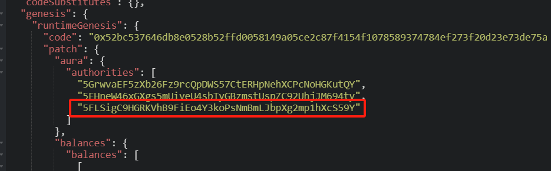
###### 用加密算法sr25519生成Charlie的公钥加入到gaura中
```bash
./target/release/solochain-template-node key inspect //Charlie --scheme ed25519
```
Secret Key URI `//Charlie` is account:
Network ID:        substrate
Secret seed:       0x072c02fa1409dc37e03a4ed01703d4a9e6bba9c228a49a00366e9630a97cba7c
Public key (hex):  0x439660b36c6c03afafca027b910b4fecf99801834c62a5e6006f27d978de234f
Account ID:        0x439660b36c6c03afafca027b910b4fecf99801834c62a5e6006f27d978de234f
Public key (SS58): 5DbKjhNLpqX3zqZdNBc9BGb4fHU1cRBaDhJUskrvkwfraDi6
SS58 Address:      5DbKjhNLpqX3zqZdNBc9BGb4fHU1cRBaDhJUskrvkwfraDi6
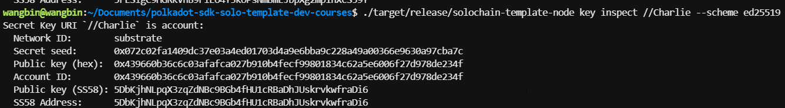
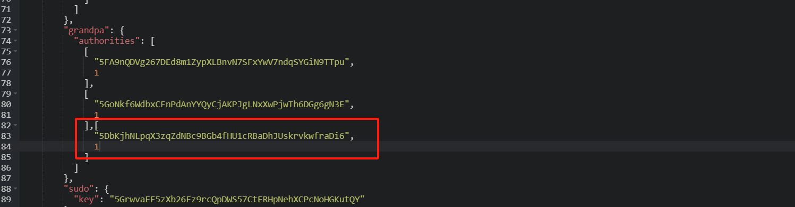
###### raw格式启动节点

```bash
./target/release/solochain-template-node build-spec --chain=localSpec.json --disable-default-bootnode --raw > rawLocalSpec.json
```
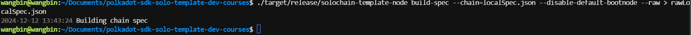

###### 指定rawLocaSpec.json 启动alice
```bash
./target/release/solochain-template-node --chain=rawLocalSpec.json --alice --tmp
```
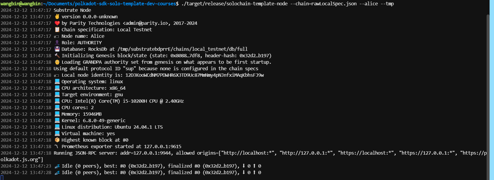
Local node identity is: 12D3KooWCdNM7PDWHR6X3TD9Uc87MmNmy4pNJnfxiMAqKbhsFJ9w
######  指定rawLocaSpec.json启动bob链
```bash
./target/release/solochain-template-node --chain=rawLocalSpec.json --bob --tmp --bootnodes /ip4/127.0.0.1/tcp/30333/p2p/12D3KooWCdNM7PDWHR6X3TD9Uc87MmNmy4pNJnfxiMAqKbhsFJ9w
```
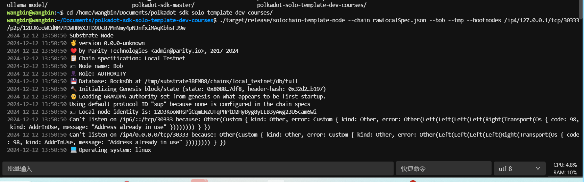

可以看到已经成功出块
###### 指定rawLocaSpec.json启动charlie链
```bash
./target/release/solochain-template-node --chain=rawLocalSpec.json --charlie --tmp --bootnodes /ip4/127.0.0.1/tcp/30333/p2p/12D3KooWCdNM7PDWHR6X3TD9Uc87MmNmy4pNJnfxiMAqKbhsFJ9w
```
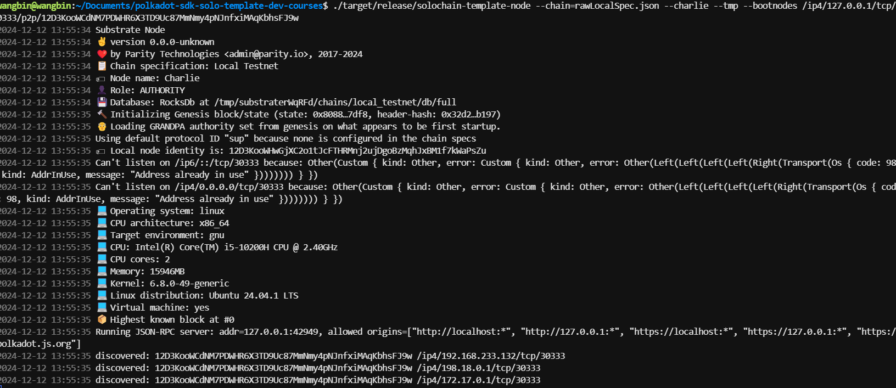
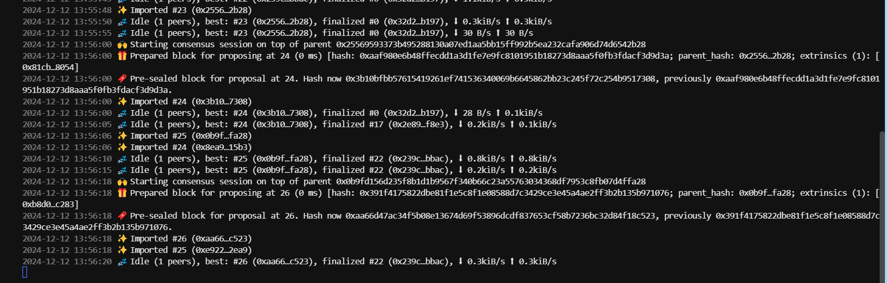
前端显示
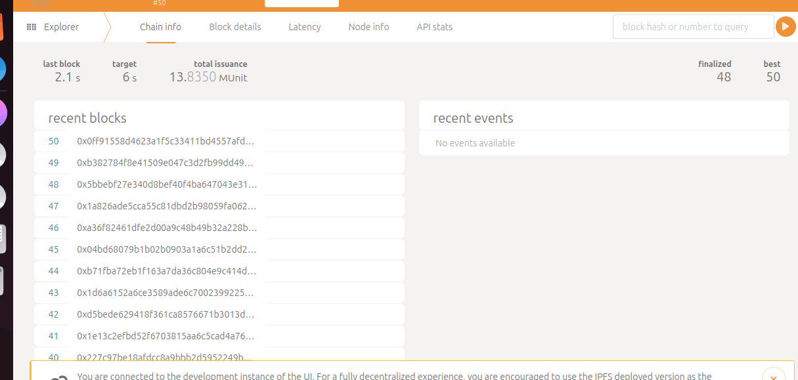
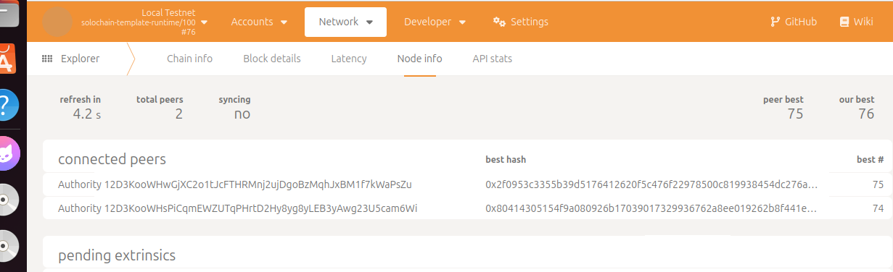