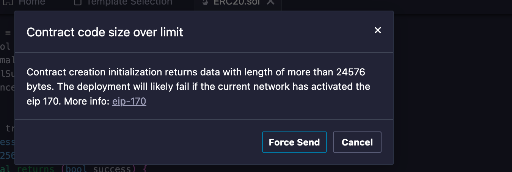

# ERC20

## 实操

```shell

~/Code/substrate-code via 🅒 base 
➜ 
mcd Explore-Substrate

Code/substrate-code/Explore-Substrate via 🅒 base 
➜ 
forge init SubstrateERC20Hub
Initializing /Users/qiaopengjun/Code/substrate-code/Explore-Substrate/SubstrateERC20Hub...
Installing forge-std in /Users/qiaopengjun/Code/substrate-code/Explore-Substrate/SubstrateERC20Hub/lib/forge-std (url: Some("https://github.com/foundry-rs/forge-std"), tag: None)
正克隆到 '/Users/qiaopengjun/Code/substrate-code/Explore-Substrate/SubstrateERC20Hub/lib/forge-std'...
警告：重定向到 https://ghp.ci/https://github.com/foundry-rs/forge-std/
remote: Enumerating objects: 1957, done.
remote: Counting objects: 100% (1952/1952), done.
remote: Compressing objects: 100% (734/734), done.
remote: Total 1957 (delta 1311), reused 1763 (delta 1171), pack-reused 5 (from 1)
接收对象中: 100% (1957/1957), 618.53 KiB | 553.00 KiB/s, 完成.
处理 delta 中: 100% (1311/1311), 完成.
    Installed forge-std v1.9.4
    Initialized forge project

Code/substrate-code/Explore-Substrate via 🅒 base took 24.2s 
➜ 
cd SubstrateERC20Hub/

SubstrateERC20Hub on  master via 🅒 base 
➜ 
c

SubstrateERC20Hub on  master via 🅒 base 
➜ 
```


忽略警告在polkadot.io 上部署成功了

- 0x0660c412bf2aca856ee119cEfdD155b24595a6CE

## 参考

- <https://contracts.polkadot.io/deploy-your-first-contract>
- <https://polkadot.com/blog/westend-introducing-a-new-testnet-for-polkadot-and-kusama>
- <https://www.mytokencap.com/zh/news/278998.html>
- <https://westend.subscan.io/>
- <https://portfolio.subscan.io/account/0x0660c412bf2aca856ee119cEfdD155b24595a6CE>
- <https://www.jinse.cn/blockchain/593398.html>
