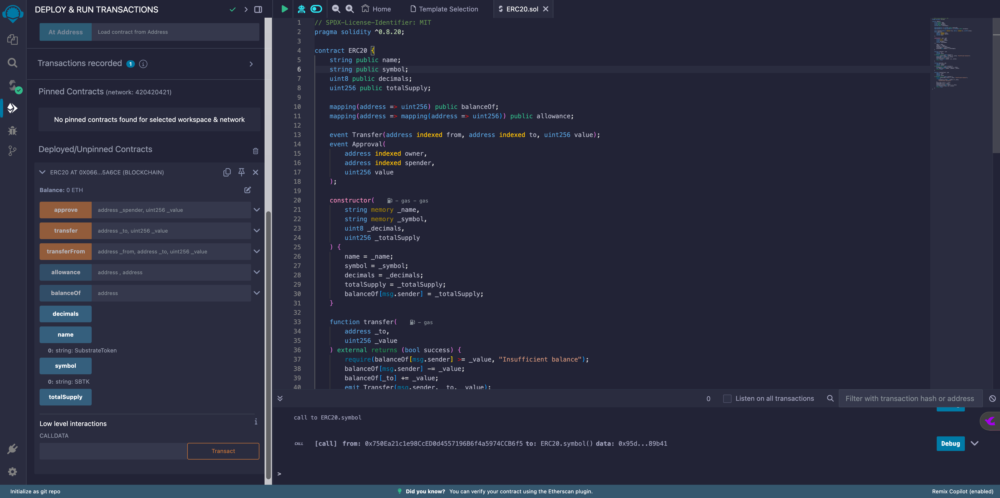

# homework

写一份ERC20合约，并且展示截图(包括代码部分和左下角部署后方法显示，代码可以不全)，可以用remix.ethereum.org，也可以用remix.polkadot.io

会使用hardhat或者fountry的同学也可以截图展示本地的编译结果（上传代码截图和hardhat或者foundry编译成功的页面，即运行npx hardhat compile或者forge build之后的页面）

