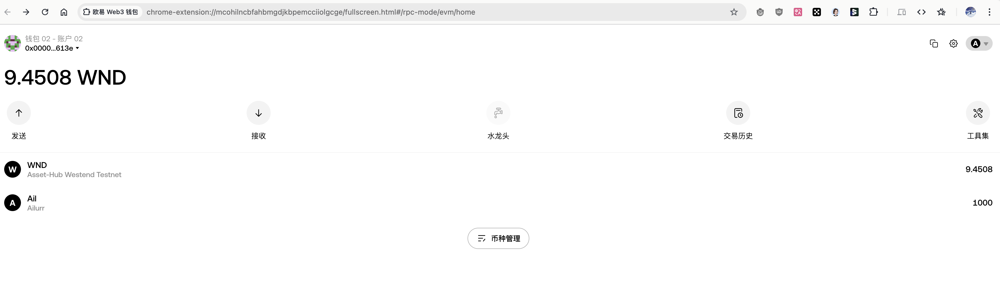

# 代码+部署成功截图


# 钱包内查看


# 日志详情
```
[block:10154551 txIndex:2]
from: 0x000...1613e
to: ERC20.(constructor)
value: 0 wei
data: 0x505...00000
logs: 0
hash: 0x256...67c43
status 0x1 Transaction mined and execution succeed
transaction hash 0xcdeb6bda8b0b3bc66c29ddf3868e6480c57ca073c71b455997e11346ba7f43f8
block hash 0x25658b0941a63966d4b788588535b6bc39705cd748dc04a3bec30df033e67c43
block number 10154551
contract address 0xa0a3feb35df6d6e623d49ed74c84fbc75647362c
from 0x00000007699893e07f12d7d35ac7e4534c31613e
to ERC20.(constructor)
gas 393044972732 gas
```
